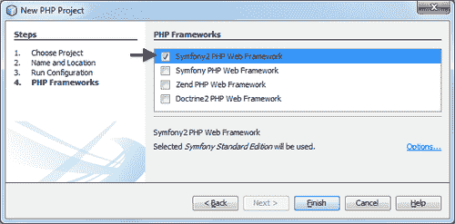
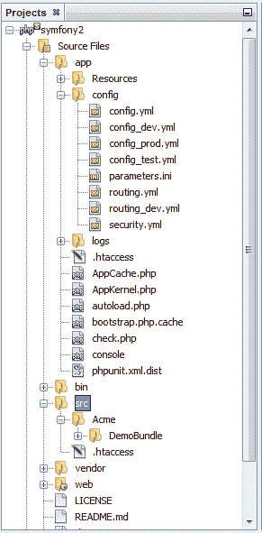
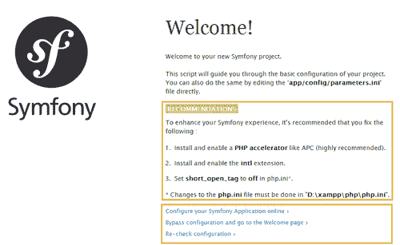
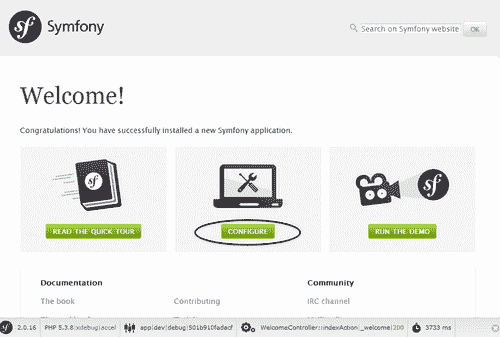
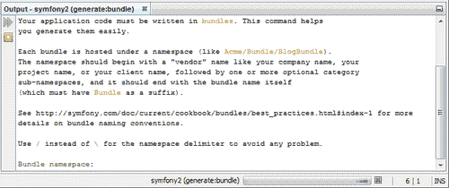
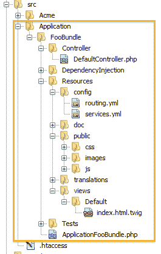

# 八、附录 A：在 NetBeans 7.2 中引入 Symfony2 支持

> Symfony 是一个 PHP 框架，允许您开发 web 应用程序。它对用 PHP 构建复杂的 web 应用程序有很大帮助。虽然 Symfony 设计用于命令行，但 NetBeans 7.2 对 Symfony 的支持允许您在 NetBeans 图形用户界面中使用它。

本教程演示了 NetBeans IDE 7.2 for PHP 中对 Symfony 框架的内置支持。它展示了如何设置 IDE 以使用 Symfony，如何创建使用 Symfony 框架的 PHP 项目，以及有关导航项目和设置 IDE 选项的许多提示。

# 下载并集成最新 Symfony 标准版

Symfony 标准版是启动新项目时使用的最佳发行版。它包含最常见的捆绑包，并附带一个简单的配置系统。

# 行动时间-将 Symfony2 与 NetBeans 集成

在本节中，我们将下载标准版并将归档集成到 IDE 中。让我们试试看。

1.  从[下载最新的 Symfony Standard 2.x.x.ziphttp://symfony.com/download](http://symfony.com/download) 。将 `.zip`存档保存到您的磁盘上；您不需要解压缩 `.zip`文件。
2.  检查为所有项目添加到 IDE 中的 PHP5 解释器。选择**工具【选项】【PHP】常规**，验证**PHP5 解释器**字段中添加的解释器路径。需要添加 PHP 解释器才能从 NetBeans 运行 Symfony 命令。
3.  现在，在 IDE 中提供 Symfony 标准版（`.zip`文件）的路径。选择**工具【选项】。浏览下载的 `symfony2 .zip`档案，按**确定**保存设置。**

## 刚才发生了什么事？

IDE 每次都会利用添加的 `symfony2`存档来提取和转储一个新的 Symfony 项目。下载的框架版包含演示 Symfony 应用程序。稍后，我们可以使用这些演示应用程序来更好地掌握 Symfony 框架。

### 注

您可以在[处选择多个下载选项 http://symfony.com/download](http://symfony.com/download) 。

# 新建 Symfony2 项目

由于我们已经将 Symfony2 框架安装档案与 IDE 集成，因此创建一个新的 Symfony2 项目与在 NetBeans 中创建一个新的 PHP 项目是一样的。IDE 使用安装档案并创建一个新的 PHP 项目，其中包含 Symfony 框架。

# 行动时间-使用 NetBeans 创建 Symfony2 项目

我们将创建一个支持 Symfony2 框架的新 PHP 项目。IDE 创建项目目录结构后，我们将配置 Symfony2 网站。那么我们来进行以下步骤：

1.  Create a brand new PHP project in the usual way, and in the step where you are asked to choose **PHP Frameworks**, check the **Symfony2 PHP Web Framework** checkbox, as shown in the following screenshot:

    

2.  As soon as you click on **Finish** in the **New Project Creation** dialog box, the IDE generates a new Symfony project and dumps the extracted framework inside. The created project directory may look similar to the following:

    

3.  Now, point your browser to `http://localhost/symfony2/web/config.php` (replace `symfony2` with your project directory name). The new, Symfony2 project configuration page will look similar to the following screenshot:

    

    您应该会看到来自 Symfony 的欢迎消息，以及它检测到的问题列表。继续之前，尝试解决**建议**部分中列出的任何重大环境问题。

4.  The Symfony framework provides a website configuration wizard. To enter the wizard, visit the **Configure your Symfony Application online** link, and configure your database credentials for the application. At this page, you may choose your database driver `(MySQL - PDO)`, update your database information, such as hostname, database name, username, and password, and proceed to the next step.

    如果您已经配置了应用程序，您可以选择**旁路配置并转到欢迎页面**链接。

5.  在下一步中，您可以为 web 应用程序生成并更新全局密码（随机字母数字字符串）。此密码用于安全目的，如 CSRF 保护。
6.  最后一步显示成功的配置消息，例如**您的分发已配置！**实际上，这样的配置已经覆盖了 `/app/config/`目录中的 `parameters.ini`文件。
7.  Now, point your browser to `http://localhost/symfony2/web/app_dev.php/` (replace `symfony2` with your project directory name). The new Symfony2 project landing page will look similar to the following screenshot:

    

## 刚才发生了什么事？

我们已经成功创建并配置了一个新的 Symfony 项目以及演示应用程序。Symfony2 项目的基本目录结构描述如下：

*   `app/:`这包括应用程序配置文件、日志、缓存等。
*   `src/:`这包括项目的 PHP 代码和代码所在的目录。最有可能的是，里面已经有一个演示。
*   `vendor/:`这包括第三方依赖关系。
*   `web/:`这包括 web 根目录。

### 注

Symfony 入门网站：

[http://symfony.com/get_started](http://symfony.com/get_started)

了解 Symfony 目录结构：

[http://symfony.com/doc/current/quick_tour/the_architecture.html](http://symfony.com/doc/current/quick_tour/the_architecture.html)

# 在 NetBeans 内运行 Symfony2 控制台命令

NetBeans IDE 支持运行 Symfony2 命令。要从 IDE 运行命令，请选择**Symfony2 | run Command。。。从项目的上下文菜单中选择**启动**运行 Symfony2 命令**对话框。在该对话框中，您可以选择所需的 Symfony 命令并添加参数。

例如：

```php
generate:bundle [--namespace="..."] [--dir="..."] [--bundle-name="..."] [--format="..."] [--structure]

```

`generate:bundle`命令帮助您生成新的捆绑包。默认情况下，该命令与开发人员交互以调整生成。任何通过的选项都将用作交互的默认值（`--namespace`是唯一需要的选项，如果您遵循约定）：

```php
php app/console generate:bundle --namespace=Acme/BlogBundle

```

这里， `Acme`是您的标识符或公司名称， `BlogBundle`是以字符串 `Bundle`为后缀的捆绑包名称。

## 创建捆绑包

**包**类似于其他软件中的插件，但更好。关键区别在于 Symfony2 中的所有内容都是一个捆绑包，包括核心框架功能和为应用程序编写的代码。bundle 是 Symfony2 的头等公民。这使您能够灵活地使用打包在第三方捆绑包中的预构建功能或分发自己的捆绑包。它使您可以轻松地选择在应用程序中启用哪些功能，并以您想要的方式对其进行优化。

捆绑包只是实现单个功能的目录中的一组结构化文件。您可以创建一个**BlogBundle**、一个**ForumBundle**或一个用于用户管理的 bundle（其中许多已经作为开源 bundle 存在）。每个目录都包含与该特性相关的所有内容，包括 PHP 文件、模板、样式表、JavaScript、测试等等。特性的每个方面都存在于一个捆绑包中，每个特性都存在于一个捆绑包中。

# 行动时间-使用 Symfony2 控制台命令创建捆绑包

我们将使用 IDE 的**运行 Symfony2 命令**对话框，使用 `generate:bundle`命令创建一个新的包。让我们试试。。。

1.  In the **Projects** pane, right-click on the **Projects** node, and from the context menu choose **Symfony2 | Run Command...** to launch the **Run Symfony2 Command** dialog box, as follows:

    

    您将能够在**匹配任务**框中看到可用命令的列表。您可以为这些命令添加参数，并在**命令**对话框中查看完整的命令。

2.  From the preceding dialog box, select the `generate:bundle` command and click on **Run**, or double-click on the listed name to run the command. The IDE's graphical console opens for prompting the namespace.

    

3.  输入**包名称空间**的值，如 `Application/FooBundle`。
4.  输入**捆绑包名称**的值或按*输入*接受默认捆绑包名称为 `ApplicationFooBundle`。
5.  在 `Target`目录下按*键并输入*，接受默认捆绑路径为 `/src`。
6.  您可以将**配置格式** `(yml, xml, php`或 `annotation)`的值输入为 `yml`；默认值为 `annotation`。
7.  为**输入**是**是否要生成整个目录结构【否】？**为捆绑包生成一个完整的目录结构；默认值为否。
8.  再次输入**是**确认捆绑生成。
9.  在**确认内核的自动更新【是】？**和**确认路由自动更新【是】？**，按*输入*接受默认值，为是。因此，捆绑包可以在 Symfony 内核中注册，捆绑包路由文件链接到默认路由配置文件。
10.  Now, as you can see, a new bundle has been created inside the `/src` directory; the `bundle` directory structure looks similar to the following:

    

    请注意，默认控制器、路由文件、模板等都是在创建捆绑包的同时创建的。

11.  现在，要测试您的捆绑包，请将浏览器指向 `http://localhost/symfony2/web/app_dev.php/hello/tonu`，您可能会看到类似于**Hello Tonu！**
12.  查看 `/src/Application/FooBundle/Resources/config/routing.yml`处的捆绑路由文件，您将看到模式 `/hello/{name}`与默认控制器的索引动作（`ApplicationFooBundle:Default:index`）映射的 URL。在本例中，该操作显示作为 URL 参数传递的名称，而不是 `{name}`。

## 刚才发生了什么事？

每个捆绑包托管在一个名称空间（如 `Acme/Bundle/BlogBundle`或 `Acme/BlogBundle)`）下。名称空间应以“供应商”名称开头，如您的公司名称、项目名称或客户名称，后跟一个或多个可选类别子名称空间，并应以捆绑包名称本身结尾（必须以 `Bundle`作为后缀）。

### 注

有关包命名约定的更多详细信息，请参见 `http://symfony.com/doc/current/cookbook/bundles/best_practices.html#index-1`。

我们已经看到了交互式控制台，它会自动请求参数并创建整个 `bundle`目录结构。此外，它将捆绑包注册到 Symfony 的 `/app/AppKernel.php`中，并将捆绑包路由配置文件链接到 `default/app/config/routing.yml`。

### 注

Symfony 学习资源：

[http://symfony.com/doc/current/book/index.html](http://symfony.com/doc/current/book/index.html)