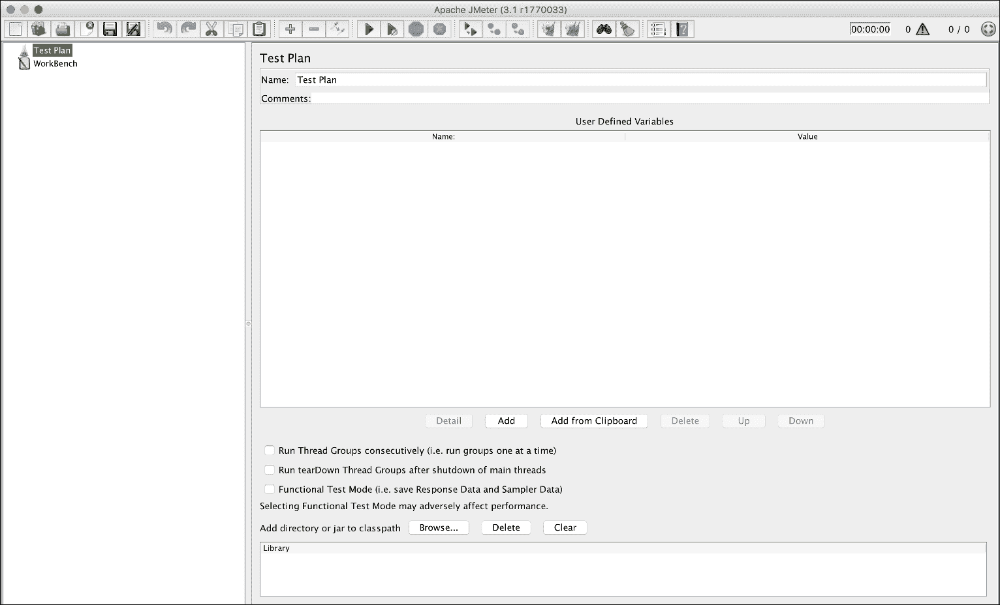
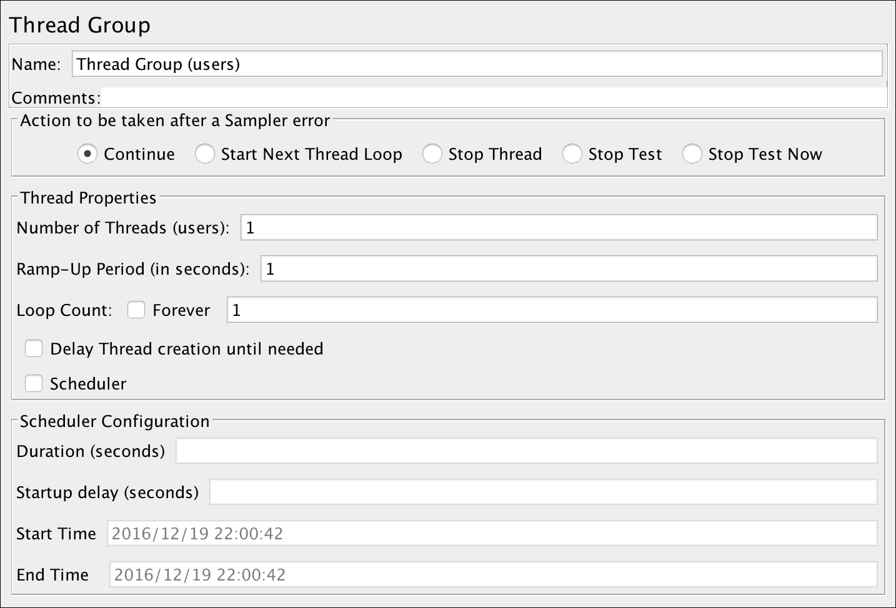
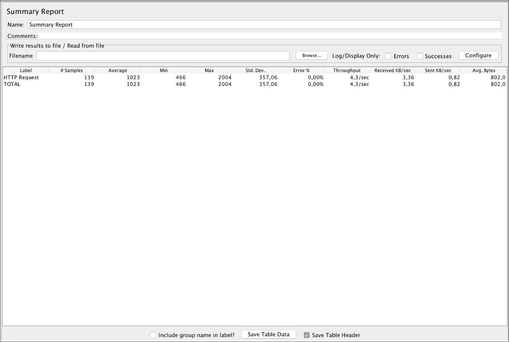
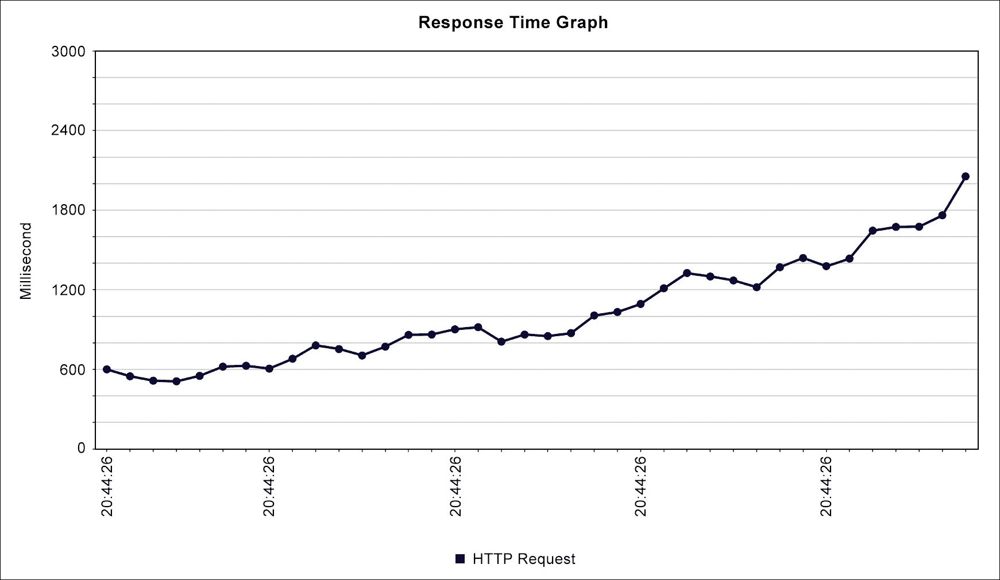

# 第 10 章可扩展性策略

你的申请已经准备好了。现在是规划未来的时候了。在本章中，我们将向您全面介绍如何检查应用程序的可能瓶颈以及如何计算应用程序的容量。在本章末尾，您将掌握创建自己的可伸缩性计划的基本知识。

# 产能规划

**容量规划**是确定应用程序所需的基础设施资源以满足应用程序未来工作负载需求的过程。此过程确保您只有在需要时才有足够的资源可用，从而将成本降至最低。如果您知道应用程序的使用方式以及当前资源的限制，那么您可以推断数据并或多或少地了解未来的需求。为您的应用程序创建容量计划有一些好处，其中我们可以强调以下几点：

*   **最大限度地降低成本并避免过度资源调配造成的浪费**：您的应用程序将只使用所需的资源，因此，例如，当您仅使用 8 GB 时，为您的数据库提供 64 GB RAM 服务器是没有意义的。
*   **防止瓶颈并节省时间**：当基础设施的每个元素达到峰值时，您的容量计划会突出显示，为您提示瓶颈可能出现的位置。
*   **提高业务生产率**：如果您有一个详细的计划，指出基础架构中每个元素的限制，并知道每个元素何时会达到其限制，那么它将为您提供将时间用于其他业务任务的空余空间。在您需要增加应用程序容量的确切时刻，您将有一组说明要遵循。当你遇到瓶颈，不知如何是好时，再也没有疯狂的时刻了。
*   **用作业务目标映射**：如果您的应用程序对您的业务至关重要，则本文档可用于突出显示某些业务目标。例如，如果业务部门希望达到 1000 个用户，则需要允许您的基础架构支持他们，并标记满足此要求所需的一些投资。

## 了解您的应用程序的限制

了解应用程序的限制的主要目的是在开始出现问题之前，了解在任何给定的时间点我们还有多少容量。我们需要做的第一件事是创建应用程序组件的清单。使库存尽可能详细；它将帮助您了解项目中的所有工具。在我们的示例应用程序中，不同组件的列表可能类似于以下内容：

*   自动发现服务：
    *   哈希科领事
*   遥测服务：
    *   普罗米修斯
*   战斗微服务：
    *   代理：NGINX
    *   应用程序引擎：PHP7FPM
    *   数据存储：Percona
    *   缓存存储：Redis
*   位置微服务：
    *   代理：NGINX
    *   应用程序引擎：PHP7FPM
    *   数据存储：Percona
    *   缓存存储：Redis
*   秘密微服务：
    *   代理：NGINX
    *   应用程序引擎：PHP7FPM
    *   数据存储：Percona
    *   缓存存储：Redis
*   用户微服务：
    *   代理：NGINX
    *   应用程序引擎：PHP7FPM
    *   数据存储：Percona
    *   缓存存储：Redis

一旦我们将应用程序缩减到基本组件，我们就需要分析并确定每个组件随时间的使用情况以及在适当的度量中的最大容量。

一些组件可以有多个相关的度量，例如，数据存储层（在我们的例子中是 Percona）。对于这个组件，我们可以测量 SQL 事务的数量、使用的存储量、CPU 负载等。在前面的章节中，我们添加了遥测服务；您可以使用此服务从每个组件收集基本统计信息。

您可以为应用程序的每个组件记录的一些基本统计信息如下所示：

*   CPU 负载
*   内存使用
*   网络使用
*   眼压
*   磁盘利用率

在某些软件中，您需要收集一些特定的测量值。例如，在数据库上，可以检查以下内容：

*   每秒事务数
*   缓存命中率（如果已启用查询缓存）
*   用户连接

下一步是确定应用程序的自然增长。如果没有做任何特别的事情（如 PPC 活动和新功能），则可以将此度量定义为应用程序执行的增长。例如，此度量可以是新用户的数量或活动用户的数量。假设您将应用程序部署到生产环境中，并停止添加新功能或进行营销活动。如果新用户的数量在上个月增加了 7%，那么这个数量就是应用程序的自然增长。

某些业务/项目具有季节性趋势，这意味着在特定日期，应用程序的使用量会增加。假设你是一个礼品零售商，你的大部分销售可能在情人节前后或年底（黑色星期五，圣诞节）完成。如果这是您的情况，请分析所有数据，以建立季节性数据。

现在您已经有了应用程序的一些基本统计信息，现在是时候计算所谓的净空了。净空空间可以定义为在资源耗尽之前您拥有的资源量。可采用以下公式计算：


净空公式

从前面的公式中可以看出，计算特定组件的净空非常简单。在举例之前，让我们先解释一下每个变量：

*   **idealuage:**这是一个百分比，用于描述我们计划使用的应用程序特定组件的容量。这种理想的用法永远不应该是 100%，因为当您接近资源限制时，可能会出现奇怪的行为，例如无法在数据库中保存数据。我们的建议是将该值设置在 60%到 75%之间，为高峰时刻提供足够的额外空间。
*   **最大容量：**这是表示我们研究的组成主体的最大容量的量。例如，可以管理多达 250 个并发连接的 web 服务器。
*   **当前使用情况：**这是表示我们正在研究的组件当前使用情况的数量。
*   **增长：**这是表示我们的应用程序自然增长的百分比。
*   **优化：**这是一个可选变量，用于描述我们在特定时间内可以实现的优化量。例如，如果您当前的数据库每秒可以管理 35 个查询，那么经过一些优化后，您可以达到每秒 50 个查询。在这种情况下，优化量为 15。

假设您正在计算每秒可由我们的一个 NGINX 管理的请求的净空。对于我们的应用程序，我们决定将理想用法设置为 60%（0.6）。根据我们的测量和从负载测试中提取的数据（在本章后面解释），我们知道每秒**请求**（**RPS**的最大数量为 215。在我们目前的统计数据中，我们的 NGINX 服务器今天达到了 193 RPM 的峰值，我们计算出明年的增长率至少为 11 RPM。

我们要测量的时间段为 1 年，我们认为在这段时间内我们可以达到最大容量的 250 转/秒，因此我们的净空值如下：

*净空=0.6*215-123-（11-35）=30 转*

这个计算意味着什么？由于结果是肯定的，这意味着我们有足够的空间进行预测。如果我们将结果除以增长和优化的总和，我们就可以计算出到达极限的时间。

由于我们的时间期限为 1 年，因此我们可以计算我们达到极限前的时间，如下所示：

*净空时间=30 转/24=1.25 年*

正如您可能已经推断的那样，我们还有 1.25 年的时间，我们的 NGINX 服务器才能达到 RPS 的极限。在本节中，我们向您展示了如何计算特定组件的净空；现在，轮到您为每个组件以及每个组件可用的不同度量进行计算。

## 可用性数学

**可用性**可以定义为站点在特定时间段内可用的频率，例如，一周、一天、一年等。根据应用程序对您或您的业务的重要性，停机时间可能等于收入损失。正如您所设想的，在客户/用户使用您的应用程序并且他们随时需要您的服务的情况下，可用性可能成为最重要的指标。

我们有什么是可用性的理论概念。是时候做点数学了，带上你的计算器吧。根据前面的一般定义，可用性可以计算为用户/客户可以使用应用程序的时间量除以时间范围（我们正在测量的特定时间段）。

让我们设想一下，我们希望在一周内测量应用程序的可用性。一周内，我们有`10,080`分钟：

*7 天 x 24 小时/天 x 60 分钟/小时=7*24*60=**10080 分钟***

现在，假设您的应用程序在该周发生了几次停机，并且应用程序的可用分钟数减少到了`10,000`。要计算示例的可用性，我们只需要做一些简单的数学：

*10000/10080=0.9920634921*

可用性通常以百分比（%）衡量，因此我们需要将结果转换为百分比：

*0.9920634921*100=99.20634921%～**99.21***

本周我们的申请可用性为`99.21%`。还不算太糟，但离我们的目标还很远，也就是说，我们能得到的最接近`100%`的百分比。大多数情况下，可用性百分比指的是**的 9 位数**，它们越接近`100%`，维护应用程序的可用性就越困难。为了让您概括了解实现`100%`可用性的难度，以下是可用性和可能的停机时间的一些示例：

*   99.21%（我们的例子）：
    *   每周：1 小时 19 米 37.9 秒
    *   每月：5 小时 46 米 15.0 秒
    *   年：69 小时 14 米 59.9 秒
*   99.5%:
    *   每周：50 米 24.0 秒
    *   每月：3 小时 39 米 8.7 秒
    *   年：43 小时 49 米 44.8 秒
*   99.9%:
    *   每周：10 米 4.8 秒
    *   每月：43 米 49.7 秒
    *   年：8 小时 45 米 57.0 秒
*   99.99%:
    *   每周：1 米 0.5 秒
    *   每月：4 米 23.0 秒
    *   年：52 米 35.7 秒
*   99.999%:
    *   每周：6.0 秒
    *   每月：26.3 秒
    *   年：5 米 15.6 秒
*   99.9999%:
    *   每周：0.6 秒
    *   每月：2.6 秒
    *   年：31.6 秒
*   99.99999%:
    *   每周：0.1 秒
    *   每月：0.3 秒
    *   年：3.2 秒

正如您所见，随着越来越接近可用性，停机时间也越来越紧。然而，如何减少停机时间，或者至少确保尽最大努力将停机时间保持在较低水平？这个问题没有简单的答案，但我们可以给您一些提示，说明您可以做的不同事情：

*   最坏的情况可能会发生，因此您应该经常模拟故障，以准备应对应用程序的灾难。
*   找出应用程序可能存在的瓶颈。
*   到处都有测试、测试和更多的测试，当然，还要不断更新它们。
*   记录任何事件、任何度量、任何可以测量或另存为日志的内容，并将其保留以备将来参考。
*   了解应用程序的限制。
*   有一些好的开发实践，至少可以分享应用程序是如何构建的。其中，您可以执行以下操作：
    *   任何修补程序或功能的第二次批准
    *   成对编程
*   创建一个连续的交付管道。
*   制定备份计划，确保备份安全，随时可用。
*   记录所有内容，任何小的变更或设计，并始终保持文档的最新状态。

现在，您可以全面了解**可用性**的含义以及每种速率的最大预期停机时间。如果您向用户/客户提供 SLA（服务级别协议），请小心，因为您将创建一个关于应用程序可用性的承诺，您必须履行该承诺。

# 负载测试

负载测试可以定义为将需求（负载）放入应用程序以测量其响应的过程。此过程可帮助您确定应用程序或基础架构的最大容量，并可突出显示应用程序或基础架构的瓶颈或问题元素。进行负载测试的正常方法是首先在“正常”条件下进行测试，即在应用程序中使用正常负载。在正常条件下测量系统的响应可以让您有一个基线，用于在将来的测试中进行比较。

让我们看看一些最常用的负载测试工具。有些简单易用，而另一些则更为复杂和强大。

## 阿帕奇 JMeter

ApacheJMeter 应用程序是一个用 Java 构建的开源软件，旨在进行负载测试和性能测量。起初，它是为 web 应用程序设计的，但后来被扩展以及时测试其他功能。

Apache JMeter 的一些最有趣的功能如下：

*   支持不同的应用程序/服务器/协议：HTTP、SOAP/Rest、FTP、LDAP、TCP 和 Java 对象。
*   易于与第三方持续集成工具集成：它有 Maven、Gradle 和 Jenkins 的库。
*   命令行模式（非 GUI/无头模式）：这使您能够在安装 Java 的任何操作系统上进行测试。
*   多线程框架：这允许您通过多个线程进行并发采样，并通过单独的线程组同时采样不同的函数。
*   高度可扩展性：它可以通过库或插件等进行扩展。
*   功能齐全的测试 IDE：它允许您创建、记录和调试测试计划。

正如您所看到的，这个项目是一个有趣的工具，您可以在加载测试中使用它。在以下部分中，我们将向您展示如何构建一个简单的测试场景。不幸的是，书中没有足够的篇幅来涵盖所有的特性，但至少你会知道一些基础知识，这些基础知识将是未来更复杂测试的基础。

### 安装 ApacheJMeter

通过 Java 开发，该应用程序可以移植到安装了 Java 的任何操作系统上。让我们把它安装到我们的开发机器上。

第一步是满足主要需求——需要 JVM 6 或更高版本才能使应用程序正常工作。您的机器中可能已经有 Java，但如果不是这样，您可以从 Oracle 页面下载最新的 JDK。

要检查 Java 运行时的版本，只需在操作系统中打开终端并执行以下命令：

```php
java -version

```

前面的命令将告诉您计算机中可用的版本。

一旦我们确定了正确的版本，我们只需要转到正式的 ApacheJMeter 页面（[http://jmeter.apache.org](http://jmeter.apache.org) ）下载 ZIP 或 TGZ 格式的最新二进制文件。一旦二进制文件完全下载到您的机器上，您只需要解压缩下载的 ZIP 或 TGZ，apachejmeter 就可以使用了。

### 使用 ApacheJMeter 执行负载测试

打开解压 ApacheJMeter 二进制文件的文件夹。在那里，你可以找到一个`bin`文件夹和一些不同操作系统的脚本。如果您使用的是 Linux/UNIX 或 Mac OS，则可以执行`jmeter.sh`脚本打开应用程序 GUI。如果您正在运行 Windows，则可以使用`jmeter.bat`可执行文件打开 GUI：



ApacheJMeterGUI

ApacheJMeterGUI 允许您构建不同的测试计划，正如您在前面的屏幕截图中所看到的，即使不阅读手册，界面也非常容易理解。让我们用 GUI 构建一个测试计划。

### 提示

测试计划可以描述为 ApacheJMeter 将按特定顺序运行的一系列步骤。

创建测试计划的第一步是在**测试计划**节点下添加**线程组**。在 ApacheJMeter 中，线程组可以定义为并发用户的模拟。按照给定的步骤创建新组：

1.  右键点击**测试计划**节点。
2.  在关联菜单中，选择**添加****线程（用户）****线程组**。

前面的步骤将在我们的**测试计划**节点中创建一个子元素。选择它，以便我们可以对组进行一些调整。请参阅以下屏幕截图：



线程组设置

正如您在前面的屏幕截图中所看到的，每个线程组都允许您指定测试的用户数量和测试的持续时间。可用的主要选项如下所示：

*   **样本错误后要采取的操作：**此选项允许您在抛出样本错误后立即控制测试的行为。最常用的选项是**继续**行为。
*   **线程数（用户）：**此字段允许您指定用于访问应用程序的并发用户数。
*   **爬升周期（以秒为单位）：**此字段用于告诉 ApacheJMeter 创建上一字段中指定的所有线程所需的时间。例如，如果将此字段设置为 60 秒，并且将**线程数（用户）**设置为 6，Apache JMeter 将花费 60 秒来启动所有 6 个线程，每 10 秒一个。
*   **循环计数和永久：**这些字段允许您在执行特定次数后停止测试。

剩下的选项是不言自明的，在我们的示例中，我们将只使用提到的字段。

假设您想要使用 25 个线程（像用户一样），并将爬升设置为 100 秒。数学将告诉您每 4 秒将创建一个新线程，直到 25 个线程运行（100/25=4）。这两个字段允许您将测试设计为缓慢启动，并增加在正确时间访问应用程序的用户数量。

一旦定义了线程/用户，就应该添加请求了，因为如果没有请求，我们的测试将一事无成。要添加请求，只需选择线程组节点，右键点击关联菜单，选择**添加****采样器****HTTP 请求**。前面的操作将向线程组添加一个新的子节点。选择新节点 ApacheJMeter 将显示一个类似于以下屏幕截图的表单：


HTTP 请求选项

正如您在前面的屏幕截图中所看到的，我们可以设置我们想要进行测试的主机。在我们的例子中，我们决定通过对`/api/v1/secret/`路径的`GET`请求在端口`8083`上点击`localhost`。请随意探索高级选项或添加自定义参数。ApacheJMeter 非常灵活，几乎涵盖了所有可能的场景。

在这一点上，我们已经建立了一个基本的测试，现在是时候看看结果了。让我们探索一些有趣的方法来收集测试信息。为了查看和分析测试每次迭代的结果，我们需要添加一个**监听器**。为此，与前面的步骤一样，右键单击**线程组**并导航到**添加【监听器】查看表**中的结果。此操作将向我们的测试添加一个新节点，一旦我们开始测试，结果将显示在应用程序中。

如果您在**线程组**中选择了**永久**选项，则需要手动停止测试。您可以在绿色播放旁边显示红十字图标。此按钮将停止等待每个线程结束其操作的测试。如果单击停止图标，ApacheJMeter 将立即杀死所有线程。

让我们尝试一下，然后单击绿色播放图标开始测试。点击您的**查看表**节点中的结果，您将看到所有测试结果出现：


ApacheJMeter 结果在表中

正如您在前面的屏幕截图中所看到的，ApacheJMeter 为每个请求记录不同的数据，例如发送/返回的字节数、状态或请求延迟等。当您更改负载量时，分析应用程序的行为时，所有这些数据都很有趣。使用此侦听器，您甚至可以导出数据，以便使用外部工具分析结果。

如果您没有用于分析数据的外部工具，但是您希望有一些基本的统计数据与您将应用程序公开到的不同负载进行比较，那么您可以添加另一个有趣的侦听器。和前面一样，打开**线程组**的右键点击上下文菜单，导航到`Add`**监听器**`Summary Report`。此侦听器将为您提供一些基本统计信息，您可以使用这些信息来比较结果：



ApacheJMeter 摘要报告

正如您从前面的屏幕截图中所看到的，这位听众已经给了我们一些测量值的平均值。

使用表格显示结果是很好的。然而，我们都知道，一张图片胜过千言万语，所以让我们添加一些图形侦听器，以便您可以完成负载测试报告。右键点击**线程组**，在关联菜单中，进入**添加****监听器****响应时间图**。您将看到一个类似于以下屏幕的屏幕：


ApacheJMeter 响应时间图

请随意对默认设置进行一些更改。例如，您可以减少**间隔（毫秒）**。如果再次运行测试，测试生成的所有数据将用于生成一个漂亮的图形，如以下图形：



响应时间图

从测试结果生成的图中可以看出，线程（用户）的增加会导致响应时间的增加。你认为这意味着什么？如果您说我们的测试基础设施需要扩展以适应负载的增加，那么您的回答是正确的。

ApacheJMeter 提供了多个选项来创建加载测试。我们只向您展示了如何创建基本测试以及如何查看结果。现在，轮到您探索所有可用于创建高级测试的不同选项，并发现哪些功能更适合您的项目。让我们看看其他一些可以用于负载测试的工具。

## 火炮载荷试验

**carols**是一个开源工具包，您可以使用它对应用程序进行负载测试，它类似于 ApacheJMeter。在其他功能中，我们可以强调此工具的以下优点：

*   支持多种协议，并且 HTTP（S）或 WebSocket 是现成的
*   易于与实时报告软件或服务（如 DataDog 和 XDB）集成
*   高性能，因此可以在商品硬件/服务器上使用
*   非常容易扩展，因此可以根据您的需要进行调整
*   具有详细性能指标的不同报告选项
*   非常灵活，因此您几乎可以测试任何可能的场景

### 安装火炮

Carols 是在 node.js 上构建的，所以主要的需求是将这个运行时安装在您将用来启动测试的机器上。

我们喜欢集装箱化技术，但不幸的是，如果没有肮脏的黑客，在码头上使用火炮是不容易的。在任何情况下，如果您可以启动负载测试，我们建议您使用专用 VM 或服务器。

要使用 Canollers，您需要在 VM/服务器中使用 node.js，该软件非常容易安装。我们不会解释如何创建本地 VM（您可以使用 VirtualBox 或 VMWare 创建一个），我们只会向您展示如何在 RHEL/CentOS 上安装它。对于其他操作系统和选项，您可以在 node.js 文档（[中找到详细信息 https://nodejs.org/en/download/](https://nodejs.org/en/download/) ）。

打开 RHEL/CentOS VM 或服务器的终端，下载 LTS 版本的安装脚本：

```php
curl --silent -location  https://rpm.nodesource.com/setup_6.x | bash -

```

上一个命令完成后，您需要以 root 用户身份执行下一个命令，如以下命令所示：

```php
yum -y install nodejs

```

执行前面的命令后，您将在 VM/服务器中安装并准备好 Node.js。现在是使用 Node.js 包管理器安装火炮的时候了，`npm`命令。在终端中，执行以下命令以安装：

```php
npm install -g artillery

```

一旦上一个命令完成，你将有炮兵准备使用它。

我们能做的第一件事是检查火炮是否正确安装，是否可用。输入以下命令以执行此操作：

```php
artillery dino

```

前面的命令将向您展示一只可爱的恐龙，这意味着火炮已准备就绪。

### 用火炮进行载荷试验

炮兵是一个非常灵活的工具包。您可以从控制台运行测试，也可以拥有描述测试场景的 YAML 或 JSON 文件并运行它们。请注意，在我们下面的示例中，我们使用`microservice_secret_nginx`作为我们要测试的主机，您需要将此主机调整为您本地环境的 IP 地址。让我们给你一个偷窥这个工具；在负载测试 VM/服务器中运行以下命令：

```php
artillery quick --duration 30 --rate 5 -n 1  
http://microservice_secret_nginx/api/v1/secret/

```

上述命令将在 30 秒内执行快速测试。在这段时间里，炮兵将创建五个虚拟用户；它们中的每一个都将对提供的 URL 执行一个 GET 请求。一旦执行上述命令，炮兵将开始测试，并每隔 10 秒打印一些统计数据。测试结束时（30 秒），此工具将向您显示一个类似于以下报告的小报告：

```php
Complete report @ 2016-12-17T16:09:34.140Z
  Scenarios launched:  150
  Scenarios completed: 150
  Requests completed:  150
  RPS sent: 4.87
  Request latency:
    min: 578.1
    max: 1223.7
    median: 781.5
    p95: 1146.5
    p99: 1191.1
  Scenario duration:
    min: 583.2
    max: 1226.8
    median: 786.1
    p95: 1150
    p99: 1203.8
  Scenario counts:
    0: 150 (100%)
  Codes:
    200: 150

```

前面的报告非常容易理解，并向您概述了基础设施和应用程序的运行情况。

在我们开始分析炮兵报告之前，您需要了解的一个基本概念是场景的概念。简单地说，**场景**是一系列您想要测试的任务或动作，它们是相关的。假设您有一个电子商务应用程序；测试场景可以是用户在完成购买之前执行的所有步骤。考虑下面的例子：

1.  用户加载主页。
2.  用户搜索产品。
3.  用户将产品添加到购物篮中。
4.  用户转到结帐台。
5.  用户进行购买。

所有提到的操作都可以转换为对应用程序的请求，以模拟用户操作，这意味着场景是一组请求。

现在我们已经清楚了这个概念，我们可以开始分析火炮的报告输出了。在我们的示例中，我们只有一个场景，其中只有一个请求（`GET`到`http://microservice_secret_nginx/api/v1/secret/`。此测试场景由五个虚拟用户执行，他们仅发出一个`GET`请求，持续 30 秒。一个简单的数学计算，`5 * 1 * 30`为我们提供了测试的场景总数（`150`，这与我们案例中的请求数量相同。`RPS sent`字段提供测试服务器在测试期间每秒发出的平均请求。这不是一个非常重要的领域，但它让您了解测试是如何执行的。

让我们检查炮兵提供的`Request latency`和`Scenario duration`统计数据。您需要知道的第一件事是，这些组中的所有度量值都以毫秒为单位。

在`Request latency`的情况下，数据显示了我们的应用程序处理我们发送的请求所用的时间。两个重要的统计数据是 95%（T1）和 99%（T2）。正如您可能已经知道的那样，百分比是统计中使用的一种度量，它指示给定百分比的观察值。从我们的示例中，我们可以看到 95%的请求是在 1146.5 毫秒或更短的时间内处理的，或者 99%的请求是在 1191.1 毫秒或更短的时间内处理的。

在我们的示例中，`Scenario duration`中显示的统计数据与`Request latency`几乎相同，因为每个场景仅由一个请求构成。如果创建更复杂的场景，每个场景上都有多个请求，则两个组的数据将不同。

### 创建炮兵脚本

正如我们之前告诉您的，Carols 允许您使用负载测试场景创建 YAML 或 JSON 文件。让我们将我们的快速示例转换为 YAML 文件，以便您可以将其保存在存储库中以备将来执行。

为此，您只需在我们的测试容器中创建一个名为`test-secret.yml`的文件，其内容如下：

```php
config:
 target: 'http://microservice_secret_nginx/'
 phases:
 - duration: 30
 arrivalRate: 5

scenarios:
 - flow:
 - get:
 url: "api/v1/secret/"

```

正如您在前面的代码中所看到的，它类似于我们的`artillery quick`命令，但现在您可以将它们存储在代码库中，以便对应用程序反复运行它。

您可以使用`artillery run test-secret.yml`命令运行测试，结果应该与 quick 命令生成的结果相似。

Docker 容器映像附带了所需的最少软件，因此您可能无法在负载测试映像中找到文本编辑器。在本书的这一点上，您将能够创建一个 Docker 卷，并将其附加到我们的测试容器中，以便共享文件。

### 高级脚本

该工具包突出显示的一个功能是能够创建自定义脚本，但您不仅附加到 fire 静态请求。此工具允许您使用外部 CSV 文件、解析 JSON 响应或脚本中的内联值来随机化请求。

假设您希望测试负责在应用程序中创建新帐户的 API 端点，而不是使用 YAML 文件，而是使用 JSON 脚本。您可以将外部 CSV 文件与要在测试中使用的用户数据一起使用，并进行以下调整：

```php
    "config": {
      "payload": {
        "path": "./relative/path/to/test-data.csv",
        "fields": ["name", "surname", "email"]
      }
    }
    // ... omitted config ...//
    "scenarios": [
      {
        "flow": [
          {
            "post": {
              "url": "/api/v1/user",
              "json": {
                "name": {{ name }}, 
                "surname": {{ surname }},
                "email": {{ email }}
              }
            }
          }
        ]
      }
    ]
```

前面的`config`字段将告诉炮兵我们的 CSV 文件位于何处以及 CSV 中使用的不同列。一旦我们设置了外部文件，我们就可以在场景中使用这些数据。在我们的示例中，炮兵将从`test-data.csv`中随机选取行，并使用该数据生成对`/api/v1/user`的 post 请求。来自`payload`的字段将创建我们可以使用的变量，例如 `{{ variableName }}`。

创建这类脚本似乎很容易，但是在创建脚本的某个时候，您需要一些调试信息来了解脚本正在做什么。如果要查看每个请求的详细信息，可以按如下方式运行脚本：

```php
DEBUG=http artillery run test-secret.yml

```

如果您还想查看响应，可以按如下方式运行负载测试脚本：

```php
DEBUG=http:response artillery run myscript.yaml

```

不幸的是，书中没有足够的篇幅详细介绍火炮的所有可用选项。然而，我们想向您展示一个有趣的工具，您可以使用它进行负载测试。如果您需要更多信息，或者即使您想为项目做出贡献，您只需进入项目页面（[https://artillery.io](https://artillery.io) ）。

## 带围城的负载测试

Sakege 是一个有趣的多线程 HTTP（s）负载测试和基准测试工具。与其他工具相比，它看起来小而简单，但它高效且易于使用，例如，对您的最新更改进行快速测试。此工具允许您使用可配置数量的并发虚拟用户访问 HTTP（S）端点，并可在三种不同模式下使用：回归、Internet 模拟和暴力。

Sakege 是为 GNU/Linux 开发的，但它已成功移植到 AIX、BSD、HP-UX 和 Solaris。如果您想编译它，那么在大多数 SystemV UNIX 变体和最新的 BSD 系统上不应该有任何问题。

### 在 RHEL、CentOS 和类似操作系统上安装围城

如果在启用 extras 存储库的情况下使用 CentOS，则可以使用以下简单命令安装 EPEL repo：

```php
sudo yum install epel-release

```

一旦你有了 EPEL 回购协议，你只需要做一个`sudo yum install siege`就可以在你的操作系统中使用这个工具。

有时，`sudo yum install epel-release`命令不起作用，例如，当您不使用 Centos 时，您的发行版是 RHEL 或类似的发行版。在这些情况下，您可以使用以下命令手动安装 EPEL 存储库：

```php
wget https://dl.fedoraproject.org/pub/epel/epel-release-latest-7.noarch.rpm
sudo rpm -Uvh epel-release-latest-7*.rpm

```

一旦 EPEL 存储库在您的操作系统中可用，您可以使用以下命令`install siege`：

```php
sudo yum install siege

```

### 在 Debian 或 Ubuntu 上安装围城

围城是非常容易安装在 Debian 或 Ubuntu 的官方存储库。如果您拥有这些 OSs 的最新版本之一，则只需执行以下命令：

```php
sudo apt-get update
sudo apt-get install siege

```

上述命令将更新您的系统并安装`siege`软件包。

### 在其他操作系统上安装攻城

如果您的操作系统没有在前面的步骤中介绍，您可以通过编译源代码来实现，互联网上有很多 how-to 解释您需要做什么。

### 快速攻城示例

让我们为其中一个端点创建一个快速文本。在本例中，我们将在 30 秒内测试 50 个并发用户的端点。打开已安装机器的终端，然后键入以下命令。请随意将命令更改为正确的主机或端点：

```php
siege -c50 -d10 -t30s http://localhost:8083/api/v1/secret/

```

以下几点说明了上述命令：

*   `-c50`：创建 50 个并发用户
*   `-d10`：将每个模拟用户延迟 1 到 10 之间的随机秒数
*   `-t30s`：运行测试的时间；我们的情况是 30 秒
*   `http://localhost:8083/api/v1/secret/`：待测终点

当您点击*回车*时，`siege`命令将开始向您的服务器发出请求，您将获得类似于以下输出的输出：

```php
filloa:~ psolar$ siege -c50 -d10 -t30s  http://localhost:8083/api/v1/secret/
** SIEGE 3.1.3
** Preparing 50 concurrent users for battle.
The server is now under siege...
HTTP/1.1 200   0.50 secs:     577 bytes ==> GET  /api/v1/secret/
/** ... omitted lines ... **/
Lifting the server siege...      done.

```

大约 30 秒后，Sakege 将停止请求并向您显示一些统计信息，例如以下统计信息：

```php
Transactions:                149 hits
Availability:                100.00 %
Elapsed time:                29.91 secs
Data transferred:            0.08 MB
Response time:               3.33 secs
Transaction rate:            4.98 trans/sec
Throughput:                  0.00 MB/sec
Concurrency:                 16.57
Successful transactions:     149
Failed transactions:         0
Longest transaction:         5.89
Shortest transaction:        0.50

```

从前面的结果中，我们可以得出结论，所有请求都正常，没有一个请求失败，平均响应时间为 3.33 秒。如您所见，此工具更简单，可以在日常基础上使用它来检查您的应用程序开始抛出错误的并发用户级别，或者在检查其他指标时使应用程序处于压力之下。

# 可扩展性计划

**可扩展性计划**是一份文档，描述了应用程序的所有不同组件以及在需要时立即扩展应用程序所需的步骤。可伸缩性计划是一个动态文档，因此您需要查看它并经常更新它。

没有主模板可以填写，因为可伸缩性计划更像是一个内部文档，包含了做出正确的应用程序可伸缩性决策所需的所有信息。我们的建议是使用可扩展性计划作为指南，包括容量计划的所有内容，您甚至可以在本文档中添加如何雇用新员工。

您的可伸缩性计划中可以包含以下部分：

*   应用程序及其组件的概述
*   比较云提供商或部署应用程序的地点
*   你的能力计划简历和申请的理论限制
*   可伸缩性阶段或步骤
*   资源调配时间和成本
*   组织可伸缩性步骤

前面的部分只是一个建议，请随意添加或删除任何部分，以适合您的业务计划。

下面是容量计划的一些部分的概述。假设我们已经准备好示例 microservices 应用程序，并希望从可用的最小资源开始扩展。首先，我们可以将应用程序中的不同元素描述为我们开发应用程序的基本清单：

*   战斗微服务
    *   NGINX
    *   PHP7FPM
*   位置微服务
    *   NGINX
    *   PHP7FPM
*   秘密微服务
    *   NGNIX
    *   PHP7FPM
*   用户微服务
    *   NGINX
    *   PHP7FPM
*   数据存储层
    *   数据库：Percona

如您所见，我们已经描述了应用程序所需的每个组件，并且我们已经开始在所有微服务之间共享数据层。我们没有添加任何缓存层；此外，我们没有添加任何自动发现和遥测服务（我们将在以下步骤中添加额外的功能）。

一旦我们有了最低要求，让我们看看在可伸缩性计划中可以采取的不同步骤。

## 第 0 步

在这一步中，我们将把所有需求放在一台机器上，即使它还没有准备好生产，因为您的应用程序无法在您的机器上解决问题。一台具有以下特征的服务器就足够了：

*   8GB 内存
*   500 GB 磁盘

基本操作系统将为 RHEL 或 CentOS，并安装以下软件：

*   具有多个 VHOST 设置的 NGINX
*   吉特
*   Percona
*   PHP7FPM

在此步骤中，资源调配时间可能为几个小时。我们不仅需要启动服务器，还需要设置每个所需的服务（NGINX、Percona 和其他）。使用 Ansible 等工具可以帮助我们实现快速、可重复的资源调配。

## 步骤#1

此时，您正在为应用程序的生产做好准备，在 VM 或容器之间进行选择（在我们的案例中，我们决定使用容器以提高灵活性和性能），将单个服务器配置拆分为多个专用于每个所需服务的服务器，就像我们以前的需求一样，以及增加自动发现和遥测服务。

您可以在此步骤中找到应用程序架构的一个小说明：

*   自动发现
    *   带有 ContainerPilot 的 Hashicorp 领事容器
*   遥测
    *   普罗米修斯集装箱驾驶仪
*   战斗微服务
    *   带有 ContainerPilot 的 NGINX 容器
    *   带有 ContainerPilot 的 PHP 7 fpm 容器
*   位置微服务
    *   带有 ContainerPilot 的 NGINX 容器
    *   带有 ContainerPilot 的 PHP 7 fpm 容器
*   秘密微服务
    *   带有 ContainerPilot 的 NGINX 容器
    *   带有 ContainerPilot 的 PHP 7 fpm 容器
*   用户微服务
    *   带有 ContainerPilot 的 NGINX 容器
    *   带有 ContainerPilot 的 PHP 7 fpm 容器
*   数据存储层
    *   数据库：Percona 容器和 ContainerPilot

与前一步一样，此步骤中的资源调配时间将从小时减少到分钟。我们有一个自动发现服务（HashiCorp Consor），多亏了 ContainerPilot，我们的每个不同组件都将在自动发现寄存器中注册，并自动设置。几分钟后，我们就可以准备和设置所有容器了。

## 步骤 2

在可伸缩性规划的这一步中，您将向所有应用程序微服务添加缓存层，以减少请求数量并提高总体性能。为了提高性能，我们决定使用 Redis 作为缓存引擎，因此您需要在每个微服务上创建一个 Redis 容器。此步骤的调配时间与上一步相同，但以分钟为单位。

## 步骤#3

在这一步中，您将把存储层移动到每个微服务，在主从模式下添加三个 Percona 容器，并使用 ContainerPilot 和 Consor 进行自动设置。

此步骤的资源调配时间与上一步相同，以分钟为单位。

## 步骤 4

在可伸缩性计划的这一步中，您将研究应用程序的负载和使用模式。您将在 NGINX 容器前面添加负载平衡器，以获得更大的灵活性。由于这个新层，我们可以进行 A/B 测试或蓝色/绿色部署，以及其他功能。在本例中，您可以使用一些有趣的开源工具 Fabio Proxy 和 Traefik。

此步骤的资源调配时间与上一步相同，以分钟为单位。

## 第五步

在最后一步中，您将再次检查应用程序基础结构，以使其保持最新，并在必要时进行横向扩展。

此步骤的资源调配时间与上一步相同，以分钟为单位。

正如我们之前告诉您的，可伸缩性计划是一个动态文档，因此您需要经常修改它。设想在几个月内创建了一个新的数据库软件，它是高负载的最佳选择；您可以查看您的可伸缩性计划，并在基础架构中引入此新数据库。随意添加所有你认为重要的信息，你的应用程序的可扩展性。

# 总结

在本章中，我们向您展示了如何检查应用程序的限制，这让您了解可能遇到的瓶颈。我们还向您展示了创建容量和可扩展性计划所需的基本概念。我们还向您展示了一些对应用程序进行负载测试的选项。你应该有足够的知识让你的应用程序可以大量使用，或者至少你知道你的应用程序的弱点。