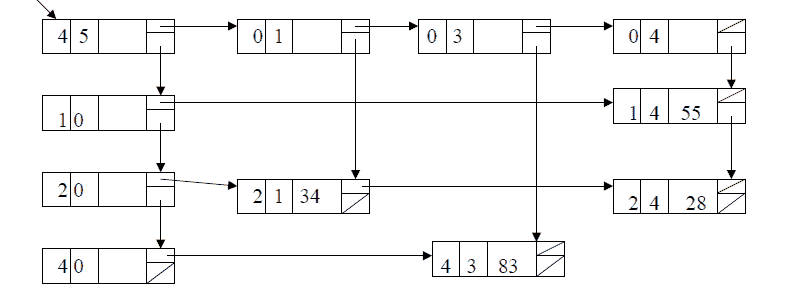
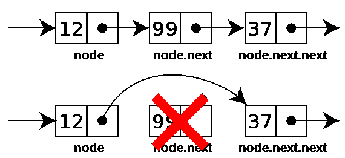

# 使用链表

我们已经对阵列有了很多了解。现在，我们将把注意力转移到一种称为*列表*的新型数据结构上。它是编程世界中使用最多的数据结构之一。在大多数编程语言中，数组是固定大小的结构。因此，它无法动态增长，并且从固定大小的数组中缩小或删除项目也有问题，因为我们必须移动数组的项目以填补空白。因此，许多开发人员更喜欢列表而不是数组。考虑到每个数组元素可能有一些额外字节的开销，在内存效率是一个重要因素的情况下，可以使用链表。在本章中，我们将探讨 PHP 中不同类型的链表及其实现。我们还将研究使用链表可以解决的实际问题。

# 什么是链表？

链表是称为节点的对象的集合。每个节点通过一个链接连接到下一个节点，该链接只是一个对象引用。如果我们考虑下面的图像，每个框代表一个节点。箭头表示节点之间的链接。这是一个单链接列表的示例。最后一个节点包含 NULL 的下一个链接，因此它标记列表的结尾：


节点是一个对象，这意味着它可以存储任何简单的数据类型，如字符串、整数或浮点，或复杂的数据类型，如数组、数组数组数组、对象或对象数组。我们可以根据需要储存任何东西。

我们还可以对链表执行多种操作，如以下操作：

*   检查列表是否为空
*   显示列表中的所有项目
*   搜索列表中的项目
*   获取列表的大小
*   在列表的开头或结尾插入新项
*   从列表的开头或结尾删除项目
*   在特定位置或项目之前/之后插入新项目
*   颠倒清单

这些只是可以在链表上执行的一些操作。

让我们编写一个简单的链表来存储一些名称：

```php
class ListNode { 
    public $data = NULL; 
    public $next = NULL; 

    public function __construct(string $data = NULL) { 
        $this->data = $data; 
    } 
}

```

我们前面提到，链表由节点组成。我们已经为我们的节点创建了一个简单的类。`ListNode`类有两个属性：一个用于存储数据，另一个用于名为`next`的链接。现在，我们将使用`ListNode`类实现一个链表。为简单起见，我们将有两个操作：`insert`和`display`：

```php
class LinkedList { 
    private $_firstNode = NULL; 
    private $_totalNodes = 0; 

    public function insert(string $data = NULL) { 
       $newNode = new ListNode($data); 

        if ($this->_firstNode === NULL) {           
            $this->_firstNode = &$newNode;             
        } else { 
            $currentNode = $this->_firstNode; 
            while ($currentNode->next !== NULL) { 
                $currentNode = $currentNode->next; 
            } 
            $currentNode->next = $newNode; 
        } 
       $this->_totalNode++; 
        return TRUE; 
    } 

    public function display() { 
      echo "Total book titles: ".$this->_totalNode."\n"; 
        $currentNode = $this->_firstNode; 
        while ($currentNode !== NULL) { 
            echo $currentNode->data . "\n"; 
            $currentNode = $currentNode->next; 
        } 
    } 
} 

```

前面的代码实际上实现了我们对`insert`和`display`节点的两个基本操作。在`LinkedList`类中，我们有两个私有属性：`$_firstNode`和`$_totalNodes`。两者的默认值分别为`NULL`和`0`。我们需要标记头部节点或第一个节点，以便始终知道从何处开始。我们也可以称之为前端节点。无论我们提供什么名称，它都将主要用于指示链接列表的开始。现在，让我们转到`insert`操作代码。

insert 方法接受一个参数，即数据本身。我们将使用`ListNode`类使用数据创建一个新节点。在我们的链接列表中插入书名之前，我们必须考虑两种可能性：

*   列表为空，我们正在插入第一个标题
*   列表不是空的，标题将添加到末尾

为什么我们需要同时考虑这两种情况？答案很简单。如果我们不知道列表是否为空，我们可能会得到不同的操作结果。我们还可能在节点之间创建无效链接。因此，如果列表为空，我们的插入项将成为列表的第一项。这就是代码的第一部分所做的：

```php
$newNode = new ListNode($data); 

if ($this->_firstNode === NULL) {             
          $this->_firstNode = &$newNode; 
}

```

从前面的代码段可以看出，我们正在使用数据创建一个新节点，并将节点对象命名为`$newNode`。然后检查`$_firstNode`是否为`NULL`。如果是`NULL`，则列表为空。如果为空，则将`$newNode`对象指定给`$_firstNode`属性。现在，`insert`方法的剩余部分代表我们的第二个条件，即列表不是空的，我们必须在列表的末尾添加新项：

```php
$currentNode = $this->_firstNode;    
while ($currentNode->next !== NULL) { 
  $currentNode = $currentNode->next; 
} 
$currentNode->next = $newNode; 

```

这里，我们从`$_firstNode`属性中获取列表的第一个节点。现在，我们将从第一个节点迭代到列表的末尾。我们将通过检查当前节点的下一条链路不是`NULL`的条件来确保这一点。如果是`NULL`，那么我们已经到了列表的末尾。为了确保我们不会一直循环到同一个节点，我们在迭代过程中将当前节点上的下一个节点设置为当前项。`while`循环代码实现该逻辑。一旦我们退出`while`循环，我们将链表的最后一个节点设置为`$currentNode`。现在，我们必须将当前最后一个节点的下一个链接分配给新创建的名为`$newNode`的节点，因此我们只需将对象放置到该节点的下一个链接。此对象引用将用作两个节点对象之间的链接。最后，我们还通过对`$_totalNode`属性进行后期递增，将总节点计数值递增 1。

We could have easily created another property for the list that would track the last node. It could have saved us from looping the whole list every time we are inserting a new node. We ignored this option intentionally to work through the basic understanding of the linked list. Later in this chapter, we will implement that for faster operations.

如果我们看看我们的`display`方法，我们可以看到我们正在使用几乎相似的逻辑来迭代每个节点并显示其内容。我们首先获取链接列表的标题项。然后，我们遍历列表，直到列表项为空。在循环内部，我们通过显示节点的`$data`属性来显示节点数据。现在，我们有一个节点类`ListNode`来为链表创建单个节点，我们有`LinkedList`类来执行基本的`insert`和`display`操作。让我们编写一个小代码，利用`LinkedList`类创建图书标题的链接列表：

```php
$BookTitles = new LinkedList(); 
$BookTitles->insert("Introduction to Algorithm"); 
$BookTitles->insert("Introduction to PHP and Data structures"); 
$BookTitles->insert("Programming Intelligence"); 
$BookTitles->display(); 

```

在这里，我们为`LinkedList`创建一个新对象，并将其命名为`$BookTitles`。然后，我们使用`insert`方法插入新书项。我们添加三本书，然后使用`display`方法显示书名。如果我们运行前面的代码，我们将看到以下输出：

```php
Total book titles: 3
Introduction to Algorithm
Introduction to PHP and Data structures
Programming Intelligence

```

正如我们所看到的，在第一行有一个计数器，显示我们有三个书名，以及它们的名字。如果我们仔细观察，就会发现书名的显示方式与我们输入的方式相同。这意味着我们实现的链表实际上是在维持秩序。这是因为我们总是在列表末尾输入新节点。如果我们愿意的话，我们可以做得不同。作为第一个例子，我们已经介绍了很多关于链表以及如何构造链表的内容。在接下来的部分中，我们将探讨如何创建不同类型的链表，并提供更复杂的示例。现在，我们将重点讨论不同类型的链表。

# 不同类型的链表

到目前为止，我们已经讨论了一种称为单链表或线性链表的列表。但是，根据所涉及的操作，也有几种不同类型的链表：

*   双链表
*   循环链表
*   多重链表

# 双链表

在双链接列表中，每个节点上有两个链接：一个指向下一个节点，另一个指向上一个节点。如果单链表是单向的，则双链表是双向的。我们可以在列表中向前或向后移动，没有任何问题。下图显示了一个双链接列表示例。稍后，在 PHP 中的*实现双链表部分，我们将探讨如何实现双链表：*


# 循环链表

在单链接或双链接列表中，最后一个节点之后没有节点，因此最后一个节点没有任何后续节点可迭代。如果我们允许最后一个节点指向第一个节点，我们就是在做一个圆。这种链表称为循环链表。我们可以将单链表和双链表作为循环链表。我们还将在本章中实施循环链表。下图显示了一个循环链接列表：


# 多链接列表

多重链表或多重链表是一种特殊类型的链表，具有两个或多个链接，将每个节点链接到另一个节点。它可以根据链表的用途进行多方向增长。例如，如果我们以学生列表为例，每个学生都是具有名称、年龄、性别、部门、专业等属性的节点，那么我们不仅可以将每个学生的节点链接到下一个和上一个节点，还可以链接到年龄、性别、部门和专业。虽然使用这种链表需要对链表概念有很好的理解，但我们可以在需要时使用这种特殊的链表。下图显示了一个多链接列表：



# 插入、删除和搜索项目

到目前为止，我们只看到了插入节点和显示所有节点内容的操作。现在，我们将探索链接列表中可用的其他操作。我们将主要关注以下业务：

*   在第一个节点插入
*   搜索节点
*   在特定节点之前插入
*   在特定节点后插入
*   删除第一个节点
*   删除最后一个节点
*   搜索和删除一个节点
*   反转链接列表
*   获取第 n 个位置元素

# 在第一个节点插入

当我们在前面或头部添加一个节点时，我们必须考虑两个简单的可能性。该列表可以为空，因此新节点为头部。这种可能性非常简单。但是，如果列表已经有了标题，那么我们必须执行以下操作：

1.  创建新节点。
2.  将新节点作为第一个节点或头。
3.  将上一个头部或第一个节点指定为新创建的第一个节点的下一个后续节点。

以下是此操作的代码：

```php
    public function insertAtFirst(string $data = NULL) { 
        $newNode = new ListNode($data); 
        if ($this->_firstNode === NULL) {             
            $this->_firstNode = &$newNode;             
        } else { 
            $currentFirstNode = $this->_firstNode; 
            $this->_firstNode = &$newNode; 
            $newNode->next = $currentFirstNode;            
        } 
        $this->_totalNode++; 
        return TRUE; 
    } 

```

# 搜索节点

搜索节点非常简单。我们需要遍历每个节点，并检查目标数据是否与节点数据匹配。如果找到数据，则返回节点；否则返回`FALSE`。实现如下所示：

```php
    public function search(string $data = NULL) { 
        if ($this->_totalNode) { 
            $currentNode = $this->_firstNode; 
            while ($currentNode !== NULL) { 
                if ($currentNode->data === $data) { 
                    return $currentNode; 
                } 
                $currentNode = $currentNode->next; 
            } 
        } 
        return FALSE; 
    } 

```

# 在特定节点之前插入

这个过程类似于我们看到的第一个操作。主要区别在于，我们需要找出特定的节点，然后在其前面插入一个新节点。当我们找到目标节点时，我们可以更改下一个节点，使其指向新创建的节点，然后我们可以更改新创建节点之后的节点，使其指向我们搜索的节点。如下图所示：


下面是实现前面所示逻辑的代码：

```php
public function insertBefore(string $data = NULL, string $query = NULL) { 
        $newNode = new ListNode($data); 

        if ($this->_firstNode) { 
            $previous = NULL; 
            $currentNode = $this->_firstNode; 
            while ($currentNode !== NULL) { 
                if ($currentNode->data === $query) { 
                    $newNode->next = $currentNode; 
                    $previous->next = $newNode; 
                    $this->_totalNode++; 
                    break; 
                } 
                $previous = $currentNode; 
                $currentNode = $currentNode->next; 
            } 
        } 
    } 

```

如果我们检查前面的代码，我们可以看到逻辑非常简单。在这种方法中，我们有两个参数：一个是`data`，另一个是`query`。我们遍历每个节点。在执行此操作时，我们还跟踪当前节点和前一个节点。跟踪上一个节点很重要，因为我们将在找到目标节点时将上一个节点的下一个设置为新创建的节点。

# 在特定节点后插入

此过程类似于在目标节点之前插入节点。区别在于我们需要在目标节点之后插入新节点。在这里，我们需要考虑目标节点以及它指向的下一个节点。找到目标节点后，可以更改下一个节点，使其指向新创建的节点，然后可以更改新创建节点后的节点，使其指向目标节点后的下一个节点。以下是用于实现此功能的代码：

```php
    public function insertAfter(string $data = NULL, string $query = 
      NULL) { 
        $newNode = new ListNode($data); 

        if ($this->_firstNode) { 
            $nextNode = NULL; 
            $currentNode = $this->_firstNode; 
            while ($currentNode !== NULL) { 
                if ($currentNode->data === $query) { 
                    if($nextNode !== NULL) { 
                        $newNode->next = $nextNode; 
                    } 
                    $currentNode->next = $newNode; 
                    $this->_totalNode++; 
                    break; 
                } 
                $currentNode = $currentNode->next; 
                $nextNode = $currentNode->next; 
            } 
        } 
    } 

```

# 删除第一个节点

删除一个节点仅仅意味着取出该节点并重新排列之前和之后的节点链接。如果我们只是删除一个节点，并将上一个节点的下一个链接与删除节点后的节点连接起来，那么删除操作就完成了。请看以下示例：



当我们删除第一个节点时，我们只需要将第二个节点作为我们的头部或第一个节点。通过使用以下代码，我们可以非常轻松地实现这一点：

```php
public function deleteFirst() { 
        if ($this->_firstNode !== NULL) { 
            if ($this->_firstNode->next !== NULL) { 
                $this->_firstNode = $this->_firstNode->next; 
            } else { 
                $this->_firstNode = NULL; 
            } 
            $this->_totalNode--; 
            return TRUE; 
        } 
        return FALSE; 
    } 

```

现在，我们必须考虑一个特殊的情况，即将总节点数减少 1。

# 删除最后一个节点

删除最后一个节点将要求我们将最后一个节点的下一个链接中的第二个链接分配给`NULL`。我们将迭代到最后一个节点，并在运行时跟踪上一个节点。点击最后一个节点后，下一个节点的上一个节点属性设置为`NULL`，如下例所示：

```php
    public function deleteLast() { 
        if ($this->_firstNode !== NULL) { 
            $currentNode = $this->_firstNode; 
            if ($currentNode->next === NULL) { 
                $this->_firstNode = NULL; 
            } else { 
                $previousNode = NULL; 

                while ($currentNode->next !== NULL) { 
                    $previousNode = $currentNode; 
                    $currentNode = $currentNode->next; 
                } 

                $previousNode->next = NULL; 
                $this->_totalNode--; 
                return TRUE; 
            } 
        } 
        return FALSE; 
    } 

```

首先，我们检查列表是否为空。然后，我们检查列表是否有多个节点。根据答案，我们迭代到最后一个节点并跟踪前一个节点。然后，我们将前一个节点的下一个链接指定为`NULL`，只是为了从列表中省略最后一个节点。

# 搜索和删除节点

我们可以使用搜索和删除操作从列表中删除任何节点。首先，我们从列表中搜索节点，然后通过从节点中删除引用来删除节点。以下是实现此目的的代码：

```php
    public function delete(string $query = NULL) { 
        if ($this->_firstNode) { 
            $previous = NULL; 
            $currentNode = $this->_firstNode; 
            while ($currentNode !== NULL) { 
                if ($currentNode->data === $query) { 
                    if ($currentNode->next === NULL) { 
                        $previous->next = NULL; 
                    } else { 
                        $previous->next = $currentNode->next; 
                    } 

                    $this->_totalNode--; 
                    break; 
                } 
                $previous = $currentNode; 
                $currentNode = $currentNode->next; 
            } 
        } 
    } 

```

# 颠倒清单

有许多方法可以反转链表。我们将研究一种简单的方法来反转列表，称为就地反转。我们遍历这些节点，将下一个节点更改为上一个，将上一个更改为当前，将当前更改为下一个。逻辑的伪算法如下所示：

```php
prev   = NULL; 
current = first_node; 
next = NULL; 
while (current != NULL) 
{ 
  next  = current->next;   
  current->next = prev;    
  prev = current; 
  current = next; 
} 
first_node = prev; 

```

如果我们基于此伪代码实现反向函数，它将如下所示：

```php
    public function reverse() { 
        if ($this->_firstNode !== NULL) { 
            if ($this->_firstNode->next !== NULL) { 
                $reversedList = NULL; 
                $next = NULL; 
                $currentNode = $this->_firstNode; 
                while ($currentNode !== NULL) { 
                    $next = $currentNode->next; 
                    $currentNode->next = $reversedList; 
                    $reversedList = $currentNode; 
                    $currentNode = $next; 
                } 
                $this->_firstNode = $reversedList; 
            } 
        } 
    } 

```

# 获取第 n 个位置元素

由于列表与数组不同，直接从元素的位置获取元素并不容易。为了得到第 n 个位置的元素，我们必须迭代到该位置并得到元素。以下是此方法的代码示例：

```php
    public function getNthNode(int $n = 0) { 
        $count = 1; 
        if ($this->_firstNode !== NULL) { 
            $currentNode = $this->_firstNode; 
            while ($currentNode !== NULL) { 
                if ($count === $n) { 
                    return $currentNode; 
                } 
                $count++; 
                $currentNode = $currentNode->next; 
            } 
        } 
    } 

```

我们现在已经为`LinkedList`类编写了所有必需的操作。现在，让我们用不同的操作运行程序。如果我们运行以下程序，我们将主要涵盖我们编写的所有操作：

```php
$BookTitles = new LinkedList(); 
$BookTitles->insert("Introduction to Algorithm"); 
$BookTitles->insert("Introduction to PHP and Data structures"); 
$BookTitles->insert("Programming Intelligence"); 
$BookTitles->insertAtFirst("Mediawiki Administrative tutorial guide"); 
$BookTitles->insertBefore("Introduction to Calculus", "Programming Intelligence"); 
$BookTitles->insertAfter("Introduction to Calculus", "Programming Intelligence"); 
$BookTitles->display(); 
$BookTitles->deleteFirst(); 
$BookTitles->deleteLast(); 
$BookTitles->delete("Introduction to PHP and Data structures"); 
$BookTitles->reverse(); 
$BookTitles->display(); 
echo "2nd Item is: ".$BookTitles->getNthNode(2)->data; 

```

前面代码的输出如下所示：

```php
Total book titles: 6
Mediawiki Administrative tutorial guide
Introduction to Algorithm
Introduction to PHP and Data structures
Introduction to Calculus
Programming Intelligence
Introduction to Calculus
Total book titles: 3
Programming Intelligence
Introduction to Calculus
Introduction to Algorithm
2nd Item is: Introduction to Calculus

```

现在我们有了一个使用 PHP7 的链表的完整实现。到目前为止，我们了解到的一件事是，与数组的实现不同，我们必须通过编写代码手动执行许多操作。我们还必须记住一件事：这不是实现链表的唯一方法。许多人更喜欢跟踪列表的第一个和最后一个节点，以便更好地执行插入操作。现在，我们将研究在一般和最坏情况下链表操作的复杂性。

# 理解链表的复杂性

以下是链表操作的最佳、最差和平均案例复杂性：

| **操作** | **时间复杂度：最坏情况** | **时间复杂度：平均案例** |
| 在开头或结尾插入 | `O(1)` | `O(1)` |
| 在开头或结尾删除 | `O(1)` | `O(1)` |
| 搜索 | `O(n)` | `O(n)` |
| 通道 | `O(n)` | `O(n)` |

我们可以通过跟踪最后一个节点来实现链表末尾的`O(1)`插入复杂性，就像我们在示例中对第一个节点所做的那样。这将帮助我们直接跳到链表的最后一个节点，而无需任何迭代。

# 使链接列表可编辑

到目前为止，我们已经看到，我们可以在方法中使用`while`循环遍历链表的每个节点。如果我们只需要使用链表对象从外部进行迭代，该怎么办？这是很有可能实现的。PHP 有一个非常直观的迭代器接口，允许任何外部迭代器在内部迭代对象。`Iterator`接口提供以下方式：

*   **当前**：返回当前元素
*   **下一个**：前进到下一个元素
*   **键**：返回当前元素的键
*   **倒带**：将`Iterator`倒带到第一个元素
*   **有效**：检查当前位置是否有效

现在，我们将在`LinkedList`类中实现这些方法，以使我们的对象直接遍历对象中的节点。为了在迭代过程中跟踪当前节点和列表中的当前位置，我们需要为`LinkedList`类提供两个新属性：

```php
private $_currentNode = NULL; 
private $_currentPosition = 0; 

```

`$_currentNode`属性将在迭代期间跟踪当前节点，`$_currentPosition`将在迭代期间跟踪当前位置。我们还需要确保我们的类`LinkedList`类也实现了`Iterator`接口。它将如下所示：

```php
class LinkedList implements Iterator{ 

} 

```

现在，让我们实现这五种新方法，使我们的链表对象可编辑。这五种方法非常简单，易于实现。以下是代码：

```php
    public function current() { 
        return $this->_currentNode->data; 
    } 

    public function next() { 
        $this->_currentPosition++; 
        $this->_currentNode = $this->_currentNode->next; 
    } 

    public function key() { 
        return $this->_currentPosition; 
    } 

    public function rewind() { 
        $this->_currentPosition = 0; 
        $this->_currentNode = $this->_firstNode; 
    } 

    public function valid() { 
        return $this->_currentNode !== NULL; 
    } 

```

现在，我们有了一个列表，它是可编辑的。这意味着现在我们可以使用`foreach`循环或我们希望遵循的任何其他迭代过程来迭代链表对象。现在，如果我们编写以下代码，我们将看到所有的书名：

```php
foreach ($BookTitles as $title) { 
    echo $title . "\n"; 
}

```

另一种方法可以从 iterable 接口使用`rewind`、`valid`、`next`和`current`方法。它将具有与前面代码相同的输出：

```php
for ($BookTitles->rewind(); $BookTitles->valid(); 
  $BookTitles->next()) { 
    echo $BookTitles->current() . "\n"; 
}

```

# 建立循环链表

建立一个循环链表并不像名字听起来那么难。到目前为止，我们已经看到在末尾添加一个新节点非常简单；我们将最后一个节点的下一个引用设置为`NULL`。在循环链表中，最后一个节点的下一个引用实际上将指向第一个节点，从而创建一个循环列表。让我们编写一个简单的循环链表，其中节点将插入到列表的末尾：

```php
class CircularLinkedList { 

    private $_firstNode = NULL; 
    private $_totalNode = 0; 

    public function insertAtEnd(string $data = NULL) { 
        $newNode = new ListNode($data); 
        if ($this->_firstNode === NULL) { 
            $this->_firstNode = &$newNode; 
        } else { 
            $currentNode = $this->_firstNode; 
            while ($currentNode->next !== $this->_firstNode) { 
                $currentNode = $currentNode->next; 
            } 
            $currentNode->next = $newNode; 
        } 
        $newNode->next = $this->_firstNode; 
        $this->_totalNode++; 
        return TRUE; 
    } 
}

```

如果我们仔细查看前面的代码，它看起来与我们的单链表实现完全相同。唯一的区别是我们不检查列表的末尾，而不是确保当前节点与第一个节点不同。此外，在下一行中，我们将新创建节点的下一个引用指定给列表的第一个节点：

```php
$newNode->next = $this->_firstNode; 

```

在我们实现这一点时，新节点被添加到列表的后面。我们需要做的就是将新节点的下一个引用设置为列表中的第一个节点。通过这样做，我们实际上创建了一个循环链表。我们必须确保我们不会在无限循环中运行。这就是我们将`$currentNode->next`与`$this->_firstNode`进行比较的原因。当我们显示循环链表中的所有元素时，同样的原则也适用。我们需要确保在显示标题时不会陷入无限循环。以下代码将显示循环链接列表中的所有标题：

```php
    public function display() { 
        echo "Total book titles: " . $this->_totalNode . "\n"; 
        $currentNode = $this->_firstNode; 
        while ($currentNode->next !== $this->_firstNode) { 
            echo $currentNode->data . "\n"; 
            $currentNode = $currentNode->next; 
        } 

        if ($currentNode) { 
            echo $currentNode->data . "\n"; 
        } 
    }

```

到目前为止，我们已经建立了一个单链表，并实现了一个循环链表。现在，我们将用 PHP 实现一个双链表。

# 在 PHP 中实现双链表

我们已经从双链表的定义中知道，双链表节点将有两个链接：一个指向下一个节点，另一个指向上一个节点。此外，当我们添加新节点或删除新节点时，我们需要为每个受影响的节点设置下一个和上一个引用。我们在单链表实现中看到了一种不同的方法，我们没有跟踪最后一个节点，因此每次都必须使用迭代器到达最后一个节点。这次，我们将跟踪最后一个节点以及插入和删除操作，以确保插入、删除和结束操作具有`O(1)`复杂性。

下面是新节点类的外观，它有两个链接指针，后跟双链接列表类的基本结构：

```php
class ListNode {

    public $data = NULL; 
    public $next = NULL; 
    public $prev = NULL; 

    public function __construct(string $data = NULL) {
        $this->data = $data;
    }

}

class DoublyLinkedList {

    private $_firstNode = NULL;
    private $_lastNode = NULL;
    private $_totalNode = 0;

}

```

在下一节中，我们将探讨双链表的不同操作，以便了解单链表和双链表之间的基本区别。

# 双链表操作

我们将在双链表实现中探讨以下操作。虽然它们听起来与单链表中使用的类似，但它们在实现上有一个主要区别：

*   在第一个节点插入
*   在最后一个节点插入
*   在特定节点之前插入
*   在特定节点后插入
*   删除第一个节点
*   删除最后一个节点
*   搜索和删除一个节点
*   向前显示列表
*   向后显示列表

# 首先插入节点

在前面或头部添加节点时，必须检查列表是否为空。如果列表为空，则第一个和最后一个节点都将指向新创建的节点。但是，如果列表已经有了标题，那么我们必须执行以下操作：

1.  创建新节点。
2.  将新节点作为第一个节点或头。
3.  将上一个头部或第一个节点指定为下一个，以跟随新创建的第一个节点。
4.  将上一个节点的上一个链接指定给新的第一个节点。

以下是代码：

```php
    public function insertAtFirst(string $data = NULL) {
        $newNode = new ListNode($data);
        if ($this->_firstNode === NULL) {
            $this->_firstNode = &$newNode;
            $this->_lastNode = $newNode; 
        } else {
            $currentFirstNode = $this->_firstNode; 
            $this->_firstNode = &$newNode; 
            $newNode->next = $currentFirstNode; 
            $currentFirstNode->prev = $newNode; 
        }
        $this->_totalNode++; 
        return TRUE;
    }

```

# 在最后一个节点插入

由于我们现在正在跟踪最后一个节点，因此在最后插入一个新节点会更容易。首先，我们需要检查列表是否为空。如果为空，则新节点将同时成为第一个和最后一个节点。但是，如果列表已经有最后一个节点，则必须执行以下操作：

1.  创建新节点。
2.  使新节点成为最后一个节点。
3.  将上一个最后一个节点指定为当前最后一个节点的上一个链接。
4.  将上一个节点的下一个链接指定给新的上一个节点的上一个链接。

以下是代码：

```php
    public function insertAtLast(string $data = NULL) { 
        $newNode = new ListNode($data);
        if ($this->_firstNode === NULL) {
            $this->_firstNode = &$newNode; 
            $this->_lastNode = $newNode; 
        } else {
            $currentNode = $this->_lastNode; 
            $currentNode->next = $newNode; 
            $newNode->prev = $currentNode; 
            $this->_lastNode = $newNode; 
        }
        $this->_totalNode++; 
        return TRUE;
    }

```

# 在特定节点之前插入

在特定节点之前插入要求我们首先找到节点，并且根据其位置，我们需要更改新节点、目标节点和目标节点之前节点的下一个和上一个节点，如下所示：

```php
    public function insertBefore(string $data = NULL, string $query =  
      NULL) {
        $newNode = new ListNode($data); 

        if ($this->_firstNode) { 
            $previous = NULL; 
            $currentNode = $this->_firstNode; 
            while ($currentNode !== NULL) { 
                if ($currentNode->data === $query) { 
                    $newNode->next = $currentNode; 
                    $currentNode->prev = $newNode; 
                    $previous->next = $newNode; 
                    $newNode->prev = $previous; 
                    $this->_totalNode++; 
                    break; 
                }
                $previous = $currentNode; 
                $currentNode = $currentNode->next; 
            }
        }
    }

```

# 在特定节点后插入

在特定节点后插入类似于我们刚才讨论的方法。这里，我们需要为新节点、目标节点和目标节点后面的节点更改下一个和上一个节点。以下是代码：

```php
    public function insertAfter(string $data = NULL, string $query = 
      NULL) { 
        $newNode = new ListNode($data);

        if ($this->_firstNode) { 
            $nextNode = NULL; 
            $currentNode = $this->_firstNode; 
            while ($currentNode !== NULL) { 
                if ($currentNode->data === $query) { 
                    if ($nextNode !== NULL) { 
                        $newNode->next = $nextNode; 
                    } 
                    if ($currentNode === $this->_lastNode) { 
                        $this->_lastNode = $newNode; 
                    } 
                    $currentNode->next = $newNode; 
                    $nextNode->prev = $newNode; 
                    $newNode->prev = $currentNode; 
                    $this->_totalNode++; 
                    break; 
                } 
                $currentNode = $currentNode->next; 
                $nextNode = $currentNode->next; 
            }
        }
    }

```

# 删除第一个节点

当我们从双链接列表中删除第一个节点时，我们只需要将第二个节点设置为第一个节点。将新的第一个节点的前一个节点设置为`NULL`并减少节点总数，如下代码：

```php
    public function deleteFirst() { 
        if ($this->_firstNode !== NULL) { 
            if ($this->_firstNode->next !== NULL) { 
                $this->_firstNode = $this->_firstNode->next; 
                $this->_firstNode->prev = NULL; 
            } else { 
                $this->_firstNode = NULL; 
            } 
            $this->_totalNode--; 
            return TRUE; 
        } 
        return FALSE; 
    }

```

# 删除最后一个节点

删除最后一个节点需要将倒数第二个节点设置为新的最后一个节点。另外，新创建的最后一个节点不应有任何下一个引用。代码示例如下所示：

```php
    public function deleteLast() { 
        if ($this->_lastNode !== NULL) { 

            $currentNode = $this->_lastNode; 
            if ($currentNode->prev === NULL) { 
                $this->_firstNode = NULL; 
                $this->_lastNode = NULL; 
            } else { 
                $previousNode = $currentNode->prev; 
                $this->_lastNode = $previousNode; 
                $previousNode->next = NULL; 
                $this->_totalNode--; 
                return TRUE; 
            } 
        } 
        return FALSE; 
    }

```

# 搜索和删除一个节点

当我们从列表中间删除一个节点时，我们必须重新调整要查找的项目的上一个和下一个节点。首先，我们将找到预期的节点。获取目标节点的上一个节点以及下一个节点。然后，将前一个节点之后的节点指定为指向目标节点之后的下一个节点，并且以相反的方式同样适用于前一个节点。以下是代码：

```php
    public function delete(string $query = NULL) { 
        if ($this->_firstNode) { 
            $previous = NULL;
            $currentNode = $this->_firstNode; 
            while ($currentNode !== NULL) { 
                if ($currentNode->data === $query) { 
                    if ($currentNode->next === NULL) { 
                        $previous->next = NULL; 
                    } else { 
                        $previous->next = $currentNode->next; 
                        $currentNode->next->prev = $previous; 
                    }

                    $this->_totalNode--; 
                    break; 
                }
                $previous = $currentNode; 
                $currentNode = $currentNode->next; 
            }
        }
    }

```

# 向前显示列表

双链接列表使我们有机会在两个方向上显示列表。到目前为止，我们已经看到，我们可以在单链表中以单向方式显示列表。现在，我们将从两个方向看到列表。以下是用于显示转发列表的代码：

```php
    public function displayForward() { 
        echo "Total book titles: " . $this->_totalNode . "\n"; 
        $currentNode = $this->_firstNode; 
        while ($currentNode !== NULL) { 
            echo $currentNode->data . "\n"; 
            $currentNode = $currentNode->next; 
        } 
    } 

```

# 向后显示列表

要向后显示列表，我们必须从最后一个节点开始，使用上一个链接继续向后移动，直到到达列表的末尾。这为我们提供了一种独特的方式，可以在作战过程中向我们需要的任何方向移动。以下是代码：

```php
    public function displayBackward() { 
        echo "Total book titles: " . $this->_totalNode . "\n"; 
        $currentNode = $this->_lastNode; 
        while ($currentNode !== NULL) { 
            echo $currentNode->data . "\n"; 
            $currentNode = $currentNode->prev; 
        }
    }

```

# 双链表的复杂性

下面是双链表操作的最佳、最差和平均案例复杂性。它类似于单链表操作：

| **操作** | **时间复杂度：最坏情况** | **时间复杂度：平均案例** |
| 在开头或结尾插入 | `O(1)` | `O(1)` |
| 在开头或结尾删除 | `O(1)` | `O(1)` |
| 搜索 | `O(n)` | `O(n)` |
| 通道 | `O(n)` | `O(n)` |

# 使用 PHP SplDoublyLinkedList

PHP**标准 PHP 库**（**SPL**）实现了一个双链表，称为`SplDoublyLinkedList`。如果我们使用内置类，我们不需要自己实现双链表。双链表实现实际上也可以用作堆栈和队列。双链表的 PHP 实现有许多附加功能。以下是`SplDoublyLinkedList`的一些常见特征：

| **方法** | **说明** |
| `Add` | 在指定索引中添加新节点 |
| `Bottom` | 从列表的开头查看节点 |
| `Count` | 返回列表的大小 |
| `Current` | 返回当前节点 |
| `getIteratorMode` | 返回迭代模式 |
| `setIteratorMode` | 设置迭代的模式。例如，后进先出、先进先出等等 |
| `Key` | 返回当前节点索引 |
| `next` | 移动到下一个节点 |
| `pop` | 从列表末尾弹出一个节点 |
| `prev` | 移动到上一个节点 |
| `push` | 在列表末尾添加新节点 |
| `rewind` | 将迭代器倒回顶部 |
| `shift` | 从链接列表的开头移动节点 |
| `top` | 从列表末尾查看节点 |
| `unshift` | 在列表中为元素添加前缀 |
| `valid` | 检查列表中是否还有其他节点 |

现在，让我们使用`SplDoublyLinkedList`为我们的书名应用程序编写一个小程序：

```php
$BookTitles = new SplDoublyLinkedList(); 

$BookTitles->push("Introduction to Algorithm");
$BookTitles->push("Introduction to PHP and Data structures"); 
$BookTitles->push("Programming Intelligence");
$BookTitles->push("Mediawiki Administrative tutorial guide"); 
$BookTitles->add(1,"Introduction to Calculus");
$BookTitles->add(3,"Introduction to Graph Theory");

for($BookTitles->rewind();$BookTitles->valid();$BookTitles->next()){    
    echo $BookTitles->current()."\n";
}

```

上述代码将具有以下输出：

```php
Introduction to Algorithm
Introduction to Calculus
Introduction to PHP and Data structures
Introduction to Graph Theory
Programming Intelligence
Mediawiki Administrative tutorial guide

```

# 总结

链表是用于解决不同问题的最流行的数据结构之一。无论是对于堆栈、队列、优先级队列，还是对于实现复杂的图形算法，链表都是一种非常方便的数据结构，可以解决您可能发现的任何问题。在本章中，我们探讨了单链表、双链表和循环链表的所有可能细节，以及它们的复杂性分析。在接下来的章节中，我们将利用链表实现不同的数据结构和编写算法。