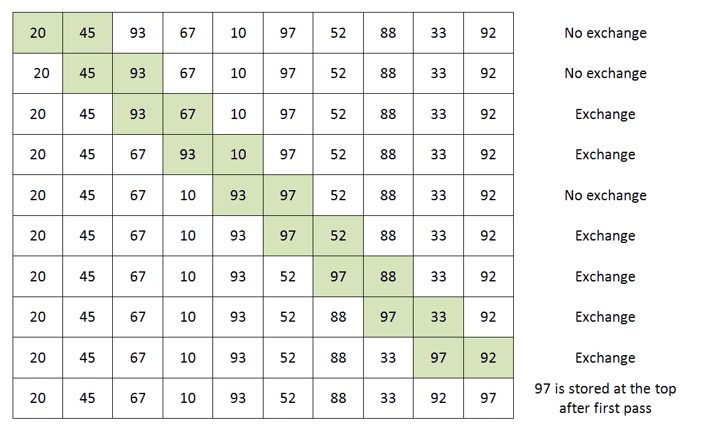
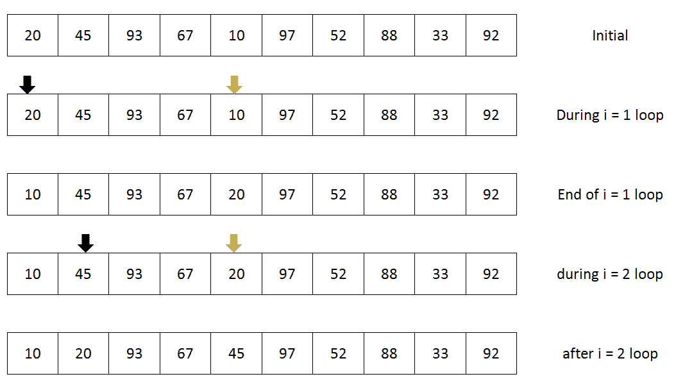
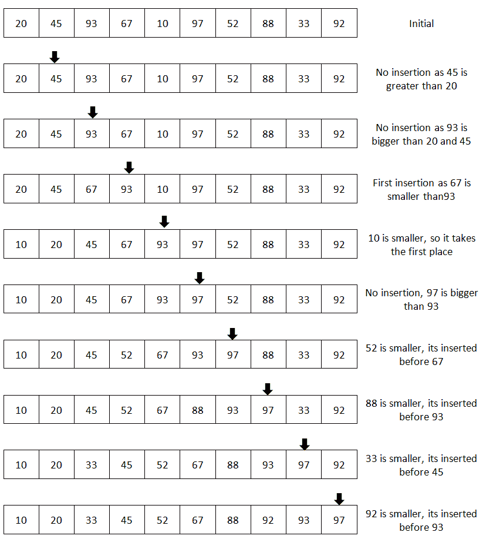
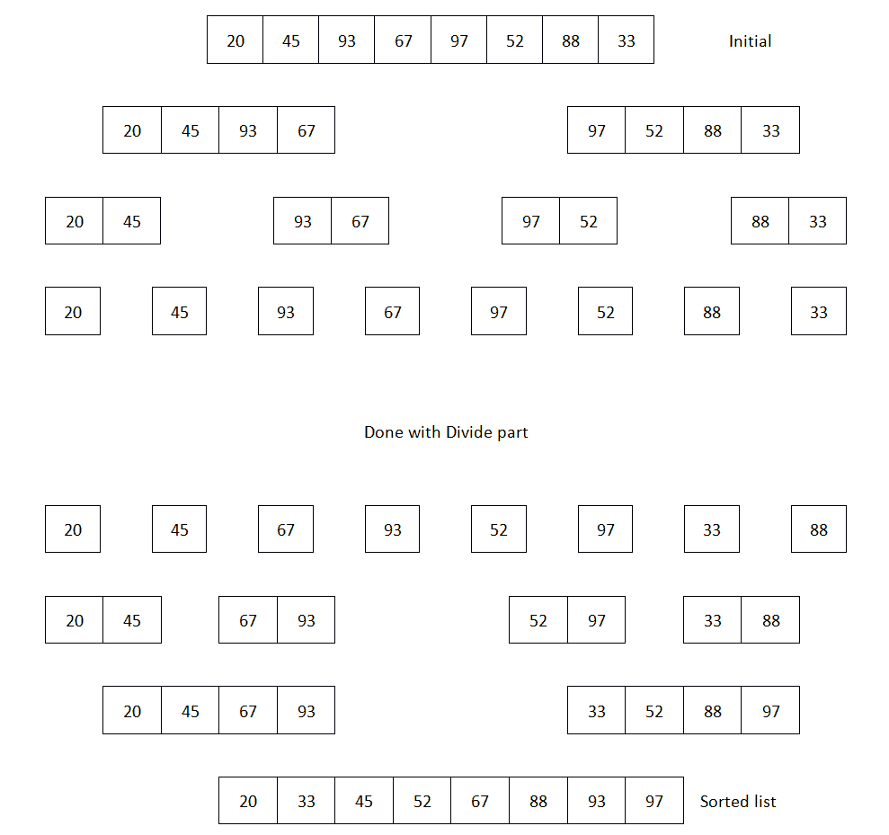
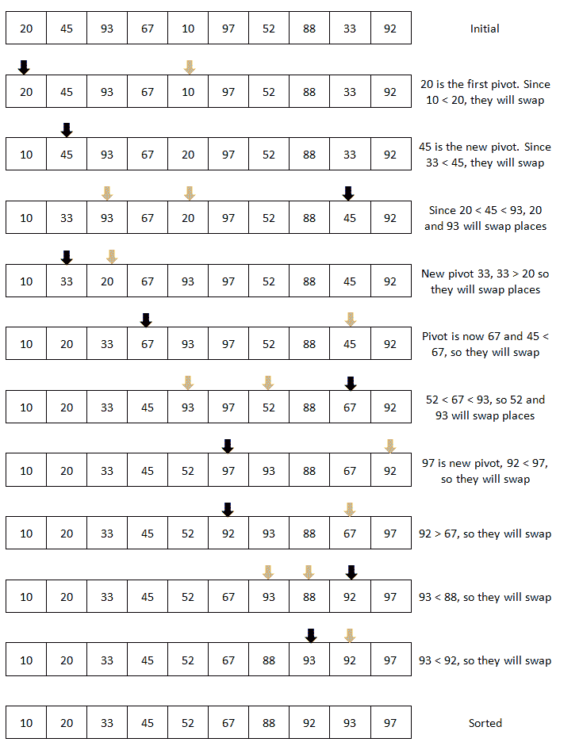

# 七、使用排序算法

排序是计算机编程中最常用的算法之一。即使在我们的日常生活中，如果事情没有分类，我们也会很难处理它们。排序可以为更快地搜索或排序集合中的项目铺平道路。排序可以用许多不同的方式完成，例如按升序或降序。排序也可以基于数据的类型。例如，对名称集合进行排序将需要字典排序，而不是数字排序。由于排序可以对其他数据结构及其效率发挥重要作用，因此有许多不同的排序算法可用。在本章中，我们将探讨一些最流行的排序算法，以及它们的复杂性和用途。

# 理解排序及其类型

排序是指数据的排序顺序。通常，我们的数据是未排序的，这意味着我们需要一种排序方法。通常，排序是通过相互比较不同的元素并得出排名来完成的。在大多数情况下，如果没有比较，我们无法决定排序部分。在比较之后，我们还需要交换元素，以便对它们进行重新排序。好的排序算法具有比较和交换次数最少的特点。还有一种是基于非比较的排序，对项目列表进行排序时不需要进行比较。在本章中，我们还将探讨这些算法。

排序可以根据数据集的类型、方向、计算复杂性、内存使用情况、空间使用情况等分为不同的类型。以下是我们将在本章中探讨的几种排序算法：

*   气泡排序
*   插入排序
*   选择排序
*   快速排序
*   合并排序
*   斗式分拣

我们的讨论将限于前面的列表，因为它们是最常用的排序算法，可以根据不同的标准进行分组和分类，如简单排序、高效排序、分布排序等。现在我们将探讨每个排序功能、它们的实现和复杂性分析，以及它们的优缺点。让我们开始使用最常用的排序算法-气泡排序。

# 理解冒泡排序

气泡排序是编程界最常用的排序算法。大多数程序员开始学习使用该算法进行排序。它是一种基于比较的排序算法，一直被认为是最低效的排序算法之一。它需要最大数量的比较，平均复杂度和最坏情况复杂度是相同的。

在冒泡排序中，列表中的每个项目都会和其他项目进行比较，并在需要时进行交换。对于列表中的每个项目，此操作都将继续。我们可以按升序或降序排序。下面是冒泡排序的伪算法：

```php
procedure bubbleSort( A : list of sortable items ) 
   n = length(A) 
   for i = 0 to n inclusive do  
     for j = 0 to n-1 inclusive do 
       if A[j] > A[j+1] then 
         swap( A[j], A[j+1] ) 
       end if 
     end for 
   end for 
end procedure

```

从前面的伪代码中可以看出，我们正在运行一个循环，以确保迭代列表中的每个项目。内部循环确保，一旦我们指向一个项目，我们就可以将该项目与列表中的其他项目进行比较。根据我们的喜好，我们可以交换这两个项目。下图显示了对列表中的一项进行排序的单个迭代。假设我们的列表有以下项目：**20**、**45**、**93**、**67**、**10**、**97**、**52**、**88**、**33**、**92**。对于排序第一项的第一个过程（迭代），将采取以下步骤：



如果我们检查前面的图像，我们可以看到我们正在比较两个数字，然后决定是否要交换该项目。带有背景色的项目显示了我们正在比较的两个项目。正如我们所看到的，外循环的第一次迭代导致最顶端的项存储在列表中最顶端的位置。这将一直持续到我们遍历列表中的每个项目为止。

现在让我们使用 PHP 实现冒泡排序算法。

# 用 PHP 实现冒泡排序

由于我们假设未排序的数字将出现在列表中，因此可以使用 PHP 数组来表示未排序的数字列表。由于数组既有索引又有值，我们可以利用数组根据位置轻松迭代每个项，并在适用的地方交换它们。根据我们的伪代码，代码如下所示：

```php
function bubbleSort(array $arr): array { 
    $len = count($arr); 

    for ($i = 0; $i < $len; $i++) { 
      for ($j = 0; $j < $len - 1; $j++) { 
          if ($arr[$j] > $arr[$j + 1]) { 
            $tmp = $arr[$j + 1]; 
            $arr[$j + 1] = $arr[$j]; 
            $arr[$j] = $tmp; 
          } 
      } 
    }     
    return $arr; 
}

```

正如我们所看到的，我们正在使用两个`for`循环来迭代每个项目，并与其他项目进行比较。交换在以下行中完成：

```php
$tmp = $arr[$j + 1];
$arr[$j + 1] = $arr[$j];
$arr[$j] = $tmp;

```

首先，我们将第二个值赋给名为`$tmp`的临时变量。然后，我们将第一个值指定给第二个值，并将临时值重新指定给第一个值。这称为使用第三个或临时变量交换两个变量。

只有当第一个值大于第二个值时，我们才进行交换。否则，我们就忽略了。图像右侧的注释显示是否发生了交换。如果我们想按降序排序（首先是较大的数字），那么我们只需修改`if`条件，如下所示：

```php
if ($arr[$j] < $arr[$j + 1]) {
}

```

现在，让我们按如下方式运行代码：

```php
$arr = [20, 45, 93, 67, 10, 97, 52, 88, 33, 92]; 
$sortedArray = bubbleSort($arr); 
echo implode(",", $sortedArray); 

```

这将产生以下输出：

```php
10,20,33,45,52,67,88,92,93,97

```

因此，我们可以看到数组是使用冒泡排序算法排序的。现在，让我们讨论一下算法的复杂性。

# 冒泡排序的复杂性

对于第一个过程，在最坏的情况下，我们必须进行*n-1*比较和交换。对于*n-1*关卡，在最坏的情况下，我们只需进行一次比较和交换。因此，如果我们一步一步地写，那么我们将看到：

*复杂性=n-1+n-2+2+1=n*（n-1）/2=O（n<sup>2</sup>*

因此，冒泡排序的复杂性为`O(n<sup>2</sup>)`。但是，分配临时变量、交换、遍历内部循环等都需要一些固定的时间。我们可以忽略它们，因为它们是常量。

以下是最佳、平均和最坏情况下气泡排序的时间复杂度表：

| 最佳时间复杂度 | `Ω(n)` |
| 最坏时间复杂度 | `O(n<sup>2</sup>)` |
| 平均时间复杂度 | `Θ(n<sup>2</sup>)` |
| 空间复杂性（最坏情况） | `O(1)` |

虽然冒泡排序的时间复杂度为`O(n<sup>2</sup>)`，但我们仍然可以应用一些改进来减少比较和交换的数量。现在让我们探讨一下这些选项。最好的时间是`Ω(n)`，因为我们需要至少运行一个内部循环来发现数组已经排序。

# 改进的冒泡排序算法

冒泡排序最重要的一个方面是，对于外部循环中的每个迭代，将至少有一个交换。如果没有交换，则列表已排序。我们可以在伪代码中利用这一改进，并将其重新定义为：

```php
procedure bubbleSort( A : list of sortable items ) 
   n = length(A) 
   for i = 1 to n inclusive do  
     swapped = false 
     for j = 1 to n-1 inclusive do 
       if A[j] > A[j+1] then 
         swap( A[j], A[j+1] ) 
         swapped = true 
       end if 
     end for 

     if swapped is false 
        break 
     end if 

   end for 
end procedure

```

正如我们可以看到的，我们现在为每个迭代设置了一个标志`false`，我们希望在内部迭代中，该标志将设置为`true`。如果在完成内部循环后该标志仍然为 false，那么我们可以中断该循环，以便将列表标记为已排序。以下是改进版算法的实现：

```php
function bubbleSort(array $arr): array { 
    $len = count($arr); 

    for ($i = 0; $i < $len; $i++) { 
      $swapped = FALSE; 
      for ($j = 0; $j < $len - 1; $j++) { 
          if ($arr[$j] > $arr[$j + 1]) { 
            $tmp = $arr[$j + 1]; 
            $arr[$j + 1] = $arr[$j]; 
            $arr[$j] = $tmp; 
            $swapped = TRUE; 
          } 
      } 
         if(! $swapped) break; 
    }     
    return $arr; 
} 

```

另一个观察结果是，在第一次迭代中，顶部项被放置在数组的右侧。在第二个循环中，第二个顶部项将位于数组右侧的第二个。如果我们可以想象在每次迭代之后，*i<sup>th</sup>*单元格已经存储了排序的项目，那么就不需要访问该索引并进行比较。因此，我们可以从内部迭代中减少外部迭代次数，并在很大程度上减少比较。下面是我们建议的第二项改进的伪代码：

```php
procedure bubbleSort( A : list of sortable items ) 
   n = length(A) 
   for i = 1 to n inclusive do  
     swapped = false 
     for j = 1 to n-i-1 inclusive do 
       if A[j] > A[j+1] then 
         swap( A[j], A[j+1] ) 
         swapped = true 
       end if 
     end for 

     if swapped is false 
        break 
     end if 

   end for 
end procedure 

```

现在，让我们用 PHP 实现最终的改进版本：

```php
function bubbleSort(array $arr): array {
    $len = count($arr); 

    for ($i = 0; $i < $len; $i++) { 
      $swapped = FALSE; 
      for ($j = 0; $j < $len - $i - 1; $j++) { 
          if ($arr[$j] > $arr[$j + 1]) { 
            $tmp = $arr[$j + 1]; 
            $arr[$j + 1] = $arr[$j]; 
            $arr[$j] = $tmp; 
            $swapped = TRUE; 
          } 
      } 
      if(! $swapped) break; 
    }     
    return $arr; 
} 

```

如果我们查看前面代码中的内部循环，唯一的区别是`$j < $len - $i - 1`；其他部分与第一次改进相同。所以，基本上，对于我们的**20**、**45**、**93**、**67**、**10**、**97**、**52**、**88**、**33**、**92**列表，我们可以很容易地说，在第一次迭代之后，排名第一的数字第二次迭代比较不考虑**97**，第三次迭代不考虑**93**也不考虑，如下图所示：


如果我们看前面的图片，我们脑海中最直接的问题是“**92**是否已经排序？我们是否需要再次比较所有数字，并标记**92**已经排序到位？”是的，我们是对的。这是一个合理的问题。这意味着我们可以知道，我们在内部循环中的最后一次交换是在哪个位置进行的；之后，数组已经排序。因此，我们可以为下一个循环设置一个边界，直到那个时候，并且只比较到我们设置的边界。以下是用于此的伪代码：

```php
procedure bubbleSort( A : list of sortable items )
   n = length(A)
   bound = n -1
   for i = 1 to n inclusive do
     swapped = false
     newbound = 0
     for j = 1 to bound inclusive do
       if A[j] > A[j+1] then
         swap( A[j], A[j+1] )
            swapped = true
            newbound = j
       end if
     end for

     bound = newbound

     if swapped is false
        break
     end if

   end for
end procedure

```

这里，我们在每个内部循环完成后设置边界，并确保没有不必要的迭代。以下是使用上述伪代码的实际 PHP 代码：

```php
function bubbleSort(array $arr): array {
    $len = count($arr);
    $count = 0;
    $bound = $len-1;

    for ($i = 0; $i < $len; $i++) {
     $swapped = FALSE;
     $newBound = 0;
      for ($j = 0; $j < $bound; $j++) {
          $count++;
          if ($arr[$j] > $arr[$j + 1]) {
            $tmp = $arr[$j + 1];
            $arr[$j + 1] = $arr[$j];
            $arr[$j] = $tmp;
            $swapped = TRUE;
            $newBound = $j;

          }
      }
     $bound = $newBound;

     if(! $swapped) break;
    }
    echo $count."\n";
    return $arr;
}

```

我们已经看到了气泡排序实现的不同变体，但输出总是相同的：**10**、**20**、**33**、**45**、**52**、**67**、**88**、**92**、**93**、**97**。如果是这样的话，那么我们如何确定我们的改进实际上对算法产生了一些影响？以下是我们最初列表 20、45、93、67、10、97、52、88、33、92 中所有四种实现的比较数量的一些统计数据：

| **溶液** | **比对计数** |
| 规则气泡排序 | 90 |
| 第一次改进后 | 63 |
| 第二次改进后 | 42 |
| 第三次改进后 | 38 |

正如我们所看到的，随着我们的改进，我们已经将比较的数量从**90**减少到**38**。因此，我们当然可以对算法进行一些改进，以减少所需的比较次数。

# 理解选择排序

选择排序是另一种基于比较的排序算法，它看起来类似于冒泡排序。最大的区别是它比冒泡排序需要更少的交换。在选择排序中，我们首先找到数组的最小/最大项并将其放在第一位。如果我们按降序排序，那么我们将从数组中获取最大值。对于升序，我们将取最小值。在第二次迭代中，我们将找到数组的第二个最大值或最小值，并将其放在第二位。直到我们将每个数字放置到正确排序的位置为止。这称为选择排序。选择排序的伪代码如下所示：

```php
procedure selectionSort( A : list of sortable items )
   n = length(A)
   for i = 1 to n inclusive do
     min = i
     for j = i+1 to n inclusive do
       if A[j] < A[min] then
         min = j
       end if
     end for

     if min != i
        swap(a[i],a[min])
     end if

   end for
end procedure

```

如果我们看看前面的算法，我们可以看到，在外循环中迭代一次之后，第一个最小项存储在位置一。在第一次迭代中，我们选择了第一个项目，然后从剩余的项目中找到最小值（从 2 到*n*。我们假设第一项是最小值。如果我们找到另一个最小值，我们将标记它的位置，直到扫描完剩余的列表并找到新的最小值。如果没有找到最小值，那么我们的假设是正确的，这确实是最小值。下面是一张图片，展示了我们在选择排序的前两步中的**20**、**45**、**93**、**67**、**10**、**97**、**52**、**88**、**33**、**92**阵列：



如上图所示，我们从列表中的第一项开始，即**20**。然后，我们从数组的其余部分找到了最小值，即**10**。在第一次迭代结束时，我们只是交换了两个位置的值（用箭头标记）。因此，在第一次迭代结束时，我们将数组中的最小值存储在第一个位置。然后，我们指向下一个项目，即**45**，并开始从其位置的右侧查找与**45**相比，第二个最小的项目。我们从剩下的物品中找到了**20**（如两个箭头所示）。在第二次迭代结束时，我们只是将第二个位置号替换为列表其余部分中新找到的最小位置号。这个过程一直持续到最后一个元素，在这个过程结束时，我们有一个数组的排序列表。现在让我们将伪代码转换为 PHP 代码。

# 实现选择排序

我们将采用与冒泡排序相同的方法，在冒泡排序中，我们的实现将数组作为参数并返回一个排序数组。以下是 PHP 的实现：

```php
function selectionSort(array $arr): array {
    $len = count($arr);
    for ($i = 0; $i < $len; $i++) {
      $min = $i;
      for ($j = $i+1; $j < $len; $j++) {
          if ($arr[$j] < $arr[$min]) {
            $min = $j;
          }
      }

      if ($min != $i) {
          $tmp = $arr[$i];
          $arr[$i] = $arr[$min];
          $arr[$min] = $tmp;
      }
    }
    return $arr;
}

```

可以看出，这是按升序对数组排序的最简单方法。如果您想按降序进行，我们只需将比较`$arr[$j] <``$arr[$min]`更改为`$arr[$j] > $arr[$min]`，并将`$min`替换为`$max`。

# 选择排序的复杂性

选择排序也类似于气泡排序，有两个带 0 到*n*的`for`循环。冒泡排序和选择排序的基本区别在于，选择排序的交换次数最多为*n-1*，而冒泡排序在最坏的情况下可以有*n*n*个交换次数。然而，在选择排序中，最佳情况、最坏情况和平均情况具有相似的复杂性。以下是选择排序的复杂性图表：

| 最佳时间复杂度 | `Ω(n<sup>2</sup>)` |
| 最坏时间复杂度 | `O(n<sup>2</sup>)` |
| 平均时间复杂度 | `Θ(n<sup>2</sup>)` |
| 空间复杂性（最坏情况） | `O(1)` |

# 理解插入排序

到目前为止，我们已经看到了两种基于比较的排序算法。现在，我们将探索另一种排序算法，与前两种算法相比，该算法有一定的效率。我们正在讨论插入排序。与我们刚才看到的其他两种排序算法相比，它的实现最简单。如果项目数较小，则插入排序比气泡排序和选择排序效果更好。如果数据集很大，那么它就会变得低效，就像冒泡排序一样。由于插入排序的交换几乎是线性的，因此建议使用插入排序而不是冒泡排序和选择排序。

顾名思义，插入排序的工作原理是将数字插入到左手边的正确位置。它从数组的第二项开始，检查留给它的项是否小于当前值。如果是这样，它会移动项目并将较小的项目存储在正确的位置。然后，它移动到下一个项目，相同的原则将继续，直到对整个数组进行排序。插入排序的伪代码如下所示：

```php
procedure insertionSort( A : list of sortable items )
   n = length(A)
   for i = 1 to n inclusive do
     key = A[i]
     j = i - 1
     while j >= 0 and A[j] > key   do
       A[j+1] = A[j]
       j--
     end while

     A[j+1] = key

   end for
end procedure

```

如果我们考虑以前用于冒泡排序和选择排序的数字列表，那么我们将有下面的场景，我们必须进行插入排序。
我们阵列的元素为：**20**、**45**、**93**、**67**、**10**、**97**、**52**、**88**、**33**、**92**。

让我们从第二项开始，即**45**。现在，我们将从**45**左侧的第一项开始，转到数组的开头，查看左侧是否有大于**45**的值。由于只有**20**，因此不需要插入，因为到目前为止该项目已排序，直到第二个元素（**20**、**45**为止）。现在，我们将指针移动到**93、**并再次启动，比较从**45**开始的数组左侧，并搜索值是否更大。因为**45**不大于**93**，所以它就停在那里，和前面一样，我们得出结论，前两项已经排序。现在我们已经对前三项（**20**、**45**、**93**进行了排序。接下来，我们有**67**，我们再次从数字的左侧开始比较。左边第一个数字是**93**，更大，所以必须移动一个位置。我们将**93**移动到**67**持有的位置。然后，我们移动到它左边的下一项，即**45**。**45**小于**67**，无需进一步比较。现在，我们将在**93**持有的位置插入**67**，并且**93**必须移动到**67**的位置。这将一直持续到对整个数组进行排序为止。此图说明了在每个步骤中使用插入排序的完整排序过程：



# 实现插入排序

我们将以与其他两种排序类似的方式实现插入排序，但有细微的区别。这一次，我们将把数组作为引用传递。这样，我们就不需要函数返回任何值。如果需要，我们还可以按值传递参数，并在函数末尾返回数组。以下是此操作的代码：

```php
function insertionSort(array &$arr) { 
    $len = count($arr); 
    for ($i = 1; $i < $len; $i++) { 
      $key = $arr[$i]; 
      $j = $i - 1; 

      while($j >= 0 && $arr[$j] > $key) { 
          $arr[$j+1] = $arr[$j]; 
          $j--; 
      }      
      $arr[$j+1] = $key; 
    }     
}

```

参数数组通过引用（`&$arr`传递给函数。因此，将直接修改原始数组，而不是其副本。现在，我们要运行代码并检查输出。为此，我们必须运行以下代码：

```php
$arr = [20, 45, 93, 67, 10, 97, 52, 88, 33, 92];

insertionSort($arr);
echo implode(",", $arr);

```

这将产生与前两种情况相同的输出。唯一的区别是，我们不希望函数返回任何数组，也不希望将其存储到任何新变量中。

If we pass the array by reference, then we do not have to return the array. The passed array will be modified inside the function. It is down to choice how we want to achieve the sorting.

# 插入排序的复杂性

插入排序的复杂性类似于冒泡排序。与冒泡排序的基本区别在于，交换的数量远低于冒泡排序。以下是插入排序的复杂性：

| 最佳时间复杂度 | `Ω(n)` |
| 最坏时间复杂度 | `O(n<sup>2</sup>)` |
| 平均时间复杂度 | `Θ(n<sup>2</sup>)` |
| 空间复杂性（最坏情况） | `O(1)` |

# 了解用于排序的分治技术

到目前为止，我们已经用完整的数字列表探索了排序选项。因此，我们每次都要比较一大堆数字。如果我们能以某种方式把清单缩小，这个问题就可以解决。分而治之的方法对我们很有帮助。使用这种方法，我们将一个问题划分为两个或多个子问题或子问题集，然后求解较小的问题，然后再将子问题的所有结果合并得到最终结果。这就是所谓的分而治之。

分治方法可以让我们有效地解决排序问题，并降低算法的复杂性。最流行的两种排序算法是合并排序和快速排序，它们应用分治算法对项目列表进行排序，因此被认为是最佳排序算法。现在，我们将在下一节中探讨这两种算法。

# 理解合并排序

正如我们已经知道的，合并排序应用分而治之的方法来解决排序问题，我们需要找出两个过程来解决这个问题。第一种方法是将问题集划分为足够小的问题，以便轻松解决，然后将这些结果合并。这里我们将对分治部分应用递归方法。下图显示了如何采取分而治之的方法。现在我们将考虑一个较小的数字表，分别为 20 个，1 个，45 个，93 个，5 个，5 个，5 个，5 个，5 个，5 个，5 个；



基于前面的图像，我们现在可以开始准备伪代码，它将有两部分-分治。下面是实现这一点的伪代码

`func`合并排序（A：可排序项的数组）：

```php

     n = length(A)      
     if ( n == 1 ) return a 

     var l1 as array = a[0] ... a[n/2] 
     var l2 as array = a[n/2+1] ... a[n] 

     l1 = mergesort( l1 ) 
     l2 = mergesort( l2 ) 

     return merge( l1, l2 ) 
end func

func merge( a: array, b : array )
     c = array

     while ( a and b have elements )
          if ( a[0] > b[0] )
               add b[0] to the end of c
               remove b[0] from b
          else
               add a[0] to the end of c
               remove a[0] from a
     end while

     while ( a has elements )
          add a[0] to the end of c
          remove a[0] from a
     end while

     while ( b has elements )
          add b[0] to the end of c
          remove b[0] from b
     return c
     end while
end func

```

伪代码的第一部分显示了 divide 过程。我们对项目数组进行分割，直到其大小达到 1。然后，我们开始使用 merge 函数合并结果。在 merge 函数中，我们有一个数组来存储合并的结果。正因为如此，合并排序实际上比我们目前看到的其他算法具有更大的空间复杂度。现在，让我们开始编码并使用 PHP 实现这个伪代码。

# 实现合并排序

我们将首先编写“划分”部分，然后编写“合并”或“征服”部分。PHP 有一些内置函数来分割数组。我们将使用`array_slice`函数进行拆分。以下是执行此操作的代码：

```php
function mergeSort(array $arr): array { 
    $len = count($arr); 
    $mid = (int) $len / 2; 
    if ($len == 1) 
         return $arr; 

    $left  = mergeSort(array_slice($arr, 0, $mid)); 
    $right = mergeSort(array_slice($arr, $mid)); 

    return merge($left, $right); 
}

```

正如我们从代码中看到的，我们以递归的方式拆分数组，直到数组大小变为 1。当数组大小为 1 时，我们开始向后合并，就像最后一幅图像一样。下面是 merge 函数的代码，它将获取两个数组，并根据伪代码将它们合并为一个：

```php
function merge(array $left, array $right): array { 
    $combined = []; 
    $countLeft = count($left); 
    $countRight = count($right); 
    $leftIndex = $rightIndex = 0; 

    while ($leftIndex < $countLeft && $rightIndex < $countRight) { 
      if ($left[$leftIndex] > $right[$rightIndex]) { 
          $combined[] = $right[$rightIndex]; 
          $rightIndex++; 
      } else { 
          $combined[] = $left[$leftIndex]; 
          $leftIndex++; 
      } 
    } 
    while ($leftIndex < $countLeft) { 
      $combined[] = $left[$leftIndex]; 
      $leftIndex++; 
    } 
    while ($rightIndex < $countRight) { 
      $combined[] = $right[$rightIndex]; 
      $rightIndex++; 
    } 
    return $combined;
}

```

代码现在已经完成，因为我们已经合并了两个提供的数组，并将合并后的结果返回给`mergeSort`函数。我们刚刚递归地解决了这个问题。如果运行以下代码，您将有一个按升序排列的项目列表：

```php
$arr = [20, 45, 93, 67, 10, 97, 52, 88, 33, 92];

$arr = mergeSort($arr);
echo implode(",", $arr);

```

现在，让我们探讨合并排序的复杂性。

# 合并排序的复杂性

由于合并排序遵循分而治之的方法，因此我们必须在这里解决这两种复杂性。对于一个 n 大小的数组，我们首先需要将数组分成两半，然后合并它们以得到一个 n 大小的数组。这可以用`T(n)`表示为：

```php
T(n)     = T(n/2) + T(n/2) + n    , for N>1 with T(1) = 0 
         = 2 T(n/2)+n 

T(n)/n   = 2 T(n/2)/n + 1              // divide both side by n 
         = T(n/2)/(n/2)  + 1                  
         = T(n/4)/(n/4)  + 1+ 1        // telescoping 
         = T(n/8)/(n/8)  + 1+ 1 + 1      // again telescoping 
         = ...... 
         = T(n/n)/(n/n)  + 1 + 1 + 1 + ....... + 1 
         = log (n)                     // since T(1) = 0      

So T(n)  = n log (n)                   // multiply both side with n 

```

因此，合并排序的复杂性为`O(n log(n))`。以下是合并排序的复杂性图表：

| 最佳时间复杂度 | `Ω(nlog(n))` |
| 最坏时间复杂度 | `O(nlog(n))` |
| 平均时间复杂度 | `Θ(nlog(n))` |
| 空间复杂性（最坏情况） | `O(n)` |

# 理解快速排序

快速排序是另一种应用分治方法的高效排序算法。虽然它不像 merge-sort 那样分成相等的两部分，但它创建了动态分区来对数据进行排序。这就是快速排序的工作原理：

1.  从数组中选择一个随机值，我们称之为 pivot。
2.  对数组重新排序，使小于轴的项位于其左侧，大于或等于轴的项位于其右侧。这就是所谓的分区。
3.  递归调用*步骤 1*和*2*求解两个子数组（pivot 的左侧和右侧），直到所有项目都排序完毕。

有许多方法可以从阵列中拾取轴。我们可以选择数组最左边的项，也可以选择数组最右边的项。在这两种情况下，如果数组已经排序，则需要最坏的情况复杂性。选择一个好的支点可以提高算法的效率。有几种不同的分区方法。我们将解释*霍尔分区*，它比其他分区方法进行的交换相对较少。这是我们的快速排序伪算法。我们将就地分拣，这样就不需要额外的空间：

```php
procedure Quicksort(A : array,p :int ,r: int)
    if (p < r)
       q = Partition(A,p,r)
       Quicksort(A,p,q)
       Quicksort(A,q+1,r)
    end if
end procedure

procedure Partition(A : array,p :int ,r: int)
    pivot = A[p]
    i = p-1
    j = r+1
    while (true)
           do
            i := i + 1
           while A[i] < pivot    
           do
             j := j - 1
           while A[j] > pivot

      if i < j then
          swap A[i] with A[j]
      else
          return j
      end if
   end while
end procedure

```

我们使用第一项作为轴心元素。我们也可以选择最后一个项目，或者取一个中位数来选择轴元素。现在让我们使用 PHP 实现该算法。

# 实现快速排序

如伪代码所示，我们将有两个函数来实现快速排序：一个函数本身执行快速排序，另一个用于分区。以下是执行快速排序的实现：

```php
function quickSort(array &$arr, int $p, int $r) {
  if($p < $r) {
    $q = partition($arr, $p, $r);
    quickSort($arr, $p, $q);
    quickSort($arr, $q+1, $r);
  }
}

```

下面是执行分区的实现：

```php
function partition(array &$arr, int $p, int $r){ 
  $pivot = $arr[$p]; 
  $i = $p-1; 
  $j = $r+1; 
  while(true) 
  { 
   do { 
    $i++; 
   } while($arr[$i] < $pivot && $arr[$i] != $pivot); 
   do { 
    $j--; 
   } while($arr[$j] > $pivot && $arr[$j] != $pivot); 

   if($i < $j) { 
    $temp = $arr[$i]; 
    $arr[$i] = $arr[$j]; 
    $arr[$j] = $temp; 
   } else { 
    return $j; 
      } 
  } 
}

 $arr = [20, 45, 93, 67, 10, 97, 52, 88, 33, 92]; 

quickSort($arr, 0, count($arr)-1); 
echo implode(",", $arr);

```

如果我们直观地演示分区中的枢轴和排序，我们可以看到下图。为简单起见，我们仅显示交换发生的步骤：



# 快速排序的复杂性

快速排序的最坏情况复杂性可能类似于冒泡排序的复杂性。轴的选择实际上会导致这种情况。以下是用于快速排序的复杂性图表：

| 最佳时间复杂度 | `Ω(nlog(n))` |
| 最坏时间复杂度 | `O(n<sup>2</sup>)` |
| 平均时间复杂度 | `Θ(nlog(n))` |
| 空间复杂性（最坏情况） | `O(log(n))` |

# 理解桶排序

桶式分拣也称为仓位分拣。Bucket sort 是一种分布式排序系统，其中数组元素放置在不同的 Bucket 中。然后，通过另一种排序算法或应用递归桶排序，对每个桶进行单独排序。使用 PHP 实现的 bucket sort 可以如下所示：

```php
function bucketSort(array &$data) { 

    $n = count($data); 
    if ($n <= 0) 
         return;                          

    $min = min($data); 
    $max = max($data); 
    $bucket = []; 
    $bLen = $max - $min + 1; 

    $bucket = array_fill(0, $bLen, []); 

    for ($i = 0; $i < $n; $i++) { 
         array_push($bucket[$data[$i] - $min], $data[$i]); 
    } 

    $k = 0; 
    for ($i = 0; $i < $bLen; $i++) {
         $bCount = count($bucket[$i]);

      for ($j = 0; $j < $bCount; $j++) { 
          $data[$k] = $bucket[$i][$j];
          $k++;
      }
    }
} 

```

bucket 排序的时间复杂度相对优于其他基于比较的排序算法。以下是桶排序的复杂性：

| 最佳时间复杂度 | `Ω(n+k)` |
| 最坏时间复杂度 | `O(n<sup>2</sup>)` |
| 平均时间复杂度 | `Θ(n+k)` |
| 空间复杂性（最坏情况） | `O(n)` |

# 使用 PHP 的内置排序函数

PHP 有一个丰富的预定义函数库，其中还包括不同的排序函数。它具有不同的函数，可以按值或键/索引对数组中的项列表进行排序。在进行排序时，我们还可以保持数组值与其各自键的关联。PHP 的另一个重要功能是用于对多维数组进行排序的内置函数。以下是这些功能的摘要：

| **功能名称** | **目的** |
| `sort()` | 这将按升序对数组进行排序。不保留值/键关联。 |
| `rsort()` | 按相反/降序对数组排序。不保留索引/键关联。 |
| `asort()` | 在维护索引关联的同时对数组进行排序。 |
| `arsort()` | 按相反顺序对数组排序并保持索引关联。 |
| `ksort()` | 按键对数组排序。它维护数据相关性的关键。这主要对关联数组有用。 |
| `krsort()` | 按键按相反顺序对数组排序。 |
| `natsort()` | 使用自然顺序算法对数组进行排序，并保持值/键关联。 |
| `natcasesort()` | 使用不区分大小写的“自然顺序”算法对数组进行排序，并保持值/键关联。 |
| `usort()` | 使用用户定义的比较函数按值对数组进行排序，不维护值/键关联。

第二个参数是可调用的比较函数。 |
| `uksort()` | 使用用户定义的比较函数按键对数组排序，并维护值/键关联。

第二个参数是可调用的比较函数。 |
| `uasort()` | 使用用户定义的比较函数按值对数组进行排序，并维护值/键关联。

第二个参数是可调用的比较函数。 |

对于`sort`、`rsort`、`ksort`、`krsort`、`asort`和`arsort`，可使用以下排序标志：

*   **定期排序**：按原样比较项目（不更改类型）
*   **数字排序**：对项目进行数字比较
*   **排序字符串**：将项目作为字符串进行比较
*   **排序\区域设置\字符串**：根据当前区域设置将项目作为字符串进行比较
*   **自然排序**：使用“自然排序”将项目作为字符串进行比较

# 总结

在本章中，您学习了不同的排序算法。排序是我们开发过程中不可或缺的一部分，了解不同的排序算法及其复杂性将有助于我们根据问题集决定排序算法的最佳选择。还有其他排序算法，可以在网上找到以供进一步研究。我们有意不在本章中介绍 heapsort，因为我们将在*第 10 章*中讨论。在下一章中，我们将讨论与算法有关的另一个重要主题-搜索。