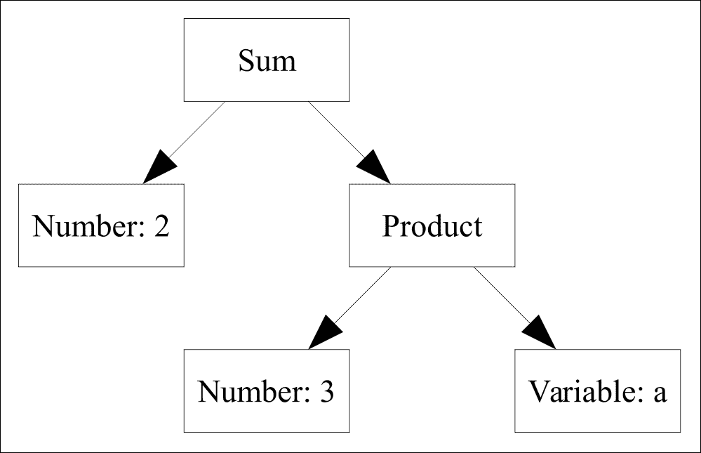
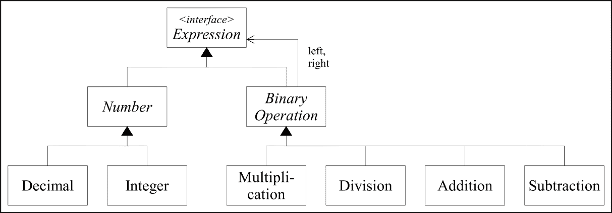
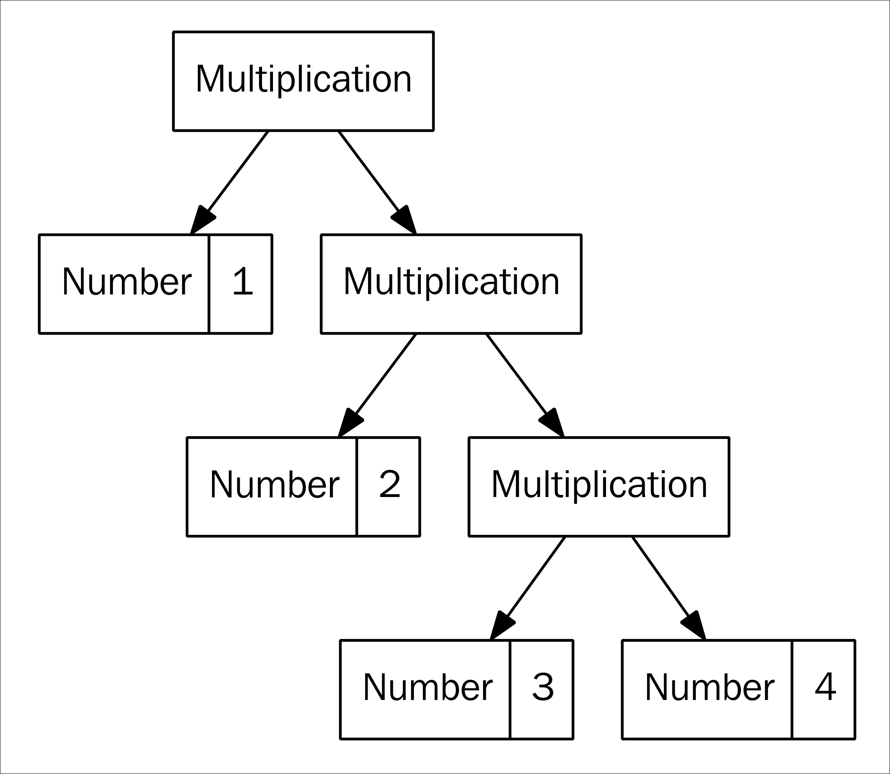
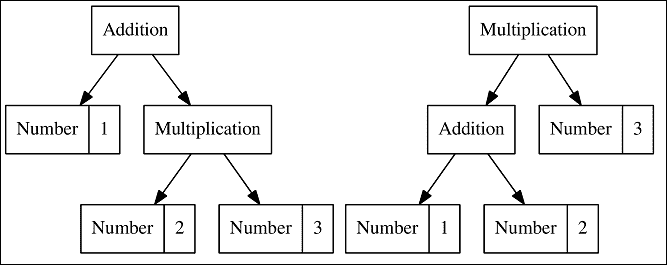
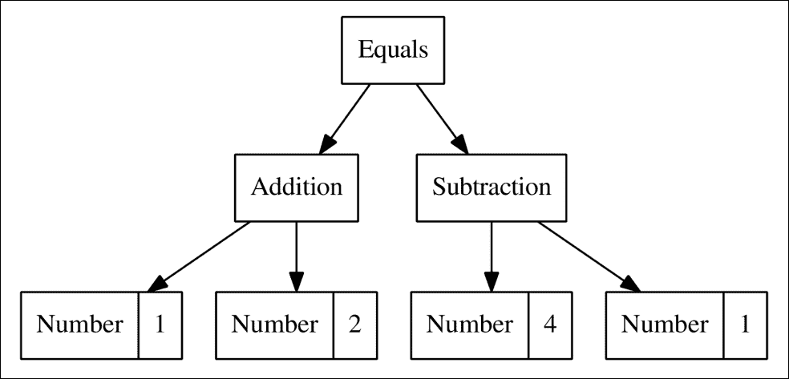
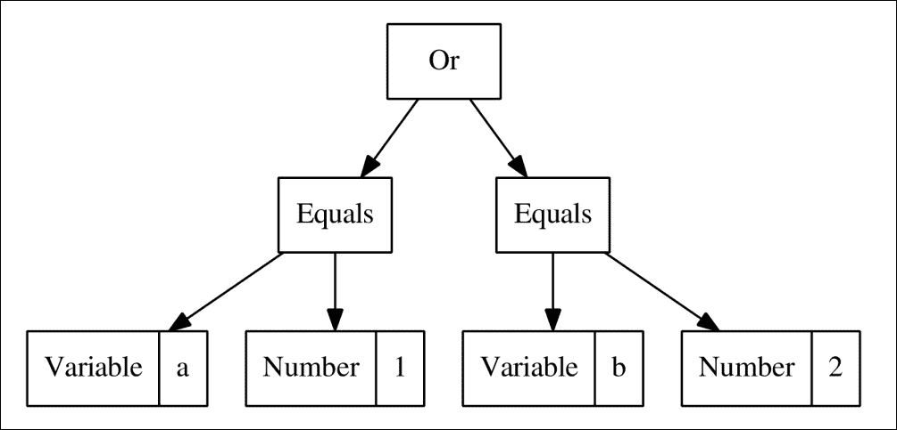
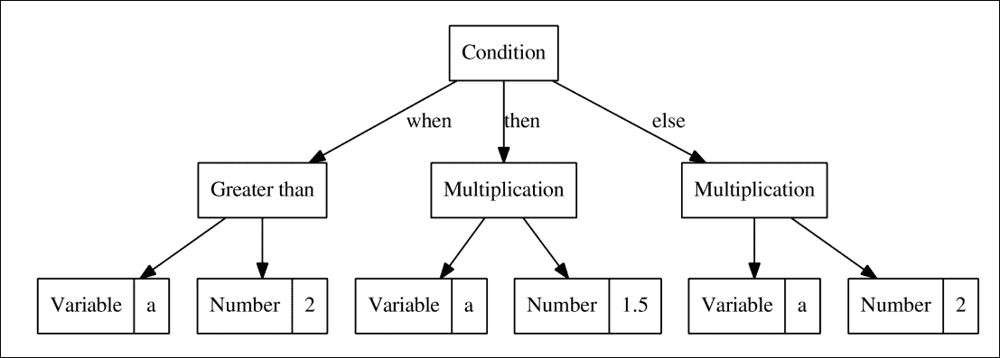
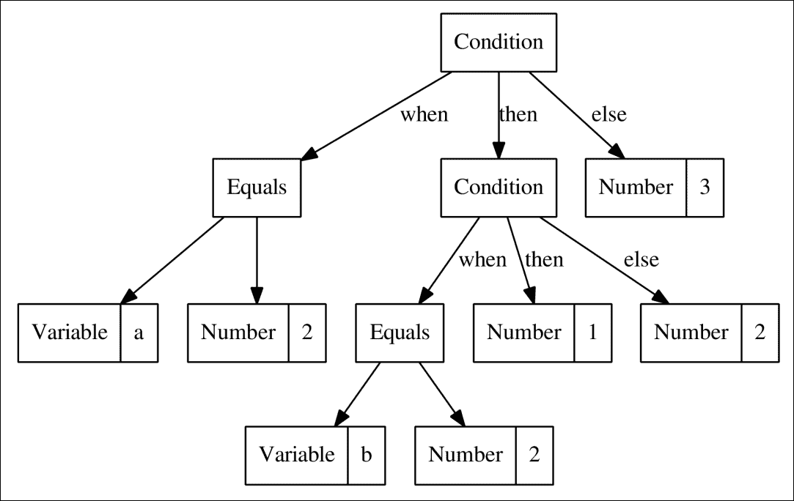

# 第 8 章为自定义语言构建解析器和解释器

可扩展性和适应性通常是企业应用程序所必需的特性。通常，用户在运行时更改应用程序的行为和业务规则是有用的、实用的，甚至是实际的功能需求。例如，设想一个电子商务应用程序，其中销售代表可以自行配置业务规则；例如，当系统应为购买提供免费送货，或在满足某些特殊条件时应应用一定的折扣（当购买金额超过 150 欧元，且客户过去已购买两次或两次以上，或已成为客户超过一年时，提供免费送货）。

根据经验，这样的规则往往会变得非常复杂（如果客户是男性，年龄超过 35 岁，有两个孩子和一只名叫“胡须先生”的猫，并在晴朗的满月之夜下订单，则会提供折扣），而且可能会频繁变化。因此，作为一名开发人员，您可能真的很乐意为用户提供一种为自己配置此类规则的可能性，而不必在每次这些规则中的一个发生更改时更新、测试和重新部署应用程序。这样的特性称为**最终用户开发**，通常使用**领域特定语言**实现。

特定于域的语言是为一个特定的应用程序域定制的语言（与通用语言相比，如 C、Java 或您猜到的 PHP）。在本章中，我们将为一种小型表达式语言构建自己的解析器，该语言可用于在企业应用程序中配置业务规则。

为此，我们需要重述解析器是如何工作的，以及如何使用形式语法描述形式语言。

# 口译员和编译器如何工作

解释器和编译器读取用编程语言编制的程序。它们要么直接执行它们（解释器），要么首先将它们转换为机器语言或另一种编程语言（编译器）。解释器和编译器通常都有两个组件，分别称为**lexer**和**解析器**。


这是编译器或解释器的基本架构

解释器可以省略代码生成，直接运行解析后的程序，而无需专门的编译步骤。

**lexer**（也称为**扫描器**或**标记器**）将输入程序分解为其可能的最小部分，即所谓的标记。每个令牌由一个令牌类（例如，数值或变量标识符）和实际令牌内容组成。例如，给定输入字符串`2 + (3 * a)`的计算器 lexer 可能会生成以下令牌列表（每个令牌都有一个令牌类和值）：

1.  编号（“`2`”）
2.  加法运算符（“`+`”）
3.  开口支架（“`(`”）
4.  编号（“`3`”）
5.  乘法运算符（“`*`”）
6.  变量标识符（“`a`”）
7.  关闭括号（“`)`”）

在下一步中，**解析器**获取令牌流，并尝试从该流导出实际的程序结构。为此，解析器需要使用一组描述输入语言的规则（语法）进行编程。在许多情况下，解析器生成一个数据结构，该结构表示结构化树中的输入程序；所谓的语法树。例如，输入字符串`2 + (3 * a)`生成以下语法树：



可从表达式 2+（3*a）生成的抽象语法树（AST）

请注意，有些程序将通过词法分析，但在接下来的步骤中，解析器会将它们识别为语法错误。例如，名为`2 + ( 1`的输入字符串将通过 lexer（并生成一个令牌列表，如`{Number(2), Addition Operator, Opening bracket, Number(1)}`），但它显然在语法上是错误的，因为如果没有匹配的结束括号，开始括号就没有任何意义（假设解析器使用公认的数学表达式语法；在其他语法中，`2+(1`实际上可能是语法上有效的表达式）

# 语言和语法

为了让解析器能够理解一个程序，它需要对该语言的正式描述——语法。在本章中，我们将使用所谓的**解析表达式语法**（**PEG**）。PEG（相对）易于定义，并且有一些库可以自动为给定语法生成解析器。

语法由**终端符号**和**非终端符号**组成。非终端符号是可能由若干其他符号组成的符号，遵循某些规则（**产生式规则**。例如，语法可以包含一个*数字*作为非终端符号。每个数字都可以定义为任意长度的数字序列。因此，数字可以是 0 到 9 之间的任何字符（每个实际数字都是终端符号）。

让我们试着正式地描述数字的结构（然后建立在这个数学表达式的基础上）。让我们从描述一个数字的样子开始。每个数字由一个或多个数字组成，因此让我们从描述数字和数字开始：

```php
Digit: '0'|'1'|'2'|'3'|'4'|'5'|'6'|'7'|'8'|'9' 
Number: Digit+ 

```

在本例中，数字是我们的第一个非终端符号。我们语法的第一条规则规定，0 到 9 的任何字符都是数字。在此示例中，字符“0”到“9”是端子符号，是最小的可能构建块。

### 提示

实际上，许多解析器生成器允许您使用正则表达式匹配终端符号。在前面的示例中，您不必枚举所有可能的数字，只需声明：`Digit: /[0-9]/`

我们语法的第二条规则规定`Number`（我们的第二个非终结符号）由一个或多个`Digit`符号组成`+`表示重复一次或多次。使用相同的方法，我们还可以扩展语法以支持十进制数：

```php
Digit: '0'|'1'|'2'|'3'|'4'|'5'|'6'|'7'|'8'|'9' 
Integer: Digit+Decimal: Digit* '.' Digit+Number: Decimal | Integer

```

在这里，我们引入了两个新的非终端符号：`Integer`和`Decimal`。`Integer`只是一个数字序列，而`Decimal`可以以任意数量的数字开始（或者根本没有数字，这意味着像`.12`这样的值也是一个有效数字），然后是一个点，然后是一个或多个数字。与上面已经使用的`+`操作符（“重复一次或多次”）不同，`*`操作符的意思是“无或一次或多次”。`Number`的产生式规则现在规定一个数字可以是十进制数或整数。

### 提示

秩序在这里很重要；给定一个输入字符串`3.14`，整数规则将匹配该输入字符串的`3`，而十进制规则将匹配整个字符串。因此，在这种情况下，首先尝试将数字解析为十进制更安全，如果解析失败，则将数字解析为整数。

现在，这个语法只描述正数。但是，它可以很容易地修改为也支持负数：

```php
Digit: '0'|'1'|'2'|'3'|'4'|'5'|'6'|'7'|'8'|'9' 
Integer: '-'? Digit+ 
Decimal: '-'? Digit* '.' Digit+ 
Number: Decimal | Integer 

```

本例中使用的`?`字符表示符号是可选的。这意味着整数和十进制数字现在都可以选择以`-`字符开头。

我们现在可以继续为我们的语法定义更多的规则。例如，我们可以添加一个描述乘法的新规则：

```php
Product: Number ('*' Number)* 

```

由于除法与乘法基本上是相同的运算（并且具有相同的运算符优先级），我们可以使用相同的规则处理这两种情况：

```php
Product: Number (('*'|'/') Number)* 

```

一旦在语法中添加了一个和的规则，就要考虑操作的顺序（先乘法，再加法）。让我们定义一个名为`Sum`的新规则（同样，用一条规则涵盖加法和减法）：

```php
Sum: Product (('+'|'-') Product)* 

```

乍一看，这似乎违反直觉。毕竟，一个总和实际上并不需要由两个乘积组成。然而，由于我们的`Product`规则使用`*`作为量词，它还将匹配单个数字，从而允许将`5 + 4`等表达式解析为`Product + Product`。

为了使语法变得完整，我们仍然需要解析嵌套语句的能力。事实上，我们的语法能够解析像`2 * 3`、`2 + 3`这样的语句。即使是`2 + 3 * 4`也将被正确解析为`2 + (3 * 4)`（而不是`(2 + 3) * 4`。然而，像`(2 + 3) * 4`这样的语句不符合我们语法的任何规则。毕竟，`Product`规则规定产品是由`*`字符连接的任意数量的`Number`字符；由于括号内的总和与`Number`规则不匹配，`Product`规则也不匹配。为了解决这个问题，我们将引入两个新规则：

```php
Expr: Sum 
Value: Number | '(' Expr ')' 

```

使用新的`Value`规则，我们可以调整`Product`规则以匹配常规数字或括号内的例外情况：

```php
Product: Value ('*' Value)* 

```

在这里，您将找到描述数学表达式所需的完整语法。它还不支持任何类型的变量或逻辑语句，但它将是我们自己的解析器的合理起点，我们将在本章的其余部分构建：

```php
Expr: Sum 
Sum: Product (('+' | '-') Product)* 
Product: Value (('*' | '/') Value)* 
Value: Number | '(' Expr ')' 
Number: (Decimal | Integer) 
Decimal: '-'? Digit* '.' Digit+ 
Integer: '-'? Digit+ 
Digit: '0'|'1'|'2'|'3'|'4'|'5'|'6'|'7'|'8'|'9' 

```

# 你的第一个 PEG 解析器

从头开始构建标记器和解析器是一项非常繁琐的任务。幸运的是，存在许多库，您可以使用它们从某种形式的语法定义自动生成解析器。

在 PHP 中，您可以使用`hafriedlander/php-peg`库为任何形式语言的解析器生成 PHP 代码，这些形式语言可以由解析表达式语法描述。为此，创建一个新的项目目录，并创建一个包含以下内容的新`composer.json`文件：

```php
{ 
  "name": "packt-php7/chp8-calculator", 
  "authors": [{ 
    "name": "Martin Helmich", 
    "email": "php7-book@martin-helmich.de" 
  }], 

  "require": { 
    "hafriedlander/php-peg": "dev-master" 
  }, 
  "autoload": { 
    "psr-4": { 
      "Packt\\Chp8\\DSL": "src/" 
    }, 
    "files": [ 
      "vendor/hafriedlander/php-peg/autoloader.php" 
    ] 
  } 
} 

```

请注意，`hafriedlander/php-peg`库不使用 PSR-0 或 PSR-4 自动加载器，而是提供自己的类加载器。因此，您不能使用 composer 的内置 PSR-0/4 类加载器，需要手动包含包的自动加载器。

与前几章类似，我们将使用`Packt\Chp8\DSL`作为基于`src/`目录的 PSR-4 类加载器的基本名称空间。这意味着名为`Packt\Chp8\DSL\Foo\Bar`的 PHP 类应该位于`src/Foo/Bar.php`文件中。

在使用 PHP PEG 时，您可以将解析器作为一个普通的 PHP 类编写，该类将语法包含在一种特殊的注释中。该类用作实际解析器生成器的输入文件，该生成器随后生成实际的解析器源代码。解析器输入文件的文件类型通常为`.peg.inc`。解析器类必须扩展`hafriedlander\Peg\Parser\Basic`类。

我们的解析器将具有`Packt\Chp8\DSL\Parser\Parser`类名。它将存储在`src/Parser/Parser.peg.inc`文件中：

```php
namespace Packt\Chp8\DSL\Parser; 

use hafriedlander\Peg\Parser\Basic; 

class Parser extends Basic 
{ 
    /*!* ExpressionLanguage 

    <Insert grammar here> 

    */ 
} 

```

### 注

注意类中以`/*!*`字符开头的注释。这个特殊的注释块将由解析器生成器拾取，并且需要包含从中生成解析器的语法。

然后，您可以使用 PHP-PEG CLI 脚本构建实际的解析器（该解析器将存储在文件`src/Parser/Parser.php`中，composer 类加载器可以在该文件中拾取该解析器）：

```php
$ php -d pcre.jit=0 vendor/hafriedlander/php-peg/cli.php 
    src/Parser/Parser.peg.inc > src/Parser/Parser.php

```

### 提示

`-d pcre.jit=0`标志是修复 PEG 包中与 PHP7 相关的错误所必需的。禁用`pcre.jit`标志可能会影响程序的性能；但是，只有在生成解析器时才能禁用此标志。生成的解析器将不受`pcre.jit`标志的影响。

当前，解析器生成将失败并出现错误，因为解析器类尚未包含有效的语法。这很容易改变；在解析器输入文件中的特殊注释（以`/*!*`开头）中添加以下行：

```php
/*!* ExpressionLanguage 

Digit: /[0-9]/ 
Integer: '-'? Digit+ 
Decimal: '-'? Digit* '.' Digit+ 
Number: Decimal | Integer 

*/ 

```

您会注意到，这正是我们在上一节中使用的匹配数字的示例语法。这意味着在重新构建解析器之后，您将拥有一个解析器，该解析器知道数字的外观并能够识别它们。诚然，这是不够的。但我们可以在此基础上再接再厉。

如前所示，通过运行`cli.php`脚本重建解析器，并在项目目录中创建名为`test.php`的测试脚本继续：

```php
require_once 'vendor/autoload.php'; 

use \Packt\Chp8\DSL\Parser\Parser; 

$result1 = new (Parser('-143.25'))->match_Number(); 
$result2 = new (Parser('I am not a number'))->match_Number(); 

var_dump($result1); 
var_dump($result2); 

```

记住，`Packt\Chp8\DSL\Parser\Parser`类是根据您的`Parser.peg.inc`输入文件自动生成的。该类继承了`hafriedlander\Peg\Parser\Basic`类，该类还提供了构造函数。构造函数接受解析器应该解析的表达式。

对于语法中定义的每个非终端符号，解析器将包含一个名为`match_[symbol name]()`（例如，`match_Number`）的函数，该函数将根据给定规则匹配输入字符串。

在我们的示例中，`$result1`是针对有效数字的匹配结果（或者，通常是由解析器语法匹配的输入字符串），而`$result2`的输入字符串显然不是数字，不应该由语法匹配。让我们看看这个测试脚本的输出：

```php
array(3) { 
  '_matchrule' => 
  string(6) "Number" 
  'name' => 
  string(6) "Number" 
  'text' => 
  string(7) "-143.25" 
} 
bool(false) 

```

如您所见，解析第一个输入字符串将返回一个数组，该数组包含匹配规则和该规则匹配的字符串。如果规则不匹配（例如在`$result2`中），`match_*`函数将始终返回`false`。

让我们继续添加上一节中已经看到的其余规则。这将使我们的解析器不仅可以解析数字，还可以解析整个数学表达式：

```php
/*!* ExpressionLanguage 

Digit: /[0-9]/ 
Integer: '-'? Digit+ 
Decimal: '-'? Digit* '.' Digit+ 
Number: Decimal | Integer 
Value: Number | '(' > Expr > ')' 
Product: Value (> ('*'|'/') > Value)* 
Sum: Product (> ('+'|'-') > Product)* 
Expr: Sum 

*/ 

```

请特别注意此代码示例中的`> `字符。这些是解析器生成器提供的一个特殊符号，它匹配任何长度的空白序列。在某些语法中，空格可能很重要，但在解析数学表达式时，您通常不关心是否有人输入了`2+3`或`2 + 3`。

重建解析器并调整测试脚本以测试这些新规则：

```php
var_dump((new Parser('-143.25'))->match_Expr()); 
var_dump((new Parser('12 + 3'))->match_Expr()); 
var_dump((new Parser('1 + 2 * 3'))->match_Expr()); 
var_dump((new Parser('(1 + 2) * 3'))->match_Expr()); 
var_dump((new Parser('(1 + 2)) * 3'))->match_Expr()); 

```

特别注意最后一行。显然，`(1 + 2)) * 3`表达式在语法上是错误的，因为它包含的结束括号比开始括号多。但是，此输入语句的`match_Expr`函数输出如下：

```php
array(3) { 
  '_matchrule' => 
  string(4) "Expr" 
  'name' => 
  string(4) "Expr" 
  'text' => 
  string(7) "(1 + 2)" 
} 

```

如您所见，输入字符串仍然符合`Expr`规则，只是不符合整个字符串。字符串的第一部分`(1 + 2)`在语法上是正确的，并且符合`Expr`规则。在使用 PEG 解析器时，必须记住这一点。如果规则与整个输入字符串不匹配，解析器仍将尽可能多地匹配输入。作为这个解析器的用户，您可以决定部分匹配是否是一件好事（在我们的例子中，这可能会触发一个错误，因为部分匹配的表达式将导致非常奇怪的结果，对于用户来说无疑是非常令人惊讶的）。

# 求值表达式

到目前为止，我们只使用定制的 PEG 解析器检查输入字符串是否符合给定的语法（也就是说，我们可以*告诉*输入字符串是否包含有效的数学表达式）。下一个逻辑步骤是实际计算这些表达式（例如，确定`'(1 + 2) * 3'`计算为`'9'`。

正如您已经看到的，每个`match_*`函数返回一个数组，其中包含有关匹配字符串的附加信息。在解析器中，您可以注册在匹配给定符号时将调用的自定义函数。让我们从简单的事情开始，尝试将语法匹配的数字转换为实际的 PHP 整数或浮点值。为此，首先修改语法中的`Integer`和`Decimal`规则，如下所示：

```php
Integer: value:('-'? Digit+) 
 function value(array &$result, array $sub) { 
 $result['value'] = (int) $sub['text']; 
 } 

Double: value:('-'? Digit* '.' Digit+)
 function value(array &$result, array $sub) { 
 $result['value'] = (float) $sub['text']; 
 }

```

让我们看看这里发生了什么。在每个规则中，您可以指定规则内子模式的名称。例如，`Integer`规则中的模式`Digit+`获得了名为`value`的名称。一旦解析器找到与此模式匹配的字符串，它将使用`Integer`规则下提供的相同名称调用函数。将使用两个参数调用该函数：`&$result`参数将是实际`match_Number`函数稍后返回的数组。如您所见，参数作为引用传递，您可以在 value 函数中对其进行修改。`$sub`参数包含子模式的结果数组（在任何情况下，它都包含一个属性`text`，您可以从中访问匹配子模式的实际文本内容）。

在本例中，我们只需使用 PHP 的内置函数将文本中的数字转换为实际的`int`或`float`变量。然而，这仅仅是因为我们的自定义语法和 PHP 同时以相同的方式表示数字，允许我们使用 PHP 解释器将这些值转换为实际的数值。

如果在某个规则中使用非终端符号，则无需显式指定子模式名称；您可以简单地将符号名用作函数名。这可以在`Number`规则中完成：

```php
Number: Decimal | Integer 
 function Decimal(array &$result, array $sub) { 
 $result['value'] = $sub['value']; 
 } 
 function Integer(array &$result, array $sub) { 
 $result['value'] = $sub['value']; 
 }

```

同样，`$sub`参数包含匹配子模式的结果数组。在本例中，这意味着您之前修改过的`match_Decimal`和`match_Integer`函数返回的结果数组。

使用`Product`和`Sum`规则，这将变得更加复杂。首先在`Product`规则的各个部分添加标签：

```php
Product: left:Value (operand:(> operator:('*'|'/') > right:Value))* 

```

通过向规则中添加相应的规则函数继续：

```php
Product: left:Value (operand:(> operator:('*'|'/') > right:Value))* 
 function left(array &$result, array $sub) { 
 $result['value'] = $sub['value']; 
 } 
 function right(array &$result, array $sub) { 
 $result['value'] = $sub['value']; 
 } 
 function operator(array &$result, array $sub) { 
 $result['operator'] = $sub['text']; 
 } 
 function operand(array &$result, array $sub) { 
 if ($sub['operator'] == '*') { 
 $result['value'] *= $sub['value']; 
 } else { 
 $result['value'] /= $sub['value']; 
 } 
 }

```

`Sum`规则可以分别修改：

```php
Sum: left:Product (operand:(> operator:('+'|'-') > right:Product))* 
 function left(array &$result, array $sub) { 
 $result['value'] = $sub['value']; 
 } 
 function right(array &$result, array $sub) { 
 $result['value'] = $sub['value']; 
 } 
 function operator(array &$result, array $sub) { 
 $result['operator'] = $sub['text']; 
 } 
 function operand(array &$result, array $sub) { 
 if ($sub['operator'] == '+') { 
 $result['value'] += $sub['value']; 
 } else { 
 $result['value'] -= $sub['value']; 
 } 
 }

```

最后，您还需要修改`Value`和`Expr`规则：

```php
Value: Number | '(' > Expr > ')' 
 function Number(array &$result, array $sub) { 
 $result['value'] = $sub['value']; 
 } 
 function Expr(array &$result, array $sub) { 
 $result['value'] = $sub['value']; 
 } 
Expr: Sum 
 function Sum(array &$result, array $sub) { 
 $result['value'] = $sub['value']; 
 }

```

在解析器中使用这些新函数，它现在可以动态计算解析表达式（请注意，这里我们没有遵循*传统的*编译器体系结构，因为解析和执行不被视为单独的步骤，而是在同一过程中完成）。使用`cli.php`脚本重新构建解析器类，并调整测试脚本以测试某些表达式：

```php
var_dump((new Parser('-143.25'))->match_Expr()['value']); 
var_dump((new Parser('12 + 3'))->match_Expr()['value']); 
var_dump((new Parser('1 + 2 * 3'))->match_Expr()['value']); 
var_dump((new Parser('(1 + 2) * 3'))->match_Expr()['value']); 

```

运行测试脚本将提供以下输出：

```php
double(-143.25) 
int(15) 
int(7) 
int(9) 

```

# 构建抽象语法树

目前，我们的解析器解释输入代码并在同一过程中对其求值。大多数编者和口译员；但是，在实际运行程序之前创建一个中间数据结构：**抽象语法树**（**AST**）。使用 AST 提供了一些有趣的可能性；例如，它为您的程序提供结构化表示，然后您可以对其进行分析。此外，您还可以使用 AST 并将其转换回基于文本的程序（可能是另一种语言）。

AST 是表示程序结构的树。构建基于 AST 的解析器的第一步是设计树的对象模型：需要哪些类以及它们以何种方式与其他类关联。下图显示了可用于描述数学表达式的对象模型初稿：



抽象语法树的（初步）对象模型

在这个模型中，几乎所有类都实现了`Expression`接口。该接口规定了`evaluate()`方法，该方法可由该接口的实现提供，以实际执行由相应树节点建模的操作。让我们从实现`Packt\Chp8\DSL\AST\Expression`接口开始：

```php
namespace Packt\Chp8\DSL\AST; 

interface Expression 
{ 
    public function evaluate() 
} 

```

下一步是`Number`类及其两个子类：`Integer`和`Decimal`。因为我们将要使用 PHP7 的类型暗示特性，`Integer`和`Decimal`类都只处理`int`或`float`变量；我们不能充分利用继承，迫使我们将`Number`类留空：

```php
namespace Packt\Chp8\DSL\AST; 

abstract class Number implements Expression 
{} 

```

`Integer`类可以用 PHP 整数值初始化。由于该类对文本整数值进行建模；`evaluate()`方法在这个类中唯一需要做的就是再次返回这个值：

```php
namespace Packt\Chp8\DSL\AST; 

class Integer extends Number 
{ 
    private $value; 

    public function __construct(int $value) 
    { 
        $this->value = $value; 
    } 

    public function evaluate(): int 
    { 
        return $this->value; 
    } 
} 

```

`Decimal`类也可以用同样的方法实现；在这种情况下，只需使用`float`而不是`int`作为类型提示：

```php
namespace Packt\Chp8\DSL\AST; 

class Decimal extends Number 
{ 
    private $value; 

    public function __construct(float $value) 
    { 
        $this->value = $value; 
    } 

    public function evaluate(): float 
    { 
        return $this->value; 
    } 
} 

```

对于类`Addition`、`Subtraction`、`Multiplication`和`Division`，我们将使用一个公共基类`Packt\Chp8\DSL\AST\BinaryOperation`。该类将包含构造函数，您不必反复实现该构造函数：

```php
namespace Packt\Chp8\DSL\AST; 

abstract class BinaryOperation implements Expression 
{ 
    protected $left; 
    protected $right; 

    public function __construct(Expression $left, Expression $right) 
    { 
        $this->left  = $left; 
        $this->right = $right; 
    } 
} 

```

实现对操作进行建模的实际类变得很容易。让我们考虑一个例子：

```php
namespace Packt\Chp8\DSL\AST; 

class Addition extends BinaryOperation 
{ 
    public function evaluate() 
    { 
 return $this->left->evaluate() + $this->right->evaluate(); 
    } 
} 

```

其余名为`Subtraction`、`Multiplication`和`Division`的类可以用类似于`Addition`类的方式实现。为了简洁起见，这些类的实际实现留给您作为练习。

现在剩下的就是在解析器中实际构建 AST。这是相对容易的，因为我们现在可以简单地修改已经存在的钩子函数，这些钩子函数在匹配单个规则时由解析器调用。

让我们从解析数字的规则开始：

```php
Integer: value:('-'? Digit+) 
    function value(array &$result, array $sub) { 
 $result['node'] = new Integer((int) $sub['text']); 
    } 

Decimal: value:('-'? Digit* '.' Digit+) 
    function value(array &$result, array $sub) { 
 $result['node']  = new Decimal((float) $sub['text']); 
    } 

Number: Decimal | Integer 
    function Decimal(&$result, $sub) { 
 $result['node']  = $sub['node']; 
    } 
    function Integer(&$result, $sub) { 
 $result['node']  = $sub['node']; 
    } 

```

当`Integer`或`Decimal`规则匹配时，我们创建`Integer`或`Decimal`类的新 AST 节点，并将其保存在返回数组的 node 属性中。当`Number`规则匹配时，我们只需接管存储在匹配符号中的已创建节点。

我们可以用类似的方式调整`Product`规则：

```php
Product: left:Value (operand:(> operator:('*'|'/') > right:Value))* 
    function left(array &$result, array $sub) { 
 $result['node']  = $sub['node']; 
    } 
    function right(array &$result, array $sub) { 
 $result['node']  = $sub['node']; 
    } 
    function operator(array &$result, array $sub) { 
 $result['operator'] = $sub['text']; 
    } 
    function operand(array &$result, array $sub) { 
        if ($sub['operator'] == '*') { 
 $result['node'] = new Multiplication($result['node'], $sub['node']); 
        } else { 
 $result['node'] = new Division($result['node'], $sub['node']); 
        } 
    } 

```

由于我们的 AST 模型将乘法等操作严格视为二进制操作，解析器将把输入表达式（如`1 * 2 * 3 * 4`等）解构为一个二进制乘法链（类似于`1 * (2 * (3 * 4))`，如下图所示）：



表达式 1*2*3*4 作为语法树

继续以相同的方式调整您的`Sum`规则：

```php
Sum: left:Product (operand:(> operator:('+'|'-') > right:Product))* 
    function left(&$result, $sub) { 
 $result['node']  = $sub['node']; 
    } 
    function right(&$result, $sub) { 
 $result['node']  = $sub['node']; 
    } 
    function operator(&$result, $sub) { $result['operator'] = $sub['text']; } 
    function operand(&$result, $sub) { 
        if ($sub['operator'] == '+') { 
 $result['node'] = new Addition($result['node'], $sub['node']); 
        } else { 
 $result['node'] = new Subtraction($result['node'], $sub['node']); 
        } 
    } 

```

现在只剩下读取`Value`中创建的 AST 节点，`Expr`规则如下：

```php
Value: Number | '(' > Expr > ')' 
    function Number(array &$result, array $sub) { 
 $result['node'] = $sub['node']; 
    } 

Expr: Sum 
    function Sum(array &$result, array $sub) { 
 $result['node'] = $sub['node']; 
    } 

```

在测试脚本中，您现在可以通过从`match_Expr()`函数的返回值中提取`node`属性来测试 AST 是否正确构建。然后，您可以通过在 AST 的根节点上调用`evaluate()`方法来获得表达式的结果：

```php
$astRoot = (new Parser('1 + 2 * 3'))->match_Expr()['node']; 
var_dump($astRoot, $astRoot->evaluate()); 

$astRoot = (new Parser('(1 + 2) * 3'))->match_Expr()['node']; 
var_dump($astRoot, $astRoot->evaluate()); 

```

请注意，此测试脚本中的两个表达式应生成两个不同的语法树（均如下图所示），并分别计算为 7 和 9。



解析 1+2*'和（1+2）*'表达式产生的两个语法树

# 打造更好的界面

现在，我们构建的解析器并不容易使用。为了正确使用解析器，用户（在本文中，将“user”理解为“使用您的解析器的另一个开发人员”）必须调用`match_Expr()`方法（这只是解析器提供的许多公共`match_*`函数中的一个，这些函数实际上不应该由外部用户调用），提取`node`属性，然后在此属性中包含的根节点上调用求值函数。此外，解析器还匹配部分字符串（还记得我们的解析器识别为部分正确的示例`(1 + 2)) * 3`），这可能会让一些用户感到惊讶。

这个理由足以通过封装这些怪癖的新类扩展我们的项目，并为我们的解析器提供更干净的接口。让我们创建一个新类，`Packt\Chp8\DSL\ExpressionBuilder`：

```php
namespace Packt\Chp8\DSL\ExpressionBuilder; 

use Packt\Chp8\DSL\AST\Expression; 
use Packt\Chp8\DSL\Exception\ParsingException; 
use Packt\Chp8\DSL\Parser\Parser; 

class ExpressionBuilder 
{ 
    public function parseExpression(string $expr): Expression 
    { 
        $parser = new Parser($expr); 
        $result = $parser->match_Expr(); 

        if ($result === false || $result['text'] !== $expr) { 
            throw new ParsingException(); 
        } 

        return $result['node']; 
    } 
} 

```

在本例中，我们通过断言解析器返回的匹配字符串实际上等于输入字符串（而不仅仅是子字符串），来检查是否可以解析整个字符串。如果是这种情况（或者表达式根本无法解析，结果为 false），则抛出一个`Packt\Chp8\DSL\Exception\ParsingException`实例。此异常类尚未定义；目前，它只需继承基本异常类，不需要包含任何自定义逻辑：

```php
namespace Packt\Chp8\DSL\Exception; 

class ParsingException extends \Exception 
{} 

```

新的`ExpressionBuilder`类现在为您提供了一种更简洁的解析和计算表达式的方法。例如，您现在可以在`test.php`脚本中使用以下构造：

```php
$builder = new \Packt\Chp8\DSL\ExpressionBuilder; 

var_dump($builder->parseExpression('12 + 3')->evaluate()); 

```

# 评估变量

到目前为止，我们的解析器可以对静态表达式进行求值，从简单表达式（如`3`）（其求值结果令人惊讶）到任意复杂表达式（如`(5 + 3.14) * (14 + (29 - 2 * 3.918))`）（顺便说一下，其求值结果为 286.23496）。然而，所有这些表达都是静态的；他们的评估结果总是一样的。

为了使其更具动态性，我们现在将扩展语法以允许变量。带有变量的表达式的一个示例是`3 + a`，然后可以使用`a`的不同值对其进行多次计算。

这次，让我们从修改语法树的对象模型开始。首先，我们需要一个新的节点类型`Packt\Chp8\DSL\AST\Variable`，例如允许`3 + a`表达式生成以下语法树：


从表达式 3+a 生成的语法树

还有第二个问题：与使用**个**节点的`Number`节点或算术运算相反，我们不能简单地计算**变量**节点的数值（毕竟，它可以有任何值——这就是变量的点）。因此，在计算表达式时，我们还需要传递有关哪些变量存在以及它们具有哪些值的信息。为此，我们只需通过一个附加参数扩展`Packt\Chp8\DSL\AST\Expression`接口中定义的`evaluate()`函数：

```php
namespace Packt\Chp8\DSL\AST; 

interface Expression 
{ 
 public function evaluate(array $variables = []); 
} 

```

更改接口定义需要更改实现此接口的所有类。在`Number`子类（`Integer`和`Decimal`中），您可以添加新参数并忽略它。静态数字的值根本不依赖于任何变量的值。下面的代码示例显示了在`Packt\Chp8\DSL\AST\Integer`类中的这种更改，但它还记得以相同的方式更改`Decimal`类：

```php
class Integer 
{ 
    // ... 
 public function evaluate(array $variables = []): int 
    { 
        return $this->value; 
    } 
} 

```

在`BinaryOperation`子类（`Addition`、`Subtraction`、`Multiplication`和`Division`中，定义变量的值也并不重要。但我们需要将它们传递给这些节点的子节点。下面的示例显示了在`Packt\Chp8\DSL\AST\Addition`类中的这种更改，但它还记得更改`Subtraction`、`Multiplication`和`Division`类：

```php
class Addition 
{ 
 public function evaluate(array $variables = []) 
    { 
 return $this->left->evaluate($variables) 
 + $this->right->evaluate($variables); 
    } 
} 

```

最后，我们现在可以声明我们的`Packt\Chp8\DSL\AST\Variable`类：

```php
namespace Packt\Chp8\DSL\AST; 

use Packt\Chp8\DSL\Exception\UndefinedVariableException; 

class Variable implements Expression 
{ 
    private $name; 

    public function __construct(string $name) 
    { 
        $this->name = $name; 
    } 

    public function evaluate(array $variables = []) 
    { 
        if (isset($variables[$this->name])) { 
            return $variables[$this->name]; 
        } 
        throw new UndefinedVariableException($this->name); 
    } 
} 

```

在这个类“`evaluate()`方法中，您可以查找这个变量当前拥有的实际值。如果未定义变量（读取：`$variables`参数中不存在），我们将引发（尚未实现）`Packt\Chp8\DSL\Exception\UndefinedVariableException`的实例，让用户知道有问题。

### 提示

如何在自定义语言中处理未定义的变量完全取决于您自己。除了触发错误，您还可以更改`Variable`类的`evaluate()`方法，以便在计算未定义变量时返回默认值，例如 0（或任何其他值）。然而，使用未定义的变量可能是无意的，简单地继续使用默认值可能会让您的用户感到非常惊讶。

`UndefinedVariableException`类可以简单地扩展常规`Exception`类：

```php
namespace Packt\Chp8\DSL\Exception; 

class UndefinedVariableException extends \Exception 
{ 
    private $name; 

    public function __construct(string $name) 
    { 
        parent::__construct('Undefined variable: ' . $name); 
        $this->name = $name; 
    } 
} 

```

最后，我们需要调整解析器的语法以实际识别表达式中的变量。为此，我们的语法需要两个额外的符号：

```php
Name: /[a-zA-z]+/ 
Variable: Name 
    function Name(&$result, $sub) { 
        $result['node'] = new Variable($sub['name']); 
    } 

```

接下来，您需要扩展`Value`规则。目前，`Value`可以是`Number`符号，也可以是用大括号包裹的`Expr`。现在，您还需要允许变量：

```php
Value: Number | Variable | '(' > Expr > ')' 
    function Number(array &$result, $sub) { 
        $result['node'] = $sub['node']; 
    } 
 function Variable(array &$result, $sub) { 
 $result['node'] = $sub['node']; 
 } 
    function Expr(array &$result, $sub) { 
        $result['node'] = $sub['node']; 
    } 

```

使用 PHP-PEG 的`cli.php`脚本重建解析器，并向`test.php`脚本添加一些调用以测试此新功能：

```php
$expr = $builder->parseExpression('1 + 2 * a'); 
var_dump($expr->evaluate(['a' => 1])); 
var_dump($expr->evaluate(['a' => 14])); 
var_dump($expr->evaluate(['a' => -1])); 

```

这些应分别评估为 3、29 和-1。您还可以尝试在不传递任何变量的情况下对表达式求值，这将（理所当然地）导致抛出一个`UndefinedVariableException`。

# 添加逻辑表达式

目前，我们的语言只支持数字表达式。另一个有用的补充是支持布尔表达式，这些表达式的计算结果不是数值，而是*true*或*false*。可能的示例包括如下表达式：`3 = 4`（总是计算为*false*）、`2 < 4`（总是计算为*true*）或`a <= 5`（取决于变量`a`的值）。

## 比较

与前面一样，让我们从扩展语法树的对象模型开始。我们将从一个表示两个表达式之间相等检查的**Equals**节点开始。使用此节点，`1 + 2 = 4 - 1`表达式将生成以下语法树（当然最终应计算为*true*：



解析 1+2=4-1 表达式时应产生的语法树

为此，我们将实现`Packt\Chp8\DSL\AST\Equals`类。这个类可以继承我们之前实现的`BinaryOperation`类：

```php
namespace Packt\Chp8\DSL\AST; 

class Equals extends BinaryOperation 
{ 
    public function evaluate(array $variables = []) 
    { 
        return $this->left->evaluate($variables) 
            == $this->right->evaluate($variables); 
    } 
} 

```

我们在做的同时，也可以同时实现`NotEquals`节点：

```php
namespace Packt\Chp8\DSL\AST; 

class NotEquals extends BinaryOperation 
{ 
    public function evaluate(array $variables = []) 
    { 
 return $this->left->evaluate($variables) 
 != $this->right->evaluate($variables); 
    } 
} 

```

在下一步中，我们需要调整解析器的语法。首先，我们需要修改语法来区分数值表达式和布尔表达式。为此，我们将在整个语法中将`Expr`符号重命名为`NumExpr`。这会影响`Value`符号：

```php
Value: Number | Variable | '(' > NumExpr > ')' 
    function Number(array &$result, array $sub) { 
        $result['node'] = $sub['node']; 
    } 
    function Variable(array &$result, array $sub) { 
        $result['node'] = $sub['node']; 
    } 
 function NumExpr(array &$result, array $sub) { 
        $result['node'] = $sub['node']; 
    } 

```

当然，您还需要更改`Expr`规则本身：

```php
NumExpr: Sum 
    function Sum(array &$result, array $sub) { 
        $result['node'] = $sub['node']; 
    } 

```

接下来，我们可以定义平等（以及非平等）规则：

```php
ComparisonOperator: '=' | '|=' 
Comparison: left:NumExpr (operand:(> op:ComparisonOperator > right:NumExpr)) 
    function left(&$result, $sub) { 
        $result['leftNode'] = $sub['node']; 
    } 
    function right(array &$result, array $sub) { 
        $result['node'] = $sub['node']; 
    } 
    function op(array &$result, array $sub) { 
        $result['op'] = $sub['text']; 
    } 
    function operand(&$result, $sub) { 
        if ($sub['op'] == '=') { 
            $result['node'] = new Equals($result['leftNode'], $sub['node']); 
        } else { 
            $result['node'] = new NotEquals($result['leftNode'], $sub['node']); 
        } 
    } 

```

请注意，在这种情况下，此规则变得更为复杂，因为它支持多个运算符。然而，这些规则现在相对容易被更多的运算符扩展（当我们检查非相等项时，“大于”或“小于”可能是下一个逻辑步骤）。首先定义的`ComparisonOperator`符号匹配各种比较运算符和使用此符号匹配实际表达式的`Comparison`规则。

最后，我们可以添加一个新的`BoolExpr`符号，也可以重新定义`Expr`符号：

```php
BoolExpr: Comparison 
    function Comparison(array &$result, array $sub) { 
        $result['node'] = $sub['node']; 
    } 

Expr: BoolExpr | NumExpr 
    function BoolExpr(array &$result, array $sub) { 
        $result['node'] = $sub['node']; 
    } 
    function NumExpr(array &$result, array $sub) { 
        $result['node'] = $sub['node']; 
    } 

```

调用`match_Expr()`函数时，我们的解析器现在将匹配数值表达式和布尔表达式。使用 PHP-PEG 的`cli.php`脚本重建解析器，并向`test.php`脚本添加一些新调用：

```php
$expr = $builder->parseExpression('1 = 2'); 
var_dump($expr->evaluate()); 

$expr = $builder->parseExpression('a * 2 = 6'); 
var_dump($expr->evaluate(['a' => 3]); 
var_dump($expr->evaluate(['a' => 4]); 

```

这些表达式应分别计算为*假*、*真*和*假*。您以前添加的数值表达式应继续像以前一样工作。

与此类似，您现在可以在语法中添加其他比较运算符，例如`>`、`>=`、`<`或`<=`。由于这些操作符的实现与`=`和`|=`操作基本相同，我们将留给您作为练习。

## and 和 or 运算符

为了完全支持逻辑表达式，另一个重要特性是能够通过“and”和“or”运算符组合逻辑表达式。在我们开发语言时，我们考虑的是最终用户，因此我们将构建我们的语言，以实际支持`and`和`or`作为逻辑运算符（与许多通用编程语言中普遍存在的`&&`和`||`形成对比，这些语言是从 C 语法派生的）。

同样，让我们从实现语法树的各个节点类型开始。我们需要为`and`和`or`操作建模的节点类型，以便将`a = 1`或`b = 2`等语句解析为以下语法树：



解析 a=1 或 b=2 时生成的语法树

首先实现`Packt\Chp8\DSL\AST\LogicalAnd`类（我们不能使用*和*作为类名，因为这是 PHP 中的保留字）：

```php
namespace Packt\Chp8\DSL\AST; 

class LogicalAnd extends BinaryOperation 
{ 
    public function evaluate(array $variables=[]) 
    { 
        return $this->left->evaluate($variables) 
            && $this->right->evaluate($variables); 
    } 
} 

```

对于`or`操作符，也可以用同样的方法实现`Packt\Chp8\DSL\AST\LogicalOr`类。

在使用`and`和`or`运算符时，需要考虑运算符优先级。虽然算术运算的运算符优先级定义良好，但逻辑运算符的情况并非如此。例如，语句`a and b or c and d`可以解释为`(((a and b) or c) and d)`（相同优先级，从左到右），也可以解释为`(a and b) or (c and d)`（优先级在`and`上）或`(a and (b or c)) and d`（优先级在`or`上）。然而，大多数编程语言都以最高优先级处理`and`运算符，因此除非有任何其他约定，否则坚持这一传统是有意义的。

下图显示了在`a=1 and b=2 or b=3`和`a=1 and (b=2 or b=3)`语句上应用此优先级所产生的语法树：


解析 a=1 和 b=2 或 b=3 以及 a=1 和（b=2 或 b=3）所产生的语法树

为此，我们需要一些新的语法规则。首先，我们需要一个表示布尔值的新符号。目前，这样的布尔值可以是比较值，也可以是任何用括号括起来的布尔表达式。

```php
BoolValue: Comparison | '(' > BoolExpr > ')' 
    function Comparison(array &$res, array $sub) { 
        $res['node'] = $sub['node']; 
    } 
    function BoolExpr(array &$res, array $sub) { 
        $res['node'] = $sub['node']; 
    } 

```

您还记得我们以前是如何使用`Product`和`Sum`规则实现运算符优先级的吗？我们可以用同样的方式执行`And`和`Or`规则：

```php
And: left:BoolValue (> "and" > right:BoolValue)* 
    function left(array &$res, array $sub) { 
        $res['node'] = $sub['node']; 
    } 
    function right(array &$res, array $sub) { 
        $res['node'] = new LogicalAnd($res['node'], $sub['node']); 
    } 

Or: left:And (> "or" > right:And)* 
    function left(array &$res, array $sub) { 
        $res['node'] = $sub['node']; 
    } 
    function right(array &$res, array $sub) { 
        $res['node'] = new LogicalOr($res['node'], $sub['node']); 
    } 

```

在此之后，我们可以扩展`BoolExpr`规则来匹配`Or`表达式（因为单个`And`符号也匹配`Or`规则，所以单个`And`符号也将是`BoolExpr`：

```php
BoolExpr: Or | Comparison 
 function Or(array &$result, array $sub) { 
 $result['node'] = $sub['node']; 
 } 
    function Comparison(array &$result, array $sub) { 
        $result['node'] = $sub['node']; 
    } 

```

您现在可以向`test.php`脚本添加一些新的测试用例。使用变量并特别注意如何解析运算符优先级：

```php
$expr = $builder->parseExpression('a=1 or b=2 and c=3'); 
var_dump($expr->evaluate([ 
    'a' => 0, 
    'b' => 2, 
    'c' => 3 
]); 

```

## 条件

既然我们的语言支持（任意复杂的）逻辑表达式，我们就可以使用它们来实现另一个重要特性：条件语句。我们的语言目前只支持计算为单个数值或布尔值的表达式；现在，我们将实现三元运算符的一个变体，这在 PHP 中也是众所周知的：

```php
($b > 0) ? 1 : 2; 

```

由于我们的语言面向最终用户，因此我们将使用更具可读性的语法，这将允许使用诸如`when <condition> then <value> else <value>`之类的语句。在我们的语法树中，这样的构造将由`Packt\Chp8\DSL\AST\Condition`类表示：

```php
<?php 
namespace Packt\Chp8\DSL\AST; 

class Condition implements Expression 
{ 
    private $when; 
    private $then; 
    private $else; 

    public function __construct(Expression $when, Expression $then, Expression $else) 
    { 
        $this->when = $when; 
        $this->then = $then; 
        $this->else = $else; 
    } 

    public function evaluate(array $variables = []) 
    { 
        if ($this->when->evaluate($variables)) { 
            return $this->then->evaluate($variables); 
        } 
        return $this->else->evaluate($variables); 
    } 
} 

```

这意味着，例如，`when a > 2 then a * 1.5 else a * 2`表达式应解析为以下语法树：



理论上，我们的语言还应该支持条件或 then/else 部分中的复杂表达式，允许使用诸如`when (a > 2 or b = 2) then (2 * a + 3 * b) else (3 * a - b)`之类的语句，甚至可以使用诸如`when a=2 then (when b=2 then 1 else 2) else 3`之类的嵌套语句：



通过向解析器的语法中添加新符号和规则继续：

```php
Condition: "when" > when:BoolExpr > "then" > then:Expr > "else" > else:Expr 
    function when(array &$res, array $sub) { 
        $res['when'] = $sub['node']; 
    } 
    function then(array &$res, $sub) { 
        $res['then'] = $sub['node']; 
    } 
    function else(array &$res, array $sub) { 
        $res['node'] = new Condition($res['when'], $res['then'], $sub['node']); 
    } 

```

另外，调整`BoolExpr`规则，使其也符合条件。在这种情况下，顺序很重要：如果在`BoolExpr`规则中首先放置`Or`或`Comparison`符号，则该规则可能会将 when 解释为变量名，而不是条件表达式。

```php
BoolExpr: Condition | Or | Comparison 
 function Condition(array &$result, array $sub) { 
 $result['node'] = $sub['node']; 
 } 
    function Or(&$result, $sub) { 
        $result['node'] = $sub['node']; 
    } 
    function Comparison(&$result, $sub) { 
        $result['node'] = $sub['node']; 
    } 

```

同样，使用 PHP-PEG 的**cli.PHP**脚本重建解析器，并向测试脚本添加一些测试语句以测试新的语法规则：

```php
$expr = $builder->parseExpression('when a=1 then 3.14 else a*2'); 
var_dump($expr->evaluate(['a' => 1]); 
var_dump($expr->evaluate(['a' => 2]); 
var_dump($expr->evaluate(['a' => 3]); 

```

这些测试用例应分别评估为 3.14、4 和 6。

# 处理结构化数据

到目前为止，我们的自定义表达式语言只支持非常简单的变量数字和布尔值。然而，在实际应用中，这通常不是那么简单。当使用表达式语言提供可编程的业务规则时，您通常会处理结构化数据。例如，考虑一个电子商务系统，其中后台办公室用户有可能定义在什么条件下应该向用户提供折扣，以及应该购买多少折扣（下面的图显示了这样的特征在应用中实际上看起来如何）的一个假设性例子。

通常，您事先不知道用户将如何使用此功能。仅使用数值变量，在计算表达式时必须传递一整套变量，否则用户可能会使用其中的一个或两个。或者，您可以将整个域对象（例如，一个代表购物车的 PHP 对象和另一个代表客户的 PHP 对象）作为变量传递到表达式中，并为用户提供访问这些对象的属性或调用方法的选项。

这样的特性允许用户在表达式中使用诸如`cart.value`之类的表达式。在计算此表达式时，可以将其转换为直接属性访问（如果`$cart`变量确实具有可公开访问的`$value`属性），或者调用`getValue()`方法：


结构化数据如何在企业电子商务应用程序中用作变量的示例

为此，我们需要稍微修改一下 AST 对象模型。我们将引入一种新的节点类型，`Packt\Chp8\DSL\AST\PropertyFetch`，它对从变量获取的命名属性进行建模。然而，我们需要考虑这些属性获取需要链接，例如，在表达式中，如 OutT1。应将此表达式解析为以下语法树：


为此，我们将重新定义之前添加的`Variable`节点类型。将`Variable`类重命名为`NamedVariable`并添加一个名为`Variable`的新接口。该接口可以由`NamedVariable`类和`PropertyFetch`类实现。然后，`PropertyFetch`类可以接受`Variable`实例作为其左操作符。

首先将`Packt\Chp8\DSL\AST\Variable`类重命名为`Packt\Chp8\DSL\AST\NamedVariable`：

```php
namespace Packt\Chp8\DSL\AST; 

use Packt\Chp8\DSL\Exception\UnknownVariableException; 

class NamedVariable implements Variable 
{ 
    private $name; 

    public function __construct(string $name) 
    { 
        $this->name = $name; 
    } 

    public function evaluate(array $variables = []) 
    { 
        if (isset($variables[$this->name])) { 
            return $variables[$this->name]; 
        } 
        throw new UnknownVariableException(); 
    } 
} 

```

然后，添加名为`Packt\Chp8\DSL\AST\Variable`的新接口。它不需要包含任何代码；我们仅将其用于类型提示：

```php
namespace Packt\Chp8\DSL\AST; 

interface Variable extends Expression 
{ 
} 

```

继续添加`Packt\Chp8\DSL\AST\PropertyFetch`新类：

```php
namespace Packt\Chp8\DSL\AST; 

class PropertyFetch implements Variable 
{ 
    private $left; 
    private $property; 

    public function __construct(Variable $left, string $property) 
    { 
        $this->left = $left; 
        $this->property = $property; 
    } 

    public function evaluate(array $variables = []) 
    { 
        $var = $this->left->evaluate($variables); 
        return $var[$this->property] ?? null; 
    } 
} 

```

最后，修改解析器语法中的`Variable`规则：

```php
Variable: Name ('.' property:Name)* 
    function Name(array &$result, array $sub) { 
        $result['node'] = new NamedVariable($sub['text']); 
    } 
 function property(&$result, $sub) { 
 $result['node'] = new PropertyFetch($result['node'], $sub['text']); 
 }

```

使用此规则，`Variable`符号可以由多个与`.`字符链接在一起的属性名称组成。然后，规则函数将为第一个属性名构建一个`NamedVariable`节点，然后将该节点放入`PropertyFetch`节点链中，以获得后续属性。

像往常一样，重建解析器并向测试脚本添加几行：

```php
$e = $builder->parseExpression('foo.bar * 2'); 
var_dump($e->evaluate(['foo' => ['bar' => 2]])); 

```

# 处理对象

让最终用户掌握数据结构的概念绝非易事。虽然*对象*具有*属性*（例如，客户有名字和姓氏）的概念通常很容易传达，但您可能不会用数据封装和对象方法之类的东西来打扰最终用户。

因此，向最终用户隐藏复杂的数据访问可能是有用的；如果用户想要访问客户的名字，他们应该能够写入`customer.firstname`，即使底层对象的实际属性受到保护，您通常需要调用`getFirstname()`方法来读取此属性。由于 getter 函数通常遵循某些命名模式，因此我们的解析器可以自动将表达式（如`customer.firstname`）转换为方法调用（如`$customer->getFirstname()`）。

为了实现此功能，我们需要通过几个特殊情况扩展`PropertyFetch`的`evaluate`方法：

```php
public function evaluate(array $variables = []) 
{ 
    $var = $this->left->evaluate($variables); 
 if (is_object($var)) { 
 $getterMethodName = 'get' . ucfirst($this->property); 
 if (is_callable([$var, $getterMethodName])) { 
 return $var->{$getterMethodName}(); 
 }
 $isMethodName = 'is' . ucfirst($this->property); 
 if (is_callable([$var, $isMethodName])) { 
 return $var->{$isMethodName}(); 
 } 
 return $var->{$this->property} ?? null; 
 } return $var[$this->property] ?? null; 
} 

```

使用此实现时，诸如`customer.firstname`之类的表达式将首先检查 customer 对象是否实现了可调用的`getFirstname()`方法。如果不是这样，解释器将检查`isFirstname()`方法（在这种情况下没有意义，但可以用作 getter 函数，因为布尔属性通常被命名为`isSomething`而不是`getSomething`。如果不存在`isFirstname()`方法，解释器将查找名为`firstname`的可访问属性，然后作为最后手段，只返回 null。

# 添加编译器优化解释器

我们的解析器现在可以正常工作，您可以在任何类型的应用程序中使用它，为最终用户提供非常灵活的定制选项。但是，解析器的工作效率不是很高。一般来说，解析表达式的计算代价很高，在大多数用例中，可以合理地假设您正在处理的实际表达式不会随每个请求而更改（或者至少，计算的频率高于更改的频率）。

因此，我们可以通过向解释器添加缓存层来优化解析器的性能。当然，我们不能缓存表达式的实际计算结果；毕竟，当用不同的变量来解释它们时，它们可能会发生变化。

在本节中，我们将要做的是向解析器添加一个编译器特性。对于每个解析的表达式，我们的解析器生成一个表示该表达式结构的 AST。现在可以使用此语法树将表达式转换为任何其他编程语言，例如 PHP。

考虑表达式 T0。此表达式生成以下语法树：


在我们的 AST 模型中，它对应于`Packt\Chp8\DSL\AST\Addition`类的一个实例，持有对`Packt\Chp8\DSL\AST\Number`类和`Packt\Chp8\DSL\AST\Product`类实例的引用（以此类推）。

我们无法实现编译器功能将这些表达式转换回 PHP 代码（毕竟，PHP 也支持简单的算术运算），这可能如下所示：

```php
use Packt\Chp8\DSL\AST\Expression; 

$cachedExpr = new class implements Expression 
{ 
    public function evaluate(array $variables=[]) 
    { 
        return 2 + (3 * $variables['a']); 
    } 
} 

```

以这种方式生成的 PHP 代码可以保存在文件中，以便以后查找。如果解析器得到一个已经缓存的表达式，它可以简单地加载保存的 PHP 文件，以便不再实际解析表达式。

要实现此功能，我们需要能够将语法树中的每个节点转换为相应的 PHP 表达式。为此，我们先用一种新方法扩展我们的`Packt\Chp8\DSL\AST\Expression`接口：

```php
namespace Packt\Chp8\DSL\AST; 

interface Expression 
{ 
    public function evaluate(array $variables = []); 

 public function compile(): string; 
} 

```

这种方法的缺点是，现在需要为实现此接口的每个类实现此方法。让我们从简单的事情开始：`Packt\Chp8\DSL\AST\Number`类。由于每个`Number`实现的计算结果总是相同的数字（3 总是计算结果是 3，从不计算结果是 4），我们可以简单地返回数值：

```php
namespace Packt\Chp8\DSL\AST; 

abstract class Number implements Expression 
{ 
 public function compile(): string 
 { 
 return var_export($this->evaluate(), true); 
 } 
} 

```

至于其余的节点类型，我们需要返回 PHP 中每个表达式类型的实现的方法。例如，对于`Packt\Chp8\DSL\AST\Addition`类，我们可以添加以下`compile()`方法：

```php
namespace Packt\Chp8\DSL\AST; 

class Addition extends BinaryOperation 
{ 
    // ... 

 public function compile(): string 
 { 
 return '(' . $this->left->compile() . ') + (' . $this->right->compile() . ')'; 
 } 
} 

```

对于剩余的算术运算：`Subtraction`、`Multiplication`、`Division`以及`Equals`、`NotEquals`、`And`、`Or`等逻辑运算，同样进行。

对于`Condition`类，可以使用 PHP 的三元运算符：

```php
namespace Packt\Chp8\DSL\AST; 

class Condition implements Expression 
{ 
    // ... 

 public function compile(): string 
 { 
 return sprintf('%s ? (%s) : (%s)',
             $this->when->compile(), 
 $this->then->compile(), 
 $this->else->compile() 
 ); 
 } 
} 

```

`NamedVariable`等级难以调整；类“`evaluate()`方法当前在引用不存在的变量时抛出`UnknownVariableException`。但是，我们的`compile()`方法需要返回一个 PHP 表达式。查找值和引发异常不能在单个表达式中完成。幸运的是，您可以实例化类并对其调用方法：

```php
namespace Packt\Chp8\DSL\AST; 

use Packt\Chp8\DSL\Exception\UnknownVariableException; 

class NamedVariable implements Variable 
{ 
    // ... 

    public function evaluate(array $variables = []) 
    { 
        if (isset($variables[$this->name])) { 
            return $variables[$this->name]; 
        } 
        throw new UnknownVariableException(); 
    } 

    public function compile(): string 
    { 
        return sprintf('(new %s(%s))->evaluate($variables)', 
            __CLASS__, 
            var_export($this->name, true) 
        ); 
    } 
} 

```

使用此解决方法，`a * 3`表达式将编译为以下 PHP 代码：

```php
(new \Packt\Chp8\DSL\AST\NamedVariable('a'))->evaluate($variables) * 3 

```

这就离开了`PropertyFetch`课程。您可能还记得，这个类比其他节点类型要复杂一些，因为它在如何从对象查找属性方面实现了许多不同的意外情况。理论上，这种逻辑可以使用三元运算符在单个表达式中实现。这将导致`foo.bar`表达式被编译为以下怪物：

```php
is_object((new \Packt\Chp8\DSL\AST\NamedVariable('foo'))->evaluate($variables)) ? ((is_callable([(new \Packt\Chp8\DSL\AST\NamedVariable('foo'))->evaluate($variables), 'getBar']) ? (new \Packt\Chp8\DSL\AST\NamedVariable('a'))->evaluate($variables)->getBar() : ((is_callable([(new \Packt\Chp8\DSL\AST\NamedVariable('foo'))->evaluate($variables), 'isBar']) ? (new \Packt\Chp8\DSL\AST\NamedVariable('a'))->evaluate($variables)->isBar() : (new \Packt\Chp8\DSL\AST\NamedVariable('a'))->evaluate($variables)['bar'] ?? null)) : (new \Packt\Chp8\DSL\AST\NamedVariable('foo'))->evaluate($variables)['bar'] 

```

为了防止编译后的代码变得过于复杂，可以稍微重构一下`PropertyFetch`类。您可以在静态方法中提取实际的属性查找方法，该方法可以从`evaluate()`方法和`compiled`代码中调用：

```php
<?php 
namespace Packt\Chp8\DSL\AST; 

class PropertyFetch implements Variable 
{ 
    private $left; 
    private $property; 

    public function __construct(Variable $left, string $property) 
    { 
        $this->left = $left; 
        $this->property = $property; 
    } 

    public function evaluate(array $variables = []) 
    { 
        $var = $this->left->evaluate($variables); 
 return static::evaluateStatic($var, $this->property); 
    } 

 public static function evaluateStatic($var, string $property) 
 { 
 if (is_object($var)) { 
 $getterMethodName = 'get' . ucfirst($property); 
 if (is_callable([$var, $getterMethodName])) { 
 return $var->{$getterMethodName}(); 
 } 
 $isMethodName = 'is' . ucfirst($property); 
 if (is_callable([$var, $isMethodName])) { 
 return $var->{$isMethodName}(); 
 } 
 return $var->{$property} ?? null; 
 } 
 return $var[$property] ?? null; 
 } 
 public function compile(): string 
 { 
 return __CLASS__ . '::evaluateStatic(' . $this->left->compile() . ', ' . var_export($this->property, true) . ')'; 
 } 
} 

```

这样，`foo.bar`表达式将简单地计算为：

```php
\Packt\Chp8\DSL\AST\PropertyFetch::evaluateStatic( 
    (new \Packt\Chp8\DSL\AST\NamedVariable('foo'))->evaluate($variables), 
    'bar' 
) 

```

在下一步中，我们可以为前面引入的`ExpressionBuilder`类添加一个替代类，该类透明地编译表达式，将它们保存在缓存中，并在必要时重用编译后的版本。

我们将此类称为`Packt\Chp8\DSL\CompilingExpressionBuilder`：

```php
<?php 
namespace Packt\Chp8\DSL; 

class CompilingExpressionBuilder 
{ 
    /** @var string */ 
    private $cacheDir; 
    /** 
     * @var ExpressionBuilder 
     */ 
    private $inner; 

    public function __construct(ExpressionBuilder $inner, string $cacheDir) 
    { 
        $this->cacheDir = $cacheDir; 
        $this->inner = $inner; 
    } 
} 

```

由于我们不想重新实现`ExpressionBuilder's`解析逻辑，这个类将`ExpressionBuilder`的一个实例作为依赖项。当解析缓存中尚未存在的新表达式时，将使用此内部表达式生成器实际解析此表达式。

让我们继续向此类添加一个`parseExpression`方法：

```php
public function parseExpression(string $expr): Expression 
{ 
    $cacheKey = sha1($expr); 
    $cacheFile = $this->cacheDir . '/' . $cacheKey . '.php'; 
    if (file_exists($cacheFile)) { 
        return include($cacheFile); 
    } 

    $expr = $this->inner->parseExpression($expr); 

    if (!is_dir($this->cacheDir)) { 
        mkdir($this->cacheDir, 0755, true); 
    } 

    file_put_contents($cacheFile, '<?php return new class implements '.Expression::class.' { 
        public function evaluate(array $variables=[]) { 
            return ' . $expr->compile() . '; 
        } 

        public function compile(): string { 
            return ' . var_export($expr->compile(), true) . '; 
        } 
    };'); 
    return $expr; 
} 

```

让我们看看这个方法中发生了什么：首先，实际的输入字符串用于计算哈希值，唯一地标识这个表达式。如果缓存目录中存在具有此名称的文件，则该文件将作为 PHP 文件包含，并且该文件的返回值将作为方法的返回值返回：

```php
$cacheKey = sha1($expr); 
$cacheFile = $this->cacheDir . '/' . $cacheKey; 
if (file_exists($cacheFile)) { 
    return include($cacheFile); 
} 

```

由于该方法的类型提示指定该方法需要返回`Packt\Chp8\DSL\AST\Expression`接口的实例，因此生成的缓存文件也需要返回该接口的实例。

如果找不到表达式的编译版本，则内部表达式生成器会像往常一样解析表达式。然后使用`compile()`方法将该表达式编译为 PHP 表达式。然后使用此 PHP 代码片段编写实际的缓存文件。在这个文件中，我们创建了一个新的匿名类，它实现了 expression 接口，并且在它的`evaluate()`方法中包含编译后的表达式。

### 提示

匿名类是 PHP7 中添加的一项功能。此功能允许您创建实现接口或扩展现有类的对象，而无需为此显式定义命名类。在语法上，此功能可按如下方式使用：

`$a = new class implements SomeInterface {``    public function test() {``        echo 'Hello';``    }``};``$a->test();`

这意味着`foo.bar * 3`表达式将创建一个缓存文件，其中包含以下 PHP 代码：

```php
<?php 
return new class implements Packt\Chp8\DSL\AST\Expression 
{ 
    public function evaluate(array $variables = []) 
    { 
        return (Packt\Chp8\DSL\AST\PropertyFetch::evaluateStatic( 
            (new Packt\Chp8\DSL\AST\NamedVariable('foo'))->evaluate($variables), 
            'bar' 
        )) * (3); 
    } 

    public function compile(): string 
    { 
        return '(Packt\\Chp8\\DSL\\AST\\PropertyFetch::evaluateStatic((new Packt\\Chp8\\DSL\\AST\\NamedVariable('foo'))->evaluate($variables), 'bar'))*(3)'; 
    } 
}; 

```

有趣的是，PHP 解释器本身的工作方式基本相同。在实际执行 PHP 代码之前，PHP 解释器将代码编译成中间表示或字节码，然后由实际解释器进行解释。为了避免反复解析 PHP 源代码，编译后的字节码被缓存；这就是 PHP 操作码缓存的工作原理。

当我们将编译后的表达式保存为 PHP 代码时，这些表达式也将被编译成 PHP 字节码并缓存在操作码缓存中，以获得更高的性能。例如，前一个缓存表达式的 evaluate 方法的计算结果为以下 PHP 字节码：


PHP 解释器生成的 PHP 字节码

# 验证性能改进

实现 PHP 编译的动机是提高解析器的性能。作为最后一步，我们现在将尝试验证缓存层是否确实提高了解析器的性能。

为此，您可以使用**PHPBench**软件包，您可以使用 composer 安装该软件包：

```php
$ composer require phpbench/phpbench

```

PHPBench 提供了一个独立地对单个代码单元进行基准测试的框架（在这方面类似于 PHPUnit，仅针对基准测试而非测试）。每个基准都是一个 PHP 类，其中包含作为方法的场景。每个场景方法的名称需要以`bench`开头。

首先在根目录中创建一个包含以下内容的`bench.php`文件：

```php
require 'vendor/autoload.php'; 

use Packt\Chp8\DSL\ExpressionBuilder; 
use Packt\Chp8\DSL\CompilingExpressionBuilder; 

class ParserBenchmark 
{ 
    public function benchSimpleExpressionWithBasicParser() 
    { 
        $builder = new ExpressionBuilder(); 
        $builder->parseExpression('a = 2')->evaluate(['a' => 1]); 
    } 
} 

```

然后，可以使用以下命令运行此基准测试：

```php
vendor/bin/phpbench run bench.php --report default

```

这将生成一个报告，如以下报告：


目前，PHPBench 只运行基准函数一次，并测量执行该函数所需的时间。在这种情况下，它大约是 2 毫秒。这不是很精确，因为像这样的微观测量可能会有很大的变化，这取决于同时在计算机上发生的其他事情。出于这个原因，通常最好多次执行基准函数（比如说几百次或几千次），然后计算平均执行时间。使用 PHPBench，您可以通过向基准类的 DOC comment 添加一个`@Revs(5000)`注释来轻松实现这一点：

```php
/** 
 * @Revs(5000) 
 */ 
class ParserBenchmark 
{ 
    // ... 
} 

```

此注释将导致 PHPBench 实际运行此基准函数 5000 次，然后计算平均运行时间。

我们还将添加第二个场景，在该场景中，我们将使用具有相同表达式的新`CompilingExpressionBuilder`：

```php
/** 
 * @Revs(5000) 
 */ 
class ParserBenchmark 
{ 
    public function benchSimpleExpressionWithBasicParser() 
    { 
        $builder = new ExpressionBuilder(); 
        $builder->parseExpression('a = 2')->evaluate(['a' => 1]); 
    } 

    public function benchSimpleExpressionWithCompilingParser() 
    { 
        $builder = new CompilingExpressionBuilder(); 
        $builder->parseExpression('a = 2')->evaluate(['a' => 1]); 
    } 
} 

```

再次运行基准测试；这一次，通过 5000 次迭代对解析器和进行基准测试：


正如您在这里看到的，解析和计算`a = 2`表达式平均需要我们的常规解析器大约 349 微秒（以及大约 20 兆字节的 RAM）。使用编译解析器只需要大约 33 微秒（即大约 90%的运行时间减少）和 5 MB 的 RAM（或大约 71%）。

现在，`a=2`可能不是最具代表性的基准，因为实际用例中使用的实际表达式可能会变得更复杂一些。

对于更现实的基准测试，让我们再添加两个场景，这次使用更复杂的表达式：

```php
public function benchComplexExpressionBasicParser() 
{ 
    $builder = new ExpressionBuilder(); 
    $builder 
        ->parseExpression('when (customer.age = 1 and cart.value = 200) then cart.value * 0.1 else cart.value * 0.2') 
        ->evaluate(['customer' => ['age' => 1], 'cart' => ['value' => 200]]); 
} 

public function benchComplexExpressionCompilingParser() 
{ 
    $builder = new CompilingExpressionBuilder(new ExpressionBuilder(), 'cache/auto'); 
    $builder 
        ->parseExpression('when (customer.age = 1 and cart.value = 200) then cart.value * 0.1 else cart.value * 0.2') 
        ->evaluate(['customer' => ['age' => 1], 'cart' => ['value' => 200]]); 
} 

```

再次运行基准测试并重新查看结果：


比以前好多了！使用常规解析器解析`when (customer.age = 1 and cart.value = 200) then cart.value * 0.1 else cart.value * 0.2`表达式大约需要 2.5 毫秒（记得我们在上一次基准测试中提到的*微秒*），而使用优化的解析器只需要 50 微秒！这是大约 98%的改进。

# 总结

在本章中，您学习了如何使用 PHP-PEG 库实现自定义表达式语言的解析器、解释器和编译器。您还学习了如何为这些语言定义语法，以及如何使用它们开发特定于领域的语言。这些可用于在大型软件系统中提供最终用户开发功能，允许用户在很大程度上自定义其软件的业务规则。

使用特定于领域的语言动态修改程序可能是一个强大的卖点，尤其是在企业系统中。它们允许用户自己修改程序的行为，而无需等待开发人员更改业务规则并触发冗长的发布过程。通过这种方式，可以快速实施新的业务规则，并允许您的客户快速响应不断变化的需求。