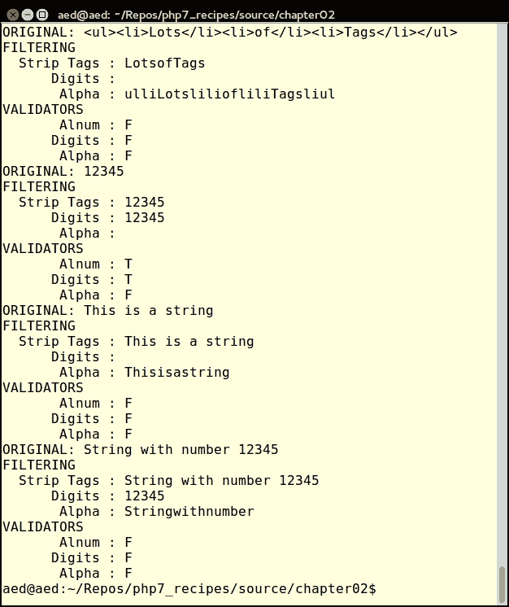
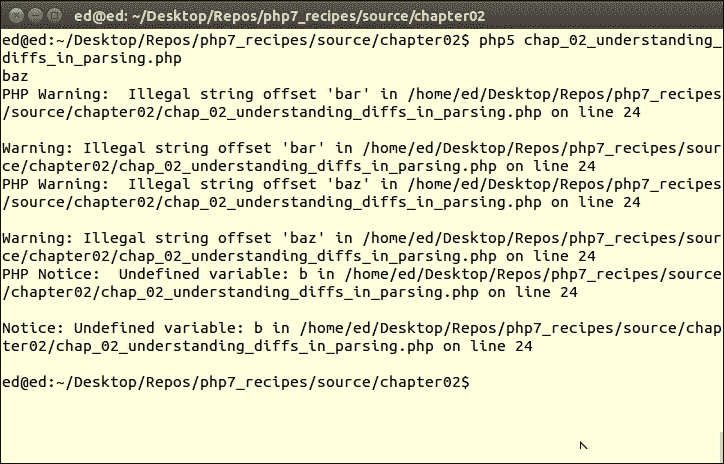
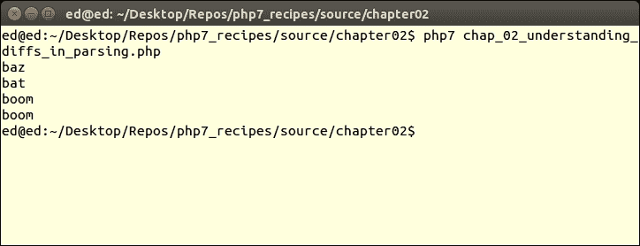
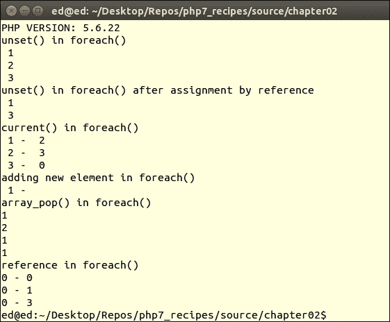
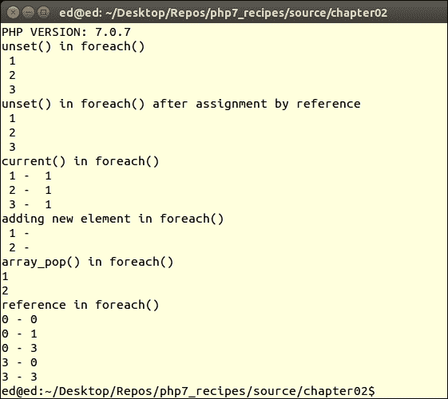
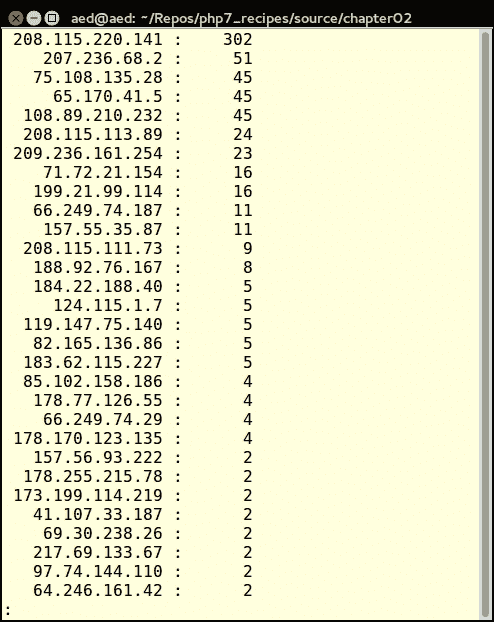
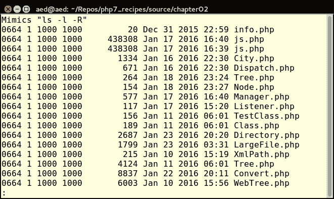
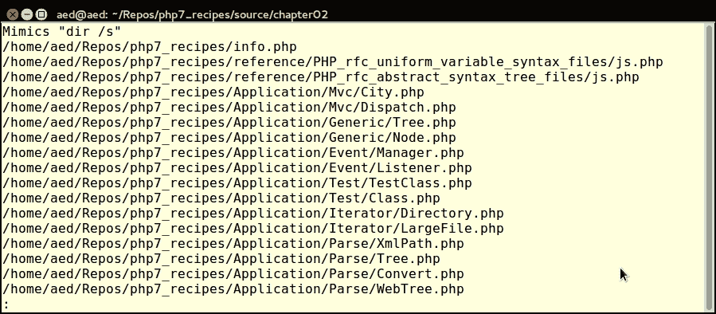

# 第二章使用 PHP7 高性能特性

在本章中，我们将讨论并理解 PHP5 和 PHP7 之间的语法差异，其特点是以下方法：

*   理解抽象语法树
*   理解句法分析中的差异
*   理解`foreach()`处理中的差异
*   使用 PHP7 增强功能提高性能
*   在海量文件中迭代
*   将电子表格上载到数据库
*   递归目录迭代器

# 导言

在本章中，我们将直接进入 PHP7，介绍利用新的高性能特性的方法。然而，首先，我们将介绍一系列较小的方法，用于说明 PHP7 在处理参数解析、语法、`foreach()`循环和其他增强方面的差异。在深入本章之前，让我们先讨论一下 PHP5 和 PHP7 之间的一些基本区别。

PHP7 引入了一个称为**抽象语法树**（**AST**）的新层，它有效地将解析过程与伪编译过程解耦。尽管新层对性能影响很小或没有影响，但它给语言带来了新的语法统一性，这在以前是不可能的。

AST 的另一个好处是*解引用*的过程。简单地说，解引用是指能够立即从对象获取属性或运行对象的方法，立即访问数组元素，并立即执行回调。在 PHP5 中，这种支持是不一致和不完整的。例如，要执行回调，通常首先需要将回调或匿名函数分配给变量，然后执行它。在 PHP7 中，您可以立即执行它。

# 理解抽象语法树

作为一名开发人员，您可能会对不受 PHP5 和更早版本中的某些语法限制感兴趣。除了前面提到的语法的一致性之外，您将看到语法的最大改进是调用任何返回值的能力，通过简单地附加一组括号，是**可调用的**。此外，当返回值是数组时，您还可以直接访问任何数组元素。

## 怎么做。。。

1.  任何返回回调的函数或方法都可以通过简单地添加括号`()`（带或不带参数）立即执行。通过使用方括号`[];`指示元素，可以立即从返回数组的任何函数或方法中取消对元素的引用。在下面显示的简短（但不重要）示例中，函数`test()`返回一个数组。该数组包含六个匿名函数。`$a`的值为`$t`。`$$a`解释为`$test`：

    ```php
    function test()
    {
        return [
            1 => function () { return [
                1 => function ($a) { return 'Level 1/1:' . ++$a; },
                2 => function ($a) { return 'Level 1/2:' . ++$a; },
            ];},
            2 => function () { return [
                1 => function ($a) { return 'Level 2/1:' . ++$a; },
                2 => function ($a) { return 'Level 2/2:' . ++$a; },
            ];}
        ];
    }

    $a = 't';
    $t = 'test';
    echo $$a()[1]()[2](100);
    ```

2.  AST 允许我们发出`echo $$a()[1]()[2](100)`命令。这是从左到右解析的，执行如下：
    *   `$$a()`解释为`test()`，返回一个数组
    *   `[1]`解引用数组元素`1`，返回回调
    *   `()`执行此回调，返回两个元素的数组
    *   `[2]`解引用数组元素`2`，返回回调
    *   `(100)` executes this callback, supplying a value of `100`, which returns `Level 1/2:101`

        ### 提示

        这样的语句在 PHP5 中是不可能的：将返回一个解析错误。

3.  下面是一个更具实质性的示例，它利用 AST 语法定义了一个数据过滤和验证类。首先，我们定义了`Application\Web\Securityclass`。在构造函数中，我们构建并定义两个数组。第一个数组由筛选器回调组成。第二个数组有验证回调：

    ```php
    public function __construct()
      {
        $this->filter = [
          'striptags' => function ($a) { return strip_tags($a); },
          'digits'    => function ($a) { return preg_replace(
          '/[^0-9]/', '', $a); },
          'alpha'     => function ($a) { return preg_replace(
          '/[^A-Z]/i', '', $a); }
        ];
        $this->validate = [
          'alnum'  => function ($a) { return ctype_alnum($a); },
          'digits' => function ($a) { return ctype_digit($a); },
          'alpha'  => function ($a) { return ctype_alpha($a); }
        ];
      }
    ```

4.  我们希望能够以*开发人员友好的*方式调用此功能。因此，如果我们想过滤数字，那么最好运行如下命令：

    ```php
    $security->filterDigits($item));
    ```

5.  为了实现这一点，我们定义了神奇的方法`__call()`，它允许我们访问不存在的方法：

    ```php
    public function __call($method, $params)
    {

      preg_match('/^(filter|validate)(.*?)$/i', $method, $matches);
      $prefix   = $matches[1] ?? '';
      $function = strtolower($matches[2] ?? '');
      if ($prefix && $function) {
        return $this->$prefix[$function]($params[0]);
      }
      return $value;
    }
    ```

我们使用`preg_match()`将`$method`参数与`filter`或`validate`匹配。然后，第二个子匹配将转换为`$this->filter`或`$this->validate`中的数组键。如果两个子模式都产生子匹配，我们将第一个子匹配分配给`$prefix`，并将第二个子匹配分配给`$function`。在执行适当的回调时，这些参数将作为变量参数结束。

### 提示

**不要对这些东西太疯狂！**

当你陶醉于 AST 带来的新的表达自由时，一定要记住，从长远来看，你最终编写的代码可能非常神秘。这最终将导致长期维护问题。

## 它是如何工作的。。。

首先，我们创建一个示例文件，利用 Type T3 第 1 章 AutoTo4 中定义的 AutoLoad 类，AutoT5，建立基础 Ty6 T6，得到一个实例：

```php
require __DIR__ . '/../Application/Autoload/Loader.php';
Application\Autoload\Loader::init(__DIR__ . '/..');
$security = new Application\Web\Security();
```

接下来，我们定义一个测试数据块：

```php
$data = [
    '<ul><li>Lots</li><li>of</li><li>Tags</li></ul>',
    12345,
    'This is a string',
    'String with number 12345',
];
```

最后，我们为每个测试数据项调用每个过滤器和验证器：

```php
foreach ($data as $item) {
  echo 'ORIGINAL: ' . $item . PHP_EOL;
  echo 'FILTERING' . PHP_EOL;
  printf('%12s : %s' . PHP_EOL,'Strip Tags', $security->filterStripTags($item));
  printf('%12s : %s' . PHP_EOL, 'Digits', $security->filterDigits($item));
  printf('%12s : %s' . PHP_EOL, 'Alpha', $security->filterAlpha($item));

  echo 'VALIDATORS' . PHP_EOL;
  printf('%12s : %s' . PHP_EOL, 'Alnum',  
  ($security->validateAlnum($item))  ? 'T' : 'F');
  printf('%12s : %s' . PHP_EOL, 'Digits', 
  ($security->validateDigits($item)) ? 'T' : 'F');
  printf('%12s : %s' . PHP_EOL, 'Alpha',  
  ($security->validateAlpha($item))  ? 'T' : 'F');
}
```

以下是一些输入字符串的输出：



## 另见

有关 AST 的更多信息，请咨询解决**抽象语法树**的 RFC，该树可在[查看 https://wiki.php.net/rfc/abstract_syntax_tree](https://wiki.php.net/rfc/abstract_syntax_tree) 。

# 句法分析中的理解差异

在 PHP5 中，赋值操作右侧的表达式被解析为*从右向左*。在 PHP7 中，解析是一致的*从左到右*。

## 怎么做。。。

1.  变量是间接引用值的一种方式。在下面的示例中，第一个`$$foo`被解释为`${$bar}`。因此，最终返回值是`$bar`的值，而不是`$foo`的直接值（即`bar`）：

    ```php
    $foo = 'bar';
    $bar = 'baz';
    echo $$foo; // returns  'baz'; 
    ```

2.  在下一个示例中，我们有一个变量`$$foo`，它引用了一个多维数组，其中包含一个`bar key`和一个`baz sub-key`：

    ```php
    $foo = 'bar';
    $bar = ['bar' => ['baz' => 'bat']];
    // returns 'bat'
    echo $$foo['bar']['baz'];
    ```

3.  在 PHP5 中，解析从右到左进行，这意味着 PHP 引擎将寻找一个`$foo array`，带有一个`bar key`和一个`baz`。子键随后将解释元素的返回值以获得最终值`${$foo['bar']['baz']}`。
4.  然而，在 PHP7 中，解析始终是从左到右的，这意味着首先解释`$foo``($$foo)['bar']['baz']`。
5.  在下一个示例中，您可以看到，与 PHP7 相比，PHP5 对`$foo->$bar['bada']`的解释完全不同。在下面的示例中，PHP5 将首先解释`$bar['bada']`，并根据`$foo object instance`引用此返回值。另一方面，在 PHP7 中，解析始终是从左到右进行的，这意味着首先解释`$foo->$bar`，并且需要一个带有`bada element`的数组。顺便说一句，您还将注意到，该示例使用 PHP7*匿名类*特性：

    ```php
    // PHP 5: $foo->{$bar['bada']}
    // PHP 7: ($foo->$bar)['bada']
    $bar = 'baz';
    // $foo = new class 
    { 
        public $baz = ['bada' => 'boom']; 
    };
    // returns 'boom'
    echo $foo->$bar['bada'];
    ```

6.  最后一个示例与上面的示例相同，只是返回值应该是回调，然后立即执行回调，如下所示：

    ```php
    // PHP 5: $foo->{$bar['bada']}()
    // PHP 7: ($foo->$bar)['bada']()
    $bar = 'baz';
    // NOTE: this example uses the new PHP 7 anonymous class feature
    $foo = new class 
    { 
         public function __construct() 
        { 
            $this->baz = ['bada' => function () { return 'boom'; }]; 
        } 
    };
    // returns 'boom'
    echo $foo->$bar['bada']();
    ```

## 它是如何工作的。。。

将 1 和 2 中所示的代码示例放入一个 PHP 文件中，您可以调用`chap_02_understanding_diffs_in_parsing.php`。首先使用 PHP5 执行脚本，您会注意到将产生一系列错误，如下所示：



错误的原因是 PHP5 的解析不一致，并且得出了关于所请求变量状态的错误结论（如前所述）。现在，您可以继续添加其余的示例，如步骤 5 和 6 所示。如果随后在 PHP 7 中运行此脚本，将显示所述结果，如下所示：



## 另见

有关解析的更多信息，请咨询 RFC，其地址为**统一****变量语法**，可在[查看 https://wiki.php.net/rfc/uniform_variable_syntax](https://wiki.php.net/rfc/uniform_variable_syntax) 。

# 理解 foreach（）处理的差异

在某些相对模糊的环境中，`foreach()`循环中的代码行为在 PHP5 和 PHP7 之间会有所不同。首先，内部已经有了巨大的改进，这意味着就绝对速度而言，`foreach()`循环中的处理在 PHP7 下运行要比 PHP5 快得多。PHP5 中注意到的问题包括在`foreach()`循环内的数组上使用`current()`和`unset()`。其他问题与在操作数组本身时通过引用传递值有关。

## 怎么做。。。

1.  考虑下面的代码块：
2.  在 PHP5 和 PHP7 中，输出如下所示：

    ```php
     1
     2
     3
    ```

3.  但是，如果在循环之前添加赋值，则行为会发生变化：

    ```php
    $a = [1, 2, 3];
    $b = &$a;
    foreach ($a as $v) {
      printf("%2d\n", $v);
      unset($a[1]);
    }
    ```

4.  比较 PHP5 和 PHP7 的输出：

    <colgroup><col style="text-align: left"><col style="text-align: left"></colgroup>
    | 

    PHP5

     | 

    PHP7

     |
    | --- | --- |
    |  |
    |  | **1****2****3** |

5.  Working with functions that reference the internal array pointer also caused inconsistent behavior in PHP 5\. Take the following code example:

    ```php
    $a = [1,2,3];
    foreach($a as &$v) {
        printf("%2d - %2d\n", $v, current($a));
    }
    ```

    ### 提示

    每个数组都有一个指向其`current`元素的内部指针，从`1`开始，`current()`返回数组中的当前元素。

6.  请注意，在 PHP7 中运行的输出是规范化和一致的：【T210】【T21-2】【T210】

    **2-3**

    **3-0**

    【T43-1】

    **【T43-1】**

    <colgroup><col style="text-align: left"><col style="text-align: left"></colgroup>
    | 

    PHP5

     | 

    PHP7

     |
    | --- | --- |
    | **1-1****2-1**【T43-1】 |

***   一旦通过引用进行的数组迭代完成，在`foreach()`循环中添加新元素在 PHP5 中也是有问题的。这种行为在 PHP7 中是一致的。下面的代码示例演示了这一点：

    ```php
    $a = [1];
    foreach($a as &$v) {
        printf("%2d -\n", $v);
        $a[1]=2;
    }
    ```

    *   我们将观察以下输出：

    <colgroup><col style="text-align: left"><col style="text-align: left"></colgroup>
    | 

    PHP5

     | 

    PHP7

     |
    | --- | --- |
    |  |  |  |
    | 【T210】 |  |  |  |  |  |  |  |  |  | 【T25**1-****2-** |

    *   Another example of bad PHP 5 behavior addressed in PHP 7, during array iteration by reference, is the use of functions that modify the array, such as `array_push()`, `array_pop()`, `array_shift()`, and `array_unshift()`.

    看看这个例子：

    ```php
    $a=[1,2,3,4];
    foreach($a as &$v) {
        echo "$v\n";
        array_pop($a);
    }
    ```

    *   您将观察以下输出：

    <colgroup><col style="text-align: left"><col style="text-align: left"></colgroup>
    | 

    PHP5

     | 

    PHP7

     |
    | --- | --- |
    | **【T210】************【T25**************1********1**** | **1****2** |

    *   最后，我们有一个例子，您通过引用迭代一个数组，使用一个嵌套的循环，它本身通过引用迭代同一个数组。在 PHP5 中，这个构造根本不起作用。在 PHP7 中，这已经被修复。下面的代码块演示了此行为：

    ```php
    $a = [0, 1, 2, 3];
    foreach ($a as &$x) {
           foreach ($a as &$y) {
             echo "$x - $y\n";
             if ($x == 0 && $y == 1) {
               unset($a[1]);
               unset($a[2]);
             }
           }
    }
    ```

    *   这里是输出：

    PHP5

    **********【T5**********

    <colgroup><col style="text-align: left"><col style="text-align: left"></colgroup>
    | 

    PHP7

     |
    | --- |
    | 【T210-0】**0-3** | **0-0****0-1】****0-3**【T47 3-0】 |** 

## 它是如何工作的。。。

将这些代码示例添加到单个 PHP 文件`chap_02_foreach.php`。从命令行在 PHP5 下运行脚本。预期产出如下：



在 PHP 7 下运行相同的脚本并注意差异：



## 另见

有关更多信息，请咨询解决此问题的 RFC，该 RFC 已被接受。有关此 RFC 的详细信息，请访问：[https://wiki.php.net/rfc/php7_foreach](https://wiki.php.net/rfc/php7_foreach) 。

# 使用 PHP7 增强功能提高性能

开发者正在利用的一个趋势是使用**匿名函数**。在处理匿名函数时，一个典型的问题是以这样的方式编写它们：任何对象都可以绑定到`$this`并且该函数仍然可以工作。PHP5 代码中使用的方法是使用`bindTo()`。在 PHP7 中，添加了一个新方法`call()`，它提供了类似的功能，但大大提高了性能。

## 怎么做。。。

要利用`call()`，请在长循环中执行匿名函数。在本例中，我们将演示一个匿名函数，该函数扫描日志文件，识别 IP 地址并按其出现频率排序：

1.  首先，我们定义一个`Application\Web\Access class`。在构造函数中，我们接受文件名作为参数。日志文件作为`SplFileObject`打开并分配给`$this->log`：

    ```php
    Namespace Application\Web;

    use Exception;
    use SplFileObject;
    class Access
    {
      const ERROR_UNABLE = 'ERROR: unable to open file';
      protected $log;
      public $frequency = array();
      public function __construct($filename)
      {
        if (!file_exists($filename)) {
          $message = __METHOD__ . ' : ' . self::ERROR_UNABLE . PHP_EOL;
          $message .= strip_tags($filename) . PHP_EOL;
          throw new Exception($message);
        }
        $this->log = new SplFileObject($filename, 'r');
      }
    ```

2.  接下来，我们定义一个生成器，逐行遍历文件：

    ```php
    public function fileIteratorByLine()
    {
      $count = 0;
      while (!$this->log->eof()) {
        yield $this->log->fgets();
        $count++;
      }
      return $count;
    }
    ```

3.  最后，我们定义了一个方法，该方法查找 IP 地址并将其提取为子匹配：

    ```php
    public function getIp($line)
    {
      preg_match('/(\d{1,3}\.\d{1,3}\.\d{1,3}\.\d{1,3})/', $line, $match);
      return $match[1] ?? '';
      }
    }
    ```

## 它是如何工作的。。。

首先，我们定义了一个调用程序，一个调用程序，它使用了在 To.T4 中定义的 AutoLoad 类的优点。第 1 章 AUTT5T，AUTT6.建立了一个基础，OutT7A.获得了一个实例：

```php
define('LOG_FILES', '/var/log/apache2/*access*.log');
require __DIR__ . '/../Application/Autoload/Loader.php';
Application\Autoload\Loader::init(__DIR__ . '/..');
```

接下来我们定义匿名函数，它处理日志文件中的一行。如果检测到 IP 地址，它将成为`$frequency array`中的一个密钥，并且该密钥的当前值将递增：

```php
// define functions
$freq = function ($line) {
  $ip = $this->getIp($line);
  if ($ip) {
    echo '.';
    $this->frequency[$ip] = 
    (isset($this->frequency[$ip])) ? $this->frequency[$ip] + 1 : 1;
  }
};
```

然后，我们循环遍历找到的每个日志文件中的行，处理 IP 地址：

```php
foreach (glob(LOG_FILES) as $filename) {
  echo PHP_EOL . $filename . PHP_EOL;
  // access class
  $access = new Application\Web\Access($filename);
  foreach ($access->fileIteratorByLine() as $line) {
    $freq->call($access, $line);
  }
}
```

### 提示

实际上，您可以在 PHP5 中执行相同的操作。但是，需要两行代码：

```php
$func = $freq->bindTo($access);
$func($line);
```

性能比在 PHP7 中使用`call()`慢 20%到 50%。

最后，我们对数组进行反向排序，但保留密钥。输出在一个简单的`foreach()`循环中产生：

```php
arsort($access->frequency);
foreach ($access->frequency as $key => $value) {
  printf('%16s : %6d' . PHP_EOL, $key, $value);
}
```

输出将根据您处理的`access.log`而有所不同。以下是一个示例：



## 还有更多。。。

许多 PHP7 性能改进与新特性和功能无关。相反，它们采取内部改进的形式，在你开始运行你的程序之前，*是看不见的*。以下是属于此类别的改进的简短列表：

<colgroup><col style="text-align: left"> <col style="text-align: left"> <col style="text-align: left"></colgroup> 
| 

特色

 | 

更多信息：

 | 

笔记

 |
| --- | --- | --- |
| 快速参数解析 | [https://wiki.php.net/rfc/fast_zpp](https://wiki.php.net/rfc/fast_zpp) | 在 PHP5 中，为函数提供的参数必须为每个单个函数调用进行解析。参数作为字符串传入，并以类似于`scanf()`函数的方式进行解析。在 PHP7 中，这个过程已经过优化，效率更高，从而显著提高了性能。改善很难衡量，但似乎在 6%左右。 |
| PHP NG | [https://wiki.php.net/rfc/phpng](https://wiki.php.net/rfc/phpng) | PHP**NG**（**下一代**计划）代表了对大部分 PHP 语言的重写。它保留了现有的功能，但涉及任何和所有可以想象的节省时间和效率措施。数据结构已被压缩，内存使用效率更高。例如，仅一项影响阵列处理的更改就带来了显著的性能提高，同时大大减少了内存使用。 |
| 消除自重 | [https://wiki.php.net/rfc/removal_of_dead_sapis_and_exts](https://wiki.php.net/rfc/removal_of_dead_sapis_and_exts) | 大约有 24 个扩展属于以下类别之一：弃用的、不再维护的、未维护的依赖项，或者未移植到 PHP7。核心开发者小组投票决定删除约 2/3 或“短名单”上的扩展。这将减少 PHP 语言的开销，加快 PHP 语言的整体未来开发。 |

# 在海量文件中迭代

`file_get_contents()`和`file()`等功能快速且易于使用，但由于内存的限制，它们在处理海量文件时会很快引发问题。`php.ini``memory_limit`设置的默认设置为 128 兆字节。因此，将不会加载任何大于此值的文件。

在通过大量文件进行解析时，另一个需要考虑的问题是函数或类方法生成输出的速度有多快？例如，在生成用户输出时，虽然乍一看在数组中累积输出似乎更好。然后，为了提高效率，您可以一次输出所有内容。不幸的是，这可能会对用户体验产生不利影响。最好创建一个**生成器**，并使用`yield keyword`生成即时结果。

## 怎么做。。。

如前所述，`file*`函数（即`file_get_contents()`函数）不适用于大文件。简单的原因是，这些函数在某一点上具有在内存中表示的文件的全部内容。因此，本配方的重点将放在`f*`功能上（即`fopen()`。

然而，稍微有点扭曲，我们将使用**SPL**（**标准 PHP 库**中包含的`SplFileObject`类，而不是直接使用`f*`函数：

1.  首先，我们定义一个具有适当属性和常量的`Application\Iterator\LargeFile` 类：

    ```php
    namespace Application\Iterator;

    use Exception;
    use InvalidArgumentException;
    use SplFileObject;
    use NoRewindIterator;

    class LargeFile
    {
      const ERROR_UNABLE = 'ERROR: Unable to open file';
      const ERROR_TYPE   = 'ERROR: Type must be "ByLength", "ByLine" or "Csv"';     
      protected $file;
      protected $allowedTypes = ['ByLine', 'ByLength', 'Csv'];
    ```

2.  然后我们定义一个`__construct()`方法，该方法接受文件名作为参数，并用`SplFileObject`实例填充`$file`属性。如果文件不存在，也是抛出异常的好地方：

    ```php
    public function __construct($filename, $mode = 'r')
    {
      if (!file_exists($filename)) {
        $message = __METHOD__ . ' : ' . self::ERROR_UNABLE . PHP_EOL;
        $message .= strip_tags($filename) . PHP_EOL;
        throw new Exception($message);
      }
      $this->file = new SplFileObject($filename, $mode);
    }
    ```

3.  接下来我们定义一个方法`fileIteratorByLine()method`，它使用`fgets()`一次读取一行文件。创建一个互补的`fileIteratorByLength()`方法并不是一个坏主意，它可以做同样的事情，但使用`fread()`来代替。使用`fgets()`的方法适用于包含换行符的文本文件。如果解析大型二进制文件，则可以使用另一种方法：

    ```php
    protected function fileIteratorByLine()
    {
      $count = 0;
      while (!$this->file->eof()) {
        yield $this->file->fgets();
        $count++;
      }
      return $count;
    }

    protected function fileIteratorByLength($numBytes = 1024)
    {
      $count = 0;
      while (!$this->file->eof()) {
        yield $this->file->fread($numBytes);
        $count++;
      }
      return $count; 
    }
    ```

4.  最后，我们定义了一个返回`NoRewindIterator()`实例的`getIterator()`方法。此方法接受`ByLine`或`ByLength`作为参数，它们引用了上一步中定义的两个方法。如果调用了`ByLength`，这个方法也需要接受`$numBytes`。我们需要一个`NoRewindIterator()`实例的原因是为了强制执行这样一个事实：在本例中，我们只在一个方向上读取文件：

    ```php
    public function getIterator($type = 'ByLine', $numBytes = NULL)
    {
      if(!in_array($type, $this->allowedTypes)) {
        $message = __METHOD__ . ' : ' . self::ERROR_TYPE . PHP_EOL;
        throw new InvalidArgumentException($message);
      }
      $iterator = 'fileIterator' . $type;
      return new NoRewindIterator($this->$iterator($numBytes));
    }
    ```

## 它是如何工作的。。。

首先，我们利用 AutoLoopDead 类定义在第 1 章 AUTT3 中，AUTT4.建立一个基础 Ty5 T5，以获得一个调用程序中的一个实例 Tyt T0.

```php
define('MASSIVE_FILE', '/../data/files/war_and_peace.txt');
require __DIR__ . '/../Application/Autoload/Loader.php';
Application\Autoload\Loader::init(__DIR__ . '/..');
```

接下来，在一个`try {...} catch () {...}`块中，我们得到一个`ByLine`迭代器的实例：

```php
try {
  $largeFile = new Application\Iterator\LargeFile(__DIR__ . MASSIVE_FILE);
  $iterator = $largeFile->getIterator('ByLine');
```

然后，我们提供一个有用的示例，在本例中，定义每行单词的平均值：

```php
$words = 0;
foreach ($iterator as $line) {
  echo $line;
  $words += str_word_count($line);
}
echo str_repeat('-', 52) . PHP_EOL;
printf("%-40s : %8d\n", 'Total Words', $words);
printf("%-40s : %8d\n", 'Average Words Per Line', 
($words / $iterator->getReturn()));
echo str_repeat('-', 52) . PHP_EOL;
```

然后我们结束`catch`块：

```php
} catch (Throwable $e) {
  echo $e->getMessage();
}
```

预期输出（太大，此处无法显示！）显示，古腾堡项目*战争与和平*的版本中有 566095 个单词。此外，我们发现每行的平均字数是八个。

# 将电子表格上传至数据库

尽管 PHP 没有任何直接的功能来读取特定的电子表格格式（即 XLSX、ODS 等），但它确实能够读取**（CSV 逗号分隔值**）文件。因此，为了处理客户电子表格，您需要要求他们以 CSV 格式提供文件，或者您需要自己进行转换。

## 准备好了。。。

将电子表格（即 CSV 文件）上载到数据库时，有三个主要注意事项：

*   在（可能的）海量文件中迭代
*   将每个电子表格行提取到 PHP 数组中
*   将 PHP 数组插入数据库

大量文件迭代将使用前面的方法处理。我们将使用`fgetcsv()`函数将 CSV 行转换为 PHP 数组。最后，我们将使用**（PDO PHP 数据对象**类）建立数据库连接并执行插入。

## 怎么做。。。

1.  首先，我们定义一个`Application\Database\Connection`类，该类根据提供给构造函数的一组参数创建一个 PDO 实例：

    ```php
    <?php
      namespace Application\Database;

      use Exception;
      use PDO;

      class Connection
      { 
        const ERROR_UNABLE = 'ERROR: Unable to create database connection';    
        public $pdo;

        public function __construct(array $config)
        {
          if (!isset($config['driver'])) {
            $message = __METHOD__ . ' : ' . self::ERROR_UNABLE . PHP_EOL;
            throw new Exception($message);
        }
        $dsn = $config['driver'] 
        . ':host=' . $config['host'] 
        . ';dbname=' . $config['dbname'];
        try {
          $this->pdo = new PDO($dsn, 
          $config['user'], 
          $config['password'], 
          [PDO::ATTR_ERRMODE => $config['errmode']]);
        } catch (PDOException $e) {
          error_log($e->getMessage());
        }
      }

    }
    ```

2.  然后我们合并了一个`Application\Iterator\LargeFile`的实例。我们向该类添加了一个新方法，该方法旨在迭代 CSV 文件：

    ```php
    protected function fileIteratorCsv()
    {
      $count = 0;
      while (!$this->file->eof()) {
        yield $this->file->fgetcsv();
        $count++;
      }
      return $count;        
    }    
    ```

3.  我们还需要将`Csv`添加到允许的迭代器方法列表中：

    ```php
      const ERROR_UNABLE = 'ERROR: Unable to open file';
      const ERROR_TYPE   = 'ERROR: Type must be "ByLength", "ByLine" or "Csv"';

      protected $file;
      protected $allowedTypes = ['ByLine', 'ByLength', 'Csv'];
    ```

## 它是如何工作的。。。

首先我们定义一个配置文件，它包含数据库连接参数：

```php
<?php
return [
  'driver'   => 'mysql',
  'host'     => 'localhost',
  'dbname'   => 'php7cookbook',
  'user'     => 'cook',
  'password' => 'book',
  'errmode'  => PDO::ERRMODE_EXCEPTION,
];
```

接下来，我们利用 AutoLoad 类在 AutoT3 中定义的第 1 章 AUTT4T，AUT5 建立一个基础 T6，得到一个实例，定义了一个调用程序，ORT T2A:

```php
define('DB_CONFIG_FILE', '/../data/config/db.config.php');
define('CSV_FILE', '/../data/files/prospects.csv');
require __DIR__ . '/../../Application/Autoload/Loader.php';
Application\Autoload\Loader::init(__DIR__ . '/..');
```

之后，我们设置了一个`try {...} catch () {...}`块，捕捉`Throwable`。这允许我们`catch`异常和错误：

```php
try {
  // code goes here  
} catch (Throwable $e) {
  echo $e->getMessage();
}
```

在`try {...} catch () {...}`块中，我们得到了连接和大文件迭代器类的实例：

```php
$connection = new Application\Database\Connection(
include __DIR__ . DB_CONFIG_FILE);
$iterator  = (new Application\Iterator\LargeFile(__DIR__ . CSV_FILE))
->getIterator('Csv');
```

然后我们利用 PDO 准备/执行功能。prepared 语句的 SQL 使用`?`表示循环中提供的值：

```php
$sql = 'INSERT INTO `prospects` '
  . '(`id`,`first_name`,`last_name`,`address`,`city`,`state_province`,'
  . '`postal_code`,`phone`,`country`,`email`,`status`,`budget`,`last_updated`) '
  . ' VALUES (?,?,?,?,?,?,?,?,?,?,?,?,?)';
$statement = $connection->pdo->prepare($sql);
```

然后我们使用`foreach()`循环遍历文件迭代器。每个`yield`语句生成一个值数组，表示数据库中的一行。然后，我们可以将这些值与`PDOStatement::execute()`一起使用，以执行准备好的语句，将值行插入数据库：

```php
foreach ($iterator as $row) {
  echo implode(',', $row) . PHP_EOL;
  $statement->execute($row);
}
```

然后可以检查数据库以验证数据是否已成功插入。

# 递归目录迭代器

获取目录中的文件列表非常容易。传统上，开发人员使用`glob()`函数来实现此目的。从目录树中的特定点递归获取所有文件和目录的列表更麻烦。此配方利用了**（SPL 标准 PHP 库**）类`RecursiveDirectoryIterator`的优势，这将非常适合此用途。

这个类所做的是解析目录树，找到第一个子目录树，然后跟随分支，直到没有更多的子目录树，然后停止！不幸的是，这不是我们想要的。不知何故，我们需要让`RecursiveDirectoryIterator`从给定的起点继续解析每个树和分支，直到没有更多的文件或目录。碰巧有一个很棒的类，`RecursiveIteratorIterator`正是这样做的。通过将`RecursiveDirectoryIterator`包装在`RecursiveIteratorIterator,`中，我们可以完成对任何目录树的完整遍历。

### 提示

**警告！**

在开始文件系统遍历时要非常小心。如果从根目录开始，可能会导致服务器崩溃，因为在找到所有文件和目录之前，递归过程不会停止！

## 怎么做。。。

1.  首先，我们定义一个`Application\Iterator\Directory` 类，该类定义适当的属性和常量，并使用外部类：

    ```php
    namespace Application\Iterator;

    use Exception;
    use RecursiveDirectoryIterator;
    use RecursiveIteratorIterator;
    use RecursiveRegexIterator;
    use RegexIterator;

    class Directory
    {

      const ERROR_UNABLE = 'ERROR: Unable to read directory';

      protected $path;
      protected $rdi;
      // recursive directory iterator
    ```

2.  构造函数基于目录路径

    ```php
    public function __construct($path)
    {
      try {
        $this->rdi = new RecursiveIteratorIterator(
          new RecursiveDirectoryIterator($path),
          RecursiveIteratorIterator::SELF_FIRST);
      } catch (\Throwable $e) {
        $message = __METHOD__ . ' : ' . self::ERROR_UNABLE . PHP_EOL;
        $message .= strip_tags($path) . PHP_EOL;
        echo $message;
        exit;
      }
    }
    ```

    在`RecursiveIteratorIterator`内创建`RecursiveDirectoryIterator`实例
3.  接下来，我们决定如何处理迭代。一种可能是模拟 Linux`ls -l -R`命令的输出。注意，我们使用了`yield` 关键字，有效地将此方法变成了一个**生成器**，然后可以从外部调用它。目录迭代生成的每个对象都是一个 SPL`FileInfo`对象，它可以为我们提供有关该文件的有用信息。下面是此方法的外观：

    ```php
    public function ls($pattern = NULL)
    {
      $outerIterator = ($pattern) 
      ? $this->regex($this->rdi, $pattern) 
      : $this->rdi;
      foreach($outerIterator as $obj){
        if ($obj->isDir()) {
          if ($obj->getFileName() == '..') {
            continue;
          }
          $line = $obj->getPath() . PHP_EOL;
        } else {
          $line = sprintf('%4s %1d %4s %4s %10d %12s %-40s' . PHP_EOL,
          substr(sprintf('%o', $obj->getPerms()), -4),
          ($obj->getType() == 'file') ? 1 : 2,
          $obj->getOwner(),
          $obj->getGroup(),
          $obj->getSize(),
          date('M d Y H:i', $obj->getATime()),
          $obj->getFileName());
        }
        yield $line;
      }
    }
    ```

4.  您可能已经注意到，方法调用包含一个文件模式。我们需要一种过滤递归的方法，以便只包含匹配的文件。SPL 提供的另一个迭代器非常适合这种需要：`RegexIterator`类：

    ```php
    protected function regex($iterator, $pattern)
    {
      $pattern = '!^.' . str_replace('.', '\\.', $pattern) . '$!';
      return new RegexIterator($iterator, $pattern);
    }
    ```

5.  最后，这里是另一种方法，但这次我们将模拟`dir /s`命令：

    ```php
    public function dir($pattern = NULL)
    {
      $outerIterator = ($pattern) 
      ? $this->regex($this->rdi, $pattern) 
      : $this->rdi;
      foreach($outerIterator as $name => $obj){
          yield $name . PHP_EOL;
        }        
      }
    }
    ```

## 它是如何工作的。。。

首先，我们利用 AutoLoopDead 类定义在第 1 章 AUTT3 中，AUTT4.建立一个基础 Ty5 T5，以获得一个实例，定义一个调用程序，OLE T1TA:

```php
define('EXAMPLE_PATH', realpath(__DIR__ . '/../'));
require __DIR__ . '/../Application/Autoload/Loader.php';
Application\Autoload\Loader::init(__DIR__ . '/..');
$directory = new Application\Iterator\Directory(EXAMPLE_PATH);
```

然后，在`try {...} catch () {...}`块中，我们使用一个示例目录路径调用我们的两个方法：

```php
try {
  echo 'Mimics "ls -l -R" ' . PHP_EOL;
  foreach ($directory->ls('*.php') as $info) {
    echo $info;
  }

  echo 'Mimics "dir /s" ' . PHP_EOL;
  foreach ($directory->dir('*.php') as $info) {
    echo $info;
  }

} catch (Throwable $e) {
  echo $e->getMessage();
}
```

`ls()`的输出如下所示：



`dir()`的输出将显示如下：

