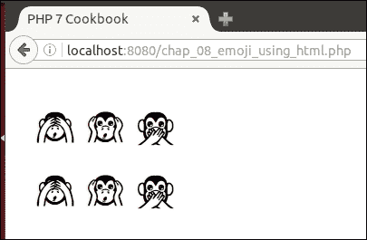
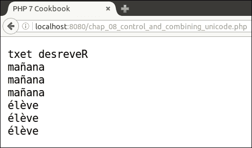
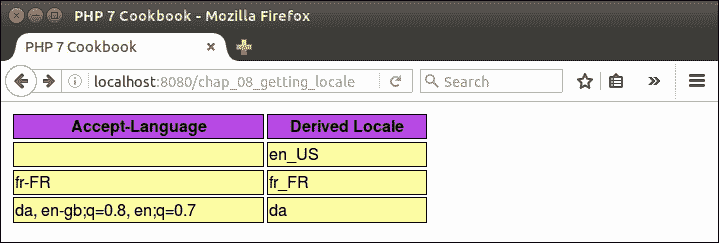
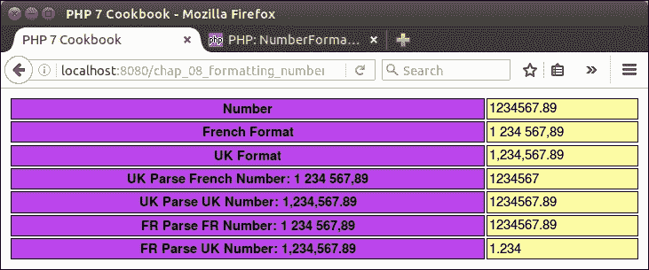
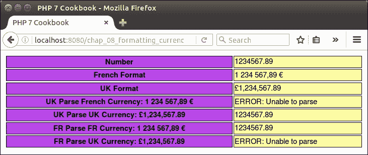
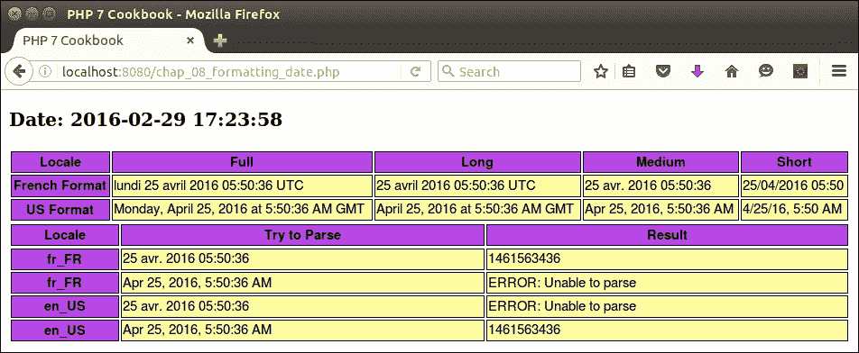
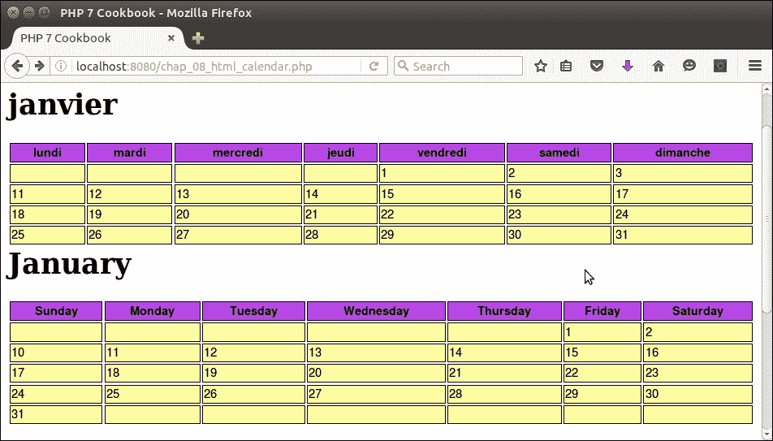
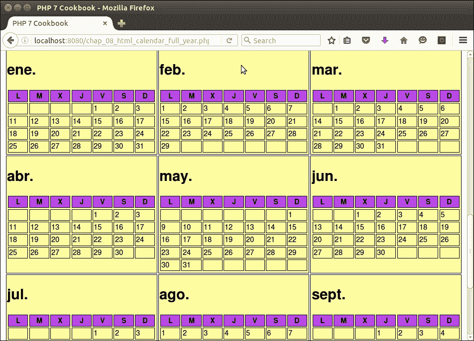
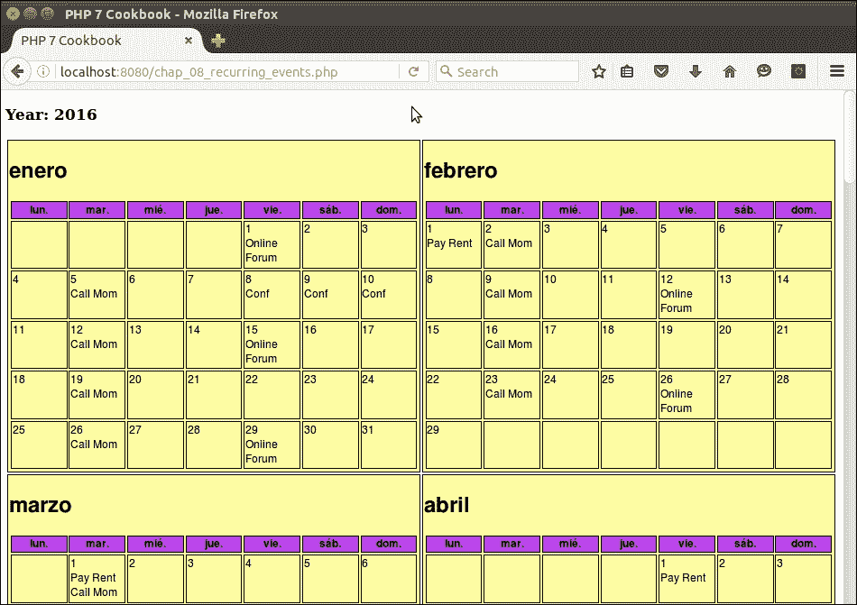
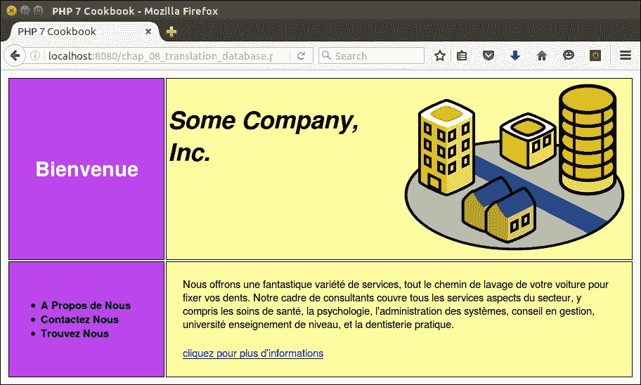

# 第 8 章处理日期/时间和国际方面

在本章中，我们将介绍以下主题：

*   在视图脚本中使用表情符号或表情符号
*   转换复杂字符
*   从浏览器数据获取区域设置
*   按区域设置设置数字格式
*   按区域设置处理货币
*   按区域设置格式化日期/时间
*   创建 HTML 国际日历生成器
*   构建重复事件生成器
*   不使用 gettext 处理翻译

# 导言

我们将从两个方法开始本章，它们利用了**PHP7**引入的新**Unicode**转义语法的优势。之后，我们将介绍如何根据浏览器数据确定 web 访问者的**区域设置**。接下来的几个方法将介绍如何创建区域设置类，该类将允许您以特定于区域设置的格式表示数字、货币、日期和时间。最后，我们将介绍如何生成国际化日历、处理重复事件和执行翻译而不必使用`gettext`的方法。

# 在视图脚本中使用表情符号或表情符号

单词**表情符号**是*情感*和*图标*的组合。源于日本的**表情符号**是另一个更大、应用广泛的图标集。这些图标是小笑脸、小忍者和地板上滚动的笑图标，在任何有社交网络功能的网站上都很受欢迎。然而，在 PHP7 之前，制作这些小动物是一项令人沮丧的工作。

## 怎么做。。。

1.  First and foremost, you need to know the Unicode for the icon you wish to present. A quick search on the Internet will direct you to any one of several excellent charts. Here are the codes for the three *hear-no-evil*, *see-no-evil*, and *speak-no-evil* monkey icons:

    `U+1F648`、`U+1F649`和`U+1F64A`

    

2.  必须正确标识浏览器的任何 Unicode 输出。这通常是通过`meta`标记完成的。您应该将字符集设置为 UTF-8。下面是一个例子：

    ```php
    <head>
      <title>PHP 7 Cookbook</title>
      <meta http-equiv="content-type" content="text/html;charset=utf-8" />
    </head>
    ```

3.  传统的方法是简单地使用 HTML 来显示图标。因此，您可以这样做：

    ```php
    <table>
      <tr>
        <td>&#x1F648;</td>
        <td>&#x1F649;</td>
        <td>&#x1F64A;</td>
      </tr>
    </table>
    ```

4.  As of PHP 7, you can now construct full Unicode characters using this syntax: `"\u{xxx}"`. Here is an example with the same three icons as in the preceding bullet:

    ```php
    <table>
      <tr>
        <td><?php echo "\u{1F648}"; ?></td>
        <td><?php echo "\u{1F649}"; ?></td>
        <td><?php echo "\u{1F64A}"; ?></td>
      </tr>
    </table>
    ```

    ### 注

    您的操作系统和浏览器必须都支持 Unicode，并且必须具有正确的字体集。例如，在 Ubuntu Linux 中，您需要安装`ttf-ancient-fonts`包才能在浏览器中看到表情符号。

## 它是如何工作的。。。

在 PHP7 中，引入了一种新语法，可以呈现任何 Unicode 字符。与其他语言不同，新的 PHP 语法允许可变数量的十六进制数字。基本格式如下：

```php
\u{xxxx}
```

整个结构必须是双引号（或使用**heredoc**）。`xxxx`可以是十六进制数字 2、4、6 及以上的任意组合。

创建一个名为`chap_08_emoji_using_html.php`的文件。确保包括向浏览器发出 UTF-8 字符编码使用信号的`meta`标记：

```php
<!DOCTYPE html>
<html>
  <head>
    <title>PHP 7 Cookbook</title>
    <meta http-equiv="content-type" content="text/html;charset=utf-8" />
  </head>
```

接下来，设置一个基本 HTML 表，并显示一行表情符号/emoji：

```php
  <body>
    <table>
      <tr>
        <td>&#x1F648;</td>
        <td>&#x1F649;</td>
        <td>&#x1F64A;</td>
      </tr>
    </table>
  </body>
</html>
```

现在使用 PHP 添加一行以发出表情符号/表情符号：

```php
  <tr>
    <td><?php echo "\u{1F648}"; ?></td>
    <td><?php echo "\u{1F649}"; ?></td>
    <td><?php echo "\u{1F64A}"; ?></td>
  </tr>
```

以下是从 Firefox 中看到的输出：



## 另见

*   有关表情符号代码的列表，请参见[http://unicode.org/emoji/charts/full-emoji-list.html](http://unicode.org/emoji/charts/full-emoji-list.html)

# 转换复杂字符

访问整个 Unicode 字符集的能力为呈现复杂的字符开辟了许多新的可能性，尤其是拉丁字母以外的字母。

## 怎么做。。。

1.  Some languages are read right-to-left instead of left-to-right. Examples include Hebrew and Arabic. In this example, we show you how to present *reverse* text using the `U+202E` Unicode character for right-to-left override. The following line of code prints `txet desreveR`:

    ```php
    echo "\u{202E}Reversed text";
    echo "\u{202D}";    // returns output to left-to-right
    ```

    ### 注

    完成后，不要忘记调用从左到右的覆盖字符`U+202D`！

2.  另一个考虑因素是使用组合字符。一个这样的例子是`ñ`（字母`n`上面浮着一个波浪符号`~`。这在诸如*马尼亚那*之类的单词中使用（西班牙语单词表示早晨或明天，具体取决于上下文）。有一个可用的*合成字符*，由 Unicode 代码`U+00F1`表示。下面是它的一个使用示例，它呼应了`mañana`：

    ```php
    echo "ma\u{00F1}ana"; // shows mañana
    ```

3.  然而，这可能会影响搜索的可能性。想象一下，您的客户没有这种组合字符的键盘。如果他们开始键入`man`以尝试搜索`mañana`，则不会成功。
4.  访问*完整的*Unicode 集合提供了其他可能性。您可以使用原始字母`n`与 Unicode*组合*代码的组合，而不是使用*组合的*字符，这会在字母顶部放置浮动平铺。在此`echo`命令中，输出与前面相同。只有单词的形成方式不同：

    ```php
    echo "man\u{0303}ana"; // also shows mañana
    ```

5.  类似的应用也可以用于口音。想想法语单词（学生）。您可以使用组合字符渲染它，或者使用组合代码将重音浮动到字母上方。请考虑下面两个例子。两个示例产生相同的输出，但呈现方式不同：

    ```php
    echo "\u{00E9}l\u{00E8}ve";
    echo "e\u{0301}le\u{0300}ve";
    ```

## 它是如何工作的。。。

创建一个名为`chap_08_control_and_combining_unicode.php`的文件。确保包括向浏览器发出 UTF-8 字符编码使用信号的`meta`标记：

```php
<!DOCTYPE html>
<html>
  <head>
    <title>PHP 7 Cookbook</title>
    <meta http-equiv="content-type" content="text/html;charset=utf-8" />
  </head>
```

接下来，设置 basicPHP 和 HTML 以显示前面讨论的示例：

```php
  <body>
    <pre>
      <?php
        echo "\u{202E}Reversed text"; // reversed
        //echo "\u{202D}"; // stops reverse
        echo "mañana";  // using pre-composed characters
        echo "ma\u{00F1}ana"; // pre-composed character
        echo "man\u{0303}ana"; // "n" with combining ~ character (U+0303)
        echo "élève";
        echo "\u{00E9}l\u{00E8}ve"; // pre-composed characters
        echo "e\u{0301}le\u{0300}ve"; // e + combining characters
      ?>
    </pre>
</body>
</html>
```

以下是浏览器的输出：



# 从浏览器数据获取区域设置

为了改善用户在网站上的体验，以用户所在地区可接受的格式显示信息非常重要。**地区**是一个通用的术语，用于表示世界的一个地区。I.T.社区已经做出努力，使用由语言代码和国家代码组成的两部分名称对地区进行编码。但是，当一个人访问你的网站时，你如何知道他们所在的地区？可能最有用的技术是检查 HTTP 语言头。

## 怎么做。。。

1.  In order to encapsulate locale functionality, we will assume a class, `Application\I18n\Locale`. We will have this class extend an existing class, `Locale`, which is part of the PHP `Intl` extension.

    ### 注

    **I18n**是**国际化**的常见缩写。（数一数字母的数量！）

    ```php
    namespace Application\I18n;
    use Locale as PhpLocale;
    class Locale extends PhpLocale
    {
      const FALLBACK_LOCALE = 'en';
      // some code
    }
    ```

2.  要了解传入请求的外观，请使用`phpinfo(INFO_VARIABLES)`。请确保在测试后立即禁用此功能，因为它会向潜在攻击者泄露太多信息：

    ```php
    <?php phpinfo(INFO_VARIABLES); ?>
    ```

3.  语言环境信息存储在`$_SERVER['HTTP_ACCEPT_LANGUAGE']`中。该值将采用以下一般形式：`ll-CC,rl;q=0.n, ll-CC,rl;q=0.n`，如本表所定义：

    <colgroup><col style="text-align: left"><col style="text-align: left"></colgroup>
    | 

    缩写

     | 

    意思

     |
    | --- | --- |
    |  | 表示语言的两个字符的小写代码。 |
    | `-` | 在区域设置代码 `ll-CC`中将语言与国家/地区分开。 |
    |  | 两个字符 表示国家的大写代码。 |
    |  | 将区域设置代码与回退 **根区域设置** 代码分离（通常与语言代码相同）。 |
    | `rl` | 两个字符的小写代码，表示建议的根区域设置。 |
    | `;` | 将区域设置信息与质量分开。如果质量缺失，则默认为 `q=1`（100%）概率；这是首选。 |
    | `q` | 质量 |
    | `0.n` | 某些值介于 0 和 1 之间。将该值乘以 100，得到该访问者首选的实际语言的概率百分比。 |

4.  可以很容易地列出多个区域设置。例如，网站访问者的计算机上可能安装了多种语言。PHP`Locale`类恰好有一个方法`acceptFromHttp()`，它读取`Accept-language`头字符串并为我们提供所需的设置：

    ```php
    protected $localeCode;
    public function setLocaleCode($acceptLangHeader)
    {
      $this->localeCode = $this->acceptFromHttp($acceptLangHeader);
    }
    ```

5.  然后我们可以定义适当的 getter。`get AcceptLanguage()`方法返回`$_SERVER['HTTP_ACCEPT_LANGUAGE']`：

    ```php
    public function getAcceptLanguage()
    {
      return $_SERVER['HTTP_ACCEPT_LANGUAGE'] ?? self::FALLBACK_LOCALE;
    }
    public function getLocaleCode()
    {
      return $this->localeCode;
    }
    ```

    的值
6.  接下来我们定义一个构造函数，它允许我们“手动”设置语言环境。否则，从浏览器中提取区域设置信息：

    ```php
    public function __construct($localeString = NULL)
    {
      if ($localeString) {
        $this->setLocaleCode($localeString);
      } else {
        $this->setLocaleCode($this->getAcceptLanguage());
      }
    }
    ```

7.  现在是一个重大决定：如何处理这些信息！这将在接下来的几个食谱中介绍。

### 注

即使访问者似乎接受一种或多种语言，该访问者也不一定需要其浏览器所指示的语言/区域设置中的内容。因此，尽管您当然可以根据这些信息设置语言环境，但您也应该向他们提供替代语言的静态列表。

## 它是如何工作的。。。

在本图中，让我们举三个例子：

*   从浏览器派生的信息
*   预设区域设置`fr-FR`
*   取自 RFC 2616 的字符串：`da, en-gb;q=0.8, en;q=0.7`

将步骤 1 至 6 中的代码放入一个文件`Locale.php`，该文件位于`Application\I18n`文件夹中。

接下来，创建一个文件`chap_08_getting_locale_from_browser.php`，该文件设置自动加载并使用新类：

```php
<?php
  require __DIR__ . '/../Application/Autoload/Loader.php';
  Application\Autoload\Loader::init(__DIR__ . '/..');
  use Application\I18n\Locale;
```

现在您可以使用三个测试区域设置字符串定义一个数组：

```php
$locale = [NULL, 'fr-FR', 'da, en-gb;q=0.8, en;q=0.7'];
```

最后，循环三个区域设置字符串，创建新类的实例。回显`getLocaleCode()`返回的值，查看做出了什么选择：

```php
echo '<table>';
foreach ($locale as $code) {
  $locale = new Locale($code); 
  echo '<tr>
    <td>' . htmlspecialchars($code) . '</td>
    <td>' . $locale->getLocaleCode() . '</td>
  </tr>';
}
echo '</table>';
```

以下是结果（稍加修饰）：



## 另见

*   有关 PHP`Locale`类的信息，请参阅[http://php.net/manual/en/class.locale.php](http://php.net/manual/en/class.locale.php)
*   更多关于`Accept-Language`标题的信息，请参见 RFC 2616 第 14.4 节：[https://www.w3.org/Protocols/rfc2616/rfc2616-sec14.html](https://www.w3.org/Protocols/rfc2616/rfc2616-sec14.html)

# 按区域设置数字格式

数字表示形式可能因区域设置而异。作为一个简单的例子，在英国，一将看到数字三百万、八万、五百一十二和九十二个百分之一，如下所示：

```php
3,080,512.92.
```

然而，在法国，同样的数字可能是这样的：

```php
3 080 512,92
```

## 怎么做。。。

在以特定于区域设置的方式表示数字之前，需要确定区域设置。这可以通过使用前面配方中讨论的`Application\I18n\Locale`类来实现。可以手动或从标题信息设置区域设置。

1.  Next, we will make use of the `format()` method of the `NumberFormatter` class, to both output and parse numbers in a locale-specific format. First we add a property that will contain an instance of the `NumberFormatter` class:

    ```php
    use NumberFormatter;
    protected $numberFormatter;
    ```

    ### 注

    我们最初的想法是考虑使用 PHP 函数 ORT T0 来生成根据区域设置格式化的数字。然而，这种传统方法的问题在于*所有*都将基于此区域设置进行考虑。这可能会导致处理根据数据库规范存储的数据时出现问题。`setlocale()`的另一个问题是它基于过时的标准，包括 RFC1766 和 ISO 639。最后，`setlocale()`高度依赖于操作系统的本地支持，这将使我们的代码不可移植。

2.  通常，下一步是在构造函数中设置`$numberFormatter`。在我们的`Application\I18n\Locale`类中，这种方法的问题在于，我们最终会得到一个重上加重的类，因为我们还需要执行货币和日期格式化。因此，我们添加了一个`getter`，首先检查`NumberFormatter`的实例是否已经创建。如果不是，则创建并返回一个实例。新的`NumberFormatter`中的第一个参数是区域设置代码。第二个参数`NumberFormatter::DECIMAL`表示我们需要的格式类型：

    ```php
    public function getNumberFormatter()
    {
      if (!$this->numberFormatter) {
        $this->numberFormatter = new NumberFormatter($this->getLocaleCode(), NumberFormatter::DECIMAL);
      }
      return $this->numberFormatter;
    }
    ```

3.  然后，我们添加一个方法，给定任何数字，该方法将生成一个字符串，表示根据区域设置格式化的数字：

    ```php
    public function formatNumber($number)
    {
      return $this->getNumberFormatter()->format($number);
    }
    ```

4.  接下来，我们添加一个方法，该方法可用于根据区域设置解析数字，从而生成本机 PHP 数值。请注意，解析失败时，结果可能不会返回`FALSE`，具体取决于服务器的 ICU 版本：

    ```php
    public function parseNumber($string)
    {
      $result = $this->getNumberFormatter()->parse($string);
      return ($result) ? $result : self::ERROR_UNABLE_TO_PARSE;
    }
    ```

## 它是如何工作的。。。

对`Application\I18n\Locale`类进行前面要点中讨论的添加。然后，您可以创建一个`chap_08_formatting_numbers.php`文件，该文件设置自动加载并使用该类：

```php
<?php
  require __DIR__ . '/../Application/Autoload/Loader.php';
  Application\Autoload\Loader::init(__DIR__ . '/..');
  use Application\I18n\Locale;
```

在本例中，创建两个`Locale`实例，一个用于英国，另一个用于法国。您也可以指定一个大的数字用于测试：

```php
  $localeFr = new Locale('fr_FR');
  $localeUk = new Locale('en_GB');
  $number   = 1234567.89;
?>
```

最后，您可以将`formatNumber()`和`parseNumber()`方法包装在适当的 HTML 显示逻辑中，并查看结果：

```php
<!DOCTYPE html>
<html>
  <head>
    <title>PHP 7 Cookbook</title>
    <meta http-equiv="content-type" content="text/html;charset=utf-8" />
    <link rel="stylesheet" type="text/css" href="php7cookbook_html_table.css">
  </head>
  <body>
    <table>
      <tr>
        <th>Number</th>
        <td>1234567.89</td>
      </tr>
      <tr>
        <th>French Format</th>
        <td><?= $localeFr->formatNumber($number); ?></td>
      </tr>
      <tr>
        <th>UK Format</th>
        <td><?= $localeUk->formatNumber($number); ?></td>
      </tr>
      <tr>
        <th>UK Parse French Number: <?= $localeFr->formatNumber($number) ?></th>
        <td><?= $localeUk->parseNumber($localeFr->formatNumber($number)); ?></td>
      </tr>
      <tr>
        <th>UK Parse UK Number: <?= $localeUk->formatNumber($number) ?></th>
        <td><?= $localeUk->parseNumber($localeUk->formatNumber($number)); ?></td>
      </tr>
      <tr>
        <th>FR Parse FR Number: <?= $localeFr->formatNumber($number) ?></th>
        <td><?= $localeFr->parseNumber($localeFr->formatNumber($number)); ?></td>
      </tr>
      <tr>
        <th>FR Parse UK Number: <?= $localeUk->formatNumber($number) ?></th>
        <td><?= $localeFr->parseNumber($localeUk->formatNumber($number)); ?></td>
      </tr>
    </table>
  </body>
</html>
```

以下是从浏览器中看到的的结果：



### 注

请注意，如果区域设置设置为`fr_FR`，则解析英国格式的数字时，不会返回正确的值。同样，当区域设置设置为`en_GB`时，法语格式的数字在解析时不会返回正确的值。因此，在尝试解析数字之前，您可能需要考虑添加验证检查。

## 另见

*   有关`setlocale()`使用和滥用的更多信息请参考本页：[http://php.net/manual/en/function.setlocale.php](http://php.net/manual/en/function.setlocale.php) 。
*   有关为什么数字格式在某些服务器上会产生错误而在其他服务器上不会产生错误的简要说明，请查看**ICU**（**国际 Unicode 组件**）版本。参见本页注释：[http://php.net/manual/en/numberformatter.parse.php](http://php.net/manual/en/numberformatter.parse.php) 。有关 ICU 格式的更多信息，请参见[http://userguide.icu-project.org/formatparse](http://userguide.icu-project.org/formatparse) 。

# 按地区处理货币

处理货币的技巧与数字相似。我们甚至会使用相同的`NumberFormatter`类！然而，有一个主要的区别，那就是*显示停止符*：为了正确设置货币格式，您需要手头有货币代码。

## 怎么做。。。

1.  The first order of business is to have the currency codes available in some format. One possibility is to simply add the currency code as an `Application\I18n\Locale` class constructor argument:

    ```php
    const FALLBACK_CURRENCY = 'GBP';
    protected $currencyCode;
    public function __construct($localeString = NULL, $currencyCode = NULL)
    {
      // add this to the existing code:
      $this->currencyCode = $currencyCode ?? self::FALLBACK_CURRENCY;
    }
    ```

    ### 注

    这种方法虽然显然是可靠和可行的，但往往属于所谓的*半途而废*或*简单出路*的范畴！这种方法还可能会消除完全自动化，因为无法从 HTTP 头获得货币代码。正如您可能从本书中的其他食谱中收集到的，我们不会回避更复杂的解决方案，所以俗话说，*系上安全带*！

2.  我们首先需要建立某种查找机制，在这种机制中，给定一个国家代码，我们可以获得其主要货币代码。对于本例，我们将使用适配器软件设计模式。根据这种模式，我们应该能够创建不同的类，它们可能以完全不同的方式运行，但产生相同的结果。因此，我们需要定义期望的结果。为此，我们引入了一个类`Application\I18n\IsoCodes`。如您所见，该类具有所有相关属性，以及某种通用构造函数：

    ```php
    namespace Application\I18n;
    class IsoCodes
    {
      public $name;
      public $iso2;
      public $iso3;
      public $iso_numeric;
      public $iso_3166;
      public $currency_name;
      public $currency_code;
      public $currency_number;
      public function __construct(array $data)
      {
        $vars = get_object_vars($this);
        foreach ($vars as $key => $value) {
          $this->$key = $data[$key] ?? NULL;
        }
      }
    }
    ```

3.  接下来，我们定义一个接口，该接口具有执行*国家代码到货币代码*查找所需的方法。在本例中，我们引入`Application\I18n\IsoCodesInterface`：

    ```php
    namespace Application\I18n;

    interface IsoCodesInterface
    {
      public function getCurrencyCodeFromIso2CountryCode($iso2) : IsoCodes;
    }
    ```

4.  现在我们准备构建一个查找适配器类，我们将其称为`Application\I18n\IsoCodesDb`。它实现了上述接口，并接受了一个 AUT1 T1 实例（参见 Po.T4A.第 1 章 AUTT5T，AUTT66.建立一个基础 TUR7 T7），用于执行查找。构造函数设置所需的信息，包括连接、查找表名称和表示 ISO2 代码的列。接口所需的查找方法随后发出 SQL 语句并返回一个数组，该数组用于构建一个`IsoCodes`实例：

    ```php
    namespace Application\I18n;

    use PDO;
    use Application\Database\Connection;

    class IsoCodesDb implements IsoCodesInterface
    {
      protected $isoTableName;
      protected $iso2FieldName;
      protected $connection;
      public function __construct(Connection $connection, $isoTableName, $iso2FieldName)
      {
        $this->connection = $connection;
        $this->isoTableName = $isoTableName;
        $this->iso2FieldName = $iso2FieldName;
      }
      public function getCurrencyCodeFromIso2CountryCode($iso2) : IsoCodes
      {
        $sql = sprintf('SELECT * FROM %s WHERE %s = ?', $this->isoTableName, $this->iso2FieldName);
        $stmt = $this->connection->pdo->prepare($sql);
        $stmt->execute([$iso2]);
        return new IsoCodes($stmt->fetch(PDO::FETCH_ASSOC);
      }
    }
    ```

5.  现在我们把注意力转向课程。我们首先添加了两个新属性和类常量：

    ```php
    const ERROR_UNABLE_TO_PARSE = 'ERROR: Unable to parse';
    const FALLBACK_CURRENCY = 'GBP';

    protected $currencyFormatter;
    protected $currencyLookup;
    protected $currencyCode;
    ```

6.  我们添加了从区域设置字符串检索国家代码的新方法。我们可以利用来自 PHP`Locale`类的`getRegion()`方法（我们对其进行了扩展）。为了以防万一，我们还添加了一个方法，`getCurrencyCode()`：

    ```php
    public function getCountryCode()
    {
      return $this->getRegion($this->getLocaleCode());
    }
    public function getCurrencyCode()
    {
      return $this->currencyCode;
    }
    ```

7.  与格式化数字一样，我们定义了`getCurrencyFormatter(I)`，与`getNumberFormatter()`一样（如前所示）。注意使用`NumberFormatter`定义了`$currencyFormatter`，但使用了不同的第二个参数：

    ```php
    public function getCurrencyFormatter()
    {
      if (!$this->currencyFormatter) {
        $this->currencyFormatter = new NumberFormatter($this->getLocaleCode(), NumberFormatter::CURRENCY);
      }
      return $this->currencyFormatter;
    }
    ```

8.  然后，如果已定义查找类，我们将向类构造函数添加货币代码查找：

    ```php
    public function __construct($localeString = NULL, IsoCodesInterface $currencyLookup = NULL)
    {
      // add this to the existing code:
      $this->currencyLookup = $currencyLookup;
      if ($this->currencyLookup) {
        $this->currencyCode = $this->currencyLookup->getCurrencyCodeFromIso2CountryCode($this->getCountryCode())->currency_code;
      } else {
        $this->currencyCode = self::FALLBACK_CURRENCY;
      }
    }
    ```

9.  然后添加适当的货币格式和解析方法。请注意，与解析数字不同，如果解析操作不成功，解析货币将返回`FALSE`：

    ```php
    public function formatCurrency($currency)
    {
      return $this->getCurrencyFormatter()->formatCurrency($currency, $this->currencyCode);
    }
    public function parseCurrency($string)
    {
      $result = $this->getCurrencyFormatter()->parseCurrency($string, $this->currencyCode);
      return ($result) ? $result : self::ERROR_UNABLE_TO_PARSE;
    }
    ```

## 它是如何工作的。。。

创建以下类，如前几个要点所述：

<colgroup><col style="text-align: left"> <col style="text-align: left"></colgroup> 
| 

班

 | 

讨论要点

 |
| --- | --- |
| `Application\I18n\IsoCodes` | 3. |
| `Application\I18n\IsoCodesInterface` | 4. |
| `Application\I18n\IsoCodesDb` | 5. |

出于本说明的目的，我们将假设有一个填充的 MySQL 数据库表`iso_country_codes`，其结构如下：

```php
CREATE TABLE `iso_country_codes` (
  `name` varchar(128) NOT NULL,
  `iso2` varchar(2) NOT NULL,
  `iso3` varchar(3) NOT NULL,
  `iso_numeric` int(11) NOT NULL AUTO_INCREMENT,
  `iso_3166` varchar(32) NOT NULL,
  `currency_name` varchar(32) DEFAULT NULL,
  `currency_code` char(3) DEFAULT NULL,
  `currency_number` int(4) DEFAULT NULL,
  PRIMARY KEY (`iso_numeric`)
) ENGINE=InnoDB AUTO_INCREMENT=895 DEFAULT CHARSET=utf8;
```

对`Application\I18n\Locale`类进行添加，如前面第 6 点至第 9 点所述。然后，您可以创建一个`chap_08_formatting_currency.php`文件，该文件设置自动加载并使用适当的类：

```php
<?php
define('DB_CONFIG_FILE', __DIR__ . '/../config/db.config.php');
require __DIR__ . '/../Application/Autoload/Loader.php';
Application\Autoload\Loader::init(__DIR__ . '/..');
use Application\I18n\Locale;
use Application\I18n\IsoCodesDb;
use Application\Database\Connection;
use Application\I18n\Locale;
```

接下来，我们创建`Connection`和`IsoCodesDb`类的实例：

```php
$connection = new Connection(include DB_CONFIG_FILE);
$isoLookup = new IsoCodesDb($connection, 'iso_country_codes', 'iso2');
```

在本例中，创建两个实例，一个用于英国，另一个用于法国。您还可以指定一个大的数字用于测试：

```php
$localeFr = new Locale('fr-FR', $isoLookup);
$localeUk = new Locale('en_GB', $isoLookup);
$number   = 1234567.89;
?>
```

最后，您可以将`formatCurrency()`和`parseCurrency()`方法包装在适当的 HTML 显示逻辑中并查看结果。将您的观点逻辑建立在*工作原理中所述的基础上。。。*上一个配方的部分（此处不再重复以保存树木！）。以下是最终输出：



## 另见

*   货币代码的最新列表由**ISO**（**国际标准组织**维护）。您可以**XML**或**XLS**（即**微软 Excel**电子表格格式）获取此列表。以下是可以找到这些列表的页面：[http://www.currency-iso.org/en/home/tables/table-a1.html](http://www.currency-iso.org/en/home/tables/table-a1.html) 。

# 按地区设置日期/时间格式

日期和时间的格式因地区而异。作为一个典型的例子，考虑 2016 年、四月、15 天和晚上的时间。美国居民喜欢的格式是 2016 年 4 月 15 日下午 7:23，而在中国，你最有可能看到 2016-04-15 19:23。正如前面提到的数字和货币格式一样，以 web 访问者可以接受的格式显示（和解析）日期也很重要。

## 怎么做。。。

1.  首先，我们需要修改`Application\I18n\Locale`，添加语句来使用日期格式化类：

    ```php
    use IntlCalendar;
    use IntlDateFormatter;
    ```

2.  接下来，我们添加一个属性来表示一个`IntlDateFormatter`实例，以及一系列预定义的常量：

    ```php
    const DATE_TYPE_FULL   = IntlDateFormatter::FULL;
    const DATE_TYPE_LONG   = IntlDateFormatter::LONG;
    const DATE_TYPE_MEDIUM = IntlDateFormatter::MEDIUM;
    const DATE_TYPE_SHORT  = IntlDateFormatter::SHORT;

    const ERROR_UNABLE_TO_PARSE = 'ERROR: Unable to parse';
    const ERROR_UNABLE_TO_FORMAT = 'ERROR: Unable to format date';
    const ERROR_ARGS_STRING_ARRAY = 'ERROR: Date must be string YYYY-mm-dd HH:ii:ss or array(y,m,d,h,i,s)';
    const ERROR_CREATE_INTL_DATE_FMT = 'ERROR: Unable to create international date formatter';

    protected $dateFormatter;
    ```

3.  之后，我们可以定义一个方法`getDateFormatter()`，它返回一个`IntlDateFormatter`实例。`$type`的值与前面定义的`DATE_TYPE_*`常数之一匹配：

    ```php
    public function getDateFormatter($type)
    {
      switch ($type) {
        case self::DATE_TYPE_SHORT :
          $formatter = new IntlDateFormatter($this->getLocaleCode(),
            IntlDateFormatter::SHORT, IntlDateFormatter::SHORT);
          break;
        case self::DATE_TYPE_MEDIUM :
          $formatter = new IntlDateFormatter($this->getLocaleCode(), IntlDateFormatter::MEDIUM, IntlDateFormatter::MEDIUM);
          break;
        case self::DATE_TYPE_LONG :
          $formatter = new IntlDateFormatter($this->getLocaleCode(), IntlDateFormatter::LONG, IntlDateFormatter::LONG);
          break;
        case self::DATE_TYPE_FULL :
          $formatter = new IntlDateFormatter($this->getLocaleCode(), IntlDateFormatter::FULL, IntlDateFormatter::FULL);
          break;
        default :
          throw new InvalidArgumentException(self::ERROR_CREATE_INTL_DATE_FMT);
      }
      $this->dateFormatter = $formatter;
      return $this->dateFormatter;
    }
    ```

4.  接下来，我们定义一个生成区域设置格式日期的方法。定义传入`$date`的格式有点棘手。它不能是特定于语言环境的，否则我们将需要根据语言环境规则解析它，结果不可预测。更好的策略是接受一组表示年、月、日等的值作为整数。作为备用方案，我们将接受一个字符串，但仅接受以下格式：`YYYY-mm-dd HH:ii:ss`。时区是可选的，可以单独设置。首先我们初始化变量：

    ```php
    public function formatDate($date, $type, $timeZone = NULL)
    {
      $result   = NULL;
      $year     = date('Y');
      $month    = date('m');
      $day      = date('d');
      $hour     = 0;
      $minutes  = 0;
      $seconds  = 0;
    ```

5.  然后，我们生成表示年、月、日等的值的细分：

    ```php
    if (is_string($date)) {
      list($dateParts, $timeParts) = explode(' ', $date);
      list($year,$month,$day) = explode('-',$dateParts);
      list($hour,$minutes,$seconds) = explode(':',$timeParts);
    } elseif (is_array($date)) {
      list($year,$month,$day,$hour,$minutes,$seconds) = $date;
    } else {
      throw new InvalidArgumentException(self::ERROR_ARGS_STRING_ARRAY);
    }
    ```

6.  接下来我们创建一个`IntlCalendar`实例，在运行`format()`时作为参数。我们使用谨慎的整数值设置日期：

    ```php
    $intlDate = IntlCalendar::createInstance($timeZone, $this->getLocaleCode());
    $intlDate->set($year,$month,$day,$hour,$minutes,$seconds);
    ```

7.  最后，我们获取日期格式化程序实例，并生成结果：

    ```php
      $formatter = $this->getDateFormatter($type);
      if ($timeZone) {
        $formatter->setTimeZone($timeZone);
      }
      $result = $formatter->format($intlDate);
      return $result ?? self::ERROR_UNABLE_TO_FORMAT;
    }
    ```

8.  `parseDate()`方法实际上比格式化更简单。唯一的问题是，如果没有指定类型，该怎么办（这是最可能的情况）。我们所需要做的就是遍历所有可能的类型（其中只有四种），直到生成一个结果：

    ```php
    public function parseDate($string, $type = NULL)
    {
     if ($type) {
      $result = $this->getDateFormatter($type)->parse($string);
     } else {
      $tryThese = [self::DATE_TYPE_FULL,
        self::DATE_TYPE_LONG,
        self::DATE_TYPE_MEDIUM,
        self::DATE_TYPE_SHORT];
      foreach ($tryThese as $type) {
      $result = $this->getDateFormatter($type)->parse($string);
        if ($result) {
          break;
        }
      }
     }
     return ($result) ? $result : self::ERROR_UNABLE_TO_PARSE;
    }
    ```

## 它是如何工作的。。。

将前面讨论的更改编码为`Application\I18n\Locale`。然后，您可以创建一个测试文件`chap_08_formatting_date.php`，用于设置自动加载，并创建`Locale`类的两个实例，一个用于美国，另一个用于法国：

```php
<?php
require __DIR__ . '/../Application/Autoload/Loader.php';
Application\Autoload\Loader::init(__DIR__ . '/..');
use Application\I18n\Locale;

$localeFr = new Locale('fr-FR');
$localeUs = new Locale('en_US');
$date     = '2016-02-29 17:23:58';
?>
```

接下来，使用合适的样式，运行一个测试`formatDate()`和`parseDate()`：

```php
echo $localeFr->formatDate($date, Locale::DATE_TYPE_FULL);
echo $localeUs->formatDate($date, Locale::DATE_TYPE_MEDIUM);
$localeUs->parseDate($localeFr->formatDate($date, Locale::DATE_TYPE_MEDIUM));
// etc.
```

输出示例如下所示：



## 另见

*   ISO 8601 对日期和时间的各个方面给出了精确的定义。还有一个 RFC 讨论了 ISO 8601 对互联网的影响。参考请参见[https://tools.ietf.org/html/rfc3339](https://tools.ietf.org/html/rfc3339) 。有关按国家划分的日期格式的详细概述，请参见[https://en.wikipedia.org/wiki/Date_format_by_country](https://en.wikipedia.org/wiki/Date_format_by_country) 。

# 创建 HTML 国际日历生成器

创建一个程序来显示日历是你作为一名中学生最有可能做的事情。嵌套的`for()`循环，其中内部循环生成七天的列表，通常就足够了。即使是一个月有多少天的问题，也可以用一个简单数组的形式轻松解决。开始变得棘手的是，你需要弄清楚，对于任何一年，一月一日是星期几。另外，如果您想用特定地区可以接受的语言和格式表示一周中的月份和天数，该怎么办？正如您可能已经猜到的，我们将使用前面讨论的`Application\I18n\Locale`类构建一个解决方案。

## 怎么做。。。

1.  首先，我们需要创建一个泛型类，它将保存一天的信息。最初它将只保存一个整数值`$dayOfMonth`。稍后，在下一个菜谱中，我们将扩展它以包括事件。由于这个类的主要目的是产生`$dayOfMonth`，我们将把这个值合并到它的构造函数中，并定义`__invoke()`来返回这个值：

    ```php
    namespace Application\I18n;

    class Day
    {
      public $dayOfMonth;
      public function __construct($dayOfMonth)
      {
        $this->dayOfMonth = $dayOfMonth;
      }
      public function __invoke()
      {
        return $this->dayOfMonth ?? '';
      }
    }
    ```

2.  创建一个包含适当日历生成方法的新类。它将接受一个`Application\I18n\Locale`实例，并将定义几个类常量和属性。`EEEEE`和`MMMM`等格式代码取自 ICU 日期格式：

    ```php
    namespace Application\I18n;

    use IntlCalendar;

    class Calendar
    {

      const DAY_1 = 'EEEEE';  // T
      const DAY_2 = 'EEEEEE'; // Tu
      const DAY_3 = 'EEE';   // Tue
      const DAY_FULL = 'EEEE'; // Tuesday
      const MONTH_1 = 'MMMMM'; // M
      const MONTH_3 = 'MMM';  // Mar
      const MONTH_FULL = 'MMMM';  // March
      const DEFAULT_ACROSS = 3;
      const HEIGHT_FULL = '150px';
      const HEIGHT_SMALL = '60px';

      protected $locale;
      protected $dateFormatter;
      protected $yearArray;
      protected $height;

      public function __construct(Locale $locale)
      {
        $this->locale = $locale;
      }

         // other methods are discussed in the following bullets

    }
    ```

3.  然后我们定义一个方法，该方法从`locale`类返回一个`IntlDateFormatter`实例。这存储在类属性中，因为它将经常使用：

    ```php
    protected function getDateFormatter()
    {
     if (!$this->dateFormatter) {
      $this->dateFormatter = $this->locale->getDateFormatter(Locale::DATE_TYPE_FULL);
     }
     return $this->dateFormatter;
    }
    ```

4.  接下来，我们定义了一个核心方法`buildMonthArray()`，它创建了一个多维数组，其中外部键是一年中的一周，而内部数组是代表一周中几天的七个元素。我们接受年、月和可选时区作为参数。注意，作为变量初始化的一部分，我们从月份中减去 1。这是因为`IntlCalendar::set()`方法要求月份的值为 0，其中 0 表示一月，1 表示二月，依此类推：

    ```php
    public function buildMonthArray($year, $month, $timeZone = NULL)
    {
    $month -= 1; 
    //IntlCalendar months are 0 based; Jan==0, Feb==1 and so on
      $day = 1;
      $first = TRUE;
      $value = 0;
      $monthArray = array();
    ```

5.  然后我们创建一个`IntlCalendar`实例，并使用它来确定这个月有多少天：

    ```php
    $cal = IntlCalendar::createInstance($timeZone, $this->locale->getLocaleCode());
    $cal->set($year, $month, $day);
    $maxDaysInMonth = $cal->getActualMaximum(IntlCalendar::FIELD_DAY_OF_MONTH);
    ```

6.  之后，我们使用`IntlDateFormatter`实例来确定一周中的哪一天等于本月的第一天。之后，我们将模式设置为`w`，随后将给出周数：

    ```php
    $formatter = $this->getDateFormatter();
    $formatter->setPattern('e');
    $firstDayIsWhatDow = $formatter->format($cal);
    ```

7.  现在，我们已经准备好使用嵌套循环来循环一个月中的所有日子。外部`while()`循环确保我们不会超过月底。内部循环表示一周中的几天。您会注意到，我们利用了`IntlCalendar::get()`，它允许我们从广泛的预定义字段中检索值。如果超过 52，我们也会将年中的周值调整为 0:

    ```php
    while ($day <= $maxDaysInMonth) {
      for ($dow = 1; $dow <= 7; $dow++) {
        $cal->set($year, $month, $day);
        $weekOfYear = $cal->get(IntlCalendar::FIELD_WEEK_OF_YEAR);
        if ($weekOfYear > 52) $weekOfYear = 0;
    ```

8.  We then check to see whether `$first` is still set `TRUE`. If so, we start adding day numbers to the array. Otherwise, the array value is set to `NULL`. We then close all open statements and return the array. Note that we also need to make sure the inner loop doesn't go past the number of days in the month, hence the extra `if()` statement in the outer `else` clause.

    ### 注

    请注意，我们使用新定义的`Application\I18n\Day`类，而不是仅存储月份中某一天的值。

    ```php
          if ($first) {
            if ($dow == $firstDayIsWhatDow) {
              $first = FALSE;
              $value = $day++;
            } else {
              $value = NULL;
            }
          } else {
            if ($day <= $maxDaysInMonth) {
              $value = $day++;
            } else {
              $value = NULL;
            }
          }
          $monthArray[$weekOfYear][$dow] = new Day($value);
        }
      }
      return $monthArray;
    }
    ```

### 炼油国际化产量

1.  首先是一系列的小方法，首先是根据类型提取国际格式的日期。该类型决定了我们是提供当天的全名、缩写还是仅提供一个字母，所有这些都适用于该地区：

    ```php
    protected function getDay($type, $cal)
    {
      $formatter = $this->getDateFormatter();
      $formatter->setPattern($type);
      return $formatter->format($cal);
    }
    ```

2.  接下来，我们需要一个方法来返回一个包含日期名称的 HTML 行，调用新定义的`getDay()`方法。如前所述，类型指示日期的外观：

    ```php
    protected function getWeekHeaderRow($type, $cal, $year, $month, $week)
    {
      $output = '<tr>';
      $width  = (int) (100/7);
      foreach ($week as $day) {
        $cal->set($year, $month, $day());
        $output .= '<th style="vertical-align:top;" width="' . $width . '%">' . $this->getDay($type, $cal) . '</th>';
      }
      $output .= '</tr>' . PHP_EOL;
      return $output;
    }
    ```

3.  之后，我们定义了一个非常简单的方法来返回一行星期日期。请注意，我们利用`Day::__invoke()`使用：`$day()`：

    ```php
    protected function getWeekDaysRow($week)
    {
      $output = '<tr style="height:' . $this->height . ';">';
      $width  = (int) (100/7);
      foreach ($week as $day) {
        $output .= '<td style="vertical-align:top;" width="' . $width . '%">' . $day() .  '</td>';
      }
      $output .= '</tr>' . PHP_EOL;
      return $output;
    }
    ```

4.  最后，一种方法将较小的方法组合在一起，生成个月的日历。首先我们构建月份数组，但前提是`$yearArray`不可用：

    ```php
    public function calendarForMonth($year, 
        $month, 
        $timeZone = NULL, 
        $dayType = self::DAY_3, 
        $monthType = self::MONTH_FULL, 
        $monthArray = NULL)
    {
      $first = 0;
      if (!$monthArray) 
        $monthArray = $this->yearArray[$year][$month]
        ?? $this->buildMonthArray($year, $month, $timeZone);
    ```

5.  由于`IntlCalendar`月份是以 0 为基础的：1 月=0，2 月=1，依此类推，因此需要将月份递减`1`。然后，我们使用时区（如果有）和区域设置构建一个`IntlCalendar`实例。接下来我们创建一个`IntlDateFormatter`实例，根据 locale:

    ```php
      $month--;
      $cal = IntlCalendar::createInstance($timeZone, $this->locale->getLocaleCode());
      $cal->set($year, $month, 1);
      $formatter = $this->getDateFormatter();
      $formatter->setPattern($monthType);
    ```

    检索月份名称和其他信息
6.  然后我们循环遍历 month 数组，并调用刚才提到的较小方法来构建最终输出：

    ```php
      $this->height = ($dayType == self::DAY_FULL) 
         ? self::HEIGHT_FULL : self::HEIGHT_SMALL;
      $html = '<h1>' . $formatter->format($cal) . '</h1>';
      $header = '';
      $body   = '';
      foreach ($monthArray as $weekNum => $week) {
        if ($first++ == 1) {
          $header .= $this->getWeekHeaderRow($dayType, $cal, $year, $month, $week);
        }
        $body .= $this->getWeekDaysRow($dayType, $week);
      }
      $html .= '<table>' . $header . $body . '</table>' . PHP_EOL;
      return $html;
    }
    ```

7.  为了生成全年的日历，只需在的第 1 个月到第 12 个月之间循环。为了便于外部访问，我们首先定义了一个构建年份数组的方法：

    ```php
    public function buildYearArray($year, $timeZone = NULL)
    {
      $this->yearArray = array();
      for ($month = 1; $month <= 12; $month++) {
        $this->yearArray[$year][$month] = $this->buildMonthArray($year, $month, $timeZone);
      }
      return $this->yearArray;
    }

    public function getYearArray()
    {
      return $this->yearArray;
    }
    ```

8.  为了生成一年的日历，我们定义了一个方法`calendarForYear()`。如果年度数组尚未建立，我们称之为`buildYearArray()`。我们考虑了我们希望显示的月历数量，然后调用`calendarForMonth()`：

    ```php
    public function calendarForYear($year, 
      $timeZone = NULL, 
      $dayType = self::DAY_1, 
      $monthType = self::MONTH_3, 
      $across = self::DEFAULT_ACROSS)
    {
      if (!$this->yearArray) $this->buildYearArray($year, $timeZone);
      $yMax = (int) (12 / $across);
      $width = (int) (100 / $across);
      $output = '<table>' . PHP_EOL;
      $month = 1;
      for ($y = 1; $y <= $yMax; $y++) {
        $output .= '<tr>';
        for ($x = 1; $x <= $across; $x++) {
          $output .= '<td style="vertical-align:top;" width="' . $width . '%">' . $this->calendarForMonth($year, $month, $timeZone, $dayType, $monthType, $this->yearArray[$year][$month++]) . '</td>';
        }
        $output .= '</tr>' . PHP_EOL;
      }
      $output .= '</table>';
      return $output;
    }
    ```

## 它是如何工作的。。。

首先，确保按照上一个配方中的定义构建`Application\I18n\Locale`类。之后，在`Application\I18n`文件夹中创建一个新文件`Calendar.php`，使用本配方中描述的所有方法。

接下来，定义一个调用程序`chap_08_html_calendar.php`，它设置自动加载并创建`Locale`和`Calendar`实例。还要确保定义年份和月份：

```php
<?php
require __DIR__ . '/../Application/Autoload/Loader.php';
Application\Autoload\Loader::init(__DIR__ . '/..');
use Application\I18n\Locale;
use Application\I18n\Calendar;

$localeFr = new Locale('fr-FR');
$localeUs = new Locale('en_US');
$localeTh = new Locale('th_TH');
$calendarFr = new Calendar($localeFr);
$calendarUs = new Calendar($localeUs);
$calendarTh = new Calendar($localeTh);
$year = 2016;
$month = 1;
?>
```

然后，您可以开发适当的视图逻辑来显示不同的日历。例如，可以包含参数以显示完整的月份和日期名称：

```php
<!DOCTYPE html>
<html>
  <head>
  <title>PHP 7 Cookbook</title>
  <meta http-equiv="content-type" content="text/html;charset=utf-8" />
  <link rel="stylesheet" type="text/css" href="php7cookbook_html_table.css">
  </head>
  <body>
    <h3>Year: <?= $year ?></h3>
    <?= $calendarFr->calendarForMonth($year, $month, NULL, Calendar::DAY_FULL); ?>
    <?= $calendarUs->calendarForMonth($year, $month, NULL, Calendar::DAY_FULL); ?>
    <?= $calendarTh->calendarForMonth($year, $month, NULL, Calendar::DAY_FULL); ?>
  </body>
</html>
```



通过几个修改，您还可以显示全年的日历：

```php
$localeTh = new Locale('th_TH');
$localeEs = new Locale('es_ES');
$calendarTh = new Calendar($localeTh);
$calendarEs = new Calendar($localeEs);
$year = 2016;
echo $calendarTh->calendarForYear($year);
echo $calendarEs->calendarForYear($year);
```

以下是以西班牙语显示全年日历的浏览器输出：



## 另见

*   有关`IntlDateFormatter::setPattern()`所使用代码的更多信息，请参阅本文：[http://userguide.icu-project.org/formatparse/datetime](http://userguide.icu-project.org/formatparse/datetime)

# 构建重复事件生成器

与生成日历相关的一个非常常见的需求是事件的调度。活动可以是*一次性*活动的形式，在一天或周末进行。然而，更需要跟踪*重复发生的*事件。我们需要考虑开始日期、重复间隔（每日、每周、每月）以及发生次数或特定的结束日期。

## 怎么做。。。

1.  首先，创建一个表示事件的类是一个好主意。最终，您可能会将数据存储在数据库中的此类中。然而，在本例中，我们将简单地定义类，并将数据库方面留给您想象。您会注意到，我们将使用`DateTime`扩展中包含的许多类，这些类非常适合于事件生成：

    ```php
    namespace Application\I18n;

    use DateTime;
    use DatePeriod;
    use DateInterval;
    use InvalidArgumentException;

    class Event
    {
      // code
    }
    ```

2.  接下来，我们定义一系列有用的类常量和属性。您会注意到，为了节省所需的 getter 和 setter 数量，我们定义了大多数属性`public`。间隔定义为`sprintf()`格式字符串；`%d`将替换为一个值：

    ```php
    const INTERVAL_DAY = 'P%dD';
    const INTERVAL_WEEK = 'P%dW';
    const INTERVAL_MONTH = 'P%dM';
    const FLAG_FIRST = 'FIRST';    // 1st of the month
    const ERROR_INVALID_END  = 'Need to supply either # occurrences or an end date';
    const ERROR_INVALID_DATE = 'String i.e. YYYY-mm-dd or DateTime instance only';
    const ERROR_INVALID_INTERVAL = 'Interval must take the form "P\d+(D | W | M)"';

    public $id;
    public $flag;
    public $value;
    public $title;
    public $locale;
    public $interval;
    public $description;
    public $occurrences;
    public $nextDate;
    protected $endDate;
    protected $startDate;
    ```

3.  Next we turn our attention to the constructor. We need to collect and set all information pertinent to an event. The variable names are self-explanatory.

    ### 注

    `$value`不是很清楚。此参数最终将替换间隔格式字符串中的值。因此，例如，如果用户选择`$interval`作为`INTERVAL_DAY`，选择`$value`作为`2`，则生成的间隔字符串将是`P2D`，即每隔一天（或每 2 天）。

    ```php
    public function __construct($title, 
        $description,
        $startDate,
        $interval,
        $value,
        $occurrences = NULL,
        $endDate = NULL,
        $flag = NULL)
    {
    ```

4.  然后我们初始化变量。请注意，ID 是伪随机生成的，但最终可能成为数据库`events`表中的主键。在这里，我们使用`md5()`不是为了安全，而是为了快速生成一个散列，以便 ID 具有一致的外观：

    ```php
    $this->id = md5($title . $interval . $value) . sprintf('%04d', rand(0,9999));
    $this->flag = $flag;
    $this->value = $value;
    $this->title = $title;
    $this->description = $description;
    $this->occurrences = $occurrences;
    ```

5.  如前所述，区间参数是用于构造适当的`DateInterval`实例的`sprintf()`模式：

    ```php
    try {
      $this->interval = new DateInterval(sprintf($interval, $value));
      } catch (Exception $e) {
      error_log($e->getMessage());
      throw new InvalidArgumentException(self::ERROR_INVALID_INTERVAL);
    }
    ```

6.  为了初始化`$startDate`，我们调用`stringOrDate()`。然后，我们尝试通过调用`stringOrDate()`或`calcEndDateFromOccurrences()`为`$endDate`生成一个值。如果我们既没有结束日期也没有出现次数，则会引发异常：

    ```php
      $this->startDate = $this->stringOrDate($startDate);
      if ($endDate) {
        $this->endDate = $this->stringOrDate($endDate);
      } elseif ($occurrences) {
        $this->endDate = $this->calcEndDateFromOccurrences();
      } else {
      throw new InvalidArgumentException(self::ERROR_INVALID_END);
      }
      $this->nextDate = $this->startDate;
    }
    ```

7.  `stringOrDate()`方法由几行代码组成，检查日期变量的数据类型，并返回`DateTime`实例或`NULL`：

    ```php
    protected function stringOrDate($date)
    {
      if ($date === NULL) { 
        $newDate = NULL;
      } elseif ($date instanceof DateTime) {
        $newDate = $date;
      } elseif (is_string($date)) {
        $newDate = new DateTime($date);
      } else {
        throw new InvalidArgumentException(self::ERROR_INVALID_END);
      }
      return $newDate;
    }
    ```

8.  如果设置了`$occurrences`，我们将从构造函数中调用`calcEndDateFromOccurrences()`方法，以便知道此事件的结束日期。我们利用了`DatePeriod`类，它提供了一个基于开始日期`DateInterval`和出现次数

    ```php
    protected function calcEndDateFromOccurrences()
    {
      $endDate = new DateTime('now');
      $period = new DatePeriod(
    $this->startDate, $this->interval, $this->occurrences);
      foreach ($period as $date) {
        $endDate = $date;
      }
      return $endDate;
    }
    ```

    的迭代
9.  接下来我们加入一个`__toString()`魔术方法，它简单地呼应了事件的标题：

    ```php
    public function __toString()
    {
      return $this->title;
    }
    ```

10.  我们需要为`Event`类定义的最后一个方法是`getNextDate()`，它在生成日历时使用：

    ```php
    public function  getNextDate(DateTime $today)
    {
      if ($today > $this->endDate) {
        return FALSE;
      }
      $next = clone $today;
      $next->add($this->interval);
      return $next;
    }
    ```

11.  接下来我们将注意力转向上一个食谱中描述的`Application\I18n\Calendar`类。通过一些小手术，我们已经准备好将新定义的`Event`课程纳入日程表。首先，我们添加一个新属性`$events`和一个以数组形式添加事件的方法。我们使用`Event::$id`属性来确保事件被合并且不被覆盖：

    ```php
    protected $events = array();
    public function addEvent(Event $event)
    {
      $this->events[$event->id] = $event;
    }
    ```

12.  Next we add a method, `processEvents()`, which adds an `Event` instance to a `Day` object when building the year calendar. First we check to see whether there are any events, and whether or not the `Day` object is `NULL`. As you may recall, it's likely that the first day of the month doesn't fall on the first day of the week, and thus the need to set the value of a `Day` object to `NULL`. We certainly do not want to add events to a non-operative day! We then call `Event::getNextDate()` and see whether the dates match. If so, we store the `Event` into `Day::$events[]` and set the next date on the `Event` object:

    ```php
    protected function processEvents($dayObj, $cal)
    {
      if ($this->events && $dayObj()) {
        $calDateTime = $cal->toDateTime();
        foreach ($this->events as $id => $eventObj) {
          $next = $eventObj->getNextDate($eventObj->nextDate);
          if ($next) {
            if ($calDateTime->format('Y-m-d') == 
                $eventObj->nextDate->format('Y-m-d')) {
              $dayObj->events[$eventObj->id] = $eventObj;
              $eventObj->nextDate = $next;
            }
          }
        }
      }
      return $dayObj;
    }
    ```

    ### 注

    请注意，我们不直接比较这两个对象。原因有二：首先，一个是`DateTime`实例，另一个是`IntlCalendar`实例。另一个更令人信服的原因是，在获取`DateTime`实例时，可能包含了小时：分钟：秒，这导致了两个对象之间的实际值差异。

13.  现在我们需要在`buildMonthArray()`方法中添加对`processEvents()`的调用，使其看起来像这样：

    ```php
      while ($day <= $maxDaysInMonth) {
        for ($dow = 1; $dow <= 7; $dow++) {
          // add this to the existing code:
          $dayObj = $this->processEvents(new Day($value), $cal);
          $monthArray[$weekOfYear][$dow] = $dayObj;
        }
      }
    ```

14.  最后，我们需要修改`getWeekDaysRow()`，添加必要的代码，将事件信息与日期一起输出到框内：

    ```php
    protected function getWeekDaysRow($type, $week)
    {
      $output = '<tr style="height:' . $this->height . ';">';
      $width  = (int) (100/7);
      foreach ($week as $day) {
        $events = '';
        if ($day->events) {
          foreach ($day->events as $single) {
            $events .= '<br>' . $single->title;
            if ($type == self::DAY_FULL) {
              $events .= '<br><i>' . $single->description . '</i>';
            }
          }
        }
        $output .= '<td style="vertical-align:top;" width="' . $width . '%">' 
      . $day() . $events . '</td>';
      }
      $output .= '</tr>' . PHP_EOL;
      return $output;
    }
    ```

## 它是如何工作的。。。

要将事件绑定到日历，首先对步骤 1 到步骤 6 中描述的`Application\I18n\Event`类进行编码。接下来，如步骤 11 至 14 所述修改`Application\I18n\Calendar`。然后，您可以创建一个测试脚本`chap_08_recurring_events.php`，它设置自动加载并创建`Locale`和`Calendar`实例。为了便于说明，请继续使用“`es_ES`”作为区域设置：

```php
<?php
require __DIR__ . '/../Application/Autoload/Loader.php';
Application\Autoload\Loader::init(__DIR__ . '/..');
use Application\I18n\ { Locale, Calendar, Event };

try {
  $year = 2016;
  $localeEs = new Locale('es_ES');
  $calendarEs = new Calendar($localeEs);
```

现在我们可以开始定义事件并将其添加到日历中。第一个示例添加了一个持续 3 天并于 2016 年 1 月 8 日开始的活动：

```php
  // add event: 3 days
  $title = 'Conf';
  $description = 'Special 3 day symposium on eco-waste';
  $startDate = '2016-01-08';
  $event = new Event($title, $description, $startDate, 
                     Event::INTERVAL_DAY, 1, 2);
  $calendarEs->addEvent($event);
```

以下是另一个例子，即 2017 年 9 月之前每个月的第一天发生的事件：

```php
  $title = 'Pay Rent';
  $description = 'Sent rent check to landlord';
  $startDate = new DateTime('2016-02-01');
  $event = new Event($title, $description, $startDate, 
    Event::INTERVAL_MONTH, 1, '2017-09-01', NULL, Event::FLAG_FIRST);
  $calendarEs->addEvent($event);
```

然后，您可以根据需要添加每周、每两周、每月等事件样本。然后，您可以关闭`try...catch`块，并产生合适的显示逻辑：

```php
} catch (Throwable $e) {
  $message = $e->getMessage();
}
?>
<!DOCTYPE html>
<head>
  <title>PHP 7 Cookbook</title>
  <meta http-equiv="content-type" content="text/html;charset=utf-8" />
  <link rel="stylesheet" type="text/css" href="php7cookbook_html_table.css">
</head>
<body>
<h3>Year: <?= $year ?></h3>
<?= $calendarEs->calendarForYear($year, 'Europe/Berlin', 
    Calendar::DAY_3, Calendar::MONTH_FULL, 2); ?>
<?= $calendarEs->calendarForMonth($year, 1  , 'Europe/Berlin', 
    Calendar::DAY_FULL); ?>
</body>
</html>
```

以下是一年前几个月的产出：



## 另见

*   有关可与`get()`一起使用的`IntlCalendar`字段常量的更多信息，请参阅本页：[http://php.net/manual/en/class.intlcalendar.php#intlcalendar.constants](http://php.net/manual/en/class.intlcalendar.php#intlcalendar.constants)

# 不使用 gettext 处理翻译

翻译是使您的网站面向国际客户群的重要组成部分。其中一种方法是使用 PHP`gettext`函数完成，这些函数基于安装在本地服务器上的**GNU**`gettext`操作系统工具。`gettext`有很好的文档记录和支持，但使用传统方法，有明显的缺点。因此，在本配方中，我们提供了一种替代的翻译方法，您可以构建自己的*适配器*。

需要注意的是，PHP 可用的编程翻译工具主要是设计用于提供单词或短语的有限翻译，称为**msgid**（**消息 ID**。翻译后的等价物称为**msgstr**（**消息字符串**。因此，合并翻译通常只涉及相对不变的项，如菜单、表单、错误或成功消息等。出于本配方的目的，我们假设您将实际的网页翻译存储为文本块。

### 注

如果你需要翻译整个页面的内容，你可以考虑使用谷歌翻译 API API T1。然而，这是一项有偿服务。或者，您可以使用*亚马逊机械土耳其人*将翻译工作外包给具有多种语言技能的个人。有关 URL，请参见本配方末尾的*部分。*

## 怎么做。。。

1.  我们将再次使用适配器软件设计模式，在本例中提供翻译源的替代方案。在此配方中，我们将演示用于`.ini`文件、`.csv`文件和数据库的适配器。
2.  首先，我们将定义一个接口，稍后将用于标识转换适配器。翻译适配器的要求非常简单，我们只需要返回给定消息 ID 的消息字符串：

    ```php
    namespace Application\I18n\Translate\Adapter;
    interface TranslateAdapterInterface
    {
      public function translate($msgid);
    }
    ```

3.  接下来，我们定义一个与接口匹配的特征。trait 将包含所需的实际代码。请注意，如果找不到消息字符串，只需返回消息 ID:

    ```php
    namespace Application\I18n\Translate\Adapter;

    trait TranslateAdapterTrait
    {
      protected $translation;
      public function translate($msgid)
      {
        return $this->translation[$msgid] ?? $msgid;
      }
    }
    ```

4.  现在我们准备好定义第一个适配器。在本食谱中，我们将从一个适配器开始，该适配器使用一个`.ini`文件作为翻译源。你会注意到的第一件事是我们使用了前面定义的特征。构造函数方法在适配器之间会有所不同。在本例中，我们使用`parse_ini_file()`生成一个键/值对数组，其中键是消息 ID。请注意，我们使用`$filePattern`参数替换区域设置，然后允许我们加载相应的翻译文件：

    ```php
    namespace Application\I18n\Translate\Adapter;

    use Exception;
    use Application\I18n\Locale;

    class Ini implements TranslateAdapterInterface
    {
      use TranslateAdapterTrait;
      const ERROR_NOT_FOUND = 'Translation file not found';
      public function __construct(Locale $locale, $filePattern)
      {
        $translateFileName = sprintf($filePattern, $locale->getLocaleCode());
        if (!file_exists($translateFileName)) {
          error_log(self::ERROR_NOT_FOUND . ':' . $translateFileName);
          throw new Exception(self::ERROR_NOT_FOUND);
        } else {
          $this->translation = parse_ini_file($translateFileName);
        }
      }
    }
    ```

5.  The next adapter, `Application\I18n\Translate\Adapter\Csv`, is identical, except that we open the translation file and loop through using `fgetcsv()` to retrieve the message ID / message string key pairs. Here we show only the difference in the constructor:

    ```php
    public function __construct(Locale $locale, $filePattern)
    {
      $translateFileName = sprintf($filePattern, $locale->getLocaleCode());
      if (!file_exists($translateFileName)) {
        error_log(self::ERROR_NOT_FOUND . ':' . $translateFileName);
        throw new Exception(self::ERROR_NOT_FOUND);
      } else {
        $fileObj = new SplFileObject($translateFileName, 'r');
        while ($row = $fileObj->fgetcsv()) {
          $this->translation[$row[0]] = $row[1];
        }
      }
    }
    ```

    ### 注

    这两种适配器的最大缺点是我们需要预加载整个翻译集，如果有大量翻译，这会给内存带来压力。此外，翻译文件需要打开和解析，这会降低性能。

6.  我们现在介绍第三个适配器，它执行数据库查找并避免了其他两个适配器的问题。我们使用一个`PDO`准备好的语句，该语句在开始时发送到数据库，并且只发送一次。然后，我们根据需要执行任意多次，将消息 ID 作为参数提供。您还将注意到，我们需要覆盖 trait 中定义的`translate()`方法。最后，您可能已经注意到了`PDOStatement::fetchColumn()`的用法，因为我们只需要一个值：

    ```php
    namespace Application\I18n\Translate\Adapter;

    use Exception;
    use Application\Database\Connection;
    use Application\I18n\Locale;

    class Database implements TranslateAdapterInterface
    {
      use TranslateAdapterTrait;
      protected $connection;
      protected $statement;
      protected $defaultLocaleCode;
      public function __construct(Locale $locale, 
                                  Connection $connection, 
                                  $tableName)
      {
        $this->defaultLocaleCode = $locale->getLocaleCode();
        $this->connection = $connection;
        $sql = 'SELECT msgstr FROM ' . $tableName 
           . ' WHERE localeCode = ? AND msgid = ?';
        $this->statement = $this->connection->pdo->prepare($sql);
      }
      public function translate($msgid, $localeCode = NULL)
      {
        if (!$localeCode) $localeCode = $this->defaultLocaleCode;
        $this->statement->execute([$localeCode, $msgid]);
        return $this->statement->fetchColumn();
      }
    }
    ```

7.  我们现在已经准备好定义核心`Translation`类，它与一个（或多个）适配器绑定。我们指定一个类常量来表示默认的语言环境，以及语言环境、适配器和文本文件模式的属性（稍后解释）：

    ```php
    namespace Application\I18n\Translate;

    use Application\I18n\Locale;
    use Application\I18n\Translate\Adapter\TranslateAdapterInterface;

    class Translation
    {
      const DEFAULT_LOCALE_CODE = 'en_GB';
      protected $defaultLocaleCode;
      protected $adapter = array();
      protected $textFilePattern = array();
    ```

8.  在构造函数中，我们确定区域设置，并将初始适配器设置为此区域设置。通过这种方式，我们可以承载多个适配器：

    ```php
    public function __construct(TranslateAdapterInterface $adapter, 
                  $defaultLocaleCode = NULL, 
                  $textFilePattern = NULL)
    {
      if (!$defaultLocaleCode) {
        $this->defaultLocaleCode = self::DEFAULT_LOCALE_CODE;
      } else {
        $this->defaultLocaleCode = $defaultLocaleCode;
      }
      $this->adapter[$this->defaultLocaleCode] = $adapter;
      $this->textFilePattern[$this->defaultLocaleCode] = $textFilePattern;
    }
    ```

9.  接下来我们定义了一系列 setter，这给了我们更多的灵活性：

    ```php
    public function setAdapter($localeCode, TranslateAdapterInterface $adapter)
    {
      $this->adapter[$localeCode] = $adapter;
    }
    public function setDefaultLocaleCode($localeCode)
    {
      $this->defaultLocaleCode = $localeCode;
    }
    public function setTextFilePattern($localeCode, $pattern)
    {
      $this->textFilePattern[$localeCode] = $pattern;
    }
    ```

10.  然后我们定义了 PHP 魔术方法`__invoke()`，它允许我们直接调用 translator 实例，返回给定消息 ID 的消息字符串：

    ```php
    public function __invoke($msgid, $locale = NULL)
    {
      if ($locale === NULL) $locale = $this->defaultLocaleCode;
      return $this->adapter[$locale]->translate($msgid);
    }
    ```

11.  最后，我们还添加了一个方法，可以从文本文件返回已翻译的文本块。请记住，可以将其修改为使用数据库。我们没有在适配器中包含此功能，因为它的用途完全不同；我们只想返回给定一个键的大块代码，该键可能是翻译文本文件的文件名：

    ```php
    public function text($key, $localeCode = NULL)
    {
      if ($localeCode === NULL) $localeCode = $this->defaultLocaleCode;
      $contents = $key;
      if (isset($this->textFilePattern[$localeCode])) {
        $fn = sprintf($this->textFilePattern[$localeCode], $localeCode, $key);
        if (file_exists($fn)) {
          $contents = file_get_contents($fn);
        }
      }
      return $contents;
    }
    ```

## 它是如何工作的。。。

首先，您需要定义一个目录结构来存放翻译文件。在本图中，您可以创建一个目录`/path/to/project/files/data/languages`。在此目录结构下，创建表示不同地区的子目录。在本例中，您可以使用以下符号：`de_DE`、`fr_FR`、`en_GB`和`es_ES`，分别代表德语、法语、英语和西班牙语。

接下来您需要创建不同的翻译文件。作为一个示例，这里有一个西班牙语的代表性`data/languages/es_ES/translation.ini`文件：

```php
Welcome=Bienvenido
About Us=Sobre Nosotros
Contact Us=Contáctenos
Find Us=Encontrarnos
click=clic para más información
```

同样，要演示 CSV 适配器，请创建与 CSV 文件相同的内容，`data/languages/es_ES/translation.csv`：

```php
"Welcome","Bienvenido"
"About Us","Sobre Nosotros"
"Contact Us","Contáctenos"
"Find Us","Encontrarnos"
"click","clic para más información"
```

最后，创建一个数据库表`translation`，并用相同的数据填充它。主要区别在于数据库表将有三个字段：`msgid`、`msgstr`和`locale_code`：

```php
CREATE TABLE `translation` (
  `msgid` varchar(255) NOT NULL,
  `msgstr` varchar(255) NOT NULL,
  `locale_code` char(6) NOT NULL DEFAULT '',
  PRIMARY KEY (`msgid`,`locale_code`)
) ENGINE=InnoDB DEFAULT CHARSET=latin1;
```

接下来，使用此配方中显示的代码定义前面提到的类：

*   `Application\I18n\Translate\Adapter\TranslateAdapterInterface`
*   `Application\I18n\Translate\Adapter\TranslateAdapterTrait`
*   `Application\I18n\Translate\Adapter\Ini`
*   `Application\I18n\Translate\Adapter\Csv`
*   `Application\I18n\Translate\Adapter\Database`
*   `Application\I18n\Translate\Translation`

现在您可以创建一个测试文件`chap_08_translation_database.php`，以测试数据库转换适配器。应该实现自动加载，使用合适的类，创建`Locale`和`Connection`实例。请注意，`TEXT_FILE_PATTERN`常量是一种`sprintf()`模式，其中替换了区域设置代码和文件名：

```php
<?php
define('DB_CONFIG_FILE', '/../config/db.config.php');
define('TEXT_FILE_PATTERN', __DIR__ . '/../data/languages/%s/%s.txt');
require __DIR__ . '/../Application/Autoload/Loader.php';
Application\Autoload\Loader::init(__DIR__ . '/..');
use Application\I18n\Locale;
use Application\I18n\Translate\ { Translation, Adapter\Database };
use Application\Database\Connection;

$conn = new Connection(include __DIR__ . DB_CONFIG_FILE);
$locale = new Locale('fr_FR');
```

接下来，创建一个翻译适配器实例，并使用该实例创建一个`Translation`实例：

```php
$adapter = new Database($locale, $conn, 'translation');
$translate = new Translation($adapter, $locale->getLocaleCode(), TEXT_FILE_PATTERN);
?>
```

最后，创建使用`$translate`实例的显示逻辑：

```php
<!DOCTYPE html>
<head>
  <title>PHP 7 Cookbook</title>
  <meta http-equiv="content-type" content="text/html;charset=utf-8" />
  <link rel="stylesheet" type="text/css" href="php7cookbook_html_table.css">
</head>
<body>
<table>
<tr>
  <th><h1 style="color:white;"><?= $translate('Welcome') ?></h1></th>
  <td>
    <div style="float:left;width:50%;vertical-align:middle;">
    <h3 style="font-size:24pt;"><i>Some Company, Inc.</i></h3>
    </div>
    <div style="float:right;width:50%;">
    
    </div>
  </td>
</tr>
<tr>
  <th>
    <ul>
      <li><?= $translate('About Us') ?></li>
      <li><?= $translate('Contact Us') ?></li>
      <li><?= $translate('Find Us') ?></li>
    </ul>
  </th>
  <td>
    <p>
    <?= $translate->text('main_page'); ?>
    </p>
    <p>
    <a href="#"><?= $translate('click') ?></a>
    </p>
  </td>
</tr>
</table>
</body>
</html>
```

然后，您可以执行其他类似的测试，替换一个新的区域设置以获得不同的语言，或者使用另一个适配器测试不同的数据源。下面是一个使用区域设置`fr_FR`和数据库转换适配器的输出示例：



## 另见

*   有关谷歌翻译 API 的更多信息，请参见[https://cloud.google.com/translate/v2/translating-text-with-rest](https://cloud.google.com/translate/v2/translating-text-with-rest) 。
*   有关亚马逊机械土耳其人的更多信息，请参见[https://www.mturk.com/mturk/welcome](https://www.mturk.com/mturk/welcome) 。有关`gettext`的更多信息，请参见[http://www.gnu.org/software/gettext/manual/gettext.html](http://www.gnu.org/software/gettext/manual/gettext.html) 。