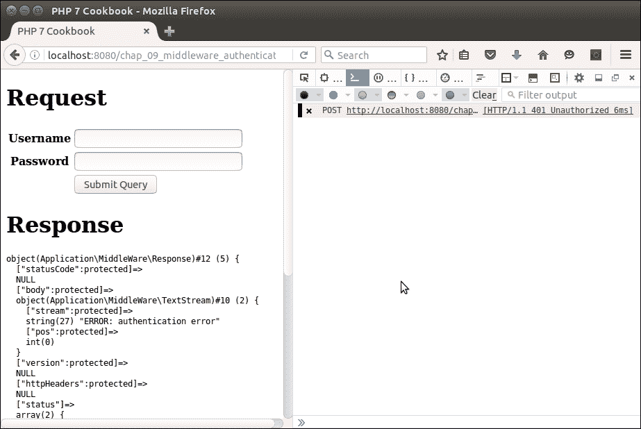
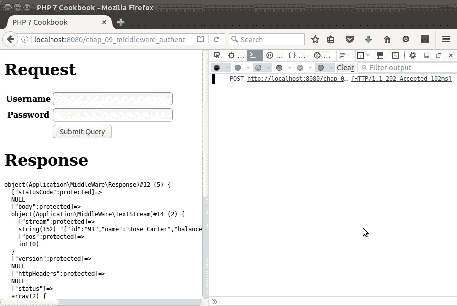
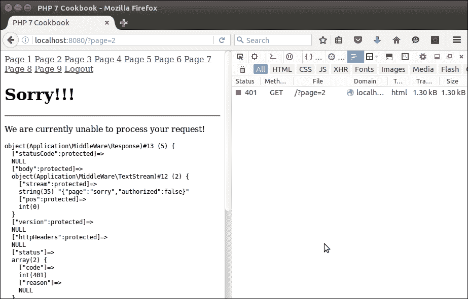
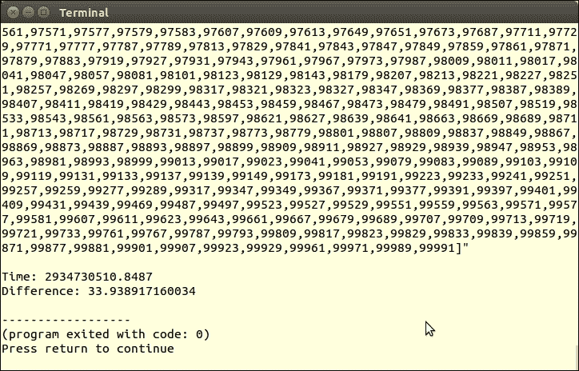
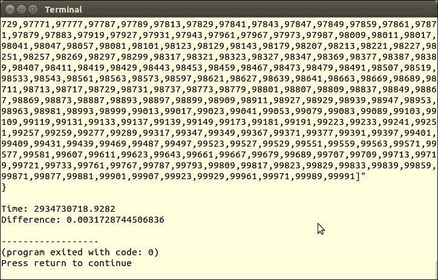
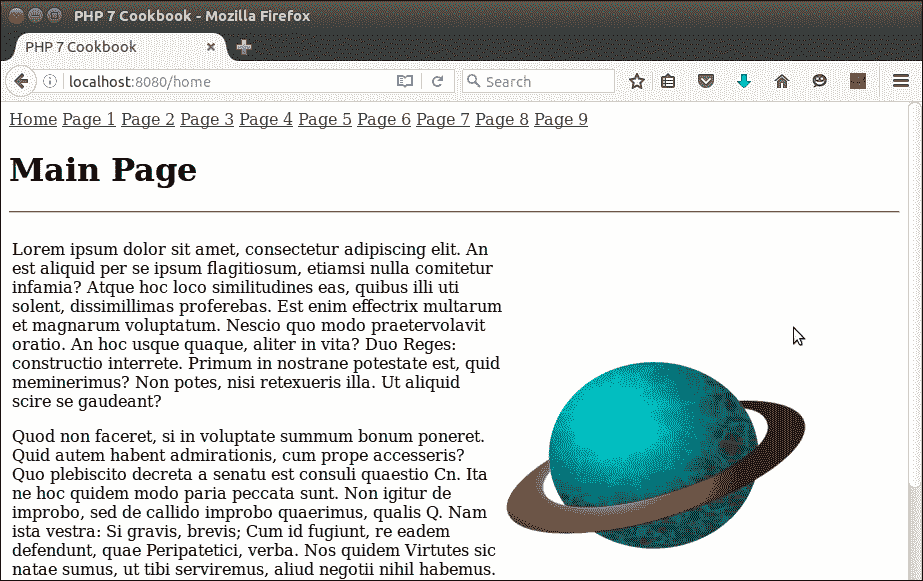
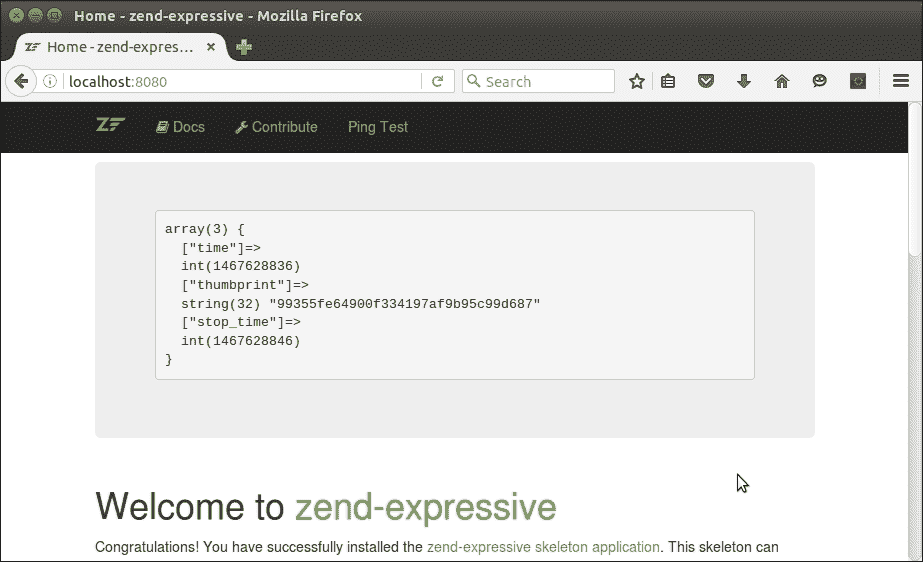
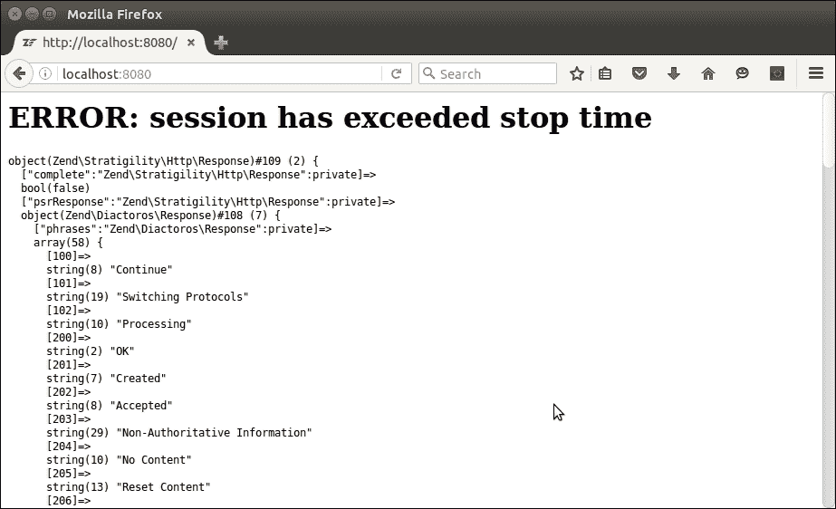

# 第 9 章开发中间件

在本章中，我们将介绍以下主题：

*   用中间件进行身份验证
*   利用中间件实现访问控制
*   使用缓存提高性能
*   实现路由
*   进行框架间系统调用
*   使用中间件跨语言

# 导言

正如 IT 行业经常发生的那样，术语被发明，然后被使用和滥用。术语**中间件**也不例外。可以说，这个术语的首次使用是在 2000 年由**互联网工程任务组**（**IETF**提出的。最初，该术语适用于在传输层（即 TCP/IP）和应用层之间运行的任何软件。最近，特别是随着**PHP 标准建议编号 7**（**PSR-7**的接受，中间件，特别是 PHP 领域的中间件，已经应用到 web 客户机-服务器环境中。

### 注

本节中的配方将使用[附录](14.html "Appendix A. Defining PSR-7 Classes")、*定义 PSR-7 等级*中定义的混凝土等级。

# 使用中间件进行身份验证

中间件的一个非常重要的用途是提供身份验证。大多数基于 web 的应用程序需要能够通过用户名和密码验证访问者。通过将 PSR-7 标准合并到一个身份验证类中，您将使其具有全面的通用性，也就是说，具有足够的安全性，可以在提供符合 PSR-7 的请求和响应对象的任何框架中使用。

## 怎么做。。。

1.  We begin by defining an `Application\Acl\AuthenticateInterface` class. We use this interface to support the Adapter software design pattern, making our `Authenticate` class more generically useful by allowing a variety of adapters, each of which can draw authentication from a different source (for example, from a file, using OAuth2, and so on). Note the use of the PHP 7 ability to define the return value data type:

    ```php
    namespace Application\Acl;
    use Psr\Http\Message\ { RequestInterface, ResponseInterface };
    interface AuthenticateInterface
    {
      public function login(RequestInterface $request) : 
        ResponseInterface;
    }
    ```

    ### 注

    请注意，通过定义一个需要符合 PSR-7 的请求并生成符合 PSR-7 的响应的方法，我们已经使该接口普遍适用。

2.  接下来，我们定义实现接口所需的`login()`方法的适配器。我们确保使用适当的类，并定义拟合常数和属性。构造器使用[第 5 章](05.html "Chapter 5. Interacting with a Database")中定义的`Application\Database\Connection`，*与数据库*：

    ```php
    namespace Application\Acl;
    use PDO;
    use Application\Database\Connection;
    use Psr\Http\Message\ { RequestInterface, ResponseInterface };
    use Application\MiddleWare\ { Response, TextStream };
    class DbTable  implements AuthenticateInterface
    {
      const ERROR_AUTH = 'ERROR: authentication error';
      protected $conn;
      protected $table;
      public function __construct(Connection $conn, $tableName)
      {
        $this->conn = $conn;
        $this->table = $tableName;
      }
    ```

    交互
3.  The core `login()` method extracts the username and password from the request object. We then do a straightforward database lookup. If there is a match, we store user information in the response body, JSON-encoded:

    ```php
    public function login(RequestInterface $request) : 
      ResponseInterface
    {
      $code = 401;
      $info = FALSE;
      $body = new TextStream(self::ERROR_AUTH);
      $params = json_decode($request->getBody()->getContents());
      $response = new Response();
      $username = $params->username ?? FALSE;
      if ($username) {
          $sql = 'SELECT * FROM ' . $this->table 
            . ' WHERE email = ?';
          $stmt = $this->conn->pdo->prepare($sql);
          $stmt->execute([$username]);
          $row = $stmt->fetch(PDO::FETCH_ASSOC);
          if ($row) {
              if (password_verify($params->password, 
                  $row['password'])) {
                    unset($row['password']);
                    $body = 
                    new TextStream(json_encode($row));
                    $response->withBody($body);
                    $code = 202;
                    $info = $row;
                  }
                }
              }
              return $response->withBody($body)->withStatus($code);
            }
          }
    ```

    ### 提示

    **最佳实践**

    切勿以明文形式存储密码。当您需要进行密码匹配时，请使用`password_verify()`，这样就不需要重新生成密码散列。

4.  `Authenticate`类是实现`AuthenticationInterface`的适配器类的包装器。因此，构造函数将适配器类作为参数，以及作为密钥的字符串，其中身份验证信息存储在`$_SESSION`：

    ```php
    namespace Application\Acl;
    use Application\MiddleWare\ { Response, TextStream };
    use Psr\Http\Message\ { RequestInterface, ResponseInterface };
    class Authenticate
    {
      const ERROR_AUTH = 'ERROR: invalid token';
      const DEFAULT_KEY = 'auth';
      protected $adapter;
      protected $token;
      public function __construct(
      AuthenticateInterface $adapter, $key)
      {
        $this->key = $key;
        $this->adapter = $adapter;
      }
    ```

    中
5.  此外，我们还提供了一个带有安全令牌的登录表单，有助于防止**跨站点请求伪造**（**CSRF**攻击：

    ```php
    public function getToken()
    {
      $this->token = bin2hex(random_bytes(16));
      $_SESSION['token'] = $this->token;
      return $this->token;
    }
    public function matchToken($token)
    {
      $sessToken = $_SESSION['token'] ?? date('Ymd');
      return ($token == $sessToken);
    }
    public function getLoginForm($action = NULL)
    {
      $action = ($action) ? 'action="' . $action . '" ' : '';
      $output = '<form method="post" ' . $action . '>';
      $output .= '<table><tr><th>Username</th><td>';
      $output .= '<input type="text" name="username" /></td>';
      $output .= '</tr><tr><th>Password</th><td>';
      $output .= '<input type="password" name="password" />';
      $output .= '</td></tr><tr><th>&nbsp;</th>';
      $output .= '<td><input type="submit" /></td>';
      $output .= '</tr></table>';
      $output .= '<input type="hidden" name="token" value="';
      $output .= $this->getToken() . '" />';
      $output .= '</form>';
      return $output;
    }
    ```

6.  最后，此类中的`login()`方法检查令牌是否有效。如果不是，则返回 400 响应。否则，适配器的`login()`方法称为：

    ```php
    public function login(
    RequestInterface $request) : ResponseInterface
    {
      $params = json_decode($request->getBody()->getContents());
      $token = $params->token ?? FALSE;
      if (!($token && $this->matchToken($token))) {
          $code = 400;
          $body = new TextStream(self::ERROR_AUTH);
          $response = new Response($code, $body);
      } else {
          $response = $this->adapter->login($request);
      }
      if ($response->getStatusCode() >= 200
          && $response->getStatusCode() < 300) {
          $_SESSION[$this->key] = 
            json_decode($response->getBody()->getContents());
      } else {
          $_SESSION[$this->key] = NULL;
      }
      return $response;
    }

    }
    ```

## 它是如何工作的。。。

首先，确保遵循[附录](14.html "Appendix A. Defining PSR-7 Classes")、*定义 PSR-7 类*中定义的配方。接下来，继续定义此配方中提供的类，总结如下表所示：

<colgroup><col style="text-align: left"> <col style="text-align: left"></colgroup> 
| 

班

 | 

在这些步骤中进行了讨论

 |
| --- | --- |
| `Application\Acl\AuthenticateInterface` | 1. |
| `Application\Acl\DbTable` | 2 - 3 |
| `Application\Acl\Authenticate` | 4 - 6 |

然后，您可以定义一个`chap_09_middleware_authenticate.php`调用程序，该程序设置自动加载并使用适当的类：

```php
<?php
session_start();
define('DB_CONFIG_FILE', __DIR__ . '/../config/db.config.php');
define('DB_TABLE', 'customer_09');
define('SESSION_KEY', 'auth');
require __DIR__ . '/../Application/Autoload/Loader.php';
Application\Autoload\Loader::init(__DIR__ . '/..');

use Application\Database\Connection;
use Application\Acl\ { DbTable, Authenticate };
use Application\MiddleWare\ { ServerRequest, Request, Constants, TextStream };
```

您现在可以设置身份验证适配器和核心类：

```php
$conn   = new Connection(include DB_CONFIG_FILE);
$dbAuth = new DbTable($conn, DB_TABLE);
$auth   = new Authenticate($dbAuth, SESSION_KEY);
```

确保初始化传入请求，并设置要向身份验证类发出的请求：

```php
$incoming = new ServerRequest();
$incoming->initialize();
$outbound = new Request();
```

检查传入类方法是否为`POST`。如果是，请将请求传递给身份验证类：

```php
if ($incoming->getMethod() == Constants::METHOD_POST) {
  $body = new TextStream(json_encode(
  $incoming->getParsedBody()));
  $response = $auth->login($outbound->withBody($body));
}
$action = $incoming->getServerParams()['PHP_SELF'];
?>
```

显示逻辑如下所示：

```php
<?= $auth->getLoginForm($action) ?>
```

这是一次无效的身份验证尝试的输出。注意右边的`401`状态码。在本图中，您可以添加响应对象的`var_dump()`：



以下是一个成功的身份验证：



## 另见

有关如何避免 CSRF 等攻击的指导，请参见[第 12 章](12.html "Chapter 12. Improving Web Security")、*提高网络安全*。

# 使用中间件实现访问控制

顾名思义，中间件 Apple T0T 位于一系列函数或方法调用的中间。因此，中间件非常适合“守门人”的任务。您可以使用读取 ACL 的中间件类轻松地实现**访问控制列表**（**ACL**机制，并允许或拒绝访问序列中的下一个函数或方法调用。

## 怎么做。。。

1.  这个过程中最困难的部分可能是确定 ACL 中包含哪些因素。为了便于说明，假设我们的用户都被分配了一个`level`和一个`status`。在本图中，级别定义如下：

    ```php
      'levels' => [0, 'BEG', 'INT', 'ADV']
    ```

2.  状态可以指示他们在成员注册过程中的距离。例如，`0`状态可能表示他们已启动会员注册流程，但尚未确认。状态为`1`可能表示他们的电子邮件地址已确认，但他们尚未支付月费，以此类推。
3.  接下来，我们需要定义我们计划控制的资源。在这种情况下，我们假设需要控制对网站上一系列网页的访问。因此，我们需要定义一系列这样的资源。在 ACL 中，我们可以引用密钥：

    ```php
    'pages'  => [0 => 'sorry', 'logout' => 'logout', 'login'  => 'auth',
                 1 => 'page1', 2 => 'page2', 3 => 'page3',
                 4 => 'page4', 5 => 'page5', 6 => 'page6',
                 7 => 'page7', 8 => 'page8', 9 => 'page9']
    ```

4.  最后，最重要的配置是根据`level`和`status`对页面进行分配。配置阵列中使用的通用模板可能如下所示：

    ```php
    status => ['inherits' => <key>, 'pages' => [level => [pages allowed], etc.]]
    ```

5.  现在我们可以定义`Acl`类了。和前面一样，我们使用了几个类，并定义了适合访问控制的常量和属性：

    ```php
    namespace Application\Acl;

    use InvalidArgumentException;
    use Psr\Http\Message\RequestInterface;
    use Application\MiddleWare\ { Constants, Response, TextStream };

    class Acl
    {
      const DEFAULT_STATUS = '';
      const DEFAULT_LEVEL  = 0;
      const DEFAULT_PAGE   = 0;
      const ERROR_ACL = 'ERROR: authorization error';
      const ERROR_APP = 'ERROR: requested page not listed';
      const ERROR_DEF = 
        'ERROR: must assign keys "levels", "pages" and "allowed"';
      protected $default;
      protected $levels;
      protected $pages;
      protected $allowed; 
    ```

6.  在`__construct()`方法中，我们将分配数组分解为`$pages`、要控制的资源、`$levels`和`$allowed`，它们是实际的分配。如果数组不包括这三个子组件中的一个，则会引发异常：

    ```php
    public function __construct(array $assignments)
    {
      $this->default = $assignments['default'] 
        ?? self::DEFAULT_PAGE;
      $this->pages   = $assignments['pages'] ?? FALSE;
      $this->levels  = $assignments['levels'] ?? FALSE;
      $this->allowed = $assignments['allowed'] ?? FALSE;
      if (!($this->pages && $this->levels && $this->allowed)) {
          throw new InvalidArgumentException(self::ERROR_DEF);
      }
    }
    ```

7.  您可能已经注意到，我们允许继承。在`$allowed`中，可以将`inherits`键设置为数组中的另一个键。如果是这样，我们需要将其值与当前正在检查的值合并。我们反向迭代`$allowed`，每次通过循环合并所有继承的值。顺便说一句，该方法也仅隔离适用于特定`status`和`level`：

    ```php
    protected function mergeInherited($status, $level)
    {
      $allowed = $this->allowed[$status]['pages'][$level] 
        ?? array();
      for ($x = $status; $x > 0; $x--) {
        $inherits = $this->allowed[$x]['inherits'];
        if ($inherits) {
            $subArray = 
              $this->allowed[$inherits]['pages'][$level] 
              ?? array();
            $allowed = array_merge($allowed, $subArray);
        }
      }
      return $allowed;
    }
    ```

    的规则
8.  在处理授权时，我们初始化几个变量，然后从原始请求 URI 中提取请求的页面。如果页面参数不存在，则设置`400`代码：

    ```php
    public function isAuthorized(RequestInterface $request)
    {
      $code = 401;    // unauthorized
      $text['page'] = $this->pages[$this->default];
      $text['authorized'] = FALSE;
      $page = $request->getUri()->getQueryParams()['page'] 
        ?? FALSE;
      if ($page === FALSE) {
          $code = 400;    // bad request
    ```

9.  否则，我们解码请求主体内容，获取`status`和`level`。然后，我们可以调用`mergeInherited()`，它返回一个可访问此`status`和`level`：

    ```php
    } else {
        $params = json_decode(
          $request->getBody()->getContents());
        $status = $params->status ?? self::DEFAULT_LEVEL;
        $level  = $params->level  ?? '*';
        $allowed = $this->mergeInherited($status, $level);
    ```

    的页面数组
10.  如果请求的页面在`$allowed`数组中，我们将状态代码设置为快乐`200`，并随请求页面代码对应的网页返回授权设置：

    ```php
    if (in_array($page, $allowed)) {
        $code = 200;    // OK
        $text['authorized'] = TRUE;
        $text['page'] = $this->pages[$page];
    } else {
        $code = 401;            }
    }
    ```

11.  然后返回 JSON 编码的响应，我们就完成了：

    ```php
    $body = new TextStream(json_encode($text));
    return (new Response())->withStatus($code)
    ->withBody($body);
    }

    }
    ```

## 它是如何工作的。。。

之后，您将需要定义`Application\Acl\Acl`，这将在本配方中讨论。现在移动到`/path/to/source/for/this/chapter`文件夹并创建两个目录：`public`和`pages`。在`pages`中，创建一系列 PHP 文件，如`page1.php`、`page2.php`等。以下是其中一个页面的外观示例：

```php
<?php // page 1 ?>
<h1>Page 1</h1>
<hr>
<p>Lorem ipsum dolor sit amet, consectetur adipiscing elit. etc.</p>
```

您还可以定义一个`menu.php`页面，该页面可以包含在输出中：

```php
<?php // menu ?>
<a href="?page=1">Page 1</a>
<a href="?page=2">Page 2</a>
<a href="?page=3">Page 3</a>
// etc.
```

`logout.php`页面应销毁会话：

```php
<?php
  $_SESSION['info'] = FALSE;
  session_destroy();
?>
<a href="/">BACK</a>
```

`auth.php`页面将显示登录屏幕（如前一配方所述）：

```php
<?= $auth->getLoginForm($action) ?>
```

然后，您可以创建一个配置文件，允许根据级别和状态访问网页。为了便于说明，请调用它`chap_09_middleware_acl_config.php`并返回一个如下所示的数组：

```php
<?php
$min = [0, 'logout'];
return [
  'default' => 0,     // default page
  'levels' => [0, 'BEG', 'INT', 'ADV'],
  'pages'  => [0 => 'sorry', 
  'logout' => 'logout', 
  'login' => 'auth',
               1 => 'page1', 2 => 'page2', 3 => 'page3',
               4 => 'page4', 5 => 'page5', 6 => 'page6',
               7 => 'page7', 8 => 'page8', 9 => 'page9'],
  'allowed' => [
               0 => ['inherits' => FALSE,
                     'pages' => [ '*' => $min, 'BEG' => $min,
                     'INT' => $min,'ADV' => $min]],
               1 => ['inherits' => FALSE,
                     'pages' => ['*' => ['logout'],
                    'BEG' => [1, 'logout'],
                    'INT' => [1,2, 'logout'],
                    'ADV' => [1,2,3, 'logout']]],
               2 => ['inherits' => 1,
                     'pages' => ['BEG' => [4],
                     'INT' => [4,5],
                     'ADV' => [4,5,6]]],
               3 => ['inherits' => 2,
                     'pages' => ['BEG' => [7],
                     'INT' => [7,8],
                     'ADV' => [7,8,9]]]
    ]
];
```

最后，在`public`文件夹中定义`index.php`，设置自动加载，并最终调用同时设置类`Authenticate`类和`Acl`类。与其他配方一样，定义配置文件，设置自动加载，并使用某些类。此外，别忘了启动会话：

```php
<?php
session_start();
session_regenerate_id();
define('DB_CONFIG_FILE', __DIR__ . '/../../config/db.config.php');
define('DB_TABLE', 'customer_09');
define('PAGE_DIR', __DIR__ . '/../pages');
define('SESSION_KEY', 'auth');
require __DIR__ . '/../../Application/Autoload/Loader.php';
Application\Autoload\Loader::init(__DIR__ . '/../..');

use Application\Database\Connection;
use Application\Acl\ { Authenticate, Acl };
use Application\MiddleWare\ { ServerRequest, Request, Constants, TextStream };
```

### 提示

**最佳实践**

这是保护会话的最佳实践。帮助保护会话的一个简单方法是使用`session_regenerate_id()`，它使现有的 PHP 会话标识符无效并生成一个新的标识符。因此，如果攻击者通过非法手段获取会话标识符，则任何给定会话标识符有效的时间窗口保持在最小。

您现在可以拉入 ACL 配置，并为`Authenticate`和`Acl`创建实例：

```php
$config = require __DIR__ . '/../chap_09_middleware_acl_config.php';
$acl    = new Acl($config);
$conn   = new Connection(include DB_CONFIG_FILE);
$dbAuth = new DbTable($conn, DB_TABLE);
$auth   = new Authenticate($dbAuth, SESSION_KEY);
```

接下来，定义传入和传出请求实例：

```php
$incoming = new ServerRequest();
$incoming->initialize();
$outbound = new Request();
```

如果传入请求方法为`post`，则调用`login()`方法进行身份验证：

```php
if (strtolower($incoming->getMethod()) == Constants::METHOD_POST) {
    $body = new TextStream(json_encode(
    $incoming->getParsedBody()));
    $response = $auth->login($outbound->withBody($body));
}
```

如果已填充为身份验证定义的会话密钥，则表示该用户已成功通过身份验证。如果没有，我们将编写一个匿名函数，名为**later**，其中包括认证登录页面：

```php
$info = $_SESSION[SESSION_KEY] ?? FALSE;
if (!$info) {
    $execute = function () use ($auth) {
      include PAGE_DIR . '/auth.php';
    };
```

否则，您可以继续 ACL 检查。但是，首先需要从原始查询中查找用户希望访问的网页：

```php
} else {
    $query = $incoming->getServerParams()['QUERY_STRING'] ?? '';
```

然后，您可以重新编程`$outbound`请求以包含以下信息：

```php
$outbound->withBody(new TextStream(json_encode($info)));
$outbound->getUri()->withQuery($query);
```

接下来，您将能够检查授权，并将出站请求作为参数提供：

```php
$response = $acl->isAuthorized($outbound);
```

然后，您可以检查`authorized`参数的返回响应，如果确定，则编程一个匿名函数以包含返回`page`参数，否则包含`sorry`页面：

```php
$params   = json_decode($response->getBody()->getContents());
$isAllowed = $params->authorized ?? FALSE;
if ($isAllowed) {
    $execute = function () use ($response, $params) {
      include PAGE_DIR .'/' . $params->page . '.php';
      echo '<pre>', var_dump($response), '</pre>';
      echo '<pre>', var_dump($_SESSION[SESSION_KEY]);
      echo '</pre>';
    };
} else {
    $execute = function () use ($response) {
      include PAGE_DIR .'/sorry.php';
      echo '<pre>', var_dump($response), '</pre>';
      echo '<pre>', var_dump($_SESSION[SESSION_KEY]);
      echo '</pre>';
    };
}
}
```

现在，您只需设置表单操作并将匿名函数包装为 HTML：

```php
$action = $incoming->getServerParams()['PHP_SELF'];
?>
<!DOCTYPE html>
<head>
  <title>PHP 7 Cookbook</title>
  <meta http-equiv="content-type" content="text/html;charset=utf-8" />
</head>
<body>
  <?php $execute(); ?>
</body>
</html>
```

要测试它，您可以使用内置 PHP web 服务器，但您需要使用`-t`标志来指示文档根目录为`public`：

```php
cd /path/to/source/for/this/chapter
php -S localhost:8080 -t public

```

通过浏览器，您可以访问`http://localhost:8080/`URL。

如果您尝试访问任何页面，您将被重定向回登录页面。根据配置，状态为`1`，级别为`BEG`的用户只能访问`1`页面并注销。如果作为此用户登录时，您尝试访问第 2 页，则输出如下：



## 另见

本例依赖`$_SESSION`作为用户登录后唯一的身份验证手段。有关如何保护 PHP 会话的良好示例，请参见[第 12 章](12.html "Chapter 12. Improving Web Security")、*提高 Web 安全性*，特别是题为*保护 PHP 会话*的配方。

# 使用缓存提高性能

缓存软件设计模式是，在这里您存储一个需要很长时间才能生成的结果。这可能采用冗长的视图脚本或复杂的数据库查询的形式。当然，如果希望改善网站访问者的用户体验，那么存储目的地需要高性能。由于不同的安装将有不同的潜在存储目标，缓存机制也适用于适配器模式。潜在存储目标的示例包括内存、数据库和文件系统。

## 怎么做。。。

1.  与本章中的其他两个配方一样，由于存在共享常数，我们将定义为一个谨慎的`Application\Cache\Constants`类：

    ```php
    <?php
    namespace Application\Cache;

    class Constants
    {
      const DEFAULT_GROUP  = 'default';
      const DEFAULT_PREFIX = 'CACHE_';
      const DEFAULT_SUFFIX = '.cache';
      const ERROR_GET      = 'ERROR: unable to retrieve from cache';
      // not all constants are shown to conserve space
    }
    ```

2.  鉴于我们遵循适配器设计模式，我们接下来定义了一个接口：

    ```php
    namespace Application\Cache;
    interface  CacheAdapterInterface
    {
      public function hasKey($key);
      public function getFromCache($key, $group);
      public function saveToCache($key, $data, $group);
      public function removeByKey($key);
      public function removeByGroup($group);
    }
    ```

3.  现在，我们已经准备好使用 MySQL 数据库定义第一个缓存适配器，在本图中。我们需要定义包含列名以及准备好的语句的属性：

    ```php
    namespace Application\Cache;
    use PDO;
    use Application\Database\Connection;
    class Database implements CacheAdapterInterface
    {
      protected $sql;
      protected $connection;
      protected $table;
      protected $dataColumnName;
      protected $keyColumnName;
      protected $groupColumnName;
      protected $statementHasKey       = NULL;
      protected $statementGetFromCache = NULL;
      protected $statementSaveToCache  = NULL;
      protected $statementRemoveByKey  = NULL;
      protected $statementRemoveByGroup= NULL;
    ```

4.  构造函数允许我们提供键列名称，以及一个`Application\Database\Connection`实例和用于缓存的表名：

    ```php
    public function __construct(Connection $connection,
      $table,
      $idColumnName,
      $keyColumnName,
      $dataColumnName,
      $groupColumnName = Constants::DEFAULT_GROUP)
      {
        $this->connection  = $connection;
        $this->setTable($table);
        $this->setIdColumnName($idColumnName);
        $this->setDataColumnName($dataColumnName);
        $this->setKeyColumnName($keyColumnName);
        $this->setGroupColumnName($groupColumnName);
      }
    ```

5.  接下来的几个方法准备语句，并在访问数据库时调用。我们并没有展示所有的方法，但展示的足够多，足以让您产生想法：

    ```php
    public function prepareHasKey()
    {
      $sql = 'SELECT `' . $this->idColumnName . '` '
      . 'FROM `'   . $this->table . '` '
      . 'WHERE `'  . $this->keyColumnName . '` = :key ';
      $this->sql[__METHOD__] = $sql;
      $this->statementHasKey = 
      $this->connection->pdo->prepare($sql);
    }
    public function prepareGetFromCache()
    {
      $sql = 'SELECT `' . $this->dataColumnName . '` '
      . 'FROM `'   . $this->table . '` '
      . 'WHERE `'  . $this->keyColumnName . '` = :key '
      . 'AND `'    . $this->groupColumnName . '` = :group';
      $this->sql[__METHOD__] = $sql;
      $this->statementGetFromCache = 
      $this->connection->pdo->prepare($sql);
    }
    ```

6.  现在，我们定义一个方法来确定给定密钥的数据是否存在：

    ```php
    public function hasKey($key)
    {
      $result = 0;
      try {
          if (!$this->statementHasKey) $this->prepareHasKey();
              $this->statementHasKey->execute(['key' => $key]);
      } catch (Throwable $e) {
          error_log(__METHOD__ . ':' . $e->getMessage());
          throw new Exception(Constants::ERROR_REMOVE_KEY);
      }
      return (int) $this->statementHasKey
      ->fetch(PDO::FETCH_ASSOC)[$this->idColumnName];
    }
    ```

7.  核心方法是从缓存中读写的方法。下面是从缓存中检索的方法。我们所需要做的就是执行准备好的语句，该语句执行一个`SELECT`，带有一个`WHERE`子句，其中包含键和组：

    ```php
    public function getFromCache(
    $key, $group = Constants::DEFAULT_GROUP)
    {
      try {
          if (!$this->statementGetFromCache) 
              $this->prepareGetFromCache();
              $this->statementGetFromCache->execute(
                ['key' => $key, 'group' => $group]);
              while ($row = $this->statementGetFromCache
                ->fetch(PDO::FETCH_ASSOC)) {
                if ($row && count($row)) {
                    yield unserialize($row[$this->dataColumnName]);
                }
              }
      } catch (Throwable $e) {
          error_log(__METHOD__ . ':' . $e->getMessage());
          throw new Exception(Constants::ERROR_GET);
      }
    }
    ```

8.  在写入缓存时，我们首先确定是否存在该缓存键的条目。如果是，我们执行`UPDATE`；否则，我们执行一个`INSERT`：

    ```php
    public function saveToCache($key, $data, $group = Constants::DEFAULT_GROUP)
    {
      $id = $this->hasKey($key);
      $result = 0;
      try {
          if ($id) {
              if (!$this->statementUpdateCache) 
                  $this->prepareUpdateCache();
                  $result = $this->statementUpdateCache
                  ->execute(['key' => $key, 
                  'data' => serialize($data), 
                  'group' => $group, 
                  'id' => $id]);
              } else {
                  if (!$this->statementSaveToCache) 
                  $this->prepareSaveToCache();
                  $result = $this->statementSaveToCache
                  ->execute(['key' => $key, 
                  'data' => serialize($data), 
                  'group' => $group]);
              }
          } catch (Throwable $e) {
              error_log(__METHOD__ . ':' . $e->getMessage());
              throw new Exception(Constants::ERROR_SAVE);
          }
          return $result;
       }
    ```

9.  然后，我们定义了两个方法，通过键或组移除缓存。如果有大量项目需要删除，则按组删除提供了一种方便的机制：

    ```php
    public function removeByKey($key)
    {
      $result = 0;
      try {
          if (!$this->statementRemoveByKey) 
          $this->prepareRemoveByKey();
          $result = $this->statementRemoveByKey->execute(
            ['key' => $key]);
      } catch (Throwable $e) {
          error_log(__METHOD__ . ':' . $e->getMessage());
          throw new Exception(Constants::ERROR_REMOVE_KEY);
      }
      return $result;
    }

    public function removeByGroup($group)
    {
      $result = 0;
      try {
          if (!$this->statementRemoveByGroup) 
              $this->prepareRemoveByGroup();
              $result = $this->statementRemoveByGroup->execute(
                ['group' => $group]);
          } catch (Throwable $e) {
              error_log(__METHOD__ . ':' . $e->getMessage());
              throw new Exception(Constants::ERROR_REMOVE_GROUP);
          }
          return $result;
      }
    ```

10.  最后，我们为每个属性定义了 getter 和 setter。此处显示的并非所有内容都是为了节省空间：

    ```php
    public function setTable($name)
    {
      $this->table = $name;
    }
    public function getTable()
    {
      return $this->table;
    }
    // etc.
    }
    ```

11.  文件系统缓存适配器定义的方法与前面定义的方法相同。注意，`md5(),`的使用不是为了安全，而是为了从键

    ```php
    namespace Application\Cache;
    use RecursiveIteratorIterator;
    use RecursiveDirectoryIterator;
    class File implements CacheAdapterInterface
    {
      protected $dir;
      protected $prefix;
      protected $suffix;
      public function __construct(
        $dir, $prefix = NULL, $suffix = NULL)
      {
        if (!file_exists($dir)) {
            error_log(__METHOD__ . ':' . Constants::ERROR_DIR_NOT);
            throw new Exception(Constants::ERROR_DIR_NOT);
        }
        $this->dir = $dir;
        $this->prefix = $prefix ?? Constants::DEFAULT_PREFIX;
        $this->suffix = $suffix ?? Constants::DEFAULT_SUFFIX;
      }

      public function hasKey($key)
      {
        $action = function ($name, $md5Key, &$item) {
          if (strpos($name, $md5Key) !== FALSE) {
            $item ++;
          }
        };

        return $this->findKey($key, $action);
      }

      public function getFromCache($key, $group = Constants::DEFAULT_GROUP)
      {
        $fn = $this->dir . '/' . $group . '/' 
        . $this->prefix . md5($key) . $this->suffix;
        if (file_exists($fn)) {
            foreach (file($fn) as $line) { yield $line; }
        } else {
            return array();
        }
      }

      public function saveToCache(
        $key, $data, $group = Constants::DEFAULT_GROUP)
      {
        $baseDir = $this->dir . '/' . $group;
        if (!file_exists($baseDir)) mkdir($baseDir);
        $fn = $baseDir . '/' . $this->prefix . md5($key) 
        . $this->suffix;
        return file_put_contents($fn, json_encode($data));
      }

      protected function findKey($key, callable $action)
      {
        $md5Key = md5($key);
        $iterator = new RecursiveIteratorIterator(
          new RecursiveDirectoryIterator($this->dir),
          RecursiveIteratorIterator::SELF_FIRST);
          $item = 0;
        foreach ($iterator as $name => $obj) {
          $action($name, $md5Key, $item);
        }
        return $item;
      }

      public function removeByKey($key)
      {
        $action = function ($name, $md5Key, &$item) {
          if (strpos($name, $md5Key) !== FALSE) {
            unlink($name);
            $item++;
          }
        };
        return $this->findKey($key, $action);
      }

      public function removeByGroup($group)
      {
        $removed = 0;
        $baseDir = $this->dir . '/' . $group;
        $pattern = $baseDir . '/' . $this->prefix . '*' 
        . $this->suffix;
        foreach (glob($pattern) as $file) {
          unlink($file);
          $removed++;
        }
        return $removed;
      }
    }
    ```

    快速生成文本字符串
12.  现在我们已经准备好展示核心缓存机制。在构造函数中，我们接受一个实现了`CacheAdapterInterface`的类作为参数：

    ```php
    namespace Application\Cache;
    use Psr\Http\Message\RequestInterface;
    use Application\MiddleWare\ { Request, Response, TextStream };
    class Core
    {
      public function __construct(CacheAdapterInterface $adapter)
      {
        $this->adapter = $adapter;
      }
    ```

13.  接下来是一系列包装器方法，它们从适配器调用相同名称的方法，但接受`Psr\Http\Message\RequestInterface`类和参数，并返回`Psr\Http\Message\ResponseInterface`作为响应。我们从一个简单的例子开始：`hasKey()`。注意我们是如何从请求参数中提取`key`：

    ```php
    public function hasKey(RequestInterface $request)
    {
      $key = $request->getUri()->getQueryParams()['key'] ?? '';
      $result = $this->adapter->hasKey($key);
    }
    ```

14.  要从缓存中检索信息，我们需要从请求对象中提取密钥和组参数，然后从适配器调用相同的方法。如果没有结果，我们设置一个`204`代码，表示请求成功，但没有生成内容。否则，我们将设置一个`200`（成功）代码，并遍历结果。然后将所有内容填充到响应对象中，并返回：

    ```php
    public function getFromCache(RequestInterface $request)
    {
      $text = array();
      $key = $request->getUri()->getQueryParams()['key'] ?? '';
      $group = $request->getUri()->getQueryParams()['group'] 
        ?? Constants::DEFAULT_GROUP;
      $results = $this->adapter->getFromCache($key, $group);
      if (!$results) { 
          $code = 204; 
      } else {
          $code = 200;
          foreach ($results as $line) $text[] = $line;
      }
      if (!$text || count($text) == 0) $code = 204;
      $body = new TextStream(json_encode($text));
      return (new Response())->withStatus($code)
                             ->withBody($body);
    }
    ```

15.  奇怪的是，写入缓存几乎是相同的，除了结果应该是一个数字（即受影响的行数）或布尔结果：

    ```php
    public function saveToCache(RequestInterface $request)
    {
      $text = array();
      $key = $request->getUri()->getQueryParams()['key'] ?? '';
      $group = $request->getUri()->getQueryParams()['group'] 
        ?? Constants::DEFAULT_GROUP;
      $data = $request->getBody()->getContents();
      $results = $this->adapter->saveToCache($key, $data, $group);
      if (!$results) { 
          $code = 204;
      } else {
          $code = 200;
          $text[] = $results;
      }
          $body = new TextStream(json_encode($text));
          return (new Response())->withStatus($code)
                                 ->withBody($body);
      }
    ```

16.  正如所料，移除方法彼此非常相似：

    ```php
    public function removeByKey(RequestInterface $request)
    {
      $text = array();
      $key = $request->getUri()->getQueryParams()['key'] ?? '';
      $results = $this->adapter->removeByKey($key);
      if (!$results) {
          $code = 204;
      } else {
          $code = 200;
          $text[] = $results;
      }
      $body = new TextStream(json_encode($text));
      return (new Response())->withStatus($code)
                             ->withBody($body);
    }

    public function removeByGroup(RequestInterface $request)
    {
      $text = array();
      $group = $request->getUri()->getQueryParams()['group'] 
        ?? Constants::DEFAULT_GROUP;
      $results = $this->adapter->removeByGroup($group);
      if (!$results) {
          $code = 204;
      } else {
          $code = 200;
          $text[] = $results;
      }
      $body = new TextStream(json_encode($text));
      return (new Response())->withStatus($code)
                             ->withBody($body);
      }
    } // closing brace for class Core
    ```

## 它是如何工作的。。。

为了演示`Acl`类的使用，您需要定义本配方中描述的类，总结如下：

<colgroup><col style="text-align: left"> <col style="text-align: left"></colgroup> 
| 

班

 | 

在这些步骤中进行了讨论

 |
| --- | --- |
| `Application\Cache\Constants` | 1. |
| `Application\Cache\CacheAdapterInterface` | 2. |
| `Application\Cache\Database` | 3 - 10 |
| `Application\Cache\File` | 11 |
| `Application\Cache\Core` | 12 - 16 |

接下来，定义一个测试程序，您可以调用它`chap_09_middleware_cache_db.php`。在这个程序中，像往常一样，为必要的文件定义常量，设置自动加载，使用适当的类，哦。。。然后编写一个生成素数的函数（此时您可能正在阅读最后一点。不用担心，我们可以帮您解决这个问题！）：

```php
<?php
define('DB_CONFIG_FILE', __DIR__ . '/../config/db.config.php');
define('DB_TABLE', 'cache');
define('CACHE_DIR', __DIR__ . '/cache');
define('MAX_NUM', 100000);
require __DIR__ . '/../Application/Autoload/Loader.php';
Application\Autoload\Loader::init(__DIR__ . '/..');
use Application\Database\Connection;
use Application\Cache\{ Constants, Core, Database, File };
use Application\MiddleWare\ { Request, TextStream };
```

嗯，需要一个运行时间很长的函数，所以素数生成器，开始吧！数字 1、2 和 3 以素数形式给出。我们使用 PHP7`yield from`语法来生成前三个。然后，我们直接跳到 5，并继续到请求的最大值：

```php
function generatePrimes($max)
{
  yield from [1,2,3];
  for ($x = 5; $x < $max; $x++)
  {
    if($x & 1) {
        $prime = TRUE;
        for($i = 3; $i < $x; $i++) {
            if(($x % $i) === 0) {
                $prime = FALSE;
                break;
            }
        }
        if ($prime) yield $x;
    }
  }
}
```

然后可以设置数据库缓存适配器实例，该实例用作核心的参数：

```php
$conn    = new Connection(include DB_CONFIG_FILE);
$dbCache = new Database(
  $conn, DB_TABLE, 'id', 'key', 'data', 'group');
$core    = new Core($dbCache);
```

或者，如果您希望改用文件缓存适配器，以下是相应的代码：

```php
$fileCache = new File(CACHE_DIR);
$core    = new Core($fileCache);
```

如果您想清除缓存，可以这样做：

```php
$uriString = '/?group=' . Constants::DEFAULT_GROUP;
$cacheRequest = new Request($uriString, 'get');
$response = $core->removeByGroup($cacheRequest);
```

您可以使用`time()`和`microtime()`来查看此脚本在有缓存和没有缓存的情况下运行的时间：

```php
$start = time() + microtime(TRUE);
echo "\nTime: " . $start;
```

接下来，生成一个缓存请求。状态代码`200`表示您能够从缓存中获取素数列表：

```php
$uriString = '/?key=Test1';
$cacheRequest = new Request($uriString, 'get');
$response = $core->getFromCache($cacheRequest);
$status   = $response->getStatusCode();
if ($status == 200) {
    $primes = json_decode($response->getBody()->getContents());
```

否则，您可以假设未从缓存中获取任何内容，这意味着您需要生成素数，并将结果保存到缓存中：

```php
} else {
    $primes = array();
    foreach (generatePrimes(MAX_NUM) as $num) {
        $primes[] = $num;
    }
    $body = new TextStream(json_encode($primes));
    $response = $core->saveToCache(
    $cacheRequest->withBody($body));
}
```

然后，您可以检查停止时间，计算差异，并查看新的素数列表：

```php
$time = time() + microtime(TRUE);
$diff = $time - $start;
echo "\nTime: $time";
echo "\nDifference: $diff";
var_dump($primes);
```

以下是缓存中存储值之前的预期输出：



您现在可以再次运行相同的程序，这次从缓存中检索：



考虑到我们的小素数生成器不是世界上最高效的，而且演示是在笔记本电脑上运行的，时间从 30 秒减少到了毫秒。

## 还有更多。。。

另一个可能的缓存适配器可以围绕作为**备用 PHP 缓存**（**APC**扩展的一部分的命令构建。此扩展包括`apc_exists()`、`apc_store()`、`apc_fetch()`和`apc_clear_cache()`等功能。这些功能非常适合我们的`hasKey()`、`saveToCache()`、`getFromCache()`和`removeBy*()`功能。

## 另见

您可能会考虑对 PSR-6 前面描述的缓存适配器类进行轻微更改，这是针对缓存的标准推荐。然而，本标准的接受程度与 PSR-7 不一样，因此我们决定在此处提供的配方中不完全遵循本标准。有关 PSR-6 的更多信息，请参考[http://www.php-fig.org/psr/psr-6/](http://www.php-fig.org/psr/psr-6/) 。

# 实现路由

路由是指接受用户友好的 URL，将 URL 分解为其组成部分，然后确定应该调度哪个类和方法的过程。这种实现的优点是，您不仅可以使您的 URL**搜索引擎优化**（**SEO**）友好，而且还可以创建规则，合并正则表达式模式，从而提取参数值。

## 怎么做。。。

1.  可能最流行的方法是利用支持**URL 重写**的 web 服务器。其中一个示例是配置为使用`mod_rewrite`的 Apache web 服务器。然后定义重写规则，允许图形文件请求以及 CSS 和 JavaScript 请求原封不动地传递。否则，请求将通过一个路由方法传递。
2.  另一种可能的方法是简单地将 web 服务器虚拟主机定义指向特定的路由脚本，然后该脚本调用路由类，做出路由决策，并适当地重定向。
3.  要考虑的第一个代码是如何定义路由配置。显而易见的答案是构造一个数组，其中每个键都指向 URI 路径匹配的正则表达式，以及某种形式的操作。下面的代码片段中显示了此类配置的示例。在本例中，我们定义了三条路由：`home`、`page`和默认路由。默认值应该是最后一个，因为它将匹配以前未匹配的任何内容。该操作采用匿名函数的形式，如果发生路由匹配，将执行该函数：

    ```php
    $config = [
      'home' => [
        'uri' => '!^/$!',
        'exec' => function ($matches) {
          include PAGE_DIR . '/page0.php'; }
      ],
      'page' => [
        'uri' => '!^/(page)/(\d+)$!',
          'exec' => function ($matches) {
            include PAGE_DIR . '/page' . $matches[2] . '.php'; }
      ],
      Router::DEFAULT_MATCH => [
        'uri' => '!.*!',
        'exec' => function ($matches) {
          include PAGE_DIR . '/sorry.php'; }
      ],
    ];
    ```

4.  接下来，我们定义`Router`类。我们首先定义在检查和匹配路由过程中将使用的常量和属性：

    ```php
    namespace Application\Routing;
    use InvalidArgumentException;
    use Psr\Http\Message\ServerRequestInterface;
    class Router
    {
      const DEFAULT_MATCH = 'default';
      const ERROR_NO_DEF  = 'ERROR: must supply a default match';
      protected $request;
      protected $requestUri;
      protected $uriParts;
      protected $docRoot;
      protected $config;
      protected $routeMatch;
    ```

5.  构造函数接受符合`ServerRequestInterface`的类、文档根目录的路径和前面提到的配置文件。请注意，如果未提供默认配置，我们将抛出一个异常：

    ```php
    public function __construct(ServerRequestInterface $request, $docRoot, $config)
    {
      $this->config = $config;
      $this->docRoot = $docRoot;
      $this->request = $request;
      $this->requestUri = 
        $request->getServerParams()['REQUEST_URI'];
      $this->uriParts = explode('/', $this->requestUri);
      if (!isset($config[self::DEFAULT_MATCH])) {
          throw new InvalidArgumentException(
            self::ERROR_NO_DEF);
      }
    }
    ```

6.  接下来，我们有一系列 getter，允许我们检索原始请求、文档根和最终路由匹配：

    ```php
    public function getRequest()
    {
      return $this->request;
    }
    public function getDocRoot()
    {
      return $this->docRoot;
    }
    public function getRouteMatch()
    {
      return $this->routeMatch;
    }
    ```

7.  `isFileOrDir()`方法用于确定我们是否试图匹配 CSS、JavaScript 或图形请求（以及其他可能性）：

    ```php
    public function isFileOrDir()
    {
      $fn = $this->docRoot . '/' . $this->requestUri;
      $fn = str_replace('//', '/', $fn);
      if (file_exists($fn)) {
          return $fn;
      } else {
          return '';
      }
    }
    ```

8.  最后我们定义了`match()`，它遍历配置数组并通过`preg_match()`运行`uri`参数。如果为正，则配置键和由`preg_match()`填充的`$matches`数组存储在`$routeMatch`中，并返回回调。如果没有匹配，则返回默认回调：

    ```php
    public function match()
    {
      foreach ($this->config as $key => $route) {
        if (preg_match($route['uri'], 
            $this->requestUri, $matches)) {
            $this->routeMatch['key'] = $key;
            $this->routeMatch['match'] = $matches;
            return $route['exec'];
        }
      }
      return $this->config[self::DEFAULT_MATCH]['exec'];
    }
    }
    ```

## 它是如何工作的。。。

首先，切换到`/path/to/source/for/this/chapter`并创建一个名为`routing`的目录。接下来，定义一个文件`index.php`，它设置自动加载并使用正确的类。您可以定义一个常量`PAGE_DIR`，该常量指向在上一个配方中创建的`pages`目录：

```php
<?php
define('DOC_ROOT', __DIR__);
define('PAGE_DIR', DOC_ROOT . '/../pages');

require_once __DIR__ . '/../../Application/Autoload/Loader.php';
Application\Autoload\Loader::init(__DIR__ . '/../..');
use Application\MiddleWare\ServerRequest;
use Application\Routing\Router;
```

接下来，添加本配方步骤 3 中讨论的配置阵列。请注意，您可以在模式的末尾添加`(/)?`，以说明可选的尾部斜杠。此外，对于`home`路线，您可以提供两种选择：`/`或`/home`：

```php
$config = [
  'home' => [
    'uri' => '!^(/|/home)$!',
    'exec' => function ($matches) {
      include PAGE_DIR . '/page0.php'; }
  ],
  'page' => [
    'uri' => '!^/(page)/(\d+)(/)?$!',
    'exec' => function ($matches) {
      include PAGE_DIR . '/page' . $matches[2] . '.php'; }
  ],
  Router::DEFAULT_MATCH => [
    'uri' => '!.*!',
    'exec' => function ($matches) {
      include PAGE_DIR . '/sorry.php'; }
  ],
];
```

然后可以定义路由器实例，提供一个初始化的`ServerRequest`实例作为第一个参数：

```php
$router = new Router((new ServerRequest())
  ->initialize(), DOC_ROOT, $config);
$execute = $router->match();
$params  = $router->getRouteMatch()['match'];
```

然后需要检查请求是文件还是目录，以及路由匹配是否为`/`：

```php
if ($fn = $router->isFileOrDir()
    && $router->getRequest()->getUri()->getPath() != '/') {
    return FALSE;
} else {
    include DOC_ROOT . '/main.php';
}
```

接下来，定义`main.php`，类似这样的内容：

```php
<?php // demo using middleware for routing ?>
<!DOCTYPE html>
<head>
  <title>PHP 7 Cookbook</title>
  <meta http-equiv="content-type" 
  content="text/html;charset=utf-8" />
</head>
<body>
    <?php include PAGE_DIR . '/route_menu.php'; ?>
    <?php $execute($params); ?>
</body>
</html>
```

最后，需要使用用户友好路由的修订菜单：

```php
<?php // menu for routing ?>
<a href="/home">Home</a>
<a href="/page/1">Page 1</a>
<a href="/page/2">Page 2</a>
<a href="/page/3">Page 3</a>
<!-- etc. -->
```

要使用 Apache 测试配置，请定义一个指向`/path/to/source/for/this/chapter/routing`的虚拟主机定义。此外，定义一个`.htaccess`文件，该文件指向任何不是文件、目录或指向`index.php`的链接的请求。或者，您可以只使用内置的 PHP Web 服务器。在终端窗口或命令提示符中，键入以下命令：

```php
cd /path/to/source/for/this/chapter/routing
php -S localhost:8080

```

在浏览器中，请求`http://localhost:8080/home`时的输出如下：



## 另见

有关使用**NGINX**web 服务器进行重写的信息，请参阅本文：[http://nginx.org/en/docs/http/ngx_http_rewrite_module.html](http://nginx.org/en/docs/http/ngx_http_rewrite_module.html) 。有很多复杂的 PHP 路由库，它们引入了比这里介绍的简单路由器更强大的功能。这些包括 Altorouter（[http://altorouter.com/](http://altorouter.com/) 、树状物（[https://github.com/baryshev/TreeRoute](https://github.com/baryshev/TreeRoute) 、快速路线[https://github.com/nikic/FastRoute](https://github.com/nikic/FastRoute) 和 Aura.Router。（[https://github.com/auraphp/Aura.Router](https://github.com/auraphp/Aura.Router) 。此外，大多数框架（例如 Zend Framework 2 或 CodeIgniter）都有自己的路由功能。

# 进行框架间系统调用

PSR-7（和中间件）开发的一个主要原因是越来越需要在框架之间进行调用。值得注意的是，PSR-7 的主要文档由**PHP Framework Interop****组**（**PHP-FIG**托管。

## 怎么做。。。

1.  中间件框架间调用中使用的主要机制是创建一个驱动程序，该驱动程序连续执行框架调用，维护一个公共请求和响应对象。请求和响应对象应分别表示`Psr\Http\Message\ServerRequestInterface`和`Psr\Http\Message\ResponseInterface`。
2.  出于本说明的目的，我们定义了一个中间件会话验证器。常量和属性反映了会话`thumbprint`，这是一个我们用来包含网站访问者 IP 地址、浏览器和语言设置等因素的术语：

    ```php
    namespace Application\MiddleWare\Session;
    use InvalidArgumentException;
    use Psr\Http\Message\ { 
      ServerRequestInterface, ResponseInterface };
    use Application\MiddleWare\ { Constants, Response, TextStream };
    class Validator
    {
      const KEY_TEXT = 'text';
      const KEY_SESSION = 'thumbprint';
      const KEY_STATUS_CODE = 'code';
      const KEY_STATUS_REASON = 'reason';
      const KEY_STOP_TIME = 'stop_time';
      const ERROR_TIME = 'ERROR: session has exceeded stop time';
      const ERROR_SESSION = 'ERROR: thumbprint does not match';
      const SUCCESS_SESSION = 'SUCCESS: session validates OK';
      protected $sessionKey;
      protected $currentPrint;
      protected $storedPrint;
      protected $currentTime;
      protected $storedTime;
    ```

3.  构造函数将`ServerRequestInterface`实例和会话作为参数。如果会话是一个数组（如`$_SESSION`），我们将其包装在一个类中。我们这样做的原因是为了防止传递一个会话对象，例如 Joomla 中使用的`JSession`。然后，我们使用前面提到的因素创建指纹。如果存储的指纹不可用，我们假设这是第一次，如果设置了此参数，则存储当前打印以及停止时间。我们使用`md5()`是因为它是一个快速散列，不对外公开，因此对这个应用程序非常有用：

    ```php
    public function __construct(
      ServerRequestInterface $request, $stopTime = NULL)
    {
      $this->currentTime  = time();
      $this->storedTime   = $_SESSION[self::KEY_STOP_TIME] ?? 0;
      $this->currentPrint = 
        md5($request->getServerParams()['REMOTE_ADDR']
          . $request->getServerParams()['HTTP_USER_AGENT']
          . $request->getServerParams()['HTTP_ACCEPT_LANGUAGE']);
            $this->storedPrint  = $_SESSION[self::KEY_SESSION] 
          ?? NULL;
      if (empty($this->storedPrint)) {
          $this->storedPrint = $this->currentPrint;
          $_SESSION[self::KEY_SESSION] = $this->storedPrint;
          if ($stopTime) {
              $this->storedTime = $stopTime;
              $_SESSION[self::KEY_STOP_TIME] = $stopTime;
          }
      }
    }
    ```

4.  不需要定义`__invoke()`，但是这种神奇的方法对于独立的中间件类来说非常方便。按照惯例，我们接受`ServerRequestInterface`和`ResponseInterface`实例作为参数。在这种方法中，我们只需检查当前指纹是否与存储的指纹匹配。第一次，当然，他们会匹配。但在随后的请求中，很可能会发现意图劫持会话的攻击者。此外，如果会话时间超过停止时间（如果设置），同样会发送一个`401`代码：

    ```php
    public function __invoke(
      ServerRequestInterface $request, Response $response)
    {
      $code = 401;  // unauthorized
      if ($this->currentPrint != $this->storedPrint) {
          $text[self::KEY_TEXT] = self::ERROR_SESSION;
          $text[self::KEY_STATUS_REASON] = 
            Constants::STATUS_CODES[401];
      } elseif ($this->storedTime) {
          if ($this->currentTime > $this->storedTime) {
              $text[self::KEY_TEXT] = self::ERROR_TIME;
              $text[self::KEY_STATUS_REASON] = 
                Constants::STATUS_CODES[401];
          } else {
              $code = 200; // success
          }
      }
      if ($code == 200) {
          $text[self::KEY_TEXT] = self::SUCCESS_SESSION;
          $text[self::KEY_STATUS_REASON] = 
            Constants::STATUS_CODES[200];
      }
      $text[self::KEY_STATUS_CODE] = $code;
      $body = new TextStream(json_encode($text));
      return $response->withStatus($code)->withBody($body);
    }
    ```

5.  我们现在可以使用我们的新中间件类。这里总结了框架间调用的主要问题，至少目前是这样。因此，我们如何实现中间件在很大程度上取决于最后一点：
    *   并非所有 PHP 框架都与 PSR-7 兼容
    *   现有的 PSR-7 实施不完整
    *   所有框架都想成为“老板”
6.  例如，查看**Zend Expressive**的配置文件，这是一个自称的*PSR7 中间件微框架*。这是文件`middleware-pipeline.global.php`，它位于标准表达应用程序的`config/autoload`文件夹中。dependencies 键用于标识将在管道中激活的中间件包装类：

    ```php
    <?php
    use Zend\Expressive\Container\ApplicationFactory;
    use Zend\Expressive\Helper;
    return [  
      'dependencies' => [
         'factories' => [
            Helper\ServerUrlMiddleware::class => 
            Helper\ServerUrlMiddlewareFactory::class,
            Helper\UrlHelperMiddleware::class => 
            Helper\UrlHelperMiddlewareFactory::class,
            // insert your own class here
         ],
      ],
    ```

7.  在`middleware_pipline`键下，您可以识别将在路由过程发生之前或之后执行的类。可选参数包括`path`、`error`和`priority`：

    ```php
    'middleware_pipeline' => [
       'always' => [
          'middleware' => [
             Helper\ServerUrlMiddleware::class,
          ],
          'priority' => 10000,
       ],
       'routing' => [
          'middleware' => [
             ApplicationFactory::ROUTING_MIDDLEWARE,
             Helper\UrlHelperMiddleware::class,
             // insert reference to middleware here
             ApplicationFactory::DISPATCH_MIDDLEWARE,
          ],
          'priority' => 1,
       ],
       'error' => [
          'middleware' => [
             // Add error middleware here.
          ],
          'error'    => true,
          'priority' => -10000,
        ],
      ],
    ];
    ```

8.  另一种技术是修改现有框架模块的源代码，并向符合 PSR-7 的中间件应用程序发出请求。下面是一个修改**Joomla 的示例！**安装到包括一个中间件会话验证程序。
9.  接下来，将此代码添加到`/path/to/joomla`文件夹中`index.php`文件的末尾。自从乔姆拉！使用 Composer，我们可以利用 Composer 自动加载器：

    ```php
    session_start();    // to support use of $_SESSION
    $loader = include __DIR__ . '/libraries/vendor/autoload.php';
    $loader->add('Application', __DIR__ . '/libraries/vendor');
    $loader->add('Psr', __DIR__ . '/libraries/vendor');
    ```

10.  然后，我们可以创建中间件会话验证器的实例，并在`$app = JFactory::getApplication('site');`：

    ```php
    $session = JFactory::getSession();
    $request = 
      (new Application\MiddleWare\ServerRequest())->initialize();
    $response = new Application\MiddleWare\Response();
    $validator = new Application\Security\Session\Validator(
      $request, $session);
    $response = $validator($request, $response);
    if ($response->getStatusCode() != 200) {
      // take some action
    }
    ```

    之前发出验证请求

## 它是如何工作的。。。

首先，创建步骤 2-5 中描述的`Application\MiddleWare\Session\Validator`测试中间件类。然后你需要去[https://getcomposer.org/](https://getcomposer.org/) 并按照说明获取作曲家。下载到`/path/to/source/for/this/chapter`文件夹。接下来，构建一个基本的 Zend Expressive 应用程序，如下所示。提示输入最小骨架时，确保选择`No`：

```php
cd /path/to/source/for/this/chapter
php composer.phar create-project zendframework/zend-expressive-skeleton expressive

```

这将创建一个`folder /path/to/source/for/this/chapter/expressive`。更改到此目录。修改`public/index.php`如下：

```php
<?php
if (php_sapi_name() === 'cli-server'
    && is_file(__DIR__ . parse_url(
$_SERVER['REQUEST_URI'], PHP_URL_PATH))
) {
    return false;
}
chdir(dirname(__DIR__));
session_start();
$_SESSION['time'] = time();
$appDir = realpath(__DIR__ . '/../../..');
$loader = require 'vendor/autoload.php';
$loader->add('Application', $appDir);
$container = require 'config/container.php';
$app = $container->get(\Zend\Expressive\Application::class);
$app->run();
```

然后，您需要创建一个包装器类来调用我们的会话验证器中间件。创建一个需要放入`/path/to/source/for/this/chapter/expressive/src/App/Action`文件夹的`SessionValidateAction.php`文件。在本图中，将停止时间参数设置为短持续时间。在这种情况下，`time() + 10`给你 10 秒：

```php
namespace App\Action;
use Application\MiddleWare\Session\Validator;
use Zend\Diactoros\ { Request, Response };
use Psr\Http\Message\ResponseInterface;
use Psr\Http\Message\ServerRequestInterface;
class SessionValidateAction
{
  public function __invoke(ServerRequestInterface $request, 
  ResponseInterface $response, callable $next = null)
  {
    $inbound   = new Response();
    $validator = new Validator($request, time()+10);
    $inbound   = $validator($request, $response);
    if ($inbound->getStatusCode() != 200) {
        session_destroy();
        setcookie('PHPSESSID', 0, time()-300);
        $params = json_decode(
          $inbound->getBody()->getContents(), TRUE);
        echo '<h1>',$params[Validator::KEY_TEXT],'</h1>';
        echo '<pre>',var_dump($inbound),'</pre>';
        exit;
    }
    return $next($request,$response);
  }
}
```

现在需要将新类添加到中间件管道中。修改`config/autoload/middleware-pipeline.global.php`如下。修改如**粗体**所示：

```php
<?php
use Zend\Expressive\Container\ApplicationFactory;
use Zend\Expressive\Helper;
return [
  'dependencies' => [
 'invokables' => [
 App\Action\SessionValidateAction::class => 
 App\Action\SessionValidateAction::class,
 ],
   'factories' => [
      Helper\ServerUrlMiddleware::class => 
      Helper\ServerUrlMiddlewareFactory::class,
      Helper\UrlHelperMiddleware::class => 
      Helper\UrlHelperMiddlewareFactory::class,
    ],
  ],
  'middleware_pipeline' => [
      'always' => [
         'middleware' => [
            Helper\ServerUrlMiddleware::class,
         ],
         'priority' => 10000,
      ],
      'routing' => [
         'middleware' => [
            ApplicationFactory::ROUTING_MIDDLEWARE,
            Helper\UrlHelperMiddleware::class,
            App\Action\SessionValidateAction::class,
            ApplicationFactory::DISPATCH_MIDDLEWARE,
         ],
         'priority' => 1,
      ],
    'error' => [
       'middleware' => [
          // Add error middleware here.
       ],
       'error'    => true,
       'priority' => -10000,
    ],
  ],
];
```

您还可以考虑修改主页模板来显示 AutoT0}的状态。该文件为`/path/to/source/for/this/chapter/expressive/templates/app/home-page.phtml`。简单地添加`var_dump($_SESSION)`就足够了。

最初，您应该看到这样的情况：



10 秒后，刷新浏览器。您现在应该看到：



# 使用中间件跨语言

除了在您试图在不同版本的 PHP 之间进行通信的情况外，PSR-7 中间件的使用将非常有限。回想一下缩写词代表什么：**PHP 标准建议**。因此，如果需要向用另一种语言编写的应用程序发出请求，请将其视为任何其他 web 服务 HTTP 请求。

## 怎么做。。。

1.  在 PHP4 的例子中，您实际上有一个机会，即对面向对象编程的支持是有限的。因此，最好的方法是降低前三个配方中描述的基本 PSR-7 等级。没有足够的空间来覆盖所有的更改，但是我们提供了一个潜在的 PHP4 版本的`Application\MiddleWare\ServerRequest`。首先要注意的是没有名称空间！因此，我们使用带下划线的类名来代替名称空间分隔符：

    ```php
    class Application_MiddleWare_ServerRequest
    extends Application_MiddleWare_Request
    implements Psr_Http_Message_ServerRequestInterface
    {
    ```

2.  所有属性都在 PHP 4 中使用关键字`var`：

    ```php
    var $serverParams;
    var $cookies;
    var $queryParams;
    // not all properties are shown
    ```

    进行标识
3.  `initialize()`方法几乎相同，只是 PHP4 中不允许使用类似`$this->getServerParams()['REQUEST_URI']`的语法。因此，我们需要将其拆分为一个单独的变量：

    ```php
    function initialize()
    {
      $params = $this->getServerParams();
      $this->getCookieParams();
      $this->getQueryParams();
      $this->getUploadedFiles;
      $this->getRequestMethod();
      $this->getContentType();
      $this->getParsedBody();
      return $this->withRequestTarget($params['REQUEST_URI']);
    }
    ```

4.  所有的`$_XXX`超全局变量都出现在 PHP4 的后续版本中：

    ```php
    function getServerParams()
    {
      if (!$this->serverParams) {
          $this->serverParams = $_SERVER;
      }
      return $this->serverParams;
    }
    // not all getXXX() methods are shown to conserve space
    ```

5.  空合并运算符仅在 PHP7 中引入。我们需要使用`isset(XXX) ? XXX : '';`来代替：

    ```php
    function getRequestMethod()
    {
      $params = $this->getServerParams();
      $method = isset($params['REQUEST_METHOD']) 
        ? $params['REQUEST_METHOD'] : '';
      $this->method = strtolower($method);
      return $this->method;
    }
    ```

6.  JSON 扩展直到 PHP5 才被引入。因此，我们需要满足于原始输入。我们也可以使用`serialize()`或`unserialize()`代替`json_encode()`和`json_decode()`：

    ```php
    function getParsedBody()
    {
      if (!$this->parsedBody) {
          if (($this->getContentType() == 
               Constants::CONTENT_TYPE_FORM_ENCODED
               || $this->getContentType() == 
               Constants::CONTENT_TYPE_MULTI_FORM)
               && $this->getRequestMethod() == 
               Constants::METHOD_POST)
          {
              $this->parsedBody = $_POST;
          } elseif ($this->getContentType() == 
                    Constants::CONTENT_TYPE_JSON
                    || $this->getContentType() == 
                    Constants::CONTENT_TYPE_HAL_JSON)
          {
              ini_set("allow_url_fopen", true);
              $this->parsedBody = 
                file_get_contents('php://stdin');
          } elseif (!empty($_REQUEST)) {
              $this->parsedBody = $_REQUEST;
          } else {
              ini_set("allow_url_fopen", true);
              $this->parsedBody = 
                file_get_contents('php://stdin');
          }
      }
      return $this->parsedBody;
    }
    ```

7.  在 PHP4 中，`withXXX()`方法的工作原理基本相同：

    ```php
    function withParsedBody($data)
    {
      $this->parsedBody = $data;
      return $this;
    }
    ```

8.  同样地，`withoutXXX()`方法也同样有效：

    ```php
    function withoutAttribute($name)
    {
      if (isset($this->attributes[$name])) {
          unset($this->attributes[$name]);
      }
      return $this;
    }

    }
    ```

9.  对于使用其他语言的网站，我们可以使用 PSR-7 类来制定请求和响应，但随后需要使用 HTTP 客户端与其他网站进行通信。作为一个例子，回想一下本章中开发 PSR-7 请求类的配方*中讨论的`Request`演示。以下是*中的示例，它是如何工作的。。。*节：

    ```php
    $request = new Request(
      TARGET_WEBSITE_URL,
      Constants::METHOD_POST,
      new TextStream($contents),
      [Constants::HEADER_CONTENT_TYPE => 
      Constants::CONTENT_TYPE_FORM_ENCODED,
      Constants::HEADER_CONTENT_LENGTH => $body->getSize()]
    );

    $data = http_build_query(['data' => 
    $request->getBody()->getContents()]);

    $defaults = array(
      CURLOPT_URL => $request->getUri()->getUriString(),
      CURLOPT_POST => true,
      CURLOPT_POSTFIELDS => $data,
    );
    $ch = curl_init();
    curl_setopt_array($ch, $defaults);
    $response = curl_exec($ch);
    curl_close($ch);
    ```*