# 十、查看高级算法

在本章中，我们将介绍：

*   使用 getter 和 setter
*   实施链表
*   建立一个泡沫排序
*   实现堆栈
*   构建二进制搜索类
*   实现搜索引擎
*   显示多维数组并累加总计

# 导言

在本章中，我们将介绍实现各种高级算法的配方，如链表、气泡排序、堆栈和二进制搜索。此外，我们还介绍了 getter 和 setter，以及实现一个搜索引擎和显示具有累计总数的多维数组中的值。

# 使用 getter 和 setter

乍一看，用`public`属性定义类似乎是有意义的，这些属性可以直接读取或写入。然而，最好的做法是创建属性`protected`，然后为每个属性定义**getter**和**setter**。顾名思义，*getter*检索属性的值。使用*设定器*设定值。

### 提示

**最佳实践**

将属性定义为`protected`以防止意外*进入*之外。使用`public`get*和 set*方法提供对这些属性的访问。通过这种方式，不仅可以更精确地控制访问，还可以在获取和设置属性时对属性进行格式和数据类型更改。

## 怎么做。。。

1.  获取或设置值时，getter 和 setter 提供了额外的灵活性。如果需要，您可以添加额外的逻辑层，如果您直接读取或写入公共属性，将不可能实现这一点。您只需创建一个前缀为`get`或`set`的公共方法。属性的名称将成为后缀。将变量的第一个字母大写是一种惯例。因此，如果属性为`$testValue`，则 getter 将为`getTestValue()`。
2.  在本例中，我们定义了一个具有受保护属性`$date`的类。请注意，`get`和`set`方法允许作为`DateTime`对象或字符串进行处理。该值实际上存储在任何事件中作为一个`DateTime`实例：

    ```php
    $a = new class() {
      protected $date;
      public function setDate($date)
      {
        if (is_string($date)) {
            $this->date = new DateTime($date);
        } else {
            $this->date = $date;
        }
      }
      public function getDate($asString = FALSE)
      {
        if ($asString) {
            return $this->date->format('Y-m-d H:i:s');
        } else {
            return $this->date;
        }
      }
    };
    ```

3.  getter 和 setter 允许您过滤或清理进出的数据。在下面的示例中，有两个属性`$intVal`和`$arrVal`，它们被设置为默认初始值`NULL`。请注意，不仅键入了 getters 数据的返回值，而且还提供了默认值。设置器也可以强制输入数据类型，或者将输入的值强制转换为特定的数据类型：

    ```php
    <?php
    class GetSet
    {
      protected $intVal = NULL;
      protected $arrVal = NULL;
      // note the use of the null coalesce operator to return a default value
      public function getIntVal() : int
      {
        return $this->intVal ?? 0;
      }
      public function getArrVal() : array
      {
        return $this->arrVal ?? array();
      }
      public function setIntVal($val)
      {
        $this->intVal = (int) $val ?? 0;
      }
      public function setArrVal(array $val)
      {
        $this->arrVal = $val ?? array();
      }
    }
    ```

4.  If you have a class with lots and lots of properties, it might become tedious to define a distinct getter and setter for each property. In this case, you can define a kind of *fallback* using the magic method `__call()`. The following class defines nine different properties. Instead of having to define nine getters and nine setters, we define a single method, `__call()`, which makes a determination whether or not the usage is `get` or `set`. If `get`, it retrieves the key from an internal array. If `set`, it stores the value in the internal array.

    ### 注

    `__call()`方法是一种魔法方法，如果应用程序调用不存在的方法，则会执行该方法。

    ```php
    <?php
    class LotsProps
    {
      protected $firstName  = NULL;
      protected $lastName   = NULL;
      protected $addr1      = NULL;
      protected $addr2      = NULL;
      protected $city       = NULL;
      protected $state      = NULL;
      protected $province   = NULL;
      protected $postalCode = NULL;
      protected $country    = NULL;
      protected $values     = array();

      public function __call($method, $params)
      {
        preg_match('/^(get|set)(.*?)$/i', $method, $matches);
        $prefix = $matches[1] ?? '';
        $key    = $matches[2] ?? '';
        $key    = strtolower($key);
        if ($prefix == 'get') {
            return $this->values[$key] ?? '---';
        } else {
            $this->values[$key] = $params[0];
        }
      }
    }
    ```

## 它是如何工作的。。。

将步骤 1 中提到的代码复制到新文件`chap_10_oop_using_getters_and_setters.php`中。要测试类，请添加以下内容：

```php
// set date using a string
$a->setDate('2015-01-01');
var_dump($a->getDate());

// retrieves the DateTime instance
var_dump($a->getDate(TRUE));

// set date using a DateTime instance
$a->setDate(new DateTime('now'));
var_dump($a->getDate());

// retrieves the DateTime instance
var_dump($a->getDate(TRUE));
```

在输出中（如下所示），您可以看到可以使用`string`或实际`DateTime`实例来设置`$date`属性。执行`getDate()`时，您可以返回`string`或`DateTime`实例，具体取决于`$asString`标志的值：

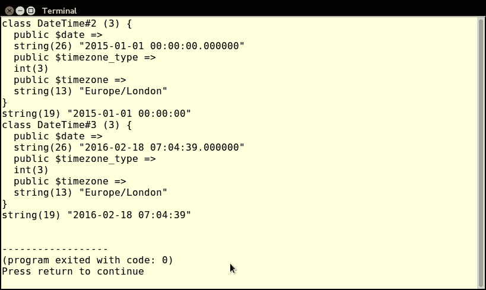

接下来，看看步骤 2 中定义的代码。将此代码复制到文件`chap_10_oop_using_getters_and_setters_defaults.php`中，并添加以下内容：

```php
// create the instance
$a = new GetSet();

// set a "proper" value
$a->setIntVal(1234);
echo $a->getIntVal();
echo PHP_EOL;

// set a bogus value
$a->setIntVal('some bogus value');
echo $a->getIntVal();
echo PHP_EOL;

// NOTE: boolean TRUE == 1
$a->setIntVal(TRUE);
echo $a->getIntVal();
echo PHP_EOL;

// returns array() even though no value was set
var_dump($a->getArrVal());
echo PHP_EOL;

// sets a "proper" value
$a->setArrVal(['A','B','C']);
var_dump($a->getArrVal());
echo PHP_EOL;

try {
    $a->setArrVal('this is not an array');
    var_dump($a->getArrVal());
    echo PHP_EOL;
} catch (TypeError $e) {
    echo $e->getMessage();
}

echo PHP_EOL;
```

从下面的输出中可以看到，设置*正确的*整数值的效果与预期一致。非数值默认为`0`。有趣的是，如果您提供一个布尔值`TRUE`作为`setIntVal()`的参数，它将被插值为`1`。

如果不设置值调用`getArrVal()`，默认为空数组。设置数组值按预期工作。但是，如果您提供一个非数组值作为参数，那么数组的类型提示会导致抛出一个`TypeError`，如下所示：

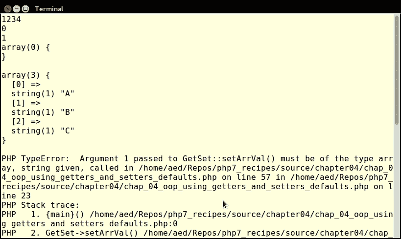

最后，获取步骤 3 中定义的`LotsProps`类，并将其放在单独的文件`chap_10_oop_using_getters_and_setters_magic_call.php`中。现在添加代码来设置值。当然，将会发生的是，神奇的方法`__call()`被调用。运行`preg_match()`后，字母`set`后的不存在属性的剩余部分将成为内部数组`$values`中的一个键：

```php
$a = new LotsProps();
$a->setFirstName('Li\'l Abner');
$a->setLastName('Yokum');
$a->setAddr1('1 Dirt Street');
$a->setCity('Dogpatch');
$a->setState('Kentucky');
$a->setPostalCode('12345');
$a->setCountry('USA');
?>
```

然后，您可以使用相应的`get`方法定义显示值的 HTML。这些将依次从内部阵列返回密钥：

```php
<div class="container">
<div class="left blue1">Name</div>
<div class="right yellow1">
<?= $a->getFirstName() . ' ' . $a->getLastName() ?></div>   
</div>
<div class="left blue2">Address</div>
<div class="right yellow2">
    <?= $a->getAddr1() ?>
    <br><?= $a->getAddr2() ?>
    <br><?= $a->getCity() ?>
    <br><?= $a->getState() ?>
    <br><?= $a->getProvince() ?>
    <br><?= $a->getPostalCode() ?>
    <br><?= $a->getCountry() ?>
</div>   
</div>
```

以下是最终输出：

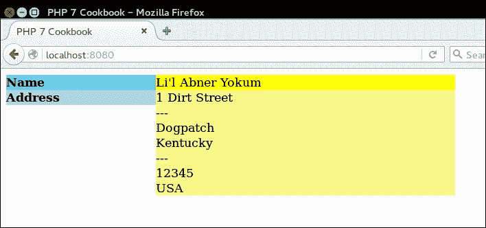

# 实现链表

链表是一个列表包含指向另一个列表中的键的键。在数据库术语中，一个类比是，其中有一个包含数据的表和一个指向数据的单独索引。一个索引可能根据 ID 生成项目列表。另一个索引可能根据标题等生成列表。链表的显著特点是，您不必触摸原始项目列表。

例如，在下图中，主列表包含 ID 号和水果名称。如果直接输出主列表，水果名称将按以下顺序显示：**苹果**、**葡萄**、**香蕉**、**橙**、**樱桃**。另一方面，如果使用链表作为索引，则水果名称的结果输出将是**苹果**、**香蕉**、**樱桃**、**葡萄**和**橙**：

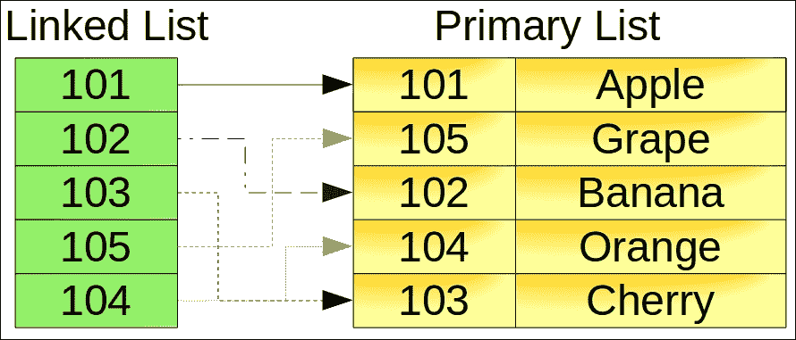

## 怎么做。。。

1.  链表的主要用途之一是以不同的顺序显示项目。一种方法是创建键值对的迭代，其中键表示新的顺序，该值包含主列表中键的值。这样的函数可能如下所示：

    ```php
    function buildLinkedList(array $primary,
                             callable $makeLink)
    {
      $linked = new ArrayIterator();
      foreach ($primary as $key => $row) {
        $linked->offsetSet($makeLink($row), $key);
      }
      $linked->ksort();
      return $linked;
    }
    ```

2.  我们使用匿名函数来生成新密钥，以提供额外的灵活性。您还将注意到，我们按键进行排序（`ksort()`，以便链表按键顺序迭代。
3.  使用链表所需要做的就是遍历链表，但从主列表中生成结果，在本例中为`$customer`：

    ```php
    foreach ($linked as $key => $link) {
      $output .= printRow($customer[$link]);
    }
    ```

4.  请注意，我们绝不会触及主列表。这允许我们生成多个链表，每个链表表示不同的顺序，同时保留原始数据集。
5.  链表的另一个重要用途是用于过滤。该技术与前面显示的类似。唯一的区别是我们扩展了`buildLinkedList()`函数，增加了一个过滤列和过滤值：

    ```php
    function buildLinkedList(array $primary,
                             callable $makeLink,
                             $filterCol = NULL,
                             $filterVal = NULL)
    {
      $linked = new ArrayIterator();
      $filterVal = trim($filterVal);
      foreach ($primary as $key => $row) {
        if ($filterCol) {
          if (trim($row[$filterCol]) == $filterVal) {
            $linked->offsetSet($makeLink($row), $key);
          }
        } else {
          $linked->offsetSet($makeLink($row), $key);
        }
      }
      $linked->ksort();
      return $linked;
    }
    ```

6.  我们只在链表中包含项，其中主列表中的`$filterCol`表示的值与`$filterVal`匹配。迭代逻辑与步骤 2 中所示的相同。
7.  Finally, another form of linked list is the *doubly* linked list. In this case, the list is constructed in such a manner that the iteration can occur in either a forward or reverse direction. In the case of PHP, we are fortunate to have an SPL class, `SplDoublyLinkedList`, which neatly does the trick. Here is a function that builds a doubly linked list:

    ```php
    function buildDoublyLinkedList(ArrayIterator $linked)
    {
      $double = new SplDoublyLinkedList();
      foreach ($linked as $key => $value) {
        $double->push($value);
      }
      return $double;
    }
    ```

    ### 注

    `SplDoublyLinkedList`的术语可能具有误导性。`SplDoublyLinkedList::top()` 实际上指向列表的*结尾*，而`SplDoublyLinkedList::bottom()`指向*开头*！

## 它是如何工作的。。。

将第一个项目符号中显示的代码复制到文件`chap_10_linked_list_include.php`中。为了演示链表的使用，您需要一个数据源。对于这个示例，您可以使用前面的配方中提到的`customer.csv`文件。它是一个 CSV 文件，包含以下列：

```php
"id","name","balance","email","password","status","security_question",
"confirm_code","profile_id","level"
```

您可以将以下函数添加到前面提到的 include 文件中，以生成客户的主要列表，并显示有关客户的信息。请注意，我们使用第一列 id 作为主键：

```php
function readCsv($fn, &$headers)
{
  if (!file_exists($fn)) {
    throw new Error('File Not Found');
  }
  $fileObj = new SplFileObject($fn, 'r');
  $result = array();
  $headers = array();
  $firstRow = TRUE;
  while ($row = $fileObj->fgetcsv()) {
    // store 1st row as headers
    if ($firstRow) {
      $firstRow = FALSE;
      $headers = $row;
    } else {
      if ($row && $row[0] !== NULL && $row[0] !== 0) {
        $result[$row[0]] = $row;
      }
    }
  }
  return $result;
}

function printHeaders($headers)
{
  return sprintf('%4s : %18s : %8s : %32s : %4s' . PHP_EOL,
                 ucfirst($headers[0]),
                 ucfirst($headers[1]),
                 ucfirst($headers[2]),
                 ucfirst($headers[3]),
                 ucfirst($headers[9]));
}

function printRow($row)
{
  return sprintf('%4d : %18s : %8.2f : %32s : %4s' . PHP_EOL,
                 $row[0], $row[1], $row[2], $row[3], $row[9]);
}

function printCustomer($headers, $linked, $customer)
{
  $output = '';
  $output .= printHeaders($headers);
  foreach ($linked as $key => $link) {
    $output .= printRow($customer[$link]);
  }
  return $output;
}
```

然后可以定义调用程序`chap_10_linked_list_in_order.php`，其中包含前面定义的文件，并读取`customer.csv`：

```php
<?php
define('CUSTOMER_FILE', __DIR__ . '/../data/files/customer.csv');
include __DIR__ . '/chap_10_linked_list_include.php';
$headers = array();
$customer = readCsv(CUSTOMER_FILE, $headers);
```

然后可以定义一个匿名函数，该函数将在链表中生成一个键。在本图中，定义一个函数，将第 1 列（名称）分解为名字和姓氏：

```php
$makeLink = function ($row) {
  list($first, $last) = explode(' ', $row[1]);
  return trim($last) . trim($first);
};
```

然后可以调用函数建立链表，并使用`printCustomer()`显示结果：

```php
$linked = buildLinkedList($customer, $makeLink);
echo printCustomer($headers, $linked, $customer);
```

以下是输出的显示方式：

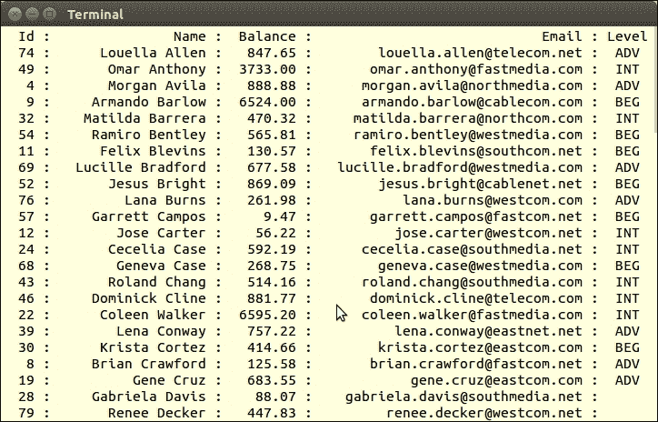

要生成过滤结果，请修改`buildLinkedList()`，如步骤 4 所述。然后，可以添加逻辑来检查筛选器列的值是否与筛选器中的值匹配：

```php
define('LEVEL_FILTER', 'INT');

$filterCol = 9;
$filterVal = LEVEL_FILTER;
$linked = buildLinkedList($customer, $makeLink, $filterCol, $filterVal);
```

## 还有更多。。。

PHP 7.1 引入了使用`[ ]`作为`list()`的替代方案。如果查看前面提到的匿名函数，可以在 PHP 7.1 中重写此函数，如下所示：

```php
$makeLink = function ($row) {
  [$first, $last] = explode(' ', $row[1]);
  return trim($last) . trim($first);
};
```

更多信息，请参见[https://wiki.php.net/rfc/short_list_syntax](https://wiki.php.net/rfc/short_list_syntax) 。

# 建立一个泡沫排序

经典的**气泡排序**是一项经常分配给大学生的练习。尽管如此，掌握这种算法很重要，因为在很多情况下内置的 PHP 排序函数并不适用。例如，对排序键不是第一列的多维数组进行排序。

冒泡排序的工作方式是递归地遍历列表，并将当前值与下一个值交换。如果希望项目按升序排列，则如果下一个项目小于当前项目，则会进行交换。对于降序，如果相反，则交换发生。当不再发生互换时，排序结束。

在下图中，在第一次通过后，**葡萄**和**香蕉**被交换，以及**橙色**和**樱桃**被交换。第二关后，**葡萄**与**樱桃**互换。最后一次传递时不再发生交换，气泡排序结束：

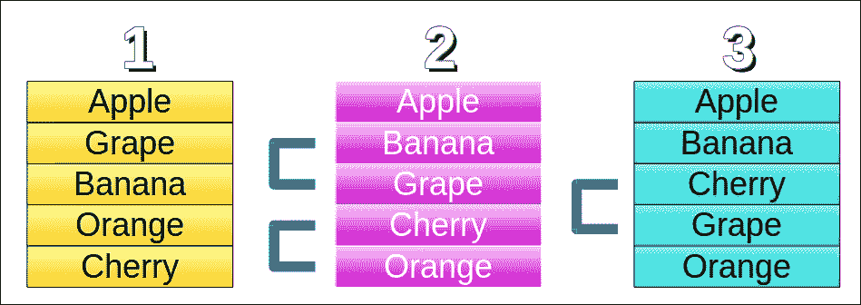

## 怎么做。。。

1.  我们不想实际地在数组中*移动*值；就资源使用而言，这将非常昂贵。相反，我们将使用前面配方中讨论的**链表**。
2.  首先，我们使用前面配方中讨论的`buildLinkedList()`函数构建一个链表。
3.  然后我们定义一个新函数`bubbleSort()`，它通过引用接受链表、主列表、排序字段和表示排序顺序（升序或降序）的参数：

    ```php
    function bubbleSort(&$linked, $primary, $sortField, $order = 'A')
    {
    ```

4.  需要的变量包括一个表示迭代次数、交换次数的变量，以及一个基于链表的迭代器：

    ```php
      static $iterations = 0;
      $swaps = 0;
      $iterator = new ArrayIterator($linked);
    ```

5.  在`while()`循环中，我们只在迭代仍然`valid`的情况下进行，也就是说，仍然在进行中。然后获得当前键和值，以及下一个键和值。注意额外的`if()`语句以确保迭代仍然有效（也就是说，确保我们不会从列表末尾掉下来！）：

    ```php
    while ($iterator->valid()) {
      $currentLink = $iterator->current();
      $currentKey  = $iterator->key();
      if (!$iterator->valid()) break;
      $iterator->next();
      $nextLink = $iterator->current();
      $nextKey  = $iterator->key();
    ```

6.  接下来，我们检查排序是升序还是降序。根据方向，我们检查下一个值是否大于或小于当前值。比较结果存储在`$expr`：

    ```php
    if ($order == 'A') {
        $expr = $primary[$linked->offsetGet
                ($currentKey)][$sortField] > 
                $primary[$linked->offsetGet($nextKey)][$sortField];
    } else {
        $expr = $primary[$linked->offsetGet
                ($currentKey)][$sortField] < 
                $primary[$linked->offsetGet($nextKey)][$sortField];
    }
    ```

    中
7.  如果`$expr`的值为`TRUE`，并且我们有有效的当前键和下一个键，则在链表中交换这些值。我们还增加了`$swaps`：

    ```php
    if ($expr && $currentKey && $nextKey 
        && $linked->offsetExists($currentKey) 
        && $linked->offsetExists($nextKey)) {
        $tmp = $linked->offsetGet($currentKey);
        $linked->offsetSet($currentKey, 
        $linked->offsetGet($nextKey));
        $linked->offsetSet($nextKey, $tmp);
        $swaps++;
      }
    }
    ```

8.  最后，如果发生了任何交换，我们需要再次运行迭代，直到没有更多的交换。因此，我们对相同的方法进行递归调用：

    ```php
    if ($swaps) bubbleSort($linked, $primary, $sortField, $order);
    ```

9.  *实*返回值是重新组织的链表。我们还返回迭代次数仅供参考：

    ```php
      return ++$iterations;
    }
    ```

## 它是如何工作的。。。

将前面讨论的`bubbleSort()`函数添加到前面配方中创建的包含文件中。您可以使用前面配方中讨论的相同逻辑来读取`customer.csv`文件，生成一个主要列表：

```php
<?php
define('CUSTOMER_FILE', __DIR__ . '/../data/files/customer.csv');
include __DIR__ . '/chap_10_linked_list_include.php';
$headers = array();
$customer = readCsv(CUSTOMER_FILE, $headers);
```

然后，您可以使用第一列作为排序键生成链接列表：

```php
$makeLink = function ($row) {
  return $row[0];
};
$linked = buildLinkedList($customer, $makeLink);
```

最后，调用`bubbleSort()`函数，提供链表和客户列表作为参数。您还可以在本图第 2 列中提供一个表示账户余额的排序列，使用字母`'A'`表示升序。`printCustomer()`功能可用于显示输出：

```php
echo 'Iterations: ' . bubbleSort($linked, $customer, 2, 'A') . PHP_EOL;
echo printCustomer($headers, $linked, $customer);
```

以下是一个输出示例：

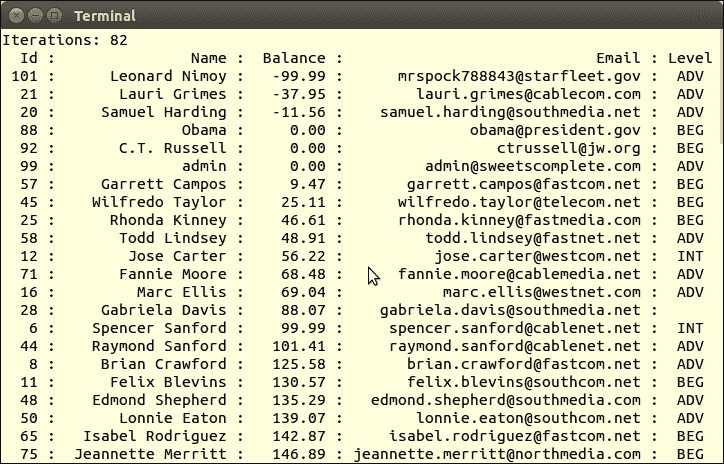

# 实现堆栈

**堆栈**是一种简单的算法，通常以**后进先出**（**后进先出**的形式实现。想象一下图书馆桌子上的一堆书。当图书管理员去把书放回原处时，首先处理最上面的本书，依次类推，直到书堆底部的本书被替换。最上面的书是最后一本放在书堆上的书，因此是后进先出的。

在编程术语中，堆栈用于临时存储信息。检索顺序有助于首先检索最近的项目。

## 怎么做。。。

1.  首先我们定义一个类，`Application\Generic\Stack`。核心逻辑封装在一个 SPL 类中，`SplStack`：

    ```php
    namespace Application\Generic;
    use SplStack;
    class Stack
    {
      // code
    }
    ```

2.  接下来我们定义一个属性来表示堆栈，并设置一个`SplStack`实例：

    ```php
    protected $stack;
    public function __construct()
    {
      $this->stack = new SplStack();
    }
    ```

3.  然后我们定义了从堆栈中添加和删除的方法，经典的`push()`和`pop()`方法：

    ```php
    public function push($message)
    {
      $this->stack->push($message);
    }
    public function pop()
    {
      return $this->stack->pop();
    }
    ```

4.  我们还引入了一个返回`stack`属性实例的`__invoke()`实现。这允许我们在直接函数调用中使用对象：

    ```php
    public function __invoke()
    {
      return $this->stack;
    }
    ```

## 它是如何工作的。。。

堆栈的一个可能用途是存储消息。对于消息，通常希望首先检索最新的消息，因此它是堆栈的完美用例。定义本配方中讨论的`Application\Generic\Stack`类。接下来，定义一个调用程序，该程序设置自动加载并创建一个`stack`实例：

```php
<?php
// setup class autoloading
require __DIR__ . '/../Application/Autoload/Loader.php';
Application\Autoload\Loader::init(__DIR__ . '/..');
use Application\Generic\Stack;
$stack = new Stack();
```

要处理堆栈，请存储一系列消息。由于您最有可能在应用程序中的不同点存储消息，因此您可以使用`sleep()`模拟其他正在运行的代码：

```php
echo 'Do Something ... ' . PHP_EOL;
$stack->push('1st Message: ' . date('H:i:s'));
sleep(3);

echo 'Do Something Else ... ' . PHP_EOL;
$stack->push('2nd Message: ' . date('H:i:s'));
sleep(3);

echo 'Do Something Else Again ... ' . PHP_EOL;
$stack->push('3rd Message: ' . date('H:i:s'));
sleep(3);
```

最后，只需遍历堆栈即可检索消息。注意，您可以像调用函数一样调用 stack 对象，它返回`SplStack`实例：

```php
echo 'What Time Is It?' . PHP_EOL;
foreach ($stack() as $item) {
  echo $item . PHP_EOL;
}
```

以下是预期输出：

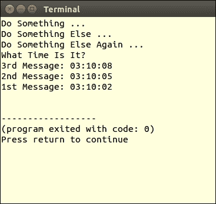

# 构建二进制搜索类

传统的搜索通常以顺序方式在项目列表中进行。这意味着要搜索的项目的最大可能数量可能与列表的长度相同！这不是很有效。如果需要加快搜索，请考虑实现一个 Type T1 二进制搜索。

该技术非常简单：在列表中找到中点，并确定搜索项是否小于、等于或大于中点项。如果小于，则将上限设置为中点，并仅搜索列表的前半部分。如果较大，则将下限设置为中点，并仅搜索列表的后半部分。然后继续将列表划分为 1/4、1/8、1/16 等，直到找到（或不找到）搜索项。

### 注

需要注意的是，尽管最大比较次数远小于顺序搜索（*log n+1*，其中*n*是列表中的元素数，*log*是二进制对数），但必须首先对搜索中涉及的列表进行排序，这当然会降低性能。

## 怎么做。。。

1.  我们首先构造一个搜索类`Application\Generic\Search`，它接受主列表作为参数。作为控件，我们还定义了一个属性，`$iterations`：

    ```php
    namespace Application\Generic;
    class Search
    {
      protected $primary;
      protected $iterations;
      public function __construct($primary)
      {
        $this->primary = $primary;
      }
    ```

2.  接下来，我们定义了一个方法`binarySearch()`，用于建立搜索基础设施。第一步是构建一个单独的数组`$search`，其中的键是搜索中包含的列的组合。然后按键排序：

    ```php
    public function binarySearch(array $keys, $item)
    {
      $search = array();
      foreach ($this->primary as $primaryKey => $data) {
        $searchKey = function ($keys, $data) {
          $key = '';
          foreach ($keys as $k) $key .= $data[$k];
    ```

    ```php
          return $key;
        };
        $search[$searchKey($keys, $data)] = $primaryKey;
      }
      ksort($search);
    ```

3.  然后我们将这些键拉入另一个数组`$binary`，这样我们就可以基于数字键执行二进制排序。然后我们调用`doBinarySearch()`，这将导致来自中间数组`$search`的密钥，或布尔值`FALSE`：

    ```php
      $binary = array_keys($search);
      $result = $this->doBinarySearch($binary, $item);
      return $this->primary[$search[$result]] ?? FALSE;
    }
    ```

4.  第一个`doBinarySearch()`初始化一系列参数。`$iterations`、`$found`、`$loop`、`$done`、`$max`都是用来防止无休止的循环。`$upper`和`$lower`表示要检查的列表切片：

    ```php
    public function doBinarySearch($binary, $item)
    {
      $iterations = 0;
      $found = FALSE;
      $loop  = TRUE;
      $done  = -1;
      $max   = count($binary);
      $lower = 0;
      $upper = $max - 1;
    ```

5.  然后我们实现一个`while()`循环并设置中点：

    ```php
      while ($loop && !$found) {
        $mid = (int) (($upper - $lower) / 2) + $lower;
    ```

6.  我们现在开始使用新的 PHP7**宇宙飞船操作符**，它在一个比较中给出小于、等于或大于。如果小于，则将上限设置为中点。如果较大，则将下限调整到中点。如果平等，我们就完蛋了，没有家了：

    ```php
    switch ($item <=> $binary[$mid]) {
      // $item < $binary[$mid]
      case -1 :
      $upper = $mid;
      break;
      // $item == $binary[$mid]
      case 0 :
      $found = $binary[$mid];
      break;
      // $item > $binary[$mid]
      case 1 :
      default :
      $lower = $mid;
    }
    ```

7.  现在来了解一下循环控制。我们增加迭代次数，确保它不超过列表的大小。如果是这样，肯定是出了问题，我们需要纾困。否则，我们将检查一行中的上限和下限是否相同两次以上，在这种情况下，搜索项尚未找到。然后我们存储迭代次数，并返回找到的（或没有找到的）：

    ```php
        $loop = (($iterations++ < $max) && ($done < 1));
        $done += ($upper == $lower) ? 1 : 0;
      }
      $this->iterations = $iterations;
      return $found;
    }
    ```

## 它是如何工作的。。。

首先，实现定义此配方中描述的方法的`Application\Generic\Search`类。接下来，定义一个调用程序`chap_10_binary_search.php`，它设置自动加载并读取`customer.csv`文件作为搜索目标（如前一个配方中所述）：

```php
<?php
define('CUSTOMER_FILE', __DIR__ . '/../data/files/customer.csv');
include __DIR__ . '/chap_10_linked_list_include.php';
require __DIR__ . '/../Application/Autoload/Loader.php';
Application\Autoload\Loader::init(__DIR__ . '/..');
use Application\Generic\Search;
$headers = array();
$customer = readCsv(CUSTOMER_FILE, $headers);
```

然后，您可以创建一个新的 AutoT0l 实例，并在列表中间的某个地方指定一个项目。在本图中，搜索基于第 1 列“客户名称”，项目为`Todd Lindsey`：

```php
$search = new Search($customer);
$item = 'Todd Lindsey';
$cols = [1];
echo "Searching For: $item\n";
var_dump($search->binarySearch($cols, $item));
```

如需说明，请在`Application\Generic\Search::doBinarySearch()`中`switch()`之前添加此行：

```php
echo 'Upper:Mid:Lower:<=> | ' . $upper . ':' . $mid . ':' . $lower . ':' . ($item <=> $binary[$mid]);
```

这里显示了输出。注意上、中、下限如何调整，直到找到该项：

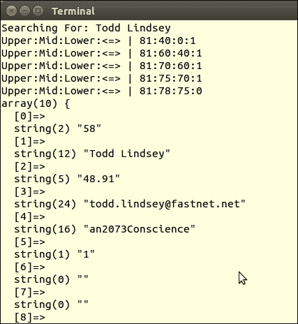

## 另见

关于二进制搜索的更多信息，在维基百科上有一篇优秀的文章，在[上介绍了基本的数学知识 https://en.wikipedia.org/wiki/Binary_search_algorithm](https://en.wikipedia.org/wiki/Binary_search_algorithm) 。

# 实现搜索引擎

为了实现搜索引擎，我们需要在搜索中包含多个列。此外，重要的是要认识到，搜索项目可能会发现在中间的领域，很少用户将提供足够的信息进行精确匹配。因此，我们将严重依赖 SQL`LIKE %value%`子句。

## 怎么做。。。

1.  首先，我们定义一个基本类来保存搜索条件。该对象包含三个属性：键，它最终表示一个数据库列；操作员（`LIKE`、`<`、`>`等）；和可选的项目。项目可选的原因是一些操作员，如`IS NOT NULL`不需要特定数据：

    ```php
    namespace Application\Database\Search;
    class Criteria
    {
      public $key;
      public $item;
      public $operator;
      public function __construct($key, $operator, $item = NULL)
      {
        $this->key  = $key;
        $this->operator = $operator;
        $this->item = $item;
      }
    }
    ```

2.  接下来我们需要定义一个类`Application\Database\Search\Engine`，并提供必要的类常量和属性。`$columns`和`$mapping`之间的区别在于`$columns`保存的信息最终将出现在 HTML`SELECT`字段（或等效字段）中。出于安全原因，我们不想公开数据库列的实际名称，因此需要另一个数组`$mapping`：

    ```php
    namespace Application\Database\Search;
    use PDO;
    use Application\Database\Connection;
    class Engine
    {
      const ERROR_PREPARE = 'ERROR: unable to prepare statement';
      const ERROR_EXECUTE = 'ERROR: unable to execute statement';
      const ERROR_COLUMN  = 'ERROR: column name not on list';
      const ERROR_OPERATOR= 'ERROR: operator not on list';
      const ERROR_INVALID = 'ERROR: invalid search criteria';

      protected $connection;
      protected $table;
      protected $columns;
      protected $mapping;
      protected $statement;
      protected $sql = '';
    ```

3.  接下来，我们定义一组我们愿意支持的操作符。键表示实际的 SQL。值将以以下形式出现：

    ```php
      protected $operators = [
          'LIKE'     => 'Equals',
          '<'        => 'Less Than',
          '>'        => 'Greater Than',
          '<>'       => 'Not Equals',
          'NOT NULL' => 'Exists',
      ];
    ```

4.  构造函数接受数据库连接实例作为参数。出于我们的目的，我们将使用[第 5 章](05.html "Chapter 5. Interacting with a Database")中定义的`Application\Database\Connection`，*与数据库*交互。我们还需要提供数据库表的名称，以及`$columns`，一个任意列键和标签的数组，它们将以 HTML 形式出现。这将引用`$mapping`，其中键与`$columns`匹配，但其中值表示实际的数据库列名：

    ```php
    public function __construct(Connection $connection, 
                                $table, array $columns, array $mapping)
    {
      $this->connection  = $connection;
      $this->setTable($table);
      $this->setColumns($columns);
      $this->setMapping($mapping);
    }
    ```

5.  在构造函数之后，我们提供了一系列有用的 getter 和 setter:

    ```php
    public function setColumns($columns)
    {
      $this->columns = $columns;
    }
    public function getColumns()
    {
      return $this->columns;
    }
    // etc.
    ```

6.  可能最关键的方法是构建要准备的 SQL 语句的方法。在初始的`SELECT`设置之后，我们添加了一个`WHERE`子句，使用`$mapping`添加实际的数据库列名。然后，我们添加操作符并实现`switch()`，它可以基于操作符添加或不添加表示搜索项的命名占位符：

    ```php
    public function prepareStatement(Criteria $criteria)
    {
      $this->sql = 'SELECT * FROM ' . $this->table . ' WHERE ';
      $this->sql .= $this->mapping[$criteria->key] . ' ';
      switch ($criteria->operator) {
        case 'NOT NULL' :
          $this->sql .= ' IS NOT NULL OR ';
          break;
        default :
          $this->sql .= $criteria->operator . ' :' 
          . $this->mapping[$criteria->key] . ' OR ';
      }
    ```

7.  现在已经定义了核心`SELECT`，我们删除了任何尾随的`OR`关键字，并添加了一个子句，使结果按照搜索列进行排序。然后将该语句发送到要准备的数据库：

    ```php
      $this->sql = substr($this->sql, 0, -4)
        . ' ORDER BY ' . $this->mapping[$criteria->key];
      $statement = $this->connection->pdo->prepare($this->sql);
      return $statement;
    }
    ```

8.  我们现在准备好进入主要节目`search()`方法。我们接受`Application\Database\Search\Criteria`对象作为参数。这确保我们至少有一个项键和操作符。为了安全起见，我们添加了一个`if()`语句来检查这些属性：

    ```php
    public function search(Criteria $criteria)
    {
      if (empty($criteria->key) || empty($criteria->operator)) {
        yield ['error' => self::ERROR_INVALID];
        return FALSE;
      }
    ```

9.  然后我们使用`try`/`catch`调用`prepareStatement()`来捕获错误：

    ```php
    try {
        if (!$statement = $this->prepareStatement($criteria)) {
          yield ['error' => self::ERROR_PREPARE];
          return FALSE;
    }
    ```

10.  接下来，我们构建一个参数数组，该数组将提供给`execute()`。键表示在准备好的语句中用作占位符的数据库列名。请注意，我们使用的不是`=`，而是`LIKE %value% construct`：

    ```php
    $params = array();
    switch ($criteria->operator) {
      case 'NOT NULL' :
        // do nothing: already in statement
        break;
        case 'LIKE' :
        $params[$this->mapping[$criteria->key]] = 
        '%' . $criteria->item . '%';
        break;
        default :
        $params[$this->mapping[$criteria->key]] = 
        $criteria->item;
    }
    ```

11.  语句被执行，结果使用`yield` 关键字返回，有效地将此方法转化为生成器：

    ```php
        $statement->execute($params);
        while ($row = $statement->fetch(PDO::FETCH_ASSOC)) {
          yield $row;
        }
      } catch (Throwable $e) {
        error_log(__METHOD__ . ':' . $e->getMessage());
        throw new Exception(self::ERROR_EXECUTE);
      }
      return TRUE;
    }
    ```

## 它是如何工作的。。。

将本配方中讨论的代码放在文件`Criteria.php`和`Engine.php`的`Application\Database\Search`下。然后，您可以定义一个调用脚本`chap_10_search_engine.php`，用于设置自动加载。您可以利用[第 5 章](05.html "Chapter 5. Interacting with a Database")中讨论的 `Application\Database\Connection`类*与数据库*交互，以及[第 6 章](06.html "Chapter 6. Building Scalable Websites")中涉及的*构建可伸缩网站*中的表单元素类：

```php
<?php
define('DB_CONFIG_FILE', '/../config/db.config.php');
require __DIR__ . '/../Application/Autoload/Loader.php';
Application\Autoload\Loader::init(__DIR__ . '/..');

use Application\Database\Connection;
use Application\Database\Search\ { Engine, Criteria };
use Application\Form\Generic;
use Application\Form\Element\Select;
```

您现在可以定义表单中将显示哪些数据库列，以及匹配的映射文件：

```php
$dbCols = [
  'cname' => 'Customer Name',
  'cbal' => 'Account Balance',
  'cmail' => 'Email Address',
  'clevel' => 'Level'
];

$mapping = [
  'cname' => 'name',
  'cbal' => 'balance',
  'cmail' => 'email',
  'clevel' => 'level'
];
```

现在可以设置数据库连接并创建搜索引擎实例：

```php
$conn = new Connection(include __DIR__ . DB_CONFIG_FILE);
$engine = new Engine($conn, 'customer', $dbCols, $mapping);
```

为了显示适当的下拉`SELECT`元素，我们根据`Application\Form\*`类定义包装器和元素：

```php
$wrappers = [
  Generic::INPUT => ['type' => 'td', 'class' => 'content'],
  Generic::LABEL => ['type' => 'th', 'class' => 'label'],
  Generic::ERRORS => ['type' => 'td', 'class' => 'error']
];

// define elements
$fieldElement = new Select('field',
                Generic::TYPE_SELECT,
                'Field',
                $wrappers,
                ['id' => 'field']);
                $opsElement = new Select('ops',
                Generic::TYPE_SELECT,
                'Operators',
                $wrappers,
                ['id' => 'ops']);
                $itemElement = new Generic('item',
                Generic::TYPE_TEXT,
                'Searching For ...',
                $wrappers,
                ['id' => 'item','title' => 'If more than one item, separate with commas']);
                $submitElement = new Generic('submit',
                Generic::TYPE_SUBMIT,
                'Search',
                $wrappers,
                ['id' => 'submit','title' => 'Click to Search', 'value' => 'Search']);
```

然后我们获取输入参数（如果已定义），设置表单元素选项，创建搜索条件，并运行搜索：

```php
$key  = (isset($_GET['field'])) 
? strip_tags($_GET['field']) : NULL;
$op   = (isset($_GET['ops'])) ? $_GET['ops'] : NULL;
$item = (isset($_GET['item'])) ? strip_tags($_GET['item']) : NULL;
$fieldElement->setOptions($dbCols, $key);
$itemElement->setSingleAttribute('value', $item);
$opsElement->setOptions($engine->getOperators(), $op);
$criteria = new Criteria($key, $op, $item);
$results = $engine->search($criteria);
?>
```

显示逻辑主要用于呈现表单。在[第 6 章](06.html "Chapter 6. Building Scalable Websites")、*构建可扩展网站*中讨论了更全面的介绍，但我们在这里展示了核心逻辑：

```php
  <form name="search" method="get">
  <table class="display" cellspacing="0" width="100%">
    <tr><?= $fieldElement->render(); ?></tr>
    <tr><?= $opsElement->render(); ?></tr>
    <tr><?= $itemElement->render(); ?></tr>
    <tr><?= $submitElement->render(); ?></tr>
    <tr>
    <th class="label">Results</th>
      <td class="content" colspan=2>
      <span style="font-size: 10pt;font-family:monospace;">
      <table>
      <?php foreach ($results as $row) : ?>
        <tr>
          <td><?= $row['id'] ?></td>
          <td><?= $row['name'] ?></td>
          <td><?= $row['balance'] ?></td>
          <td><?= $row['email'] ?></td>
          <td><?= $row['level'] ?></td>
        </tr>
      <?php endforeach; ?>
      </table>
      </span>
      </td>
    </tr>
  </table>
  </form>
```

以下是来自浏览器的示例输出：

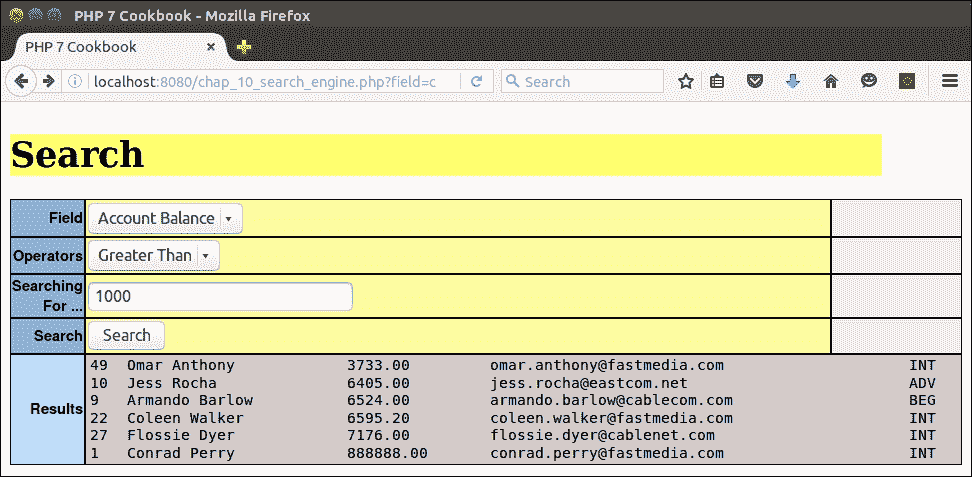

# 显示多维数组并累加总计

如何正确显示多维数组中的数据一直是任何 web 开发人员的经典问题。为了进行说明，假设您希望显示客户及其购买的列表。对于每个客户，您希望显示他们的姓名、电话号码、帐户余额等。这已经表示了一个二维数组，*x*轴表示客户，*y*轴表示该客户的数据。现在添加购买，您就有了第三个轴！如何在二维屏幕上表示三维模型？一个可能的解决方案是将“隐藏的”分区标记与简单的 JavaScript 可见性切换结合起来。

## 怎么做。。。

1.  首先，我们需要从使用大量`JOIN`子句的 SQL 语句生成一个 3D 数组。我们将使用在 Tyl T9 第 1 章中介绍的 AuthT1 类。为了支持分页，我们将两个参数`min`和`max`保留为打开状态。不幸的是，在这种情况下，我们不能使用简单的`LIMIT`和`OFFSET`，因为行数将根据任何给定客户的购买数量而变化。因此，我们可以通过对客户 ID 设置限制来限制行数，这可能（希望）是增量的。为了使其正常工作，我们还需要将主`ORDER`设置为客户 ID:

    ```php
    define('ITEMS_PER_PAGE', 6);
    define('SUBROWS_PER_PAGE', 6);
    define('DB_CONFIG_FILE', '/../config/db.config.php');
    include __DIR__ . '/../Application/Database/Connection.php';
    use Application\Database\Connection;
    $conn = new Connection(include __DIR__ . DB_CONFIG_FILE);
    $sql  = 'SELECT c.id,c.name,c.balance,c.email,f.phone, '
      . 'u.transaction,u.date,u.quantity,u.sale_price,r.title '
      . 'FROM customer AS c '
      . 'JOIN profile AS f '
      . 'ON f.id = c.id '
      . 'JOIN purchases AS u '
      . 'ON u.customer_id = c.id '
      . 'JOIN products AS r '
      . 'ON u.product_id = r.id '
      . 'WHERE c.id >= :min AND c.id < :max '
      . 'ORDER BY c.id ASC, u.date DESC ';
    ```

2.  接下来，我们可以基于对客户 ID 的限制，使用简单的`$_GET`参数实现一种分页形式。请注意，我们添加了一个额外的检查，以确保`$prev`的值不低于零。您可以考虑添加另一个控件，以确保 OLE T2 的值不超出最后的客户 ID。在这个说明中，我们只允许它增加：
3.  然后计算`$min`和`$max`的值，准备并执行 SQL 语句：

    ```php
    $min  = $prev * ITEMS_PER_PAGE;
    $max  = $page * ITEMS_PER_PAGE;
    $stmt = $conn->pdo->prepare($sql);
    $stmt->execute(['min' => $min, 'max' => $max]);
    ```

4.  可以使用`while()`循环获取结果。在本例中，我们使用一个简单的获取模式`PDO::FETCH_ASSOC`。使用客户 ID 作为密钥，我们将客户基本信息存储为数组参数。然后，我们将购买信息数组存储在子数组`$results[$key]['purchases'][]`中。当客户 ID 更改时，这是为下一个客户存储相同信息的信号。请注意，我们将每个客户的总计累积到一个数组键总计中：

    ```php
    $custId = 0;
    $result = array();
    $grandTotal = 0.0;
    while ($row = $stmt->fetch(PDO::FETCH_ASSOC)) {
      if ($row['id'] != $custId) {
        $custId = $row['id'];
        $result[$custId] = [
          'name'    => $row['name'],
          'balance' => $row['balance'],
          'email'   => $row['email'],
          'phone'   => $row['phone'],
        ];
        $result[$custId]['total'] = 0;
      }
      $result[$custId]['purchases'][] = [
        'transaction' => $row['transaction'],
        'date'        => $row['date'],
        'quantity'    => $row['quantity'],
        'sale_price'  => $row['sale_price'],
        'title'       => $row['title'],
      ];
      $result[$custId]['total'] += $row['sale_price'];
      $grandTotal += $row['sale_price'];
    }
    ?>
    ```

5.  接下来，我们实现视图逻辑。首先，我们从一个显示主要客户信息的块开始：

    ```php
    <div class="container">
    <?php foreach ($result as $key => $data) : ?>
    <div class="mainLeft color0">
        <?= $data['name'] ?> [<?= $key ?>]
    </div>
    <div class="mainRight">
      <div class="row">
        <div class="left">Balance</div>
               <div class="right"><?= $data['balance']; ?></div>
      </div>
      <div class="row">
        <div class="left color2">Email</div>
               <div class="right"><?= $data['email']; ?></div>
      </div>
      <div class="row">
        <div class="left">Phone</div>
               <div class="right"><?= $data['phone']; ?></div>
        </div>
      <div class="row">
            <div class="left color2">Total Purchases</div>
        <div class="right">
    <?= number_format($data['total'],2); ?>
    </div>
      </div>
    ```

6.  接下来是逻辑，为该客户显示购买清单：

    ```php
    <!-- Purchases Info -->
    <table>
      <tr>
      <th>Transaction</th><th>Date</th><th>Qty</th>
       <th>Price</th><th>Product</th>
      </tr>
      <?php $count  = 0; ?>
      <?php foreach ($data['purchases'] as $purchase) : ?>
      <?php $class = ($count++ & 01) ? 'color1' : 'color2'; ?>
      <tr>
      <td class="<?= $class ?>"><?= $purchase['transaction'] ?></td>
      <td class="<?= $class ?>"><?= $purchase['date'] ?></td>
      <td class="<?= $class ?>"><?= $purchase['quantity'] ?></td>
      <td class="<?= $class ?>"><?= $purchase['sale_price'] ?></td>
      <td class="<?= $class ?>"><?= $purchase['title'] ?></td>
      </tr>
      <?php endforeach; ?>
    </table>
    ```

7.  为了分页的目的，我们随后添加按钮来表示*上一个*和*下一个*：

    ```php
    <?php endforeach; ?>
    <div class="container">
      <a href="?page=<?= $prev ?>">
            <input type="button" value="Previous"></a>
      <a href="?page=<?= $next ?>">
            <input type="button" value="Next" class="buttonRight"></a>
    </div>
    <div class="clearRow"></div>
    </div>
    ```

8.  不幸的是，到目前为止的结果还远远不够整洁！因此，我们添加了一个简单的 JavaScript 函数，根据`id`属性

    ```php
    <script type="text/javascript">
    function showOrHide(id) {
      var div = document.getElementById(id);
      div.style.display = div.style.display == "none" ? "block" : "none";
    }
    </script>
    ```

    切换`<div>`标记的可见性
9.  接下来，我们将 purchases 表包装在一个最初不可见的`<div>`标记中。然后，我们可以设置初始可见子行的数量限制，并添加一个链接，*显示*剩余的购买数据：

    ```php
    <div class="row" id="<?= 'purchase' . $key ?>" style="display:none;">
      <table>
        <tr>
          <th>Transaction</th><th>Date</th><th>Qty</th>
                     <th>Price</th><th>Product</th>
        </tr>
      <?php $count  = 0; ?>
      <?php $first  = TRUE; ?>
      <?php foreach ($data['purchases'] as $purchase) : ?>
        <?php if ($count > SUBROWS_PER_PAGE && $first) : ?>
        <?php     $first = FALSE; ?>
        <?php     $subId = 'subrow' . $key; ?>
        </table>
        <a href="#" onClick="showOrHide('<?= $subId ?>')">More</a>
        <div id="<?= $subId ?>" style="display:none;">
        <table>
        <?php endif; ?>
      <?php $class = ($count++ & 01) ? 'color1' : 'color2'; ?>
      <tr>
      <td class="<?= $class ?>"><?= $purchase['transaction'] ?></td>
      <td class="<?= $class ?>"><?= $purchase['date'] ?></td>
      <td class="<?= $class ?>"><?= $purchase['quantity'] ?></td>
      <td class="<?= $class ?>"><?= $purchase['sale_price'] ?></td>
      <td class="<?= $class ?>"><?= $purchase['title'] ?></td>
      </tr>
      <?php endforeach; ?>
      </table>
      <?php if (!$first) : ?></div><?php endif; ?>
    </div>
    ```

10.  然后，我们添加一个按钮，单击该按钮时，会显示隐藏的`<div>`标记：

    ```php
    <input type="button" value="Purchases" class="buttonRight" 
        onClick="showOrHide('<?= 'purchase' . $key ?>')">
    ```

## 它是如何工作的。。。

将步骤 1 至 5 中描述的代码放入文件`chap_10_html_table_multi_array_hidden.php`。

在`while()`循环中，添加以下内容：

```php
printf('%6s : %20s : %8s : %20s' . PHP_EOL, 
    $row['id'], $row['name'], $row['transaction'], $row['title']);
```

在`while()`循环之后，添加一个`exit`命令。以下是输出：

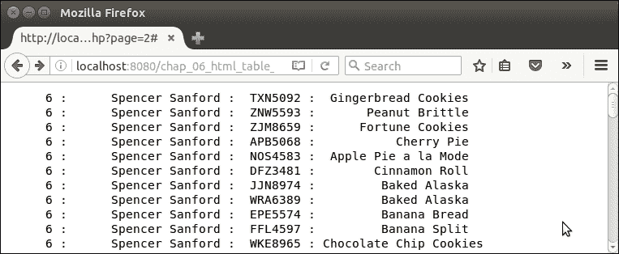

您会注意到，基本客户信息，例如 ID 和名称，在每个结果行中重复出现，但是购买信息，例如交易和产品名称，会有所不同。继续并删除`printf()`语句。

将`exit`命令替换为以下命令：

```php
echo '<pre>', var_dump($result), '</pre>'; exit;
```

以下是新合成的 3D 阵列的外观：

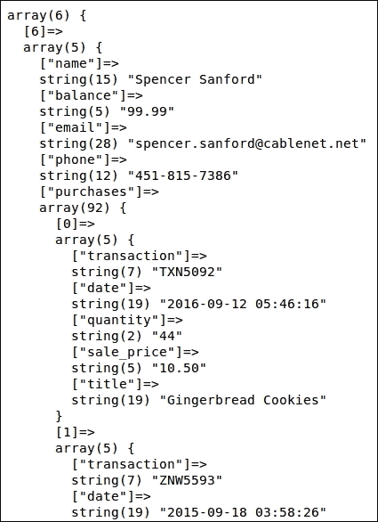

您现在可以添加步骤 5 至 7 中所示的显示逻辑。如所述，虽然您现在显示所有数据，但视觉显示没有帮助。现在，继续添加其余步骤中提到的改进。以下是初始输出的显示方式：

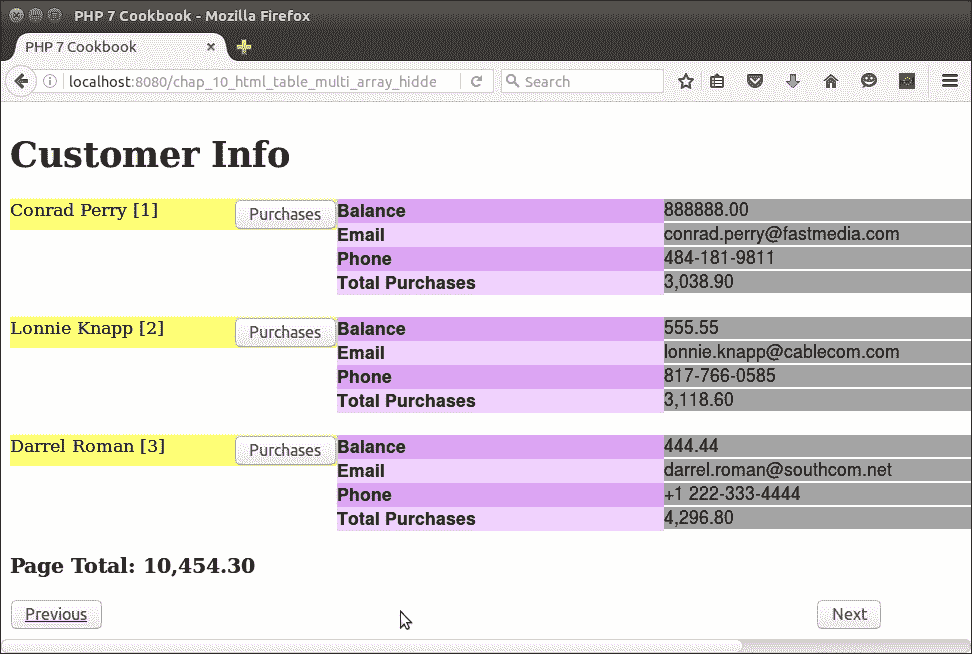

点击**采购**按钮时，出现初始采购信息。如果点击**更多**的链接，剩余的采购信息显示：

