# 第 12 章提高网络安全

在本章中，我们将介绍以下主题：

*   过滤`$_POST`数据
*   验证`$_POST`数据
*   保护 PHP 会话
*   使用令牌保护表单
*   构建安全的密码生成器
*   使用验证码保护表单
*   无`mcrypt`加密/解密

# 导言

在本章中，我们将向您展示如何建立一个简单而有效的机制来过滤和验证 post 数据块。然后，我们将介绍如何保护 PHP 会话免受潜在会话劫持和其他形式的攻击。下一个配方展示了如何使用随机生成的令牌保护表单免受**跨站点请求伪造**（**CSRF**攻击。密码生成的方法向您展示了如何结合 PHP7 真正的随机化来生成安全的密码。然后，我们向您展示两种**验证码**的形式：一种是基于文本的，另一种是使用扭曲的图像。最后，有一个配方可以覆盖强加密，而不使用不可信且很快会被弃用的`mcrypt`扩展。

# 过滤$u POST 数据

过滤数据的过程可以包括以下任何或全部：

*   删除不需要的字符（即删除`<script>`标记）
*   对数据进行转换（即将报价转换为`&quot;`）
*   加密或解密数据

加密在本章最后一个配方中介绍。否则，我们将提供一种基本机制，用于过滤表单提交后到达的`$_POST`数据。

## 怎么做。。。

1.  首先，您需要了解`$_POST`中将出现的数据。此外，也许更重要的是，您需要了解可能存储表单数据的数据库表所施加的限制。例如，请查看`prospects`表的数据库结构：

    ```php
    COLUMN          TYPE              NULL   DEFAULT
    first_name      varchar(128)      No     None     NULL
    last_name       varchar(128)      No     None     NULL
    address         varchar(256)      Yes    None     NULL
    city            varchar(64)       Yes    None     NULL
    state_province  varchar(32)       Yes    None     NULL
    postal_code     char(16)          No     None     NULL
    phone           varchar(16)       No     None     NULL
    country         char(2)           No     None     NULL
    email           varchar(250)      No     None     NULL
    status          char(8)           Yes    None     NULL
    budget          decimal(10,2)     Yes    None     NULL
    last_updated    datetime          Yes    None     NULL
    ```

2.  一旦您完成了对要发布和存储的数据的分析，您就可以确定要进行哪种类型的过滤，以及哪些 PHP 函数将用于此目的。
3.  例如，如果您需要去掉前导空格和尾随空格，这完全可以从用户提供的表单数据中实现，那么您可以使用 PHP`trim()`函数。根据数据库结构，所有字符数据都有长度限制。因此，您可能会考虑使用 AuthT1Ar 确保长度不超过。如果你想删除非字母字符，你可以考虑使用适当的模式。
4.  我们现在可以将所需的 PHP 函数集分组到一个回调数组中。下面是一个基于表单数据过滤需求的示例，表单数据最终将存储在`prospects`表中：

    ```php
    $filter = [
      'trim' => function ($item) { return trim($item); },
      'float' => function ($item) { return (float) $item; },
      'upper' => function ($item) { return strtoupper($item); },
      'email' => function ($item) { 
         return filter_var($item, FILTER_SANITIZE_EMAIL); },
      'alpha' => function ($item) { 
         return preg_replace('/[^A-Za-z]/', '', $item); },
      'alnum' => function ($item) { 
         return preg_replace('/[^0-9A-Za-z ]/', '', $item); },
      'length' => function ($item, $length) { 
         return substr($item, 0, $length); },
      'stripTags' => function ($item) { return strip_tags($item); },
    ];
    ```

5.  接下来，我们定义一个数组，该数组与`$_POST`中预期的字段名相匹配。在这个数组中，我们指定`$filter`数组中的键以及任何参数。注意第一个键`*`。我们将使用它作为通配符应用于所有字段：

    ```php
    $assignments = [
      '*'             => ['trim' => NULL, 'stripTags' => NULL],
      'first_name'    => ['length' => 32, 'alnum' => NULL],
      'last_name'     => ['length' => 32, 'alnum' => NULL],
      'address'       => ['length' => 64, 'alnum' => NULL],
      'city'          => ['length' => 32],
      'state_province'=> ['length' => 20],
      'postal_code'   => ['length' => 12, 'alnum' => NULL],
      'phone'         => ['length' => 12],
      'country'       => ['length' => 2, 'alpha' => NULL, 
                          'upper' => NULL],
      'email'         => ['length' => 128, 'email' => NULL],
      'budget'        => ['float' => NULL],
    ];
    ```

6.  We then loop through the data set (that is, coming from `$_POST`) and apply the callbacks in turn. We first run all callbacks assigned to the wildcard (`*`) key.

    ### 注

    实现通配符过滤器以避免冗余设置非常重要。在前面的示例中，我们希望为每个项应用表示 PHP 函数`strip_tags()`和`trim()`的过滤器。

7.  接下来，我们运行分配给特定数据字段的所有回调。完成后，`$data`中的所有值都将被过滤：

    ```php
    foreach ($data as $field => $item) {
      foreach ($assignments['*'] as $key => $option) {
        $item = $filter[$key]($item, $option);
      }
      foreach ($assignments[$field] as $key => $option) {
        $item = $filter[$key]($item, $option);
      }
    }
    ```

## 它是如何工作的。。。

将步骤 4 至 6 中显示的代码放入名为`chap_12_post_data_filtering_basic.php`的文件中。您还需要定义一个数组来模拟将出现在`$_POST`中的数据。在这种情况下，您可以定义两个数组，一个具有*良好*数据，另一个具有*不良*数据：

```php
$testData = [
  'goodData'   => [
    'first_name'    => 'Doug',
    'last_name'     => 'Bierer',
    'address'       => '123 Main Street',
    'city'          => 'San Francisco',
    'state_province'=> 'California',
    'postal_code'   => '94101',
    'phone'         => '+1 415-555-1212',
    'country'       => 'US',
    'email'         => 'doug@unlikelysource.com',
    'budget'        => '123.45',
  ],
  'badData' => [
    'first_name' => 'This+Name<script>bad tag</script>Valid!',
    'last_name' 	=> 'ThisLastNameIsWayTooLongAbcdefghijklmnopqrstuvwxyz0123456789Abcdefghijklmnopqrstuvwxyz0123456789Abcdefghijklmnopqrstuvwxyz0123456789Abcdefghijklmnopqrstuvwxyz0123456789',
    //'address' 	=> '',    // missing
    'city'      => 'ThisCityNameIsTooLong012345678901234567890123456789012345678901234567890123456789  ',
    //'state_province'=> '',    // missing
    'postal_code'     => '!"£$%^Non Alpha Chars',
    'phone'           => ' 12345 ',
    'country'         => '12345',
    'email'           => 'this.is@not@an.email',
    'budget'          => 'XXX',
  ]
];
```

最后，您需要循环筛选分配，显示好数据和坏数据：

```php
foreach ($testData as $data) {
  foreach ($data as $field => $item) {
    foreach ($assignments['*'] as $key => $option) {
      $item = $filter[$key]($item, $option);
    }
    foreach ($assignments[$field] as $key => $option) {
      $item = $filter[$key]($item, $option);
    }
    printf("%16s : %s\n", $field, $item);
  }
}
```

以下是本例中输出的显示方式：

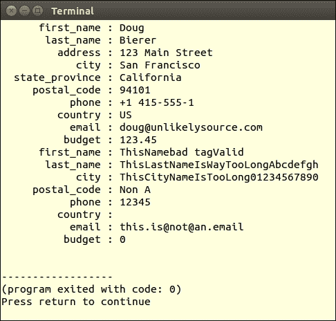

请注意，名称被截断，标记被删除。您还将注意到，尽管电子邮件地址已被筛选，但它仍然不是有效的地址。需要注意的是，为了正确处理数据，可能需要*验证*以及过滤。

## 另见

在[第 6 章](06.html "Chapter 6. Building Scalable Websites")*构建可扩展网站*中，题为*链接$\u POST filters*的配方讨论了如何将此处介绍的基本过滤概念整合到综合过滤链接机制中。

# 正在验证$\u POST 数据

过滤和验证的主要区别在于后者不会改变原始数据。另一个区别在于意图。验证的目的是确认数据符合根据客户需求制定的特定标准。

## 怎么做。。。

1.  我们将在这里介绍的基本验证机制与前面的配方中所示的相同。与过滤一样，了解待验证数据的性质、如何满足客户的要求以及是否符合数据库强制执行的标准至关重要。例如，如果在数据库中，列的最大宽度为 128，验证回调可以使用`strlen()`确认提交的数据长度小于或等于 128 个字符。同样，您可以使用`ctype_alnum()`确认数据仅包含字母和数字（视情况而定）。
2.  验证的另一个考虑事项是提供适当的验证失败消息。从某种意义上说，验证过程也是一个*确认*过程，可能会有人对验证进行审查，以确认成功或失败。如果验证失败，该人员需要知道原因。
3.  For this illustration, we will again focus on the `prospects` table. We can now group the set of desired PHP functions into a single array of callbacks. Here is an example based on the validation needs for the form data, which will eventually be stored in the `prospects` table:

    ```php
    $validator = [
      'email' => [
        'callback' => function ($item) { 
          return filter_var($item, FILTER_VALIDATE_EMAIL); },
        'message'  => 'Invalid email address'],
      'alpha' => [
        'callback' => function ($item) { 
          return ctype_alpha(str_replace(' ', '', $item)); },
        'message'  => 'Data contains non-alpha characters'],
      'alnum' => [
        'callback' => function ($item) { 
          return ctype_alnum(str_replace(' ', '', $item)); },
        'message'  => 'Data contains characters which are '
           . 'not letters or numbers'],
      'digits' => [
        'callback' => function ($item) { 
          return preg_match('/[^0-9.]/', $item); },
        'message'  => 'Data contains characters which '
          . 'are not numbers'],
      'length' => [
        'callback' => function ($item, $length) { 
          return strlen($item) <= $length; },
        'message'  => 'Item has too many characters'],
      'upper' => [
        'callback' => function ($item) { 
          return $item == strtoupper($item); },
        'message'  => 'Item is not upper case'],
      'phone' => [
        'callback' => function ($item) { 
          return preg_match('/[^0-9() -+]/', $item); },
        'message'  => 'Item is not a valid phone number'],
    ];
    ```

    ### 注

    注意，对于 alpha 和 alnum 回调，我们首先使用`str_replace()`删除空格，从而允许使用空格。然后我们可以调用`ctype_alpha()`或`ctype_alnum()`，这将确定是否存在任何不允许的字符。

4.  接下来，我们定义一个与`$_POST`中预期的字段名匹配的赋值数组。在这个数组中，我们在`$validator`数组中指定键，以及任何参数：

    ```php
    $assignments = [
      'first_name'    => ['length' => 32, 'alpha' => NULL],
      'last_name'     => ['length' => 32, 'alpha' => NULL],
      'address'       => ['length' => 64, 'alnum' => NULL],
      'city'          => ['length' => 32, 'alnum' => NULL],
      'state_province'=> ['length' => 20, 'alpha' => NULL],
      'postal_code'   => ['length' => 12, 'alnum' => NULL],
      'phone'         => ['length' => 12, 'phone' => NULL],
      'country'       => ['length' => 2, 'alpha' => NULL, 
                          'upper' => NULL],
      'email'         => ['length' => 128, 'email' => NULL],
      'budget'        => ['digits' => NULL],
    ];
    ```

5.  We then use nested `foreach()` loops to iterate through the block of data one field at a time. For each field, we loop through the callbacks assigned to that field:

    ```php
    foreach ($data as $field => $item) {
      echo 'Processing: ' . $field . PHP_EOL;
      foreach ($assignments[$field] as $key => $option) {
        if ($validator[$key]['callback']($item, $option)) {
            $message = 'OK';
        } else {
            $message = $validator[$key]['message'];
        }
        printf('%8s : %s' . PHP_EOL, $key, $message);
      }
    }
    ```

    ### 提示

    如图所示，您可以记录验证成功/失败，而不是直接回显输出，以便稍后提交给审阅者。此外，如[第 6 章](06.html "Chapter 6. Building Scalable Websites")*构建可扩展网站*所示，您可以将验证机制应用到表单中，在匹配的表单元素旁边显示验证消息。

## 它是如何工作的。。。

将步骤 3 至 5 中所示的代码放入名为`chap_12_post_data_validation_basic.php`的文件中。您还需要定义一个数据数组，该数组模拟将出现在`$_POST`中的数据。在本例中，您使用前面配方中提到的两个数组，一个具有*良好*数据，另一个具有*不良*数据。最终输出应如下所示：

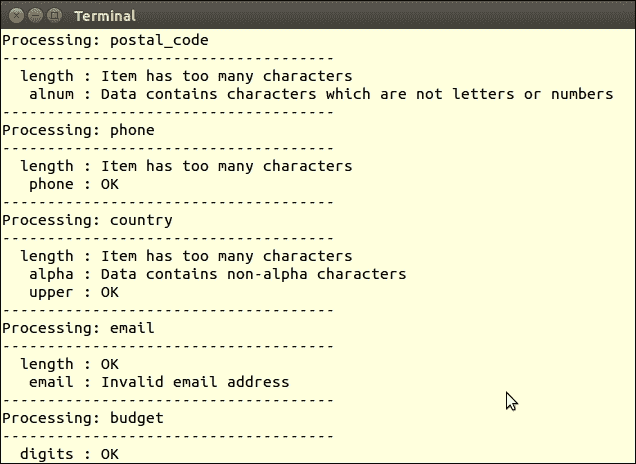

## 另见

*   在[第 6 章](06.html "Chapter 6. Building Scalable Websites")*构建可扩展网站*中，题为*链接$\u POST validators*的配方讨论了如何将此处介绍的基本验证概念整合到一个全面的过滤器链接机制中。

# 保护 PHP 会话

PHP 会话机制非常简单。一旦使用`session_start()`或`php.ini session.autostart`设置启动会话，PHP 引擎将生成一个唯一的令牌，默认情况下，该令牌通过 cookie 传递给用户。在后续请求中，当会话仍被视为活动时，用户的浏览器（或等效浏览器）会显示会话标识符（通常也是通过 cookie 的方式）以供检查。PHP 引擎然后使用该标识符在服务器上定位适当的文件，并用存储的信息填充`$_SESSION`。当会话标识符是识别返回网站访问者的唯一方法时，存在巨大的安全问题。在本食谱中，我们将介绍几种帮助您保护会话的技术，这些技术反过来将极大地提高网站的整体安全性。

## 怎么做。。。

1.  首先，认识到使用会话作为唯一的身份验证手段是多么危险，这一点很重要。想象一下，当一个有效用户登录到您的网站时，您在`$_SESSION`：

    ```php
    session_start();
    $loggedIn = $_SESSION['isLoggedIn'] ?? FALSE;
    if (isset($_POST['login'])) {
      if ($_POST['username'] == // username lookup
          && $_POST['password'] == // password lookup) {
          $loggedIn = TRUE;
          $_SESSION['isLoggedIn'] = TRUE;
      }
    }
    ```

    中设置了一个`loggedIn`标志
2.  在您的程序逻辑中，如果`$_SESSION['isLoggedIn']`设置为`TRUE`：

    ```php
    <br>Secret Info
    <br><?php if ($loggedIn) echo // secret information; ?>
    ```

    ，则允许用户查看敏感信息
3.  如果攻击者要获取会话标识符，例如，通过成功执行的**跨站点脚本**（**XSS**攻击），他/她需要做的就是将`PHPSESSID`cookie 的值设置为非法获取的值，现在，应用程序会将它们视为有效用户。
4.  缩短`PHPSESSID`有效时间窗口的一个简单快捷的方法是使用`session_regenerate_id()`。这个非常简单的命令生成一个新的会话标识符，使旧的会话标识符无效，保持会话数据完整，并且对性能的影响最小。此命令只能在会话启动后执行：

    ```php
    session_start();
    session_regenerate_id();
    ```

5.  另一个经常被忽视的技术是确保 web 访问者有一个注销选项。但是，重要的是，不仅要使用`session_destroy()`销毁会话，还要取消`$_SESSION`数据并使会话 cookie:

    ```php
    session_unset();
    session_destroy();
    setcookie('PHPSESSID', 0, time() - 3600);
    ```

    过期
6.  Another easy technique that can be used to prevent session hijacking is to develop a finger-print or thumb-print of the website visitor. One way to implement this technique is to collect information unique to the website visitor over and above the session identifier. Such information includes the user agent (that is, the browser), languages accepted, and remote IP address. You can derive a simple hash from this information, and store the hash on the server in a separate file. The next time the user visits the website, if you have determined they are logged in based on session information, you can then perform a secondary verification by matching finger-prints:

    ```php
    $remotePrint = md5($_SERVER['REMOTE_ADDR'] 
                       . $_SERVER['HTTP_USER_AGENT'] 
                       . $_SERVER['HTTP_ACCEPT_LANGUAGE']);
    $printsMatch = file_exists(THUMB_PRINT_DIR . $remotePrint);
    if ($loggedIn && !$printsMatch) {
        $info = 'SESSION INVALID!!!';
        error_log('Session Invalid: ' . date('Y-m-d H:i:s'), 0);
        // take appropriate action
    }
    ```

    ### 注

    我们使用`md5()`，因为它是一种快速散列算法，非常适合内部使用。*不建议*将`md5()`用于任何外部用途，因为它会受到暴力攻击。

## 它是如何工作的。。。

为了演示会话如何易受攻击，编写一个简单的登录脚本，在成功登录时设置一个`$_SESSION[``isLoggedIn``] flag`。您可以调用文件`chap_12_session_hijack.php`：

```php
session_start();
$loggedUser = $_SESSION['loggedUser'] ?? '';
$loggedIn = $_SESSION['isLoggedIn'] ?? FALSE;
$username = 'test';
$password = 'password';
$info = 'You Can Now See Super Secret Information!!!';

if (isset($_POST['login'])) {
  if ($_POST['username'] == $username
      && $_POST['password'] == $password) {
        $loggedIn = TRUE;
        $_SESSION['isLoggedIn'] = TRUE;
        $_SESSION['loggedUser'] = $username;
        $loggedUser = $username;
  }
} elseif (isset($_POST['logout'])) {
  session_destroy();
}
```

然后可以添加显示简单登录表单的代码。要测试会话漏洞，请使用我们刚刚创建的`chap_12_session_hijack.php`文件执行以下步骤：

1.  更改为包含该文件的目录。
2.  运行`php -S localhost:8080`命令。
3.  使用一个浏览器打开 URL`http://localhost:8080/<filename>`。
4.  以用户`test`身份登录，密码为`password`。
5.  你应该可以看到**你现在可以看到超级机密信息了！！！**。
6.  刷新页面：每次都会看到一个新的会话标识符。
7.  复制`PHPSESSID`cookie 的值。
8.  打开同一网页的另一个浏览器。
9.  通过复制`PHPSESSID`的值来修改浏览器发送的 cookie。

为了便于说明，我们还显示了`$_COOKIE`和`$_SESSION`的值，如使用 Vivaldi 浏览器的以下屏幕截图所示：

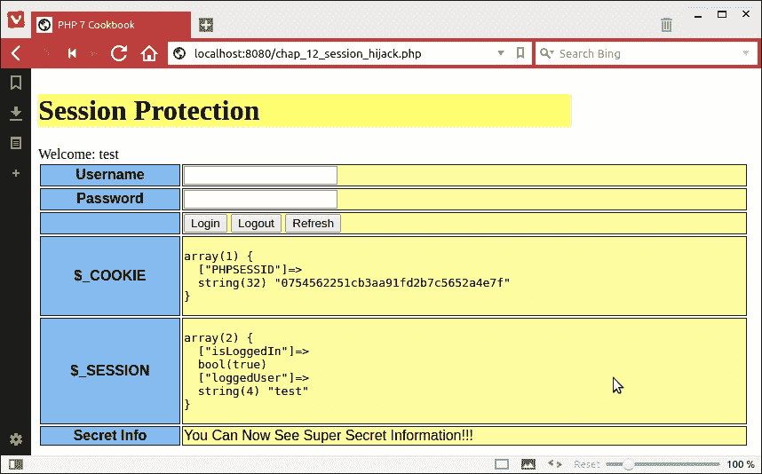

然后，我们复制`PHPSESSID`的值，打开 Firefox 浏览器，并使用名为 Tamper Data 的工具修改 cookie 的值：

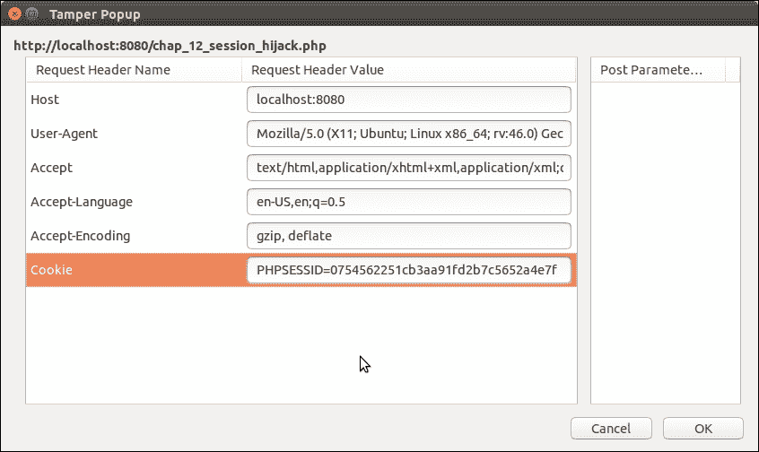

您可以在下一个屏幕截图中看到，我们现在是经过身份验证的用户，无需输入用户名或密码：

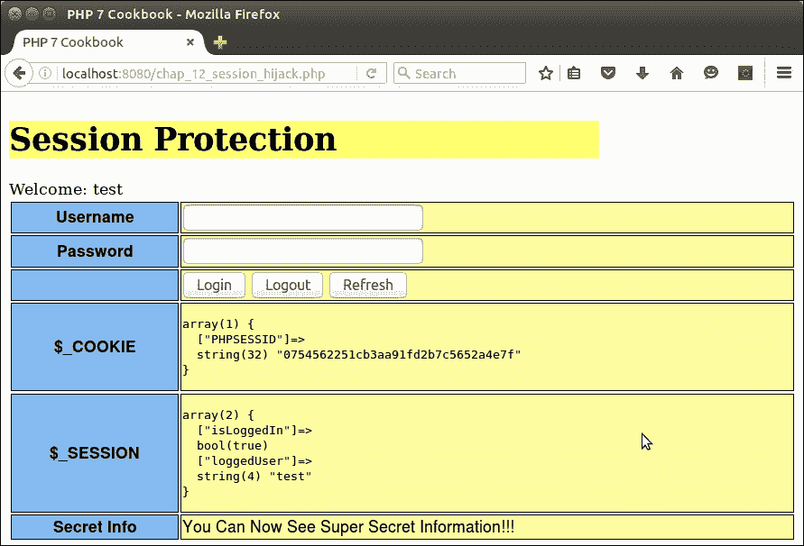

现在可以实现前面步骤中讨论的更改。将之前创建的文件复制到`chap_12_session_protected.php`。现在继续并重新生成会话 ID：

```php
<?php
define('THUMB_PRINT_DIR', __DIR__ . '/../data/');
session_start();
session_regenerate_id();
```

接下来，初始化变量并确定登录状态（如前所述）：

```php
$username = 'test';
$password = 'password';
$info = 'You Can Now See Super Secret Information!!!';
$loggedIn = $_SESSION['isLoggedIn'] ?? FALSE;
$loggedUser = $_SESSION['user'] ?? 'guest';
```

您可以使用远程地址、用户代理和语言设置添加会话指纹：

```php
$remotePrint = md5($_SERVER['REMOTE_ADDR']
  . $_SERVER['HTTP_USER_AGENT']
  . $_SERVER['HTTP_ACCEPT_LANGUAGE']);
$printsMatch = file_exists(THUMB_PRINT_DIR . $remotePrint);
```

如果登录成功，我们将在会话中存储指纹信息和登录状态：

```php
if (isset($_POST['login'])) {
  if ($_POST['username'] == $username
      && $_POST['password'] == $password) {
        $loggedIn = TRUE;
        $_SESSION['user'] = strip_tags($username);
        $_SESSION['isLoggedIn'] = TRUE;
        file_put_contents(
          THUMB_PRINT_DIR . $remotePrint, $remotePrint);
  }
```

您还可以检查注销选项并实现正确的注销过程：取消设置`$_SESSION`变量、使会话无效以及使 cookie 过期。您还可以删除指纹文件并实施重定向：

```php
} elseif (isset($_POST['logout'])) {
  session_unset();
  session_destroy();
  setcookie('PHPSESSID', 0, time() - 3600);
  if (file_exists(THUMB_PRINT_DIR . $remotePrint)) 
    unlink(THUMB_PRINT_DIR . $remotePrint);
    header('Location: ' . $_SERVER['REQUEST_URI'] );
  exit;
```

否则，如果操作不是登录或注销，则可以检查用户是否被视为已登录，如果指纹不匹配，则会话被视为无效，并采取相应的操作：

```php
} elseif ($loggedIn && !$printsMatch) {
    $info = 'SESSION INVALID!!!';
    error_log('Session Invalid: ' . date('Y-m-d H:i:s'), 0);
    // take appropriate action
}
```

您现在可以使用新的`chap_12_session_protected.php`文件运行与前面提到的相同的过程。您将注意到的第一件事是会话现在被认为是无效的。输出将如下所示：

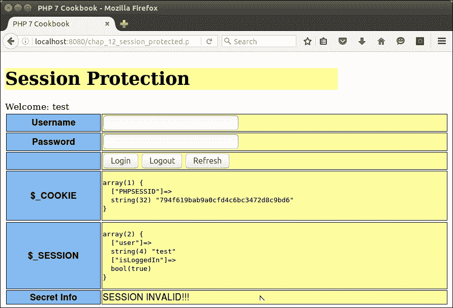

这是因为拇指指纹不匹配，因为您现在使用的是其他浏览器。同样，如果刷新第一个浏览器的页面，将重新生成会话标识符，从而使以前复制的任何标识符都过时。最后，注销按钮将完全清除会话信息。

## 另见

有关网站漏洞的出色概述，请参阅[上的文章 https://www.owasp.org/index.php/Category:Vulnerability](https://www.owasp.org/index.php/Category:Vulnerability) 。有关会话劫持的信息，请参阅[https://www.owasp.org/index.php/Session_hijacking_attack](https://www.owasp.org/index.php/Session_hijacking_attack) 。

# 使用令牌保护表单

此配方提供了另一种非常简单的技术，可以保护您的表单免受**跨站点请求伪造**（**CSRF**攻击。简单地说，当攻击者可能使用其他技术感染您网站上的网页时，CSRF 攻击是可能的。在大多数情况下，受感染的页面将使用有效登录用户的凭据开始发出请求（即，使用 JavaScript 购买项目或进行设置更改）。应用程序很难检测到此类活动。一个容易采取的措施是生成一个随机令牌，该令牌包含在要提交的每个表单中。由于受感染的页面将无法访问令牌，也无法生成匹配的令牌，因此表单验证将失败。

## 怎么做。。。

1.  首先，为了演示这个问题，我们创建了一个网页，它模拟一个受感染的网页，该网页生成一个向数据库发布条目的请求。对于这个示例，我们将调用文件`chap_12_form_csrf_test_unprotected.html`：

    ```php
    <!DOCTYPE html>
      <body onload="load()">
      <form action="/chap_12_form_unprotected.php" 
        method="post" id="csrf_test" name="csrf_test">
        <input name="name" type="hidden" value="No Goodnick" />
        <input name="email" type="hidden" value="malicious@owasp.org" />
        <input name="comments" type="hidden" 
           value="Form is vulnerable to CSRF attacks!" />
        <input name="process" type="hidden" value="1" />
      </form>
      <script>
        function load() { document.forms['csrf_test'].submit(); }
      </script>
    </body>
    </html>
    ```

2.  接下来，我们创建一个名为`chap_12_form_unprotected.php`的脚本，用于响应表单发布。与本书中的其他调用程序一样，我们设置了自动加载并使用[第 5 章](05.html "Chapter 5. Interacting with a Database")中的`Application\Database\Connection`类*与数据库*交互：

    ```php
    <?php
    define('DB_CONFIG_FILE', '/../config/db.config.php');
    require __DIR__ . '/../Application/Autoload/Loader.php';
    Application\Autoload\Loader::init(__DIR__ . '/..');
    use Application\Database\Connection;
    $conn = new Connection(include __DIR__ . DB_CONFIG_FILE);
    ```

3.  然后我们检查是否已按下处理按钮，甚至执行过滤机制，如本章*过滤$u POST data*配方中所述。这是为了证明 CSRF 攻击很容易绕过滤波器：

    ```php
    if ($_POST['process']) {
        $filter = [
          'trim' => function ($item) { return trim($item); },
          'email' => function ($item) { 
            return filter_var($item, FILTER_SANITIZE_EMAIL); },
          'length' => function ($item, $length) { 
            return substr($item, 0, $length); },
          'stripTags' => function ($item) { 
          return strip_tags($item); },
      ];

      $assignments = [
        '*'         => ['trim' => NULL, 'stripTags' => NULL],
        'email'   => ['length' => 249, 'email' => NULL],
        'name'    => ['length' => 128],
        'comments'=> ['length' => 249],
      ];

      $data = $_POST;
      foreach ($data as $field => $item) {
        foreach ($assignments['*'] as $key => $option) {
          $item = $filter[$key]($item, $option);
        }
        if (isset($assignments[$field])) {
          foreach ($assignments[$field] as $key => $option) {
            $item = $filter[$key]($item, $option);
          }
          $filteredData[$field] = $item;
        }
      }
    ```

4.  最后，我们使用准备好的语句将过滤后的数据插入数据库。然后我们重定向到另一个名为`chap_12_form_view_results.php`的脚本，它只是转储`visitors`表的内容：

    ```php
    try {
        $filteredData['visit_date'] = date('Y-m-d H:i:s');
        $sql = 'INSERT INTO visitors '
            . ' (email,name,comments,visit_date) '
            . 'VALUES (:email,:name,:comments,:visit_date)';
        $insertStmt = $conn->pdo->prepare($sql);
        $insertStmt->execute($filteredData);
    } catch (PDOException $e) {
        echo $e->getMessage();
    }
    }
    header('Location: /chap_12_form_view_results.php');
    exit;
    ```

5.  当然，其结果是允许攻击，尽管过滤和使用准备好的语句。
6.  Implementing the form protection token is actually quite easy! First of all, you need to generate the token and store it in the session. We take advantage of the new `random_bytes()` PHP 7 function to generate a truly random token, one which will be difficult, if not impossible, for an attacker to match:

    ```php
    session_start();
    $token = urlencode(base64_encode((random_bytes(32))));
    $_SESSION['token'] = $token;
    ```

    ### 注

    `random_bytes()`的输出为二进制。我们使用`base64_encode()`将其转换为可用字符串。然后，我们使用`urlencode()`进一步处理它，以便以 HTML 形式正确呈现它。

7.  当我们呈现表单时，我们将令牌呈现为一个隐藏字段：

    ```php
    <input type="hidden" name="token" value="<?= $token ?>" />
    ```

8.  然后，我们复制并修改前面提到的`chap_12_form_unprotected.php`脚本，在第一次检查中添加逻辑，以查看令牌是否与会话中存储的令牌匹配。请注意，我们取消设置当前令牌以使其在将来使用时无效。我们称新脚本为`chap_12_form_protected_with_token.php`：

    ```php
    if ($_POST['process']) {
        $sessToken = $_SESSION['token'] ?? 1;
        $postToken = $_POST['token'] ?? 2;
        unset($_SESSION['token']);
        if ($sessToken != $postToken) {
            $_SESSION['message'] = 'ERROR: token mismatch';
        } else {
            $_SESSION['message'] = 'SUCCESS: form processed';
            // continue with form processing
        }
    }
    ```

## 它是如何工作的。。。

要测试受感染的网页如何发起 CSRF 攻击，请创建以下文件，如配方前面所示：

*   `chap_12_form_csrf_test_unprotected.html`
*   `chap_12_form_unprotected.php`

然后可以定义一个名为`chap_12_form_view_results.php`的文件，该文件转储`visitors`表：

```php
<?php
session_start();
define('DB_CONFIG_FILE', '/../config/db.config.php');
require __DIR__ . '/../Application/Autoload/Loader.php';
Application\Autoload\Loader::init(__DIR__ . '/..');
use Application\Database\Connection;
$conn = new Connection(include __DIR__ . DB_CONFIG_FILE);
$message = $_SESSION['message'] ?? '';
unset($_SESSION['message']);
$stmt = $conn->pdo->query('SELECT * FROM visitors');
?>
<!DOCTYPE html>
<body>
<div class="container">
  <h1>CSRF Protection</h1>
  <h3>Visitors Table</h3>
  <?php while ($row = $stmt->fetch(PDO::FETCH_ASSOC)) : ?>
  <pre><?php echo implode(':', $row); ?></pre>
  <?php endwhile; ?>
  <?php if ($message) : ?>
  <b><?= $message; ?></b>
  <?php endif; ?>
</div>
</body>
</html>
```

从浏览器启动`chap_12_form_csrf_test_unprotected.html`。以下是输出可能的显示方式：


正如您所见，尽管进行了过滤并使用了准备好的语句，但攻击还是成功的！

接下来，将`chap_12_form_unprotected.php`文件复制到`chap_12_form_protected.php`。按照配方中步骤 8 所示进行更改。您还需要修改测试 HTML 文件，将`chap_12_form_csrf_test_unprotected.html`复制到`chap_12_form_csrf_test_protected.html`。将`FORM`标签中的动作参数值更改如下：

```php
<form action="/chap_12_form_protected_with_token.php" 
  method="post" id="csrf_test" name="csrf_test">
```

当您从浏览器运行新的 HTML 文件时，它会调用`chap_12_form_protected.php`，它会查找不存在的令牌。以下是预期输出：

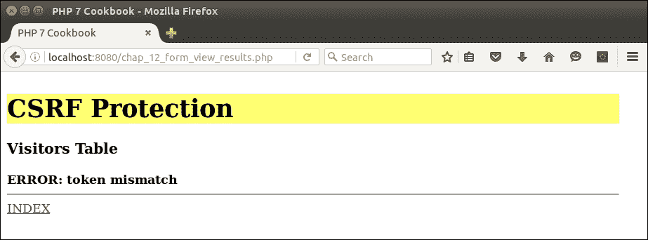

最后，继续并定义一个名为`chap_12_form_protected.php`的文件，该文件生成一个令牌并将其显示为隐藏元素：

```php
<?php
session_start();
$token = urlencode(base64_encode((random_bytes(32))));
$_SESSION['token'] = $token;
?>
<!DOCTYPE html>
<body onload="load()">
<div class="container">
<h1>CSRF Protected Form</h1>
<form action="/chap_12_form_protected_with_token.php" 
     method="post" id="csrf_test" name="csrf_test">
<table>
<tr><th>Name</th><td><input name="name" type="text" /></td></tr>
<tr><th>Email</th><td><input name="email" type="text" /></td></tr>
<tr><th>Comments</th><td>
<input name="comments" type="textarea" rows=4 cols=80 />
</td></tr>
<tr><th>&nbsp;</th><td>
<input name="process" type="submit" value="Process" />
</td></tr>
</table>
<input type="hidden" name="token" value="<?= $token ?>" />
</form>
<a href="/chap_12_form_view_results.php">
    CLICK HERE</a> to view results
</div>
</body>
</html>
```

当我们从表单中显示并提交数据时，令牌被验证，数据插入允许继续，如下所示：

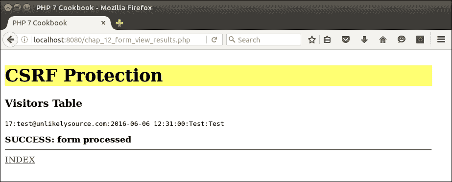

## 另见

有关 CSFR 攻击的更多信息，请参阅[https://www.owasp.org/index.php/Cross-Site_Request_Forgery_（CSRF）](https://www.owasp.org/index.php/Cross-Site_Request_Forgery_(CSRF))。

# 构建安全的密码生成器

一个常见的误解是，攻击者破解散列密码的唯一方法是使用**暴力攻击**和**彩虹表**。尽管这通常是攻击序列中的第一个过程，但攻击者会在第二、第三或第四个过程中使用更复杂的攻击。其他攻击包括*组合*、*字典*、*掩码*和基于规则的攻击。字典攻击使用字典中的单词数据库来猜测密码。组合是字典中的单词组合的地方。面具攻击类似于暴力，但更具选择性，从而缩短破解时间。基于规则的攻击将检测到诸如用数字 0 替换字母 o 之类的情况。

好消息是，通过简单地增加密码长度，使其超过六个字符的神奇长度，可以成倍地增加破解散列密码的时间。其他因素，如随机地将大写字母和小写字母穿插在一起、随机数字和特殊字符，也会对破解时间产生指数级影响。最后，我们需要记住，人类最终需要输入创建的密码，这意味着密码至少需要有一点点的记忆。

### 提示

**最佳实践**

密码应该以散列形式存储，而不能以纯文本形式存储。MD5 和 SHA*不再被认为是安全的（尽管 SHA*比 MD5 好得多）。使用诸如`oclHashcat`之类的实用程序，攻击者平均每秒可以对通过利用 MD5 散列的密码（即成功的 SQL 注入攻击）产生 550 亿次尝试。

## 怎么做。。。

1.  首先，我们定义一个`Application\Security\PassGen`类，该类将保存生成密码所需的方法。我们还定义了某些类常量和属性，它们将作为流程的一部分使用：

    ```php
    namespace Application\Security;
    class PassGen
    {
      const SOURCE_SUFFIX = 'src';
      const SPECIAL_CHARS = 
        '\`¬|!"£$%^&*()_-+={}[]:@~;\'#<>?,./|\\';
      protected $algorithm;
      protected $sourceList;
      protected $word;
      protected $list;
    ```

2.  We then define low-level methods that will be used for password generation. As the names suggest, `digits()` produces random digits, and `special()` produces a single character from the `SPECIAL_CHARS` class constant:

    ```php
    public function digits($max = 999)
    {
      return random_int(1, $max);
    }

    public function special()
    {
      $maxSpecial = strlen(self::SPECIAL_CHARS) - 1;
      return self::SPECIAL_CHARS[random_int(0, $maxSpecial)];
    }
    ```

    ### 注

    注意，在本例中，我们经常使用新的 PHP7 函数`random_int()`。尽管速度稍慢，但与更为陈旧的`rand()`函数相比，该方法提供了真正的**加密安全伪随机数生成器**（**CSPRNG**）功能。

3.  现在是棘手的部分：生成一个难以猜测的单词。这就是`$wordSource`构造函数参数发挥作用的地方。我们的词库将从中衍生出一系列网站。因此，我们需要一种方法，该方法将从指定的源中提取唯一的单词列表，并将结果存储在文件中。我们接受`$wordSource`数组作为参数，并循环遍历每个 URL。我们使用`md5()`生成网站名称的散列，然后将其内置到文件名中。然后，新生成的文件名存储在`$sourceList`：

    ```php
    public function processSource(
    $wordSource, $minWordLength, $cacheDir)
    {
      foreach ($wordSource as $html) {
        $hashKey = md5($html);
        $sourceFile = $cacheDir . '/' . $hashKey . '.' 
        . self::SOURCE_SUFFIX;
        $this->sourceList[] = $sourceFile;
    ```

    中
4.  如果文件不存在，或者是零字节，我们将处理内容。如果源代码是 HTML，我们只接受`<body>`标记内的内容。然后，我们使用`str_word_count()`从字符串中提取单词列表，同时使用`strip_tags()`删除任何标记：

    ```php
    if (!file_exists($sourceFile) || filesize($sourceFile) == 0) {
        echo 'Processing: ' . $html . PHP_EOL;
        $contents = file_get_contents($html);
        if (preg_match('/<body>(.*)<\/body>/i', 
            $contents, $matches)) {
            $contents = $matches[1];
        }
        $list = str_word_count(strip_tags($contents), 1);
    ```

5.  然后，我们删除任何太短的单词，并使用`array_unique()`删除重复的单词。最终结果存储在一个文件中：

    ```php
         foreach ($list as $key => $value) {
           if (strlen($value) < $minWordLength) {
             $list[$key] = 'xxxxxx';
           } else {
             $list[$key] = trim($value);
           }
         }
         $list = array_unique($list);
         file_put_contents($sourceFile, implode("\n",$list));
       }
      }
      return TRUE;
    }
    ```

6.  接下来，我们定义了一种*将单词中的*随机字母翻转为大写的方法：

    ```php
    public function flipUpper($word)
    {
      $maxLen   = strlen($word);
      $numFlips = random_int(1, $maxLen - 1);
      $flipped  = strtolower($word);
      for ($x = 0; $x < $numFlips; $x++) {
           $pos = random_int(0, $maxLen - 1);
           $word[$pos] = strtoupper($word[$pos]);
      }
      return $word;
    }
    ```

7.  最后，我们准备定义一个从源代码中选择单词的方法。我们随机选择一个字源，并使用`file()`函数读取相应的缓存文件：

    ```php
    public function word()
    {
      $wsKey    = random_int(0, count($this->sourceList) - 1);
      $list     = file($this->sourceList[$wsKey]);
      $maxList  = count($list) - 1;
      $key      = random_int(0, $maxList);
      $word     = $list[$key];
      return $this->flipUpper($word);
    }
    ```

8.  为了不总是生成相同模式的密码，我们定义了一种方法，允许我们将密码的各个组件放置在最终密码字符串中的不同位置。这些算法定义为此类中可用的方法调用数组。因此，例如，`['word', 'digits', 'word', 'special']`的算法可能最终看起来像`hElLo123aUTo!`：

    ```php
    public function initAlgorithm()
    {
      $this->algorithm = [
        ['word', 'digits', 'word', 'special'],
        ['digits', 'word', 'special', 'word'],
        ['word', 'word', 'special', 'digits'],
        ['special', 'word', 'special', 'digits'],
        ['word', 'special', 'digits', 'word', 'special'],
        ['special', 'word', 'special', 'digits', 
        'special', 'word', 'special'],
      ];
    }
    ```

9.  构造函数接受字源数组、最小字长和缓存目录的位置。然后处理源文件并初始化算法：

    ```php
    public function __construct(
      array $wordSource, $minWordLength, $cacheDir)
    {
      $this->processSource($wordSource, $minWordLength, $cacheDir);
      $this->initAlgorithm();
    }
    ```

10.  最后，我们可以定义实际生成密码的方法。它所需要做的就是随机选择一个算法，然后循环，调用适当的方法：

    ```php
    public function generate()
    {
      $pwd = '';
      $key = random_int(0, count($this->algorithm) - 1);
      foreach ($this->algorithm[$key] as $method) {
        $pwd .= $this->$method();
      }
      return str_replace("\n", '', $pwd);
    }

    }
    ```

## 它是如何工作的。。。

首先，您需要将前面配方中描述的代码放入`Application\Security`文件夹中名为`PassGen.php`的文件中。现在您可以创建一个名为`chap_12_password_generate.php`的调用程序，该程序设置自动加载，使用`PassGen`，并定义缓存目录的位置：

```php
<?php
define('CACHE_DIR', __DIR__ . '/cache');
require __DIR__ . '/../Application/Autoload/Loader.php';
Application\Autoload\Loader::init(__DIR__ . '/..');
use Application\Security\PassGen;
```

接下来，您需要定义一组网站，这些网站将用作生成密码时使用的词库的源。在本图中，我们将从古腾堡项目文本*尤利西斯*（J.乔伊斯）、*战争与和平*（L.托尔斯泰）和*傲慢与偏见*（J.奥斯汀）中进行选择：

```php
$source = [
  'https://www.gutenberg.org/files/4300/4300-0.txt',
  'https://www.gutenberg.org/files/2600/2600-h/2600-h.htm',
  'https://www.gutenberg.org/files/1342/1342-h/1342-h.htm',
];
```

接下来我们创建`PassGen`实例，运行`generate()`：

```php
$passGen = new PassGen($source, 4, CACHE_DIR);
echo $passGen->generate();
```

以下是`PassGen`生成的几个密码示例：


## 另见

一篇关于攻击者如何破解密码的优秀文章可以在[上查看 http://arstechnica.com/security/2013/05/how-crackers-make-minced-meat-out-of-your-passwords/](http://arstechnica.com/security/2013/05/how-crackers-make-minced-meat-out-of-your-passwords/) 。要了解有关暴力攻击的更多信息，请参考 https://www.owasp.org/index.php/Brute_force_attack 。有关`oclHashcat`的信息，请参见本页：[http://hashcat.net/oclhashcat/](http://hashcat.net/oclhashcat/) 。

# 使用验证码保护表单

**验证码**实际上是**完全自动公共图灵测试的首字母缩写，用于区分计算机和人类**。该技术类似于前面配方中介绍的技术，*使用令牌*保护表单。不同之处在于，不是将令牌存储在一个隐藏的表单输入字段中，而是将令牌渲染成一个自动攻击系统难以破译的图形。此外，验证码的意图与表单令牌略有不同：旨在确认 web 访问者是人，而不是自动系统。

## 怎么做。。。

1.  有几种验证码方法：基于只有人类才能掌握的知识、文本技巧和需要解释的图形图像提出问题。
2.  图像方法向 web 访问者呈现一幅带有严重扭曲的字母和/或数字的图像。但是，这种方法可能很复杂，因为它依赖于 GD 扩展，而 GD 扩展可能无法在所有服务器上使用。GD 扩展可能很难编译，并且严重依赖于主机服务器上必须存在的各种库。
3.  文本方法是呈现一系列字母和/或数字，并向 web 访问者提供一个简单的指示，如*请将其向后键入*。另一种变体是使用 ASCII“art”来形成人类 web 访问者能够解释的字符。
4.  最后，您可能会有一个问答方法，例如*头部通过什么身体部位*连接到身体，并有*手臂*、*腿*和*颈部*等答案。这种方法的缺点是，自动攻击系统通过测试的几率为三分之一。

### 生成文本验证码

1.  对于这个例子，我们将从文本方法开始，然后是图像方法。在这两种情况下，我们首先需要定义一个类来生成要呈现（并由 web 访问者解码）的短语。为此，我们定义了一个`Application\Captcha\Phrase`类。我们还定义了短语生成过程中使用的属性和类常量：

    ```php
    namespace Application\Captcha;
    class Phrase
    {
      const DEFAULT_LENGTH   = 5;
      const DEFAULT_NUMBERS  = '0123456789';
      const DEFAULT_UPPER    = 'ABCDEFGHJKLMNOPQRSTUVWXYZ';
      const DEFAULT_LOWER    = 'abcdefghijklmnopqrstuvwxyz';
      const DEFAULT_SPECIAL  = 
        '¬\`|!"£$%^&*()_-+={}[]:;@\'~#<,>.?/|\\';
      const DEFAULT_SUPPRESS = ['O','l'];

      protected $phrase;
      protected $includeNumbers;
      protected $includeUpper;
      protected $includeLower;
      protected $includeSpecial;
      protected $otherChars;
      protected $suppressChars;
      protected $string;
      protected $length;
    ```

2.  正如您所期望的那样，构造函数接受各种属性的值，并指定默认值，这样就可以创建实例而无需指定任何参数。`$include*`标志用于表示将在生成短语的基本字符串中出现哪些字符集。例如，如果您只希望有数字，`$includeUpper`和`$includeLower`都将设置为`FALSE`。`$otherChars`提供了额外的灵活性。最后，`$suppressChars`表示将从基字符串中删除的字符数组。默认删除大写`O`和小写`l`：

    ```php
    public function __construct(
      $length = NULL,
      $includeNumbers = TRUE,
      $includeUpper= TRUE,
      $includeLower= TRUE,
      $includeSpecial = FALSE,
      $otherChars = NULL,
      array $suppressChars = NULL)
      {
        $this->length = $length ?? self::DEFAULT_LENGTH;
        $this->includeNumbers = $includeNumbers;
        $this->includeUpper = $includeUpper;
        $this->includeLower = $includeLower;
        $this->includeSpecial = $includeSpecial;
        $this->otherChars = $otherChars;
        $this->suppressChars = $suppressChars 
          ?? self::DEFAULT_SUPPRESS;
        $this->phrase = $this->generatePhrase();
      }
    ```

3.  然后我们定义一系列的 getter 和 setter，每个属性一个。请注意，为了节省空间，我们仅显示前两个。

    ```php
    public function getString()
    {
      return $this->string;
    }

    public function setString($string)
    {
      $this->string = $string;
    }

    // other getters and setters not shown
    ```

4.  We next need to define a method that initializes the base string. This consists of a series of simple if statements that check the various `$include*` flags and append to the base string as appropriate. At the end, we use `str_replace()` to remove the characters represented in `$suppressChars`:

    ```php
    public function initString()
    {
      $string = '';
      if ($this->includeNumbers) {
          $string .= self::DEFAULT_NUMBERS;
      }
      if ($this->includeUpper) {
          $string .= self::DEFAULT_UPPER;
      }
      if ($this->includeLower) {
          $string .= self::DEFAULT_LOWER;
      }
      if ($this->includeSpecial) {
          $string .= self::DEFAULT_SPECIAL;
      }
      if ($this->otherChars) {
          $string .= $this->otherChars;
      }
      if ($this->suppressChars) {
          $string = str_replace(
            $this->suppressChars, '', $string);
      }
      return $string;
    }
    ```

    ### 提示

    **最佳实践**

    去掉可能与数字混淆的字母（即字母`O`可能与数字`0`混淆，小写`l`可能与数字`1`混淆）。

5.  我们现在已经准备好定义核心方法，该方法生成验证码呈现给网站访问者的随机短语。我们设置了一个简单的`for()`循环，并使用新的 PHP7`random_int()`函数在基本字符串

    ```php
    public function generatePhrase()
    {
      $phrase = '';
      $this->string = $this->initString();
      $max = strlen($this->string) - 1;
      for ($x = 0; $x < $this->length; $x++) {
        $phrase .= substr(
          $this->string, random_int(0, $max), 1);
      }
      return $phrase;
    }
    }
    ```

    中跳转
6.  现在我们将注意力从短语转移到生成文本验证码的类上。为此，我们首先定义一个接口，以便将来可以创建更多的 CAPTCHA 类，所有这些类都使用`Application\Captcha\Phrase`。请注意，`getImage()`将返回文本、文本艺术或实际图像，具体取决于我们决定使用的类：

    ```php
    namespace Application\Captcha;
    interface CaptchaInterface
    {
      public function getLabel();
      public function getImage();
      public function getPhrase();
    }
    ```

7.  对于文本验证码，我们定义了一个`Application\Captcha\Reverse`类。之所以使用此名称，是因为此类不仅生成文本，而且生成反向文本。`__construct()`方法构建`Phrase`的实例。请注意，`getImage()`以相反的方式返回短语：

    ```php
    namespace Application\Captcha;
    class Reverse implements CaptchaInterface
    {
      const DEFAULT_LABEL = 'Type this in reverse';
      const DEFAULT_LENGTH = 6;
      protected $phrase;
      public function __construct(
        $label  = self::DEFAULT_LABEL,
        $length = self:: DEFAULT_LENGTH,
        $includeNumbers = TRUE,
        $includeUpper   = TRUE,
        $includeLower   = TRUE,
        $includeSpecial = FALSE,
        $otherChars     = NULL,
        array $suppressChars = NULL)
      {
        $this->label  = $label;
        $this->phrase = new Phrase(
          $length, 
          $includeNumbers, 
          $includeUpper,
          $includeLower, 
          $includeSpecial, 
          $otherChars, 
          $suppressChars);
        }

      public function getLabel()
      {
        return $this->label;
      }

      public function getImage()
      {
        return strrev($this->phrase->getPhrase());
      }

      public function getPhrase()
      {
        return $this->phrase->getPhrase();
      }

    }
    ```

### 生成图像验证码

1.  正如你所能想象的那样，图像方法要复杂得多。短语生成过程是相同的。主要的区别在于，我们不仅需要将短语印在图形上，还需要对每个字母进行不同的扭曲，并以随机点的形式引入噪声。
2.  我们定义了一个实现`CaptchaInterface`的`Application\Captcha\Image`类。类常量和属性不仅包括短语生成所需的常量和属性，还包括图像生成所需的常量和属性：

    ```php
    namespace Application\Captcha;
    use DirectoryIterator;
    class Image implements CaptchaInterface
    {

      const DEFAULT_WIDTH = 200;
      const DEFAULT_HEIGHT = 50;
      const DEFAULT_LABEL = 'Enter this phrase';
      const DEFAULT_BG_COLOR = [255,255,255];
      const DEFAULT_URL = '/captcha';
      const IMAGE_PREFIX = 'CAPTCHA_';
      const IMAGE_SUFFIX = '.jpg';
      const IMAGE_EXP_TIME = 300;    // seconds
      const ERROR_REQUIRES_GD = 'Requires the GD extension + '
        .  ' the JPEG library';
      const ERROR_IMAGE = 'Unable to generate image';

      protected $phrase;
      protected $imageFn;
      protected $label;
      protected $imageWidth;
      protected $imageHeight;
      protected $imageRGB;
      protected $imageDir;
      protected $imageUrl;
    ```

3.  构造函数需要接受短语生成所需的所有参数，如前面步骤中所述。此外，我们需要接受生成图像所需的参数。两个强制性参数为`$imageDir`和`$imageUrl`。第一个是图形的书写位置。第二个是基本 URL，之后我们将附加生成的文件名。如果我们想提供 TrueType 字体，将提供`$imageFont`，这将产生更安全的验证码。否则，我们只能使用默认字体，引用一部著名电影中的一句话，*并不好看*：

    ```php
    public function __construct(
      $imageDir,
      $imageUrl,
      $imageFont = NULL,
      $label = NULL,
      $length = NULL,
      $includeNumbers = TRUE,
      $includeUpper= TRUE,
      $includeLower= TRUE,
      $includeSpecial = FALSE,
      $otherChars = NULL,
      array $suppressChars = NULL,
      $imageWidth = NULL,
      $imageHeight = NULL,
      array $imageRGB = NULL
    )
    {
    ```

4.  接下来，还是在构造函数中，我们检查`imagecreatetruecolor`函数是否存在。如果返回为`FALSE`，我们知道 GD 扩展不可用。否则，我们将参数指定给属性，生成短语，删除旧图像，并写出验证码图形：

    ```php
    if (!function_exists('imagecreatetruecolor')) {
        throw new \Exception(self::ERROR_REQUIRES_GD);
    }
    $this->imageDir   = $imageDir;
    $this->imageUrl   = $imageUrl;
    $this->imageFont  = $imageFont;
    $this->label      = $label ?? self::DEFAULT_LABEL;
    $this->imageRGB   = $imageRGB ?? self::DEFAULT_BG_COLOR;
    $this->imageWidth = $imageWidth ?? self::DEFAULT_WIDTH;
    $this->imageHeight= $imageHeight ?? self::DEFAULT_HEIGHT;
    if (substr($imageUrl, -1, 1) == '/') {
        $imageUrl = substr($imageUrl, 0, -1);
    }
    $this->imageUrl = $imageUrl;
    if (substr($imageDir, -1, 1) == DIRECTORY_SEPARATOR) {
        $imageDir = substr($imageDir, 0, -1);
    }

    $this->phrase = new Phrase(
      $length, 
      $includeNumbers, 
      $includeUpper,
      $includeLower, 
      $includeSpecial, 
      $otherChars, 
      $suppressChars);
    $this->removeOldImages();
    $this->generateJpg();
    }
    ```

5.  去除旧图像的过程非常重要；否则，我们最终将得到一个目录，其中充满了过期的验证码图像！我们使用`DirectoryIterator`类扫描指定目录并检查访问时间。我们将旧图像文件计算为当前时间减去`IMAGE_EXP_TIME`：

    ```php
    public function removeOldImages()
    {
      $old = time() - self::IMAGE_EXP_TIME;
      foreach (new DirectoryIterator($this->imageDir) 
               as $fileInfo) {
        if($fileInfo->isDot()) continue;
        if ($fileInfo->getATime() < $old) {
          unlink($this->imageDir . DIRECTORY_SEPARATOR 
                 . $fileInfo->getFilename());
        }
      }
    }
    ```

    指定的值
6.  我们现在准备好进入主要节目。首先，我们将`$imageRGB`数组拆分为`$red`、`$green`和`$blue`。我们使用核心`imagecreatetruecolor()`函数生成指定宽度和高度的基础图形。我们使用 RGB 值为背景上色：

    ```php
    public function generateJpg()
    {
      try {
          list($red,$green,$blue) = $this->imageRGB;
          $im = imagecreatetruecolor(
            $this->imageWidth, $this->imageHeight);
          $black = imagecolorallocate($im, 0, 0, 0);
          $imageBgColor = imagecolorallocate(
            $im, $red, $green, $blue);
          imagefilledrectangle($im, 0, 0, $this->imageWidth, 
            $this->imageHeight, $imageBgColor);
    ```

7.  接下来，我们根据图像宽度和高度定义*x*和*y*边距。然后，我们初始化用于将短语写入图形的变量。然后，我们循环多次，以匹配短语的长度：

    ```php
    $xMargin = (int) ($this->imageWidth * .1 + .5);
    $yMargin = (int) ($this->imageHeight * .3 + .5);
    $phrase = $this->getPhrase();
    $max = strlen($phrase);
    $count = 0;
    $x = $xMargin;
    $size = 5;
    for ($i = 0; $i < $max; $i++) {
    ```

8.  如果指定了`$imageFont`，我们可以用不同的大小和角度书写每个字符。我们还需要根据

    ```php
    if ($this->imageFont) {
        $size = rand(12, 32);
        $angle = rand(0, 30);
        $y = rand($yMargin + $size, $this->imageHeight);
        imagettftext($im, $size, $angle, $x, $y, $black, 
          $this->imageFont, $phrase[$i]);
        $x += (int) ($size  + rand(0,5));
    ```

    的大小调整*x*轴（即水平）的值
9.  否则，我们只能使用默认字体。我们使用最大的`5`，因为较小的尺寸无法读取。我们通过在正常写入图像的`imagechar()`和侧向写入图像的`imagecharup()`之间交替切换，提供了较低的失真度：

    ```php
    } else {
        $y = rand(0, ($this->imageHeight - $yMargin));
        if ($count++ & 1) {
            imagechar($im, 5, $x, $y, $phrase[$i], $black);
        } else {
            imagecharup($im, 5, $x, $y, $phrase[$i], $black);
        }
        $x += (int) ($size * 1.2);
      }
    } // end for ($i = 0; $i < $max; $i++)
    ```

10.  接下来我们需要以随机点的形式添加噪声。为了使自动系统更难检测图像，这是必要的。还建议您添加代码来画几行：

    ```php
    $numDots = rand(10, 999);
    for ($i = 0; $i < $numDots; $i++) {
      imagesetpixel($im, rand(0, $this->imageWidth), 
        rand(0, $this->imageHeight), $black);
    }
    ```

11.  然后，我们使用我们的老朋友`md5()`创建一个随机图像文件名，日期和从`0`到`9999`的随机数作为参数。请注意，我们可以安全地使用`md5()`，因为我们不会试图隐藏任何秘密信息；我们只对快速生成唯一的文件名感兴趣。我们还清除了图像对象以节省内存：

    ```php
    $this->imageFn = self::IMAGE_PREFIX 
    . md5(date('YmdHis') . rand(0,9999)) 
    . self::IMAGE_SUFFIX;
    imagejpeg($im, $this->imageDir . DIRECTORY_SEPARATOR 
    . $this->imageFn);
    imagedestroy($im);
    ```

12.  整个构造位于一个`try/catch`块中。如果抛出错误或异常，我们将记录消息并采取适当的操作：

    ```php
    } catch (\Throwable $e) {
        error_log(__METHOD__ . ':' . $e->getMessage());
        throw new \Exception(self::ERROR_IMAGE);
    }
    }
    ```

13.  最后，我们定义了接口所需的方法。注意，`getImage()`返回一个 HTML``标记，然后可以立即显示：

    ```php
    public function getLabel()
    {
      return $this->label;
    }

    public function getImage()
    {
      return sprintf('', 
        $this->imageUrl, $this->imageFn);
    }

    public function getPhrase()
    {
      return $this->phrase->getPhrase();
    }

    }
    ```

## 它是如何工作的。。。

确保定义本配方中讨论的类别，总结如下表所示：

<colgroup><col style="text-align: left"> <col style="text-align: left"> <col style="text-align: left"></colgroup> 
| 

班

 | 

分段

 | 

它出现在中的步骤

 |
| --- | --- | --- |
| `Application\Captcha\Phrase` | 生成文本验证码 | 1 - 5 |
| `Application\Captcha\CaptchaInterface` |   | 6. |
| `Application\Captcha\Reverse` |   | 7. |
| `Application\Captcha\Image` | 生成图像验证码 | 2 - 13 |

接下来，定义一个名为`chap_12_captcha_text.php`的调用程序，该程序实现文本验证码。首先需要设置自动加载并使用适当的类：

```php
<?php
require __DIR__ . '/../Application/Autoload/Loader.php';
Application\Autoload\Loader::init(__DIR__ . '/..');
use Application\Captcha\Reverse;
```

之后，请务必启动会话。您还可以使用适当的措施来保护会话。为了节省空间，我们只展示了一个简单的措施，`session_regenerate_id()`：

```php
session_start();
session_regenerate_id();
```

接下来，您可以定义一个创建验证码的函数；检索短语、标签和图像（在本例中为反向文本）；并将值存储在会话中：

```php
function setCaptcha(&$phrase, &$label, &$image)
{
  $captcha = new Reverse();
  $phrase  = $captcha->getPhrase();
  $label   = $captcha->getLabel();
  $image   = $captcha->getImage();
  $_SESSION['phrase'] = $phrase;
}
```

现在是初始化变量和确定`loggedIn`状态的好时机：

```php
$image      = '';
$label      = '';
$phrase     = $_SESSION['phrase'] ?? '';
$message    = '';
$info       = 'You Can Now See Super Secret Information!!!';
$loggedIn   = $_SESSION['isLoggedIn'] ?? FALSE;
$loggedUser = $_SESSION['user'] ?? 'guest';
```

然后，您可以检查登录按钮是否已按下。如果是，请检查是否输入了验证码短语。如果没有，则初始化一条消息，通知用户需要输入验证码短语：

```php
if (!empty($_POST['login'])) {
  if (empty($_POST['captcha'])) {
    $message = 'Enter Captcha Phrase and Login Information';
```

如果存在验证码短语，请检查它是否与会话中存储的内容匹配。如果不匹配，则继续操作，就像表单无效一样。否则，请按照其他方式处理登录。在本图中，您可以使用用户名和密码的硬编码值模拟登录：

```php
} else {
    if ($_POST['captcha'] == $phrase) {
        $username = 'test';
        $password = 'password';
        if ($_POST['user'] == $username 
            && $_POST['pass'] == $password) {
            $loggedIn = TRUE;
            $_SESSION['user'] = strip_tags($username);
            $_SESSION['isLoggedIn'] = TRUE;
        } else {
            $message = 'Invalid Login';
        }
    } else {
        $message = 'Invalid Captcha';
    }
}
```

您可能还需要为注销选项添加代码，如*保护 PHP 会话*配方中所述：

```php
} elseif (isset($_POST['logout'])) {
  session_unset();
  session_destroy();
  setcookie('PHPSESSID', 0, time() - 3600);
  header('Location: ' . $_SERVER['REQUEST_URI'] );
  exit;
}
```

然后您可以运行`setCaptcha()`：

```php
setCaptcha($phrase, $label, $image);
```

最后，不要忘记视图逻辑，在本例中，它提供了一个基本的登录表单。在表单标记内，您需要添加视图逻辑以显示验证码和标签：

```php
<tr>
  <th><?= $label; ?></th>
  <td><?= $image; ?><input type="text" name="captcha" /></td>
</tr>
```

以下是结果输出：


要演示如何使用图像验证码，请将代码从`chap_12_captcha_text.php`复制到`cha_12_captcha_image.php`。我们定义的常量表示我们将在其中写入验证码图像的目录的位置。（请务必创建此目录！）否则，自动加载和使用语句结构类似。请注意，我们还定义了 TrueType 字体。差异见**粗体**：

```php
<?php
define('IMAGE_DIR', __DIR__ . '/captcha');
define('IMAGE_URL', '/captcha');
define('IMAGE_FONT', __DIR__ . '/FreeSansBold.ttf');
require __DIR__ . '/../Application/Autoload/Loader.php';
Application\Autoload\Loader::init(__DIR__ . '/..');
use Application\Captcha\Image;

session_start();
session_regenerate_id();
```

### 提示

**重要！**

字体可能受到版权、商标、专利或其他知识产权法的保护。如果您使用未经许可的字体，您和您的客户可能要在法庭上承担责任！使用开源字体，或您拥有有效许可证的 web 服务器上提供的字体。

当然，在`setCaptcha()`函数中，我们使用`Image`类而不是`Reverse`：

```php
function setCaptcha(&$phrase, &$label, &$image)
{
  $captcha = new Image(IMAGE_DIR, IMAGE_URL, IMAGE_FONT);
  $phrase  = $captcha->getPhrase();
  $label   = $captcha->getLabel();
  $image   = $captcha->getImage();
  $_SESSION['phrase'] = $phrase;
  return $captcha;
}
```

变量初始化与前一脚本相同，登录处理与前一脚本相同：

```php
$image      = '';
$label      = '';
$phrase     = $_SESSION['phrase'] ?? '';
$message    = '';
$info       = 'You Can Now See Super Secret Information!!!';
$loggedIn   = $_SESSION['isLoggedIn'] ?? FALSE;
$loggedUser = $_SESSION['user'] ?? 'guest';

if (!empty($_POST['login'])) {

  // etc.  -- identical to chap_12_captcha_text.php
```

甚至视图逻辑也保持不变，因为我们使用的是`getImage()`，在图像验证码的情况下，它返回直接可用的 HTML。以下是使用 TrueType 字体的输出：


## 还有更多。。。

如果您不想使用前面的代码生成您自己的内部验证码，那么有很多库可用。大多数流行的框架都具有这种能力。例如，Zend Framework 有其 Zend\Captcha 组件类。还有 reCAPTCHA，它通常作为一种服务调用，在这种服务中，您的应用程序调用外部网站，为您生成验证码和令牌。一个开始寻找的好地方是[http://www.captcha.net/](http://www.captcha.net/) 网站。

## 另见

有关字体知识产权保护的更多信息，请参阅[上的文章 https://en.wikipedia.org/wiki/Intellectual_property_protection_of_typefaces](https://en.wikipedia.org/wiki/Intellectual_property_protection_of_typefaces) 。

# 无 mcrypt 加密/解密

在普通 PHP 社区的成员中有一个鲜为人知的事实，即`mcrypt`扩展，大多数基于 PHP 的加密的核心，被认为是安全的，根本不安全。从安全性的角度来看，最大的问题之一是`mcrypt`扩展需要先进的密码学知识才能成功运行，这是很少有程序员具备的。这会导致严重的误用，并最终导致数据损坏的概率为 256 分之一。不太可能。此外，开发人员对`mcrypt`扩展所基于的核心库`libmcrypt`的支持在 2007 年*被*放弃，这意味着代码库已经过时，充满 bug，并且没有应用补丁的机制。因此，了解如何在不使用`mcrypt`的情况下执行强加密/解密*非常重要！*

## 怎么做。。。

1.  The solution to the problem posed previously, in case you're wondering, is to use `openssl`. This extension is well maintained, and has modern and very strong encryption/decryption capabilities.

    ### 提示

    **重要**

    为了使用任何`openssl*`函数，必须编译并启用`openssl`PHP 扩展！此外，您还需要在 web 服务器上安装最新的 OpenSSL 包。

2.  首先，您需要确定安装中可用的密码方法。为此，您可以使用`openssl_get_cipher_methods()`命令。示例包括基于**高级****加密标准**（**AES**）、**河豚**（**BF**）、**茶花**、**CAST5**、**数据****加密标准的算法**（**DES**）、**Rivest****密码**（**RC**）（亦称**罗恩****代码**）和**种子**。您会注意到该方法显示了密码方法大小写重复。
3.  接下来，您需要找出哪种方法最适合您的需要。下面是一个表格，快速总结了各种方法：

    <colgroup><col style="text-align: left"><col style="text-align: left"><col style="text-align: left"><col style="text-align: left"><col style="text-align: left"></colgroup>
    | 

    方法

     | 

    出版

     | 

    密钥大小（位）

     | 

    密钥块大小（字节）

     | 

    笔记

     |
    | --- | --- | --- | --- | --- |
    | `camellia` | 2000 | 128、192、256 | 【T54 16】 | 由三菱和日本电报电话公司开发 |
    | `aes` | 1998 | 128192256 | 16 | 由琼·戴门和文森特·瑞曼开发。最初作为分组密码提交 |
    | `seed` | 1998 | 128 | 【T98 16 | 由韩国信息安全局开发 |
    | `cast5` | 1996 | 40 至 128 | 8. | 由卡莱尔·亚当斯和斯塔福德·塔瓦雷斯开发 |
    | `bf` | 1993 | 1 至 448 | 8. | 由布鲁斯·施奈尔设计 |
    |  | 1987 | 8 至 1024 默认值为 64 | 8. | 由罗恩·里维斯特（RSA）的核心创始人之一）设计 |
    |  | 1977 | 56（+8 奇偶校验位） | 8. | 由国际商用机器公司开发，基于霍斯特费斯特所做的工作 |

4.  另一个考虑因素是您首选的块密码**操作模式是**。常见的选择汇总在本表中：

    <colgroup><col style="text-align: left"><col style="text-align: left"><col style="text-align: left"></colgroup>
    | 

    模式

     | 

    代表

     | 

    笔记

     |
    | --- | --- | --- |
    | 欧洲央行 | 电子密码本 | 不需要 **初始化向量** （**IV**支持加密和解密的并行化；简单快速；不隐藏 数据模式；不推荐！！！ |
    | CBC | 密码分组链 | 需要四,后续块，即使相同，也与 前一块异或，从而实现更好的整体加密；如果静脉注射是可预测的，则可解码第一块，留下剩余的消息暴露；消息必须填充到密码块大小的倍数；仅支持解密的并行化 |
    | 循环流化床 | 密码反馈 | CBC 的近亲 但加密是反向执行的 |
    | OFB | 输出反馈 | 非常 对称：加密和解密相同；根本不支持并行化 |
    | 中心 | 柜台 | 与 OFB 运行中的 类似；支持 加解密并行化 |
    | CCM | CBC-MAC 计数器 | 点击率的衍生工具 仅针对 128 位的块长度设计；提供 认证和保密； **CBC-MAC**代表 **密码分组链-报文认证码** 的 |
    | GCM | 伽罗瓦/计数器模式 | 基于 CTR 模式；应为每个要加密的流使用不同的四,极高的吞吐量（与其他模式相比）；支持加密和解密的并行化 |
    | XTS | 基于 XEX 的带密文窃取的调整码本模式 | 相对 全新（2010）且快速；使用两个键；增加可以作为一个块安全加密的数据量 |

5.  在选择密码方法和模式之前，您还需要确定加密内容是否需要在 PHP 应用程序之外进行解密。例如，如果要将加密的数据库凭据存储到独立的文本文件中，是否需要能够从命令行解密？如果是，请确保目标操作系统支持您选择的密码方法和操作模式。
6.  为**IV**提供的字节数根据选择的密码方法而有所不同。为了获得最佳结果，请使用`random_bytes()`（PHP7 中新增），它将返回真正的**CSPRNG**字节序列。静脉注射的长度差别很大。一开始尝试 16 码。如果生成了*警告*，则会显示为该算法提供的正确字节数，因此相应地调整大小：

    ```php
    $iv  = random_bytes(16);
    ```

7.  要执行加密，请使用`openssl_encrypt()`。以下是需要传递的参数：

    <colgroup><col style="text-align: left"><col style="text-align: left"></colgroup>
    | 

    参数

     | 

    笔记

     |
    | --- | --- |
    | 数据 | 需要加密的纯文本。 |
    | 方法 | 您使用 `openssl_get_cipher_methods()`确定的方法之一。确定如下：*方法* -*密钥大小* -*密码方式*因此，例如，如果您想要 AES 方法，密钥大小为 256，以及 GCM 模式，您可以输入 `aes-256-gcm` |
    | 暗语 | 虽然记录为 *密码* 但该参数可以被视为 *键* 使用 `random_bytes()`生成一个字节数与所需密钥大小匹配的密钥。 |
    | 选择权 | 在 获得更多的 `openssl`加密经验之前，建议您坚持使用 `0`的默认值。 |
    | 四, | 使用 `random_bytes()`生成一个具有一定字节数的四,以匹配密码方法。 |

8.  例如，假设您想要选择 AES 密码方法、密钥大小为 256 和 XTS 模式。以下是用于加密的代码：

    ```php
    $plainText = 'Super Secret Credentials';
    $key = random_bytes(16);
    $method = 'aes-256-xts';
    $cipherText = openssl_encrypt($plainText, $method, $key, 0, $iv);
    ```

9.  要解密，请使用与`$key`和`$iv`相同的值，以及`openssl_decrypt()`函数：

    ```php
    $plainText = openssl_decrypt($cipherText, $method, $key, 0, $iv);
    ```

## 它是如何工作的。。。

为了查看哪些密码方法可用，请创建一个名为`chap_12_openssl_encryption.php`的 PHP 脚本并运行以下命令：

```php
<?php
echo implode(', ', openssl_get_cipher_methods());
```

输出应该如下所示：

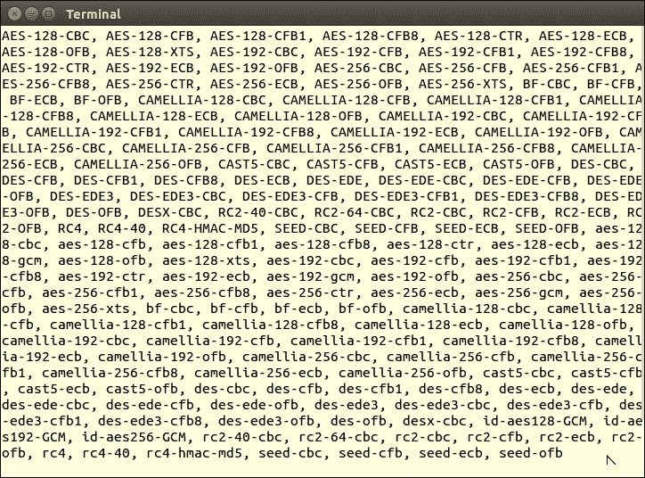

接下来，您可以为要加密的纯文本、方法、密钥和 IV 添加值。例如，使用 XTS 操作模式尝试密钥大小为 256 的 AES：

```php
$plainText = 'Super Secret Credentials';
$method = 'aes-256-xts';
$key = random_bytes(16);
$iv  = random_bytes(16);
```

要加密，可以使用`openssl_encrypt()`，指定前面配置的参数：

```php
$cipherText = openssl_encrypt($plainText, $method, $key, 0, $iv);
```

您可能还希望对结果进行 base 64 编码，以使其更可用：

```php
$cipherText = base64_encode($cipherText);
```

若要解密，请使用相同的值`$key`和`$iv`值。别忘了先取消对基 64 值的编码：

```php
$plainText = openssl_decrypt(base64_decode($cipherText), 
$method, $key, 0, $iv);
```

以下是输出，显示基本 64 编码的密码文本，后跟解密的纯文本：

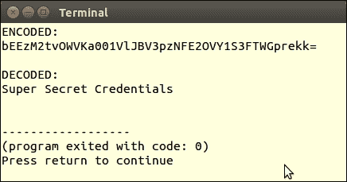

如果您为 IV 提供的字节数不正确，对于所选的密码方法，将显示一条警告消息：

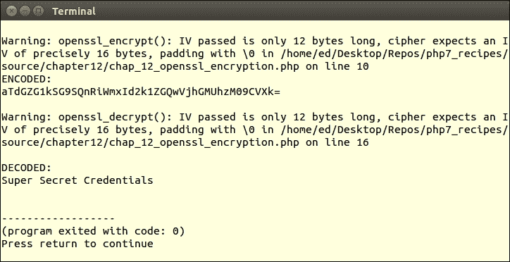

## 还有更多。。。

在 PHP7 中，使用`open_ssl_encrypt()`和`open_ssl_decrypt()`时出现问题，并且**认证加密支持关联数据**（**AEAD**模式）：GCM 和 CCM。因此，在 PHP 7.1 中，这些函数增加了三个额外参数，如下所示：

<colgroup><col style="text-align: left"> <col style="text-align: left"></colgroup> 
| 

参数

 | 

描述

 |
| --- | --- |
| `$tag` | 通过引用传递的认证标签；如果身份验证失败，则变量值保持不变 |
| `$aad` | 附加认证数据 |
| `$tag_length` | GCM 模式为 4~16；CCM 模式无限制；仅适用于`open_ssl_encrypt()` |

更多信息，您可以参考[https://wiki.php.net/rfc/openssl_aead](https://wiki.php.net/rfc/openssl_aead) 。

## 另见

关于 PHP7.1 中为什么不推荐使用`mcrypt`扩展的精彩讨论，请参阅[中的文章 https://wiki.php.net/rfc/mcrypt-viking-funeral](https://wiki.php.net/rfc/mcrypt-viking-funeral) 。有关构成各种密码方法基础的分组密码的详细说明，请参阅[中的文章 https://en.wikipedia.org/wiki/Block_cipher](https://en.wikipedia.org/wiki/Block_cipher) 。有关 AES 的详细说明，请参考至[https://en.wikipedia.org/wiki/Advanced_Encryption_Standard](https://en.wikipedia.org/wiki/Advanced_Encryption_Standard) 。在[可以看到一篇描述加密操作模式的好文章 https://en.wikipedia.org/wiki/Block_cipher_mode_of_operation](https://en.wikipedia.org/wiki/Block_cipher_mode_of_operation) 。

### 注

对于某些较新的模式，如果要加密的数据小于块大小，`openssl_decrypt()`将不返回任何值。如果您*填充*数据，使其至少为块大小，则问题消失。大多数模式都实现内部填充，因此这不是问题。使用一些较新的模式（即`xts`），您可能会看到这个问题。在将代码投入生产之前，请确保对少于 8 个字符的短数据字符串进行测试。