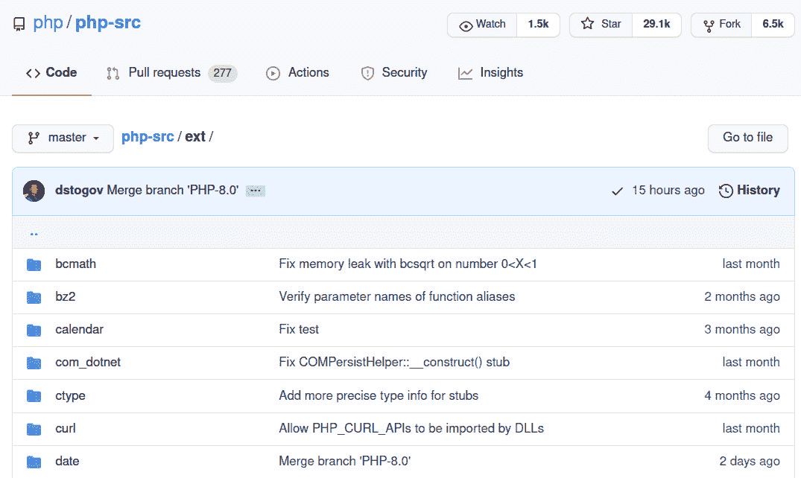
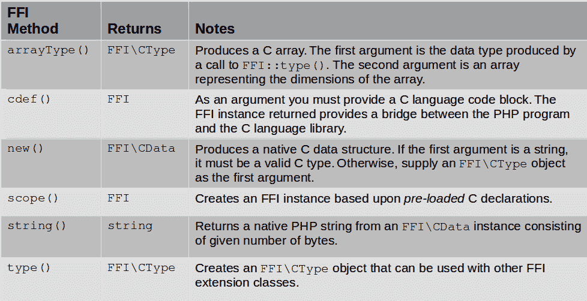
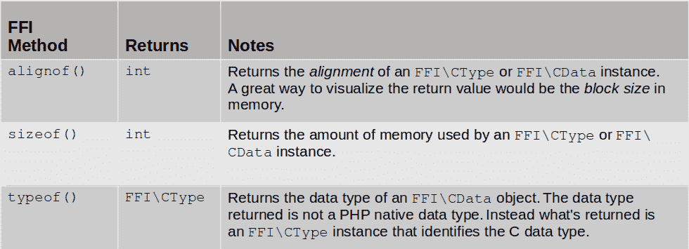
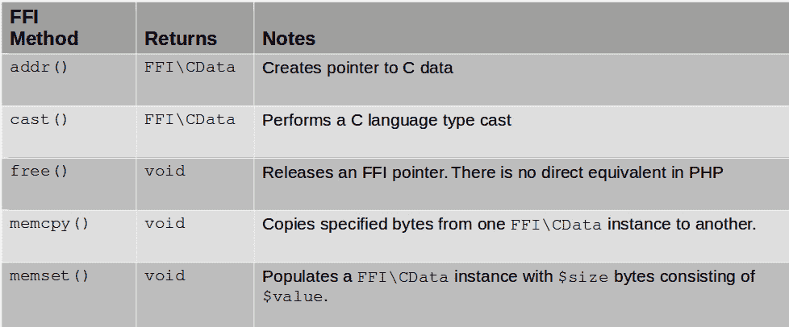

# 四、直接调用 C 语言

本章介绍**对外功能接口**（**FFI**）。在本章中，您将了解 FFI 的全部内容、它的好处以及如何使用它。本章中的信息对于对使用直接 C 语言调用快速定制原型感兴趣的开发人员非常重要。

在本章中，您不仅了解了将 FFI 引入 PHP 语言的背景知识，还了解了如何将 C 语言结构和函数直接合并到代码中。虽然您将了解到，不应该为了获得更高的速度而这样做，但它确实使您能够将任何 C 语言库直接合并到 PHP 应用中。这种能力打开了通往 PHP 迄今无法使用的功能的整个世界的大门。

本章涵盖的主题包括以下内容：

*   了解外国金融机构
*   学习在哪里使用外国金融机构
*   审查外国金融机构课程
*   在应用中使用 FFI
*   使用 PHP 回调

# 技术要求

要检查并运行本章中提供的代码示例，此处列出了推荐的最低硬件：

*   基于 X86_64 的台式 PC 或笔记本电脑
*   1**GB**（**GB**可用磁盘空间
*   4 GB 的**随机存取存储器**（**RAM**）
*   500**千比特每秒**（**Kbps**或更快的互联网连接

此外，您还需要安装以下软件：

*   码头工人
*   Docker Compose

请参考[*第 1 章*](01.html#_idTextAnchor013)*中的*技术要求*部分，介绍新的 PHP8 OOP 特性，*以了解有关 Docker 和 Docker Compose 安装的更多信息，以及如何构建用于演示本书中解释的代码的 Docker 容器。在本书中，我们将您还原示例代码的目录称为`/repo`。

本章的源代码位于以下位置：

https://github.com/PacktPublishing/PHP-8-Programming-Tips-Tricks-and-Best-Practices

我们现在可以通过了解外国金融机构开始讨论。

# 了解外国金融机构

FFI 的主要目的是允许任何给定的编程语言能够合并用其他语言编写的外部库中的代码和函数调用。一个早期的例子是 20 世纪 80 年代的微型计算机能够使用`PEEK`和`POKE`命令，将汇编语言整合到原本迟钝的**初学者的通用符号指令代码**（**BASIC**）编程语言脚本中。与许多其他语言不同，PHP 在 PHP7.4 之前没有这种功能，尽管自 2004 年以来一直在讨论它。

为了全面理解 PHP8 中的 FFI，有必要离题，看看为什么 FFI 花了这么长时间才被完全采用到 PHP 语言中。还需要快速了解 PHP 扩展的一般情况，以及使用 C 语言代码的能力。我们首先检查 PHP 和 C 语言之间的关系。

## PHP 与 C 语言的关系

**C 语言**是丹尼斯·里奇于 1972 年底在贝尔实验室开发的。从那时起，尽管引入了面向对象的表兄弟 C++，这种语言仍然在编程语言领域占据主导地位。PHP 本身是用 C 编写的；因此，直接加载 C 共享库以及直接访问 C 函数和数据结构的能力是对 PHP 语言的一个极其重要的补充。

在 PHP 语言中引入 FFI 扩展使 PHP 能够加载并直接使用 C 结构和 C 函数。为了明智地决定何时何地使用 FFI 扩展，让我们大致了解一下 PHP 扩展。

## 了解 PHP 扩展

**PHP 扩展**，正如标题所示，*扩展了*PHP 语言。每个扩展都可以添加**面向对象编程**（**OOP**类）以及过程级函数。每个扩展都有不同的逻辑用途，例如，`GD`扩展处理图形图像处理，而`PDO`扩展处理数据库访问。

作为类推，考虑医院。在医院里，你有急诊科、外科、儿科、骨科、心脏科、X 光科等等。每个部门都是独立的，并有着不同的目的。各科室共同组成医院。同样，PHP 就像医院，它的扩展就像各个部门。

并非所有的扩展都是相等的。当安装 PHP 时，一些被称为**核心扩展**的扩展总是可用的。其他扩展必须手动下载、编译和启用。现在让我们看看核心扩展。

### 访问 PHP 核心扩展

PHP 核心扩展直接包含在位于此处的主要 PHP 源代码存储库中：https://github.com/php/php-src/tree/master/ext. 如果您转到此网页，您将看到子目录列表，如以下屏幕截图所示。每个子目录包含包含特定扩展名的 C 语言代码：



图 4.1-GitHub 上的 PHP 核心扩展

因此，当 PHP 安装在服务器上时，所有的核心扩展都会被编译和安装。现在，我们将简要介绍不属于核心的扩展。

### 检查非核心 PHP 扩展

不属于核心的 PHP 扩展通常由特定供应商维护（例如**Microsoft**）。非常典型的是，非核心扩展被认为是可选的，并且没有广泛使用。

一旦非核心扩展开始越来越频繁地被使用，它很可能最终会被迁移到核心中。这方面的例子不胜枚举。最新的是`JSON`扩展：它现在不仅是核心的一部分，而且在 PHP8 中，这个扩展不能再被禁用。

也可以移除核心扩展。`mcrypt`扩展就是一个例子。这在 PHP7.1 中被弃用，因为此扩展所依赖的底层库已被*放弃*超过 9 年。在 PHP7.2 中，它被正式从核心中删除。现在，我们考虑在哪里找到 No.T3 非核心扩展。

### 查找非核心扩展

此时您可能会问一个合乎逻辑的问题：*您从哪里获得非核心扩展？*一般而言，非核心扩展可直接从供应商处、从[github.com](http://github.com)或从以下网站获得：http://pecl.php.net/. 多年来一直有人抱怨[pecl.php.net](http://pecl.php.net)包含过时且未维护的代码。虽然这部分是正确的，但本网站上确实存在最新的、积极维护的代码。

例如，如果您查看一下 MongoDB 的 PHP 扩展，您将看到上一次发布是在 2020 年 11 月底。以下屏幕截图显示了此扩展的**PHP 扩展社区库**（**PECL**网站页面：


图 4.2–php MongoDB 扩展的 pecl.php.net 页面

在许多情况下，供应商倾向于保留对扩展的完全控制权。这意味着您需要访问他们的网站以获取 PHP 扩展。这方面的一个例子是 Microsoft SQL Server 的 PHP 扩展，可在此**统一资源定位器**（**URL**中找到）：https://docs.microsoft.com/en-us/sql/connect/php/download-drivers-php-sql-server?view=sql-服务器版本 15。

本小节的要点是 PHP 语言通过其扩展得到了增强。这些扩展是用 C 语言编写的。因此，直接在 PHP 脚本中对原型扩展的逻辑建模的能力非常重要。现在让我们把注意力转向您应该在哪里使用 FFI。

# 学习在哪里使用外国金融机构

将 C 库直接导入 PHP 的潜力是惊人的。一位 PHP 核心开发人员实际使用 FFI 扩展将 PHP 绑定到 C 语言**TensorFlow**机器学习平台！

提示

有关 TensorFlow 机器学习平台的信息，请访问以下网页：https://www.tensorflow.org/. 要了解如何将 PHP 绑定到此库，请查看此处：[https://github.com/dstogov/php-tensorflow](https://github.com/dstogov/php-tensorflow) 。

正如我们在本节中向您展示的，FFI 扩展并不是满足您所有需求的神奇解决方案。本节讨论外国金融机构扩展的主要优势和劣势，并为您提供使用指南。我们在本节中揭穿的一个误区是，使用 FFI 扩展进行直接 C 语言调用可以加快 PHP8 程序的执行。首先，让我们看看是什么花了这么长时间才将 FFI 扩展引入 PHP。

## 将 FFI 引入 PHP

第一个 FFI 扩展实际上是在 PECL 网站上为 PHP5 引入的(https://pecl.php.net/)2004 年 1 月由 PHP 核心开发者**Wez Furlong**和**Ilia Alshanetsky**共同开发。然而，该项目从未通过其 Alpha 阶段，开发在一个月内就停止了。

随着 PHP 在接下来的 14 年中的发展和成熟，很明显 PHP 将受益于直接在 PHP 脚本中快速原型化潜在扩展的能力。如果没有这种功能，PHP 就有落后于其他语言（如 Python 和 Ruby）的危险。

在过去，由于缺乏快速原型功能，扩展开发人员被迫编译完整的扩展并使用`pecl`进行安装，然后才能在 PHP 脚本中进行测试。在某些情况下，开发人员不得不*重新编译 PHP 本身*来测试他们的新扩展！相比之下，FFI 扩展允许开发人员直接在 PHP 脚本中*放置*C 函数调用，以便立即进行测试。

从 PHP7.4 开始，一直到 PHP8，核心开发人员 Dmitry Stogov 提出了 FFI 扩展的改进版本。经过令人信服的概念证明（参见前面关于 PHP 绑定到 TensorFlow 机器学习平台的*提示*框），此 FFI 扩展版本被合并到 PHP 语言中。

提示

原始 FFI PHP 扩展可在此处找到：http://pecl.php.net/package/ffi. 有关修订后的外国金融机构提案的更多信息，请参见以下条款：https://wiki.php.net/rfc/ffi.

现在让我们来看看为什么不应该使用 FFI 来提高速度。

## 请勿使用 FFI 进行速度测试

由于 FFI 扩展允许 PHP 直接访问 C 语言库，因此有一种诱惑让人相信，您的 PHP 应用会突然以机器语言的速度以惊人的速度运行。不幸的是，情况并非如此。FFI 扩展需要首先打开给定的 C 库，然后在执行之前解析并伪编译一个`FFI`实例。FFI 扩展然后充当 C 库代码和 PHP 脚本之间的桥梁。

一些读者可能会松一口气，相对缓慢的 FFI 扩展性能并不局限于 PHP8。其他语言在使用自己的 FFI 实现时也会受到同样的限制。基于*Ary 3 基准*，这里提供了一个出色的性能比较：https://wiki.php.net/rfc/ffi#php_ffi_performance.

如果您看一下刚才引用的网页上显示的表，您将看到 Python FFI 实现在 0.343 秒内执行了基准测试，而在 0.212 秒内仅使用本地 Python 代码运行相同的基准测试。

查看同一个表，PHP7.4FFI 扩展以 0.093 秒（比 Python 快 30 倍！）的速度运行基准测试，而相同的基准测试仅以 0.040 秒的时间执行原生 PHP 代码。

下一个逻辑问题是：*为什么要使用 FFI 扩展？*这将在下一节中介绍。

## 为什么要使用 FFI 扩展？

前面问题的答案很简单：这个扩展主要是为快速**PHP 扩展原型**而设计的。PHP 扩展是该语言的生命线。没有扩展，PHP 只是另一种编程语言。

当高级开发人员第一次开始一个编程项目时，他们需要确定项目的最佳语言。一个关键因素是有多少扩展可用，以及维护这些扩展的积极程度。通常，积极维护的扩展数量与使用该语言的项目的长期成功潜力之间存在直接关系。

因此，如果有一种加速扩展开发的方法，PHP 语言本身的长期生存能力就会得到提高。FFI 扩展给 PHP 语言带来的价值是它能够直接在 PHP 脚本中测试扩展原型，而不必经历整个编译链接加载测试周期。

FFI 扩展的另一个用例，在快速原型之外，是一种允许 PHP 直接访问晦涩或专有 C 代码的方法。这方面的一个例子是为控制工厂机器而编写的自定义 C 代码。为了让 PHP 运行工厂，可以使用 FFI 扩展将 PHP 直接绑定到控制各种机器的 C 库。

最后，这个扩展的另一个用例是使用它来*预加载*C 库，这可能会减少内存消耗。在我们展示使用示例之前，让我们先看看`FFI`类及其方法。

# 检查外国金融机构的课程

正如您在本章中了解到的，并非每个开发人员都需要使用 FFI 扩展。拥有 FFI 扩展的直接经验可以加深您对 PHP 语言内部的理解，这种加深的理解可以对您作为 PHP 开发人员的职业生涯产生有益的影响：很可能在将来的某个时候，您将被一家开发定制 PHP 扩展的公司雇用。了解如何在这种情况下操作 FFI 扩展可以让您为自定义 PHP 扩展开发新功能，并帮助您解决扩展问题。

`FFI`类由 20 种方法组成，分为四大类，概述如下：

*   **Creational**：该类别中的方法创建 FFI 扩展**应用编程接口**（**API**中可用的类实例。
*   **比较**：设计比较方法，比较 C 数据值。
*   **信息性**：这组方法为您提供 C 数据值的元数据，包括大小和*对齐方式*。
*   **Infrastructural**: Infrastructural methods are used to carry out logistical operations such as copying, populating, and releasing memory.

    提示

    完整的外国金融机构类别记录在此处：[https://www.php.net/manual/en/class.ffi.php](https://www.php.net/manual/en/class.ffi.php) 。

有趣的是，所有的`FFI`类方法都可以静态调用。现在是深入研究与 FFI 相关的类的细节和用法的时候了，从*创造性*方法开始。

## 使用外国金融机构的创作方法

属于*创造性*类别的`FFI`方法旨在直接生成`FFI`实例或 FFI 扩展提供的类的实例。当使用通过 FFI 扩展提供的 C 函数时，必须认识到不能直接将本机 PHP 变量传递到函数中并期望它工作。必须首先将数据创建为`FFI`数据类型或导入`FFI`数据类型，然后才能将`FFI`数据类型传递到 C 函数中。要创建`FFI`数据类型，请使用*表 4.1*中总结的功能之一，如下所示：



表 4.1——外国金融机构类别创造方法汇总

`cdef()`和`scope()`方法都生成直接`FFI`实例，而其他方法生成可用于创建`FFI`实例的对象实例。`string()`用于从本机 C 变量中提取给定数量的“是”。让我们看看如何创建和使用`FFI\CType`实例。

### 创建和使用 FFI\t 类型实例

非常重要的是要注意，一旦创建了`FFI\CType`实例，*不要*简单地给它赋值，就好像它是一个本机 PHP 变量一样。这样做只会覆盖`FFI\CType`实例，因为 PHP 是松散类型的。相反，要将标量值分配给`FFI\CType`实例，请使用其`cdata`属性。

下面的示例创建一个`$arr`C 数组。然后用最大值填充本机 C 数组，之后我们使用一个简单的`var_dump()`来查看其内容。我们会进行以下工作：

1.  首先，我们使用`FFI::arrayType()`创建数组。作为参数，我们提供`FFI::type()`方法和维度。然后我们使用`FFI::new()`创建`FFI\Ctype`实例。代码在下面的代码片段中进行了说明：

    ```php
    // /repo/ch04/php8_ffi_array.php
    $type = FFI::arrayType(FFI::type("char"), [3, 3]);
    $arr  = FFI::new($type);
    ```

2.  Alternatively, we could also combine the operations into a single statement, as shown here:

    `$arr = FFI::new(FFI::type("char[3][3]"));`

3.  然后，我们初始化三个提供测试数据的变量，如下面的代码段所示。请注意，本机 PHP`count()`函数适用于`FFI\CData`数组类型：

    ```php
    $pos   = 0;
    $val   = 'ABCDEFGHIJKLMNOPQRSTUVWXYZ';
    $y_max = count($arr);
    ```

4.  We can now populate it with values, much as with a PHP array, except that we need to use the `cdata` property in order to retain the element as a `FFI\CType` instance. The code is shown in the following snippet:

    ```php
    for ($y = 0; $y < $y_max; $y++) {
        $x_max = count($arr[$y]);
        for ($x = 0; $x < $x_max; $x++) {
            $arr[$y][$x]->cdata = $val[$pos++];
        }
    }
    var_dump($arr)
    ```

    在前面的示例中，我们使用嵌套的`for()`循环用字母表的字母填充二维 3x3 数组。如果我们现在执行一个简单的`var_dump()`，我们会得到以下结果：

    ```php
    root@php8_tips_php8 [ /repo/ch04 ]# php 
    php8_ffi_array.php 
    object(FFI\CData:char[3][3])#2 (3) {
      [0]=> object(FFI\CData:char[3])#3 (3) {
        [0]=> string(1) "A"
        [1]=> string(1) "B"
        [2]=> string(1) "C"
      }
      [1]=> object(FFI\CData:char[3])#1 (3) {
        [0]=> string(1) "D"
        [1]=> string(1) "E"
        [2]=> string(1) "F"
      }
      [2]=> object(FFI\CData:char[3])#4 (3) {
        [0]=> string(1) "G"
        [1]=> string(1) "H"
        [2]=> string(1) "I"
    }
    ```

从输出中需要注意的第一件重要事情是，索引都是整数。从输出中得到的第二点是，这显然不是一个本机 PHP 数组。`var_dump()`显示每个数组元素都是一个`FFI\CData`实例。另外，请注意，C 语言字符串被视为数组。

由于数组的类型为`char`，我们可以使用`FFI::string()`来显示其中一行。下面是一个生成*ABC*响应的命令：

`echo FFI::string($arr[0], 3);`

任何将`FFI\CData`实例提供给以数组为参数的 PHP 函数的尝试都注定会失败，即使它被定义为数组类型。在以下代码段中，如果将此命令添加到前面的代码块，请注意输出：

`echo implode(',', $arr);`

从下面显示的输出中可以看到，由于数据类型不是`array`，所以`implode()`发出了一个致命错误。以下是结果输出：

```php
PHP Fatal error:  Uncaught TypeError: implode(): Argument #2 ($array) must be of type ?array, FFI\CData given in /repo/ch04/php8_ffi_array.php:25
```

您现在知道如何创建和使用`FFI\CType`实例。现在让我们将注意力转向创建`FFI`实例。

### 创建和使用 FFI 实例

如章节引言中所述，FFI 扩展有助于快速原型制作。因此，使用 FFI 扩展，您可以一次开发一个用于新扩展的 C 函数，并立即在 PHP 应用中测试它们。

重要提示

FFI 扩展不编译 C 代码。为了使用带有 FFI 扩展的 C 函数，必须首先使用 C 编译器将 C 代码编译到共享库中。您将在本章的最后一节*中学习如何在应用*中使用 FFI。

为了在 PHP 和本机 C 库函数调用之间架起桥梁，您需要创建一个`FFI`实例。FFI 扩展需要您提供一个定义 C 函数签名和计划使用的 C 库的 C 定义。`FFI::cdef()`和`FFI::scope()`都可以直接创建`FFI`实例。

下面的示例使用`FFI::cdef()`绑定两个本机 C 库函数。这就是发生的情况：

1.  第一种本地方法`srand()`用于为随机化序列设定种子。另一个本机 C 函数`rand()`调用序列中的下一个数字。`$key`变量保存随机化的最终结果。`$size`表示要调用的随机数。代码在下面的代码片段中进行了说明：

    ```php
    // /repo/ch04/php8_ffi_cdef.php
    $key  = '';
    $size = 4;
    ```

2.  然后，我们通过调用`cdef()`并识别从`libc.so.6`本机 C 库中取出的字符串`$code`中的本机 C 函数来创建`FFI`实例，如下所示：

    ```php
    $code = <<<EOT
        void srand (unsigned int seed);
        int rand (void);
    EOT;
    $ffi = FFI::cdef($code, 'libc.so.6');
    ```

3.  We then seed the randomization by calling `srand()`. Then, in a loop, we invoke the `rand()` native C library function to produce a random number. We use the `sprintf()` native PHP function to convert the resulting integer to hex, the output of which is appended to `$key`, which is echoed. The code can be seen here:

    ```php
    $ffi->srand(random_int(0, 999));
    for ($x = 0; $x < $size; $x++)
        $key .= sprintf('%x', $ffi->rand());
    echo $key
    ```

    这是前面代码片段的输出。请注意，结果值可以用作随机键：

    ```php
    root@php8_tips_php8 [ /repo/ch04 ]# php php8_ffi_cdef.php
    23f306d51227432e7d8d921763b7eedf
    ```

    在输出中，您看到一个串接的随机整数转换为十六进制。请注意，每次调用脚本时，结果值都会更改。

    提示

    对于真正的随机化，最好只使用`random_int()`本机 PHP 函数。`openssl`扩展的一部分还包括出色的密钥生成功能。这里显示的示例主要是为了让您熟悉 FFI 扩展的使用。

    重要提示

    FFI 扩展还包括两种额外的创作方法：`FFI::load()`和`FFI::scope()`。`FFI::load()`用于在**预加载**过程中直接从 C 头（`*.h`文件加载 C 函数定义。`FFI::scope()`使预加载的 C 功能可通过 FFI 扩展使用。有关预加载的更多信息，请查看 FFI 文档中的完整预加载示例：[https://www.php.net/manual/en/ffi.examples-complete.php](https://www.php.net/manual/en/ffi.examples-complete.php) 。

现在让我们看一看用于比较原生 C 数据类型的 FFI 扩展函数。

## 使用 FFI 比较数据

必须记住，当您使用 FFI 扩展创建 C 语言数据结构时，它存在于 PHP 应用之外。正如您在前面的示例中所看到的（参见*创建和使用 FFI\CType 实例*部分），PHP 可以在一定程度上与 C 数据交互。但是，出于比较目的，最好使用`FFI::memcmp()`，因为本机 PHP 函数可能会返回不一致的结果。

在*表 4.2*中总结了 FFI 扩展中可用的两个比较函数：


表 4.2——外国金融机构类别比较方法汇总

`FFI::isNull()`可用于判断`FFI\CData`实例是否为`NULL`。更有趣的是`FFI::memcmp()`。尽管此函数的操作方式与**太空船操作员**（`<=>`相同，但它接受一个*第三个参数*，该参数表示您希望在比较中包含多少字节。以下示例说明了该用法：

1.  我们首先定义一组四个变量，表示最多可以包含六个字符的`FFI\CData`实例，并用示例数据填充实例，如下所示：

    ```php
    // /repo/ch04/php8_ffi_memcmp.php
    $a = FFI::new("char[6]");
    $b = FFI::new("char[6]");
    $c = FFI::new("char[6]");
    $d = FFI::new("char[6]");
    ```

2.  回想一下，C 语言将字符数据视为数组，因此我们不能直接分配字符串，即使使用`cdata`属性。因此，我们需要定义一个匿名函数，用字母表中的字母填充实例。我们使用以下代码执行此操作：

    ```php
    $populate = function ($cdata, $start, $offset, $num) {
        for ($x = 0; $x < $num; $x++)
            $cdata[$x + $offset] = chr($x + $offset + 
                                       $start);
        return $cdata;
    };
    ```

3.  接下来，我们使用函数用不同的字母集填充四个`FFI\CData`实例，如下所示：

    ```php
    $a = $populate($a, 65, 0, 6);
    $b = $populate($b, 65, 0, 3);
    $b = $populate($b, 85, 3, 3);
    $c = $populate($c, 71, 0, 6);
    $d = $populate($d, 71, 0, 6);
    ```

4.  我们现在可以使用`FFI::string()`方法来显示到目前为止的内容，如下所示：

    ```php
    $patt = "%2s : %6s\n";
    printf($patt, '$a', FFI::string($a, 6));
    printf($patt, '$b', FFI::string($b, 6));
    printf($patt, '$c', FFI::string($c, 6));
    printf($patt, '$d', FFI::string($d, 6));
    ```

5.  以下是`printf()`语句的输出：

    ```php
    $a : ABCDEF
    $b : ABCXYZ
    $c : GHIJKL
    $d : GHIJKL
    ```

6.  从输出中可以看出，`$c`和`$d`的值是相同的。`$a`和`$b`的前三个字符相同，但后三个不同。
7.  此时，如果我们尝试使用太空船操作员（`<=>`进行比较，结果将如下：

    ```php
    PHP Fatal error:  Uncaught FFI\Exception: Comparison of incompatible C types
    ```

8.  同样，尝试使用`strcmp()`，即使数据是字符类型，结果如下：

    ```php
    PHP Warning:  strcmp() expects parameter 1 to be string, object given
    ```

9.  因此，我们的唯一选择是使用`FFI::memcmp()`。在这里显示的一组比较中，请注意第三个参数是`6`，表示 PHP 最多应比较六个字符：

    ```php
    $p = "%20s : %2d\n";
    printf($p, 'memcmp($a, $b, 6)', FFI::memcmp($a, 
            $b, 6));
    printf($p, 'memcmp($c, $a, 6)', FFI::memcmp($c, 
            $a, 6));
    printf($p, 'memcmp($c, $d, 6)', FFI::memcmp($c, 
            $d, 6));
    ```

10.  正如预期的那样，输出与在本机 PHP 字符串上使用 spaceship 操作符相同，如下所示：

    ```php
       memcmp($a, $b, 6) : -1
       memcmp($c, $a, 6) :  1
       memcmp($c, $d, 6) :  0
    ```

11.  请注意，如果将比较限制为仅三个字符，会发生什么情况。下面是添加到代码块的另一个`FFI::memcmp()`比较，将第三个参数设置为`3`：

    ```php
    echo "\nUsing FFI::memcmp() but not full length\n";
    printf($p, 'memcmp($a, $b, 3)', FFI::memcmp($a, 
            $b, 3));
    ```

12.  从这里显示的输出可以看出，通过将`memcmp()`限制为三个字符，`$a`和`$b`被认为是相等的，因为它们都以相同的三个字符开始，`a`、`b`和`c`：

    ```php
    Using FFI::memcmp() but not full length
       memcmp($a, $b, 3) :  0
    ```

从这个例子中最重要的一点是，你需要在要比较的字符数和你要比较的数据的性质之间找到一个平衡点。字符越少，整体操作速度越快。但是，如果数据的性质可能导致错误的结果，则必须增加字符数，并使性能稍有损失。

现在让我们来看一下从 FFI 扩展数据收集信息。

### 从 FFI 扩展数据中提取信息

当您使用实例和本机 C 数据结构时，本机 PHP 信息方法（如`strlen()`和`ctype_digit()`不会产生有用的信息。因此，外国金融机构扩展包括三种方法，旨在产生有关外国金融机构扩展数据的信息。这三种方法汇总在*表 4.3*中：



表 4.3——外国金融机构类别信息方法汇总

我们先看看`FFI::typeof()`，然后再看另外两种方法。

### 使用 FFI:：typeof（）确定 FFI 数据的性质

下面是一个示例，说明了`FFI::typeof()`的用法。该示例还演示了本机 PHP 信息函数在处理 FFI 数据时不会产生有用的结果。我们就是这样做的：

1.  首先，我们定义一个`$char`C 字符串，并用字母表的前六个字母填充它，如下所示：

    ```php
    // /repo/ch04/php8_ffi_typeof.php
    $char = FFI::new("char[6]");
    for ($x = 0; $x < 6; $x++)
        $char[$x] = chr(65 + $x);
    ```

2.  然后我们尝试使用`strlen()`来获取字符串的长度。在下面的代码片段中，请注意`$t::class`的用法：这相当于`get_class($t)`。此用法仅适用于 PHP 8 及以上版本：

    ```php
    try {
        echo 'Length of $char is ' . strlen($char);
    } catch (Throwable $t) {
        echo $t::class . ':' . $t->getMessage();
    }
    ```

3.  PHP7.4 中的结果是一条`Warning`消息。然而，在 PHP8 中，如果您将字符串以外的任何内容传递给`strlen()`，则会抛出一条致命的`Error`消息。这是此时的 PHP8 输出：

    ```php
    TypeError:strlen(): Argument #1 ($str) must be of type string, FFI\CData given
    ```

4.  以类似的方式，使用`ctype_alnum()`的努力如下：

    ```php
    echo '$char is ' .
        ((ctype_alnum($char)) ? 'alpha' : 'non-alpha');
    ```

5.  以下是*步骤 4*：

    ```php
    $char is non-alpha
    ```

    中显示的`echo`命令的输出
6.  正如您可以清楚地看到的，我们使用本机 PHP 函数没有获得任何关于 FFI 数据的有用信息！但是，如图所示，使用`FFI::typeof()`会返回更好的结果：

    ```php
    $type = FFI::typeOf($char);
    var_dump($type);
    ```

7.  以下是来自`var_dump()`：

    ```php
    object(FFI\CType:char[6])#3 (0) {}
    ```

    的输出

正如您从最终输出中看到的，我们现在有了有用的信息！现在让我们看看其他两种外国金融机构信息方法。

### 使用 FFI:：alignof（）和 FFI:：sizeof（）

在将引入实际示例，展示这两种方法的使用之前，了解**对齐**的确切含义非常重要。为了理解对齐，您需要对大多数计算机中内存的组织方式有一个基本的了解。

RAM 仍然是临时存储程序运行周期中使用的信息的最快方式。当程序执行时，计算机的**中央处理器**（**CPU**会将信息移入和移出内存。内存以并行阵列的形式组织。`alignof()`返回的对齐值是一次可以从对齐的内存阵列的并行片中获得多少字节。在较旧的计算机中，典型值为 4。对于大多数现代微型计算机来说，8 或 16（或更大）的值是常见的。

现在让我们来看一个示例，该示例演示了如何使用这两种 FFI 扩展信息方法，以及信息如何产生性能改进。这是我们将如何进行的：

1.  首先，我们创建一个`FFI`实例`$ffi`，在其中我们定义了两个标记为`Good`和`Bad`的 C 结构。请注意，在下面的代码片段中，两个结构具有相同的属性；但是，属性的排列顺序不同：

    ```php
    $struct = 'struct Bad { char c; double d; int i; }; '
            . 'struct Good { double d; int i; char c; }; 
              ';
    $ffi = FFI::cdef($struct);
    ```

2.  然后我们从`$ffi`中提取这两个结构，如下所示：

    ```php
    $bad = $ffi->new("struct Bad");
    $good = $ffi->new("struct Good");
    var_dump($bad, $good);
    ```

3.  `var_dump()`输出如图所示：

    ```php
    object(FFI\CData:struct Bad)#2 (3) {
      ["c"]=> string(1) ""
      ["d"]=> float(0)
      ["i"]=> int(0)
    }
    object(FFI\CData:struct Good)#3 (3) {
      ["d"]=> float(0)
      ["i"]=> int(0)
      ["c"]=> string(1) ""
    }
    ```

4.  We then use the two informational methods to report on the two data structures, as follows:

    ```php
    echo "\nBad Alignment:\t" . FFI::alignof($bad);
    echo "\nBad Size:\t" . FFI::sizeof($bad);
    echo "\nGood Alignment:\t" . FFI::alignof($good);
    echo "\nGood Size:\t" . FFI::sizeof($good);
    ```

    此代码示例的最后四行输出如下所示：

    ```php
    Bad Alignment:  8
    Bad Size:       24
    Good Alignment: 8
    Good Size:      16
    ```

    正如您从输出中看到的，`FFI::alignof()`的返回告诉我们对齐块的宽度为 8 字节。但是，您也可以看到，`Bad`结构占用的字节大小比`Good`结构所需的大小大 50%。由于这两个数据结构具有完全相同的属性，任何头脑正常的开发人员都会选择`Good`结构。

从这个例子中，您可以看到 FFI 扩展信息方法能够让我们了解如何最好地构造 C 数据，以产生最有效的结果。

提示

有关 C 语言中`sizeof()`和`alignof()`之间差异的精彩讨论，请参阅本文：https://stackoverflow.com/questions/11386946/whats-the-difference-between-sizeof-and-alignof.

现在，您已经了解了什么是 FFI 扩展信息方法，并且已经看到了它们的一些使用示例。现在让我们看看与基础设施相关的 FFI 扩展方法。

## 使用外国金融机构基础设施方法

FFI 扩展基础设施类方法可以被认为是*幕后*组件，支持 C 函数绑定正常工作所需的基础设施。正如我们在本章中所强调的，如果您希望从 PHP 应用中直接访问 C 数据结构，则需要 FFI 扩展。因此，如果您需要执行与 PHP`unset()`语句等价的操作来释放内存，或者需要执行包含外部程序代码的 PHP`include()`语句，则 FFI 扩展基础设施方法提供了本机 C 数据和 PHP 之间的桥梁。

此处所示的*表 4.4*总结了此类方法：



表 4.4——外国金融机构类基础设施方法

我们先来看看`FFI::addr()`、`free()`、`memset()`和`memcpy()`。

### 使用 FFI:：addr（）、free（）、memset（）和 memcpy（）

PHP 开发人员经常通过**引用**为变量赋值。这允许一个变量中的更改自动反映在另一个变量中。当将参数传递给需要返回多个值的函数或方法时，引用的使用尤其有用。通过引用，函数或方法可以返回无限数量的值。

`FFI::addr()`方法创建一个指向现有`FFI\CData`实例的 C 指针。与 PHP 引用中的一样，对与指针关联的数据所做的任何更改也将同样被更改。

在使用`FFI::addr()`方法构建示例的过程中，我们还向您介绍了`FFI::memset()`。此函数非常类似于`str_repeat()`PHP 函数，因为它（`FFI::memset()`）使用特定值填充指定数量的字节。在本例中，我们使用`FFI::memset()`用字母表中的字母填充 C 字符串。

在这一小节中，我们还要看一看`FFI::memcpy()`。此功能用于将数据从一个`FFI\CData`实例复制到另一个`FFI\CData`实例。与`FFI::addr()`方法不同，`FFI::memcpy()`创建的克隆与复制的数据源没有连接。此外，我们还介绍了`FFI::free()`，一种用于释放使用`FFI::addr()`创建的指针的方法。

让我们看看如何使用这些 FFI 扩展方法，如下所示：

1.  首先，创建一个`FFI\CData`实例`$arr`，该实例由六个字符的 C 字符串组成。请注意，在下面的代码片段中，使用另一种基础结构方法`FFI::memset()`将**美国信息交换标准代码**（**ASCII**）代码 65 填充字符串：字母`A`：

    ```php
    // /repo/ch04/php8_ffi_addr_free_memset_memcpy.php
    $size = 6;
    $arr  = FFI::new(FFI::type("char[$size]"));
    FFI::memset($arr, 65, $size);
    echo FFI::string($arr, $size);
    ```

2.  使用`FFI::string()`方法的`echo`结果如下所示：

    ```php
    AAAAAA
    ```

3.  从输出中可以看到，出现了 ASCII 码 65（字母`A`的六个实例。然后我们创建另一个`FFI\CData`实例`$arr2`，并使用`FFI::memcpy()`将一个实例中的六个字符复制到另一个实例中，如下所示：

    ```php
    $arr2  = FFI::new(FFI::type("char[$size]"));
    FFI::memcpy($arr2, $arr, $size);
    echo FFI::string($arr2, $size);
    ```

4.  毫不奇怪，输出与*步骤 2*中的输出相同，正如我们在这里看到的：

    ```php
    AAAAAA
    ```

5.  接下来，我们创建一个指向`$arr`的 C 指针。请注意，在分配指针时，它们在本机 PHP`var_dump()`函数中显示为数组元素。然后我们可以更改数组元素`0`的值，并使用`FFI::memset()`填充字母`B`。代码如以下代码片段所示：

    ```php
    $ref = FFI::addr($arr);
    FFI::memset($ref[0], 66, 6);
    echo FFI::string($arr, $size);
    var_dump($ref, $arr, $arr2);
    ```

6.  Here is the output associated with the remaining code shown in *Step 5*:

    ```php
    BBBBBB
    object(FFI\CData:char(*)[6])#2 (1) {
      [0]=>   object(FFI\CData:char[6])#4 (6) {
        [0]=>  string(1) "B"
        [1]=>  string(1) "B"
        [2]=>  string(1) "B"
        [3]=>  string(1) "B"
        [4]=>  string(1) "B"
        [5]=>  string(1) "B"
      }
    }
    object(FFI\CData:char[6])#3 (6) {
      [0]=>  string(1) "B"
      [1]=>  string(1) "B"
      [2]=>  string(1) "B"
      [3]=>  string(1) "B"
      [4]=>  string(1) "B"
      [5]=>  string(1) "B"
    }
    object(FFI\CData:char[6])#4 (6) {
      [0]=>  string(1) "A"
      [1]=>  string(1) "A"
      [2]=>  string(1) "A"
      [3]=>  string(1) "A"
      [4]=>  string(1) "A"
      [5]=>  string(1) "A"
    }
    ```

    由于您可以从的输出中看到，我们首先有一个`BBBBBB`字符串。您可以看到指针是 PHP 数组的形式。原来的`FFI\CData`实例`$arr`现在改为字母`B`。然而，前面的输出也清楚地表明副本`$arr2`不受对`$arr`或其`$ref[0]`指针所做更改的影响。

7.  Finally, in order to release the pointer created using `FFI::addr()`, we use `FFI::free()`. This method is much like the native PHP `unset()` function but is designed to work with C pointers. Here is the last line of code added to our example:

    `FFI::free($ref);`

现在您已经有了关于如何使用 C 指针以及如何用信息填充 C 数据的想法，让我们看看如何使用`FFI\CData`实例进行类型转换。

### 了解 FFI:：cast（）

在 PHP 中，**型铸造**的过程相当频繁。当 PHP 被要求执行涉及不同数据类型的操作时，会使用它。下面的代码块显示了这方面的一个经典示例：

```php
$a = 123;
$b = "456";
echo $a + $b;
```

在这个简单的例子中，`$a`被分配了`int`（整数）的数据类型，`$b`被分配了`string`的类型。`echo`语句要求 PHP 首先将`$b`类型转换为`int`，执行加法，然后将结果类型转换为`string`。

原生 PHP 还允许开发人员通过在变量或表达式前面的括号中预先添加所需的数据类型来强制执行数据类型。前面代码段中重写的示例可能如下所示：

```php
$a = 123;
$b = "456";
echo (string) ($a + (int) $b);
```

强制类型转换使使用您的代码的其他开发人员非常清楚您的意图。它还保证强制类型转换可以更好地控制代码流，并且不依赖于 PHP 默认行为。

FFI 扩展具有类似于`FFI::cast()`方法的能力。正如您在本章中所看到的，FFI 扩展数据是从 PHP 中分离出来的，并且不受 PHP 类型转换的影响。为了强制数据类型，您可以使用`FFI::cast()`根据的需要返回一个并行的`FFI\CData`类型。让我们看看如何在以下步骤中做到这一点：

1.  在本例中，我们创建了一个类型为`int`的`FFI\CData`实例`$int1`。我们使用其`cdata`属性分配一个值`123`，如下所示：

    ```php
    // /repo/ch04/php8_ffi_cast.php
    // not all lines are shown
    $patt = "%2d : %16s\n";
    $int1 = FFI::new("int");
    $int1->cdata = 123;
    $bool = FFI::cast(FFI::type("bool"), $int1);
    printf($patt, __LINE__, (string) $int1->cdata);
    printf($patt, __LINE__, (string) $bool->cdata);
    ```

2.  从这里显示的输出中可以看到，`123`的整数值，当类型转换为`bool`（布尔值）时，在输出中显示为`1`：

    ```php
     8 :                  123
     9 :                    1
    ```

3.  接下来我们创建一个类型为`int`的`FFI\CData`实例`$int2`，并分配一个值`123`。然后我们将其输入到`float`并再次返回到`int`，如以下代码片段所示：

    ```php
    $int2 = FFI::new("int");
    $int2->cdata = 123;
    $float1 = FFI::cast(FFI::type("float"), $int2);
    $int3   = FFI::cast(FFI::type("int"), $float1);
    printf($patt, __LINE__, (string) $int2->cdata);
    printf($patt, __LINE__, (string) $float1->cdata);
    printf($patt, __LINE__, (string) $int3->cdata);
    ```

4.  最后三条生产线的产量相当令人满意。我们看到我们的原始值`123`表示为`1.7235971111195E-43`。当 typecast 返回到`int`时，我们的原始值被恢复。这是最后三行的输出：

    ```php
    15 :                 123
    16 : 1.7235971111195E-43
    17 :                 123
    ```

5.  FFI 扩展与 C 语言一般一样，不允许转换所有类型。例如，在最后一段代码中，我们尝试将类型为`float`的`FFI\CData`实例`$float2`类型转换为类型`char`，如下所示：

    ```php
    try {
        $float2 = FFI::new("float");
        $float2->cdata = 22/7;
        $char1   = FFI::cast(FFI::type("char[20]"), 
            $float2);
        printf($patt, __LINE__, (string) $float2->cdata);
        printf($patt, __LINE__, (string) $char1->cdata);
    } catch (Throwable $t) {
        echo get_class($t) . ':' . $t->getMessage();
    }
    ```

6.  结果是灾难性的！从这里显示的输出中可以看到，抛出了一个`FFI\Exception`：

    ```php
    FFI\Exception:attempt to cast to larger type
    ```

在本节中，我们介绍了一系列 FFI 扩展方法，这些方法创建 FFI 扩展对象实例，比较值，收集信息，并与创建的 C 数据基础设施协作。您了解到有一些 FFI 扩展方法可以在本机 PHP 语言中反映这些相同的功能。在下一节中，我们将回顾一个使用 FFI 扩展将 C 函数库合并到 PHP 脚本中的实际示例。

# 在应用中使用 FFI

任何共享 C 库（通常带有`*.so`扩展）都可以包含在使用 FFI 扩展的 PHP 应用中。如果您计划使用任何核心 PHP 库或安装 PHP 扩展时生成的库，请务必注意，您有能力修改 PHP 语言本身的行为。

在我们研究它是如何工作的之前，让我们先看看如何使用 FFI 扩展将外部 C 库合并到 PHP 脚本中。

## 将外部 C 库集成到 PHP 脚本中

出于的说明目的，我们使用了一个简单的函数，该函数可能源于**计算机科学 101**（**CS101**类）著名的**气泡排序**类。该算法因易于理解而广泛应用于初学者的计算机科学课程中。

重要提示

**气泡排序**是一种效率极低的排序算法，长期以来被更快的排序算法所取代，如**外壳排序**、**快速排序**或**合并排序**算法。虽然没有关于冒泡排序算法的权威参考，但是您可以在这里阅读关于它的一篇很好的一般性讨论：[https://en.wikipedia.org/wiki/Bubble_sort](https://en.wikipedia.org/wiki/Bubble_sort) 。

在本小节中，我们不详细介绍算法。相反，本小节的目的是演示如何使用现有的 C 库并将其函数之一合并到 PHP 脚本中。我们现在向您展示原始 C 源代码，如何将其转换为共享库，以及最后如何使用 FFI 将库合并到 PHP 中。下面是我们要做的：

1.  当然，第一步是将 C 代码编译成目标代码。下面是用于此示例的冒泡排序 C 代码：

    ```php
    #include <stdio.h>
    void bubble_sort(int [], int);
    void bubble_sort(int list[], int n) {
        int c, d, t, p;
        for (c = 0 ; c < n - 1; c++) {
            p = 0;
            for (d = 0 ; d < n - c - 1; d++) {
                if (list[d] > list[d+1]) {
                    t = list[d];
                    list[d] = list[d+1];
                    list[d+1] = t;
                    p++;
                }
            }
            if (p == 0) break;
        }
    }
    ```

2.  We then compile the C code into object code using the GNU C compiler (included in the Docker image used for this course), as follows:

    `gcc -c -Wall -Werror -fpic bubble.c`

3.  Next, we incorporate the object code into a shared library. This step is necessary as the FFI extension is only able to access shared libraries. We run the following code to do this:

    `gcc -shared -o libbubble.so bubble.o`

4.  现在，我们已经准备好定义使用新共享库的 PHP 脚本。我们首先定义一个显示`FFI\CData`数组输出的函数，如下所示：

    ```php
    // /repo/ch04/php8_ffi_using_func_from_lib.php
    function show($label, $arr, $max) 
    {
        $output = $label . "\n";
        for ($x = 0; $x < $max; $x++)
            $output .= $arr[$x] . ',';
        return substr($output, 0, -1) . "\n";
    }
    ```

5.  接下来是关键的部分：定义`FFI`实例。我们使用`FFI::cdef()`来实现这一点，并提供两个参数。第一个参数是函数签名，第二个参数是新创建的共享库的路径。这两个参数都可以在以下代码段中看到：

    ```php
    $bubble = FFI::cdef(
        "void bubble_sort(int [], int);",
        "./libbubble.so");
    ```

6.  然后，我们使用`rand()`函数创建一个`FFI\CData`元素作为一个整数数组，其中包含 16 个随机整数填充的值。代码如以下代码片段所示：

    ```php
    $max   = 16;
    $arr_b = FFI::new('int[' . $max . ']');
    for ($i = 0; $i < $max; $i++)
        $arr_b[$i]->cdata = rand(0,9999);
    ```

7.  最后，我们在排序之前显示数组的内容，执行排序，然后在排序之后显示内容。请注意，在下面的代码片段中，我们使用来自`FFI`实例

    ```php
    echo show('Before Sort', $arr_b, $max);
    $bubble->bubble_sort($arr_b, $max);
    echo show('After Sort', $arr_b, $max);
    ```

    的`bubble_sort()`调用来执行排序
8.  正如您可能期望的那样，输出在排序之前显示了一个由随机整数组成的数组。排序后，值按顺序排列。以下是*步骤 7*：

    ```php
    Before Sort
    245,8405,8580,7586,9416,3524,8577,4713,
    9591,1248,798,6656,9064,9846,2803,304
    After Sort
    245,304,798,1248,2803,3524,4713,6656,7586,
    8405,8577,8580,9064,9416,9591,9846
    ```

    所示代码的输出

现在，您已经了解了如何使用 FFI 扩展将外部 C 库集成到 PHP 应用中，我们将转到最后一个主题：PHP 回调。

## 使用 PHP 回调

正如我们在本节开头提到的，可以使用 FFI 扩展来合并作为实际 PHP 语言（或其扩展）一部分的共享 C 库。这种集成非常重要，因为它允许您通过访问 PHP 共享 C 库中定义的 C 数据结构来读取和写入 C 库中的本机 PHP 数据。

但是，本小节的目的不是向您展示如何创建 PHP 扩展。相反，在本小节中，我们将向您介绍 FFI 扩展重写本机 PHP 语言功能的能力。此功能称为**PHP 回调**。在进入实现细节之前，我们必须首先检查与此功能相关的潜在危险。

### 了解 PHP 回调固有的危险

了解在各种 PHP 共享库中定义的 C 函数经常被多个 PHP 函数使用，这一点很重要。因此，如果您在 C 级别重写其中一个低级函数，您可能会在 PHP 应用中遇到意外行为。

另一个已知的问题是重写本机 PHP C 函数很有可能产生**内存泄漏**。随着时间的推移，使用此类覆盖的长时间运行的应用可能会失败，并可能导致服务器崩溃！

最后需要考虑的是，并非所有 FFI 平台都支持 PHP 回调功能。因此，尽管代码可能在 Linux 服务器上工作，但在 Windows 服务器上可能不工作（或者可能不工作）。

提示

与其使用 FFI PHP 回调重写本机 PHP C 库功能，只定义自己的 PHP 函数可能更容易、更快、更安全！

现在您已经了解了使用 PHP 回调所涉及的危险，让我们来看一个示例实现。

### 实现 PHP 回调

在下面的示例中，使用回调覆盖`zend_write`内部 PHP 共享库 C 函数，该回调将**换行符**（**LF**）添加到输出的末尾。请注意，此覆盖会影响依赖于它的任何本机 PHP 函数，包括`echo`、`print`、`printf`：换句话说，任何生成直接输出的 PHP 函数。要实现 PHP 回调，请执行以下步骤：

1.  首先，我们使用`FFI::cdef()`定义一个`FFI`实例。第一个参数是`zend_write`的函数签名。代码如以下代码片段所示：

    ```php
    // /repo/ch04/php8_php_callbacks.php
    $zend = FFI::cdef("
        typedef int (*zend_write_func_t)(
            const char *str,size_t str_length);
        extern zend_write_func_t zend_write;
    ");
    ```

2.  然后，我们添加代码以确认未经修改的`echo`不会在末尾添加额外的 LF。您可以在这里看到代码：

    ```php
    echo "Original echo command does not output LF:\n";
    echo 'A','B','C';
    echo 'Next line';
    ```

3.  毫不奇怪，输出产生了`ABCNext line`。输出中不存在回车或 LFs，如下所示：

    ```php
    Original echo command does not output LF:
    ABCNext line
    ```

4.  We then clone the pointer to `zend_write` into the `$orig_zend_write` variable. If we didn't do this, we would be unable to use the original function! The code is shown here:

    `$orig_zend_write = clone $zend->zend_write;`

5.  接下来，我们以匿名函数的形式生成一个 PHP 回调函数，该函数重写了原始`zend_write`函数。在函数中，我们调用原始的`zend_write`函数，并在其输出中附加一个 LF，如下所示：

    ```php
    $zend->zend_write = function($str, $len) {
        global $orig_zend_write;
        $ret = $orig_zend_write($str, $len);
        $orig_zend_write("\n", 1);
        return $ret;
    };
    ```

6.  剩下的代码将重新运行上一步中显示的`echo`命令，我们可以在这里看到：

    ```php
    echo 'Revised echo command adds LF:';
    echo 'A','B','C';
    ```

7.  The following output demonstrates that the PHP `echo` command now produces a LF at the end of each command:

    ```php
    Revised echo command adds LF:
    A
    B
    C
    ```

    还需要注意，修改 PHP 库 C 语言`zend_write`函数会影响使用此 C 语言函数的所有 PHP 本机函数。这包括`print()`、`printf()`（及其变体）等等。

我们在 PHP 应用中使用 FFI 扩展的讨论到此结束。现在您知道了如何从外部共享库合并本机 C 函数。您还知道如何用 PHP 回调替换本机 PHP 核心或扩展共享库，从而有可能改变 PHP 语言本身的行为。

# 总结

在本章中，您了解了 FFI 及其历史，以及如何使用它来促进快速 PHP 扩展原型制作。您还了解到，尽管 FFI 扩展不应用于提高速度，但它也可以用于允许 PHP 应用直接从外部 C 库调用本机 C 函数。通过一个从外部 C 库调用冒泡排序函数的示例，演示了此功能的强大功能。这种相同的功能可以扩展到数千个 C 库中的任何一个，包括机器学习、光学字符识别、通信、加密；*无限*。

在本章中，您对 PHP 本身如何在 C 语言级别上运行有了更深入的理解。您学习了如何创建和直接使用 C 语言数据结构，从而能够与 PHP 语言进行交互，甚至重写 PHP 语言本身。此外，您现在了解了如何将任何 C 语言库的功能直接合并到 PHP 应用中。这一知识的另一个好处是，如果你在一家计划开发或已经开发自己的定制 PHP 扩展的公司找到一份工作，它将有助于提升你的职业前景。

下一章标志着本书新章节的开始，*PHP8 技巧*。在下一节中，您将了解升级到 PHP8 时的向后兼容性问题。下一章将专门讨论 OOP 的向后兼容性问题。