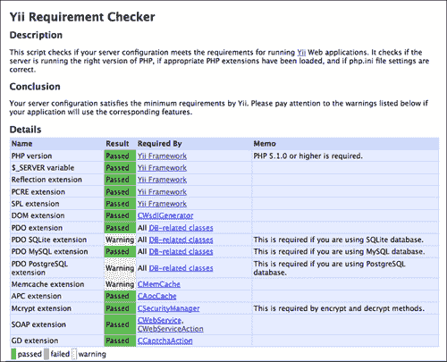
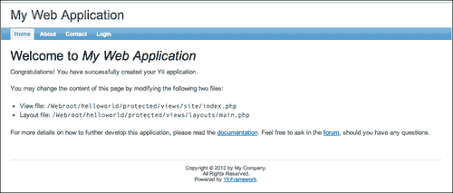
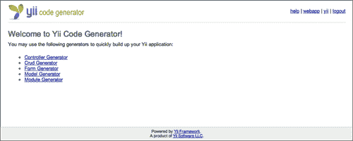
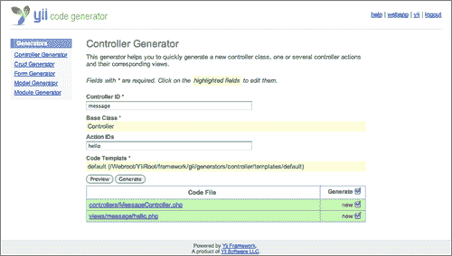

# 第二章开始

Yii 的真正乐趣和好处很快就会通过简单的使用而显现出来。在本章中，我们将看到上一章中介绍的概念如何在示例 Yii 应用程序中得到体现。本着 Yii 的约定高于配置的哲学精神，我们将遵循标准约定，以 Yii 编写“你好，世界！”程序开始。

在本章中，我们将介绍：

*   Yii 框架安装
*   创建新的应用程序
*   创建控制器和视图
*   添加动态内容以查看文件
*   Yii 请求将页面路由和链接到一起

我们的第一步是安装框架。我们现在就开始吧。

# 安装 Yii

在安装 Yii 之前，您必须将应用程序开发环境配置为能够支持 PHP 5.1.0 或更高版本的 web 服务器。Yii已经在 Windows 和 Linux 操作系统上使用 Apache HTTP 服务器进行了全面测试。它也可以在其他支持 PHP5 的 web 服务器和平台上运行。我们假设读者以前从事过 PHP 开发，并且能够访问或了解如何设置这样的环境。我们将把 web 服务器和 PHP 本身的安装作为练习留给读者。

### 注

一些流行的安装包包括

*   [http://www.apachefriends.org/en/xampp.html](http://www.apachefriends.org/en/xampp.html)
*   [http://www.mamp.info/en/index.html](http://www.mamp.info/en/index.html) （`mac only`）

基本的 Yii 安装几乎是微不足道的。实际上只有两个必要的步骤：

1.  从[下载 Yii 框架http://www.yiiframework.com/download/](http://www.yiiframework.com/download/) 。
2.  将下载的文件解压缩到可通过 web 访问的目录中。在下载框架时，有几个版本的 Yii 可供选择。我们将在本书中使用 1.1.12 版，这是截至撰写时的最新稳定版本。尽管大多数示例代码都应该适用于 Yii 的任何 1.1.x 版本，但如果使用不同的版本，可能会有一些细微的差异。请尝试使用第 1.1.12 节，如果您正在遵循这些示例。

下载框架文件并将其解压缩到可通过 web 访问的目录后，列出内容。您应该看到以下高级目录和文件：

*   `CHANGELOG`
*   `LICENSE`
*   `README`
*   `UPGRADE`
*   `demos/`
*   `framework/`
*   `requirements/`

现在，我们已经将框架解包到一个 web 可访问的目录中，建议您验证您的服务器是否满足使用 Yii 的所有要求，以确保安装成功。幸运的是，这样做很容易。Yii 附带了一个简单的需求检查工具。要使用该工具并让它验证您的安装要求，只需将浏览器指向下载文件附带的`requirements/`目录下的`index.php`输入脚本即可。例如，假设包含所有框架文件的目录名仅称为`yii`，则访问需求检查器的 URL 可能如下所示：

`http://localhost/yii/requirements/index.php`

以下屏幕截图显示了我们看到的配置结果：



使用需求检查器本身并不是安装的要求。但我们当然建议确保正确安装。正如您所看到的，并非我们在细节部分下的所有结果都收到了**通过**的状态，因为有些结果显示了**警告**结果。当然，您的配置很可能与我们的略有不同，因此您的结果也可能略有不同。没关系。不必在**详细信息**部分下的所有检查都通过，但需要在**结论**部分下接收以下消息：**您的服务器配置满足 Yii**的最低要求。

### 提示

Yii 框架文件不需要（建议不要）放在可公开访问的 web 目录中。我们这样做只是为了快速利用浏览器中的需求检查器。Yii 应用程序有一个单条目脚本，它通常是需要放在 webroot 中的唯一文件（所谓 webroot，我们指的是包含`index.php`条目脚本的目录）。其他 PHP 脚本，包括所有 Yii 框架文件，都应该受到保护，以避免外部用户访问，从而避免安全问题。只需在条目脚本中引用包含 Yii 框架文件的目录，并将这些文件放在 webroot 之外。

## 安装数据库

在本书中，我们将使用一个数据库来支持我们将要编写的许多示例和应用程序。为了正确地阅读本书，建议您安装数据库服务器。尽管您可以使用 PHP 与 Yii 支持的任何数据库，但如果您想使用 Yii 中的一些内置数据库抽象层和工具，正如我们将要使用的，您将需要使用框架支持的数据库。从版本 1.1 开始，这些是：

*   MySQL 4.1 或更高版本
*   PostgresSQL 7.3 或更高版本
*   SQLite 2 和 3
*   Microsoft SQL Server 2000 或更高版本
*   神谕

### 提示

虽然您可以使用任何受支持的数据库服务器来学习本书中的所有示例，但在所有示例中，我们将使用 MySQL（更具体地说是 5.1）作为我们的数据库服务器。建议您也使用 MySQL，版本 5 或更高版本，以确保所提供的示例能够正常工作，而无需进行调整。我们不需要为本章中简单的“Hello，World！”应用程序创建数据库。

现在，我们已经安装了框架，并且已经验证了我们已经满足了最低要求，让我们继续创建一个全新的 Yii web 应用程序。

# 创建新的应用程序

为了创建一个新的应用程序，我们将使用一个与框架打包在一起的工具，名为*YIC*。这是一个命令行工具，可以用来快速引导全新的 Yii 应用程序。使用此工具不是强制性的，但它可以节省时间并保证为应用程序提供适当的目录和文件结构。

要使用此工具，请打开命令行，导航到文件系统中要创建应用程序目录结构的位置。在本演示应用程序中，我们将假设：

*   `YiiRoot`是安装 Yii 框架文件的目录的名称
*   `WebRoot`已配置为您的 web 服务器的文档根目录

在命令行中，切换到`WebRoot`目录并执行`yiic`命令：

```php
% cd WebRoot
% YiiRoot/framework/yiic webapp helloworld
   Create a Web application under '/Webroot/helloworld'? [Yes|No] 
   Yes 
      mkdir /WebRoot/helloworld
      mkdir /WebRoot/helloworld/assets
      mkdir /WebRoot/helloworld/css
   generate css/bg.gif
   generate css/form.css
   generate css/main.css

Your application has been created successfully under /Webroot/helloworld.
```

### 注

`yiic`命令可能无法按预期为您工作，尤其是在 Windows 环境中尝试使用该命令时。`yiic`文件是一个可执行文件，它使用 PHP 的命令行版本运行。它调用了`yiic.php`脚本。您可能需要在前面使用`php`完全符合条件，如`$ php yiic`或`$ php yiic.php`。您可能还需要指定要使用的 PHP 可执行文件，例如`C:\PHP5\php.exe yiic.php`。还有一个`yiic.bat`文件，它执行`yiic.php`文件，可能更适合 Windows 用户。您可能需要确保您的 PHP 可执行文件位置在`%PATH%`变量中是可访问的。请尝试这些变体，以找到适合您的计算机配置的解决方案。我将继续简单地将此命令称为`yiic`。

`yiic webapp`命令用于创建全新的 Yii web 应用程序。只需一个参数就可以指定创建应用程序的目录的绝对路径或相对路径。其结果是生成所有必要的目录和文件，用于提供默认 yiiweb 应用程序的框架。

让我们列出新应用程序的内容，看看为我们创建了什么：

```php
assets/    images/    index.php  themes/
css/    index-test.php    protected/
```

以下是自动创建的这些高级项的说明：

*   `index.php`：Web 应用程序输入脚本文件
*   `index-test.php`：加载测试配置的入口脚本文件
*   `assets/`：包含已发布的资源文件
*   `css/`：包含 CSS 文件
*   `images/`：包含图像文件
*   `themes/`：包含应用程序主题
*   `protected/`：包含受保护（非公开）的应用程序文件

通过从命令行执行一个简单的命令，我们创建了立即利用 Yii 的合理默认配置所需的所有目录结构和文件。所有这些目录和文件，以及它们所包含的子目录和文件，乍一看都有点吓人。然而，我们可以忽略大部分，因为我们正在开始。需要注意的是，所有这些目录和文件实际上都是一个工作的 web 应用程序。`yiic`命令已使用足够的代码填充应用程序，以建立一个简单的主页、一个典型的联系我们页面（用于提供 web 表单示例）和一个登录页面（用于演示 Yii 中的基本授权和身份验证）。如果您的 web 服务器支持 GD2 图形库扩展，您还将在联系我们表单上看到一个验证码小部件，应用程序将对此表单字段进行相应的验证。

只要您的 web 服务器正在运行，您就应该能够打开浏览器并导航到`http://localhost/helloworld/index.php`。在这里，您将看到一个**我的 Web 应用程序**主页，以及友好的问候语**欢迎使用我的 Web 应用程序**，然后是一些有用的后续步骤信息。以下屏幕截图显示了此示例主页：



### 注

您需要确保您的 web 服务器进程可以写入`assets/`和`protected/runtime/`目录，否则您可能会看到错误，而不是正在运行的应用程序。

您会注意到页面顶部有一个可用的应用程序导航栏。从左到右依次为**首页**、**关于**、**联系人**、**登录**。点击浏览。点击**About**链接提供了一个静态页面的简单示例。**联系人**链接会将您带到前面提到的联系我们表单，以及表单中的 CAPTCHA 输入字段。（同样，如果您的 PHP 配置中有`gd`图形扩展，您将只看到 CAPTCHA 字段。）

**登录**链接将带您进入显示登录表单的页面。这是用于表单验证以及用户名和密码凭据验证和身份验证的工作代码。使用*demo/demo*或*admin/admin*作为用户名/密码组合将使您登录到该站点。试试看！您可以尝试失败的登录（除 demo/demo 或 admin/admin 之外的任何组合），并查看显示的错误验证消息。成功登录后，标题中的**登录**链接更改为**注销**链接（用户名），其中用户名为 demo 或 admin，具体取决于您登录时使用的用户名。令人惊讶的是，在不必进行任何编码的情况下已经完成了这么多。

# “你好，世界！”

一旦我们浏览了一个简单的示例，所有这些生成的代码将开始变得更有意义。为了试用这个新系统，让我们来构建我们在本章开始时承诺的“你好，世界！”程序。Yii 中的“Hello，World！”程序将是一个简单的网页应用程序，它将这一非常重要的信息发送到我们的浏览器。

如[第 1 章](01.html "Chapter 1. Meet Yii")所述，*满足 Yii*，Yii 是一个模型-视图-控制器框架。典型的 YIIWeb 应用程序接收来自用户的传入请求，处理该请求中的信息以创建控制器，然后在该控制器内调用操作。然后，控制器可以调用特定视图来呈现并向用户返回响应。如果处理数据，控制器还可以与模型交互以处理对该数据的所有**CRUD**（**创建、读取、更新、删除**操作。在我们简单的“Hello，World！”应用程序中，我们只需要控制器和视图的代码。我们不处理任何数据，因此不需要模型。让我们从创建控制器开始我们的示例。

## 创建控制器

之前，我们使用`yiic``webapp`命令帮助我们生成一个新的 Yii web 应用程序。为了为我们的“Hello，World！”应用程序创建一个新的控制器，我们将使用 Yii 提供的另一个实用工具。这个工具叫做 Gii。**Gii**是一个高度可定制、可扩展、基于 web 的代码生成平台。

### 配置 Gii

在使用 Gii 之前，我们必须在应用程序中配置它。我们在位于`protected/config/main.php`的主应用程序配置文件中执行此操作。要配置 Gii，请打开此文件并取消对`gii`模块的注释。我们的自动生成代码已经添加了`gii`配置，但是它被注释掉了。因此，我们只需取消注释，然后添加自己的密码，如以下代码段所示：

```php
return array(
  'basePath'=>dirname(__FILE__).DIRECTORY_SEPARATOR.'..',
  'name'=>'My Web Application',

  // preloading 'log' component
  'preload'=>array('log'),

  // autoloading model and component classes
  'import'=>array(
    'application.models.*',
    'application.components.*',
  ),

 'modules'=>array(
 // uncomment the following to enable the Gii tool
 /*
 'gii'=>array(
 'class'=>'system.gii.GiiModule',
 'password'=>'Enter Your Password Here',
 // If removed, Gii defaults to localhost only. Edit carefully to taste.
 'ipFilters'=>array('127.0.0.1','::1'),
 ),
 */
 ),

```

一旦取消注释，Gii 将配置为应用程序模块。我们将在本书后面详细介绍 Yii*模块*。此时的重要事项是确保将其添加到配置文件中，并提供密码。在此位置，通过`http://localhost/helloworld/index.php?r=gii`导航到工具。

### 注

实际上，您可以将密码值指定为`false`，这样模块就不需要密码了。由于 ipFilters 属性被指定为仅允许访问本地主机，因此为您的本地开发环境将密码设置为`false`是安全的。

好的，成功输入密码后（除非您指定不应使用密码），您将看到菜单页面，其中列出 Gii 的主要功能：



Gii 在左侧菜单中列出了几个代码生成选项。我们想创建一个新的控制器，所以点击**控制器生成器**菜单项。

这样做将为我们带来一个表单，允许我们填写相关细节，以创建一个新的 Yii 控制器类。在下面的截图中，我们已经将**控制器 ID**值填写为`message`，并且我们添加了一个我们正在调用的`hello`的**动作 ID**值。下面的截图也反映了我们点击了**预览**按钮。这向我们展示了将与控制器类一起生成的所有文件：



我们可以看到，除了我们的`MessageController`类之外，Gii 还将为我们指定的每个动作 ID 创建一个视图文件。您可以从[第一章](01.html "Chapter 1. Meet Yii")*Meet Yii*中回忆，如果`message`是**控制器 ID**，我们对应的类文件名为`MessageController`。类似地，如果我们提供一个**操作 ID**值`hello`，我们希望控制器中有一个名为`actionHello`的方法名。

您还可以单击**预览**选项中提供的链接，查看将为每个文件生成的代码。去看看吧。一旦您对将要生成的内容感到满意，请继续并单击**生成**按钮。您应该会收到一条消息，告诉您控制器已成功创建，带有立即尝试的链接。如果您收到错误消息，请确保您的 web 服务器进程可以写入`controllers`和`views`目录。

点击**立即试用**链接，我们将进入*404 页面未找到*错误页面。原因是我们在创建新控制器时没有指定默认的 actionID`index`。我们决定取而代之的是我们的`hello`。为了将请求路由到我们的`actionHello()`方法，我们需要做的就是将 actionID 添加到 URL。这显示在以下屏幕截图中：


现在我们让它显示调用`MessageController::actionHello()`方法的结果。

这太棒了。在 Gii 的帮助下，我们生成了一个名为`MessageController.php`的新控制器 PHP 文件，并将其正确放置在默认控制器目录`protected/controllers/`下。生成的`MessageController`类扩展了位于`protected/components/Controller.php`的应用程序基类`Controller`，该类又扩展了基础框架类`CController`。因为我们指定了 actionID`hello`，所以在`MessageController`中也创建了一个名为`actionHello()`的简单动作。Gii 还假设，与控制器定义的大多数操作一样，此操作需要渲染视图。因此，它将代码添加到该方法中，以呈现同名的视图文件`hello.php`，并将其放置在与该控制器关联的视图文件的默认目录`protected/views/message/`中。以下是为`MessageController`类生成的代码的未注释部分：

```php
<?php
class MessageController extends Controller
{
        public function actionHello()
        {
                $this->render('hello');
        }
```

正如我们所看到的，由于我们在使用 Gii 创建此控制器时没有将“index”指定为 ActionID 之一，因此没有`actionIndex()`方法。如[第 1 章](01.html "Chapter 1. Meet Yii")所述，*满足 Yii*按照约定，将消息指定为 controllerID 但未指定操作的请求将路由到`actionIndex()`方法进行进一步处理。这就是我们最初看到 404 错误的原因，因为请求没有指定 actionID。

让我们先来解决这个问题。正如我们所提到的，Yii 支持约定而不是配置，并且几乎所有东西都有合理的默认值。同时，几乎所有东西都是可配置的，控制器的默认操作也不例外。在`MessageController`顶部有一行简单的单行，我们可以将`actionHello()`方法定义为默认操作。在`MessageController`类的顶部添加以下行：

```php
<?php

class MessageController extends Controller
{
 public $defaultAction = 'hello';

```

### 提示

**下载示例代码**

您可以下载您在[账户购买的所有 Packt 书籍的示例代码文件 http://www.PacktPub.com](http://www.PacktPub.com) 。如果您在其他地方购买了本书，您可以访问[http://www.PacktPub.com/support](http://www.PacktPub.com/support) 并注册，将文件直接通过电子邮件发送给您。

通过导航到`http://localhost/helloworld/index.php?r=message`进行尝试。您应该仍然可以看到显示的`hello action`页面，而不再看到错误页面。

## 最后一步

要将其转换为“Hello，World！”应用程序，我们需要做的就是定制我们的`hello.php`视图以显示“Hello，World！”。这样做很简单。编辑文件`protected/views/message/hello.php`，使其仅包含以下代码：

```php
<?php
<h1>Hello World!</h1> 
```

保存，然后在浏览器中再次查看：`http://localhost/helloworld/index.php?r=message`。

它现在显示我们的介绍性问候语，如以下屏幕截图所示：


我们有一个简单的应用程序，它使用的代码非常少。我们只在`hello.php`视图文件中添加了一行 HTML。

### 注

您可能想知道所有其他 HTML 是在哪里/如何生成的。我们的基本`hello.php`视图文件只包含一行带有`<h1>`标记的内容。当我们在控制器中调用`render()`时，还应用了一个布局视图文件。现在不必太担心这个问题，因为我们将在后面更详细地介绍布局。但是如果好奇的话，您可以查看一下`protected/views/layouts/`目录，查看已经定义的布局文件，并帮助了解 HTML 其余部分的定义位置。

## 查看我们的请求路由

让我们回顾一下 Yii 如何在这个示例应用程序的上下文中分析我们的请求：

1.  通过将浏览器指向 URL`http://localhost/helloworld/index.php?r=message`（或者您可以使用等效的 URL`http://localhost/helloworld/index.php?r=message/hello`，导航到“Hello，World！”页面。
2.  Yii 分析 URL。**r**（路由）查询字符串变量表示 controllerID 为`message`。这告诉 Yii 将请求路由到消息控制器类，它在`protected/controllers/MessageController.php`中找到该类。
3.  Yii 还发现指定的 actionID 为`hello`。（或者如果未指定 actionID，则路由到控制器的默认操作。）因此在`MessageController`中调用操作方法`actionHello()`。
4.  `actionHello()`方法呈现位于`protected/views/message/hello.php`的`hello.php`视图文件。我们修改了这个视图文件，只显示我们的介绍性问候语，然后返回到浏览器。

这一切都是在很小的努力下完成的。通过遵循 Yii 的默认约定，我们将整个应用程序请求路由无缝地缝合在一起。当然，如果需要，Yii 为我们提供了覆盖此默认工作流的所有机会，但是您越是坚持约定，调整配置代码的时间就越少。

# 添加动态内容

向视图模板添加动态内容的最简单方法是将 PHP 代码嵌入模板本身。视图文件由我们的简单应用程序呈现为 HTML 格式，这些文件中的任何基本文本都在不更改的情况下传递。但是，`<?php`和`?>`之间的任何内容都被解释为 PHP 代码并执行。这是 PHP 代码嵌入 HTML 文件的一种典型方式，您可能很熟悉这种方式。

## 添加日期和时间

为了给我们的页面添加动态内容，让我们显示日期和时间：

1.  再次打开 hello 视图，并在问候语文本下方添加以下行：

    ```php
    <h3><?php echo date("D M j G:i:s T Y"); ?></h3>
    ```

2.  保存和查看：`http://localhost/helloworld/index.php?r=message/hello`。

急板地！我们在应用程序中添加了动态内容。每次刷新页面时，我们都可以看到显示的内容发生变化。

诚然，这并不十分令人兴奋，但它确实向您展示了如何将简单的 PHP 代码嵌入到我们的视图模板中。

## 添加日期和时间的不同方法

尽管这种直接将 PHP 代码嵌入视图文件的方法允许任何数量或复杂性的 PHP 代码，但强烈建议这些语句不要改变数据模型，保持简单、面向显示的语句。这将有助于将业务逻辑与表示代码分开，这是使用 MVC 体系结构的一部分好处。

### 将数据创建移动到控制器

让我们将创建时间的逻辑移回控制器，让视图只显示时间。我们将把时间的确定移到控制器内的`actionHello()`方法中，并在名为`$time`的实例变量中设置值。

首先，让我们更改控制器操作。目前我们在`MessageController``actionHello()`中的操作只是通过执行以下代码来调用呈现 hello 视图：

```php
$this->render('hello'); 
```

在渲染视图之前，让我们添加调用以确定时间，然后将其存储在名为`$theTime`的局部变量中。然后，我们通过添加第二个参数来更改对`render()`的调用，该参数包括以下变量：

```php
$theTime = date("D M j G:i:s T Y");
$this->render('hello',array('time'=>$theTime)); 
```

当使用包含数组数据的第二个参数调用`render()`时，它会将数组的值提取到 PHP 变量中，并使这些变量可用于视图脚本。数组中的键将是视图文件中可用的变量的名称。因此在本例中，我们的数组键“`time`”，，其值为`$theTime`，将被提取到名为`$time`的变量中，该变量将在视图中可用。这是将数据从控制器传递到视图的一种方法。

### 注

这假定您使用的是带有 Yii 的默认视图渲染器。正如前面多次提到的，Yii 允许您自定义几乎所有内容，并且如果需要，您可以指定不同的视图渲染实现。其他视图渲染的行为可能不完全相同。

现在让我们改变视图，使用这个`$time`变量，而不是调用日期函数本身：

1.  再次打开 HelloWorld 视图文件，并用以下内容替换我们先前添加的回显时间的行：

    ```php
    <h3><?php echo $time; ?></h3>
    ```

2.  保存并再次查看结果：`http://localhost/helloworld/index.php?r=message/hello`

我们再次看到时间显示与之前一样，因此两种方法的最终结果没有什么不同。

我们已经演示了将 PHP 生成的内容添加到视图模板文件的两种方法。第一种方法将数据创建逻辑直接放入视图文件本身。第二种方法在控制器类中包含此逻辑，并使用变量将信息提供给视图文件。最终结果是一样的；时间显示在呈现的 HTML 中，但第二种方法在保持数据采集和操作（即业务逻辑）与表示代码分离方面向前迈出了一小步。这种分离正是模型-视图-控制器体系结构努力提供的，而 Yii 的显式目录结构和合理的默认值使其易于实现。

## 你注意到了吗？

[第 1 章](01.html "Chapter 1. Meet Yii")、*会见易*中提到，视图和控制器确实是非常亲密的表亲。以至于视图文件中的`$this`引用了呈现视图的`Controller`类。

在上一个示例中，我们通过使用 render 方法中的第二个参数，从控制器显式地将时间提供给视图文件。第二个参数显式设置视图文件立即可用的变量。但是你可以自己尝试另一种方法。

通过在`MessageController`上定义一个公共类属性，而不是一个值为当前日期时间的局部范围变量，来改变前面的示例。然后通过`$this`访问该类属性，在视图文件中显示时间。

### 注

可下载的代码库包含了这个“自己动手”练习的解决方案。

# 将页面链接在一起

典型的 web 应用程序中有多个页面供用户体验，我们的简单应用程序也不例外。让我们添加另一个页面，显示来自世界的响应“再见，Yii 开发者！”，并从“Hello，World！”页面链接到此页面，反之亦然。

通常情况下，Yii web 应用程序中呈现的每个 HTML 页面都对应于一个单独的视图（尽管并非总是如此）。因此，我们将创建一个新视图，并使用一个单独的操作方法来渲染此视图。当添加这样一个新的页面时，我们也需要考虑是否使用单独的控制器。因为我们的 Hello 和再见页面是相关的，而且非常相似，所以目前没有令人信服的理由将应用程序逻辑委托给单独的控制器类。

## 链接到新页面

让我们将新页面的 URL 设置为表单`http://localhost/helloworld/index.php?r=message/goodbye`的。

按照 Yii 约定，这个决定定义了我们在控制器中需要的动作方法的名称，以及视图的名称。所以打开`MessageController`并在`actionHello()`动作下方添加`actionGoodbye()`方法：

```php
class MessageController extends Controller
{
  ...

  public function actionGoodbye()
  {
    $this->render('goodbye');
  }

    ...
}
```

接下来，我们必须在`/protected/views/message/`目录中创建视图文件。这应该称为`goodbye.php`，因为它应该与我们选择的 actionID 相同。

### 注

请记住，这只是一个推荐的惯例。视图无论如何都不必与操作同名。视图文件名必须与`render()`的第一个参数匹配。

在该目录中创建一个空文件，并添加一行：

```php
<h1>Goodbye, Yii developer!</h1>      
```

保存并再次查看`http://localhost/helloworld/index.php?r=message/goodbye`将显示再见消息。

现在我们需要添加链接来连接这两个页面。要在 Hello 屏幕上添加到再见页面的链接，我们可以直接在`hello.php`视图文件中添加一个`<a>`标记，并对 URL 结构进行硬编码，如下所示：

```php
<a href="/helloworld/index.php?r=message/goodbye">Goodbye!</a>
```

这是可行的，但它将视图代码实现与特定的 URL 结构紧密地结合在一起，在某些时候可能会发生变化。如果 URL 结构发生更改，这些链接将变得无效。

### 注

还记得在[第 1 章](01.html "Chapter 1. Meet Yii")中*遇到 Yii*时，当我们浏览博客发布应用程序示例时？我们使用的 URL 与 Yii 默认格式不同，对 SEO 更友好，即：

`http://yourhostname/controllerID/actionID`

与本例中使用的 querystring 格式相反，配置 Yii Web 应用程序以使用此“路径”格式很简单。能够轻松更改 URL 格式对于 web 应用程序来说非常重要。只要我们避免在整个应用程序中对它们进行硬编码，更改它们仍然是更改应用程序配置文件的简单问题。

## 得到 Yii CHtml 的一点帮助

幸运的是，易来这里营救。Yii 附带了无数可在视图模板中使用的辅助方法。这些方法存在于静态 HTML助手框架类`CHtml`中。在本例中，我们希望使用助手方法“link”，它接受*controllerID/actionID*对，并根据应用程序的 URL 结构配置为您创建适当的超链接。由于所有这些 helper 方法都是静态的，因此我们可以直接调用它们，而无需创建`CHtml`类的显式实例。使用此链接帮助器，我们可以在`hello.php`视图的下方添加一个链接，我们在其中回显时间，如下所示：

```php
<p><?php echo CHtml::link('Goodbye'array('message/goodbye')); ?></p>  
```

保存并查看“你好，世界！”页面：`http://localhost/helloworld/index.php?r=message/hello`

你应该会看到超链接，点击它就会进入“再见”页面。`link`方法调用中的第一个参数是将在超链接中显示的文本。第二个参数是一个数组，它保存我们的*controllerID*/*actionID*对的值。

我们可以采用相同的方法在再见视图中放置互惠链接：

```php
<h1>Goodbye, Yii developer!</h1>      
<p><?php echo CHtml::link('Hello',array('message/hello')); ?></p>  
```

保存并查看“再见”页面：

`http://localhost/helloworld/index.php?r=message/goodbye`

现在，您应该可以从再见页面看到一个返回到“Hello，World！”页面的活动链接。

因此，我们现在知道了在我们的简单应用程序中链接网页的几种方法。一种方法是将 HTML`<a>`标记直接添加到视图文件中，并对 URL 结构进行硬编码。另一种是首选的方法，利用 Yii 的`CHtml`帮助类来帮助构建基于*controllerID**/actionID*对的 URL，以便生成的格式始终符合应用程序配置。通过这种方式，我们可以在整个应用程序中轻松更改 URL 格式，而无需返回并更改每个碰巧具有内部链接的视图文件。

我们简单的“Hello，World！”应用程序真正受益于 Yii 的约定而非配置理念。通过应用某些默认行为并遵循推荐的约定，这个简单应用程序的构建和整个请求路由过程以一种非常简单方便的方式结合在一起。

# 总结

在本章中，我们构建了一个非常简单的应用程序，以涵盖许多主题。首先，我们安装了框架。然后，我们使用`yiic`控制台命令引导创建一个新的 Yii 应用程序。然后，我们引入了一个功能强大的代码生成工具 Gii。我们使用它在简单的应用程序中创建了一个新的控制器。

一旦我们的应用程序就位，我们就可以直接看到 Yii 如何处理请求以及如何路由到控制器和操作。然后我们继续创建和显示非常简单的动态内容。最后，我们看了如何将 Yii 应用程序中的页面链接在一起。

虽然这个极其简单的应用程序提供了具体的示例，帮助我们更好地理解 Yii 框架的使用，但要证明 Yii 能够简化实际应用程序的构建，这太简单了。为了演示这一点，我们需要构建一个真实的 web 应用程序。我们正打算这样做。在下一章中，我们将向您介绍项目任务和问题跟踪应用程序，我们将在本书的其余部分中构建该应用程序。