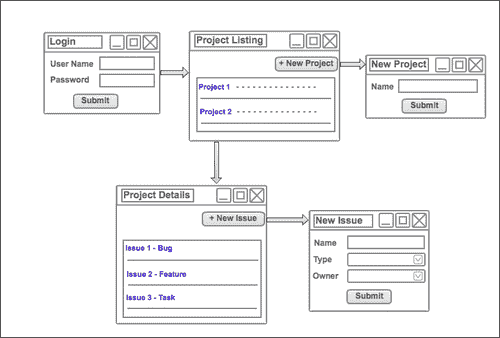
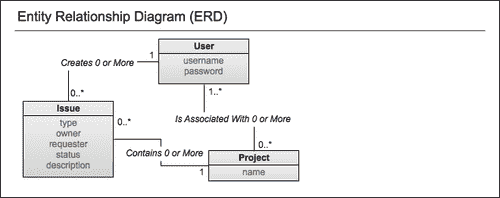

# 第三章轨道之星应用

我们可以继续添加到简单的“Hello，World！”应用程序中，以提供 Yii 功能的示例，但这对在实际应用程序的上下文中理解框架并没有帮助。为了做到这一点，我们需要构建更接近 web 开发人员实际必须构建的应用程序类型的东西。这正是我们在本书其余部分将要做的。

在本章中，我们将介绍名为**TrackStar**的项目任务跟踪应用程序。世界上还有许多其他的项目管理和问题跟踪应用程序，我们的基本功能与这些应用程序没有任何不同。你会问，为什么要建造它？事实证明，这种基于用户的应用程序具有许多 web 应用程序所共有的特性。这将使我们能够实现两个主要目标：

*   展示 Yii 令人难以置信的实用程序和功能集，帮助我们构建有用的功能并克服现实世界中的 web 应用程序挑战
*   提供将立即适用于下一个 web 应用程序项目的真实示例和方法

# 介绍 TrackStar

TrackStar 是一个**软件开发生命周期**（**SDLC**的问题管理应用程序。它的主要目标是帮助跟踪在构建软件应用程序过程中出现的许多问题。它是一个基于用户的应用程序，允许创建用户帐户，并在用户经过身份验证和授权后授予对应用程序功能的访问权。它允许用户添加和管理项目。

项目可以有与其关联的用户（通常是从事项目的团队成员）以及问题。项目问题将是诸如开发任务和应用程序错误之类的问题。可将问题分配给项目成员，其状态为*尚未开始*、*开始*、*完成*。通过这种方式，跟踪工具可以准确描述已完成的项目、目前正在进行的项目和尚未开始的项目。

# 创建用户故事

简单的用户故事是识别应用程序必要功能的好方法。用户故事，以其最简单的形式，说明用户可以用软件做什么。它们应该从简单开始，随着您深入了解每个特性越来越多的细节，它们的复杂性也会增加。我们的目标是以足够的复杂性开始，让我们开始。如有必要，我们将在稍后添加更多细节。

我们简要介绍了在本应用程序中扮演重要角色的三个主要实体，即*用户*、*项目*和*问题*。这些是我们的主要域对象，是此应用程序中极其重要的项。让我们从他们开始。

## 用户

TrackStar 是一个基于用户的 web 应用程序。在高级别，用户可以处于两种用户状态之一：

*   匿名的
*   认证

**匿名**用户是未通过登录过程进行身份验证的应用程序的任何用户。匿名用户只能注册新帐户或登录。所有其他功能将仅限于经过身份验证的用户。

**认证**用户是指通过登录过程提供有效认证凭证的任何用户。换句话说，经过身份验证的用户是已登录的用户。经过身份验证的用户将可以访问应用程序的主要功能，例如创建和管理项目以及项目问题。

## 项目

管理项目是TrackStar 应用程序的主要目的。项目代表应用程序的一个或多个用户要实现的一般、高级目标。项目通常被分解为更细粒度的任务或问题，这些任务或问题代表了实现总体目标所需采取的较小步骤。

作为一个例子，让我们以本书中我们将要做的事情为例，即构建一个项目和问题跟踪管理应用程序。不幸的是，我们不能将尚未创建的应用程序用作帮助我们跟踪其自身开发的工具，但如果可以，我们可能会创建一个名为“构建 TrackStar 项目/问题管理工具”的项目。该项目将被分解为更细粒度的项目问题，例如，“创建登录屏幕”、“为问题设计数据库模式”等等。

经过身份验证的用户可以创建新项目。账户中项目的创建者将在该项目中扮演一个特殊角色，称为**项目所有者**。项目所有者可以编辑和删除这些项目以及向项目添加新成员。除项目业主外，与项目相关的其他用户简称为**项目成员**。项目成员将能够添加新问题以及编辑现有问题。

## 问题

项目问题将分为三类：

*   **特性**：表示要添加到应用程序中的真实特性的项。例如，登录功能的实现。
*   **任务**：表示需要完成的工作但不是软件实际功能的项目。例如，设置构建和集成服务器。
*   **bug**：表示应用程序行为未按预期工作的项。例如，帐户注册表单不会验证输入电子邮件地址的格式。

问题可以处于以下三种状态之一：

*   尚未开始
*   起动
*   完成了

项目成员可以向项目中添加新问题，也可以编辑和删除这些问题。他们可以将问题分配给自己或其他项目成员。

目前，这是关于这三个主要实体的足够信息，使我们能够向前迈进。我们可以更详细地讨论“帐户注册到底需要什么？”或“如何向项目添加新任务？”，但我们已经概述了足够的规范，可以从这些基本特性开始。我们将在执行过程中确定更详细的细节。

但是，在开始之前，我们应该记下一些基本的导航和应用程序工作流。这将帮助每个人更好地理解我们正在构建的应用程序的总体布局和流程。

# 导航和页面流

概述应用程序中的主要页面并查看它们是如何组合在一起的总是好的。这将有助于我们快速确定一些需要的 Yii 控制器、操作和视图，并有助于设定每个人对我们在开发之初将要实现的目标的期望。

下图显示了从登录到项目详细信息列表的基本应用流程：



当用户第一次访问应用程序时，他们必须先登录并进行身份验证，然后才能继续使用任何功能。成功登录后，他们将看到当前项目的列表以及创建新项目的能力。选择一个特定的项目会将他们带到项目详细信息页面。项目详细信息页面将按类型显示问题列表。还将能够添加新问题以及编辑任何列出的问题。

这都是非常基本的功能，但图中提供了更多关于如何将应用程序缝合在一起的信息，使我们能够更好地识别所需的模型、视图和控制器。它还允许与其他人分享一些视觉信息，这样每个参与的人都有相同的*画面我们正在努力的方向。根据我的经验，当第一次考虑新的应用程序时，几乎每个人都喜欢图片而不是书面规范。*

# 数据关系

当我们开始按照这些规范进行构建时，我们仍然需要更多地考虑我们将使用的数据。如果我们从我们的系统中挑选出所有的主要名词，我们可能会得到一个相当好的域对象列表，通过使用活动记录，我们可能会得到我们想要建模的数据。我们之前概述的用户案例确定了以下内容：

*   使用者
*   工程
*   问题

基于此以及用户情景和应用程序工作流图中提供的其他详细信息，下图显示了对必要数据模型的首次尝试：



这是一个非常基本的对象模型，概述了我们的主要数据实体、它们各自的属性以及它们之间的一些关系。项目和用户对象之间直线两侧的 1..*和 0..*表示它们之间存在多对多关系。一个用户可以与零个或多个项目关联，并且一个项目有一个或多个用户。类似地，我们表示了一个项目可以有 0 个或多个与之关联的问题，而一个问题只属于一个特定的项目。此外，用户可以是许多问题的所有者（或请求者），但一个问题只有一个所有者（也只有一个请求者）。

在这一阶段，我们将属性尽可能简单。用户需要用户名和密码才能通过登录屏幕。该项目只有一个名称属性。

根据我们目前对问题的了解，问题具有最相关的信息。正如前面定义的用户情景中简要讨论的，问题将有一个 type 属性来区分一般类别（bug、特性或任务）。它们还将具有状态属性，以指示正在处理的问题的进度。将有一个登录用户最初创建问题；这是请求者。一旦系统中的某个用户被指派处理该问题，他们将成为该问题的所有者。我们还定义了 description 属性，以允许输入问题的一些描述性文本。

请注意，我们还没有明确讨论模式或数据库。事实是，在我们从数据的角度思考真正需要什么之前，我们不知道使用什么工具来存储这些数据。文件系统上的平面文件会像关系数据库一样工作吗？我们需要持久化数据吗？

在早期规划阶段，这些问题的答案并不总是必要的。最好更多地关注我们想要的功能以及支持这些功能所需的数据类型。在我们有机会与其他项目干系人讨论这些想法之后，我们可以转向明确的技术实现细节，以确保我们走上了正确的轨道。其他项目干系人包括参与该开发项目的任何人和所有人。如果您正在为其他人构建应用程序，这可能包括客户机，以及其他开发团队成员、产品/项目经理等。从“团队”那里获得一些反馈，以帮助验证方法和所做的任何假设，这始终是一个好主意。

在我们的例子中，实际上没有其他人参与这项开发工作。因此，我们可以快速得出一些结论来回答与数据相关的问题，并继续我们的应用程序开发。

由于这是一个基于 web 的应用程序，并且考虑到我们需要存储、检索和操作的信息的性质，我们可以得出结论，最好将数据持久保存在此应用程序中。此外，基于我们想要捕获和管理的数据类型之间存在的关系，将这些数据存储在关系数据库中是一种很好的方法。基于它的易用性、优异的价位、它在 PHP 应用程序开发人员中的普遍流行性以及它与 Yii 框架的兼容性，我们将使用 MySQL 作为特定的数据库服务器。

现在我们已经知道了我们将要开始建设什么，以及我们将如何开始建设，让我们开始吧。

# 创建新的应用程序

首先，让我们创建最初的 Yii web应用程序。我们已经在[第 2 章](02.html "Chapter 2. Getting Started")、*入门*中看到了这是多么容易实现。正如我们在那里所做的那样，我们将假设：

*   `YiiRoot`是您安装 Yii 的目录
*   `WebRoot`配置为您的 web 服务器的文档根目录（即`http://localhost/`解析的位置）

因此，从命令行，切换到您的`WebRoot`目录并执行以下操作：

```php
% YiiRoot/framework/yiic webapp trackstar
Create a Web application under '/Webroot/trackstar'? [Yes|No] Yes

```

这为我们提供了框架目录结构和现成的工作应用程序。您应该能够通过导航到`http://localhost/trackstar/index.php?r=site/index`来查看此新应用程序的主页。

### 注

因为我们的默认控制器是 SiteController，并且该控制器中的默认操作是`actionIndex()`，所以我们也可以导航到同一页面，而无需指定路由。

# 连接到数据库

现在，我们已经启动并运行了框架应用程序，让我们将其正确连接到数据库。事实上，骨架应用程序被自动配置为使用数据库。使用`yiic`工具的副产品是，我们的新应用程序被配置为使用 SQLite 数据库。如果您查看位于`protected/config/main.php`的主应用程序配置文件，您将在大约一半的时间内看到以下声明：

```php
'db'=>array('connectionString' => 'sqlite:'.dirname(__FILE__).'/../data/testdrive.db',
    ),
```

您还可以验证`protected/data/testdrive.db`是否存在，这是配置为使用的 SQLite 数据库。

由于我们已经决定使用 MySQL，我们需要进行一些配置更改。但是，在我们将配置更改为使用 MySQL 数据库服务器之前，让我们先简单介绍一下 Yii 和数据库。

## Yii 与数据库

Yii 为数据库编程提供了强大的支持。Yii 的**数据访问对象**（**DAO**）构建在**PHP D****ata 对象**（**PDO**扩展（[之上 http://php.net/pdo](http://php.net/pdo) 。这是一个数据库抽象层，使应用程序能够通过独立于数据库的接口与数据库交互。所有受支持的**数据库管理系统**（**DBMS**都封装在一个统一的接口后面。通过这种方式，代码可以保持与数据库无关，并且使用 Yii-DAO 开发的应用程序可以很容易地切换到使用不同的 DBMS，而无需修改。

要与支持的 DBMS 建立连接，只需创建一个新的`CDbConnection`实例：

```php
$connection=new CDbConnection($dsn,$username,$password);
```

此处，`$dsn`变量的格式取决于所使用的特定 PDO 数据库驱动程序。一些常见格式包括：

*   SQLite:`sqlite:/path/to/dbfile`
*   MySQL:`mysql:host=localhost;dbname=testdb`
*   PostgreSQL:`pgsql:host=localhost;port=5432;dbname=testdb`
*   SQL Server:`mssql:host=localhost;dbname=testdb`
*   甲骨文：`oci:dbname=//localhost:1521/testdb`

`CDbConnection`还扩展自`CApplicationComponent`，允许将其配置为应用程序组件。这意味着我们可以将其添加到应用程序的 components 属性中，并在主配置文件中自定义类和属性值。这是我们首选的方法，我们将在下面详细介绍。

#### 添加 db 连接作为应用组件

让我们后退一步。创建初始应用程序时，我们将应用程序类型指定为 web 应用程序。还记得我们在命令行上指定了`webapp`吗。这样做指定在每次请求时创建的应用程序单例类的类型为`CWebApplication`。这个 Yii 应用程序单例是运行所有请求处理的执行上下文。它的主要任务是解析用户请求并将其路由到适当的控制器进行进一步处理。这在[第 1 章](01.html "Chapter 1. Meet Yii")、*满足 Yii*中使用的图表中表示为 Yii 应用路由器，当时我们讨论了请求路由。它也是保存应用程序级配置值的中心位置。

为了自定义应用程序配置，我们通常提供一个配置文件，以便在创建应用程序实例时初始化其属性值。主应用程序配置文件位于`/protected/config/main.php`中。这是一个包含键值对数组的 PHP 文件。每个键表示应用程序实例的属性名称，每个值都是相应属性的初始值。如果打开此文件，您将看到已经为我们配置了多个设置。

向配置中添加应用程序组件很容易。打开文件（`/protected/config/main.php`并找到 components 属性。

我们可以看到，已经有条目指定了`log`和`user`应用程序组件。这些将在后面的章节中介绍。我们还可以看到（正如我们前面提到的）还有一个`db`组件，配置为使用 SQLite 连接到位于`protected/data/testdrive.db`的 SQLite 数据库。还有一个注释掉的部分定义了这个`db`组件以使用 MySQL 数据库。我们需要做的就是删除 SQLite`db`组件定义，取消对定义 MySQL 组件的部分的注释，然后进行适当的更改，以匹配您的数据库名称、用户名和密码，从而建立连接。以下代码显示了此更改：

```php
// application components
  'components'=>array(
    …
    //comment out or remove the reference to the sqlite db
/*
'db'=>array(
      'connectionString' => 'sqlite:'.dirname(__FILE__).'/../data/testdrive.db',
    ),
*/
    // uncomment the following to use a MySQL database
        'db'=>array(
      'connectionString' => 'mysql:host=localhost;dbname=trackstar',
      'emulatePrepare' => true,
      'username' => '[your-db-username]',
      'password' => '[your-db-password]',
      'charset' => 'utf8',
    ),
```

这假设已经创建了一个名为`trackstar`的 MySQL 数据库，可以使用 localhost 进行连接。根据您的环境，您可能需要指定本地主机 IP 为`127.0.0.1`而不是`localhost`。将其作为应用程序组件的最大好处之一是，现在，在整个应用程序中的任何地方，我们都可以简单地将数据库连接引用为主要 Yii 应用程序`Yii::app()->db`的属性。类似地，我们可以将其用作`config`文件中定义的任何其他组件的参考。

### 注

当设置为`'utf8'`时，`charset`属性设置用于数据库连接的字符集。此属性仅用于 MySQL 和 PostgreSQL 数据库。它将默认为 null，这意味着它将使用默认的字符集。我们在这里设置它是为了确保我们的 PHP 应用程序正确地支持`utf8`unicode 字符。

`emulatePrepare => true`配置将 PDO 属性（PDO:：ATTR_EMULATE_PREPARES）设置为`true`，如果您使用的是 PHP5.1.3 或更高版本，建议使用该属性。这是添加到 PHP5.1.3 中的，使用时会使用 PDO 原生查询解析器，而不是 MySQL 客户端中的原生语句 API。MySQL 客户机中本机准备的语句无法利用查询缓存，因此已知会导致性能低下。PDO 原生查询解析器可以使用查询缓存，因此建议使用此选项（如果可用）（PHP 5.1.3 或更高版本）。

因此，我们指定了一个名为`trackstar`的 MySQL 数据库，以及连接到此数据库所需的用户名和密码。我们没有向您展示如何在 MySQL 中创建这样的数据库。我们假设您了解如何设置 MySQL 数据库以及如何使用它。如果您不确定如何创建一个名为`trackstar`的新数据库，并为连接配置用户名和密码，请参阅您的特定数据库文档。

# 测试数据库连接

在继续之前，我们应该确保我们的数据库连接实际工作正常。我们有几种方法可以做到这一点。我们将研究两种方法。在第一种方法中，我们将使用`yiic`命令行工具为我们的应用程序启动一个交互式 shell，并确保在尝试引用应用程序`db`组件时没有错误。然后，我们将提供第二种方法，介绍使用 PHPUnit 在 Yii 中进行单元测试。

## 使用交互 shell

我们将从使用 Yii 交互式 shell 的一个简单测试开始。您还记得，我们使用了`webapp`命令和`yiic`命令行实用程序来创建我们的新应用程序。与此实用程序一起使用的另一个命令是`shell`。这允许您在 Yii 应用程序的上下文中直接从命令行运行 PHP 命令。

要启动 shell，请导航到应用程序的根目录，即包含`index.php`条目脚本`Webroot/trackstar/`的目录。然后运行`yiic`实用程序，将`shell`作为命令传入（参见下面的屏幕截图）。


这将启动 shell，并允许您在**>>**提示后直接输入命令。

我们要做的是测试我们的连接，以确保我们的数据库连接应用程序组件是可访问的。我们可以简单地`echo`输出连接字符串，并验证它是否返回我们在配置中设置的值。因此，在 shell 提示符中键入以下命令：

```php
>> echo Yii::app()->db->connectionString;

```

它应该与以下内容类似：

**mysql:host=localhost；dbname=trackstar**

这表明`db`应用程序组件配置正确，可在我们的应用程序中使用。

## 自动测试-单元和功能测试

收集反馈对于应用程序开发至关重要；来自应用程序用户和其他项目干系人的反馈，来自开发团队成员的反馈，以及直接来自软件本身的反馈。开发软件时，如果软件能够告诉您什么时候出现了问题，那么集成和部署应用程序的恐惧就会变成无聊。通过这种反馈机制，您可以授权您的软件的方法是编写自动化的单元和功能测试，然后反复经常地执行它们。

### 单元和功能测试

编写单元测试是为了向开发人员验证代码是否正确。编写功能测试是为了向开发人员以及其他项目干系人验证应用程序作为一个整体是否以正确的方式运行。

#### 单元测试

单元测试是针对软件应用程序中最小单元的测试。在面向对象的应用程序中，例如 Yii web 应用程序，最小的单元是构成类接口的公共方法。单元测试应该关注单个类，而不需要其他类或对象来运行它。它们的目的是验证单个代码单元是否按预期工作。

#### 功能测试

功能测试侧重于测试应用程序的端到端功能。这些测试的级别高于单元测试，并且通常需要运行多个类或对象。它们的目的是验证应用程序的给定功能是否按预期工作。

## 测试的好处

编写单元测试和功能测试有很多好处。首先，它们是提供文档的好方法。单元测试可以快速准确地说明代码块存在的原因。类似地，功能测试记录了应用程序中实现的功能。如果您一直努力编写这些测试，那么随着应用程序的发展，文档将继续自然地发展。

它们也是非常宝贵的反馈机制，可以不断向开发人员和其他项目干系人保证代码和应用程序按预期工作。每次对代码进行更改时，您都会运行测试，并立即获得有关您所更改的内容是否无意中更改了系统的预期行为的反馈。然后，您可以立即解决这些问题。这确实增加了开发人员对应用程序的信心，并转化为更少的错误和更成功的项目。

这种即时反馈也有助于促进代码的更改和改进设计。如果有一套测试能够立即提供关于所做更改是否改变了应用程序行为的反馈，那么开发人员更有可能对现有代码进行改进。一套单元和功能测试提供的信心使开发人员能够编写更好的软件，发布更稳定的应用程序，并提供高质量的产品。

## 在 Yii 进行测试

从版本 1.1 开始，Yii 与 PHPUnit（[）紧密集成 http://www.phpunit.de/](http://www.phpunit.de/) 和硒遥控器（[http://seleniumhq.org/projects/remote-control/](http://seleniumhq.org/projects/remote-control/) 测试框架。您当然可以使用任何可用的测试框架来测试 Yii-PHP 代码。然而，Yii 与前面提到的两个框架的紧密集成使事情变得更加容易。让事情变得简单是我们的主要目标之一。

当我们使用`yiic webapp`控制台命令创建新的 web 应用程序时，我们注意到许多文件和目录是自动为我们创建的。其中与编写和执行自动化测试相关的有：

<colgroup><col style="text-align: left"> <col style="text-align: left"></colgroup> 
| 

文件/目录

 | 

包含/存储

 |
| --- | --- |
| `trackstar/` | 包含“文件/目录”列中列出的所有文件 |
| `protected/` | 受保护的应用程序文件 |
| `tests/` | 应用程序的测试 |
| `fixtures/` | 数据库设备 |
| `functional/` | 功能测试 |
| `unit/` | 单元测试 |
| `report/` | 覆盖率报告 |
| `bootstrap.php` | 在测试开始时执行的脚本 |
| `phpunit.xml` | PHPUnit 配置文件 |
| `WebTestCase.php` | 基于 web 的功能测试的基类 |

您可以将测试文件放在三个主目录中，即`fixtures`、`functional`和`unit`。`report`目录用于存储生成的代码覆盖率报告。

### 注

为了生成报告，必须安装 PHP 扩展 XDebug。有关此安装的详细信息，请参见[http://xdebug.org/docs/install](http://xdebug.org/docs/install) 。以下示例不需要此扩展。

## 单元测试

Yii 中的单元测试是作为一个 PHP 类编写的，该类从框架类`CTestCase`扩展而来。约定将其命名为`AbcTest`，其中`Abc`由被测试类的名称替换。例如，如果我们要在[第 2 章](02.html "Chapter 2. Getting Started")*入门*中的“Hello，World！”应用程序中测试`MessageController`类，我们会将测试类命名为`MessageControllerTest`。此类保存在目录`protected/tests/unit/`下名为`MessageControllerTest.php`的文件中。

test 类主要有一组名为`testXyz`的测试方法，其中`Xyz`通常与编写测试的方法名称相同。

继续`MessageController`示例，如果我们正在测试`actionHelloworld()`方法，我们将在`MessageControllerTest`类中命名相应的测试方法`testActionHelloworld()`。

### 安装 PHPUnit

从版本 1.1 开始，Yii 与PHPUnit（[）紧密集成 http://www.phpunit.de/](http://www.phpunit.de/) 测试框架。

为了完成本例，您需要安装 PHPUnit。这应该使用 Pear 安装程序来完成。（有关 Pear 的更多信息，请参见[http://pear.php.net/](http://pear.php.net/) 。请访问以下 URL，了解如何根据您的环境配置安装 PHPUnit 的更多信息：

[https://github.com/sebastianbergmann/phpunit/](https://github.com/sebastianbergmann/phpunit/)

### 注

具体介绍 PHPUnit 的测试特性肯定超出了本书的范围。建议您花一些时间阅读文档，了解行话和编写基本单元测试：[https://github.com/sebastianbergmann/phpunit/](https://github.com/sebastianbergmann/phpunit/)

## 测试连接

假设您已成功安装 PHPUnit，我们可以在`protected/tests/unit/`下为我们的数据库连接添加测试。让我们在此目录下创建一个名为`DbTest.php`的简单数据库连接测试文件。使用以下内容添加此新文件：

```php
<?php
class DbTest extends CTestCase
{  
     public function testConnection()
     {
        $this->assertTrue(true);
     }
}
```

这里我们添加了一个相当简单的测试。作为 PHPUnit 的一部分的`assertTrue()`方法是一个断言，如果传递给它的参数是`true`，它将传递，如果是`false`，它将失败。在这种情况下，测试`true`是否为`true`。所以这个测试一定会通过。我们这样做是为了确保我们的新应用程序在 PHPUnit 测试中按预期工作。导航到“测试”文件夹并执行此新测试：

```php
%cd /WebRoot/trackstar/protected/tests
%phpunit unit/DbTest.php

 …
 Time: 0 seconds, Memory: 10.00Mb

 OK (1 test, 1 assertion)
```

### 注

如果由于某种原因，此测试在您的系统上失败，您可能需要更改`protected/tests/bootstrap.php`，以便变量`$yiit`正确指向您的`/YiiRoot/yiit.php`文件。

我们确信我们的测试框架在我们新创建的TrackStar 应用程序中按预期工作，我们可以使用它为`db`连接编写测试。

将`testConnection()`测试方法中的`assertEquals(true)`语句更改为：

```php
$this->assertNotNull(Yii::app()->db->connectionString); 
```

然后重新运行测试：

```php
%phpunit unit/DbTest.php

	 …
	 Time: 0 seconds, Memory: 10.00Mb

	 OK (1 test, 1 assertion)

```

正如您所记得的，由于我们将数据库连接配置为名为`db`的应用程序组件，`Yii::app()->db`应该返回`CDbConnection`类的实例。如果应用程序无法建立数据库连接，此测试将返回错误。由于测试仍然通过，我们可以放心地继续前进，确保数据库连接设置正确。

# 总结

本章介绍了任务跟踪应用程序 TrackStar，我们将在本书的其余部分开发它。我们讨论了应用程序是什么及其功能，并以非正式用户故事的形式为应用程序提供了一些高级需求。然后，我们确定了需要创建的一些主要域对象，以及需要容纳和管理的一些数据。

然后，我们朝着构建 TrackStar 应用程序迈出了第一步。我们创建了一个新的应用程序，其中包含自动生成代码中“免费”提供的所有工作功能。我们还将应用程序配置为连接到 MySQL 数据库，并演示了两种测试该连接的方法。一种方法演示了 Yii 与 PHPUnit 的集成，以及如何为 Yii 应用程序编写自动化测试。

在下一章中，我们将最终深入到更复杂的功能中。我们将开始进行一些实际的编码，以实现在应用程序中管理项目实体所需的功能。