# 四、CURD 项目

现在，我们已经有了一个基本的应用程序，并配置为与数据库通信，我们可以开始研究应用程序的一些真正功能了。我们知道“项目”是应用程序中最基本的组件之一。如果用户不首先创建或选择一个现有项目，在其中添加任务和其他问题，则无法使用 TrackStar 应用程序执行任何有用的操作。出于这个原因，我们希望首先将重点放在将一些项目功能引入应用程序上。

# 特征规划

在本章的工作结束时，我们的应用程序应该允许用户创建新项目、从现有项目列表中选择、更新/编辑现有项目以及删除现有项目。

为了实现这一目标，我们应该确定需要关注的更细粒度的任务。下表列出了我们在本章中要完成的任务：

*   设计数据库模式以支持项目
*   构建必要的表和模式中标识的所有其他数据库对象
*   创建允许应用程序轻松与创建的数据库表交互所需的 Yii AR 模型类
*   创建包含以下功能的 Yii 控制器类：
    *   创建新项目
    *   检索要显示的现有项目列表
    *   更新与现有项目关联的数据
    *   删除现有项目
*   创建 Yii 视图文件和表示层逻辑，该逻辑将：
    *   显示表单以允许创建新项目
    *   显示所有现有项目的列表
    *   显示表单以允许用户编辑现有项目
    *   在项目列表中添加删除按钮以允许删除项目

这当然足以让我们开始。

# 创建项目表

回到[第 3 章](03.html "Chapter 3. The TrackStar Application")*TrackStar 应用程序*，我们讨论了代表一个项目的基础数据，我们决定使用 MySQL 关系数据库来构建这个应用程序的持久层。现在，我们需要设计并构建一个表来保存我们的项目数据。

我们知道项目需要有名称和描述。我们还将通过跟踪记录的创建和更新时间以及谁创建和更新了记录，在每个表上保留一些基本的表审核信息。

基于这些属性，以下是项目表的外观：

```php
CREATE TABLE tbl_`project` (
`id` INTEGER NOT NULL auto_increment,
`name` varchar(255) NOT NULL,
`description` text NOT NULL,
`create_time` DATETIME default NULL,
`create_user_id` INTEGER default NULL,
`update_time` DATETIME default NULL,
`update_user_id` INTEGER default NULL,
PRIMARY KEY  (`id`)
) ENGINE = InnoDB
;
```

现在，在我们开始使用我们最喜欢的 MySQL 数据库编辑器创建这个表之前，我们需要讨论如何使用 Yii 来管理在构建 TrackStar 应用程序时数据库模式中发生的更改。

## Yii 数据库迁移

我们知道跟踪应用程序源代码的版本更改是一种很好的做法。当您在构建我们的 TrackStar 应用程序时，明智的做法是使用 SVN 或GIT 等版本控制软件来帮助管理我们在构建过程中对代码库所做的所有更改。如果我们的代码库更改与数据库更改不同步，那么整个应用程序很可能会崩溃。因此，管理我们将要对数据库进行的结构更改也将是非常棒的。

Yii 在这方面帮助我们。Yii 提供了一个数据库迁移工具，它可以跟踪数据库迁移历史，并允许我们应用新的迁移以及恢复现有的迁移，以便将数据库结构恢复到以前的状态。

Yii 迁移实用程序是一个控制台命令，我们与`yiic`命令行工具一起使用。作为控制台命令，它使用特定于控制台命令的配置文件，默认情况下为`protected/config/console.php`。我们需要在此文件中正确配置数据库组件。正如我们在`main.php config`文件中所做的那样，我们需要定义`db`组件以使用 MySQL数据库。如果你打开`protected/config/console.php`配置文件，你会看到它已经定义了一个 MySQL 配置，但是它被注释掉了。让我们删除 SQLite 配置并取消对 MySQL 配置的注释，根据您的数据库设置更改用户名和密码：

```php
'components'=>array(	
'db'=>array(
    'connectionString' => 'mysql:host=localhost;dbname=trackstar',
    'emulatePrepare' => true,
    'username' => '[YOUR-USERNAME]',
    'password' => '[YOUR-PASSWORD]',
    'charset' => 'utf8',
  ),
),
```

现在我们已经进行了配置更改，可以继续创建迁移了。为此，我们使用`yiic`命令行实用工具和`migrate`命令。创建迁移的一般形式为：

```php
$ yiic migrate create <name>

```

这里，所需的`name`参数允许我们指定正在进行的数据库更改的简要描述。`name`参数用作迁移文件名和 PHP 类名的一部分。因此，它应该只包含字母、数字或下划线字符。Yii 接受输入的 name 参数，并附加一个 UTC 时间戳（格式为*yymmdd_hhmmss*），字母*m*用于迁移，用作文件名和 PHP 类名。让我们继续为我们的项目表创建一个新的迁移，这个命名约定将变得更清晰。从命令行导航到应用程序`protected/`目录，然后发出命令，使用名称`create_project_table`创建新迁移：


这将创建具有以下内容的文件`/Webroot/trackstar/protected/migrations/m121108_195611_create_project_table.php`：

```php
class m121108_195611_create_project_table extends CDbMigration
{
  public function up()
  {
  }

  public function down()
  {
    echo "m121108_195611_create_project_table does not support migration down.\n";
    return false;
  }

  /*
  // Use safeUp/safeDown to do migration with transaction
  public function safeUp()
  {
  }

  public function safeDown()
  {
  }
  */
}
```

当然，为了让它创建新表，我们必须对此文件进行一些更改。我们实现了`up()`方法来应用所需的数据库更改，并实现了`down()`方法来恢复这些更改，这将允许我们恢复到数据库结构的早期版本。`safeUp()`和`safeDown()`方法类似，但它们将在数据库事务中执行更改，以便将整个迁移视为一个原子单元，以全有或全无的方式执行。在这种情况下，我们要应用的更改是创建一个新表，我们可以通过删除该表来恢复此更改。这些变化如下：

```php
public function up()
{
  $this->createTable('tbl_project', array(
    'id' => 'pk',
     'name' => 'string NOT NULL',
    'description' => 'text NOT NULL',
    'create_time' => 'datetime DEFAULT NULL',
    'create_user_id' => 'int(11) DEFAULT NULL',
    'update_time' => 'datetime DEFAULT NULL',
    'update_user_id' => 'int(11) DEFAULT NULL',
  ), 'ENGINE=InnoDB');
}

public function down()
{
  $this->dropTable('tbl_project');
}
```

保存更改后，我们可以执行迁移。仍然在`protected/`目录中执行迁移，如下所示：

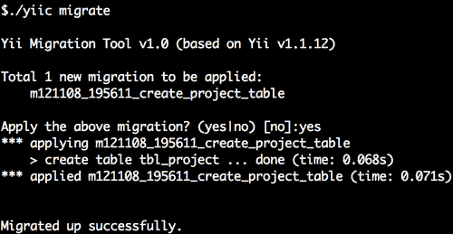

使用不带参数的 migrate 命令将导致对每个尚未应用的迁移执行向上迁移（即执行`up()`方法）。而且，由于这是我们第一次运行迁移，Yii 将自动为我们创建一个新的迁移历史表`tbl_migration`。Yii 使用此表跟踪已应用的迁移。如果我们指定*down*作为 migrate 命令的命令行参数，则最后应用的迁移将通过运行该迁移的`down()`方法恢复。

现在我们已经应用了迁移，新的`tbl_project`表已经创建，可以使用了。

### 注

在开发 TrackStar 应用程序的过程中，我们将在本书中使用 Yii 迁移，因此我们将在使用它们的过程中继续了解更多。有关 Yii 迁移的更多详细信息，请参阅：

[http://www.yiiframework.com/doc/guide/1.1/en/database.migration](http://www.yiiframework.com/doc/guide/1.1/en/database.migration)

## 命名约定

您可能已经注意到，我们以小写形式定义了数据库表以及所有列名。在整个开发过程中，我们将对所有表名和列名使用小写字母。这主要是因为不同的 DBMS 处理大小写敏感度不同。例如，**PostgreSQL**默认情况下将列名视为不区分大小写，如果列包含大小写混合的字母，则必须在查询条件中引用列。使用小写将有助于消除此问题。

您可能还注意到，我们在命名 projects 表时使用了`tbl_`前缀。从 1.1.0 版开始，Yii 为使用表前缀提供了集成支持。表前缀是在表名称前面加上的字符串。它通常用于共享托管环境，其中多个应用程序共享一个数据库，并使用不同的表前缀来区分彼此；数据库对象的一种名称间距。例如，一个应用程序可以使用`tbl_`作为前缀，而另一个应用程序可以使用`yii_`。此外，一些数据库管理员将此作为命名约定，以标识符作为数据库对象的前缀，说明它们是什么类型的实体或将要使用什么类型的实体。它们使用前缀来帮助将对象组织到类似的组中。使用表前缀是一种偏好，当然不是必需的。

为了充分利用 Yii 中集成的表前缀支持，必须适当地将`CDbConnection::tablePrefix`属性设置为所需的表前缀。然后，在整个应用程序中使用的 SQL 语句中，可以使用`{{TableName}}`来引用表名，其中`TableName`是表名，但没有前缀。例如，如果要进行此配置更改，可以使用以下代码查询所有项目：

```php
$sql='SELECT * FROM {{project}}';
$projects=Yii::app()->db->createCommand($sql)->queryAll();
```

但这有点超前了。让我们暂时保持配置不变，稍后在应用程序开发中进入数据库查询时再讨论这个主题。

# 创建 AR 模型类

现在我们已经创建了`tbl_project`表，我们需要创建 Yii 模型类，以便轻松管理该表中的数据。我们在[第一章](01.html "Chapter 1. Meet Yii")中介绍了 Yii 的 ORM 层**活动记录**（AR），*满足 Yii*。现在我们将在这个应用程序的上下文中看到一个具体的例子。

## 配置 Gii

回到[第 2 章](02.html "Chapter 2. Getting Started")*入门*当我们构建简单的“你好，世界！”Yii 应用程序时，我们引入了代码生成工具**Gii**。如果您还记得，在开始使用 Gii 之前，我们必须将其配置为在应用程序中使用。我们需要在新的 TrackStar 应用程序中再次这样做。作为提醒，要配置 Gii 以供使用，请打开`protected/config/main.php`，Gii 模块定义如下：

```php
return array(
  …
  …
  'modules'=>array(
'gii'=>array(
        'class'=>'system.gii.GiiModule',
        'password'=>false,
        // If removed, Gii defaults to localhost only. Edit carefully to taste.
        'ipFilters'=>array('127.0.0.1','::1'),
    ),
    …
  ),
```

这将 Gii 配置为应用程序模块。我们将在本书后面详细介绍 Yii*模块*。此时，重要的是确保将其添加到配置文件中，并且您提供了密码（或者为开发环境将密码设置为`false`，以避免登录屏幕提示）。现在，通过转到`http://localhost/trackstar/index.php?r=gii`导航到该工具。

## 使用 Gii 创建我们的项目 AR 类

Gii 的主菜单页面如下所示：

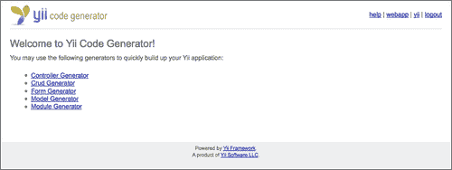

因为我们想为`tbl_project`表创建一个新的模型类，**模型生成器**选项似乎是正确的选择。点击该链接，我们将进入以下页面：

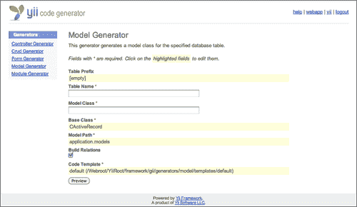

**表前缀**字段主要用于帮助 Gii 确定如何命名我们正在生成的 AR 类。如果您使用的是前缀，可以将其添加到此处。这样，在命名新类时就不会使用该前缀。在我们的例子中，我们使用的是`tbl_`前缀，所以我们应该在这里指定它。指定此值意味着我们新生成的 AR 类将命名为`Project`，而不是`Tbl_project`。

接下来的两个字段询问我们的表名以及我们希望它生成的类文件的名称。在**表名**字段中输入我们表的名称`tbl_project`，并观察**模型类**名称自动生成。**模型类**名称的约定是表名减去前缀，并以大写字母开头。因此，它将假定我们的模型类名称为 Project，但您当然可以自定义它。

接下来的几个字段允许进一步定制。**基类**字段用于指定模型类将从中扩展的类。这需要是`CActiveRecord`或其子类。**模型路径**字段允许我们指定在应用程序目录结构中的何处输出新文件。默认为`protected/models/`（别名`application.models`。**Build Relations**复选框允许您决定是否让 Gii 使用 MySQL 数据库表之间定义的关系自动定义 AR 对象之间的关系。默认情况下，它处于选中状态。最后一个字段允许我们指定代码生成所基于的模板。我们可以自定义默认类文件，以满足所有此类类文件可能共有的任何特定需求。目前，这些字段的默认值正好满足我们的需要。

点击**预览**按钮继续。这将导致在页面底部显示下表：


此链接允许您预览将生成的代码。在点击**生成**之前，点击`models/Project.php`链接。以下屏幕截图显示了此预览的外观：

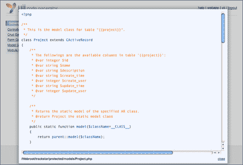

它提供了一个可滚动的弹出窗口，以便我们可以预览将生成的文件。

好的，关闭这个弹出窗口，然后点击**生成**按钮。假设一切顺利，您应该会在页面底部看到如下屏幕截图：


### 提示

在尝试生成新模型类之前，请确保 Gii 尝试创建新文件的路径`protected/models/`（或者如果您更改了位置，则在**模型路径**表单字段中指定的任何目录路径）可由 web 服务器进程写入。否则，您将收到写入权限错误。

Gii 为我们创建了一个新的 Yii 活动记录模型类，并按照我们的指示将其命名为`Project.php`。正如我们所指示的，它还将其放置在模型类的默认 Yii 位置`protected/models/`。这个类是我们的`tbl_project`数据库表的包装类。`tbl_project`表中的所有列都可以作为`Project`AR 类的属性访问。

# 为项目启用 CRUD 操作

我们现在有了一个新的 AR 模型类，但是现在呢？通常在 MVC 架构中，我们需要一个控制器和一个视图来配合我们的模型来完成这幅图。在我们的例子中，我们需要能够在应用程序中管理我们的项目。我们需要能够创建新项目、检索现有项目的信息、更新现有项目的信息以及删除现有项目。我们需要添加一个控制器类，该类将在我们的模型类上处理这些 CRUD（创建、读取、更新、删除）操作，以及一个视图文件，以提供一个 GUI，允许用户在浏览器中执行此操作。我们可以采取的一种方法是打开我们最喜欢的代码编辑器，创建一个新的控制器和视图类。但是，幸运的是，我们不必这么做。

## 为项目创建CURD脚手架

再一次，Gii 工具将把我们从中解救出来，我们必须编写普通、乏味且通常耗时的代码。CRUD 操作是为应用程序创建的数据库表的常见需求，Yii 的开发人员决定为我们提供这一需求。如果来自其他框架，您可以通过术语**脚手架**来了解这一点。让我们看看如何在 Yii 中利用这一点。

导航回位于`http://localhost/trackstar/index.php?r=gii`的主 Gii 菜单，并选择**CURD发生器**链接。您将看到以下屏幕：

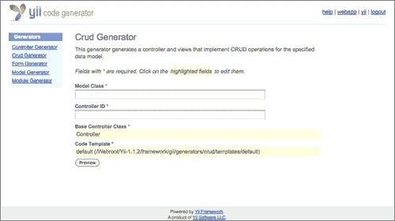

这里我们将看到两个输入表单字段。第一个要求我们指定我们希望生成所有 CRUD 操作的**模型类**。在我们的例子中，这是我们之前创建的`Project`AR 类。所以我们将在这个字段中输入**项目**。在执行此操作时，我们注意到，**控制器 ID**字段自动填充名称为**项目**。这是 Yii 的命名约定。当然，如果愿意，您可以将其更改为另一个名称，但我们现在仍将使用此默认名称。我们还将使用初始创建应用程序时为我们创建的默认基本控制器类`Controller`，以及用于生成类文件的默认代码模板文件。

填写完所有这些字段后，点击**预览**按钮，页面底部显示下表：

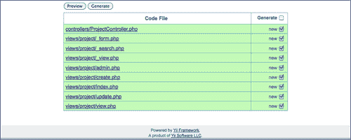

我们可以看到，将生成相当多的文件。一个新的`ProjectController`控制器类将容纳所有 CRUD 操作方法，它位于列表的顶部。列表的其余部分表示也将要创建的许多独立视图文件。每个操作都有一个单独的视图文件，其中一个文件将提供搜索项目记录的功能。当然，您可以通过更改表中相应的**生成**列中的复选框来选择不生成其中一些。然而，出于我们的目的，我们希望 Gii 为我们创建所有这些。

继续并点击**生成**按钮。您应在页面底部看到以下成功消息：


### 注

您可能需要确保根应用程序目录下的`/protected/controllers`和`/protected/views`都可由 web 服务器进程写入。否则，您将收到权限错误，而不是此成功结果。

现在，我们可以点击**立即试用**链接，对我们的新功能进行试驾。

这样做会将您带到项目列表页面。这是显示系统中当前所有项目的页面。在我们的例子中，我们还没有创建任何结果，因此页面会给我们一条**未找到结果**消息。让我们通过创建一个新项目来改变这一点。

## 创建新项目

在项目列表页面（`http://localhost/trackstar/index.php?r=project`上），页面右侧有一个小导航区域。点击**创建项目**链接。您会发现这实际上会将我们带到登录页面，而不是创建新项目的表单。这是因为 Gii 生成的代码应用了一条规则，该规则规定只有经过适当身份验证的用户（登录用户）才能创建新项目。任何试图访问该功能以创建新项目的匿名用户都将重定向到登录页面。稍后我们将详细介绍身份验证和授权。现在，继续使用凭据用户名`demo`和密码`demo`登录。

成功登录应将您重定向到以下 URL：

`http://localhost/trackstar/index.php?r=project/create`

此页面显示用于添加新项目的输入表单，如以下屏幕截图所示：

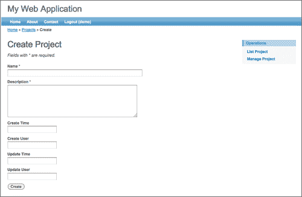

让我们快速填写此表单以创建一个新项目。该表单表示有两个必填字段，**名称**和**说明**。Gii 代码生成器非常聪明，因为我们将数据库表中的`tbl_project.name`和`tbl_project.description`列定义为`NOT NULL`，所以在创建新项目时，这应该转换为必需的表单字段。很酷吧？

所以，我们至少需要填写这两个字段。将其命名为`Test Project`，并将其描述为`Test project description`。点击**创建**按钮将表单数据发布回服务器，并尝试添加新的项目记录。如果存在任何验证错误，将显示一条简单的错误消息，突出显示出错的每个字段。成功保存将重定向到新创建项目的特定列表。我们的成功，我们被重定向到页面`http://localhost/trackstar/index.php?r=project/view&id=1`，如以下截图所示：


正如我们前面简要提到的，关于新的项目创建表单，我们注意到的一点是名称和描述字段都被标记为必需的。这是因为我们在数据库表中定义了 name 和 description 列，不允许空值。让我们看一下这些必需的字段是如何在 YII 中工作的。

### 表单字段验证

在 Yii 中使用表单中的 AR 模型类时，围绕表单字段设置验证规则非常简单。这是通过在 AR 模型类中的`rules()`方法中定义的数组中指定值来实现的。

如果你看一下`Project`模型类中的代码（`/protected/models/Project.php`，你会发现`rules()`公共函数已经为我们定义好了，里面已经有一些规则：

```php
/**
   * @return array validation rules for model attributes.
   */
  public function rules()
  {
    // NOTE: you should only define rules for those attributes that
    // will receive user inputs.
    return array(
      array('name, description', 'required'),
      array('create_user_id, update_user_id', 'numerical', 'integerOnly'=>true),
      array('name', 'length', 'max'=>255),
      array('create_time, update_time', 'safe'),
      // The following rule is used by search().
      // Please remove those attributes that should not be searched.
      array('id, name, description, create_time, create_user_id, update_time, update_user_id', 'safe', 'on'=>'search'),
      );
  }	
```

`rules()`方法返回一个规则数组。每项规则的一般格式如下：

```php
Array('Attribute List', 'Validator', 'on'=>'Scenario List', …additional options);
```

`Attribute List`是一个由逗号分隔的类属性名组成的字符串，要根据`Validator`进行验证。`Validator`规定了应该执行哪种规则。`on`参数指定应用规则的场景列表。例如，如果我们指定应在`insert`场景上下文中应用验证，这将表明该规则仅应在插入新记录期间应用。

如果未定义特定场景，则在对模型数据执行验证时，验证规则将应用于所有场景。

### 注

从 Yii 的 1.1.11 版开始，您还可以指定一个`except`参数，该参数允许您排除某些场景的验证。语法与`on`参数相同。

最后，您还可以指定其他选项作为`name=>value pairs`，用于初始化验证器的属性。这些附加选项将根据指定的验证器的属性而有所不同。

验证器可以是模型类中的方法，也可以是单独的验证器类。如果定义为模型类方法，则它必须具有以下签名：

```php
/** 
* @param string the name of the attribute to be validated 
* @param array options specified in the validation rule 
*/ 
public function validatorName($attribute,$params) 
{
...
}
```

如果使用单独的类来定义验证器，则该类必须从`CValidator`扩展。

实际上有三种方法可以指定验证器：

*   在模型类本身中指定方法名称
*   指定一个单独的验证程序类型的类（即扩展了`CValidator`的类）
*   为 Yii 框架中现有的验证器类指定预定义的别名

Yii 为您提供了许多预定义的验证器类，并且还提供了别名，在定义规则时可以引用这些别名。从 Yii 版本 1.1.12 起，预定义验证程序类别名的完整列表如下：

*   **布尔值**：别名`CBooleanValidator`，验证包含`true`或`false`的属性
*   **验证码**：别名`CCaptchaValidator`，验证与验证码中显示的验证码相同的属性值
*   **比较**：`CCompareValidator`的别名，比较两个属性并验证它们是否相等
*   **电子邮件**：别名为`CEmailValidator`，验证有效电子邮件地址的属性值
*   **日期**：别名`CDateValidator`，验证属性值是否为有效的日期、时间或日期时间值
*   **默认值**：别名`CDefaultValueValidator`，为指定的属性指定一个默认值
*   **存在**：别名为`CExistValidator`，针对数据库中指定的表列验证属性值
*   **文件**：别名为`CFileValidator`，验证上传文件名称的属性值
*   **过滤器**：`CFilterValidator`的别名，用指定的过滤器转换属性值
*   中的**：别名为`CRangeValidator`，验证数据是否在预先指定的值范围内，或者是否存在于指定的值列表中**
*   **长度**：别名`CStringValidator`，验证属性值的长度是否在指定范围内
*   **匹配**：别名为`CRegularExpressionValidator`，使用正则表达式验证属性值
*   **数字**：别名`CNumberValidator`，验证属性值是否为有效数字
*   **必选**：别名`CRequiredValidator`，验证属性值是否为空
*   **类型**：别名`CTypeValidator`，验证属性值是否为特定数据类型
*   **唯一**：别名为`CUniqueValidator`，验证属性值是否唯一，并与数据库表列进行比较
*   **url**：别名`CUrlValidator`，验证属性值是否为有效 url

我们看到在我们的`rules()`函数中，定义了一个规则来指定名称和描述属性，并使用 Yii 别名`required`来指定验证器：

```php
array('name, description', 'required'),
```

新项目表单上**名称**和**说明**字段旁边的红色小星号由本验证规则的声明负责。这表示现在需要此字段。如果我们返回到新的项目创建表单（`http://localhost/trackstar/index.php?r=project/create`，并尝试在未指定**名称**或**说明**的情况下提交表单，我们将收到一条格式良好的错误消息，告诉我们无法提交这些字段为空的表单，如以下屏幕截图所示：

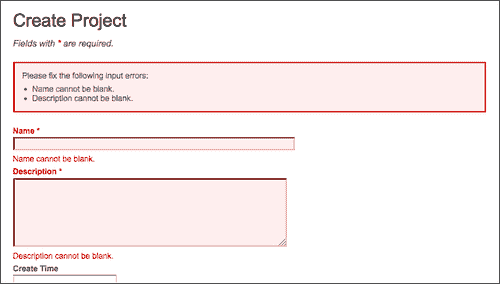

### 注

如前所述，Gii 代码生成工具将根据基础表中列的定义自动向 AR 类添加验证规则。我们在**名称**和**描述**列中看到了这一点，这些列定义了`NOT NULL`约束，这些约束定义了关联所需的验证器。另一个例子是，具有长度限制的列，例如我们的名称列被定义为`varchar(255)`，将自动应用字符限制规则。我们注意到，在`Project`AR 类中的`rules()`方法中，Gii 根据其列定义为我们自动创建了规则`array('name', 'length', 'max'=>255)`。有关验证器的更多信息，请参见[http://www.yiiframework.com/doc/guide/1.1/en/form.model#declaring-验证规则](http://www.yiiframework.com/doc/guide/1.1/en/form.model#declaring-validation-rules)。

## 阅读项目

在成功保存一个新项目`http://localhost/trackstar/index.php?r=project/view&id=1`后，当我们被带到项目详细信息页面时，我们实际上已经看到了这一点。本页演示 CRUD 中的*R*。但是，要查看整个列表，我们可以点击右侧栏中的**列表项目**链接。这将使我们回到开始的地方，但现在我们在项目列表中有了新创建的项目。因此，我们能够检索应用程序中所有项目的列表，以及单独查看每个项目的详细信息。

## 更新和删除项目

通过单击列表中任何项目上的小项目**ID**链接，可以导航回项目详细信息页面。让我们为我们新创建的项目这样做，在我们的例子中是**ID:1**。单击此链接，我们将进入此项目的项目详细信息页面。此页面的右侧栏中有许多动作操作，如下图所示：

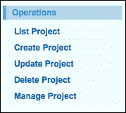

我们可以看到**更新项目**和**删除项目**链接，它们分别为我们的 CRUD 操作提供了*U*和*D*。我们将让您验证这些链接是否按预期工作。

### 注

删除功能仅限于管理员用户；也就是说，您必须使用`admin`/`admin`的用户名/密码组合登录。因此，如果您正在验证删除功能并收到 403 错误，请确保您以管理员身份登录。这将在后面进行更详细的讨论，我们将在后面的章节中详细介绍身份验证和授权。

## 以管理模式管理项目

上一个描述项目运营的屏幕截图中没有涉及的最后一个链接是**管理项目**链接。继续并点击此链接上的。它极有可能导致授权错误，如以下屏幕截图所示：


出现此错误的原因是，此功能调用 Yii 中的一个简单访问控制功能，并将访问权限仅限于*admin*用户。如果您还记得，当我们登录应用程序以创建新项目时，我们使用`demo`/`demo`作为用户名/密码组合。此`demo`用户没有访问此管理员页面的权限。Gii生成的代码限制了对该功能的访问。

在此上下文中，**管理员**只是使用`admin`/`admin`的用户名/密码组合登录的人。点击主导航栏中的**注销（演示）**退出应用程序。然后再次登录，但这次请使用这些管理员凭据。一旦以`admin`身份成功登录，您应该注意到顶部导航注销链接更改为**注销（管理）**。然后导航回特定的项目列表页面，例如，`http://localhost/trackstar/index.php?r=project/view&id=1`，再次尝试**管理项目**链接。现在，您应该看到以下屏幕截图中显示的内容：

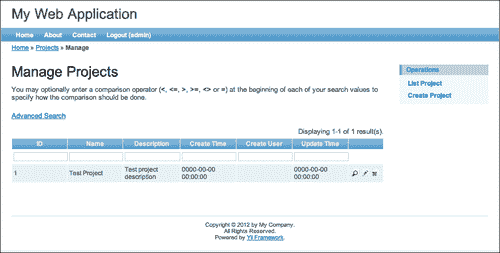

我们现在看到的是一个高度互动的项目列表页面。它显示交互式数据表中的所有项目。每行都有用于查看、更新和删除每个项目的内联链接。单击任何列标题链接，按该列值对项目列表进行排序。第二行中的小输入框允许您通过这些单独的列值中的关键字搜索此项目列表。高级搜索链接公开了一个完整的搜索表单，提供了针对一次搜索指定多个搜索条件的能力。以下屏幕截图显示此高级搜索表单：

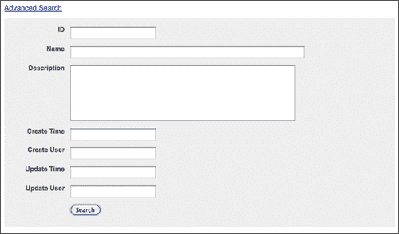

我们基本上已经实现了我们在这个迭代中要实现的所有功能，并且实际上不需要编写太多代码。事实上，在 Gii 的帮助下，我们不仅创建了所有 CRUD 功能，还实现了我们不希望实现的基本项目搜索功能。虽然非常基础，但我们有一个功能完整的应用程序，具有特定于项目任务跟踪应用程序的功能，并且很少努力实现它。

当然，我们在 TrackStar 应用程序方面还有很多工作要完成。所有这些脚手架代码并不是为了完全取代应用程序开发。它为我们继续构建我们的应用提供了一个极好的起点和基础。当我们处理项目功能应该如何工作的所有细节和细微差别时，我们可以依靠这个自动生成的代码来保持事情的快速发展。

# 总结

尽管我们在本章中没有做太多的编码，但我们还是完成了很多。我们创建了一个新的数据库表，它允许我们查看正在运行的 Yii 活动记录（AR）。我们使用 Gii 工具首先创建一个 AR 模型类来包装我们的`tbl_project`数据库表。然后，我们演示了如何使用 Gii 代码生成工具在 web 应用程序中生成实际的 CRUD 功能。这个神奇的工具很快创造了我们所需要的功能，甚至更进一步，它为我们提供了一个管理仪表板，允许我们根据不同的标准搜索和排序我们的项目。我们还演示了如何实现模型数据验证，以及如何将其转换为 Yii 中的表单字段验证。

在下一章中，当我们在数据模型中介绍相关实体时，我们将以我们在这里学到的知识为基础，更深入地研究 Yii 中的活动记录。