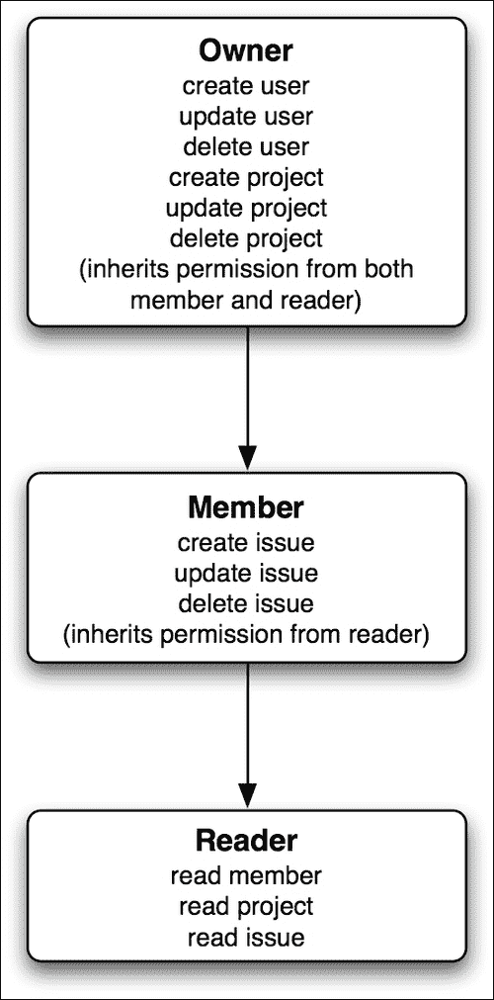
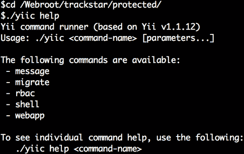
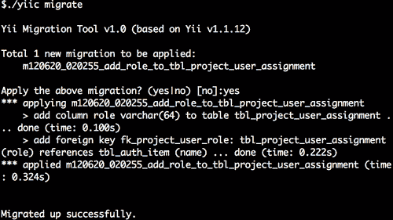
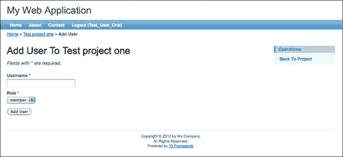

# 七、用户访问控制

基于用户的 web 应用程序，如我们的 TrackStar 应用程序，通常需要根据提出请求的用户控制对某些功能的访问。当我们谈到*用户访问控制*时，我们在较高层次上指的是应用程序在发出请求时需要询问的一些问题。这些问题是：

*   谁在提出请求？
*   该用户是否具有访问请求功能的适当权限？

这些问题的答案有助于应用程序做出适当的响应。

[第 6 章](06.html "Chapter 6. User Management and Authentication")、*用户管理和授权*中完成的工作为我们的应用程序提供了回答第一个问题的能力。该应用程序现在允许用户建立自己的身份验证凭据，并在用户登录时验证用户名和密码。成功登录后，应用程序确切地知道谁在发出后续请求。

在本章中，我们将重点帮助应用程序回答第二个问题。一旦用户提供了适当的标识，应用程序需要一种方法来确定他们是否也有权执行请求的操作。我们将通过利用 Yii 的用户访问控制功能来扩展我们的基本授权模型。Yii 提供了一个**简单的访问控制过滤器**和一个更复杂的**基于角色的访问控制**（**RBAC**实现，作为帮助我们解决用户授权需求的一种手段。在致力于实现 TrackStar 应用程序的用户访问要求时，我们将仔细研究这两个方面。

# 特征规划

当我们在[第 3 章](03.html "Chapter 3. The TrackStar Application")、*TrackStar 应用程序*中首次介绍我们的 TrackStar 应用程序时，我们提到该应用程序有两种高级用户状态，即匿名和认证。这只是区分成功登录（已验证）的用户和未登录（匿名）的用户。我们还介绍了认证用户在项目中扮演不同角色的想法。在特定项目中，用户可以担任以下三个角色之一：

*   **项目业主**拥有*对该项目的所有*行政权限
*   **项目成员**拥有*部分*行政权限，但与项目业主相比，权限更为有限
*   **项目读取器**具有*只读*访问权限。此类用户无法更改项目的内容

本章的重点是实现一种管理授予应用程序用户的访问控制的方法。我们需要一种方法来创建和管理我们的角色和权限，将它们分配给用户，并为每个用户角色强制执行我们想要的访问控制规则。

为了实现前面概述的目标，我们将在本章中重点关注以下内容：

*   实施一种策略，强制用户在访问任何项目或问题相关功能之前登录
*   创建用户角色并将这些角色与特定权限结构关联
*   实现将用户分配给角色（及其相关权限）的功能
*   确保每个项目都存在我们的角色和权限结构（即，允许用户在不同的项目中拥有不同的权限）
*   实现将用户与项目关联，同时与该项目中的角色关联的功能
*   在整个应用程序中实施必要的授权访问检查，以根据应用程序用户的权限适当地授予或拒绝其访问权限

幸运的是，Yii 附带了很多内置功能，可以帮助我们实现这些需求。那么，让我们开始吧。

# 门禁过滤器

我们首先在[第 5 章](05.html "Chapter 5. Managing Issues")*管理问题*中引入了*过滤器*，当时我们在允许使用问题功能之前强制实施了有效的项目上下文。如果您还记得，我们在`IssueController`类中添加了一个类方法过滤器`filterProjectContext()`，以确保我们在对问题实体执行任何操作之前拥有有效的项目上下文。Yii 提供了一种类似的方法，用于在控制器内逐个操作地处理简单的访问控制。

Yii 框架提供了一个名为`accessControl`*的过滤器。*此过滤器可直接在控制器类中使用，以提供授权方案来验证用户是否可以访问特定的控制器操作。事实上，精明的读者会记得，当我们在[第 5 章](05.html "Chapter 5. Managing Issues")*管理问题*中实现`projectContext`过滤器时，我们注意到这个访问控制过滤器已经包含在我们`IssueController`和`ProjectController`类的过滤器列表中，如下所示：

```php
/**
 * @return array action filters
 */
public function filters()
{
return array(
'accessControl', // perform access control for CRUD operations
);
}
```

这包括在使用 Gii CRUD 代码生成器工具生成的自动生成代码中。自动生成的代码也会覆盖`accessRules()`方法，这是使用访问控制过滤器所必需的。在此方法中，您可以定义实际的授权规则。

CRUD 操作的默认实现设置为允许任何人查看现有问题和项目的列表。但是，它将创建和更新权限限制为经过身份验证的用户，并进一步将删除操作限制为特殊的*管理员*用户。您可能还记得，当我们第一次对项目实施 CRUD 操作时，我们必须先登录才能创建新的 CRUD 操作。在处理问题和用户时也是如此。控制此授权和访问的机制正是此访问控制筛选器。让我们更深入地了解这个在 Type T0T 类文件中的实现。

`ProjectController`类中有两种与访问控制相关的方法：`filters()`和`accessRules()`。`filters()`方法配置过滤器：

```php
/**
 * @return array action filters
 */
public function filters()
{
return array(
'accessControl', // perform access control for CRUD operations
);
}
```

用于定义访问过滤器使用的授权规则的`accessRules()`方法如下：

```php
/**
* Specifies the access control rules.
* This method is used by the 'accessControl' filter.
* @return array access control rules
*/
public function accessRules()
{
return array(
array('allow',  // allow all users to perform 'index' and 'view' actions
'actions'=>array('index','view'),
'users'=>array('*'),
),
array('allow', // allow authenticated user to perform 'create' and 'update' actions
'actions'=>array('create','update'),
'users'=>array('@'),
),
array('allow', // allow admin user to perform 'admin' and 'delete' actions
'actions'=>array('admin','delete'),
'users'=>array('admin'),
),
array('deny',  // deny all users
'users'=>array('*'),
),
);
}
```

`filters()`方法我们已经很熟悉了。在这里，我们指定控制器类中要使用的所有过滤器。在本例中，我们只有一个，`accessControl`，它指的是 Yii 框架提供的过滤器。此筛选器使用另一种方法`accessRules()`，它定义了驱动访问限制的规则。

在`accessRules()`方法中，指定了四条规则。每个规则都表示为一个数组。数组的第一个元素是*允许*或*拒绝*。这些分别表示允许或拒绝访问。数组的其余部分由指定规则其余参数的`name=>value`对组成。

让我们看看前面定义的第一条规则：

```php
array('allow',  // allow all users to perform 'index' and 'view' actions
'actions'=>array('index','view'),
'users'=>array('*'),
),
```

此规则允许任何用户执行`actionIndex()`和`actionView()`控制器动作。在`'users'`元素的值中使用的星号（`*`是一个特殊字符，用于指定任何用户（匿名、已验证或其他）。

现在让我们看看定义的第二条规则：

```php
array('allow', // allow authenticated user to perform 'create' and 'update' actions
'actions'=>array('create','update'),
'users'=>array('@'),
),
```

这允许任何经过身份验证的用户访问`actionCreate()`和`actionUpdate()`控制器动作 s。`@`特殊字符是指定任何经过身份验证的用户的一种方式。

第三条规则在以下代码段中定义：

```php
array('allow', // allow admin user to perform 'admin' and 'delete' actions
'actions'=>array('admin','delete'),
'users'=>array('admin'),
),
```

此规则指定允许名为`admin`的特定用户访问`actionAdmin()`和`actionDelete()`控制器动作。

最后，让我们仔细看看第四条规则：

```php
array('deny',  // deny all users
'users'=>array('*'),
),
```

此规则拒绝所有用户访问所有控制器操作。我们将在一分钟内详细介绍这一点。

可以使用许多上下文参数定义访问规则。前面提到的规则指定了创建规则上下文的操作和用户，但是您可以使用其他几个参数。以下给出了其中一些：

*   **控制器**：指定应应用规则的控制器 ID 数组。
*   **角色**：指定规则适用的授权项列表（角色、操作和权限）。这利用了我们将在下一节讨论的 RBAC 特性。
*   **IP**：指定此规则适用的客户端 IP 地址列表。
*   **动词**：指定哪些 HTTP 请求类型（GET、POST 等）适用于此规则。
*   **表达式**：指定一个 PHP 表达式，其值指示是否应用规则。
*   **动作**：通过使用对应的动作 ID，指定规则应该匹配的动作方式。
*   **用户**：指定规则应适用的用户。当前应用程序用户名属性用于匹配。此处还可以使用以下三个特殊字符：
    1.  *****：任何用户
    2.  **？**：匿名用户
    3.  **@**：认证用户

如果未指定任何用户，则该规则将应用于所有用户。

访问规则将按照指定的顺序逐个求值。与当前模式匹配的第一条规则确定授权结果。如果该规则是允许规则，则可以执行该操作；如果是`deny`规则，则该动作不能执行；如果没有任何规则与上下文匹配，则仍然可以执行该操作。正是出于这个原因，才对前面提到的第四条规则进行了定义。如果我们没有在规则列表的末尾定义一个拒绝所有用户执行所有操作的规则，那么我们将无法实现所需的访问限制。以第二条规则为例。它指定允许经过身份验证的用户访问`actioncreate()`和`actionUpdate()`操作 s。然而，它并没有规定匿名用户被拒绝访问。它没有提到匿名用户。前面提到的第四条规则确保拒绝与前三条特定规则之一不匹配的所有其他请求的访问。

有了这一点，修改我们的应用程序以拒绝匿名用户对所有项目、问题和用户相关功能的访问就很容易了。我们所要做的就是将用户数组值的特殊字符“`*`”更改为“`@`”特殊字符。这将只允许经过身份验证的用户访问`actionIndex()`和`actionView()`控制器操作 s。所有其他操作都已限于经过身份验证的用户。

现在，我们可以对每个项目、问题和用户控制器类文件进行三次更改。但是，我们有一个基本的控制器类，每个控制器类都从中扩展，即文件`protected/components/Controller.php`中的`Controller`类。因此，我们可以在这个文件中添加 CRUD 访问规则，然后将其从每个子类中删除。在定义规则时，我们还可以利用`controllers`上下文参数，以便它仅适用于这三个控制器。

首先，让我们向基本控制器类添加必要的方法。打开`protected/components/Controller.php`并添加以下方法：

```php
/**
 * Specifies the access control rules.
 * This method is used by the 'accessControl' filter.
 * @return array access control rules
 */
public function accessRules()
{
return array(
array('allow',  // allow all users to perform 'index' and 'view' actions
'controllers'=>array('issue','project','user'),
'actions'=>array('index','view'),
'users'=>array('@'),
),
array('allow', // allow authenticated user to perform 'create' and 'update' actions
'controllers'=>array('issue','project','user'),
'actions'=>array('create','update'),
'users'=>array('@'),
),
array('allow', // allow admin user to perform 'admin' and 'delete' actions
'controllers'=>array('issue','project','user'),
'actions'=>array('admin','delete'),
'users'=>array('admin'),
),
array('deny',  // deny all users
'controllers'=>array('issue','project','user'),
'users'=>array('*'),
),
);
}
```

前面代码段中突出显示的代码显示了我们所做的更改。我们已将`controllers`参数添加到每个规则中，并将索引和视图操作的用户更改为仅允许经过身份验证的用户。

现在我们可以从每个指定的控制器中删除此方法。打开所有三个`ProjectController.php`、`IssueController.php`和`UserController.php`文件，删除它们各自的`accessRules()`方法。

在进行这些更改后，应用程序将需要在访问我们的*项目*、*问题*或*用户*功能之前登录。我们仍然允许匿名用户访问`SiteController`类操作方法，我们保留了这些方法，因为这是我们的登录操作所在的位置。如果我们还没有登录，我们显然必须能够访问登录页面。

# 基于角色的访问控制

既然我们已经使用了简单的访问控制过滤器来限制对经过身份验证的用户的访问，那么我们需要将重点转向满足应用程序的一些更具体的访问控制需求。正如我们提到的，用户将在项目中扮演某些角色。本项目将有类型为*owner*的用户，可将其视为项目管理员。他们将被授予操纵该项目的所有权限。该项目还将有*成员*类型的用户，他们将被授予一些项目功能的访问权限，但是业主能够执行的适当子集。最后，项目可以有类型为*reader*的用户，他们只能查看项目相关内容，不能以任何方式修改。为了实现这种基于用户角色的访问控制，我们转向 Yii 的基于角色的访问控制特性，也更简单地称为 RBAC。

RBAC 是计算机系统安全领域的一种成熟方法，用于管理经过身份验证的用户的访问权限。简而言之，RBAC 方法定义了应用程序中的角色。还定义了执行某些操作的权限，然后将其与角色关联。然后将用户分配到一个角色，并通过角色关联获取为该角色定义的权限。对于好奇的读者来说，有大量关于 RBAC 概念和方法的文档可供使用。例如，维基百科，[http://en.wikipedia.org/wiki/Role-based_access_control](http://en.wikipedia.org/wiki/Role-based_access_control) 。我们将关注 Yii 实现 RBAC 方法的细节。

Yii 的 RBAC 实现简单、优雅且功能强大。在 RBI 的基础上，YAI 是授权项目的概念。授权项只是在应用程序中执行操作的权限。这些权限可以分为*角色*、*任务*或*操作*三类，并形成权限层次结构。角色可以由任务（或其他角色）组成，任务可以由操作（或其他任务）组成，操作是最细粒度的权限级别。

例如，在我们的 TrackStar 应用程序中，我们需要一个类型为*所有者*的角色。因此，我们将创建一个类型为*角色*的授权项，并将其称为“所有者”。该角色可以由“用户管理”和“问题管理”等任务组成。这些任务可以进一步由组成这些任务的原子操作组成。继续这个示例，“用户管理”任务可能包括“创建新用户”、“编辑用户”和“删除用户”操作。此层次结构允许继承这些权限，因此，在本例中，如果将用户分配给所有者角色，则他们将继承对该用户执行创建、编辑和删除操作的权限。

通常在 RBAC 中，您将用户分配给一个或多个角色，并且用户继承已分配给这些角色的权限。这也适用于 Yii 中的 RBAC。但是，在 Yii 中，我们可以将用户关联到任何授权项，而不仅仅是类型为*角色*的授权项。这使我们能够灵活地将特定权限与任何粒度级别的用户相关联。如果我们只想将“delete user”操作授予特定用户，而不给他们所有者角色将拥有的所有访问权限，那么我们可以简单地将用户与此原子操作关联。这使得 Yii 中的 RBAC 非常灵活。

## 配置授权管理器

在建立授权层次结构、为用户分配角色和执行访问权限检查之前，我们需要配置授权管理器应用程序组件`authManager`。此组件负责存储权限数据和管理权限之间的关系。它还提供了检查用户是否有权执行特定操作的方法。Yii 提供两种类型的授权管理器`CPhpAuthManager`和`CDbAuthManager`。`CPhpAuthManager`使用 PHP 脚本文件存储授权数据。您可能已经猜到，`CDbAuthManager`将授权数据存储在数据库中。`authManager`配置为应用组件。配置授权管理器只需指定使用这两种类型中的哪一种，然后设置其初始类属性值。

我们将在应用程序中使用数据库实现。要进行此配置，请打开主配置文件`protected/config/main.php`，并将以下内容添加到应用程序组件阵列中：

```php
// application components
'components'=>array(
…
'authManager'=>array(
'class'=>'CDbAuthManager',
'connectionID'=>'db',
),
```

这将建立一个名为`authManager`的新应用程序组件，将类类型指定为`CDbAuthManager`，并将`connectionID`类属性设置为我们的数据库连接组件。现在，我们可以使用`Yii::app()->authManager`在应用程序中的任何位置访问此内容。

## 创建 RBAC 数据库表

如上所述，`CDbAuthManager`类使用数据库表存储权限数据。它需要一个特定的模式。该模式在框架文件`YiiRoot/framework/web/auth/schema.sql`中标识。它是一个简单而优雅的模式，由三个表组成，`AuthItem`、`AuthItemChild`和`AuthAssignment`。

`AuthItem`表包含定义授权项的信息，即角色、任务或操作。`AuthItemChild`表包含构成授权项层次结构的父/子关系。最后，`AuthAssignment`表是一个关联表，保存用户和授权项目之间的关联。

因此，我们需要将这个表结构添加到数据库中。正如前面所做的，我们将使用数据库迁移来进行这些更改。从命令行，导航到 TrackStar 应用程序的`/protected`目录，并创建迁移：

```php
$ cd /Webroot/trackstar/protected
$ ./yiic migrate create create_rbac_tables

```

这将在根据迁移文件命名约定命名的`protected/migrations/`目录下创建一个新的迁移文件（例如`m120619_015239_create_rbac_tables.php`。执行`up()`和`down()`迁移方法如下：

```php
public function up()
{
//create the auth item table
$this->createTable('tbl_auth_item', array(
'name' =>'varchar(64) NOT NULL',
'type' =>'integer NOT NULL',
'description' =>'text',
'bizrule' =>'text',
'data' =>'text',
'PRIMARY KEY (`name`)',
), 'ENGINE=InnoDB');

//create the auth item child table
$this->createTable('tbl_auth_item_child', array(
'parent' =>'varchar(64) NOT NULL',
'child' =>'varchar(64) NOT NULL',
'PRIMARY KEY (`parent`,`child`)',
), 'ENGINE=InnoDB');

//the tbl_auth_item_child.parent is a reference to tbl_auth_item.name
$this->addForeignKey("fk_auth_item_child_parent", "tbl_auth_item_child", "parent", "tbl_auth_item", "name", "CASCADE", "CASCADE");

//the tbl_auth_item_child.child is a reference to tbl_auth_item.name
$this->addForeignKey("fk_auth_item_child_child", "tbl_auth_item_child", "child", "tbl_auth_item", "name", "CASCADE", "CASCADE");

//create the auth assignment table
$this->createTable('tbl_auth_assignment', array(
'itemname' =>'varchar(64) NOT NULL',
'userid' =>'int(11) NOT NULL',
'bizrule' =>'text',
'data' =>'text',
'PRIMARY KEY (`itemname`,`userid`)',
), 'ENGINE=InnoDB');

//the tbl_auth_assignment.itemname is a reference 
//to tbl_auth_item.name
$this->addForeignKey(
"fk_auth_assignment_itemname", 
"tbl_auth_assignment", 
"itemname", 
"tbl_auth_item", 
"name", 
"CASCADE", 
"CASCADE"
);

//the tbl_auth_assignment.userid is a reference 
//to tbl_user.id
$this->addForeignKey(
"fk_auth_assignment_userid", 
"tbl_auth_assignment", 
"userid", 
"tbl_user", 
"id", 
"CASCADE", 
"CASCADE"
);
}

public function down()
{
$this->truncateTable('tbl_auth_assignment');
$this->truncateTable('tbl_auth_item_child');
$this->truncateTable('tbl_auth_item');
$this->dropTable('tbl_auth_assignment');
$this->dropTable('tbl_auth_item_child');
$this->dropTable('tbl_auth_item');
}
```

保存这些更改后，运行迁移以创建所需的结构：

```php
$ ./yiic migrate

```

一旦创建了必要的结构，您将在屏幕上看到一条消息`Migrated up successfully`。

由于我们遵循数据库表命名约定，因此需要更改`authManager`组件配置，以指定特定的表名。打开`/protected/config/main.php`，将表名规范添加到`authManager`组件中：

```php
// application components
'components'=>array(
…
'authManager'=>array(
'class'=>'CDbAuthManager',
'connectionID'=>'db',
'itemTable' =>'tbl_auth_item',
'itemChildTable' =>'tbl_auth_item_child',
'assignmentTable' =>'tbl_auth_assignment',
),
```

现在，authorization manager 组件将确切地知道我们希望它使用哪些表来管理我们的授权结构。

### 注

如果您需要关于如何使用 Yii 数据库迁移的提示，请参阅[第 4 章](04.html "Chapter 4. Project CRUD")、*CRUD 项目*中首次引入此概念的地方。

## 创建 RBAC 授权层次结构

在将这些表添加到我们的`trackstar`数据库之后，我们需要用我们的角色和权限填充它们。我们将使用`authmanager`组件提供的 API 来实现这一点。为了简单起见，我们将只定义角色和基本操作。我们目前不会设置任何正式的 RBAC 任务。下图显示了我们希望定义的基本层次结构：



该图显示了自顶向下的继承。因此，所有者拥有“所有者”框中列出的所有权限，并且他们从成员和读者角色继承所有权限。同样，成员从读卡器继承权限。我们现在需要做的是在应用程序中建立这个权限层次结构。如前所述，一种方法是编写代码来利用`authManager`API。

作为使用 API 的示例，以下代码创建一个新角色和一个新操作，然后添加角色和权限之间的关系：

```php
$auth=Yii::app()->authManager;  
$role=$auth->createRole('owner');
$auth->createOperation('createProject','create a new project');    
$role->addChild('createProject');
```

浏览这段代码，我们首先得到一个`authManager`的实例。然后我们使用它的`createRole()`、`createOperation()`和`addChild()`API 方法创建一个新的`owner`角色，以及一个名为`createProject`的新操作。然后，我们将权限添加到所有者角色。这仅仅表明了我们所需要的层次结构的一小部分的创建；我们在前面的图中概述的所有剩余关系都需要以类似的方式创建。

我们可以创建一个新的数据库迁移，并将我们的代码放在那里，以填充我们的权限层次结构。但是，为了演示在 Yii 应用程序中使用控制台命令，我们将采用不同的方法。我们将编写一个简单的 shell 命令，在命令行中执行。这将扩展我们用来创建初始应用程序的`yiic`命令行工具的命令选项。

### 编写控制台应用程序命令

我们在[第 2 章](02.html "Chapter 2. Getting Started")、*入门*中引入了`yiic`命令行工具，当时我们创建了一个新的“Hello，World！”应用程序；在[第 4 章](04.html "Chapter 4. Project CRUD")中，我们又在*项目 CRUD*中引入了该工具，当时我们使用它最初创建了我们的 TrackStar web 应用程序的结构。我们在创建和运行数据库迁移时继续使用它。

`yiic`工具是 Yii 中的一个控制台应用程序，以命令的形式执行任务。我们使用了`webapp`命令来创建新的应用程序，`migrate`命令来创建新的迁移文件并执行我们的数据库迁移。通过编写自定义命令，Yii 中的控制台应用程序很容易扩展，这正是我们要做的。我们将通过编写一个新的命令行工具来扩展`yiic`命令工具集，以允许我们构建 RBAC 授权。

为控制台应用程序编写新命令非常简单。命令只是一个从`CConsoleCommand`扩展而来的类。它的工作原理类似于控制器类，因为它将解析输入命令行选项，并将请求分派到命令类中的指定操作，默认为`actionIndex()`。类的名称应与所需的命令名完全相同，后跟“command”。在我们的例子中，我们的命令将只是“Rbac”，因此我们将我们的类命名为`RbacCommand`。最后，为了使该命令可用于`yiic`控制台应用程序，我们需要将类保存到`/protected/commands/`目录中，这是控制台命令的默认位置。

因此，创建一个新文件`/protected/commands/RbacCommand.php`。此文件的内容太长，无法包含在内，但可以从本章的可下载代码或从[gist.github.com/jeffwinesett](http://gist.github.com/jeffwinesett)轻松获得。可在[上获取此信息的单个片段 https://gist.github.com/3779677](https://gist.github.com/3779677) 。

可下载代码中的注释应该有助于讲述这里发生的事情。我们重写了`getHelp()`的基类实现，以添加额外的描述行。我们将在一分钟内演示如何显示帮助。所有真实的动作都发生在我们添加的两个动作中，`actionIndex()`和`actionDelete()`。前者创建 RBAC 层次结构，后者删除它。它们都确保应用程序定义了有效的`authManager`应用程序组件。然后，这两个操作都允许用户在继续之前有最后一次机会取消请求。如果此命令的用户表示要继续，则请求将继续。我们的两个操作都将继续清除 RBAC 表中以前输入的所有数据，`actionIndex()`方法将创建一个新的授权层次结构。这里创建的层次结构正是我们前面讨论的层次结构。

我们可以看到，即使基于我们相当简单的层次结构，仍然需要大量代码。通常，需要围绕这些授权管理器 API 开发更直观的**图形用户界面**（**GUI**），以提供一个简单的界面来管理角色、任务和操作。我们在这里采用的方法是建立快速 RBAC 权限结构的一个很好的解决方案，但对于可能发生重大变化的权限结构的长期维护来说并不理想。

### 注

在实际应用程序中，您很可能需要一个不同的、更具交互性的工具来帮助维护 RBAC 关系。Yii 扩展库（[http://www.yiiframework.com/extensions/](http://www.yiiframework.com/extensions/) 确实为此提供了一些打包解决方案。

有了这个文件，如果我们现在向`yiic`工具寻求帮助，我们将看到新命令是可用选项之一：



我们的`rbac`确实出现在列表中。但是，在尝试执行它之前，我们需要为控制台应用程序配置`authManager`。您可能还记得，在运行控制台应用程序时，会加载不同的配置文件，即`/protected/config/console.php`。我们需要将相同的`authManager`组件添加到此文件，就像我们之前添加到`main.php`配置文件一样。打开`console.php`并将以下内容添加到组件列表中：

```php
'authManager'=>array(
'class'=>'CDbAuthManager',
'connectionID'=>'db',
'itemTable' =>'tbl_auth_item',
'itemChildTable' =>'tbl_auth_item_child',
'assignmentTable' =>'tbl_auth_assignment',
),
```

有了这个，我们现在可以试用我们的新命令：


这正是我们在命令类的`getHelp()`方法中添加的帮助文本。您当然可以更详细，并根据需要添加更多细节。让我们实际运行这个命令。由于`actionIndex()`是默认值，我们不必指定动作：


我们的命令已经完成，我们已经将适当的数据添加到新的数据库表中，以生成授权层次结构。

由于我们还添加了一个`actionDelete()`方法来删除我们的层次结构，因此您也可以尝试使用该方法：

```php
$ ./yiic rbac delete

```

在完成这些尝试后，请确保再次运行该命令以添加层次结构，因为我们需要在继续操作时将其放置到位。

## 为用户分配角色

到目前为止，我们所做的一切都建立了一个授权层次结构，但它还没有为用户分配权限。我们通过将用户分配到我们创建的三个角色之一，*所有者*、*成员*或*读者*来实现这一点。例如，如果我们想将唯一用户 ID 为`1`的用户与`member`角色关联，我们将执行以下操作：

```php
$auth=Yii::app()->authManager;
$auth->assign('member',1);

```

一旦建立了这些关系，检查用户的访问权限就很简单了。我们只需询问应用程序用户组件当前用户是否有权限。例如，如果我们想检查是否允许当前用户创建新问题，我们可以使用以下语法：

```php
if( Yii::app()->user->checkAccess('createIssue'))
{
     //perform needed logic
}
```

在本例中，我们将用户 ID`1`分配给`member`角色，由于在我们的授权层次结构中，成员角色继承了`createIssue`权限，因此假设我们以用户`1`身份登录应用程序，此`if()`语句的计算结果将为`true`。

我们将添加此授权分配逻辑，作为向项目添加新成员时执行的业务逻辑的一部分。我们将添加一个新表单，它允许我们将用户添加到项目中，并且能够选择角色作为流程的一部分。但首先，我们需要解决如何在此应用程序中实现用户角色的另一个方面，即，它们需要基于每个项目进行应用。

## 基于每个项目向用户添加 RBAC 角色

我们现在有了一个基本的 RBAC 授权模型，但这些关系将作为一个整体应用于应用程序。我们对 TrackStar 应用程序的需求稍微复杂一些。我们需要在项目上下文中为用户分配角色，而不仅仅是在整个应用程序中全局分配角色。我们需要允许用户扮演不同的角色，具体取决于项目。例如，用户可以是一个项目的`reader`角色，第二个项目的`member`角色，以及某个第三个项目的`owner`角色。用户可以与许多项目关联，分配给他们的角色需要特定于项目。

Yii 中的 RBAC 框架没有任何内置的东西，我们可以利用它来满足这一需求。RBAC 模型仅用于建立角色和权限之间的关系。它对我们的 TrackStar 项目一无所知（也不应该）。为了实现授权层次结构的这个额外维度，我们需要改变数据库结构，以包含用户、项目和角色之间的关联。如果您回想一下[第 5 章](05.html "Chapter 5. Managing Issues")中的*管理问题*我们已经创建了一个表`tbl_project_user_assignment`，用于保存用户和项目之间的关联。我们可以将此表更改为包含项目中分配给用户的角色。我们将添加一个新的迁移来更改表：

```php
$ cd /Webroot/trackstar/protected/
$ ./yiic migrate create add_role_to_tbl_project_user_assignment

```

现在打开新创建的迁移文件，实现以下`up()`和`down()`方法：

```php
public function up()
{
$this->addColumn('tbl_project_user_assignment', 'role', 'varchar(64)');
//the tbl_project_user_assignment.role is a reference 
     //to tbl_auth_item.name
$this->addForeignKey('fk_project_user_role', 'tbl_project_user_assignment', 'role', 'tbl_auth_item', 'name', 'CASCADE', 'CASCADE');
}

public function down()
{
$this->dropForeignKey('fk_project_user_role', 'tbl_project_user_assignment');
$this->dropColumn('tbl_project_user_assignment', 'role');
}
```

最后运行迁移：



您将在屏幕的末尾看到消息`Migrated up successfully`。

现在，我们的表被设置为允许我们创建角色关联以及用户和项目之间的关联。

### 新增 RBAC 业务规则

虽然前面显示的数据库表将保存基本的信息，以回答用户是否被分配到特定项目上下文中的角色的问题，但我们仍然需要我们的 RBAC`auth`层次结构来回答有关用户是否具有权限来执行特定功能的问题。虽然 Yii 中的 RBAC 模型不知道我们的 TrackStar 项目，但它确实有一个非常强大的功能，我们可以利用它。当您创建授权项目或将项目分配给用户时，您可以关联将在`Yii::app()->user->checkAccess()`调用期间执行的 PHP 代码片段。定义后，此位代码必须返回`true`才能授予用户该权限。

此功能的一个有用示例是在允许用户维护个人配置文件信息的应用程序上下文中。在这种情况下，应用程序通常希望确保用户有权只更新自己的配置文件信息，而不更新其他人的配置文件信息。在这种情况下，我们可以创建一个名为“updateProfile”的授权项，然后关联一个业务规则，检查当前用户的 ID 是否与与配置文件信息关联的用户 ID 相同。

在本例中，我们将把业务规则与角色分配相关联。当我们将用户分配给特定角色时，我们还将关联一个业务规则，该规则将检查项目上下文中的关系。`checkAccess()`方法还允许我们传入一系列附加参数，供业务规则用于执行其逻辑。我们将使用它在当前项目上下文中传递，以便业务规则可以调用`Project`AR 类上的方法，以确定用户是否被分配到该项目中的该角色。

我们将为每个角色分配创建的业务规则将略有不同。例如，我们将用户分配给所有者角色时使用的方法如下所示：

```php
$bizRule='return isset($params["project"]) && $params["project"]->isUserInRole("owner");';
```

角色`member`和`reader`的角色类似。

在调用`checkAccess()`方法时，我们还必须传递项目上下文。因此，现在当检查用户是否有权访问`createIssue`操作时，代码如下所示：

```php
//add the project AR instance to the input params
$params=array('project'=>$project);
//pass in the params to the checkAccess call
if(Yii::app()->user->checkAccess('createIssue',$params))
{
     //proceed with issue creation logic
}
```

在前面的代码中，`$project`变量是与当前项目上下文相关联的`Project`AR 类实例（请记住，我们应用程序中的几乎所有功能都发生在项目上下文中）。这个类实例是在业务规则中使用的。业务规则调用一个方法`Project::isUserInRole()`，以确定用户是否担任特定项目的角色。

### 实施新的项目 AR 方法

既然我们已经改变了数据库结构以容纳用户、角色和项目之间的关系，那么我们需要实现所需的逻辑来管理和验证此表中的数据。我们将向 project AR 类添加公共方法，以处理从此表中添加和删除数据以及验证行的存在。

我们需要将 public 方法添加到`Project`AR 类中，该类将接受角色名称和用户 ID，并创建角色、用户和项目之间的关联。打开`protected/models/Project.php`文件，添加以下方法：

```php
public function assignUser($userId, $role)
{
$command = Yii::app()->db->createCommand();
$command->insert('tbl_project_user_assignment', array(
'role'=>$role,
'user_id'=>$userId,
'project_id'=>$this->id,
));
}
```

在这里，我们使用 Yii 框架查询生成器方法直接插入到数据库表中，而不是使用活动记录方法。由于`tbl_project_user_assignement`只是一个关联表，并不代表我们模型的一个主要领域对象，因此有时以比使用活动记录方法更直接的方式管理这些类型表中的数据更容易。

### 注

有关在 Yii 中使用查询生成器的详细信息，请访问：

[http://www.yiiframework.com/doc/guide/1.1/en/database.query-builder](http://www.yiiframework.com/doc/guide/1.1/en/database.query-builder)

我们还需要能够从项目中删除用户，并且在这样做时，删除用户与项目之间的关联。那么，让我们也添加一个方法来实现这一点。

将以下方法添加到`Project`AR 类中：

```php
public function removeUser($userId)
{
$command = Yii::app()->db->createCommand();
$command->delete(
'tbl_project_user_assignment', 
'user_id=:userId AND project_id=:projectId', 
array(':userId'=>$userId,':projectId'=>$this->id));
}
```

这只是从包含角色、用户和项目之间关联的表中删除该行。

我们现在已经实现了添加和删除关联的方法。我们需要添加功能来确定给定用户是否与项目中的角色关联。我们还将把它作为一个公共方法添加到我们的`Project`AR 类中。

将以下方法添加到`Project`AR 模型类的底部：

```php
public function allowCurrentUser($role)
{
$sql = "SELECT * FROM tbl_project_user_assignment WHERE project_id=:projectId AND user_id=:userId AND role=:role";
$command = Yii::app()->db->createCommand($sql);
$command->bindValue(":projectId", $this->id, PDO::PARAM_INT);
$command->bindValue(":userId", Yii::app()->user->getId(), PDO::PARAM_INT);
$command->bindValue(":role", $role, PDO::PARAM_STR);
return $command->execute()==1;
}
```

此方法显示如何直接执行 SQL，而不是使用查询生成器。查询生成器非常有用，但对于简单的查询，有时更容易直接执行 SQL，利用 Yii 的数据访问对象（DAO）。

### 注

有关 Yii 的数据访问对象和在 Yii 中直接执行 SQL 的更多信息，请参阅：

[http://www.yiiframework.com/doc/guide/1.1/en/database.dao](http://www.yiiframework.com/doc/guide/1.1/en/database.dao)

## 向项目中添加用户

现在我们需要把所有这些放在一起。在[第 6 章](06.html "Chapter 6. User Management and Authentication")*用户管理和授权*中，我们增加了创建应用程序新用户的能力。然而，我们还没有办法将用户分配到特定的项目中，并进一步将他们分配到这些项目中的角色中。现在我们有了 RBAC 方法，我们需要构建这个新功能。

此功能的实现涉及几个编码更改。但是，我们已经提供了所需更改类型的类似示例，并在前面的章节中介绍了实现功能时的所有相关概念。因此，我们将非常迅速地完成这一过程，并仅短暂地暂停一下，以强调我们尚未看到的一些事情。在这一点上，读者应该能够在没有太多帮助的情况下进行所有这些更改，并被鼓励作为实践练习来进行。为了进一步鼓励这个练习，我们将首先列出为满足这个新特性需求而要做的一切。然后，在进一步了解我们的实现之前，您可以关闭本书，自己尝试其中的一些。

为了实现这一目标，我们将执行以下任务：

1.  在`Project`模型类中添加一个名为`getUserRoleOptions()`的公共静态方法，该方法使用`auth`管理器的`getRoles()`方法返回角色选项的有效列表。我们将使用它填充表单中的角色选择下拉字段，以便在向项目添加新用户时选择用户角色。
2.  在`Project`模型类中添加一个名为`isUserInProject($user)`的新公共方法，以确定用户是否已经与项目关联。我们将在表单提交时在验证规则中使用它，这样我们就不会试图将重复用户添加到项目中。
3.  Add a new form model class called `ProjectUserForm`, extending from `CFormModel` for a new input form model. Add to this form model class three attributes, namely `$username`, `$role`, and `$project`. Also add validation rules to ensure that both the username and the role are required input fields, and that the username should further be validated via a custom `verify()` class method.

    此验证方法应尝试通过查找与输入用户名匹配的用户来创建新的 UserAR 类实例。如果尝试成功，它应该继续使用我们前面添加的`assignUser($userId, $role)`方法将用户与项目关联。我们还需要将用户与本章前面实现的 RBAC 层次结构中的角色相关联。如果未找到与用户名匹配的用户，则需要设置并返回错误。（如果需要，请查看`LoginForm::authenticate()`方法作为自定义验证规则方法的示例。）

4.  在视图/项目下添加一个名为`adduser.php`的新视图文件，以显示用于向项目添加用户的新表单。此表单只需要两个输入字段，*用户名*和*角色*。角色应该是下拉选择列表。
5.  在`ProjectController`类中添加一个名为`actionAdduser()`的新控制器动作方法，并修改其`accessRules()`方法，以确保经过身份验证的成员可以访问该方法。此新操作方法负责将新视图呈现给显示表单，并在表单提交时处理回发。

同样，我们鼓励读者首先尝试这些改变。我们在以下部分列出了代码更改。

### 变更项目模型类别

在`Project`类中，我们添加了两个新的公共方法其中一个是静态的，这样就可以调用它，而无需特定的类实例：

```php
   /**
 * Returns an array of available roles in which a user can be placed when being added to a project
 */
public static function getUserRoleOptions()
{
return CHtml::listData(Yii::app()->authManager->getRoles(), 'name', 'name');
} 

/* 
 * Determines whether or not a user is already part of a project
 */
public function isUserInProject($user) 
{
$sql = "SELECT user_id FROM tbl_project_user_assignment WHERE project_id=:projectId AND user_id=:userId";
$command = Yii::app()->db->createCommand($sql);
$command->bindValue(":projectId", $this->id, PDO::PARAM_INT);
$command->bindValue(":userId", $user->id, PDO::PARAM_INT);
return $command->execute()==1;
}
```

### 新增表单模型类

正如在登录表单的方法中使用的那样，我们将创建一个新的表单模型类，作为存放表单输入参数和集中验证的中心位置。这是一个相当简单的类，它从 Yii 类`CFormModel`扩展而来，具有映射到表单输入字段的属性，以及保存有效项目上下文的属性。我们需要项目上下文，以便能够将用户添加到项目中。整个类太长，无法在此列出，但可以从本章附带的可下载代码中轻松获得。独立代码段可在[上找到 https://gist.github.com/3779690](http:// https://gist.github.com/3779690) 。

在下面的代码片段中，我们只列出了以前未见过的部分：

```php
class ProjectUserForm extends CFormModel
{
…
      public function assign()
{
if($this->_user instanceof User)
{
//assign the user, in the specified role, to the project
$this->project->assignUser($this->_user->id, $this->role);  
//add the association, along with the RBAC biz rule, to our RBAC hierarchy
        $auth = Yii::app()->authManager; 
$bizRule='return isset($params["project"]) && $params["project"]->allowCurrentUser("'.$this->role.'");';  
$auth->assign($this->role,$this->_user->id, $bizRule);
                  return true;
}
            else
{
$this->addError('username','Error when attempting to assign this user to the project.'); 
return false;
}
      }
```

### 注

为简单起见，在`createUsernameList()`方法中，我们从数据库中选择*所有*用户用于用户名列表。如果有大量用户，这可能会导致性能不理想。为了优化性能，您可能需要在有大量用户的情况下对此进行过滤和限制。

我们上面列出的可下载代码部分是`assign()`方法，我们在 RBAC 中为用户和角色之间的关联添加了 bizRule：

```php
$auth = Yii::app()->authManager; 
$bizRule='return isset($params["project"]) && $params["project"]->isUserInRole("'.$this->role.'");';
$auth->assign($this->role,$user->id, $bizRule);
```

我们创建了一个`Authmanager`类的实例，用于建立用户对角色的分配。但是，在进行分配之前，我们创建了业务规则。业务规则使用`$params`数组，首先检查数组中是否存在`project`元素，然后在 project AR 类上调用`isUserInRole()`方法，该方法是该数组元素的值。我们显式地将角色名传递给此方法。然后我们调用`AuthManager::assign()`方法在用户和角色之间建立关联。

我们还添加了一个简单的公共方法`createUsernameList()`，用于返回数据库中所有用户名的数组。我们将使用这个数组填充 Yii 的一个 UI 小部件`CJuiAutoComplete`的数据，我们将使用作为 username 输入表单元素。顾名思义，当我们在输入表单字段中键入时，它将根据该数组中的元素提供选择建议。

### 向项目控制员添加新的动作方法

我们需要一个控制器操作来处理显示表单以向项目添加新用户的初始请求。我们将其放在`ProjectController`类中，并将其命名为`actionAdduser()`。其代码如下：

```php
     /**
 * Provides a form so that project administrators can
 * associate other users to the project
 */
public function actionAdduser($id)
{
  $project = $this->loadModel($id);
  if(!Yii::app()->user->checkAccess('createUser', array('project'=>$project)))
{
  throw new CHttpException(403,'You are not authorized to perform this action.');
}

  $form=new ProjectUserForm; 
  // collect user input data
  if(isset($_POST['ProjectUserForm']))
  {
    $form->attributes=$_POST['ProjectUserForm'];
    $form->project = $project;
    // validate user input  
    if($form->validate())  
    {
        if($form->assign())
      {
       Yii::app()->user->setFlash('success',$form->username . " has been added to the project." ); 
       //reset the form for another user to be associated if desired
      $form->unsetAttributes();
      $form->clearErrors();
      }
    }
  }
$form->project = $project;
$this->render('adduser',array('model'=>$form)); 
}
```

在这一点上我们都很熟悉。它处理显示表单的初始`GET`请求以及表单提交后的`POST`请求。它遵循与我们的`SiteController::actionLogin()`方法非常相同的方法。然而，前面代码片段中突出显示的代码是我们以前从未见过的。如果提交的表单请求成功，设置所谓的**闪烁消息**。闪存消息是在会话中短暂存储的临时消息。它仅在当前和下一个请求中可用。在这里，我们使用`CWebUser`应用程序用户组件的`setFlash()`方法来存储请求成功的临时消息。在下一节讨论视图时，我们将看到如何访问此消息并将其显示给用户。

我们必须做的另一个更改是基本控制器类方法`Controller::accessRules()`。正如您所记得的，我们将访问规则添加到此基类，以便它们应用于我们的每个用户、问题和项目控制器类。我们需要将此新操作名称添加到基本访问规则列表中，以便允许登录用户访问此操作：

```php
public function accessRules()
{
return array(
array('allow',  // allow all users to perform 'index' and 'view' actions
'controllers'=>array('issue','project','user'),
'actions'=>array('index','view','addUser'),
'users'=>array('@'),
),
```

### 新增视图文件显示表单

我们的新操作方法是调用`->render('adduser')`来呈现一个视图文件，所以我们需要创建它。以下是我们对`protected/views/project/adduser.php`的实施的完整清单：

```php
<?php
$this->pageTitle=Yii::app()->name . ' - Add User To Project';
$this->breadcrumbs=array(
$model->project->name=>array('view','id'=>$model->project->id),
'Add User',
);
$this->menu=array(
array('label'=>'Back To Project', 'url'=>array('view','id'=>$model->project->id)),
);
?>

<h1>Add User To <?php echo $model->project->name; ?></h1>

<?php if(Yii::app()->user->hasFlash('success')):?>
<div class="successMessage">
<?php echo Yii::app()->user->getFlash('success'); ?>
</div>
<?phpendif; ?>

<div class="form">
<?php $form=$this->beginWidget('CActiveForm'); ?>

<p class="note">Fields with <span class="required">*</span> are required.</p>

<div class="row">
<?php echo $form->labelEx($model,'username'); ?>
<?php
$this->widget('zii.widgets.jui.CJuiAutoComplete', array(
'name'=>'username',
'source'=>$model->createUsernameList(),
'model'=>$model,
'attribute'=>'username',
'options'=>array(
'minLength'=>'2',
),
'htmlOptions'=>array(
'style'=>'height:20px;'
),
));
?>
<?php echo $form->error($model,'username'); ?>
</div>

<div class="row">
<?php echo $form->labelEx($model,'role'); ?>
<?php
echo $form->dropDownList($model,'role', 
Project::getUserRoleOptions()); ?>
<?php echo $form->error($model,'role'); ?>
</div>

<div class="row buttons">
<?php echo CHtml::submitButton('Add User'); ?>
</div>

<?php $this->endWidget(); ?>
</div>
```

我们以前见过这种情况。我们正在定义与`ProjectUserForm`表单模型类直接关联的活动标签和活动表单元素。我们使用前面在项目模型类上实现的静态方法填充下拉列表。我们使用添加到项目用户表单模型类的方法`createUsernameList()`填充 Zii 库自动完成小部件（`CJuiAutoComplete`数据。我们还添加了一个指向菜单选项的简单链接，将我们带回项目详细信息页面。

前面代码片段中突出显示的代码对我们来说是新的。这是一个使用我们在`actionAdduser()`方法中介绍和使用的 flash 消息的示例。我们使用`setFlash()`访问我们设置的消息，方法是使用`hasFlash('succcess')`询问同一用户组件是否有闪存消息。我们为`hasFlash()`方法输入设置消息时给出的确切名称。这是一种很好的方式，可以向用户提供一些关于他们以前请求的简单反馈。

我们做的另一个小改动是从项目详细信息页面添加一个简单的链接，这样我们就可以从应用程序中访问它。以下高亮显示的行已添加到项目`view.php`视图文件的菜单数组中：

```php
$this->menu=array(
…
array('label'=>'Add User To Project', 'url'=>array('project/adduser', 'id'=>$model->id)),
);
```

这使我们能够在查看项目详细信息时访问新表单。

### 把这一切放在一起

所有这些更改就绪后，我们可以通过查看一个项目详细信息页面导航到新表单。例如，通过`http://localhost/trackstar/index.php?r=project/view&id=1`查看项目 ID#1 时，在操作的右侧列菜单中有一个超链接**【向项目添加用户】**，点击该链接应显示如下页面：



您可以使用我们以前构建的表单来创建新的项目和用户，以确保将其中一些添加到应用程序中。然后，您可以在项目中添加用户。当您输入**用户名**字段时，您将看到自动完成的建议。如果尝试添加不在用户数据库表中的用户，则会看到一个错误提示。如果您试图输入一个已经添加到项目中的用户，您将收到一个错误提示。在成功添加后，您将看到一条指示成功的短闪光消息。

现在我们已经能够将用户分配到项目并将其添加到我们的 RBAC 授权层次结构中，我们应该在添加新项目时更改逻辑。新增项目时，应将新增项目的用户指定为项目的`owner`。这样，项目的创建者将拥有对项目的完全管理权限。我将把这个作为家庭作业留给读者。您可以通过下载本书附带的 TrackStar 应用程序的可用源代码来查看此练习的解决方案。

# 检查授权级别

为了完成本章中的工作，我们需要做的最后一件事是为我们实现的不同功能添加授权检查。在本章前面，我们概述并实现了针对不同角色的 RBAC 授权层次结构。根据项目中授予用户的权限，所有允许或拒绝访问功能的内容都已准备就绪，只有一个例外。在尝试请求功能时，我们尚未实施必要的授权检查。应用程序仍在使用在每个项目、问题和用户控制器上定义的简单访问过滤器。我们将对其中一个权限执行此操作，然后将其余的实现留给读者作为练习。

回顾我们的授权层次结构，我们发现只有项目所有者才能向项目添加新用户。那么，让我们添加这个授权检查。我们将在项目详细信息页面上隐藏用于添加用户的链接，除非当前用户是该项目的*所有者*角色（在实施之前，您应该确保您至少向项目添加了一个所有者和一个成员或读卡器，以便在完成后对其进行测试）。打开`protected/views/project/view.php`视图文件，我们在菜单项中放置了添加新用户的链接。从菜单数组项中删除该数组元素，然后仅当`checkAccess()`方法返回`true`时才将其推到数组的末尾。以下代码显示了应如何定义菜单项：

```php
$this->menu=array(
array('label'=>'List Project', 'url'=>array('index')),
array('label'=>'Create Project', 'url'=>array('create')),
array('label'=>'Update Project', 'url'=>array('update', 'id'=>$model->id)),
array('label'=>'Delete Project', 'url'=>'#', 'linkOptions'=>array('submit'=>array('delete','id'=>$model->id),'confirm'=>'Are you sure you want to delete this item?')),
array('label'=>'Manage Project', 'url'=>array('admin')),
array('label'=>'Create Issue', 'url'=>array('issue/create', 'pid'=>$model->id)),

);
if(Yii::app()->user->checkAccess('createUser',array('project'=>$model)))
{
$this->menu[] = array('label'=>'Add User To Project', 'url'=>array('adduser', 'id'=>$model->id));
}
```

这实现了我们在本章前面讨论的相同方法。我们在当前用户上调用`checkAccess()`，并以我们想要检查的权限的名称发送。此外，由于我们的角色在项目上下文中，因此我们将项目模型实例作为数组输入发送。这将允许执行授权分配中定义的业务规则。现在，如果我们作为特定项目的项目所有者登录并导航到该项目详细信息页面，我们将看到用于向项目添加新用户的菜单选项。相反，如果我们以同一项目的`member`或`reader`角色的用户身份登录，并再次导航到详细信息页面，则不会显示此链接。

当然，这不会阻止精明的用户通过直接使用 URL 导航来访问此功能。例如，即使作为用户以`reader`角色（例如 project#1）登录应用程序，如果我直接导航到`http://localhost/trackstar/index.php?r=project/adduser&id=1`，我仍然可以访问表单。

为了防止这种情况，我们需要将访问检查直接添加到操作方法本身。因此，在项目控制器类的`ProjectController::actionAdduser()`方法中，我们可以添加检查：

```php
public function actionAdduser($id)
{
$project = $this->loadModel($id);
if(!Yii::app()->user->checkAccess('createUser', array('project'=>$project)))
{
throw new CHttpException(403,'You are not authorized to perform this action.');
}

$form=new ProjectUserForm; 
```

现在，当我们试图直接访问此 URL 时，我们将被拒绝访问，除非我们是该项目的*所有者*角色。

我们不会对所有其他功能执行访问检查。每一项都将以类似的方式实施。我们把这个留给读者做练习。为了继续遵循本书中剩余的代码示例，不需要此实现。

# 总结

在本章中我们已经介绍了很多内容。首先，我们介绍了 Yii 提供的基本访问控制过滤器，它是允许和拒绝访问特定控制器操作方法的一种方法。我们使用这种方法来确保用户在访问任何主要功能之前登录到该应用程序。然后，我们详细介绍了 Yii 的 RBAC 模型，该模型允许更复杂的访问控制方法。我们基于应用程序角色构建了一个完整的用户授权层次结构。在这个过程中，我们被介绍了用 Yii 编写控制台应用程序，并了解了这个奇妙特性的一些好处。然后，我们构建了新的功能，允许将用户添加到项目中，并能够将他们分配到这些项目中的适当角色。最后，我们发现了如何在整个应用程序中实现所需的访问检查，以利用 RBAC 层次结构适当地授予/拒绝对功能的访问。

在下一章中，我们将为用户添加更多功能，其中之一就是能够对项目问题发表评论。