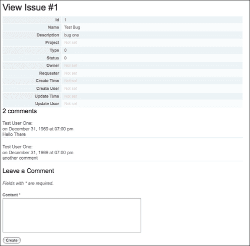
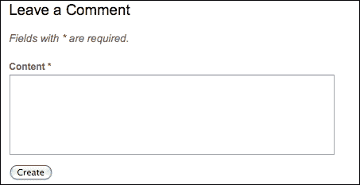
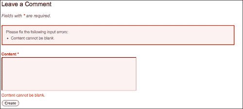
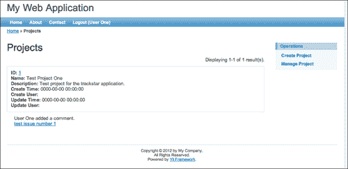
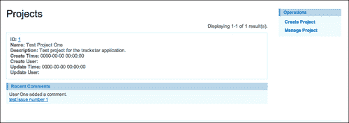
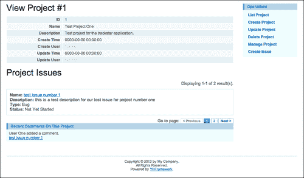

# 八、添加用户评论

随着前两章中用户管理的实施，我们的 Trackstar 应用程序真正开始成形。我们的大部分主要应用程序功能现在已经过时了。现在，我们可以开始关注一些令人愉快的特性。我们要解决的第一个问题是用户能够对项目问题发表评论。

用户参与项目问题对话的能力是任何问题跟踪工具应提供的一个重要部分。实现这一点的一种方法是允许用户直接就问题发表评论。这些评论将形成关于该问题的对话，并提供即时和历史背景，以帮助跟踪任何问题的整个生命周期。我们还将使用注释演示 Yii 小部件的使用，以及如何建立一个 portlet 模型来向用户交付内容（有关 portlet 的更多信息，请参阅[http://en.wikipedia.org/wiki/Portlet](http://en.wikipedia.org/wiki/Portlet) 。

# 特征规划

本章的目标是在 Trackstar 应用程序中实现特性功能，允许用户留下并阅读有关问题的评论。当用户查看任何项目问题的详细信息时，他们应该能够阅读以前添加的所有评论，以及创建关于该问题的新评论。我们还希望向项目列表页面添加一小部分内容或 portlet，以显示关于所有问题的最新评论列表。这将是一个很好的方式，可以提供一个了解最近用户活动的窗口，并允许轻松访问具有活动对话的最新问题。

以下是为实现这些目标我们需要完成的高级任务列表：

1.  设计并创建新的数据库表以支持注释。
2.  创建与新注释表关联的 Yii AR 类。
3.  将表单直接添加到问题详细信息页面，以允许用户提交评论。
4.  在问题的详细信息页面上直接显示与问题相关联的所有注释的列表。
5.  利用 Yii 小部件在项目列表页面上显示最新评论列表。

# 创建模型

我们首先需要创建一个新的表来容纳我们的评论。正如您所料，我们将使用数据库迁移来为我们的数据库结构添加以下内容：

```php
$ cd /Webroot/trackstar/protected
$ ./yiic migrate create create_user_comments_table
```

`up()`和`down()`方法如下：

```php
  public function up()
  {
    //create the issue table
    $this->createTable('tbl_comment', array(
      'id' => 'pk',
          'content' => 'text NOT NULL',
          'issue_id' => 'int(11) NOT NULL',
      'create_time' => 'datetime DEFAULT NULL',
      'create_user_id' => 'int(11) DEFAULT NULL',
      'update_time' => 'datetime DEFAULT NULL',
      'update_user_id' => 'int(11) DEFAULT NULL',
     ), 'ENGINE=InnoDB');

    //the tbl_comment.issue_id is a reference to tbl_issue.id 
    $this->addForeignKey("fk_comment_issue", "tbl_comment", "issue_id", "tbl_issue", "id", "CASCADE", "RESTRICT");

    //the tbl_issue.create_user_id is a reference to tbl_user.id 
    $this->addForeignKey("fk_comment_owner", "tbl_comment", "create_user_id", "tbl_user", "id", "RESTRICT, "RESTRICT");

    //the tbl_issue.updated_user_id is a reference to tbl_user.id 
    $this->addForeignKey("fk_comment_update_user", "tbl_comment", "update_user_id", "tbl_user", "id", "RESTRICT", "RESTRICT");

  }

  public function down()
  {
    $this->dropForeignKey('fk_comment_issue', 'tbl_comment');
    $this->dropForeignKey('fk_comment_owner', 'tbl_comment');
    $this->dropForeignKey('fk_comment_update_user', 'tbl_comment');
    $this->dropTable('tbl_comment');
  }
```

为了实现这个数据库变更，我们需要运行迁移：

```php
$ ./yiic migrate
```

现在我们的数据库表已经就绪，创建关联的 AR 类是一个简单的过程。在前面的章节中，我们已经多次看到这一点。我们完全知道如何做到这一点。我们只需使用 Gii 代码创建工具的**模型生成器**命令，根据我们新创建的表`tbl_comment`创建一个名为`Comment`的 AR 类。如果需要，请参阅[第 4 章](04.html "Chapter 4. Project CRUD")、*项目 CURD*和[第 5 章](05.html "Chapter 5. Managing Issues")、*管理问题*，了解使用此工具创建模型类的所有详细信息。

在使用 Gii 工具为注释创建模型类之后，您会注意到为我们生成的代码已经定义了一些关系。这些基于我们在`tbl_comments`表中定义的外键关系。以下是为我们创建的内容：

```php
/**
   * @return array relational rules.
   */
  public function relations()
  {
    // NOTE: you may need to adjust the relation name and the related
    // class name for the relations automatically generated below.
    return array(
      'updateUser' => array(self::BELONGS_TO, 'User', 'update_user_id'),
      'issue' => array(self::BELONGS_TO, 'Issue', 'issue_id'),
      'createUser' => array(self::BELONGS_TO, 'User', 'create_user_id'),
    );
  }
```

我们可以看到，我们有一个关系，指定注释属于某个问题。但我们还需要定义一个问题与其评论之间的一对多关系。一个问题可以有很多评论。此更改需要在`Issue`模型类中进行。

### 注

如果我们在创建问题模型的同时创建了我们的评论模型，那么这种关系就会为我们创建。

除此之外，我们还将添加一个关系作为统计查询，以便轻松检索与给定问题相关联的评论数量。以下是我们对`Issue::relations()`方法所做的更改：

```php
public function relations()
{
  return array(
    'requester' => array(self::BELONGS_TO, 'User', 'requester_id'),
    'owner' => array(self::BELONGS_TO, 'User', 'owner_id'),
    'project' => array(self::BELONGS_TO, 'Project', 'project_id'),
    'comments' => array(self::HAS_MANY, 'Comment', 'issue_id'),
    'commentCount' => array(self::STAT, 'Comment', 'issue_id'),
  );
}
```

这将在问题和评论之间建立一对多关系。它还定义了一个统计查询，允许我们轻松检索任何给定问题实例的总评论数。

### 提示

**统计查询**

前面定义的`commentCount`关系是一种新的类型的关系，我们以前从未见过。除了关系查询，Yii 还提供了所谓的统计或聚合关系。在对象之间存在一对多（`HAS_MANY`或`MANY_MANY`多对多关系的情况下，这些非常有用。在这种情况下，我们可以定义统计关系，以便轻松获得相关对象的总数。我们在前面的关系声明中利用了这一点，以便轻松检索任何给定问题实例的注释总数。有关在 Yii 中使用统计查询的更多信息，请参阅至[http://www.yiiframework.com/doc/guide/1.1/en/database.arr#statistical-查询](http://www.yiiframework.com/doc/guide/1.1/en/database.arr#statistical-query)。

我们还需要更改我们新创建的`Comment`AR 类，以扩展我们的自定义`TrackStarActiveRecord`基类，从而使其受益于我们在`beforeSave()`方法中放置的逻辑。只需更改类定义的开头，如下所示：

```php
<?php
      /**
 * This is the model class for table "tbl_comment".
 */
class Comment extends TrackStarActiveRecord
{
```

我们将对`Comment::relations()`方法中的定义做最后一个小改动。关系属性是在创建类时为我们命名的。让我们将名为`createUser`的更改为`author`，因为该相关用户代表该评论的作者。这只是一个语义变化，但它将有助于使我们的代码更易于阅读和理解。将定义从`'createUser' => array(self::BELONGS_TO, 'User', 'create_user_id'),`更改为`'author' => array(self::BELONGS_TO, 'User', 'create_user_id')`。

# 创建注释 CRUD

既然我们有了 AR 模型类，创建 CRUD 脚手架来管理相关实体就很容易了。只需使用 Gii 代码生成工具的**Crud 生成器**命令和 AR 类名`Comment`作为参数即可。在前面的章节中，我们已经多次看到了这一点，因此在此不再详细介绍。如果需要，请参阅[第 4 章](04.html "Chapter 4. Project CRUD")、*项目 CURD*和[第 5 章](05.html "Chapter 5. Managing Issues")、*管理问题*，了解使用 Gii 工具创建 CURD 脚手架代码的所有详细信息。尽管我们不会立即实施完整的 CRUD 操作以供发表意见，但能够为其他操作搭建脚手架还是很好的。

使用 Gii 的 Crud 生成器后，只要我们登录，我们现在就可以通过以下 URL 查看自动生成的评论提交表单：

`http://localhost/trackstar/index.php?r=comment/create`

# 改变脚手架以满足我们的要求

正如我们以前多次看到的那样，为了满足应用程序的特定要求，我们经常需要对自动生成的 scaffolding 代码进行调整。首先，我们用于创建新注释的自动生成表单为`tbl_comment`数据库表中定义的每一列都有一个输入字段。实际上，我们并不希望所有这些字段都成为表单的一部分。事实上，我们希望大大简化此表单，使注释内容只有一个输入字段。此外，我们不希望用户通过前面提到的 URL 访问表单，而只是通过访问问题详细信息页面。用户将在查看问题详细信息的同一页面上添加评论。我们希望朝着如下屏幕截图所示的方向发展：



为了实现这一点，我们将修改我们的`Issue`控制器类来处理评论表单的帖子，并修改 issue details 视图以显示现有评论和新的评论创建表单。此外，由于注释只应在问题的上下文中创建，因此我们将向问题模型类添加一个新方法来创建新注释。

## 添加评论

如前所述，我们将让 issue 实例创建自己的注释。为此，我们想在`Issue`AR 类中添加一个方法。以下是该方法：

```php
/**
  * Adds a comment to this issue
  */
public function addComment($comment)
{
  $comment->issue_id=$this->id;
  return $comment->save();
}
```

此方法确保在保存新注释之前正确设置注释问题 ID。也就是说，当`Issue`的实例创建新注释时，可以理解该注释属于该问题。

有了这个方法，我们现在可以将注意力转向问题控制器类。由于我们希望注释创建表单显示自`IssueController::actionView()`方法，并将其数据发布回`IssueController::actionView()`方法，因此我们需要更改该方法。我们还将添加一个新的受保护方法来处理表单 post 请求。首先，将`actionView()`方法修改为：

```php
public function actionView($id)
{
    $issue=$this->loadModel($id);
    $comment=$this->createComment($issue);
    $this->render('view',array(
      'model'=>$issue,
         'comment'=>$comment,
    ));
}
```

然后，添加以下受保护的方法来创建新的注释，并处理为该问题创建新注释的表单 post 请求：

```php
/**
  * Creates a new comment on an issue
  */
protected function createComment($issue)
{
  $comment=new Comment;  
  if(isset($_POST['Comment']))
  {
    $comment->attributes=$_POST['Comment'];
    if($issue->addComment($comment))
    {
      Yii::app()->user->setFlash('commentSubmitted',"Your comment has been added." );
      $this->refresh();
    }
  }
  return $comment;
}
```

我们新的受保护的方法`createComment()`负责处理用户对问题发表新评论时提交的`POST`请求。如果评论创建成功，我们将设置一条 flash 消息显示给用户，并进行页面刷新，以便显示新的评论。当然，我们仍然需要修改视图文件，以便向用户显示所有这些内容。对`IssueController::actionView()`所做的更改负责调用此新方法，并将新的注释实例提供给视图以供显示。

## 显示表单

现在，我们需要改变我们的观点。首先，我们将创建一个新的视图文件，以显示我们的注释和注释输入表单。我们打算在另一个视图文件中显示此视图文件。因此，我们不希望再次显示所有常规页面组件，例如页眉导航和页脚信息。打算在其他视图文件中显示的视图文件，或没有任何额外装饰的视图文件，称为**部分**视图。然后您可以使用控制器方法`renderPartial()`，而不是`render()`方法。使用`renderPartial()`将仅呈现该视图文件中包含的内容，不会使用任何其他内容装饰显示。当我们讨论使用布局和装饰视图文件时，我们将在[第 10 章](10.html "Chapter 10. Making It Look Good")*中更详细地讨论这一点，使其看起来更好*。

Yii 在创建局部视图文件时使用前导下划线（`_`的命名约定。因为我们将把它呈现为局部视图，所以我们将坚持命名约定，并以一个前导下划线开始文件名。在`protected/views/issue/`目录下创建一个名为`_comments.php`的新文件，并向该文件添加以下代码：

```php
<?php foreach($comments as $comment): ?>
<div class="comment">
      <div class="author">
    <?php echo CHtml::encode($comment->author->username); ?>:
  </div>

  <div class="time">
    on <?php echo date('F j, Y \a\t h:i a',strtotime($comment->create_time)); ?>
  </div>

  <div class="content">
    <?php echo nl2br(CHtml::encode($comment->content)); ?>
  </div>
     <hr>
</div><!-- comment -->
<?php endforeach; ?>
```

此文件接受注释实例数组作为输入参数，并逐个显示它们。我们现在需要更改问题详细信息的视图文件以使用此新文件。我们打开`protected/views/issue/view.php`并在文件末尾添加以下内容：

```php
<div id="comments">
  <?php if($model->commentCount>=1): ?>
    <h3>
      <?php echo $model->commentCount>1 ? $model->commentCount . ' comments' : 'One comment'; ?>
    </h3>

    <?php $this->renderPartial('_comments',array(
      'comments'=>$model->comments,
    )); ?>
  <?php endif; ?>

  <h3>Leave a Comment</h3>

  <?php if(Yii::app()->user->hasFlash('commentSubmitted')): ?>
    <div class="flash-success">
      <?php echo Yii::app()->user->getFlash('commentSubmitted'); ?>
    </div>
  <?php else: ?>
    <?php $this->renderPartial('/comment/_form',array(
      'model'=>$comment,
    )); ?>
  <?php endif; ?>

</div>
```

这里是利用了前面添加到`Issue`AR 模型类中的统计查询属性`commentCount`。这使我们能够快速确定是否有针对特定问题的评论。如果有注释，它将继续使用我们的`_comments.php`显示视图文件呈现它们。然后，它显示在我们使用 Gii Crud 生成器功能时为我们创建的输入表单。它还将显示成功保存注释后设置的简单闪存消息。

我们需要做的最后一个更改是注释输入表单本身。正如我们在过去多次看到的那样，为我们创建的表单对于基础`tbl_comment`表中定义的每一列都有一个输入字段。这不是我们想要向用户显示的内容。我们希望这是一个简单的输入表单，用户只需要提交评论内容。因此，打开包含输入表单的视图文件，即`protected/views/comment/_form.php`，并将其编辑为如下所示：

```php
<div class="form">
<?php $form=$this->beginWidget('CActiveForm', array(
  'id'=>'comment-form',
  'enableAjaxValidation'=>false,
)); ?>
       <p class="note">Fields with <span class="required">*</span> are required.</p>
       <?php echo $form->errorSummary($model); ?>
       <div class="row">
    <?php echo $form->labelEx($model,'content'); ?>
    <?php echo $form->textArea($model,'content',array('rows'=>6, 'cols'=>50)); ?>
    <?php echo $form->error($model,'content'); ?>
  </div>

  <div class="row buttons">
    <?php echo CHtml::submitButton($model->isNewRecord ? 'Create' : 'Save'); ?>
  </div>

<?php $this->endWidget(); ?>

</div>
```

所有这些都放在位置，我们可以访问问题列表页面查看评论表单。例如，如果我们访问`http://localhost/trackstar/index.php?r=issue/view&id=111`，我们会在页面底部看到以下评论输入表单：



如果我们试图在未指定任何内容的情况下提交评论，我们会看到如下屏幕截图所示的错误：



然后，如果我们以`User One`身份登录并提交注释`My first test comment`，我们将看到以下显示：


# 创建最近的评论小部件

现在我们有能力对问题发表评论，我们将把重点转向本章的第二个目标。我们希望显示一个列表，其中列出所有项目中关于各种问题的最新评论。这将提供应用程序内用户通信活动的良好快照。我们还希望以一种能够在整个站点的不同位置轻松重用的方式构建这一小块内容。这与互联网上无数门户网站应用程序的风格非常相似。这些内容的小片段通常被称为**portlet**，这就是我们在本章开头提到构建 portlet 体系结构的原因。同样，您可以参考[http://en.wikipedia.org/wiki/Portlet](http://en.wikipedia.org/wiki/Portlet) 了解有关此主题的更多信息。

## 介绍 CWidget

我们很幸运，Yii 已经准备好帮助我们实现这一架构。Yii 提供了一个名为`CWidget`的组件类，非常适合实现这种类型的体系结构。Yii**小部件**是`CWidget`类（或其子类）的实例，是通常嵌入视图文件中以显示自包含、可重用用户界面特征的表示组件。我们将使用一个 Yii 小部件构建一个最近的评论组件，并将其显示在主项目详细信息页面上，这样我们就可以看到与项目相关的所有问题的评论活动。为了演示重用的易用性，我们将更进一步，并在“项目列表”页面上显示所有项目的最新评论列表。

### 命名作用域

为了开始创建我们的小部件，我们将首先修改`Comment`AR 模型类，以返回最近添加的注释。为此，我们将利用 Yii 的 AR 模型类中名为 scopes 的另一个特性。

**命名范围**允许我们指定一个命名查询，这为在检索 AR 对象列表时定义 SQL`where`条件提供了一种优雅的方式。命名范围通常在`CActiveRecord::scopes()`方法中定义为`name=>criteria`对。例如，如果我们想要定义一个名为`recent`的命名范围，它将返回五条最近的注释；我们可以创建如下的`Comment::scopes()`方法：

```php
class Comment extends TrackStarActiveRecord
{
  ...
  public function scopes()
  {
    return array(
      'recent'=>array(
        'order'=>'create_time DESC',
        'limit'=>5,
      ),
    );
  }
...
}
```

现在，我们可以使用以下语法轻松检索最近的注释列表：

```php
$comments=Comment::model()->recent()->findAll();
```

您还可以将命名的作用域链接在一起。如果我们定义了另一个命名范围，例如，`approved`（如果我们的应用程序在显示评论之前有一个审批流程），我们可以得到最近批准的评论列表，因此：

```php
$comments=Comment::model()->recent()->approved()->findAll();
```

您可以看到，通过将这些链接在一起，我们有了一种灵活而强大的方法来检索特定上下文中的对象。

命名作用域必须出现在`find`调用的左侧（`find`、`findAll`、`findByPk`等），并且只能在类级上下文中使用。命名的作用域方法调用必须与`ClassName::model()`一起使用。参见[http://www.yiiframework.com/doc/guide/1.1/en/database.ar#named-作用域](http://www.yiiframework.com/doc/guide/1.1/en/database.ar#named-scopes)了解有关命名作用域的更多信息。

命名作用域也可以参数化。在前面的`recent`命名的评论范围中，我们将标准中的限制硬编码为`5`。但是，我们可能希望在调用该方法时能够指定限制数。这就是我们将如何设置注释的命名范围。为了添加参数，我们对命名范围的指定略有不同。我们没有使用`scopes()`方法来声明我们的范围，而是定义了一个新的公共方法，其名称与范围名称相同。将以下方法添加到`Comment`AR 类中：

```php
public function recent($limit=5)
{
  $this->getDbCriteria()->mergeWith(
    array(         
    'order'=>'t.create_time DESC',         
      'limit'=>$limit,     
    )
  );     
  return $this;
}
```

关于这个查询条件，需要注意的一点是在订单值中使用了`t`。这是为了在与具有相同列名的另一个相关表一起使用时提供帮助。显然，当两个被连接的表具有同名的列时，我们必须在查询中区分这两个表。例如，如果我们在检索`Issue`AR 信息的同一个查询中使用它，`tbl_issue`和`tbl_comment`表都定义了`create_time`列。我们试图通过`tbl_comment`表中的此列订购，而不是问题表中定义的列。在 Yii 的关系 AR 查询中，主表的别名固定为`t`，而关系表的别名默认与对应的关系名相同。因此，在本例中，我们指定`t.create_time`来指示我们要使用主表的列。

### 更多关于 Yii 中的关系 AR 查询

在位置使用此方法，我们可以将命名范围与渴望加载方法相结合，也可以检索相关的`Issue`AR 实例。例如，假设我们希望获得与 ID 为`1`的项目相关的问题的最后十条评论。我们可以使用以下方法来实现此目的：

```php
$comments = Comment::model()->with(array('issue'=>array('condition'=>'project_id=1')))->recent(10)->findAll();
```

这个问题对我们来说是新问题。在之前的查询中，我们没有使用这些选项中的很多。以前，我们使用不同的方法执行关系查询：

*   加载 AR 实例
*   访问`relations()`方法中定义的关系属性

例如，如果我们想查询与项目 ID#1 相关的所有问题，我们将使用类似于以下两行代码的内容：

```php
// First retrieve the project whose ID is 1
$project=Project::model()->findByPk(1);

// Then retrieve the project's issues (a relational query is actually being performed behind the scenes here)
$issues=$project->issues;
```

这种熟悉的方法使用所谓的**延迟加载**。当我们第一次创建项目实例时，查询不会返回所有相关问题。它仅在后续显式请求时（即执行`$project->issues`时）检索相关问题。这被称为“懒惰”，因为它等待加载问题，直到稍后请求它们。

这种方法非常方便，也非常有效，特别是在不需要相关问题的情况下。然而，在其他情况下，这种方法可能有点低效。例如，如果我们想要跨*N*项目检索问题信息，那么使用这种惰性方法将涉及执行*N*连接查询。根据*N*的大小，这可能是非常低效的。在这些情况下，我们还有另一个选择。我们可以使用所谓的**快速加载**。

急切加载方法在请求主 AR 实例的同时检索相关 AR 实例。这是通过使用`with()`方法配合`find()`或`findAll()`方法进行 AR 查询来实现的。按照我们的项目示例，我们可以通过执行以下一行代码，使用渴望加载来检索所有项目的所有问题：

```php
//retrieve all project AR instances along with their associated issue AR instances
$projects = Project::model()->with('issues')->findAll();
```

现在，在本例中，`$projects`数组中的每个项目 AR 实例都已使用`Issue`AR 实例数组填充了其关联的`issues`属性。这个结果是通过只使用一个连接查询实现的。

那么，让我们回顾一下检索特定项目最后十条注释的示例：

```php
$comments = Comment::model()->with(array('issue'=>array('condition'=>'project_id=1')))->recent(10)->findAll();
```

我们正在使用渴望加载方法来检索问题和注释，但是这个方法稍微复杂一些。此查询指定了`tbl_comment`和`tbl_issue`表之间的单个联接。此关系 AR 查询基本上会执行类似于以下 SQL 语句的内容：

```php
SELECT tbl_comment.*, tbl_issue.* FROM tbl_comment LEFT OUTER JOIN tbl_issue ON (tbl_comment.issue_id=tbl_issue.id) WHERE (tbl_issue.project_id=1) ORDER BY tbl_comment.create_time DESC LIMIT 10;
```

有了关于 Yii 中延迟加载与急切加载的好处的知识，我们应该在`IssueController::actionView()`方法中调整问题模型的加载方式。由于我们已更改了问题的详细视图以显示我们的评论，包括评论作者，我们知道，在我们调用`IssueController::loadModel()`时，使用急切加载方法将我们的评论与其各自的作者一起加载会更有效。为此，我们可以添加一个附加参数作为简单的输入标志，以指示是否也要加载注释。

将`IssueController::loadModel()`方法修改如下：

```php
   public function loadModel($id, $withComments=false)
  {
    if($withComments)
      $model = Issue::model()->with(array('comments'=>array('with'=>'author')))->findByPk($id);
    else
      $model=Issue::model()->findByPk($id);
    if($model===null)
      throw new CHttpException(404,'The requested page does not exist.');
    return $model;
  }
```

在`IssueController`方法中调用`loadModel()`方法的地方有三个：`actionView`、`actionUpdate`和`actionDelete`。我们仅在查看问题详细信息时需要相关的注释。因此，我们默认不检索相关注释。我们只需要修改`actionView()`方法，将`true`添加到`loadModel()`调用中。

```php
public function actionView($id)
{
  $issue=$this->loadModel($id, true);
....
}
```

在位置，我们将加载该问题及其所有相关评论，对于每个评论，我们将加载相关作者信息，所有这些都只需一个数据库调用。

### 创建小部件

我们现在准备创建新的小部件，利用前面提到的所有更改来显示我们最近的评论。

如前所述，Yii 中的小部件是从框架类`CWidget`或其子类之一扩展而来的类。我们将把新的小部件添加到`protected/components/`目录，因为这个目录的内容已经在主配置文件中指定，将在应用程序中自动加载。这样，我们就不必每次希望使用该类时都显式地导入它。我们将调用我们的小部件`RecentComments`并将一个同名的`.php`文件添加到此目录。将以下类定义添加到此新创建的`RecentComments.php`文件：

```php
<?php
/**
     * RecentCommentsWidget is a Yii widget used to display a list of recent comments 
     */
class RecentCommentsWidget extends CWidget
{
    private $_comments;  
    public $displayLimit = 5;
    public $projectId = null;

    public function init()
        {
          if(null !== $this->projectId)
        $this->_comments = Comment::model()->with(array('issue'=>array('condition'=>'project_id='.$this->projectId)))->recent($this->displayLimit)->findAll();
      else
        $this->_comments = Comment::model()->recent($this->displayLimit)->findAll();
        }  

        public function getData()
        {
          return $this->_comments;
        }

        public function run()
        {
            // this method is called by CController::endWidget()    
            $this->render('recentCommentsWidget');
        }
}
```

创建新小部件时涉及的主要工作是重写基类的`init()`和`run()`方法。`init()`方法初始化小部件，并在初始化其属性后调用。`run()`方法执行小部件。在本例中，我们使用前面讨论的查询，通过基于`$displayLimit`和`$projectId`属性请求最近的注释来初始化小部件。小部件本身的执行只是呈现其关联的视图文件，我们尚未创建该文件。按照惯例，小部件的视图文件放置在小部件所在的同一目录中的`views/`目录中，其名称与小部件相同，但以小写字母开头的除外。按照此约定，创建一个完全限定路径为`protected/components/views/recentCommentsWidget.php`的新文件。创建后，将以下内容添加到该文件：

```php
<ul>
  <?php foreach($this->getData() as $comment): ?>  
    <div class="author">
      <?php echo $comment->author->username; ?> added a comment.
    </div>
    <div class="issue">      
       <?php echo CHtml::link(CHtml::encode($comment->issue->name), array('issue/view', 'id'=>$comment->issue->id)); ?>
      </div>

  <?php endforeach; ?>
</ul>
```

这将调用`RecentCommentsWidget::getData()`方法，该方法返回一个注释数组。然后，它会对每个问题进行迭代，显示谁添加了评论以及留下评论的相关问题。

为了查看结果，我们需要将这个小部件嵌入到现有的控制器视图文件中。如前所述，我们希望在项目列表页面上使用此小部件来显示所有项目的所有最新评论，并在特定项目详细信息页面上显示该特定项目的最新评论。

让我们从项目列表页面开始。负责显示该内容的视图文件为`protected/views/project/index.php`。打开该文件并在底部添加以下内容：

```php
<?php $this->widget('RecentCommentsWidget'); ?>  
```

如果我们现在查看项目列表页面`http://localhost/trackstar/index.php?r=project`，我们会看到类似于以下屏幕截图的内容：



我们现在已经在页面中嵌入了我们最新的评论数据，只需调用小部件即可。这很好，但我们可以将我们的小部件再向前推进一步，使其以与应用程序中所有其他潜在的*Portlet*一致的方式显示。我们可以利用 Yii 提供给我们的另一个类`CPortlet`来实现这一点。

### 引入 CPortlet

`CPortlet`是 Zii 的部分，Zii 是随 Yii 打包的官方扩展类库。它为所有 portlet 样式的小部件提供了一个很好的基类。它将允许我们呈现一个好的标题以及一致的 HTML 标记，这样应用程序中的所有 Portlet 都可以轻松地以类似的方式进行样式化。一旦我们有了一个呈现内容的小部件，比如我们的`RecentCommentsWidget`，我们就可以简单地使用小部件呈现的内容作为`CPortlet`的内容，而`CPortlet`本身就是一个小部件，因为它也从`CWidget`扩展而来。我们可以通过在`beginWidget()`和`endWiget()`调用`CPortlet`之间调用`RecentComments`小部件，如下所示：

```php
<?php $this->beginWidget('zii.widgets.CPortlet', array(
  'title'=>'Recent Comments',
));  

$this->widget('RecentCommentsWidget');

$this->endWidget(); ?>
```

因为`CPortlet`提供了一个 title 属性，所以我们将其设置为对 portlet 有意义的内容。然后，我们使用`RecentComments`小部件的呈现内容为 portlet 小部件提供内容。以下屏幕截图描述了最终结果：



这与以前相比并不是一个很大的变化，但现在我们已经将内容放入了一个一致的容器中，该容器已经在整个站点中使用。请注意右侧列菜单内容块和我们新创建的最近评论内容块之间的相似性。我相信您不会感到惊讶，这个右栏菜单块也显示在`CPortlet`容器中。查看`protected/views/layouts/column2.php`，这是`yiic webapp`命令在我们最初创建应用程序时为我们自动生成的文件，显示以下代码：

```php
<?php
  $this->beginWidget('zii.widgets.CPortlet', array(
    'title'=>'Operations',
  ));
  $this->widget('zii.widgets.CMenu', array(
    'items'=>$this->menu,
    'htmlOptions'=>array('class'=>'operations'),
  ));
  $this->endWidget();
?>
```

因此，应用程序似乎一直在利用 Portlet！

#### 将我们的小部件添加到另一个页面

我们还将 portlet 添加到项目详细信息页面中，并将注释仅限于与特定项目相关的注释。

在`protected/views/project/view.php`文件末尾添加以下内容：

```php
<?php $this->beginWidget('zii.widgets.CPortlet', array(
  'title'=>'Recent Comments On This Project',
));  

$this->widget('RecentCommentsWidget', array('projectId'=>$model->id));

$this->endWidget(); ?>
```

这与我们添加到项目列表页面的内容基本相同，只是我们通过向调用中添加一个`name=>value`对数组来初始化小部件的`$projectId`属性。

如果我们现在访问特定的项目详细信息页面，我们将看到类似于以下屏幕截图的内容：



前面的屏幕截图显示了**项目**的详细信息页面，如屏幕截图所示，该项目有一个相关问题，只有一条评论。您可能需要添加一些问题和对这些问题的评论，以便生成类似的显示。我们现在有了一种方法，可以在整个站点的任何位置以一致且易于维护的方式显示最近的评论，其中包含一些不同的可配置参数。

# 总结

在本章中，我们已经开始使用当今大多数基于用户的 web 应用程序所期望的功能来刷新我们的 Trackstar 应用程序。用户在应用程序中相互通信的能力是成功的问题管理系统的重要组成部分。

当我们创建这个基本特性时，我们能够更深入地研究如何编写关系 AR 查询。我们还介绍了称为小部件和 portlet 的内容组件。这向我们介绍了一种开发小型内容块并能够在整个应用程序中的任何位置使用它们的方法。这种方法大大提高了重用性、一致性和易维护性。

在下一章中，我们将以这里创建的最近的评论小部件为基础，将小部件生成的内容公开为 RSS 订阅，以允许用户无需访问应用程序即可跟踪应用程序或项目活动。