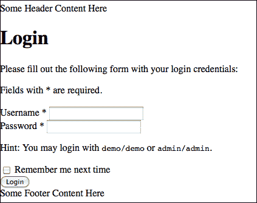
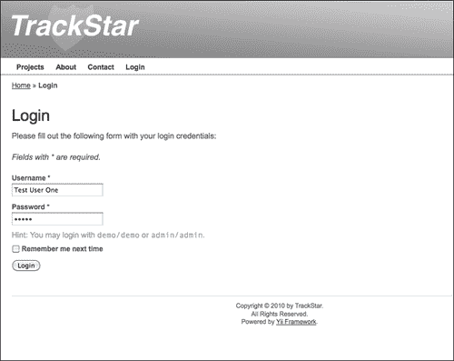
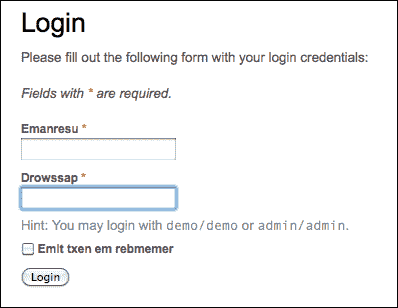
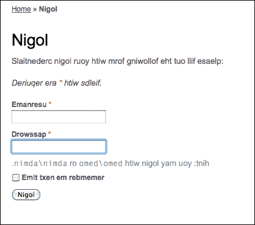

# 第十章，让它看起来好看

在上一章中，我们开始为我们的应用程序增加一点美感，使我们的 URL 对用户和搜索引擎爬网站点的机器人更具吸引力。在本章中，我们将通过讨论 Yii 中的布局和主题，将重点更多地放在应用程序的外观上。我们将重点关注帮助设计 Yii 应用程序前端的方法和可用工具，而不是设计本身。因此，本章将更多地关注如何使您的应用程序看起来更漂亮，而不是花大量时间专门设计我们的 TrackStar 应用程序，使其看起来更漂亮。

# 特征规划

本章旨在关注前端。我们希望为我们的站点创建一个可重用且能够动态实现的新外观。我们还希望在不覆盖或删除当前设计的情况下实现这一点。最后，我们将深入了解 Yii 的国际化特性，以更好地了解如何适应不同地理区域的用户。

以下是为实现这些目标，我们需要完成的高级任务列表：

*   通过创建新的布局、CSS 和为应用程序提供新前端设计所需的其他资产文件，为应用程序创建新主题
*   使用 Yii 的国际化和本地化功能帮助将应用程序的一部分翻译成新语言

# 布局设计

您可能已经注意到，我们在应用程序中添加了很多功能，但没有添加任何明确的导航来访问此功能。我们的主页还没有改变我们构建的默认应用程序。我们仍然拥有与第一次创建新应用程序时相同的导航项。我们需要更改基本导航，以更好地反映应用程序中存在的底层功能。

到目前为止，我们还没有完全介绍应用程序如何使用负责显示内容的所有视图文件。我们知道，视图文件负责数据显示，并负责容纳响应每个页面请求而发回的 HTML。当我们创建新的控制器动作时，我们通常会创建新的视图来处理这些动作方法返回的内容的显示。这些视图中的大多数都非常特定于它们支持的操作方法，并且不会跨多个页面使用。然而，有些东西，例如主菜单导航，在整个站点的多个页面上使用。这些类型的 UI 组件更适合驻留在所谓的布局文件中。

Yii 中的**布局**是一个特殊的视图文件，用于装饰其他视图文件。布局通常包含跨多个视图文件通用的标记或其他用户界面组件。使用布局渲染视图文件时，Yii 会将视图文件嵌入到布局中。

## 指定布局

有两个主要位置可以指定布局。一个是`CWebApplication`本身名为`$layout`的属性。默认为`protected/views/layouts/main.php`。与所有应用程序设置一样，此可以在主配置文件`protected/config/main.php`中覆盖。例如，如果我们创建了一个新的布局文件`protected/views/layouts/newlayout.php`并希望将此新文件用作我们的应用程序范围的布局文件，那么我们可以更改主`config.php`文件以将布局属性设置为：

```php
return array(
  ...
  'layout'=>'newlayout',
```

指定的文件名不带`.php`扩展名，并且与`CWebApplication`的`$layoutPath`属性相关，该属性默认为`Webroot/protected/views/layouts`（如果此位置不适合应用程序的需要，则可以以类似的方式覆盖该属性）。

另一个指定布局的地方是通过设置控制器类的`$layout`属性。这允许在逐个控制器的基础上对布局进行更精细的控制。这是我们在生成初始应用程序时指定的方式。使用`yiic`工具创建初始应用程序时，会自动创建一个控制器基类`Webroot/protected/components/Controller.php`，其他所有控制器类都从该基类扩展。打开此文件显示，`$layout`属性已设置为`column1`。在更精细的控制器级别设置布局文件将覆盖`CWebApplication`类中的设置。

## 应用和使用布局

布局文件的使用隐含在对`CController::render()`方法的调用中。也就是说，当您调用`render()`方法来呈现视图文件时，Yii 将把视图文件的内容嵌入控制器类或应用程序级指定的布局文件中。通过调用`CController::renderPartial()`方法，可以避免对渲染视图文件应用任何布局装饰。

如前所述，布局文件通常用于装饰其他视图文件。布局的一个示例是为每个页面提供一致的页眉和页脚布局。调用`render()`方法时，幕后发生的事情是首先对指定视图文件上的`renderPartial()`发送调用。其输出存储在名为`$content`的变量中，该变量随后可用于布局文件。因此，一个非常简单的布局文件可能如下所示：

```php
<!DOCTYPE html>
<html>
<head>
<title>Title of the document</title>
</head>
<body>
  <div id="header">
    Some Header Content Here
  </div>

  <div id="content">
    <?php echo $content; ?>
  </div>

  <div id="footer">
      Some Footer Content Here
  </div>
</body>
</html>
```

事实上，让我们试试这个。创建一个名为`newlayout.php`的新文件，并将其放置在布局文件的默认目录中，名为`/protected/views/layouts/`。将前面的 HTML 内容添加到此文件并保存它。现在我们将通过改变我们的站点控制器来使用这个新的布局。打开`SiteController.php`并通过将其显式添加到此类来覆盖基类中设置的布局属性，如下所示：

```php
class SiteController extends Controller
{

  public $layout='newlayout';
```

这将布局文件设置为`newlayout.php`，但仅适用于该控制器。现在我们每次调用`SiteController`中的`render()`方法时，都会使用`newlayout.php`布局文件。

`SiteController`负责呈现的一个页面是登录页面。让我们看看那个页面来验证这些变化。如果我们导航到`http://localhost/trackstar/site/login`（假设我们尚未登录），我们现在会看到类似于以下屏幕截图的内容：



如果我们简单地注释掉刚才添加的`$layout`属性并再次刷新登录页面，我们将回到原来的`main.php`布局，我们的页面现在将回到之前的样子。

# 解构 main.php 布局文件

到目前为止，我们所有的应用程序页面都使用了`main.php`布局文件来提供主布局标记。在我们开始更改页面布局和设计之前，仔细查看一下这个主布局文件会对我们有好处。您可以从本章的可下载代码中查看其全部内容，或在[处查看独立文件 https://gist.github.com/3781042](https://gist.github.com/3781042) 。

前五行可能看起来有些熟悉：

```php
<!DOCTYPE html PUBLIC "-//W3C//DTD XHTML 1.0 Transitional//EN" "http://www.w3.org/TR/xhtml1/DTD/xhtml1-transitional.dtd">
<html  xml:lang="en" lang="en">
<head>
  <meta http-equiv="Content-Type" content="text/html; charset=utf-8" />
  <meta name="language" content="en" />
```

这些行定义了一个标准的 HTML 文档类型声明，后跟一个起始的`<html>`元素，然后是我们的`<head>`元素的起始。在`<head>`标记中，我们首先有一个`<meta>`标记来声明标准的`XHTML-compliant uft-8`字符编码，然后是另一个`<meta>`标记，该标记指定`English`为网站编写的主要语言。

## 介绍蓝图 CSS 框架

接下来的几行以注释`<!—blueprint CSS framework -->`开头，您可能不太熟悉。Yii 的另一个优点是，它在适当的时候利用了其他同类最佳的框架，blueprintcss 框架就是这样一个例子。

Blueprint CSS 框架作为我们最初创建应用程序时使用`yiic`工具的副产品包含在应用程序中。包括它是为了帮助标准化 CSS 开发。Blueprint 是一个 CSS 网格框架。它有助于标准化 CSS，提供跨浏览器兼容性，并提供 HTML 元素放置的一致性，帮助减少 CSS 错误。它提供了许多屏幕和打印友好的布局定义，并通过提供您所需的所有 CSS 帮助启动您的设计，以获得外观良好且到位的内容。有关蓝图框架的更多信息，请访问[http://www.blueprintcss.org/](http://www.blueprintcss.org/) 。

因此，Blueprint CSS 框架需要以下代码行：

```php
<!-- blueprint CSS framework -->
<link rel="stylesheet" type="text/css" href="<?php echo Yii::app()->request->baseUrl; ?>/css/screen.css" media="screen, projection" />
<link rel="stylesheet" type="text/css" href="<?php echo Yii::app()->request->baseUrl; ?>/css/print.css" media="print" />
<!--[if lt IE 8]>
<link rel="stylesheet" type="text/css" href="<?php echo Yii::app()->request->baseUrl; ?>/css/ie.css" media="screen, projection" />
<![endif]-->
```

此处使用对`Yii::app()->request->baseUrl;`的调用来获取应用程序的相对 URL。

### 了解图纸安装

Yii 绝不需要使用蓝图。但是，由于生成的默认应用程序确实包含该框架，因此了解其安装和使用将是有益的。

Blueprint 的典型安装包括首先下载框架文件，然后将其中三个`.css`文件放入 Yii 应用程序的主`css`目录。如果我们查看一下 TrackStar 应用程序中的主`Webroot/css`目录，我们已经看到包含以下三个文件：

*   `ie.css`
*   `print.css`
*   `screen.css`

幸运的是，基本安装已经完成。为了利用该框架，需要将之前的`<link>`标记放在每个网页的`<head>`标记下。这就是在布局文件中进行这些声明的原因。

接下来的两个`<link>`标签如下：

```php
<link rel="stylesheet" type="text/css" href="<?php echo Yii::app()->request->baseUrl; ?>/css/main.css" />
<link rel="stylesheet" type="text/css" href="<?php echo Yii::app()->request->baseUrl; ?>/css/form.css" />
```

这些`<link>`标记定义了一些自定义`css`定义，除了在蓝图文件中指定的定义外，还用于提供布局声明。您应该始终将任何自定义定义放在 Blueprint 提供的定义之下，以便您的自定义声明优先。

## 设置页面标题

在每页的基础上设置一个特定且有意义的页面标题对于在搜索引擎中为您的网站页面编制索引非常重要，并且对希望为您网站的特定页面添加书签的用户非常有用。主布局文件中的下一行指定浏览器中的页面标题：

```php
<title><?php echo CHtml::encode($this->pageTitle); ?></title>
```

请记住，视图文件中的`$this`是指最初呈现视图的控制器类实例。`$pageTitle`属性是在 Yii 的`CController`基类中定义的，默认为操作名，后跟控制器名。在特定的控制器类中，甚至在每个特定的视图文件中，都可以轻松地进行自定义。

## 定义页眉

通常情况下，网站设计为在多个页面上重复一致的标题内容。主布局文件中接下来的几行定义了页眉区域：

```php
<body>
<div class="container" id="page">

  <div id="header">
    <div id="logo"><?php echo CHtml::encode(Yii::app()->name); ?></div>
  </div><!-- header -->
```

Blueprint 框架需要第一个类为`container`的`<div>`标记，以便将内容显示为网格。

### 注

同样，使用 Blueprint CSS 网格框架或任何其他 CSS 框架根本不是 Yii 的要求。如果需要的话，它可以帮助你快速启动你的设计布局。

接下来的三行是我们在这些页面上看到的第一个主要内容。它们以大写字母显示应用程序的名称。到目前为止，它一直在显示文本**我的 Web 应用程序**。我相信这已经让你们中的一些人发疯了。虽然我们以后可能会将其更改为使用徽标图像，但让我们继续将其更改为我们应用程序的真实名称，**TrackStar**。

我们可以在 HTML 中对这个名称进行硬编码。但是，如果我们更改应用程序配置以反映我们的新名称，这些更改将传播到整个站点的任何地方，无论`Yii::app()->name`在哪里使用。我相信在这一点上你可以在你的睡眠中做这个简单的改变。只需打开定义应用程序配置设置的主`config.php`文件`/protected/config/main.php`，并将`name`属性的值从`'name'=>'My Web Application',`更改为新值`'name'=>'TrackStar',`。

保存文件，刷新浏览器，主页上的标题现在应类似于以下屏幕截图：


我们在上一个截图中立即注意到的一点是，在两个地方进行了更改。碰巧负责我们主页内容的视图文件`/protected/views/site/index.php`也使用了应用程序名属性。由于我们在应用程序配置文件中进行了更改，所以我们的更改在这两个地方都得到了反映。

由于 name 属性是您可能会在某个时候决定更改的内容，因此最好同时定义 application`id`属性。框架使用此属性创建唯一的签名密钥，作为访问会话变量、缓存数据和其他令牌的前缀。如果没有指定`id`属性，则将使用`name`属性。因此，更改它可能会导致此数据无效。让我们为我们的应用程序定义一个`id`属性。这被添加到`protected/config/main.php`，就像我们对`name`房产所做的一样。我们可以使用与名称相同的值：

```php
'id'=>'TrackStar',
```

## 显示菜单导航项

主站点的导航控件通常在 web 应用程序中的多个页面上重复，将其包含在布局中使其易于重用。主布局文件中的下一块标记和代码定义了顶级菜单项：

```php
<div id="mainmenu">
  <?php $this->widget('zii.widgets.CMenu',array(
    'items'=>array(
      array('label'=>'Home', 'url'=>array('/site/index')),
      array('label'=>'About', 'url'=>array('/site/page', 'view'=>'about')),
      array('label'=>'Contact', 'url'=>array('/site/contact')),
      array('label'=>'Login', 'url'=>array('/site/login'), 'visible'=>Yii::app()->user->isGuest),
      array('label'=>'Logout ('.Yii::app()->user->name.')', 'url'=>array('/site/logout'), 'visible'=>!Yii::app()->user->isGuest)
    ),
  )); ?>
</div><!-- mainmenu -->
```

这里我们看到一个名为`CMenu`的 Zii 组件正在使用。我们在[第 8 章](08.html "Chapter 8. Adding User Comments")中介绍了 Zii，*添加了用户评论*。为了增加记忆，Zii 扩展库是由 Yii 开发团队开发的一组扩展。这个库附带了核心 Yii 框架。这些扩展中的任何一个都可以很容易地在 Yii 应用程序中使用，只需使用`zii.path.to.ClassName`形式的路径别名引用所需的扩展类文件即可。根别名`zii`由应用程序预定义，路径的其余部分相对于此框架目录。由于这个 Zii 菜单扩展位于您的文件系统中的`YiiRoot/zii/widgets/CMenu.php`，所以在我们的应用程序代码中引用它时，我们可以简单地使用`zii.widgets.CMenu`。

`CMenu`接收提供菜单项的关联数组。每个项目数组包括一个将要显示的`label`，一个该项目应链接到的 URL，以及一个可选的第三个值`visible`，该值是指示是否应显示该菜单项的`boolean`值。在定义**登录**和**注销**菜单项时使用此选项。我们只希望在用户尚未登录的情况下，**登录**菜单项显示为可点击链接。相反，如果用户已经登录，我们只希望显示**注销**菜单链接。数组中可见元素的使用允许我们根据用户是否登录动态显示这些链接。`Yii::app()->user->isGuest`的使用就是为了这个。如果用户未登录，则返回`true`，如果用户登录，则返回`false`。我相信您已经注意到，只要您登录，**登录**选项就会在我们的应用程序主菜单中变为**注销**选项，反之亦然。

让我们更新菜单，为用户提供导航到特定 TrackStar 功能的方法。首先，我们不希望匿名用户能够访问除登录之外的任何实际功能。因此，我们需要确保登录页面或多或少是匿名用户的主页。此外，登录用户的主页应该只是他们的项目列表。我们将通过进行以下更改来实现这一点：

1.  将应用程序的默认主 URL 更改为项目列表页面，而不是现在的`site/index`。
2.  将默认控制器`SiteController`中的默认操作更改为登录操作。这样，任何访问顶级 URL`http://localhost/trackstar/`的匿名用户都将被重定向到登录页面。
3.  修改我们的`actionLogin()`方法，如果用户已经登录，则将其重定向到项目列表页面。
4.  将**主页**菜单项更改为**项目**，并将 URL 更改为项目列表页面。

这些都是我们需要做的简单改变。从顶部开始，我们可以在主应用程序`config.php`文件中更改 home URL 应用程序属性。打开`protected/config/main.php`并将以下`name=>value`对添加到返回的数组中：

```php
'homeUrl'=>'/trackstar/project',
```

这就是做出改变所需要的一切。

对于下一个更改，打开`protected/controllers/SiteController.php`并将以下内容添加到控制器类的顶部：

```php
public $defaultAction = 'login';
```

这将默认操作设置为登录。现在，如果您访问应用程序的顶级 URL`http://localhost/trackstar/`，您将被带到登录页面。唯一的问题是，无论您是否已登录，您都将继续从此顶级 URL 进入登录页面。让我们通过实现上一个列表中的步骤 3 来解决这个问题。将`SiteController`中的`actionLogin()`方法更改为在方法开头包含以下代码：

```php
public function actionLogin()
{

  if(!Yii::app()->user->isGuest) 
     {
          $this->redirect(Yii::app()->homeUrl);
     }
```

这将把所有登录的用户重定向到应用程序`homeUrl`，我们之前刚刚将其设置为项目列表页面。

最后，让我们更改`CMenu`小部件的输入数组，以更改**主页**菜单项的规格。更改`main.php`布局文件中的代码块，并用以下内容替换`array('label'=>'Home', 'url'=>array('/site/index')),`行：

```php
array('label'=>'Projects', 'url'=>array('/project')),
```

有了这个替代品，我们之前概述的所有变更都到位了。如果我们现在以匿名用户身份访问 TrackStar 应用程序，我们将被引导到登录页面。如果我们点击**项目**链接，我们仍然会被引导到登录页面。我们仍然可以访问关于和**联系人**的**页面，这对于匿名用户来说是很好的。如果我们登录，我们将被引导到项目列表页面。现在，如果我们点击**项目**链接，我们可以看到项目列表。**

## 创建面包屑导航

回到我们的`main.php`布局文件，菜单小部件后面的三行代码定义了另一个名为`CBreadcrumbs`的 Zii 扩展小部件：

```php
<?php $this->widget('zii.widgets.CBreadcrumbs', array(
  'links'=>$this->breadcrumbs,
)); ?><!-- breadcrumbs -->
```

这是另一个 Zii 小部件，可用于显示链接列表，指示当前页面相对于整个网站中其他页面的位置。例如，**项目>>项目 1>>编辑**格式的链接导航列表表示用户正在查看项目 1 的编辑页面。这有助于用户找到他们开始的地方，这是所有项目的列表，并且很容易看到他们在网站页面层次结构中的位置。这就是为什么它被称为**面包屑**。许多网站在设计中实现了这种类型的 UI 导航组件。

要使用这个小部件，我们需要配置它的`links`属性，它指定要显示的链接。此属性的预期值是一个数组，该数组定义从起点到正在查看的特定页面的`breadcrumb`路径。使用前面的示例，我们可以将`links`数组指定为：

```php
array(
  'Projects'=>array('project/index'),
  'Project 1'=>array('project/view','id'=>1),
  'Edit',
  )
```

`breadcrumbs`小部件默认情况下会根据应用程序配置设置`homeUrl`自动添加顶级**主页**链接。因此，从前面的代码片段生成的将是如下所示的面包屑：

**首页>>项目>>项目 1>>编辑**

因为我们显式地将应用程序`$homeUrl`属性设置为项目列表页面，所以在本例中，我们的前两个链接是相同的。布局文件中的代码将链接属性设置为呈现视图的控制器类的`$breadcrumbs`属性。您可以看到，当我们使用 Gii 代码生成工具创建控制器文件时，在为我们自动生成的几个视图文件中明确设置了这一点。例如，如果您查看`protected/views/project/update.php`，您将在该文件的顶部看到以下代码片段：

```php
$this->breadcrumbs=array(
  'Projects'=>array('index'),
  $model->name=>array('view','id'=>$model->id),
  'Update',
);
```

如果我们在网站中导航到该页面，我们将看到主导航下方生成的导航面包屑如下：


## 指定布局所装饰的内容

布局文件中的下一行显示由该布局文件装饰的视图文件内容的放置位置：

```php
<?php echo $content; ?>
```

本章前面已经讨论了这一点。当您在控制器类中使用`$this->render()`显示某个视图文件时，暗示使用布局文件。该方法的一部分作用是将正在呈现的特定视图文件中的所有内容放入一个名为`$content`的特殊变量中，然后该变量可用于布局文件。因此，如果我们再次以项目更新视图文件为例，`$content`的内容将是文件`protected/views/project/update.php`中包含的呈现内容。

## 定义页脚

与*页眉*区域一样，网站通常设计为在多个页面上重复一致的*页脚*内容。我们的`main.php`布局文件的最后几行为每个页面定义了一致的`footer`：

```php
<div id="footer">
    Copyright &copy; <?php echo date('Y'); ?> by My Company.<br/>
    All Rights Reserved.<br/>
    <?php echo Yii::powered(); ?>
</div><!-- footer -->
```

这里没有什么特别的事情，但我们应该继续更新它，以反映我们特定的网站。我们可以离开由 Yii 框架驱动的**。**在线帮助推广这个伟大的框架。我们可以简单地将前面代码片段中的`My Company`更改为`TrackStar`，就完成了。刷新网站中的页面将显示我们的页脚，如以下屏幕截图所示：


# 嵌套布局

虽然我们在页面上看到的原始布局确实利用了文件`protected/layouts/main.php`，但这并不是全部。当我们创建初始应用程序时，所有控制器都是从位于`protected/components/Controller.php`的基本控制器扩展而来的。如果我们浏览一下这个文件，就会发现有一个布局属性是显式定义的。但它没有指定主布局文件。而是将`column1`指定为所有子类的默认布局文件。您可能已经注意到，在创建新应用程序时，也为我们生成了一些布局文件，都在`protected/views/layouts/`目录中：

*   `column1.php`
*   `column2.php`
*   `main.php`

因此，除非在子类中显式重写，否则我们的控制器将`column1.php`定义为主布局文件，而不是`main.php`。

你会问，为什么我们要花那么多时间来经历`main.php`？事实证明，`column1.php`布局文件本身就是由`main.php`布局文件修饰的。因此，不仅普通视图文件可以由布局文件修饰，而且布局文件本身也可以由形成嵌套布局文件层次结构的其他布局文件修饰。这使得设计具有极大的灵活性，并且极大地减少了视图文件中任何重复标记的需要。让我们仔细研究一下如何实现这一点。

该文件的内容如下：

```php
<?php $this->beginContent('//layouts/main'); ?>
<div id="content">
  <?php echo $content; ?>
</div><!-- content -->
<?php $this->endContent(); ?>
```

这里我们看到了一些我们以前从未见过的方法的使用。基本控制器方法`beginContent()`和`endContent()`用于用指定视图装饰封闭内容。此处指定的视图是我们的主布局页面`'//layouts/main'`。`beginContent()`方法实际上使用了内置的 Yii 小部件`CContentDecorator`，其主要目的是允许嵌套布局。因此，调用`beginContent()`和`endContent()`之间的任何内容都将使用调用`beginContent()`中指定的视图进行装饰。如果未指定任何内容，则将使用在控制器级别指定的默认布局，如果未在控制器级别指定，则将在应用程序级别使用默认布局。

### 注

在前面的代码片段中，我们看到视图文件是用双斜杠“`//`”指定的。在这种情况下，将在应用程序的视图路径下而不是在当前活动的模块视图路径中搜索视图。这迫使它使用主应用程序视图路径，而不是模块的视图路径。模块是下一章的主题。

其余部分与普通布局文件一样工作。当呈现此`column1.php`布局文件时，特定视图文件中的所有标记将包含在变量`$content`中，然后此布局文件中包含的其他标记将再次包含在变量`$content`中，以便最终呈现主父布局文件`main.php`。

让我们看一个例子。以登录视图的呈现为例，`SiteController::actionLogin()`方法中的代码如下：

```php
$this->render('login');
```

幕后正在执行以下步骤：

1.  呈现特定视图文件`/protected/views/site/login.php`中的所有内容，并通过变量`$content`将该内容提供给控制器中指定的布局文件，在本例中为`column1.php`。
2.  由于`column1.php`本身被布局`main.php`修饰，因此`beingContent()`和`endContent()`调用之间的内容再次呈现，并通过`$content`变量提供给`main.php`文件。
3.  布局文件`main.php`被呈现并返回给用户，包含登录页面特定视图文件的内容以及“嵌套”布局文件`column1.php`。

我们最初创建应用程序时自动生成的另一个布局文件是`column2.php`。您可能不会惊讶地发现该文件展示了一个两列设计。我们可以在项目页面中看到这一点，在项目页面的右侧显示了一个小的子菜单**操作**小部件。该布局的内容如下，我们可以看到，同样的方法也被用于实现嵌套布局：

```php
<?php $this->beginContent('//layouts/main'); ?>
<div class="span-19">
  <div id="content">
    <?php echo $content; ?>
  </div><!-- content -->
</div>
<div class="span-5 last">
  <div id="sidebar">
  <?php
    $this->beginWidget('zii.widgets.CPortlet', array(
      'title'=>'Operations',
    ));
    $this->widget('zii.widgets.CMenu', array(
      'items'=>$this->menu,
      'htmlOptions'=>array('class'=>'operations'),
    ));
    $this->endWidget();
  ?>
  </div><!-- sidebar -->
</div>
<?php $this->endContent(); ?>
```

# 创造主题

主题提供了一种定制 web 应用程序设计布局的系统方法。MVC 体系结构的许多好处之一是将表示与其他“后端”内容分离。主题通过允许您在运行时轻松而显著地更改 web 应用程序的整体外观和感觉，充分利用了这种分离。Yii 允许极为简单的主题应用程序，从而在 web 应用程序设计中提供更大的灵活性。

## 彝族建筑主题

在 Yii 中，每个主题都表示为一个目录，由视图文件、布局文件和相关资源文件（如图像、CSS 文件和 JavaScript 文件）组成。主题的名称与其目录名相同。默认情况下，所有主题都位于同一目录`WebRoot/themes`下。当然，与所有其他应用程序设置一样，可以将此默认目录配置为不同的目录。为此，只需更改`themeManager`应用程序组件的`basePath`属性和`baseUrl`属性。

主题目录下的内容的组织方式应与应用程序基本路径下的内容相同。所以所有视图文件都位于`views/`目录下，布局视图文件位于`views/layouts/`目录下，系统视图文件位于`views/system/`目录下。例如，如果我们已经创建了一个名为`custom`的新主题，并且想要用该主题下的新视图替换我们`ProjectController`的更新视图，那么我们需要创建一个新的`update.php`视图文件，并将其保存在我们的应用程序项目中为`themes/custom/views/project/update.php`。

## 创造主题

让我们来看看这个，让我们的 TrackStar 应用程序有一点改头换面。我们需要命名我们的新主题，并在`Webroot/themes`目录下创建一个同名目录。我们将发挥我们的创造力，并将我们的新主题命名为`newtheme`。

创建一个新目录来保存位于`Webroot/themes/newtheme`的新主题。然后在这个新创建的目录下，创建另外两个名为`css/`和`views/`的新目录。前者不是主题系统所要求的，但有助于我们保持 CSS 的条理化。如果我们要对默认视图文件进行任何更改，则需要使用后者。由于我们将稍微更改`main.php`布局文件，因此我们需要在新创建的`views/`目录下另一个名为`layouts/`的目录（请记住，目录结构需要在默认`Webroot/protected/views/`目录中镜像该目录）。

现在让我们做一些改变。由于我们的视图文件标记已经引用了当前在`Webroot/css/main.css`文件中定义的`css`类和`id`名称，因此到达应用程序新面的最快路径是将其作为起点，并根据需要对其进行更改。当然，这不是一个要求，因为我们可以在新主题中重新创建应用程序的每个视图文件。不过为了简单起见，我们将通过对创建应用程序时自动生成的`main.css`文件以及主布局文件`main.php`进行一些更改来创建新主题。

首先，让我们复制这两个文件，并将它们放在新的主题目录中。将文件`Webroot/css/main.css`复制到新位置`Webroot/themes/newtheme/css/main.css`，同时将文件`Webroot/protected/views/layouts/main.php`复制到新位置`Webroot/themes/newtheme/views/layouts/main.php`。

现在，我们可以打开新复制的`main.css`文件版本，删除内容，并为新主题添加必要的样式。在我们的示例中，我们将使用本章可下载代码中提供的 CSS，或在[中提供的独立文件 https://gist.github.com/3779729](https://gist.github.com/3779729) 。

您可能已经注意到，其中一些更改引用了项目中尚不存在的图像文件。我们在主体声明中添加了一个`images/background.gif`图像引用，`#mainmenu`ID 声明中引用了一个新的`images/bg2.gif`图像，`#header`ID 声明中引用了一个新的`images/header.jpg`图像。这些都可以在可下载的源代码中找到。我们将把这些新图像放入`css/`目录中的图像目录，即`Webroot/themes/newtheme/css/images/`。

在这些更改完成后，我们需要对这个新主题中的`main.php`布局文件进行一些小的调整。首先，我们需要修改`<head>`元素中的标记以正确引用新的`main.css`文件。目前，`main.css`文件正在通过以下行拉入：

```php
<link rel="stylesheet" type="text/css" href="<?php echo Yii::app()->request->baseUrl; ?>/css/main.css" />
```

它引用应用程序请求`baseUrl`属性来构造 CSS 文件的相对路径。但是，我们希望使用位于新主题中的新`main.css`文件。为此，我们可以依靠默认定义的主题管理器应用程序组件来使用 Yii 内置的`CThemeManager.php`类。我们访问主题管理器的方式与访问其他应用程序组件的方式相同。因此，我们不应该使用请求基 URL，而应该使用主题管理器定义的基 URL，它知道应用程序在任何给定时间使用的主题。将`/themes/newtheme/views/layouts/main.php`中前面提到的代码更改如下：

```php
<link rel="stylesheet" type="text/css" href="<?php echo Yii::app()->theme->baseUrl; ?>/css/main.css" />
```

一旦我们将应用程序配置为使用我们的新主题（我们还没有这样做），这个`baseUrl`将解析为主题目录所在的相对路径。

我们需要做的另一个小改动是从标题中删除应用程序标题的显示。因为我们修改了 CSS，使用了一个新的图像文件来提供标题和徽标信息，所以我们不需要在本节中显示应用程序名称。所以在`/themes/newtheme/views/layouts/main.php`中，我们只需更改以下代码：

```php
<div id="header">
  <div id="logo"><?php echo CHtml::encode(Yii::app()->name); ?></div>
</div><!-- header -->
```

按如下方式更改前面的代码：

```php
<div id="header"></div><!-- header image is embedded into the #header declaration in main.css -->
```

我们加入了一条评论，提醒我们标题图像的定义。

现在，一旦我们将应用程序配置为使用我们的新主题，它将首先在主题目录中查找`main.php`布局，并使用该文件（如果存在）。

## 将应用程序配置为使用主题

好的，现在我们已经创建了`newtheme`主题，我们需要告诉应用程序使用这个主题。这样做很容易。只需通过更改主应用程序配置文件来更改主应用程序的`theme`属性设置。到现在为止，我们已经成为做这件事的老手了。只需将以下`name=>value`对添加到`/protected/config/main.php`文件中返回的数组中：

```php
'theme'=>'newtheme',
```

保存后，我们的应用程序现在使用新创建的主题，并具有全新的外观。当我们查看登录页面（如果未登录，它也是我们的默认主页）时，我们现在看到以下屏幕截图中所示的内容：



当然，这并不是一个巨大的变化。我们将更改保持在相当小的程度，但它们确实说明了创建新主题的过程。应用程序将首先在这个新主题中查找视图文件，如果它们存在，则使用它们，否则将从默认位置将它们拉出来。您可以看到为应用程序提供新的外观和感觉是多么容易。您可以为每个季节或基于不同情绪创建新主题，然后根据需要快速轻松地更改应用程序以适应季节或情绪。

# 将网站翻译成其他语言

在结束本章之前，我们将讨论 Yii 中的国际化（`i18n`）和本地化（`l10n`）。**国际化**是指设计软件应用程序的过程，其设计方式使其能够适应各种语言，而无需进行基础工程变更。**本地化**是指通过添加依赖于区域设置的格式和翻译文本，使国际化软件应用程序适应特定地理位置或语言的过程。Yii 通过以下方式提供支持：

*   它提供了几乎所有语言和地区的语言环境数据
*   它提供帮助翻译文本消息字符串和文件的服务
*   它提供与区域设置相关的日期和时间格式
*   它提供与区域设置相关的数字格式

## 定义区域设置和语言

**语言环境**是指一组参数，用于定义用户的语言、国家以及可能与用户位置相关的任何其他用户界面首选项。它通常由一个由语言标识符和区域标识符组成的复合`ID`标识。例如，`en_us`地区 ID 代表美国地区的英语。为了一致性，Yii 中的所有区域设置 ID 都标准化为小写的`LanguageID`或`LanguageID_RegionID`格式（例如，`en`或`en_us`。

在 Yii 中，区域设置数据表示为`CLocale`类或其子类的实例。它提供特定于区域设置的信息，包括货币、数字、日期和时间格式的货币和数字符号，以及与日期相关的名称，如月份、星期几等。给定 locale ID，可以使用静态方法`CLocale::getInstance($localeID)`或使用应用程序获取相应的`CLocale`实例。以下示例代码使用应用程序组件基于`en_us`区域设置标识符创建一个新实例：

```php
Yii::app()->getLocale('en_us');
```

Yii 提供了几乎所有语言和地区的语言环境数据。数据来自通用语言环境数据存储库（[http://cldr.unicode.org/](http://cldr.unicode.org/) ），并存储在根据各自的区域设置 ID 命名的文件中，位于 Yii 框架目录`framework/i18n/data/`中。因此，在前面创建新的`CLocale`实例的示例中，用于填充属性的数据来自文件`framework/i18n/data/en_us.php`。如果您在这个目录下查看，您将看到许多语言和地区的数据文件。

回到我们的示例，如果我们想获得特定于美国地区的英语月份名称，我们可以执行以下代码：

```php
$locale = Yii::app()->getLocale('en_us');
print_r($locale->monthNames);
```

其输出将产生以下结果：


如果我们希望意大利语的月份名称相同，我们也可以这样做，但创建一个不同的`CLocale`实例：

```php
$locale = Yii::app()->getLocale('it');
print_r($locale->monthNames);
```

现在，我们的输出将产生以下结果：


第一个实例基于数据文件`framework/i18n/data/en_us.php`，第二个实例基于`framework/i18n/data/it.php`。如果需要，可以配置应用程序的`localeDataPath`属性，以便指定一个自定义目录，您可以在其中添加自定义区域设置数据文件。

## 表演语言翻译

也许`i18n`最理想的特征是语言翻译。如前所述，Yii 同时提供消息翻译和视图文件翻译。前者将单个文本消息翻译成所需语言，后者将整个文件翻译成所需语言。

翻译请求由要翻译的对象（文本字符串或文件）、对象所在的源语言和要翻译的目标语言组成。Yii 应用程序在目标语言和源语言之间进行区分。**目标**语言是我们针对用户的语言（或地区），而**源**语言是指编写应用程序文件的语言。到目前为止，我们的 TrackStar 应用程序是用英语编写的，也是针对英语用户的。到目前为止，我们的目标语言和源语言是相同的。Yii 的国际化特征（包括翻译）只适用于这两种语言不同的情况。

### 执行消息翻译

通过调用以下应用程序方法执行消息转换：

```php
Yii::t(string $category, string $message, array $params=array ( ), string $source=NULL, string $language=NULL)
```

此方法将消息从源语言转换为目标语言。

翻译邮件时，必须指定类别，以允许在不同类别（上下文）下对邮件进行不同的翻译。类别`Yii`是为 Yii 框架核心代码使用的消息保留的。

消息还可以包含参数占位符，在调用`Yii::t()`时，这些占位符将被替换为实际参数值。以下示例描述了错误消息的翻译。此消息翻译请求将用实际的`$errorCode`值替换原始消息中的`{errorCode}`占位符：

```php
Yii::t('category', 'The error: "{errorCode}" was encountered during the last request.',     array('{errorCode}'=>$errorCode));
```

翻译后的消息存储在名为**消息源**的存储库中。消息源表示为`CMessageSource`的实例或其子类。当`Yii::t()`被调用时，它会在消息源中查找消息，如果找到则返回其翻译版本。

Yii 附带以下类型的消息源：

*   **CPhpMessageSource**：默认消息源。消息翻译作为键值对存储在 PHP 数组中。原始消息是关键，翻译后的消息是值。每个数组表示特定类别消息的翻译，并存储在一个单独的 PHP 脚本文件中，该文件的名称为类别名称。同一语言的 PHP 翻译文件存储在名为 locale ID 的同一目录下，所有这些目录都位于`basePath`指定的目录下。
*   **CGettextMessageSource**：消息翻译存储为`GNU Gettext`文件。
*   **CDbMessageSource**：消息翻译存储在数据库表中。

消息源作为应用程序组件加载。Yii predeclares 是一个名为`messages`的应用程序组件，用于存储用户应用程序中使用的消息。默认情况下，此消息源的类型为`CPhpMessageSource`，存储 PHP 翻译文件的基本路径为`protected/messages`。

一个例子将大大有助于将所有这些结合起来。让我们将**登录**表单上的表单字段标签翻译成一种虚构的语言，我们称之为`Reversish`。**倒转**是取一个英语单词或短语，用倒转的方式书写。下面是我们登录表单字段标签的反向翻译：

<colgroup><col style="text-align: left"> <col style="text-align: left"></colgroup> 
| 

英语

 | 

逆转

 |
| --- | --- |
| 用户名 | 埃马雷苏 |
| 暗语 | 昏昏欲睡 |
| 下次记得我吗 | 发射 txen 电磁脉冲 |

我们将使用默认的`CPhpMessageSource`实现来存放我们的消息翻译。因此，我们需要做的第一件事是创建一个包含我们的翻译的 PHP 文件。我们将设置区域 ID`rev`，现在只调用类别`default`。我们需要在 messages base 目录下创建一个新文件，格式为`/localeID/CategoryName.php`。所以我们需要创建一个位于`/protected/messages/rev/default.php`的新文件，然后将以下翻译数组添加到此文件中：

```php
<?php
return array(
    'Username' => 'Emanresu',
    'Password' => 'Drowssap',
    'Remember me next time' => 'Emit txen em rebmemer',
);
```

接下来，我们需要将应用程序目标语言设置为 Reversish。我们可以在应用程序配置文件中执行此操作，以使其影响整个站点。只需将以下`name=>value`对添加到`/protected/config/main.php`文件中返回的数组中：

```php
'language'=>'rev',
```

现在我们需要做的最后一件事是调用`Yii::t()`，以便通过翻译发送登录表单字段标签。这些表单字段标签在`LoginForm::attributeLabels()`方法中定义。用以下代码替换整个方法：

```php
/**
   * Declares attribute labels.
   */
  public function attributeLabels()
  {
    return array(
      'rememberMe'=>Yii::t('default','Remember me next time'),
      'username'=>Yii::t('default', 'Username'),
      'password'=>Yii::t('default', 'Password'),
    );
  }
```

现在，如果我们再次访问我们的**登录**表单，我们会看到一个新的反向版本，如以下屏幕截图所示：



### 执行文件翻译

Yii 还提供了根据应用程序的目标区域设置 ID 设置使用不同文件的能力。文件转换通过调用应用程序方法`CApplication::findLocalizedFile()`完成。此方法获取文件的路径，并将查找具有相同名称的文件，但位于与目标区域设置 ID 同名的目录下。目标区域设置 ID 指定为方法的显式输入或应用程序配置中指定的内容。

让我们试试这个。我们真正需要做的就是创建适当的翻译文件。我们将继续翻译登录表单。所以我们创建了一个新的视图文件`/protected/views/site/rev/login.php`，然后添加我们翻译的内容。同样，这太长了，无法完整列出，但您可以在可下载的代码文件或独立内容中查看[https://gist.github.com/3779850](https://gist.github.com/3779850) 。

我们已经在主配置文件中设置了应用程序的目标语言，调用`render('login')`时，我们会在后台处理获取本地化文件的调用。因此，有了这个文件，我们的登录表单现在看起来如以下屏幕截图所示：



# 总结

在本章中，我们了解了 Yii 应用程序如何让您快速轻松地完善设计。向我们介绍了布局文件的概念，并介绍了如何在应用程序中使用这些文件来布局需要在许多不同网页上以类似方式实现的内容和设计。这也向我们介绍了`CMenu`和`CBreadcrumbs`内置小部件，它们在每个页面上提供非常易于使用的 UI 导航结构。

然后，我们介绍了 web 应用程序中主题的概念，以及如何在 Yii 中创建主题。我们看到，主题允许您轻松地在现有 web 应用程序上添加新的外观，并允许您重新设计应用程序，而无需重建任何功能或“后端”。

最后，我们从`i18n`和语言翻译的角度来研究如何改变应用程序的面貌。我们学习了如何设置应用程序的目标区域设置以启用本地化设置和语言翻译。

在本章和过去的章节中，我们对“模块”做了一些参考，但还没有深入了解这些模块在 Yii 应用程序中到底是什么。这将是下一章的重点。