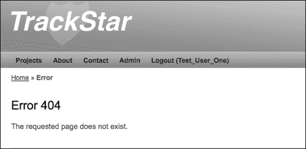
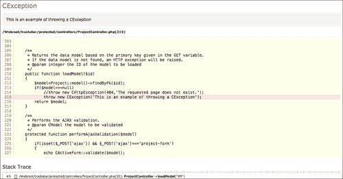
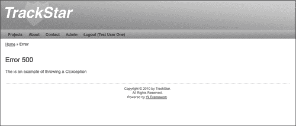

# 第 12 章生产准备

尽管我们的应用程序缺少大量的功能，但我们（尽管是想象中的）最后期限正在临近，我们（也是想象中的）客户机对将应用程序引入生产环境感到焦虑。即使在我们的应用程序真正在生产中看到曙光之前可能还需要一段时间，但现在是让应用程序“生产就绪”的时候了。在这篇，我们关于发展的最后一章中，我们将这样做。

# 特征规划

为了实现为生产环境准备应用程序的目标，我们将重点关注以下粒度任务：

*   实施 Yii 的应用程序日志框架，以确保我们记录有关关键生产错误和事件的信息
*   实现 Yii 的应用程序错误处理框架，以确保我们正确处理生产中的错误，并了解这在生产环境中与在开发环境中如何不同
*   实施应用程序数据缓存以帮助提高性能

# 测井

在应用程序开发的这个后期阶段之前，应该讨论日志记录这一主题。当涉及到软件应用程序中的故障排除时，信息、警告和严重错误消息是非常宝贵的，尤其是对于实际用户使用的生产环境中的故障排除。

作为开发人员，我们都熟悉这个故事。您已经满足了正在构建的应用程序的所有功能需求。所有的单元和功能测试都通过了。该应用程序已经过 QA 批准，每个人都对它准备好投入生产感到非常高兴。但一旦它进入并处于实际的生产负载下，并且有真正的用户与它交互，它的行为就会出人意料。一个好的日志记录策略可以在快速解决问题和倒退数周甚至数月的艰苦工作之间发挥作用。

Yii 提供了灵活和可扩展的日志记录功能。记录的数据可根据日志级别和消息类别进行分类。使用级别和类别筛选器，日志消息可以进一步路由到不同的目的地，例如写入光盘上的文件、存储在数据库中、作为电子邮件发送给管理员或显示在浏览器窗口中。

## 消息记录

我们的应用程序实际上一直在记录每个请求的许多信息性消息。创建初始应用程序时，它被配置为处于*调试*模式，而在此模式下，Yii 框架本身会记录信息消息。我们实际上看不到这些消息，因为默认情况下，它们被记录到内存中。因此，它们仅在请求的生命周期内存在。

应用程序是否处于此调试模式由根`index.php`文件中的以下行控制：

```php
defined('YII_DEBUG') or define('YII_DEBUG',true);
```

为了查看记录的内容，让我们在`SiteController`类中快速创建一个小动作方法来显示消息：

```php
public function actionShowLog()
{
  echo "Logged Messages:<br><br>";
CVarDumper::dump(Yii::getLogger()->getLogs());
}
```

这里我们使用的是 Yii 的`CVarDumper`助手类，它是`var_dump`或`print_r`的改进版本，因为它能够正确处理递归引用对象。

如果我们通过发出请求`http://localhost/trackstar/site/showLog`来调用此操作，我们会看到类似于以下屏幕截图的内容：


如果我们注释掉`index.php`中定义的全局应用程序调试变量并刷新页面，我们会注意到一个空数组；也就是说，没有记录任何内容。这是因为此系统级调试信息级日志记录是通过调用`Yii::trace`完成的，只有当应用程序处于此特殊调试模式时，才会记录这些消息。

我们可以使用以下两种静态应用程序方法之一在 Yii 应用程序中记录消息：

*   `Yii::log($message, $level, $category);`
*   `Yii::trace($message, $category);`

如上所述，这两种方法的主要区别在于`Yii::trace`仅在应用程序处于调试模式时记录消息。

### 类别和级别

当使用`Yii::log()`记录消息时，我们需要指定其类别和级别。**类别**是一个字符串，用于为正在记录的消息提供额外的上下文。这个字符串可以是您喜欢的任何内容，但许多人使用的约定是一个格式为`xxx.yyy.zzz`的字符串，它类似于路径别名。例如，如果在我们的应用程序的`SiteController`类中记录了一条消息，我们可以选择使用类别`application.controllers.SiteController`。

除了指定类别外，当使用`Yii::log`时，我们还可以指定消息的级别。级别可以被视为消息的严重性。您可以定义自己的级别，但它们通常采用以下值之一：

*   **跟踪**：该级别通常用于跟踪开发过程中应用程序的执行流程。
*   **信息**：用于记录一般信息。如果未指定，则这是默认级别。
*   **配置文件**：这将与性能配置文件功能一起使用，本章稍后将对此进行描述。
*   **警告**：用于警告信息。
*   **错误**：用于致命错误消息。

### 添加登录消息日志

例如，让我们向用户登录方法添加一些日志记录。我们将在方法的开头提供一些基本的调试信息，以指示正在执行该方法。然后，我们将在成功登录时记录一条信息消息，如果登录失败，还会记录一条警告消息。按照以下突出显示的代码修改我们的`SiteController::actionLogin()`方法（整个方法在可下载的代码中，或者您可以从[下载独立的方法）https://gist.github.com/3791860](https://gist.github.com/3791860) 。

```php
public function actionLogin()
{
 Yii::trace("The actionLogin() method is being requested", "application.controllers.SiteController");
    …

    // collect user input data
    if(isset($_POST['LoginForm']))
    {
      …  
if($model->validate() && $model->login()) 
      {
 Yii::log("Successful login of user: " . Yii::app()->user->id, "info", "application.controllers.SiteController");
        $this->redirect(Yii::app()->user->returnUrl);
 }
 else
 {
 Yii::log("Failed login attempt", "warning", "application.controllers.SiteController");
 }

    }
    …
}
```

如果我们现在成功登录（或执行失败的尝试）并访问我们的页面查看日志，我们将看不到它们（如果您注释掉了调试模式声明，请确保在本练习中将应用程序重新置于调试模式）。同样，原因是，默认情况下，Yii 中的日志实现只是将消息存储在内存中。当请求完成时，它们将消失。这不是很有用。我们需要将它们路由到更持久的存储区域，以便在生成它们的请求之外查看它们。

## 消息路由

如前所述，默认情况下，使用`Yii::log`或`Yii::trace`记录的消息保存在内存中。通常，如果这些消息显示在浏览器窗口中、保存到某些持久性存储（如文件）、数据库中或作为电子邮件发送，则这些消息更有用。Yii 的*消息路由*允许将日志消息路由到不同的目的地。

在 Yii 中，消息路由由`CLogRouter`应用程序组件管理。它允许您定义日志消息应路由到的目标列表。

为了利用这个消息路由，我们需要在我们的`protected/config/main.php`配置文件中配置`CLogRouter`应用程序组件。我们通过将其 routes 属性设置为所需的日志消息目的地来实现这一点。

如果我们打开主配置文件，我们会看到已经提供了一些配置（再次感谢使用`yiic webapp`命令来最初创建我们的应用程序）。我们的配置中已经定义了以下内容：

```php
'log'=>array
  'class'=>'CLogRouter',
  'routes'=>array(
    array(
      'class'=>'CFileLogRoute',
      'levels'=>'error, warning',
    ),
    // uncomment the following to show log messages on web pages
    /*
    array(
      'class'=>'CWebLogRoute',
    ),
    */
  ),
),
```

`log`应用组件配置为使用框架类`CLogRouter`。当然，如果基本框架实现没有完全满足日志记录要求，您也可以创建并使用该类的自定义子类；但在我们的情况下，这将很好地工作。

在前面的配置中，类定义之后是`routes`属性的定义。在这种情况下，只指定了一条路由。这一个使用的是 Yii 框架消息路由类`CFileLogRoute`。`CFileLogRoute`消息路由类使用文件系统保存消息。默认情况下，消息记录在应用程序运行时目录`/protected/runtime/application.log`下的文件中。事实上，如果您一直跟随并拥有自己的应用程序，您可以查看此文件，并将看到框架记录的多条消息。`levels`规范规定，只有日志级别为`error`或`warning`的消息才会路由到此文件。前面代码中注释掉的配置部分指定了另一条路由`CWebLogRoute`。如果使用，这将路由要在当前请求的网页上显示的消息。以下是 Yii 1.1 版中当前可用的消息路由列表：

*   `CDbLogRoute`：将消息保存在数据库表中
*   `CEmailLogRoute`：将消息发送到指定的电子邮件地址
*   `CFileLogRoute`：将消息保存在应用程序的`runtime`目录或您选择的任何其他目录下的文件中
*   `CWebLogRoute`：在当前网页的末尾显示消息
*   `CProfileLogRoute`：在当前网页末尾显示评测消息

我们添加到`SiteController::actionLogin()`方法中的日志记录使用`Yii::trace`处理一条消息，然后使用`Yii::log`处理另外两条消息。使用`Yii::trace`时，日志级别自动设置为`trace`。当使用`Yii::log`时，如果登录成功，我们指定了`info`日志级别，但是如果登录尝试失败，则指定了`warning`级别。让我们改变日志路由配置，将`trace`和`info`级别的消息写入一个新的单独文件`infoMessages.log`，该文件与`application.log`文件位于同一目录中。另外，让我们将其配置为将警告消息写入浏览器。为此，我们将对配置进行以下更改（突出显示）：

```php
'log'=>array(
  'class'=>'CLogRouter',
  'routes'=>array(
    array(
      'class'=>'CFileLogRoute',
 'levels'=>'error',
 ),
 array(
 'class'=>'CFileLogRoute',
 'levels'=>'info, trace',
 'logFile'=>'infoMessages.log',
 ),
 array(
 'class'=>'CWebLogRoute',
 'levels'=>'warning',
 ),

```

现在，在保存这些更改后，让我们尝试不同的场景。首先，尝试成功登录。这样做会将我们的两条登录消息写入新的`/protected/runtime/infoMessages.log`文件，一条用于跟踪，另一条记录成功登录。成功登录后，查看该文件会显示以下内容（完整列表被截断以保存一些树）：

```php
.....
2012/06/15 00:31:52 [trace] [application.controllers.SiteController] The actionLogin() method is being requested
2012/06/15 00:31:52 [trace] [system.web.CModule] Loading "user" application component
2012/06/15 00:31:52 [trace] [system.web.CModule] Loading "session" application component
2012/06/15 00:31:52 [trace] [system.web.CModule] Loading "db"                                                                                                                                                                                                                                                                                                                                                                                                                             application component
2012/06/15 00:31:52 [trace] [system.db.CDbConnection] Opening DB connection
.....
2012/06/15 00:31:52 [info] [application.controllers.SiteController] Successful login of user: 1
.....
```

正如你所看到的，这里不仅仅是我们的两条信息！但我们两个确实出现了；在上一个列表中，它们以粗体显示。现在我们将所有跟踪消息路由到此新文件，所有框架跟踪消息也将显示在这里。这实际上是非常有用的信息，它可以帮助您了解请求在框架中的生命周期。有很多事情在幕后进行。在将此应用程序移至生产环境时，我们显然会关闭这种详细的日志记录级别。在非调试模式下，我们只能看到单个`info`级别的消息。但是，当试图追踪 bug 并了解应用程序正在做什么时，这种详细程度的信息可能非常有用。当需要的时候/如果需要的话，知道它在这里是非常令人欣慰的。

现在，让我们尝试失败的登录尝试场景。如果我们现在退出并再次尝试登录，但这次指定了不正确的凭据以强制失败的登录，我们将在返回的网页底部看到我们的**警告**级别的显示，就像我们配置的那样。以下屏幕截图显示了正在显示的此警告：


使用`CFileLogRouter`消息路由器时，日志文件存储在`logPath`属性下，文件名由`logFile`方法指定。此日志路由器的另一个重要功能是自动日志文件旋转。如果日志文件的大小大于在`maxFileSize`属性中设置的值（以千字节为单位），则执行旋转，该旋转通过在文件名后面加上`.1`来重命名当前日志文件。所有现有日志文件向后移动一个位置，即`.2`到`.3`、`.1`到`.2`。属性`maxLogFiles`可用于指定要保留的文件数量。

### 注

如果在应用程序中使用`die;`或`exit;`终止执行，日志消息可能无法正确写入其预期目的地。如果需要显式终止 Yii 应用程序的执行，请使用`Yii::app()->end().`这为应用程序提供了成功写出日志消息的机会。此外，`CLogger`组件具有`$autoDump`属性，如果设置为`true`，将允许将日志消息实时写入其目的地（即，调用`->log()`。由于其潜在的性能影响，这只应用于调试目的，但可能是一个非常有价值的调试选项。

# 处理错误

正确处理软件应用程序中经常出现的错误至关重要。这也是一个可以论证的主题，应该在编写应用程序之前讨论，而不是在这个后期阶段。幸运的是，由于我们一直依靠 Yii 框架中的工具来自动生成大部分核心应用程序框架，因此我们的应用程序已经利用了 Yii 的一些错误处理功能。

Yii 提供了一个基于 PHP5 异常的完整错误处理框架，这是一种通过集中点处理程序中异常情况的内置机制。当主要的 Yii 应用程序组件被创建来处理传入的用户请求时，它注册其`CApplication::handleError()`方法来处理 PHP 警告和通知，并注册其`CApplication::handleException()`方法来处理未捕获的 PHP 异常。因此，如果在应用程序执行期间发生 PHP 警告/通知或未捕获的异常，其中一个错误处理程序将接管控制并启动必要的错误处理过程。

### 注

错误处理程序的注册通过调用 PHP 函数`set_exception_handler`和`set_error_handler`在应用程序的构造函数中完成。如果您不希望 Yii 处理这些类型的错误和异常，您可以通过在主`index.php`输入脚本中将全局常量`YII_ENABLE_ERROR_HANDLER`和`YII_ENABLE_EXCEPTION_HANDLER`定义为 false 来覆盖此默认行为。

默认情况下，应用程序将使用框架类`CErrorHandler`作为负责处理 PHP 错误和未捕获异常的应用程序组件。此内置应用程序组件的部分任务是根据应用程序是否在*调试*模式或*生产*模式下运行，使用适当的视图文件显示这些错误。这允许您为这些不同的环境自定义错误消息。在开发环境中显示更详细的错误信息以帮助解决问题是有意义的。但是，允许生产应用程序的用户查看相同的信息可能会损害安全性。此外，如果您已经用多种语言实现了站点，`CErrorHandler`也会选择首选语言来显示错误。

在 Yii 中引发异常的方式与通常引发 PHP 异常的方式相同。需要时，可以使用以下通用语法引发异常：

```php
throw new ExceptionClass('ExceptionMessage');
```

Yii 提供的两个异常类是：

*   `CException`
*   `CHttpException`

`CException`是一个泛型异常类。`CHttpException`表示 HTTP 错误，并且还携带一个`statusCode`属性来表示 HTTP 状态代码。错误在浏览器中的显示方式不同，具体取决于引发的异常类。

## 显示错误

如前所述，`CErrorHandler`应用程序组件在处理错误时，会决定在显示错误时使用哪个视图文件。如果要向最终用户显示错误，如使用`CHttpException`时，默认行为是使用名为`errorXXX`的视图，其中`XXX`表示 HTTP 状态代码（例如，400、404 或 500）。如果错误是内部错误，并且只应向开发人员显示，则将使用名为`Exception`的视图。当应用程序处于调试模式时，将显示完整的调用堆栈以及源文件中的错误行。

但是，当应用程序在生产模式下运行时，所有错误都将使用`errorXXX`视图文件显示。这是因为错误的调用堆栈可能包含不应仅向任何最终用户显示的敏感信息。

当应用程序处于生产模式时，开发人员应该依赖错误日志来提供有关错误的更多信息。发生错误时，将始终记录级别错误消息。如果错误是由 PHP 警告或通知引起的，则将使用类别`php`记录该消息。如果错误是由未捕获的`exception`引起的，则类别将为`exception.ExceptionClassName`，其中异常类名称为`CHttpException`或`CException`中的一个或子类。因此，可以利用上一节讨论的日志功能来监视生产应用程序中发生的错误。当然，如果发生致命的 PHP 错误，您仍然需要检查由 PHP 配置设置定义的错误日志，而不是 Yii 的错误日志。

默认情况下，`CErrorHandler`按以下顺序搜索对应视图文件的位置：

*   `WebRoot/themes/ThemeName/views/system`：当前活动主题下的系统视图目录
*   `WebRoot/protected/views/system`：应用程序的默认系统视图目录
*   `YiiRoot/framework/views`：Yii 框架提供的标准系统视图目录

通过在应用程序或主题的系统视图目录下创建自定义错误视图文件，可以自定义错误显示。

Yii 还允许您定义特定的控制器操作方法来处理错误的显示。这实际上就是我们的应用程序的配置方式。通过几个例子，我们将看到这一点。

作为使用 Gii Crud 生成器工具创建 Crud 脚手架的副产品，为我们生成的一些代码已经利用了 Yii 的错误处理。其中一个例子是`ProjectController::loadModel()`方法。该方法定义如下：

```php
public function loadModel($id)
  {
    $model=Project::model()->findByPk($id);
    if($model===null)
      throw new CHttpException(404,'The requested page does not exist.');
    return $model;
  }
```

我们看到它正试图根据输入的`id`querystring 参数加载适当的项目模型 AR 实例。如果找不到请求的项目，它会抛出一个`CHttpException`，让用户知道他们请求的页面（在本例中为项目详细信息页面）不存在。我们可以在浏览器中通过明确请求一个我们知道不存在的项目来测试这一点。由于我们知道我们的申请没有与`99`的`id`相关的项目，因此`http://localhost/trackstar/project/view/id/99`请求将导致返回以下页面：



这很好，因为该页面看起来像我们应用程序中的任何其他页面，具有相同的主题、页眉、页脚等等。

这实际上不是呈现此类错误页面的默认行为。我们的初始应用程序配置为使用特定的控制器操作来处理此类错误。我们提到这是关于如何处理应用程序中的错误的另一个选项。如果我们浏览一下主配置文件`/protected/config/main.php`，就会看到以下应用程序组件声明：

```php
'errorHandler'=>array(
  // use 'site/error' action to display errors
    'errorAction'=>'site/error',
),
```

这将我们的错误处理程序应用程序组件配置为使用`SiteController::actionError()`方法来处理所有要显示给用户的异常。如果我们看一下这个动作方法，我们会注意到它正在呈现`protected/views/site/error.php`视图文件。这只是一个普通的控制器视图文件，因此它还将呈现任何相关的应用程序布局文件，并应用适当的主题。这样，当某些错误发生时，我们能够为用户提供非常友好的体验。

要查看默认行为是什么，如果没有添加此配置，让我们暂时注释掉前面的配置代码行（在`protected/config/main.php`中），并再次请求不存在的项目。现在我们看到以下页面：


由于我们没有按照前面概述的约定明确定义任何自定义错误页，因此这是 Yii 框架本身中的`framework/views/error404.php`文件。

继续并将这些更改恢复到配置文件中，以使错误处理再次使用`SiteController::actionError()`方法。

现在让我们看看这与抛出一个`CException`类，而不是 HTTP 异常类相比如何。让我们注释掉引发 HTTP 异常的当前代码行，并添加一个新行来引发另一个异常类。对`protected/controllers/ProjectController.php`文件进行突出显示的更改：

```php
public function loadModel($id)
  {
    $model=Project::model()->findByPk($id);
    if($model===null)
 //throw new CHttpException(404,'The requested page does not exist.');
 throw new CException('This is an example of throwing a CException');
    return $model;
  }
```

现在，如果我们请求一个不存在的项目，我们会看到一个非常不同的结果。这一次，我们看到一个系统生成的错误页面，其中包含完整的堆栈跟踪错误信息转储以及发生错误的特定源文件：



它显示了一个`CException`类与**描述一起被抛出的事实。这是一个抛出 CEException**、源文件、发生错误的文件中的特定行以及完整堆栈跟踪的示例。

因此，抛出这个不同的异常类，以及应用程序处于调试模式的事实，会产生不同的结果。这是我们希望显示的帮助解决问题的信息类型，但前提是我们的应用程序在私有开发环境中运行。让我们暂时注释掉根`index.php`文件中的调试设置，以查看在“生产”模式下如何显示：

```php
// remove the following line when in production mode
//defined('YII_DEBUG') or define('YII_DEBUG',true);
```

如果我们对不存在的项目刷新请求，我们将看到异常显示为最终用户友好的 HTTP 500 错误，如以下屏幕截图所示：



因此，我们看到，在“生产”模式下，没有显示任何敏感代码或堆栈跟踪信息。

# 缓存

**缓存**数据是帮助提高生产 web 应用程序性能的一种很好的方法。如果有特定的内容预计不会在每次请求时更改，则使用缓存来存储和服务该内容可以减少检索和处理该数据所需的时间。

Yii 在缓存方面提供了一些很好的特性。要利用 Yii 的缓存功能，首先要配置缓存应用程序组件。这样的组件是扩展`CCache`的几个子类之一，该子类是具有不同缓存存储实现的缓存类的基类。

Yii 提供了许多特定的缓存组件类实现，它们使用不同的方法存储数据。以下是 Yii 自版本 1.1.12 起提供的当前缓存实现列表：

*   `CMemCache`：使用 PHP memcache 扩展。
*   `CApcCache`：使用 PHP APC 扩展。
*   `CXCache`：使用 PHP XCache 扩展。
*   `CEAcceleratorCache`：使用 PHP EAccelerator 扩展。
*   `CDbCache`：使用数据库表存储缓存数据。默认情况下，它将在运行时目录下创建并使用 SQLite3 数据库。通过设置其`connectionID`属性，可以显式指定要使用的数据库。
*   `CZendDataCache`：使用 Zend 数据缓存作为底层缓存介质。
*   `CFileCache`：使用文件存储缓存数据。这特别适合缓存大量数据（如页面）。
*   `CDummyCache`：提供一致缓存接口，但实际上不执行任何缓存。这种实现的原因是，如果您的开发环境没有缓存支持，您仍然可以执行和测试代码，这些代码一旦可用就需要使用缓存。这允许您继续编写一致接口的代码，当实际实现真正的缓存组件时，您不需要更改为从缓存中写入或检索数据而编写的代码。
*   `CWinCache`：`CWinCache`实现了一个基于 WinCache 的缓存应用组件。欲了解更多信息，请访问[http://www.iis.net/expand/wincacheforphp](http://www.iis.net/expand/wincacheforphp) 。

所有这些组件都从相同的基类`CCache`扩展，并公开一致的 API。这意味着您可以更改应用程序组件的实现，以便使用不同的缓存策略，而无需更改使用缓存的任何代码。

## 缓存配置

如前所述，在 Yii 中使用缓存通常涉及选择这些实现之一，然后配置应用程序组件以在`/protected/config/main.php`文件中使用。当然，配置的细节将取决于特定的缓存实现。例如，如果要使用 memcached 实现，即`CMemCache`，这是一个分布式内存对象缓存系统，允许您指定多台主机服务器作为缓存服务器，则将其配置为使用两台服务器可能如下所示：

```php
array(
    ......
    'components'=>array(
        ......
        'cache'=>array(
            'class'=>'system.caching.CMemCache',
            'servers'=>array(
                array('host'=>'server1', 'port'=>12345, 'weight'=>60),
                array('host'=>'server2', 'port'=>12345, 'weight'=>40),
            ),
        ),
    ),
);
```

为了让读者在跟踪 TrackStar 开发的同时保持相对简单，我们将在阅读一些示例时使用文件系统实现`CFileCache`。这在任何允许从文件系统读写文件的开发环境中都应该是现成的。

### 注

如果出于某种原因，这不是您的选项，但您仍然希望遵循代码示例，只需使用`CDummyCache`选项即可。如前所述，它实际上不会在缓存中存储任何数据，但您仍然可以根据其 API 编写代码，并在以后更改实现。

`CFileCache`提供基于文件的缓存机制。使用此实现时，缓存的每个数据值都存储在单独的文件中。默认情况下，这些文件存储在`protected/runtime/cache/`目录下，但在配置组件时，可以通过设置`cachePath`属性轻松更改。出于我们的目的，这个默认值是可以接受的，因此我们只需要在`/protected/config/main.php`配置文件中的`components`数组中添加以下内容：

```php
// application components
  'components'=>array(
    …
 'cache'=>array(
 'class'=>'system.caching.CFileCache',
 ),
     …  
),
```

有了它，我们可以通过`Yii::app()->cache`在运行中的应用程序的任何地方访问这个新的应用程序组件。

## 使用基于文件的缓存

让我们试试这个新组件。还记得我们在上一章中作为管理功能的一部分添加的系统消息吗？与其每次请求都从数据库中检索数据，不如将最初从数据库返回的值在缓存中存储一段有限的时间，以便不是每个请求都必须从数据库中检索数据。

让我们在`SysMessage`（`/protected/modules/admin/models/SysMessage.php`AR 模型类中添加一个新的公共方法来处理最新系统消息的检索。让我们同时使用这个新方法`public`和`static`，这样应用程序的其他部分就可以轻松地使用这个方法来访问最新的系统消息，而不必显式地创建`SysMessage`的实例。

将我们的方法添加到`SysMessage`类中，如下所示：

```php
/**
   * Retrieves the most recent system message.
   * @return SysMessage the AR instance representing the latest system message.
   */

public static function getLatest()
{

  //see if it is in the cache, if so, just return it
  if( ($cache=Yii::app()->cache)!==null)
  {
    $key='TrackStar.ProjectListing.SystemMessage';
    if(($sysMessage=$cache->get($key))!==false)
      return $sysMessage;
  }
  //The system message was either not found in the cache, or   
//there is no cache component defined for the application
//retrieve the system message from the database 
  $sysMessage = SysMessage::model()->find(array(
    'order'=>'t.update_time DESC',
  ));
  if($sysMessage != null)
  {
    //a valid message was found. Store it in cache for future retrievals
    if(isset($key))
      $cache->set($key,$sysMessage,300);    
      return $sysMessage;
  }
  else
      return null;
}
```

我们将在一分钟内介绍细节。首先，让我们将应用程序更改为使用此新方法来验证缓存是否正常工作。我们仍然需要更改`ProjectController::actionIndex()`方法来使用这个新创建的方法。这很容易。只需将从数据库生成系统消息的代码替换为对这个新方法的调用。即在`ProjectController::actionIndex()`中，只需更改以下代码：

```php
$sysMessage = SysMessage::model()->find(array('order'=>'t.update_time DESC',));
```

对下列事项：

```php
$sysMessage = SysMessage::getLatest();
```

现在，显示在项目列表页面上的系统消息应该利用了文件缓存。我们可以检查缓存目录以进行验证。

如果我们为用于文件缓存的默认位置`protected/runtime/cache/`列出一个目录列表，我们确实看到创建了几个文件。它们的名字都很奇怪（你的名字可能有点不同）`18baacd814900e9b36b3b2e546513ce8.bin`和`2d0efd21cf59ad6eb310a0d70b25a854.bin`。

一个保存我们的系统消息数据，另一个来自前面章节中的`CUrlManager`配置。默认情况下，`CUrlManager`将使用缓存组件缓存解析后的 URL 规则。您可以将`CUrlManager`的`cacheId`参数设置为`false`来禁用该组件的缓存。

如果我们将`18baacd814900e9b36b3b2e546513ce8.bin`文件打开为文本，我们可以看到以下内容：

```php
a:2:{i:0;O:10:"SysMessage":12:{s:18:" :" CActiveRecord _ _md";N;s:19:" :" CActiveRecord _ _new";b:0;s:26:" :" CActiveRecord _ _attributes";a:6:{s:2:"id";s:1:"2";s:7:"message";s:56:"This is a second message from your system administrator!";s:11:"create_time";s:19:"2012-07-31 21:25:33";s:14:"create_user_id";s:1:"1";s:11:"update_time";s:19:"2012-07-31 21:25:33";s:14:"update_user_id";s:1:"1";}s:23:" :"18CActiveRecord _18_related";a:0:{}s:17:" :" CActiveRecord _ _c";N;s:18:" 18:" CActiveRecord _ _:"  _pk";s:1:"2";s:21:" :" CActiveRecord _ _alias";s:1:"t";s:15:" :" CModel _ _errors";a:0:{}s:19:" :" CModel _ _validators";N;s:17:" :" CModel _ _scenario";s:6:"update";s:14:" :" CComponent _ _e";N;s:14:" :" CComponent _ _m";N;}i:1;N;}
```

这是我们最近更新的`SysMessage`AR 类实例的序列化缓存值，这正是我们所期望的。因此，我们看到缓存实际上正在工作。

现在让我们更详细地回顾一下新的`SysMessage::getLatest()`方法的代码。代码要做的第一件事是检查请求的数据是否已经在缓存中，如果已经在缓存中，则返回该值：

```php
//see if it is in the cache, if so, just return it
if( ($cache=Yii::app()->cache)!==null)
{
  $key='TrackStar.ProjectListing.SystemMessage';
  if(($sysMessage=$cache->get($key))!==false)
    return $sysMessage;
}
```

如前所述，我们通过`Yii::app()->cache`将缓存应用程序组件配置为在应用程序中的任何位置都可用。因此，它首先检查是否定义了这样一个组件。如果是，它会尝试通过`$cache->get($key)`方法在缓存中查找数据。这或多或少符合您的期望。它尝试根据指定的键从缓存中检索值。键是一个唯一的字符串标识符，用于映射到缓存中存储的每个数据段。在我们的系统消息示例中，一次只需要显示一条消息，因此可以用一个相当简单的键标识要显示的单个系统消息。该键可以是任何字符串值，只要它对于我们要缓存的每个数据段都是唯一的。在本例中，我们选择描述性字符串`TrackStar.ProjectListing.SystemMessage`作为存储和检索缓存系统消息时使用的键。

当第一次执行此代码时，缓存中还没有与此键值关联的任何数据。因此，为该键调用`$cache->get()`将返回`false`。因此，我们的方法将继续执行下一段代码，它只是尝试使用 AR 类从数据库检索适当的系统消息：

```php
$sysMessage = SysMessage::model()->find(array(
  'order'=>'t.update_time DESC',
));
```

然后，我们继续执行以下代码，首先检查是否从数据库中获得了任何信息。如果我们这样做了，它会在返回值之前将其存储在缓存中；否则返回`null`：

```php
if($sysMessage != null)
{
  if(isset($key))
    $cache->set($key,$sysMessage->message,300);    
    return $sysMessage->message;
}
else
    return null;
```

如果返回了有效的系统消息，我们将使用`$cache->set()`方法将数据存储到缓存中。此方法具有以下一般形式：

```php
set($key,$value,$duration=0,$dependency=null)
```

将一段数据放入缓存时，必须指定一个唯一的键以及要存储的数据。如前所述，键是一个唯一的字符串值，该值是需要缓存的任何数据。这可以是任何格式，只要可以序列化。持续时间参数指定可选的**生存时间**（**TTL**要求。这可用于确保在一段时间后刷新缓存的值。默认值为`0`，这意味着它永远不会过期。（实际上，在内部，Yii 将一年内到期的期限转换为`<=0`的值。因此，不完全是*从未*，但肯定是很长的一段时间。）

我们以以下方式调用`set()`方法：

```php
$cache->set($key,$sysMessage->message,300);  
```

我们将关键点设置为我们之前定义的，`TrackStar.ProjectListing.SystemMessage`；存储的数据是我们返回的`SystemMessage`AR 类的消息属性，即我们的`tbl_sys_message`表的消息列；然后我们将持续时间设置为`300`秒。这样，缓存中的数据将每 5 分钟过期一次，此时将再次查询数据库以获取最新的系统消息。我们在设置数据时没有指定依赖项。接下来我们将讨论这个可选参数。

## 缓存依赖项

dependency 参数允许使用另一种更复杂的方法来决定是否刷新缓存中存储的数据。与声明缓存数据过期的简单时间段不同，您的缓存策略可能会要求数据根据以下情况变得无效：发出请求的特定用户、常规模式、应用程序状态，或者文件系统上的文件是否最近更新过。此参数允许您指定此类缓存验证规则。

依赖项是`CCacheDependency`或其子类的实例。Yii 提供以下特定缓存依赖项：

*   `CFileCacheDependency`：如果指定文件的上次修改时间自上次缓存查找后发生了变化，则缓存中的数据将无效。
*   `CDirectoryCacheDependency`：类似于前一个文件缓存依赖项，但它检查给定指定目录中的所有文件和子目录。
*   `CDbCacheDependency`：如果指定 SQL 语句的查询结果在上次缓存查找后发生变化，则缓存中的数据将无效。
*   `CGlobalStateCacheDependency`：如果指定全局状态的值发生变化，缓存中的数据将无效。全局状态是一个变量，它在应用程序中的多个请求和多个会话之间保持不变。通过`CApplication::setGlobalState()`定义。
*   `CChainedCacheDependency`：这允许您将多个依赖项链接在一起。如果链上的任何依赖项发生更改，缓存中的数据将变得无效。
*   `CExpressionDependency`：如果指定 PHP 表达式的结果发生变化，缓存中的数据将无效。

为了提供一个具体的例子，让我们使用一个依赖项，每当对`tbl_sys_message`数据库表进行更改时，使缓存中的数据过期。我们不会在五分钟后任意终止缓存的系统消息，而是在需要的时候终止它，也就是说，当表中某个系统消息的`update_time`列发生更改时。我们将使用`CDbCacheDependency`实现来实现这一点，因为它旨在根据 SQL 查询结果的变化使缓存数据无效。

我们改变对`set()`方法的调用，将持续时间设置为`0`，这样它就不会基于时间而过期，而是通过指定的 SQL 语句传入一个新的依赖实例，如下所示：

```php
$cache->set($key, $sysMessage, 0, new CDbCacheDependency('SELECT MAX(update_time) FROM tbl_sys_message'));
```

### 注

将持续时间 TTL time 更改为`0`根本不是使用依赖项的先决条件。我们可以在`300`秒内轻松地离开持续时间。这只会规定另一条规则，使缓存中的数据无效。数据在缓存中的有效时间最长为 5 分钟，但如果有更新的消息，即表中较新的`update_time`值，也会在该时间限制之前重新生成。

这样，缓存只会在查询语句的结果发生更改时过期。这个例子有点做作，因为我们最初缓存数据是为了完全避免数据库调用。现在，我们已经将其配置为在每次尝试从缓存检索数据时执行数据库查询。然而，如果缓存的数据是一个复杂得多的数据集，需要花费更多的检索和处理开销，那么一个简单的缓存有效性 SQL 语句就很有意义。具体的缓存实现、存储的数据、过期时间以及这些依赖关系形式的任何其他数据验证都将取决于所构建应用程序的特定需求。很高兴知道 Yii 有许多选项可供选择，以帮助满足我们的各种需求。

## 查询缓存

在数据库驱动的应用程序中经常需要缓存数据库结果的查询缓存方法，因此 Yii 为此提供了一种更简单的实现，称为**查询缓存**。顾名思义，查询缓存将数据库查询的结果存储在缓存中，并节省后续请求的查询执行时间，因为这些请求直接来自缓存。为了启用查询，您需要确保`CDbConnection`属性的`queryCacheID`属性引用有效缓存组件的`ID`属性。默认情况下它指的是`'cache'`，这是我们在前面的缓存示例中已经配置的。

要使用查询缓存，我们只需调用`CDbConnection`的`cache()`方法。此方法需要一个持续时间，以指定查询保留在缓存中的秒数。如果持续时间设置为`0`，则缓存被禁用。您还可以指定一个`CCacheDependency`实例作为第二个参数，并指定应该缓存多少后续查询作为第三个参数。第三个参数默认为`1`，这意味着只缓存下一个 SQL 查询。

因此，让我们更改以前的缓存实现，以使用这个很酷的查询缓存特性。通过使用查询缓存，`SysMessage::getLatest()`方法的实现大大简化。我们只需做以下几点：

```php
    //use the query caching approach
    $dependency = new CDbCacheDependency('SELECT MAX(update_time) FROM tbl_sys_message');
    $sysMessage = SysMessage::model()->cache(1800, $dependency)->find(array(
      'order'=>'t.update_time DESC',
    ));
    return $sysMessage;
```

在这里，我们使用与以前相同的基本方法，但不必处理缓存值的显式检查和设置。我们调用了`cache()`方法，以指示我们希望将结果缓存 30 分钟，或者，通过指定依赖项，如果最近的消息可用，则在该时间之前刷新该值。

## 片段缓存

前面的示例演示了数据缓存的使用。这就是我们获取单个数据并将其存储在缓存中的地方。Yii 中还有其他方法可用于存储视图脚本的一部分甚至整个页面本身生成的页面片段。

片段缓存是指缓存页面的片段。我们可以利用视图脚本内部的片段缓存。为此，我们使用了`CController::beginCache()`和`CController::endCache()`方法。这两种方法用于标记应存储在缓存中的呈现页面内容的开始和结束。就像使用数据缓存方法时一样，我们需要一个唯一的键来标识正在缓存的内容。通常，在视图脚本中使用片段缓存的语法如下：

```php
...some HTML content...
<?php
if($this->beginCache($id))
{
// ...content you want to cache here
$this->endCache();
}
?>
...other HTML content...
```

当有可用的缓存版本时，`beginCache()`方法返回`false`，缓存内容将自动插入该位置；否则，将执行 if 语句中的内容，并在调用`endCache()`时将其缓存。

### 声明片段缓存选项

调用`beginCache()`时，我们可以提供一个数组作为包含缓存选项的第二个参数来定制片段缓存。事实上，`beginCache()`和`endCache()`方法是`COutputCache`过滤器/小部件的方便包装。因此，缓存选项可以是`COutputCache`类的任何属性的初始值。

可以说，缓存数据时指定的最常见选项之一是持续时间，它指定内容在缓存中保持有效的时间。它类似于我们在缓存系统消息时使用的`duration`参数。您可以在调用`beginCache()`时指定`duration`参数，如下所示：

```php
$this->beginCache($key, array('duration'=>3600))
```

此片段缓存方法的默认设置与数据缓存的默认设置不同。如果我们不设置持续时间，它默认为 60 秒，这意味着缓存内容将在 60 秒后失效。在使用片段缓存时，可以设置许多其他选项。有关更多信息，请参阅`COutputCache`的 API 文档以及 Yii 最终指南的片段缓存部分，可在 Yii 框架网站[上获得 http://www.yiiframework.com/doc/guide/1.1/en/caching.fragment](http://www.yiiframework.com/doc/guide/1.1/en/caching.fragment)

### 使用片段缓存

让我们在 TrackStar 应用程序中实现这一点。我们将再次关注项目列表页面。您可能还记得，在项目列表页面的底部，有一个用户对每个项目相关问题的评论列表。此列表仅指明谁对哪个问题发表了评论。与其在每次请求时重新生成此列表，不如使用片段缓存将此列表缓存两分钟。应用程序可以容忍这些数据有点陈旧，而要等待更新的注释列表，两分钟的时间其实并不长。

为此，我们对列表视图文件`protected/views/project/index.php`进行了更改。我们将在这个片段缓存方法中封装对整个 recent comments portlet 的调用，如下所示：

```php
<?php
$key = "TrackStar.ProjectListing.RecentComments";
if($this->beginCache($key, array('duration'=>120))) {
   $this->beginWidget('zii.widgets.CPortlet', array(
    'title'=>'Recent Comments',
  ));  
  $this->widget('RecentCommentsWidget');
  $this->endWidget();
  $this->endCache(); 
}
?>
```

这样，如果我们第一次访问项目列表页面，我们的评论列表将存储在缓存中。如果我们随后快速（快速，我们的意思是在两分钟之前）向项目中的某个问题添加新的注释，然后切换回项目列表页面，我们将不会立即看到新添加的注释。但是如果我们继续刷新页面，一旦缓存中的内容过期（本例中最多两分钟），数据将被刷新，我们的新注释将显示在列表中。

### 注

您还可以简单地向先前缓存的内容添加一个`echo time();`PHP 语句，以查看它是否按预期工作。如果内容已正确缓存，则在刷新缓存之前，时间显示不会更新。使用文件缓存时，请记住确保您的`/protected/runtime/`目录可由 web 服务器进程写入，因为默认情况下缓存内容存储在此处。

我们可以通过声明缓存依赖项而不是固定的持续时间来避免这种情况。片段缓存还支持缓存依赖项。因此，我们可以将前面看到的`beginCache()`方法调用更改为以下内容：

```php
if($this->beginCache($key, array('dependency'=>array(
      'class'=>'system.caching.dependencies.CDbCacheDependency',
      'sql'=>'SELECT MAX(update_time) FROM tbl_comment')))) {
```

在这里，我们使用`CDbCacheDependency`方法缓存内容，直到对注释表进行更新。

## 页面缓存

除了片段缓存之外，Yii 还提供了缓存整个页面请求结果的选项。页面缓存方法类似于片段缓存方法。但是，由于整个页面的内容通常是通过对视图应用其他布局生成的，因此我们不能在布局文件中简单地调用`beginCache()`和`endCache()`。原因是在对内容视图进行评估后，在对`CController::render()`方法的调用中应用了布局。因此，我们总是会错过从缓存中检索内容的机会。

因此，为了缓存整个页面，我们应该完全跳过生成页面内容的操作的执行。为了实现这一点，我们可以使用`COutputCache`类作为控制器类中的动作过滤器。

例如，让我们使用页面缓存方法来缓存每个项目详细信息页面的页面结果。TrackStar 中的项目详细信息页面通过请求格式为`http://localhost/trackstar/project/view/id/[id]`的 URL 呈现，其中`[id]`是我们请求详细信息的具体项目 ID。我们要做的是设置一个页面缓存过滤器，该过滤器将为每个请求的 ID 分别缓存该页面的全部内容。我们需要在缓存内容时将项目 ID 合并到键值中。也就是说，我们不希望请求项目#1 的详细信息，并让应用程序返回项目#2 的缓存结果。`COutputCache`过滤器允许我们这样做。

打开`protected/controllers/ProjectController.php`并更改现有`filters()`方法：

```php
public function filters()
{
  return array(
    'accessControl', // perform access control for CRUD operations
 array(
 'COutputCache + view',  //cache the entire output from the actionView() method for 2 minutes
 'duration'=>120,
 'varyByParam'=>array('id'),
 ),
  );
}
```

此过滤器配置利用`COutputCache`过滤器缓存应用程序从`ProjectController::actionView()`调用生成的整个输出。您可能还记得，就在`COutputCache`声明之后添加的`+ view`参数是我们包含过滤器应应用的特定操作方法的标准方式。duration 参数指定 120 秒（两分钟）的 TTL，之后将重新生成页面内容。

`varyByParam`配置是我们之前提到的一个非常好的选择。该功能允许自动处理变化，而不是让开发人员负责为缓存的内容制定独特的关键策略。例如，在这种情况下，通过指定与输入请求中的`GET`参数相对应的名称列表。由于我们正在通过`project_id`缓存项目请求的页面内容，因此将此 ID 用作缓存内容的唯一密钥生成的一部分非常有意义。通过指定`'varyByParam'=>array('id')`，`COutputCache`根据输入的 querystring 参数`id`为我们执行此操作。当使用`COutputCache`缓存数据时，有更多选项可用于实现这种类型的自动内容变化策略。自 Yii 1.1.12 起，以下变化特征可用：

*   **varyByRoute**：通过将此选项设置为`true`，特定的请求路由将合并到缓存数据的唯一标识符中。因此，您可以结合使用请求的控制器和操作来区分缓存的内容。
*   **varyBySession**：通过将此选项设置为`true`，一个唯一的会话 ID 用于区分缓存中的内容。每个用户会话可能会看到不同的内容，但所有这些内容仍然可以从缓存中获得服务。
*   **varyByParam**：如前所述，它使用输入的`GET`querystring 参数来区分缓存中的内容。
*   **varyByExpression**：通过将此选项设置为 PHP 表达式，我们可以使用此表达式的结果来区分缓存中的内容。

因此，在我们的`ProjectController`类中配置了上述过滤器后，针对特定项目详细信息页面的每个请求都会在缓存中存储两分钟，然后重新生成并再次存储在缓存中。您可以通过首先查看特定项目，然后以某种方式更新该项目来测试这一点。如果在两分钟的缓存持续时间内完成更新，则不会立即显示更新。

缓存整个页面结果是提高站点性能的好方法，但是缓存每个应用程序中的每个页面肯定没有意义。即使在我们的示例中，缓存项目详细信息页面的整个页面也不允许我们正确使用问题列表的分页实现。我们将此作为如何实现页面缓存的一个快速示例，但并非在所有情况下都是正确的方法。数据、片段和页面缓存这三种方法的组合允许您调整缓存策略以满足应用程序的要求。我们实际上刚刚触及了 Yii 中所有可用缓存选项的表面。希望这能激发您进一步研究可用的完整缓存环境的兴趣。

# 一般性能调整提示

在准备生产应用程序时，还需要考虑一些其他事项。以下各节简要概述了在调整基于 Yii 的 web 应用程序的性能时需要考虑的一些其他方面。

## 使用 APC

启用 PHPAPC 扩展可能是提高应用程序整体性能的最简单方法。扩展缓存和优化 PHP 中间代码，并避免为每个传入请求解析 PHP 脚本所花费的时间。

它还为缓存内容提供了非常快速的存储机制。启用 APC 后，您可以使用`CApcCache`实现来缓存内容、片段和页面。

## 禁用调试模式

我们在本章前面讨论了调试模式，但再次听到它不会有什么坏处。禁用调试模式是提高性能和安全性的另一种简单方法。如果常量`YII_DEBUG`在主`index.php`输入脚本中定义为`true`，则 Yii 应用程序在调试模式下运行。许多组件，包括框架本身中的组件，在调试模式下运行时会产生额外的开销。

此外，正如[第 2 章](02.html "Chapter 2. Getting Started")、*入门*中提到的，当我们首次创建 Yii 应用程序时，您的大部分 Yii 应用程序文件不需要也不应该位于可公开访问的 web 目录中。一个 Yii 应用程序只有一个条目脚本，它通常是需要放在 web 目录中的唯一文件。其他 PHP 脚本，包括所有 Yii 框架文件，都应该受到保护。这就是主应用程序目录的默认名称被称为`protected/`的原因。为避免出现安全问题，建议避免公开访问。

## 使用 yiilite.php

启用 PHP APC 扩展时，可以使用名为`yiilite.php`的不同 Yii 引导文件替换`yii.php`。这有助于进一步提高基于 Yii 的应用程序的性能。文件`yiilite.php`随每个 Yii 版本一起提供。它是合并一些常用的 Yii 类文件的结果。注释和跟踪语句都从合并文件中剥离。因此，使用`yiilite.php`将减少包含的文件数量，并避免执行跟踪语句。

### 注

请注意，在没有 APC 的情况下使用`yiilite.php`实际上可能会降低性能。这是因为`yiilite.php`包含一些不一定在每个请求中都使用的类，并且需要额外的解析时间。还可以观察到，对于某些服务器配置，使用`yiilite.php`的速度较慢；即使 APC 已打开。判断是否使用`yiilite.php`的最佳方法是使用代码包中包含的“Hello World”演示运行基准测试。

## 使用缓存技术

正如我们在本章中所描述和演示的，Yii 提供了许多缓存解决方案，可以显著提高 web 应用程序的性能。如果某些数据的生成需要很长时间，我们可以使用数据缓存方法来减少数据生成频率；如果页面的一部分保持相对静态，我们可以使用片段缓存方法来降低其呈现频率；如果整个页面保持相对静态，我们可以使用页面缓存方法来节省整个页面的呈现成本。

## 启用架构缓存

如果应用程序正在使用**活动记录**（**AR**），您可以在生产环境中打开模式缓存，以节省解析数据库模式的时间。这可以通过将`CDbConnection::schemaCachingDuration`属性配置为大于零的值来实现。

除了这些应用程序级缓存技术外，我们还可以使用服务器端缓存解决方案来提高应用程序的性能。我们在这里描述的启用 APC 缓存属于这一类。还有其他服务器端技术，例如 Zend Optimizer、eAccelerator 和 Squid，仅举几例。

在大多数情况下，这些只是在您准备生产 Yii 应用程序或解决现有应用程序的瓶颈问题时提供了一些良好的实践指南。一般的应用程序性能调优与其说是一门科学，不如说是一门艺术，在 Yii 框架之外，有很多很多因素影响着整体性能。Yii 从一开始就考虑到性能，并且在很大程度上继续优于其他许多基于 PHP 的应用程序开发框架（请参见[http://www.yiiframework.com/performance/](http://www.yiiframework.com/performance/) 了解更多详细信息）。当然，每一个 web 应用程序都需要进行调整以提高性能，但是将 Yii 作为首选的开发框架肯定会使您的应用程序从一开始就具有良好的性能基础。

有关更多详细信息，请参阅《Yii 最终指南》[中的*性能调整*部分 http://www.yiiframework.com/doc/guide/1.1/en/topics.performance](http://www.yiiframework.com/doc/guide/1.1/en/topics.performance) 。

# 总结

在本章中，我们将注意力转向对应用程序进行更改，以帮助提高其在生产环境中的可维护性和性能。我们首先介绍了 Yii 中可用的应用程序日志记录策略，以及如何根据不同的严重性级别和类别记录和路由消息。然后，我们将重点转向错误处理，以及 Yii 如何利用 PHP5 中的底层异常实现来提供灵活而健壮的错误处理框架。然后，我们了解了 Yii 中可用的一些不同的缓存策略。我们学习了在不同粒度级别上缓存应用程序数据和内容。针对特定变量或单个数据段的数据缓存，针对页面内内容区域的片段缓存，以及用于缓存页面请求的整个呈现输出的完整页面缓存。最后，我们提供了一个清单，列出了在改进基于 Yii 的 web 应用程序性能时要遵循的良好实践。

祝贺我们应该拍拍自己的背。我们已经创建了一个从概念到生产准备的完整 web 应用程序。当然，我们也应该拍拍易的背，因为这有助于缓解和加快每一个转折点的进程。我们的 TrackStar 应用程序已经相当不错了；但正如所有这类项目一样，总有改进和改进的余地。已经建立了一个很好的基础，现在你有了 YII 的力量，你可以很快地把它变成一个更有用和功能丰富的应用程序。此外，所涵盖的大量示例也可以很好地转换为您可能正在构建的其他类型的 web 应用程序。我希望您现在对使用 Yii 感到自信，并将在未来的项目中享受这样做的好处。发展愉快！